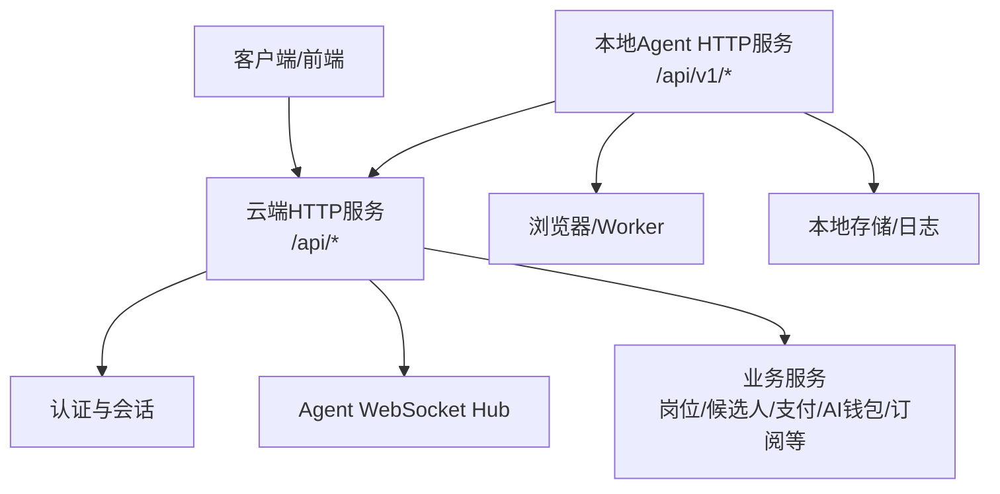
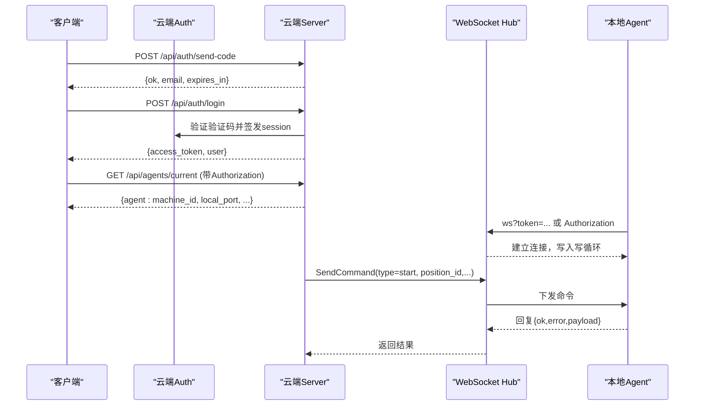
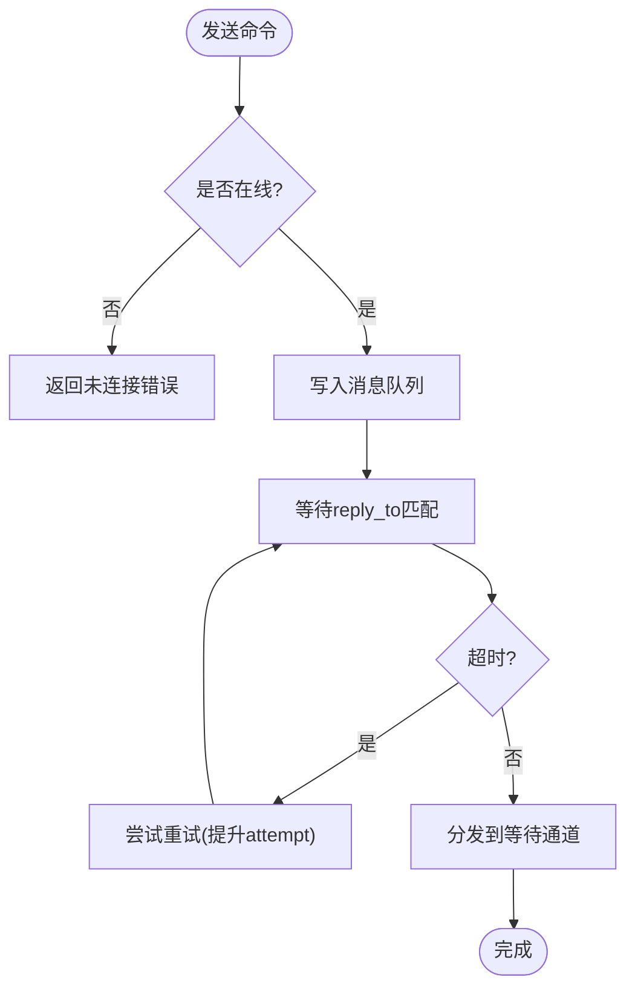
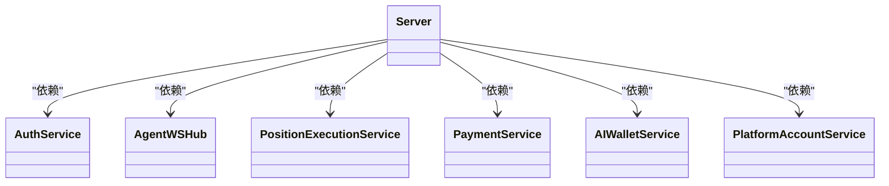

# API接口文档

<cite>
**本文引用的文件**
- [server.go](file://goodhr5/cloud/backend/internal/httpapi/server.go)
- [auth.go](file://goodhr5/cloud/backend/internal/httpapi/auth.go)
- [agent.go](file://goodhr5/cloud/backend/internal/httpapi/agent.go)
- [agent_ws.go](file://goodhr5/cloud/backend/internal/httpapi/agent_ws.go)
- [position_execution.go](file://goodhr5/cloud/backend/internal/httpapi/position_execution.go)
- [candidate.go](file://goodhr5/cloud/backend/internal/httpapi/candidate.go)
- [subscription.go](file://goodhr5/cloud/backend/internal/httpapi/subscription.go)
- [payment.go](file://goodhr5/cloud/backend/internal/httpapi/payment.go)
- [ai_wallet.go](file://goodhr5/cloud/backend/internal/httpapi/ai_wallet.go)
- [platform_account.go](file://goodhr5/cloud/backend/internal/httpapi/platform_account.go)
- [local_server.go](file://goodhr5/local-agent-go/internal/api/server.go)
- [agent_binding.go](file://goodhr5/local-agent-go/internal/api/agent_binding.go)
- [diagnostics.go](file://goodhr5/local-agent-go/internal/api/diagnostics.go)
</cite>

## 目录
1. [简介](#简介)
2. [项目结构](#项目结构)
3. [核心组件](#核心组件)
4. [架构总览](#架构总览)
5. [详细接口说明](#详细接口说明)
6. [依赖与关系分析](#依赖与关系分析)
7. [性能与安全](#性能与安全)
8. [故障排查指南](#故障排查指南)
9. [结论](#结论)
10. [附录：版本、兼容性与速率限制](#附录版本兼容性与速率限制)

## 简介
本文件为 GoodHR5 的完整 API 参考，覆盖云端 RESTful API、WebSocket 长连接、本地 Agent HTTP API 及认证机制。面向客户端开发者提供端点、请求参数、响应格式、错误码、状态码、示例与最佳实践，帮助快速集成云端与本地程序协同工作。

## 项目结构
GoodHR5 由云端后端与本地 Agent 两部分组成：
- 云端后端：基于 Go 的 HTTP 服务，集中注册路由、统一响应封装、鉴权中间件、业务服务编排。
- 本地 Agent：运行在用户机器上的进程，暴露本地 HTTP 接口，负责浏览器控制、任务执行、与云端通信。

图表来源
- [server.go:124-211](file://goodhr5/cloud/backend/internal/httpapi/server.go#L124-L211)
- [local_server.go:77-118](file://goodhr5/local-agent-go/internal/api/server.go#L77-L118)

章节来源
- [server.go:124-211](file://goodhr5/cloud/backend/internal/httpapi/server.go#L124-L211)
- [local_server.go:77-118](file://goodhr5/local-agent-go/internal/api/server.go#L77-L118)

## 核心组件
- 认证与会话：邮箱验证码登录、会话校验、角色判断、协议同意记录。
- 本地Agent绑定：云端记录当前账号绑定的稳定设备，用于启动岗位前校验。
- 岗位执行：云端接收本地程序的状态同步、开始/停止、失败通知、候选人同步。
- 候选人数据：统一的候选人对象模型，包含基础信息、详情、AI评分、时间戳等。
- 订阅与支付：套餐查询、订单创建、支付回调、会员权益发放。
- AI钱包：内置AI余额、流水、OpenAI兼容中转、按token扣费。
- 平台账号：仅保存名称与本地profile标识，不存明文cookie。
- 本地Agent HTTP：健康检查、诊断、任务生命周期、运行时管理、OCR、截图、下载管理等。

章节来源
- [auth.go:71-214](file://goodhr5/cloud/backend/internal/httpapi/auth.go#L71-L214)
- [agent.go:34-135](file://goodhr5/cloud/backend/internal/httpapi/agent.go#L34-L135)
- [position_execution.go:49-213](file://goodhr5/cloud/backend/internal/httpapi/position_execution.go#L49-L213)
- [candidate.go:126-143](file://goodhr5/cloud/backend/internal/httpapi/candidate.go#L126-L143)
- [subscription.go:62-119](file://goodhr5/cloud/backend/internal/httpapi/subscription.go#L62-L119)
- [payment.go:67-362](file://goodhr5/cloud/backend/internal/httpapi/payment.go#L67-L362)
- [ai_wallet.go:99-307](file://goodhr5/cloud/backend/internal/httpapi/ai_wallet.go#L99-L307)
- [platform_account.go:29-134](file://goodhr5/cloud/backend/internal/httpapi/platform_account.go#L29-L134)
- [local_server.go:137-321](file://goodhr5/local-agent-go/internal/api/server.go#L137-L321)

## 架构总览
云端通过统一路由注册所有REST端点，使用CORS中间件和writeJSON/writeError统一响应格式；认证服务提供SessionFromRequest解析Bearer token；WebSocket Hub维护每个用户的唯一在线Local Agent连接，支持命令发送与重试；本地Agent通过HTTP与云端交互，并通过WebSocket进行实时指令与状态上报。

图表来源
- [auth.go:121-214](file://goodhr5/cloud/backend/internal/httpapi/auth.go#L121-L214)
- [agent_ws.go:54-141](file://goodhr5/cloud/backend/internal/httpapi/agent_ws.go#L54-L141)
- [server.go:124-211](file://goodhr5/cloud/backend/internal/httpapi/server.go#L124-L211)

## 详细接口说明

### 通用约定
- 内容类型：application/json; charset=utf-8
- 成功响应：{ ok: true, data?: any }（本地Agent）或 { ok: true, ... }（云端）
- 错误响应：{ ok: false, error: string|object }（云端），本地Agent错误体含 code 与 message
- 认证方式：Authorization: Bearer <access_token>
- CORS：云端允许跨域，本地Agent限制Origin

章节来源
- [server.go:261-277](file://goodhr5/cloud/backend/internal/httpapi/server.go#L261-L277)
- [local_server.go:304-321](file://goodhr5/local-agent-go/internal/api/server.go#L304-L321)

### 认证与会话
- POST /api/auth/send-code
  - 请求体：{ email: string }
  - 响应：{ ok: true, email: string, expires_in: number, debug_code?: string }
  - 说明：生成4位验证码，有效期5分钟；可配置调试模式返回验证码
- POST /api/auth/login
  - 请求体：{ email: string, code: string, inviter_id?: string, agreement_accepted: boolean }
  - 响应：{ ok: true, access_token: string, token_type: "Bearer", expires_in: number, user: object }
  - 说明：校验验证码，创建会话，记录登录活动，首次登录可能赠送试用会员
- GET /api/auth/me
  - 响应：{ ok: true, user: object, session: { created_at, expires_at }, show_trial_welcome: boolean }
- GET /api/auth/agreement-status?email=...
  - 响应：{ ok: true, agreement_accepted: boolean }
- POST /api/auth/trial-welcome/ack
  - 响应：{ ok: true }

章节来源
- [auth.go:71-214](file://goodhr5/cloud/backend/internal/httpapi/auth.go#L71-L214)
- [auth.go:216-302](file://goodhr5/cloud/backend/internal/httpapi/auth.go#L216-L302)
- [auth.go:257-278](file://goodhr5/cloud/backend/internal/httpapi/auth.go#L257-L278)

### 本地Agent绑定与状态
- POST /api/agents/bind
  - 请求体：{ machine_id: string, agent_version: string, local_port: number, public_key: string }
  - 响应：{ ok: true, agent: { machine_id, agent_version, local_port, public_key, bind_status, last_seen_at } }
  - 说明：绑定当前登录用户的稳定设备，冲突时返回DEVICE_ALREADY_BOUND
- GET /api/agents/current
  - 响应：{ ok: true, agent: object|null }
- GET /api/agents/ws-status
  - 响应：{ ok: true, connected: boolean }

章节来源
- [agent.go:34-135](file://goodhr5/cloud/backend/internal/httpapi/agent.go#L34-L135)
- [agent_ws.go:82-97](file://goodhr5/cloud/backend/internal/httpapi/agent_ws.go#L82-L97)

### WebSocket：云端与本地Agent通信
- 连接地址：/api/agents/ws
  - 认证：URL参数 token 或 Authorization: Bearer
  - 行为：同一用户只保留一个在线连接，新连接替换旧连接
- 消息协议：AgentWSMessage
  - 字段：message_id, reply_to?, type, position_id?, attempt?, ok?, error?, payload?
  - 语义：云端发送命令，本地Agent回复reply_to=message_id；自动ack未携带reply_to的消息
- 超时与重试：默认90秒回复超时，支持attempt递增的重试
- 事件类型：由type字段区分，例如 start/stop/status/sync 等（具体由调用方约定）

图表来源
- [agent_ws.go:111-141](file://goodhr5/cloud/backend/internal/httpapi/agent_ws.go#L111-L141)
- [agent_ws.go:325-350](file://goodhr5/cloud/backend/internal/httpapi/agent_ws.go#L325-L350)

章节来源
- [agent_ws.go:54-141](file://goodhr5/cloud/backend/internal/httpapi/agent_ws.go#L54-L141)
- [agent_ws.go:194-230](file://goodhr5/cloud/backend/internal/httpapi/agent_ws.go#L194-L230)
- [agent_ws.go:325-350](file://goodhr5/cloud/backend/internal/httpapi/agent_ws.go#L325-L350)

### 岗位执行（云端）
- POST /api/positions/:id/start
  - 请求体：{ task_type: string, machine_id: string }
  - 响应：{ ok: true, status: "running" }
  - 说明：校验会话、岗位归属、设备绑定、会员与AI余额、占用名额
- POST /api/positions/:id/stop
  - 响应：{ ok: true, status: "stopped" }
- POST /api/positions/:id/status
  - 请求体：{ status: "running"|"completed"|"stopped", task_type?, run_greeted_count?, run_skipped_count?, machine_id? }
  - 响应：{ ok: true, status, notice_sent: boolean }
- POST /api/fail-notice
  - 请求体：{ position_id: string, error_message: string, run_greeted_count?, run_skipped_count? }
  - 响应：{ ok: true, status: "notified" }
- GET /api/positions/:id/logs
  - 响应：岗位运行日志列表
- GET /api/positions/:id/candidates
  - 响应：该岗位下的候选人列表
- POST /api/positions/:id/processed-resumes
  - 作用：补充已处理简历信息
- POST /api/positions/:id/counts
  - 作用：同步岗位计数

章节来源
- [server.go:214-245](file://goodhr5/cloud/backend/internal/httpapi/server.go#L214-L245)
- [position_execution.go:49-213](file://goodhr5/cloud/backend/internal/httpapi/position_execution.go#L49-L213)
- [position_execution.go:311-371](file://goodhr5/cloud/backend/internal/httpapi/position_execution.go#L311-L371)

### 候选人数据模型
- Candidate：统一对象，包含ID、平台ID、姓名、基本信息、教育、证书、荣誉、项目经验、沟通记录、附件、详情、AI评分、运行时信息、时间戳、扩展字段
- 用途：本地程序抓取后同步至云端，供团队共享查看

章节来源
- [candidate.go:126-143](file://goodhr5/cloud/backend/internal/httpapi/candidate.go#L126-L143)

### 订阅与套餐
- GET /api/subscription/status
  - 响应：{ ok: true, subscription: { member_type, member_name, expires_at, active } }
- GET /api/subscription/plans
  - 响应：{ ok: true, plans: [...] }

章节来源
- [subscription.go:62-119](file://goodhr5/cloud/backend/internal/httpapi/subscription.go#L62-L119)

### 支付与订单
- POST /api/payment/orders
  - 作用：创建订阅支付订单或升级订单
  - 请求体：{ plan_id: string }
  - 响应：{ ok: true, order: {...}, payment?: {...} }
- POST /api/payment/ai-balance
  - 作用：创建AI余额充值订单
  - 请求体：{ amount_cents?: number, amount_yuan?: string }
  - 响应：{ ok: true, order: {...}, payment?: {...} }
- GET /api/payment/orders
  - 作用：列出当前用户订单
- GET /api/payment/orders/:order_no
  - 作用：获取订单详情，若待支付且未过期会主动查单
- POST /api/payment/notify/wechat
  - 作用：微信支付回调入口，返回微信要求的SUCCESS/FAIL
- GET /api/admin/payment/orders
  - 作用：管理员查看所有订单

章节来源
- [payment.go:67-362](file://goodhr5/cloud/backend/internal/httpapi/payment.go#L67-L362)
- [payment.go:364-405](file://goodhr5/cloud/backend/internal/httpapi/payment.go#L364-L405)
- [payment.go:407-485](file://goodhr5/cloud/backend/internal/httpapi/payment.go#L407-L485)
- [payment.go:562-595](file://goodhr5/cloud/backend/internal/httpapi/payment.go#L562-L595)

### AI钱包与兼容接口
- GET /api/ai-wallet
  - 响应：{ ok: true, balance_units, balance_cents, balance, default_recharge_cents, default_model, public_base_url, models }
- GET /api/ai-wallet/records?page=&page_size=
  - 响应：{ ok: true, email, records: [...], total, page, pageSize }
- POST /api/ai-wallet/use-builtin
  - 作用：切换为系统内置AI，并返回配置与余额
- POST /api/ai-compatible/v1/chat/completions
  - 作用：OpenAI兼容中转，按token用量扣费，支持流式输出
  - 认证：Authorization: Bearer <ghai_...>
  - 说明：读取上游配置，重写模型，转发请求，提取usage并扣费

章节来源
- [ai_wallet.go:99-307](file://goodhr5/cloud/backend/internal/httpapi/ai_wallet.go#L99-L307)
- [ai_wallet.go:328-415](file://goodhr5/cloud/backend/internal/httpapi/ai_wallet.go#L328-L415)
- [ai_wallet.go:417-460](file://goodhr5/cloud/backend/internal/httpapi/ai_wallet.go#L417-L460)

### 平台账号
- GET /api/platform-accounts
  - 响应：{ ok: true, accounts: [...] }
- POST /api/platform-accounts/create
  - 请求体：{ platform_id: string, display_name: string, local_profile_id?: string, profile_id?: string }
  - 响应：{ ok: true, account: {...} }
- DELETE /api/platform-accounts/:account_id
  - 响应：{ ok: true }

章节来源
- [platform_account.go:29-134](file://goodhr5/cloud/backend/internal/httpapi/platform_account.go#L29-L134)

### 系统配置与公共能力
- GET /health
  - 响应：{ ok: true, name: "GoodHR 5 Cloud API", version: "0.1.0" }
- GET /api/system/app-config
  - 响应：{ ok: true, config: {...} }
- GET /api/system/local-agent-updates
  - 响应：{ ok: true, local_agent: [...] }
- GET /api/system/local-agent-console-url
  - 响应：{ ok: true, url: string }
- GET /api/platforms/config/
  - 响应：{ ok: true, configs: [...] }
- GET /api/public/stats/today
  - 作用：公开统计
- 上传静态资源：/uploads/...

章节来源
- [server.go:247-372](file://goodhr5/cloud/backend/internal/httpapi/server.go#L247-L372)
- [server.go:374-421](file://goodhr5/cloud/backend/internal/httpapi/server.go#L374-L421)
- [server.go:445-544](file://goodhr5/cloud/backend/internal/httpapi/server.go#L445-L544)

### 本地Agent HTTP API
- GET /health
  - 响应：{ ok: true, data: { status, version, agent_version, port, dataDir, logsDir, profilesDir, extensionsDir, downloadsDir, screenshotsDir, dbPath } }
- GET /api/v1/diagnostics
  - 响应：{ ok: true, data: { checkedAt, os, arch, host, port, paths, ports, runtime, profileLocks, recommendations } }
- POST /api/v1/session/bind
  - 作用：将浏览器Token提交给本地程序，由其调用云端完成设备绑定
  - 请求体：{ token: string }
  - 响应：{ ok: true, data: binding }
- 任务管理
  - POST /api/v1/tasks/start
  - POST /api/v1/tasks/stop
  - GET /api/v1/tasks/{task_id}
- 运行时管理
  - GET /api/v1/runtime/status
  - POST /api/v1/runtime/ensure
  - POST /api/v1/runtime/install
- 浏览器与工作进程
  - GET /api/v1/browser/status
  - POST /api/v1/browser/stop
  - POST /api/v1/worker/start
  - POST /api/v1/worker/stop
  - GET /api/v1/worker/status
- 页面操作
  - POST /api/v1/page/open
  - GET /api/v1/page/url
- OCR
  - GET /api/v1/local/ocr/status
  - POST /api/v1/local/ocr/recognize
- 规则
  - GET /api/v1/local/rules/status
  - POST /api/v1/local/rules/update
- 截图
  - GET /api/v1/local/screenshots
  - POST /api/v1/local/screenshots
- 应用更新
  - GET /api/v1/app-update/status
  - POST /api/v1/app-update/start
- 下载管理
  - GET /api/v1/downloads
  - GET /api/v1/downloads/history
  - POST /api/v1/downloads/configure
  - POST /api/v1/downloads/clear
- 文件操作
  - POST /api/v1/files/open
  - POST /api/v1/files/reveal

章节来源
- [local_server.go:137-321](file://goodhr5/local-agent-go/internal/api/server.go#L137-L321)
- [agent_binding.go:18-54](file://goodhr5/local-agent-go/internal/api/agent_binding.go#L18-L54)
- [diagnostics.go:84-104](file://goodhr5/local-agent-go/internal/api/diagnostics.go#L84-L104)

## 依赖与关系分析
- 云端路由集中注册，各业务模块以Service形式注入，便于测试与替换实现。
- 认证服务被多个模块复用，保证会话一致性与权限控制。
- WebSocket Hub维护用户级连接，避免多连接冲突，并提供可靠命令收发。
- 本地Agent通过HTTP与云端交互，同时使用WebSocket进行实时控制。

图表来源
- [server.go:16-44](file://goodhr5/cloud/backend/internal/httpapi/server.go#L16-L44)

章节来源
- [server.go:16-44](file://goodhr5/cloud/backend/internal/httpapi/server.go#L16-L44)

## 性能与安全
- 性能
  - 统一响应封装减少重复逻辑
  - WebSocket命令带重试与超时，提高可靠性
  - 支付与订阅采用幂等发放，避免重复到账
  - AI兼容接口支持流式响应，降低首字节延迟
- 安全
  - 认证：Bearer token，会话有效期30天
  - 设备绑定：启动岗位前校验稳定设备，防止越权
  - CORS：云端开放，本地Agent限制Origin
  - 敏感数据：平台账号不存明文cookie，仅存名称与profile标识
  - 输入校验：严格JSON解码，拒绝未知字段，限制请求体大小

章节来源
- [auth.go:17-19](file://goodhr5/cloud/backend/internal/httpapi/auth.go#L17-L19)
- [agent.go:59-80](file://goodhr5/cloud/backend/internal/httpapi/agent.go#L59-L80)
- [platform_account.go:11-13](file://goodhr5/cloud/backend/internal/httpapi/platform_account.go#L11-L13)
- [local_server.go:304-340](file://goodhr5/local-agent-go/internal/api/server.go#L304-L340)
- [ai_wallet.go:233-237](file://goodhr5/cloud/backend/internal/httpapi/ai_wallet.go#L233-L237)

## 故障排查指南
- 常见错误码与含义
  - METHOD_NOT_ALLOWED：请求方法不支持
  - INVALID_REQUEST：请求体无效或缺少必填字段
  - SESSION_EXPIRED：会话失效或未登录
  - DEVICE_BINDING_REQUIRED：未绑定稳定设备
  - POSITION_TASK_CONFLICT：已有岗位在运行
  - SUBSCRIPTION_REQUIRED：会员不足
  - AUTO_REPLY_MAX_REQUIRED：自动回复需Max套餐
  - AI_BALANCE_INSUFFICIENT：AI余额不足
  - PAYMENT_PROVIDER_NOT_CONFIGURED：支付提供商未配置
  - BROWSER_STATUS_FAILED：浏览器状态查询失败
  - RUNTIME_NOT_READY：运行环境未就绪
- 定位步骤
  - 先调用 /health 确认服务在线
  - 调用 /api/auth/me 确认会话有效
  - 调用 /api/agents/ws-status 确认WebSocket在线
  - 调用 /api/v1/diagnostics 检查本地环境与端口占用
  - 查看岗位日志 /api/positions/:id/logs 与失败通知 /api/fail-notice

章节来源
- [position_execution.go:215-275](file://goodhr5/cloud/backend/internal/httpapi/position_execution.go#L215-L275)
- [payment.go:341-362](file://goodhr5/cloud/backend/internal/httpapi/payment.go#L341-L362)
- [local_server.go:220-278](file://goodhr5/local-agent-go/internal/api/server.go#L220-L278)
- [diagnostics.go:84-104](file://goodhr5/local-agent-go/internal/api/diagnostics.go#L84-L104)

## 结论
GoodHR5 提供了完整的云端与本地协同API体系：云端负责认证、业务编排与持久化，本地Agent负责浏览器自动化与任务执行。通过WebSocket实现可靠指令通道，结合严格的设备绑定与权限控制，保障运行安全。建议客户端遵循统一响应格式、正确携带认证头、合理重试与超时策略，并在集成前充分测试健康检查与诊断接口。

## 附录：版本、兼容性与速率限制
- 版本管理
  - 云端健康接口返回版本号，便于客户端适配
  - 本地Agent提供独立健康接口，便于部署监控
- 向后兼容
  - 新增字段通常以可选形式出现，客户端应忽略未知字段
  - 错误码保持稳定，新增错误码需配合文档更新
- 速率限制
  - 代码中未发现显式限流器；建议在网关层或云服务层实施限流策略
  - 对高频接口（如AI兼容中转、支付回调）建议增加限流与熔断保护

章节来源
- [server.go:247-259](file://goodhr5/cloud/backend/internal/httpapi/server.go#L247-L259)
- [local_server.go:137-161](file://goodhr5/local-agent-go/internal/api/server.go#L137-L161)