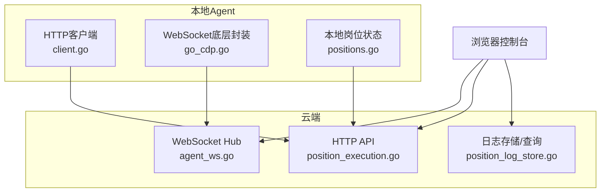
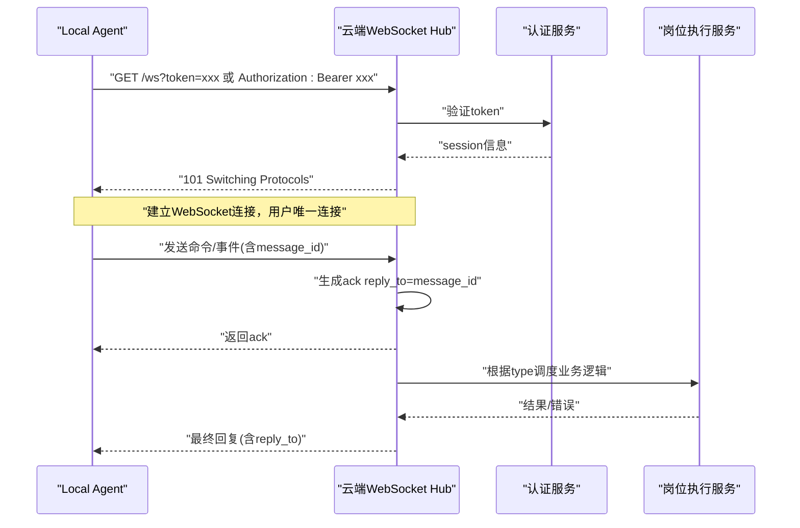
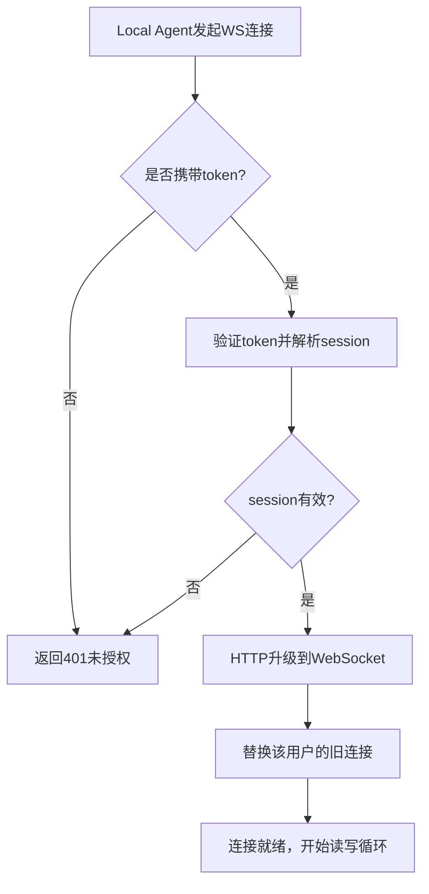
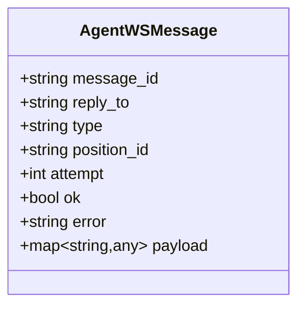
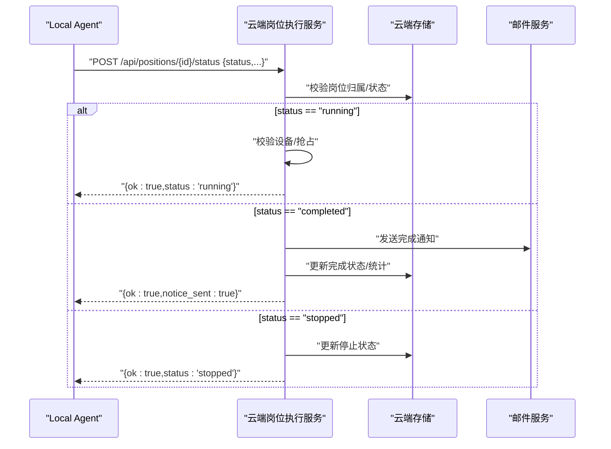
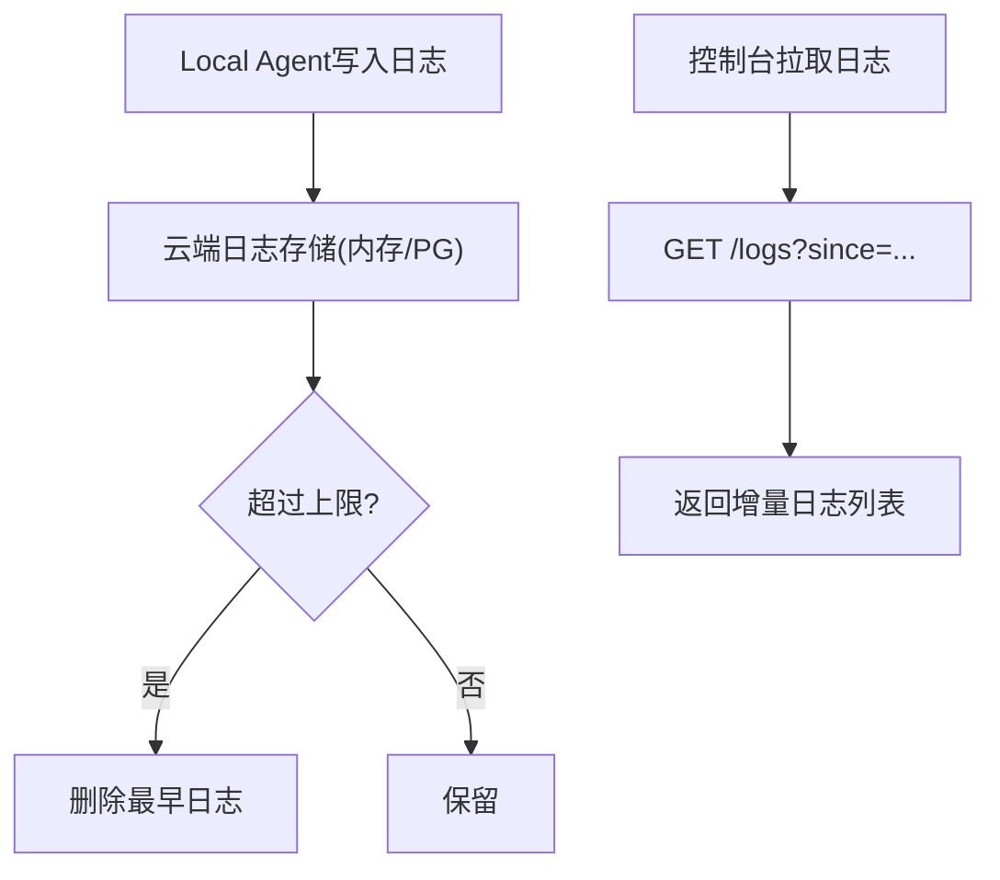
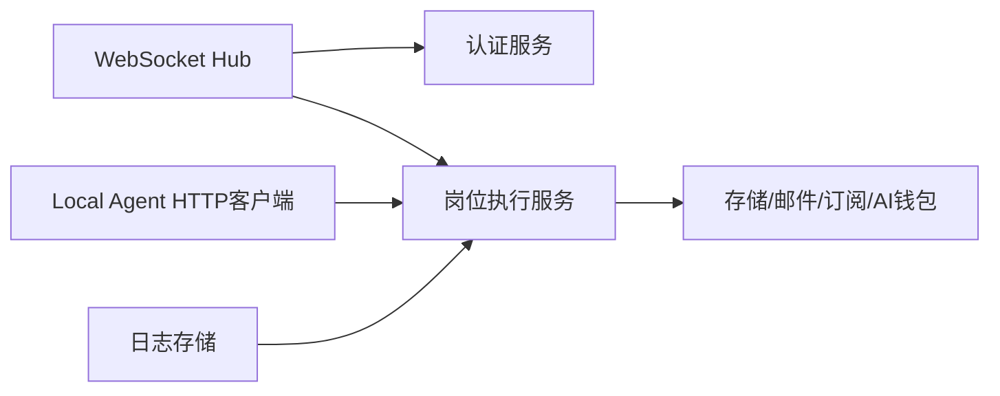

# WebSocket实时通信

<cite>
**本文引用的文件**
- [agent_ws.go](file://goodhr5/cloud/backend/internal/httpapi/agent_ws.go)
- [client.go](file://goodhr5/local-agent-go/internal/cloudapi/client.go)
- [position_execution.go](file://goodhr5/cloud/backend/internal/httpapi/position_execution.go)
- [positions.go](file://goodhr5/local-agent-go/internal/localdb/positions.go)
- [position_log_store.go](file://goodhr5/cloud/backend/internal/httpapi/position_log_store.go)
- [position_log_test.go](file://goodhr5/cloud/backend/internal/httpapi/position_log_test.go)
- [cloud-control-local-agent-architecture.md](file://docs/cloud-control-local-agent-architecture.md)
- [go_cdp.go](file://goodhr5/local-agent-go/internal/browser/go_cdp.go)
</cite>

## 目录
1. [简介](#简介)
2. [项目结构](#项目结构)
3. [核心组件](#核心组件)
4. [架构总览](#架构总览)
5. [详细组件分析](#详细组件分析)
6. [依赖关系分析](#依赖关系分析)
7. [性能与可靠性](#性能与可靠性)
8. [故障排查指南](#故障排查指南)
9. [结论](#结论)
10. [附录：客户端集成与调试](#附录客户端集成与调试)

## 简介
本文件面向本地Agent与云端之间的WebSocket实时通信协议，覆盖连接建立、认证握手、消息格式、事件类型、状态同步机制、断线重连与心跳检测方案、安全考虑（访问控制、加密建议）、以及客户端集成与调试要点。文档内容基于仓库中已实现的云端WebSocket Hub、HTTP状态同步接口、日志拉取接口及本地Agent HTTP客户端等代码进行归纳与扩展说明。

## 项目结构
- 云端后端提供WebSocket Hub用于接收Local Agent的长连接，并实现命令下发、请求-回复确认与重试。
- Local Agent通过HTTP API向云端上报岗位运行状态、统计与日志；同时可通过WebSocket与云端保持双向通信。
- 前端控制台通过HTTP接口获取日志与状态，结合WebSocket实现实时展示。

图表来源
- [agent_ws.go:54-80](file://goodhr5/cloud/backend/internal/httpapi/agent_ws.go#L54-L80)
- [position_execution.go:125-200](file://goodhr5/cloud/backend/internal/httpapi/position_execution.go#L125-L200)
- [position_log_store.go:140-195](file://goodhr5/cloud/backend/internal/httpapi/position_log_store.go#L140-L195)
- [client.go:309-340](file://goodhr5/local-agent-go/internal/cloudapi/client.go#L309-L340)
- [go_cdp.go:148-195](file://goodhr5/local-agent-go/internal/browser/go_cdp.go#L148-L195)

章节来源
- [agent_ws.go:54-80](file://goodhr5/cloud/backend/internal/httpapi/agent_ws.go#L54-L80)
- [client.go:309-340](file://goodhr5/local-agent-go/internal/cloudapi/client.go#L309-L340)
- [position_execution.go:125-200](file://goodhr5/cloud/backend/internal/httpapi/position_execution.go#L125-L200)
- [position_log_store.go:140-195](file://goodhr5/cloud/backend/internal/httpapi/position_log_store.go#L140-L195)
- [go_cdp.go:148-195](file://goodhr5/local-agent-go/internal/browser/go_cdp.go#L148-L195)

## 核心组件
- 云端WebSocket Hub：负责Local Agent连接管理、鉴权、消息路由、请求-回复匹配与重试。
- 统一消息体：定义message_id、reply_to、type、position_id、attempt、ok、error、payload等字段。
- 本地Agent HTTP客户端：负责调用云端HTTP接口上报状态、统计、失败通知等。
- 岗位执行服务：处理启动、停止、状态同步、完成通知与日志写入。
- 日志存储与查询：支持增量拉取（since）与按岗位聚合统计。

章节来源
- [agent_ws.go:21-32](file://goodhr5/cloud/backend/internal/httpapi/agent_ws.go#L21-L32)
- [agent_ws.go:111-141](file://goodhr5/cloud/backend/internal/httpapi/agent_ws.go#L111-L141)
- [client.go:309-340](file://goodhr5/local-agent-go/internal/cloudapi/client.go#L309-L340)
- [position_execution.go:49-91](file://goodhr5/cloud/backend/internal/httpapi/position_execution.go#L49-L91)
- [position_log_store.go:140-195](file://goodhr5/cloud/backend/internal/httpapi/position_log_store.go#L140-L195)

## 架构总览
- 连接建立：Local Agent以携带token的方式发起WebSocket升级，云端校验session后建立连接，同一用户仅保留一条在线连接。
- 认证握手：通过URL参数或Authorization头传递token，服务端解析session并绑定到连接。
- 消息协议：统一JSON消息体，支持请求-回复模式与ack确认；云端对带message_id的消息自动回发ack。
- 状态同步：Local Agent通过HTTP接口上报running/completed/stopped状态与统计；云端持久化并触发通知。
- 日志流式传输：Local Agent通过HTTP写入日志，控制台通过HTTP增量拉取；未来可叠加WebSocket推送。
- 连接管理：Hub维护用户级连接映射，新连接替换旧连接；读写循环分离，写队列限流，关闭时清理资源。

图表来源
- [agent_ws.go:54-80](file://goodhr5/cloud/backend/internal/httpapi/agent_ws.go#L54-L80)
- [agent_ws.go:194-230](file://goodhr5/cloud/backend/internal/httpapi/agent_ws.go#L194-L230)
- [position_execution.go:125-200](file://goodhr5/cloud/backend/internal/httpapi/position_execution.go#L125-L200)

## 详细组件分析

### WebSocket连接与认证
- 连接入口：Local Agent主动连接云端WebSocket端点，支持两种认证方式：
  - URL参数 token
  - HTTP头 Authorization: Bearer <token>
- 会话校验：服务端从token解析session，若无效则拒绝升级。
- 连接复用：同一用户只保留一个在线连接，新连接会替换旧连接，旧连接被强制关闭。

图表来源
- [agent_ws.go:54-80](file://goodhr5/cloud/backend/internal/httpapi/agent_ws.go#L54-L80)
- [agent_ws.go:143-169](file://goodhr5/cloud/backend/internal/httpapi/agent_ws.go#L143-L169)

章节来源
- [agent_ws.go:54-80](file://goodhr5/cloud/backend/internal/httpapi/agent_ws.go#L54-L80)
- [agent_ws.go:143-169](file://goodhr5/cloud/backend/internal/httpapi/agent_ws.go#L143-L169)

### 统一消息协议
- 消息体字段：
  - message_id：请求唯一标识
  - reply_to：回复对应哪条请求
  - type：消息类型（如命令、事件、ack后缀）
  - position_id：岗位运行ID（岗位相关消息必填）
  - attempt：重试次数
  - ok：是否成功
  - error：错误信息
  - payload：业务负载（键值对）
- 自动ack：服务端收到带message_id的消息会自动回发类型为“原类型.ack”的确认消息。
- 请求-回复：云端SendCommand为命令下发，等待Local Agent回复；超时重试并递增attempt。

图表来源
- [agent_ws.go:21-32](file://goodhr5/cloud/backend/internal/httpapi/agent_ws.go#L21-L32)
- [agent_ws.go:194-230](file://goodhr5/cloud/backend/internal/httpapi/agent_ws.go#L194-L230)
- [agent_ws.go:325-350](file://goodhr5/cloud/backend/internal/httpapi/agent_ws.go#L325-L350)

章节来源
- [agent_ws.go:21-32](file://goodhr5/cloud/backend/internal/httpapi/agent_ws.go#L21-L32)
- [agent_ws.go:194-230](file://goodhr5/cloud/backend/internal/httpapi/agent_ws.go#L194-L230)
- [agent_ws.go:325-350](file://goodhr5/cloud/backend/internal/httpapi/agent_ws.go#L325-L350)

### 事件类型与消息结构
- 命令类：云端向Local Agent下发的操作指令，例如启动/停止任务、打开页面、截图、OCR等。
- 事件类：Local Agent上报的运行事件，如岗位状态变更、候选人抓取、详情读取、截图/OCR结果等。
- Ack类：服务端自动生成的确认消息，类型为“原类型.ack”。
- 通用结构：所有消息遵循统一消息体，岗位相关消息必须包含position_id。

章节来源
- [agent_ws.go:21-32](file://goodhr5/cloud/backend/internal/httpapi/agent_ws.go#L21-L32)
- [agent_ws.go:194-230](file://goodhr5/cloud/backend/internal/httpapi/agent_ws.go#L194-L230)

### 状态同步机制
- Local Agent通过HTTP接口上报岗位运行状态：
  - 状态值：running、completed、stopped
  - 附加字段：task_type、run_greeted_count、run_skipped_count、machine_id
- 云端处理：
  - running：校验设备与抢占，记录流程节点，返回ok
  - completed：发送邮件通知，更新完成状态，写入日志
  - stopped：更新状态，写入日志，必要时发送邮件
- 本地数据库：Local Agent维护本地岗位状态与快照，便于离线恢复与展示。

图表来源
- [position_execution.go:125-200](file://goodhr5/cloud/backend/internal/httpapi/position_execution.go#L125-L200)
- [client.go:309-340](file://goodhr5/local-agent-go/internal/cloudapi/client.go#L309-L340)

章节来源
- [position_execution.go:125-200](file://goodhr5/cloud/backend/internal/httpapi/position_execution.go#L125-L200)
- [client.go:309-340](file://goodhr5/local-agent-go/internal/cloudapi/client.go#L309-L340)
- [positions.go:141-199](file://goodhr5/local-agent-go/internal/localdb/positions.go#L141-L199)

### 日志流式传输
- 写入：Local Agent通过HTTP接口写入岗位日志，云端内存/Postgres存储并按岗位限制数量。
- 拉取：控制台通过HTTP GET /api/positions/{id}/logs?since=<时间戳>增量拉取新日志。
- 聚合：云端按岗位统计扫描、打招呼、跳过、失败次数，便于仪表盘展示。

图表来源
- [position_log_store.go:140-195](file://goodhr5/cloud/backend/internal/httpapi/position_log_store.go#L140-L195)
- [position_log_test.go:118-163](file://goodhr5/cloud/backend/internal/httpapi/position_log_test.go#L118-L163)

章节来源
- [position_log_store.go:140-195](file://goodhr5/cloud/backend/internal/httpapi/position_log_store.go#L140-L195)
- [position_log_test.go:118-163](file://goodhr5/cloud/backend/internal/httpapi/position_log_test.go#L118-L163)

### 连接管理与断线重连
- 连接生命周期：读循环负责接收消息，写循环负责发送消息；任一方向出错即关闭连接并清理。
- 单连接策略：同一用户仅保留一条在线连接，新连接替换旧连接，避免多实例冲突。
- 请求-回复与重试：云端SendCommand带超时与重试，attempt递增，便于定位问题。
- 断线重连建议：
  - Local Agent侧：指数退避重连，最大重试次数限制；每次重连前刷新token。
  - 云端侧：无需显式心跳，但可在业务层周期性发送轻量ping消息，Local Agent回pong。

章节来源
- [agent_ws.go:194-230](file://goodhr5/cloud/backend/internal/httpapi/agent_ws.go#L194-L230)
- [agent_ws.go:325-350](file://goodhr5/cloud/backend/internal/httpapi/agent_ws.go#L325-L350)
- [agent_ws.go:395-413](file://goodhr5/cloud/backend/internal/httpapi/agent_ws.go#L395-L413)

### 心跳检测
- 当前实现：代码未内置显式心跳帧；可通过业务消息实现心跳（例如每N秒发送type="heartbeat"的空payload）。
- 建议方案：
  - Local Agent定时发送心跳，云端记录最后活跃时间，用于监控与告警。
  - 云端在空闲超时后主动断开连接，释放资源。
  - 心跳间隔与超时阈值需根据网络环境与业务需求配置。

章节来源
- [agent_ws.go:194-230](file://goodhr5/cloud/backend/internal/httpapi/agent_ws.go#L194-L230)

### 安全考虑
- 访问控制：
  - WebSocket连接必须携带有效token，否则拒绝升级。
  - 岗位相关操作需校验用户归属与权限。
- 传输安全：
  - 建议使用HTTPS/WSS，防止中间人攻击。
  - token应短期有效，配合刷新机制。
- 数据保护：
  - 敏感字段（如cookie、加密密钥）仅在必要范围内传输，并在日志摘要中脱敏。
  - 本地Agent仅监听127.0.0.1，避免公网暴露。

章节来源
- [agent_ws.go:54-80](file://goodhr5/cloud/backend/internal/httpapi/agent_ws.go#L54-L80)
- [cloud-control-local-agent-architecture.md:547-578](file://docs/cloud-control-local-agent-architecture.md#L547-L578)

## 依赖关系分析
- 云端WebSocket Hub依赖认证服务与会话管理。
- 岗位执行服务依赖存储、邮件、订阅、AI钱包等子系统。
- Local Agent HTTP客户端依赖云端REST接口，用于状态同步与统计上报。
- 日志存储支持内存与Postgres两种实现，提供增量查询能力。

图表来源
- [agent_ws.go:54-80](file://goodhr5/cloud/backend/internal/httpapi/agent_ws.go#L54-L80)
- [position_execution.go:21-47](file://goodhr5/cloud/backend/internal/httpapi/position_execution.go#L21-L47)
- [client.go:309-340](file://goodhr5/local-agent-go/internal/cloudapi/client.go#L309-L340)
- [position_log_store.go:140-195](file://goodhr5/cloud/backend/internal/httpapi/position_log_store.go#L140-L195)

章节来源
- [agent_ws.go:54-80](file://goodhr5/cloud/backend/internal/httpapi/agent_ws.go#L54-L80)
- [position_execution.go:21-47](file://goodhr5/cloud/backend/internal/httpapi/position_execution.go#L21-L47)
- [client.go:309-340](file://goodhr5/local-agent-go/internal/cloudapi/client.go#L309-L340)
- [position_log_store.go:140-195](file://goodhr5/cloud/backend/internal/httpapi/position_log_store.go#L140-L195)

## 性能与可靠性
- 写队列限流：每个连接维护固定容量写队列，避免背压导致内存膨胀。
- 超时重试：云端命令下发设置超时与重试次数，提升弱网环境下的成功率。
- 日志裁剪：按岗位限制日志数量，避免无限增长影响性能。
- 单连接策略：减少并发连接带来的资源竞争与管理复杂度。

章节来源
- [agent_ws.go:352-366](file://goodhr5/cloud/backend/internal/httpapi/agent_ws.go#L352-L366)
- [agent_ws.go:111-141](file://goodhr5/cloud/backend/internal/httpapi/agent_ws.go#L111-L141)
- [position_log_store.go:162-195](file://goodhr5/cloud/backend/internal/httpapi/position_log_store.go#L162-L195)

## 故障排查指南
- 连接失败：检查token是否有效、网络是否可达、CORS/PNA配置是否正确。
- 无响应：查看readLoop/writeLoop日志，确认是否出现读写错误或队列满。
- 状态不同步：核对HTTP状态上报接口返回值与云端处理逻辑，确认岗位归属与权限。
- 日志缺失：确认写入接口是否成功，拉取时使用正确的since时间戳。

章节来源
- [agent_ws.go:194-230](file://goodhr5/cloud/backend/internal/httpapi/agent_ws.go#L194-L230)
- [position_log_test.go:118-163](file://goodhr5/cloud/backend/internal/httpapi/position_log_test.go#L118-L163)

## 结论
本项目实现了云端与Local Agent之间基于WebSocket的双向通信与基于HTTP的状态同步、日志上报。协议设计简洁清晰，具备请求-回复确认、重试机制与单连接策略，满足岗位运行状态推送、日志流式传输与任务进度更新等核心场景。建议在现有基础上补充显式心跳、WSS加密与更细粒度的访问控制，以提升安全性与稳定性。

## 附录：客户端集成与调试
- 连接建立：
  - 使用WebSocket客户端库连接云端端点，携带token（URL参数或Authorization头）。
  - 监听连接事件，处理101切换与错误码。
- 消息发送：
  - 构造统一消息体，包含message_id、type、position_id、payload。
  - 对于需要回复的命令，等待reply_to匹配的回复，设置超时与重试。
- 状态同步：
  - 通过HTTP接口上报running/completed/stopped状态与统计。
  - 使用增量拉取接口获取日志，注意since参数的时间格式。
- 调试工具：
  - 使用浏览器开发者工具的Network面板查看WebSocket帧。
  - 使用curl或HTTP客户端测试状态与日志接口。
  - 关注服务端日志中的message_id、reply_to、attempt等关键字段。

章节来源
- [agent_ws.go:54-80](file://goodhr5/cloud/backend/internal/httpapi/agent_ws.go#L54-L80)
- [position_log_test.go:118-163](file://goodhr5/cloud/backend/internal/httpapi/position_log_test.go#L118-L163)
- [client.go:309-340](file://goodhr5/local-agent-go/internal/cloudapi/client.go#L309-L340)