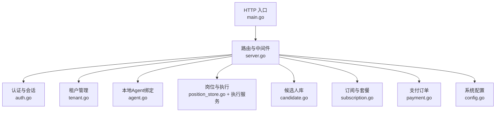
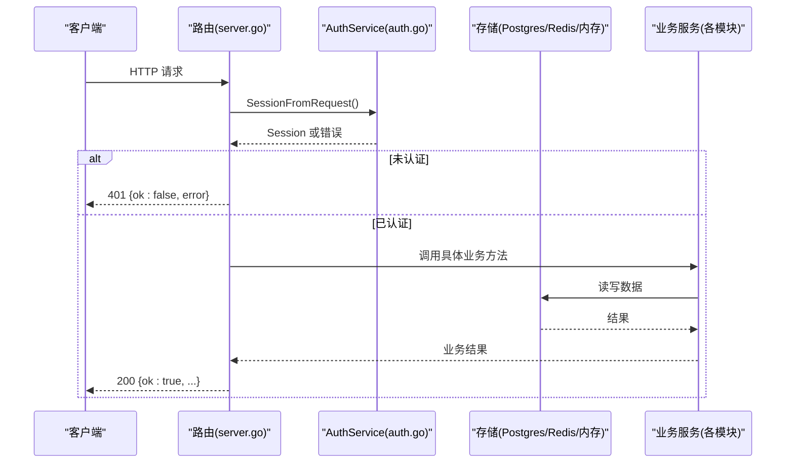
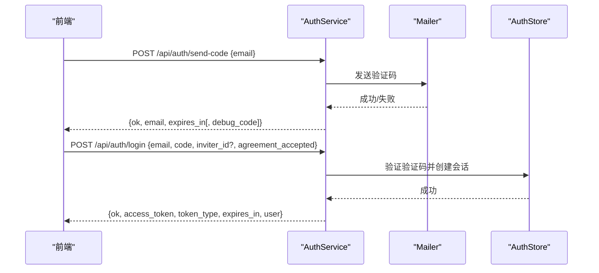
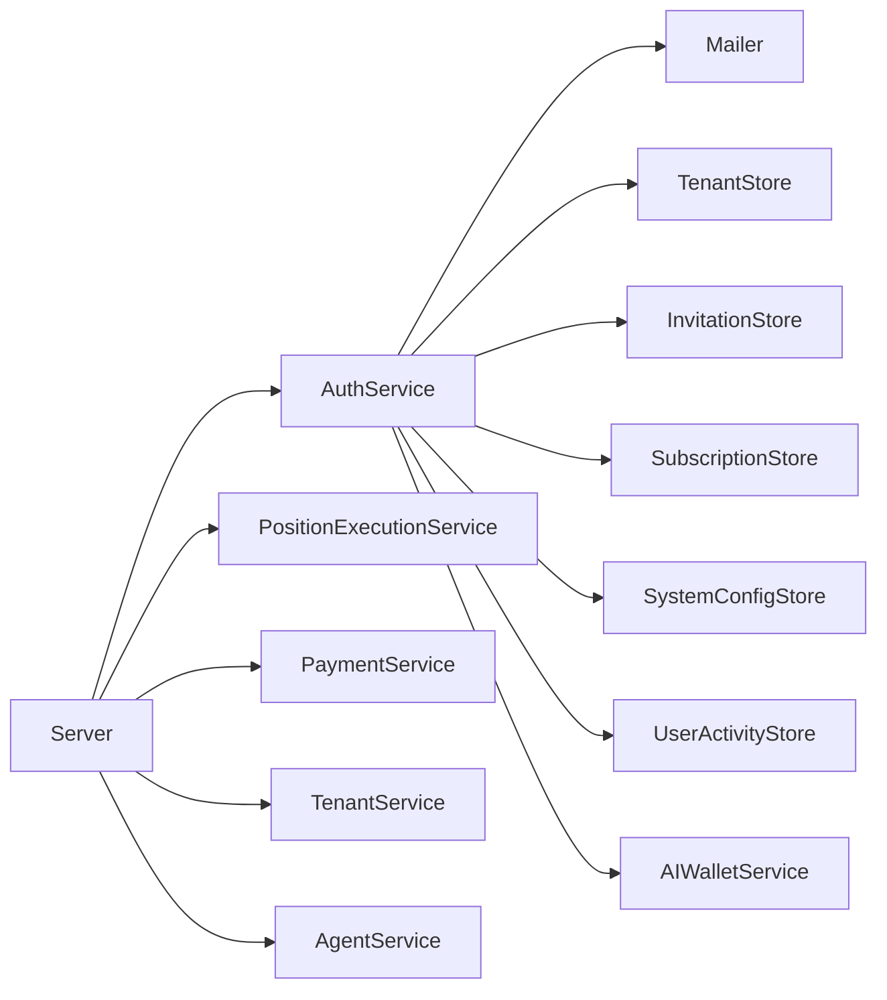

# 云端REST API

<cite>
**本文引用的文件**
- [server.go](file://goodhr5/cloud/backend/internal/httpapi/server.go)
- [auth.go](file://goodhr5/cloud/backend/internal/httpapi/auth.go)
- [tenant.go](file://goodhr5/cloud/backend/internal/httpapi/tenant.go)
- [agent.go](file://goodhr5/cloud/backend/internal/httpapi/agent.go)
- [position_store.go](file://goodhr5/cloud/backend/internal/httpapi/position_store.go)
- [candidate.go](file://goodhr5/cloud/backend/internal/httpapi/candidate.go)
- [subscription.go](file://goodhr5/cloud/backend/internal/httpapi/subscription.go)
- [payment.go](file://goodhr5/cloud/backend/internal/httpapi/payment.go)
- [config.go](file://goodhr5/cloud/backend/internal/httpapi/config.go)
- [main.go](file://goodhr5/cloud/backend/cmd/server/main.go)
</cite>

## 目录
1. [简介](#简介)
2. [项目结构](#项目结构)
3. [核心组件](#核心组件)
4. [架构总览](#架构总览)
5. [详细接口文档](#详细接口文档)
6. [依赖关系分析](#依赖关系分析)
7. [性能与扩展性](#性能与扩展性)
8. [故障排查指南](#故障排查指南)
9. [结论](#结论)
10. [附录：版本、兼容性与速率限制](#附录版本兼容性与速率限制)

## 简介
本文件为 GoodHR 5 云端后端 RESTful API 的完整接口文档。内容覆盖认证与会话、租户隔离与管理、岗位与候选人、AI 配置与钱包、订阅与支付、系统配置、本地 Agent 连接等全部 HTTP 端点，包含请求方法、URL 模式、参数校验、请求体与响应结构、状态码与错误码、示例以及最佳实践。

## 项目结构
云端后端采用 Go 语言实现，入口在 main 中启动 HTTP 服务，路由集中在 server.go 中注册，各业务模块按功能拆分到独立文件中（如认证、租户、岗位、候选人、订阅、支付、Agent、系统配置等）。所有响应统一通过 writeJSON/writeError 输出标准 JSON 格式，并启用 CORS。

**图表来源**
- [main.go:14-29](file://goodhr5/cloud/backend/cmd/server/main.go#L14-L29)
- [server.go:124-212](file://goodhr5/cloud/backend/internal/httpapi/server.go#L124-L212)

**章节来源**
- [main.go:14-29](file://goodhr5/cloud/backend/cmd/server/main.go#L14-L29)
- [server.go:124-212](file://goodhr5/cloud/backend/internal/httpapi/server.go#L124-L212)

## 核心组件
- 认证与会话：邮箱验证码登录、会话创建与校验、协议同意、试用欢迎提示、万能验证码、超管判定。
- 租户管理：成员列表、邀请、接受/拒绝、重发、角色变更、删除成员、Cookie共享开关。
- 本地Agent：绑定机器、查询当前Agent、WebSocket状态。
- 岗位与执行：岗位CRUD、运行控制、日志、统计同步、候选者保存。
- 候选人库：列表、详情、备注。
- AI配置与钱包：用户配置、生效配置、测试、余额与记录、兼容聊天接口。
- 订阅与支付：订阅状态、套餐列表、创建订单、AI余额充值、订单详情、微信支付回调、管理员订单列表。
- 系统配置：应用配置、平台配置、默认提示词、本地Agent更新信息与控制台地址、管理员可写系统配置。
- 公共能力：健康检查、公开统计、邮件打开像素、帮助与聊天。

**章节来源**
- [auth.go:71-214](file://goodhr5/cloud/backend/internal/httpapi/auth.go#L71-L214)
- [tenant.go:35-330](file://goodhr5/cloud/backend/internal/httpapi/tenant.go#L35-L330)
- [agent.go:35-135](file://goodhr5/cloud/backend/internal/httpapi/agent.go#L35-L135)
- [server.go:124-212](file://goodhr5/cloud/backend/internal/httpapi/server.go#L124-L212)

## 架构总览
服务端以 ServeMux 为中心，统一CORS中间件，所有业务处理器通过 Server 实例注入依赖（存储、邮件、配置等）。认证中间逻辑由 AuthService 提供，其他服务复用其 SessionFromRequest 进行鉴权。

**图表来源**
- [server.go:124-212](file://goodhr5/cloud/backend/internal/httpapi/server.go#L124-L212)
- [auth.go:452-470](file://goodhr5/cloud/backend/internal/httpapi/auth.go#L452-L470)

## 详细接口文档

### 通用约定
- 基础路径：/api
- 认证方式：Bearer Token，通过 Authorization 请求头传递 access_token。
- 统一响应格式：
  - 成功：{ ok: true, ... }
  - 失败：{ ok: false, error: "错误描述" }
- 统一错误响应使用 writeError，返回 4xx/5xx 状态码。
- 跨域：允许 GET/POST/PUT/DELETE/OPTIONS，允许 Origin 为 *，允许 Header 包含 Content-Type、Authorization、X-GoodHR-Agent-BaseURL。
- 缓存：响应头设置 no-store、must-revalidate。

**章节来源**
- [server.go:261-277](file://goodhr5/cloud/backend/internal/httpapi/server.go#L261-L277)
- [server.go:577-588](file://goodhr5/cloud/backend/internal/httpapi/server.go#L577-L588)

### 认证与会话
- POST /api/auth/send-code
  - 用途：发送邮箱验证码用于登录。
  - 请求体：{ email: "xxx@xx.com" }
  - 校验：邮箱格式、域名白名单（来自系统配置）、验证码生成与存储、发送邮件。
  - 成功响应：{ ok: true, email, expires_in, debug_code? }
  - 错误：400 invalid json body / invalid email / 域名不在白名单；500 生成或保存失败；500 发送失败。
- POST /api/auth/login
  - 用途：使用验证码登录，创建会话。
  - 请求体：{ email, code, inviter_id?, agreement_accepted }
  - 校验：邮箱、验证码长度4位、协议同意检查、验证码匹配（含万能验证码）、会话存储、登录活动记录、试用奖励通知、AI钱包初始化、邀请绑定。
  - 成功响应：{ ok: true, access_token, token_type: "Bearer", expires_in, user }
  - 错误：400 invalid json body / invalid email / invalid code；401 验证码错误或已过期；500 内部错误。
- GET /api/auth/me
  - 用途：获取当前登录用户信息与会话有效期。
  - 成功响应：{ ok: true, user, session: { created_at, expires_at }, show_trial_welcome }
  - 错误：401 会话无效或过期。
- GET /api/auth/agreement-status?email=...
  - 用途：查询指定邮箱是否已同意使用协议。
  - 成功响应：{ ok: true, agreement_accepted }
  - 错误：400 invalid email；500 读取失败。
- POST /api/auth/trial-welcome/ack
  - 用途：确认试用会员到账弹框。
  - 成功响应：{ ok: true }
  - 错误：401 会话无效或过期；500 记录失败。

**图表来源**
- [auth.go:71-214](file://goodhr5/cloud/backend/internal/httpapi/auth.go#L71-L214)

**章节来源**
- [auth.go:71-214](file://goodhr5/cloud/backend/internal/httpapi/auth.go#L71-L214)

### 租户管理（团队）
- GET /api/tenants/members
  - 权限：需登录，仅管理员可访问成员操作相关。
  - 响应：{ ok: true, members, today_greeted_count, can_manage, tenant: {id, name, owner_email} }
- POST /api/tenants/invite
  - 权限：团队管理员。
  - 请求体：{ email, role }
  - 行为：邀请成员、发送邮件、记录发送时间。
  - 响应：{ ok: true, invitation, resent }
- GET /api/tenants/invitations/pending
  - 权限：登录用户。
  - 响应：{ ok: true, invitations }
- POST /api/tenants/invitations/{id}/accept
  - 权限：被邀请人。
  - 响应：{ ok: true }
- POST /api/tenants/invitations/{id}/reject
  - 权限：被邀请人。
  - 响应：{ ok: true }
- POST /api/tenants/invitations/{id}/resend
  - 权限：团队管理员。
  - 响应：{ ok: true }
- PUT /api/tenants/invitations/{id}
  - 权限：团队管理员。
  - 请求体：{ role }
  - 响应：{ ok: true }
- DELETE /api/tenants/invitations/{id}
  - 权限：团队管理员。
  - 响应：{ ok: true }
- PUT /api/tenants/members/{email}
  - 权限：团队管理员。
  - 请求体：{ role }
  - 响应：{ ok: true }
- DELETE /api/tenants/members/{email}
  - 权限：团队管理员。
  - 响应：{ ok: true }
- POST /api/tenants/cookie-sharing
  - 权限：团队管理员。
  - 请求体：{ enabled: boolean }
  - 响应：{ ok: true, enabled }

注意：部分接口对“非管理员”返回 403，对“找不到记录”返回 404，对“冲突”返回 409。

**章节来源**
- [tenant.go:35-330](file://goodhr5/cloud/backend/internal/httpapi/tenant.go#L35-L330)

### 本地Agent绑定与状态
- POST /api/agents/bind
  - 权限：登录用户。
  - 请求体：{ machine_id, agent_version, local_port, public_key }
  - 响应：{ ok: true, agent: {machine_id, agent_version, local_port, public_key, bind_status, last_seen_at} }
  - 冲突：409 {ok:false, error:{code:"DEVICE_ALREADY_BOUND", message}}
- GET /api/agents/current
  - 权限：登录用户。
  - 响应：{ ok: true, agent|null }
- WS /api/agents/ws
  - 用途：WebSocket 通道，用于云端与本地程序通信。
- GET /api/agents/ws-status
  - 用途：查询 WebSocket 状态。

**章节来源**
- [agent.go:35-135](file://goodhr5/cloud/backend/internal/httpapi/agent.go#L35-L135)
- [server.go:136-139](file://goodhr5/cloud/backend/internal/httpapi/server.go#L136-L139)

### 岗位与执行
- GET /api/positions
  - 权限：登录用户（受租户隔离）。
  - 响应：岗位列表。
- POST /api/positions/optimize-requirement
  - 用途：优化岗位要求文案（AI辅助）。
- GET /api/positions/{id}
  - 用途：岗位详情。
- GET /api/positions/{id}/logs
  - 用途：岗位运行日志。
- GET /api/positions/{id}/status
  - 用途：同步/查询运行状态。
- POST /api/positions/{id}/start
  - 用途：启动岗位运行。
- POST /api/positions/{id}/stop
  - 用途：停止岗位运行。
- POST /api/positions/{id}/candidates
  - 用途：保存本地候选人数据。
- POST /api/positions/{id}/processed-resumes
  - 用途：添加已处理简历。
- POST /api/positions/{id}/counts
  - 用途：同步扫描/跳过/失败计数。
- POST /api/fail-notice
  - 用途：失败通知回调。

说明：岗位运行存在并发保护，同一账号不能同时运行多个岗位。

**章节来源**
- [server.go:179-183](file://goodhr5/cloud/backend/internal/httpapi/server.go#L179-L183)
- [server.go:214-245](file://goodhr5/cloud/backend/internal/httpapi/server.go#L214-L245)
- [position_store.go:129-150](file://goodhr5/cloud/backend/internal/httpapi/position_store.go#L129-L150)

### 候选人库
- GET /api/candidates
  - 权限：登录用户（受租户隔离）。
  - 响应：候选人列表。
- GET /api/candidates/{id}
  - 用途：候选人详情。
- GET /api/candidates/{id}/notes
  - 用途：候选人备注。

数据结构参考 Candidate 类型定义，包含基本信息、教育、工作、证书、荣誉、项目经验、沟通记录、附件、AI评分、运行时信息、时间戳等。

**章节来源**
- [server.go:184-192](file://goodhr5/cloud/backend/internal/httpapi/server.go#L184-L192)
- [candidate.go:126-143](file://goodhr5/cloud/backend/internal/httpapi/candidate.go#L126-L143)

### AI配置与钱包
- GET /api/config/user-ai
  - 用途：读取用户自定义AI配置。
- GET /api/config/effective-ai
  - 用途：读取最终生效AI配置。
- POST /api/config/test-ai
  - 用途：测试AI配置。
- GET /api/ai-wallet
  - 用途：AI钱包余额汇总。
- GET /api/ai-wallet/records
  - 用途：AI钱包消费记录。
- POST /api/ai-wallet/use-builtin
  - 用途：使用内置AI能力（扣费）。
- POST /api/ai-compatible/v1/chat/completions
  - 用途：兼容OpenAI风格的聊天补全接口（基于AI钱包）。

**章节来源**
- [server.go:141-148](file://goodhr5/cloud/backend/internal/httpapi/server.go#L141-L148)

### 用户偏好与通知画像
- GET /api/config/user-preferences
  - 用途：读取用户偏好配置。
- GET /api/config/notification-profile
  - 用途：读取通知画像配置。

**章节来源**
- [server.go:149-150](file://goodhr5/cloud/backend/internal/httpapi/server.go#L149-L150)

### 订阅与套餐
- GET /api/subscription/status
  - 权限：登录用户。
  - 响应：{ ok: true, subscription: {member_type, member_name, expires_at, active} }
- GET /api/subscription/plans
  - 用途：读取系统配置的订阅套餐列表。
  - 响应：{ ok: true, plans }

**章节来源**
- [server.go:151-152](file://goodhr5/cloud/backend/internal/httpapi/server.go#L151-L152)
- [subscription.go:62-119](file://goodhr5/cloud/backend/internal/httpapi/subscription.go#L62-L119)

### 支付订单
- POST /api/payment/orders
  - 用途：创建订阅支付订单。
  - 请求体：{ plan_id }
  - 响应：{ ok: true, order, payment } 或当金额为0时直接完成升级。
- POST /api/payment/ai-balance
  - 用途：创建AI余额充值订单。
  - 请求体：{ amount_cents, amount_yuan }
- GET /api/payment/orders/{order_no}
  - 用途：订单详情。
- POST /api/payment/notify/wechat
  - 用途：微信支付回调。
- GET /api/admin/payment/orders
  - 权限：管理员。
  - 用途：管理员查看订单列表。

**章节来源**
- [server.go:153-157](file://goodhr5/cloud/backend/internal/httpapi/server.go#L153-L157)
- [payment.go:67-189](file://goodhr5/cloud/backend/internal/httpapi/payment.go#L67-L189)

### 系统配置与公共能力
- GET /health
  - 用途：健康检查。
  - 响应：{ ok: true, name, version }
- GET /api/public/stats/today
  - 用途：今日公开统计。
- GET /api/system/app-config
  - 用途：读取应用配置（如邮箱白名单）。
- GET /api/system/local-agent-updates
  - 用途：本地程序更新记录。
- GET /api/system/local-agent-console-url
  - 用途：本地控制台地址。
- GET /api/system/default-prompts
  - 用途：默认提示词。
- GET /api/platforms/config/{key}
  - 用途：读取平台配置。
- GET/PUT /api/admin/system/configs/{key}
  - 权限：超管。
  - 用途：读取/更新系统原始JSON配置。
- GET/PUT /api/admin/platforms/config/{key}
  - 权限：超管。
  - 用途：读取/更新平台原始JSON配置。
- GET /api/help/guide
  - 用途：帮助引导。
- POST /api/help/chat
  - 用途：帮助聊天。
- GET /api/public/email-jobs/{job_id}
  - 用途：邮件任务公开查询。
- GET /api/public/mail/open
  - 用途：邮件打开像素追踪。

**章节来源**
- [server.go:127-212](file://goodhr5/cloud/backend/internal/httpapi/server.go#L127-L212)
- [server.go:279-372](file://goodhr5/cloud/backend/internal/httpapi/server.go#L279-L372)
- [server.go:374-472](file://goodhr5/cloud/backend/internal/httpapi/server.go#L374-L472)
- [server.go:474-544](file://goodhr5/cloud/backend/internal/httpapi/server.go#L474-L544)

### Cookie共享
- GET /api/cookies
  - 用途：列出Cookie。
- POST /api/cookies/create
  - 用途：创建Cookie。
- PUT /api/cookies/{id}
  - 用途：更新Cookie。
- DELETE /api/cookies/{id}
  - 用途：删除Cookie。
- POST /api/cookies/{id}/claim
  - 用途：认领Cookie。
- POST /api/cookies/{id}/release
  - 用途：释放Cookie。
- GET /api/cookies/{id}/status
  - 用途：Cookie状态。

**章节来源**
- [server.go:208-210](file://goodhr5/cloud/backend/internal/httpapi/server.go#L208-L210)
- [server.go:557-575](file://goodhr5/cloud/backend/internal/httpapi/server.go#L557-L575)

## 依赖关系分析
- 认证依赖：邮件服务、租户存储、邀请存储、订阅存储、系统配置存储、用户活动存储、AI钱包服务、超管列表、万能验证码偏移。
- 业务服务依赖：各模块通过 Server 构造时注入对应 Store 与服务，形成松耦合。
- 存储抽象：多数模块支持 Postgres 与内存两种实现，便于开发与部署。

**图表来源**
- [server.go:46-120](file://goodhr5/cloud/backend/internal/httpapi/server.go#L46-L120)
- [auth.go:21-68](file://goodhr5/cloud/backend/internal/httpapi/auth.go#L21-L68)

**章节来源**
- [server.go:46-120](file://goodhr5/cloud/backend/internal/httpapi/server.go#L46-L120)
- [auth.go:21-68](file://goodhr5/cloud/backend/internal/httpapi/auth.go#L21-L68)

## 性能与扩展性
- 数据库连接池：PostgreSQL 最大连接数、空闲连接数、生命周期配置。
- 认证存储：可选 Redis 持久化会话，未配置时使用内存实现。
- 邮件服务：生产环境使用 SMTP，开发环境使用模拟发信器。
- CORS：允许跨域，便于前端集成。
- 建议：在高并发场景下启用 Redis 会话存储与 PostgreSQL 持久化，合理调整连接池大小。

**章节来源**
- [config.go:47-101](file://goodhr5/cloud/backend/internal/httpapi/config.go#L47-L101)
- [server.go:577-588](file://goodhr5/cloud/backend/internal/httpapi/server.go#L577-L588)

## 故障排查指南
- 常见错误码与含义：
  - 400：请求体无效、参数缺失或不合法。
  - 401：会话无效或过期。
  - 403：权限不足（非管理员或超管）。
  - 404：资源不存在。
  - 409：冲突（如设备已绑定、岗位已在运行）。
  - 500：服务器内部错误（存储、邮件、配置解析失败等）。
- 排查步骤：
  - 检查 Authorization 头是否正确携带 Bearer token。
  - 检查邮箱域名是否在白名单内。
  - 检查验证码是否过期或已被消费。
  - 检查系统配置是否有效（如订阅套餐、平台配置）。
  - 查看后端日志定位具体错误原因。

**章节来源**
- [auth.go:71-214](file://goodhr5/cloud/backend/internal/httpapi/auth.go#L71-L214)
- [tenant.go:346-356](file://goodhr5/cloud/backend/internal/httpapi/tenant.go#L346-L356)
- [agent.go:67-79](file://goodhr5/cloud/backend/internal/httpapi/agent.go#L67-L79)
- [server.go:271-277](file://goodhr5/cloud/backend/internal/httpapi/server.go#L271-L277)

## 结论
本API提供了完整的云端能力，涵盖认证、租户、岗位、候选人、AI、订阅与支付、系统配置与公共能力。通过统一的响应格式、严格的参数校验与权限控制，确保前后端协作高效稳定。建议在生产环境启用 Redis 会话存储与 PostgreSQL 持久化，并合理配置邮件与系统参数。

## 附录：版本、兼容性与速率限制
- 版本管理：
  - 健康检查返回版本号，便于客户端判断兼容性。
  - 兼容聊天接口以 v1 命名，便于后续演进。
- 向后兼容：
  - 新增字段通常以可选形式加入，避免破坏现有客户端。
  - 旧字段保留但标记为废弃时，应继续兼容至少一个主版本周期。
- 速率限制：
  - 当前代码未内置限流中间件。建议在网关层或反向代理（如 Nginx）配置限流策略，针对敏感接口（如验证码、支付）加强限制。
  - 建议限制：验证码每分钟不超过若干次，登录每秒不超过若干次，支付回调防重放。

[本节为概念性说明，不直接分析具体文件]