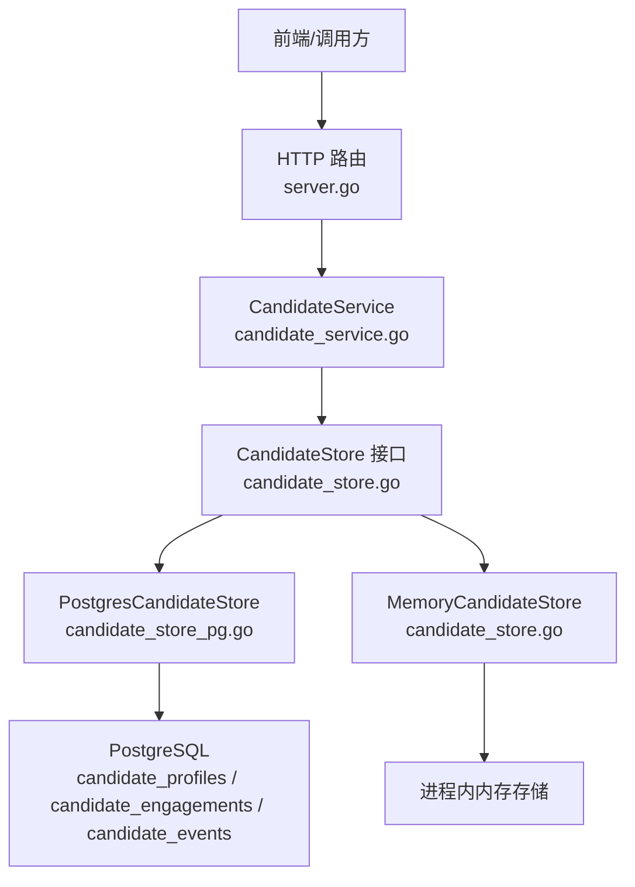
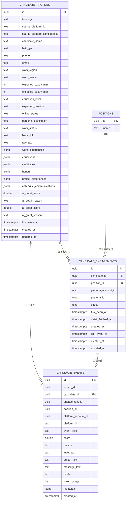
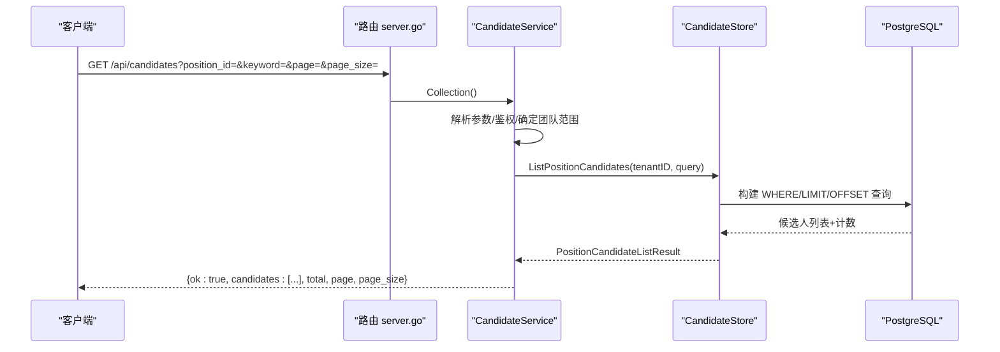

# 候选人管理API

<cite>
**本文引用的文件**
- [server.go](file://goodhr5/cloud/backend/internal/httpapi/server.go)
- [candidate_service.go](file://goodhr5/cloud/backend/internal/httpapi/candidate_service.go)
- [candidate_store.go](file://goodhr5/cloud/backend/internal/httpapi/candidate_store.go)
- [candidate_store_pg.go](file://goodhr5/cloud/backend/internal/httpapi/candidate_store_pg.go)
- [candidate.go](file://goodhr5/cloud/backend/internal/httpapi/candidate.go)
- [0016_task_candidates.sql](file://goodhr5/cloud/backend/db/migrations/0016_task_candidates.sql)
- [0050_simplify_candidate_resume_schema.sql](file://goodhr5/cloud/backend/db/migrations/0050_simplify_candidate_resume_schema.sql)
</cite>

## 目录
1. [简介](#简介)
2. [项目结构](#项目结构)
3. [核心组件](#核心组件)
4. [架构总览](#架构总览)
5. [详细接口说明](#详细接口说明)
6. [依赖关系分析](#依赖关系分析)
7. [性能与分页排序](#性能与分页排序)
8. [故障排查](#故障排查)
9. [结论](#结论)
10. [附录：数据模型与示例](#附录数据模型与示例)

## 简介
本文件为 GoodHR 云端后端“候选人管理”相关 API 的完整接口文档，覆盖以下能力：
- 候选人列表查询（支持按岗位、关键词、团队范围筛选与分页）
- 候选人详情查看（包含简历解析结果、AI 评分、时间戳等）
- 备注管理（新增与列表）
- 批量清空团队候选人数据（管理员权限）

所有接口均受认证与会话控制，并按租户隔离。

## 项目结构
候选人与简历库相关的 HTTP 路由注册在统一服务中，具体业务逻辑由 CandidateService 处理，数据访问通过 CandidateStore 抽象（内存实现与 PostgreSQL 实现）。

图表来源
- [server.go:124-212](file://goodhr5/cloud/backend/internal/httpapi/server.go#L124-L212)
- [candidate_service.go:12-76](file://goodhr5/cloud/backend/internal/httpapi/candidate_service.go#L12-L76)
- [candidate_store.go:146-173](file://goodhr5/cloud/backend/internal/httpapi/candidate_store.go#L146-L173)
- [candidate_store_pg.go:14-22](file://goodhr5/cloud/backend/internal/httpapi/candidate_store_pg.go#L14-L22)

章节来源
- [server.go:124-212](file://goodhr5/cloud/backend/internal/httpapi/server.go#L124-L212)

## 核心组件
- CandidateService：负责候选人列表、详情、备注、清空团队等 HTTP 请求处理；校验参数、鉴权、组装响应。
- CandidateStore 接口：定义候选人主体、触达上下文、事件流水的增删改查能力。
- PostgresCandidateStore：基于 PostgreSQL 的持久化实现，提供 SQL 查询、事务与 JSONB 字段读写。
- MemoryCandidateStore：开发期内存实现，便于本地调试。
- 数据结构：Candidate、PositionCandidate、CandidateNote、CandidateEvent 等用于内部流转与对外响应转换。

章节来源
- [candidate_service.go:12-76](file://goodhr5/cloud/backend/internal/httpapi/candidate_service.go#L12-L76)
- [candidate_store.go:12-173](file://goodhr5/cloud/backend/internal/httpapi/candidate_store.go#L12-L173)
- [candidate_store_pg.go:325-394](file://goodhr5/cloud/backend/internal/httpapi/candidate_store_pg.go#L325-L394)
- [candidate.go:6-153](file://goodhr5/cloud/backend/internal/httpapi/candidate.go#L6-L153)

## 架构总览
候选人与岗位运行紧密关联：
- 候选人通过岗位运行流程被采集并入库到 candidate_profiles。
- 一次“触达”由 candidate_engagements 表示，记录候选人、岗位、平台账号的关系及状态、关键时间。
- 事件流水 candidate_events 记录 AI 评分、人工备注等事件。
- 列表与详情会聚合最新触达、最近两条备注、以及岗位名称等信息。

图表来源
- [0016_task_candidates.sql:4-96](file://goodhr5/cloud/backend/db/migrations/0016_task_candidates.sql#L4-L96)
- [0050_simplify_candidate_resume_schema.sql:1-39](file://goodhr5/cloud/backend/db/migrations/0050_simplify_candidate_resume_schema.sql#L1-L39)
- [candidate_store_pg.go:489-551](file://goodhr5/cloud/backend/internal/httpapi/candidate_store_pg.go#L489-L551)

## 详细接口说明

### 通用约定
- 认证：所有接口需携带有效会话（Cookie/Session），未登录返回 401。
- 租户隔离：默认仅返回当前用户所属团队的候选人；管理员可跨成员范围操作。
- 错误格式：{"ok": false, "error": "消息"}
- 成功格式：{"ok": true, ...}

### GET /api/candidates
- 功能：获取候选人列表（支持按岗位、关键词、分页）。
- 路径参数：无
- 查询参数：
  - position_id：字符串，可选。限定只返回与该岗位存在触达关系的候选人。
  - keyword/q：字符串，可选。模糊匹配姓名、电话、邮箱、地区、工作年限、学历、期望职位、基础信息、个人描述、原始文本等。
  - page：整数，可选。页码，默认 1。
  - page_size：整数，可选。每页条数，默认 20，最大 100。
- 权限：非管理员时自动限制为当前用户创建的候选人；管理员可查看全部团队成员的候选人。
- 响应体：
  - ok：布尔
  - candidates：数组，元素为候选人摘要对象（见下方“候选人摘要字段”）
  - total：整数，符合条件的总数
  - page：整数，当前页
  - page_size：整数，每页大小
- 排序规则：按“最近一次触达创建时间或候选人创建时间”降序。

章节来源
- [candidate_service.go:29-76](file://goodhr5/cloud/backend/internal/httpapi/candidate_service.go#L29-L76)
- [candidate_store_pg.go:325-357](file://goodhr5/cloud/backend/internal/httpapi/candidate_store_pg.go#L325-L357)
- [candidate_store_pg.go:489-551](file://goodhr5/cloud/backend/internal/httpapi/candidate_store_pg.go#L489-L551)

#### 候选人摘要字段（candidates 数组元素）
- id：候选人主体 ID
- engagement_id：最近一次触达 ID
- engagement_status：触达状态
- position_id：岗位 ID
- position_name：岗位名称
- platform_account_id：平台账号 ID
- user_email：创建人邮箱
- platform_id：招聘平台标识
- platform_candidate_id：平台侧候选人原始 ID
- candidate_name：候选人姓名
- birth_ym：出生年月
- phone：手机号
- email：邮箱
- work_region：工作地区
- work_years：工作年限
- expected_salary_min/max：期望薪资区间（单位 K）
- basic_info：基础信息摘要
- education_level：最高学历
- expected_position：期望职位
- online_status：在线状态
- personal_description：个人描述
- work_status：求职状态
- work_experiences：工作经历数组
- educations：教育经历数组
- certificates：证书数组
- honors：荣誉数组
- project_experiences：项目经验数组
- colleague_communications：沟通记录数组
- ai：包含 detail/greet 两个阶段的评分与原因
- notes：最多两条最近备注
- raw_text：平台简历原文
- first_seen_at/detail_fetched_at/greeted_at/created_at/updated_at：时间戳

章节来源
- [candidate_service.go:242-295](file://goodhr5/cloud/backend/internal/httpapi/candidate_service.go#L242-L295)
- [candidate_store_pg.go:489-551](file://goodhr5/cloud/backend/internal/httpapi/candidate_store_pg.go#L489-L551)

### DELETE /api/candidates
- 功能：清空当前团队的全部候选人数据（包括主体、触达、事件级联删除）。
- 权限：仅团队管理员可用。
- 响应体：
  - ok：布尔
  - deleted：整数，删除的候选人主体数量

章节来源
- [candidate_service.go:78-108](file://goodhr5/cloud/backend/internal/httpapi/candidate_service.go#L78-L108)
- [candidate_store_pg.go:422-433](file://goodhr5/cloud/backend/internal/httpapi/candidate_store_pg.go#L422-L433)

### GET /api/candidates/{id}
- 功能：获取指定候选人详情（包含简历解析结果、AI 评分、事件流水等）。
- 路径参数：
  - id：候选人主体 ID
- 查询参数：
  - engagement_id：字符串，可选。限定读取该触达的事件流水；不传则使用最近一次触达。
- 权限：仅可查看当前团队内的候选人；非管理员限制为本人创建。
- 响应体：
  - ok：布尔
  - candidate：候选人详情对象（同列表项字段，但包含更多上下文与事件）

章节来源
- [candidate_service.go:110-146](file://goodhr5/cloud/backend/internal/httpapi/candidate_service.go#L110-L146)
- [candidate_store_pg.go:359-394](file://goodhr5/cloud/backend/internal/httpapi/candidate_store_pg.go#L359-L394)

### GET /api/candidates/{id}/notes
- 功能：获取某候选人的备注列表（按创建时间倒序）。
- 路径参数：
  - id：候选人主体 ID
- 权限：同详情可见范围。
- 响应体：
  - ok：布尔
  - notes：数组，元素为备注对象（id、candidate_id、content、author_email、created_at）

章节来源
- [candidate_service.go:148-185](file://goodhr5/cloud/backend/internal/httpapi/candidate_service.go#L148-L185)
- [candidate_store_pg.go:396-420](file://goodhr5/cloud/backend/internal/httpapi/candidate_store_pg.go#L396-L420)

### POST /api/candidates/{id}/notes
- 功能：新增备注。
- 路径参数：
  - id：候选人主体 ID
- 请求体：
  - content：字符串，必填；长度限制 1000 字以内。
- 权限：同详情可见范围。
- 响应体：
  - ok：布尔
  - note：新增的备注对象（id、candidate_id、content、author_email、created_at）

章节来源
- [candidate_service.go:186-213](file://goodhr5/cloud/backend/internal/httpapi/candidate_service.go#L186-L213)

## 依赖关系分析
- 路由层：server.go 将 /api/candidates 与 /api/candidates/ 分发至 CandidateService。
- 服务层：CandidateService 负责参数解析、权限校验、调用存储层，并转换为公共响应结构。
- 存储层：
  - PostgresCandidateStore：使用三表模型（profiles、engagements、events）完成复杂查询与聚合。
  - MemoryCandidateStore：开发期内存实现，行为一致。
- 数据模型：
  - 候选人主体：扁平化字段 + JSONB 经历数组 + AI 评分字段。
  - 触达上下文：记录候选人、岗位、平台账号关系与状态、时间。
  - 事件流水：记录 AI 评分、人工备注等事件。

图表来源
- [server.go:184-192](file://goodhr5/cloud/backend/internal/httpapi/server.go#L184-L192)
- [candidate_service.go:29-76](file://goodhr5/cloud/backend/internal/httpapi/candidate_service.go#L29-L76)
- [candidate_store_pg.go:325-357](file://goodhr5/cloud/backend/internal/httpapi/candidate_store_pg.go#L325-L357)

## 性能与分页排序
- 分页规范：
  - page 默认 1，page_size 默认 20，最大 100。
  - 超出范围会被规范化处理。
- 排序规则：
  - 列表按“最近一次触达创建时间或候选人创建时间”降序。
- 搜索优化：
  - 关键词采用 ILIKE 多字段模糊匹配，避免全表扫描大字段。
- 事件加载：
  - 详情加载事件流水时限制最多 200 条，避免过大响应。
- 备注聚合：
  - 列表查询时仅聚合最近 2 条备注，减少负载。

章节来源
- [candidate_store.go:397-417](file://goodhr5/cloud/backend/internal/httpapi/candidate_store.go#L397-L417)
- [candidate_store_pg.go:325-357](file://goodhr5/cloud/backend/internal/httpapi/candidate_store_pg.go#L325-L357)
- [candidate_store_pg.go:435-487](file://goodhr5/cloud/backend/internal/httpapi/candidate_store_pg.go#L435-L487)
- [candidate_store_pg.go:489-551](file://goodhr5/cloud/backend/internal/httpapi/candidate_store_pg.go#L489-L551)

## 故障排查
- 401 未授权：检查会话是否有效或已过期。
- 403 禁止：清空团队数据需要团队管理员权限。
- 404 未找到：候选人不存在或无权访问。
- 400 参数错误：
  - 备注内容不能为空或超过 1000 字。
  - 路径缺少必要 ID。
- 500 服务器错误：存储不可用或数据库异常。

章节来源
- [candidate_service.go:218-240](file://goodhr5/cloud/backend/internal/httpapi/candidate_service.go#L218-L240)
- [candidate_service.go:78-108](file://goodhr5/cloud/backend/internal/httpapi/candidate_service.go#L78-L108)
- [candidate_service.go:110-146](file://goodhr5/cloud/backend/internal/httpapi/candidate_service.go#L110-L146)
- [candidate_service.go:148-213](file://goodhr5/cloud/backend/internal/httpapi/candidate_service.go#L148-L213)

## 结论
候选人管理 API 提供了完整的候选人数据获取、简历解析结果查看与备注管理能力，并通过岗位运行关联形成“候选人-触达-事件”的闭环。接口设计遵循统一的鉴权与租户隔离策略，具备分页、模糊搜索、排序与批量清理能力，适合前后端集成与自动化流程对接。

## 附录：数据模型与示例

### 简历解析数据结构
- 基础字段：姓名、出生年月、手机、邮箱、地区、工作年限、期望薪资、学历、期望职位、在线状态、个人描述、工作状态、基础信息摘要、原始文本。
- 经历类字段（JSONB 数组）：
  - 工作经历：公司名、岗位名、内容、起止年月
  - 教育经历：学校名、专业名、学历、起止年月
  - 证书：证书名、颁发机构、颁发年月
  - 荣誉：荣誉名、颁发机构、颁发年月、描述
  - 项目经验：项目名、角色名、内容、起止年月
  - 沟通记录：沟通人、沟通时间、内容
- AI 评分：
  - 详情阶段：score、reason
  - 打招呼阶段：score、reason
- 时间戳：首次发现、详情抓取完成、打招呼成功、创建、更新

章节来源
- [0016_task_candidates.sql:4-96](file://goodhr5/cloud/backend/db/migrations/0016_task_candidates.sql#L4-L96)
- [0050_simplify_candidate_resume_schema.sql:1-39](file://goodhr5/cloud/backend/db/migrations/0050_simplify_candidate_resume_schema.sql#L1-L39)
- [candidate.go:6-153](file://goodhr5/cloud/backend/internal/httpapi/candidate.go#L6-L153)

### 接口调用示例

- 列出候选人（按岗位与关键词分页）
  - 方法：GET
  - 路径：/api/candidates?position_id={岗位ID}&keyword={关键词}&page=1&page_size=20
  - 响应：包含 candidates、total、page、page_size

- 获取候选人详情（含事件流水）
  - 方法：GET
  - 路径：/api/candidates/{id}?engagement_id={触达ID}
  - 响应：包含 candidate 对象

- 新增备注
  - 方法：POST
  - 路径：/api/candidates/{id}/notes
  - 请求体：{"content":"面试反馈：技术面表现良好"}
  - 响应：包含新增 note 对象

- 获取备注列表
  - 方法：GET
  - 路径：/api/candidates/{id}/notes
  - 响应：包含 notes 数组

- 批量清空团队候选人（管理员）
  - 方法：DELETE
  - 路径：/api/candidates
  - 响应：包含 deleted 数量

章节来源
- [candidate_service.go:29-213](file://goodhr5/cloud/backend/internal/httpapi/candidate_service.go#L29-L213)
- [server.go:184-192](file://goodhr5/cloud/backend/internal/httpapi/server.go#L184-L192)