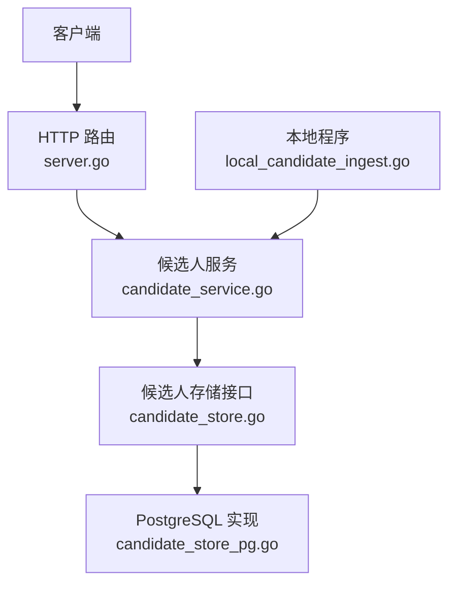
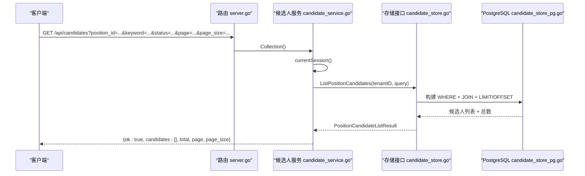
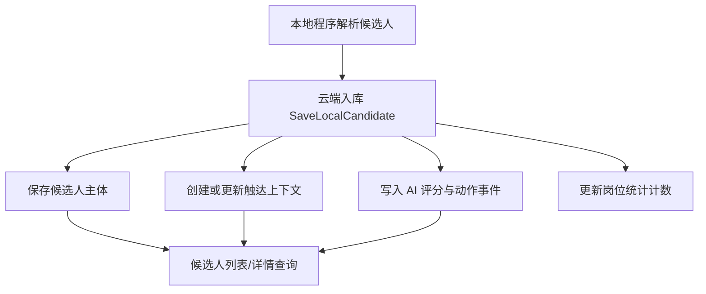
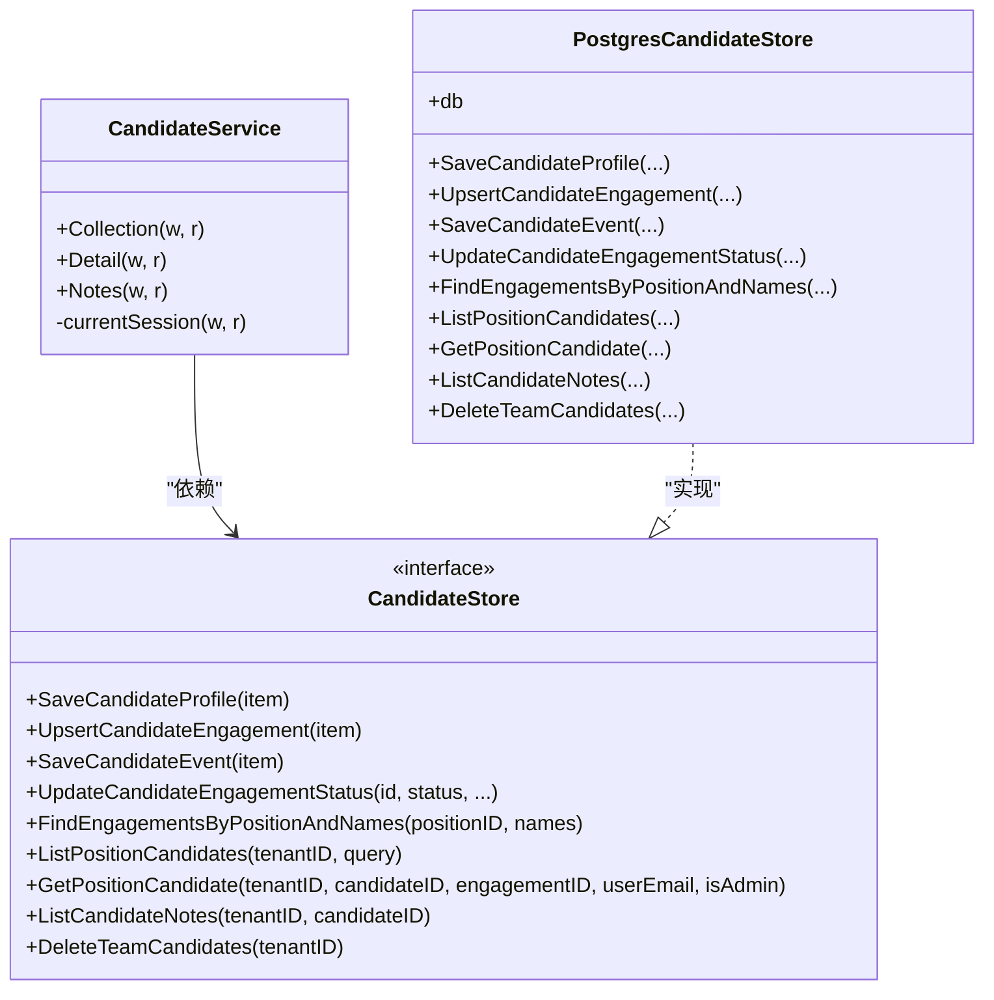
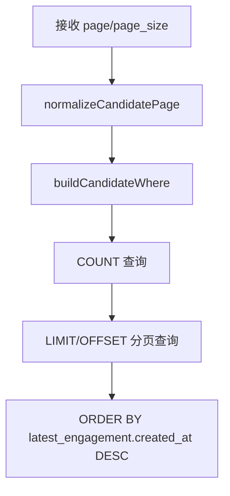

# 候选人管理API

<cite>
**本文引用的文件**   
- [server.go](file://goodhr5/cloud/backend/internal/httpapi/server.go)
- [candidate_service.go](file://goodhr5/cloud/backend/internal/httpapi/candidate_service.go)
- [candidate_store.go](file://goodhr5/cloud/backend/internal/httpapi/candidate_store.go)
- [candidate_store_pg.go](file://goodhr5/cloud/backend/internal/httpapi/candidate_store_pg.go)
- [local_candidate_ingest.go](file://goodhr5/cloud/backend/internal/httpapi/local_candidate_ingest.go)
</cite>

## 目录
1. [简介](#简介)
2. [项目结构](#项目结构)
3. [核心组件](#核心组件)
4. [架构总览](#架构总览)
5. [接口定义与示例](#接口定义与示例)
6. [候选人与岗位运行关联关系](#候选人与岗位运行关联关系)
7. [简历解析数据结构](#简历解析数据结构)
8. [依赖关系分析](#依赖关系分析)
9. [性能与分页排序规则](#性能与分页排序规则)
10. [故障排查指南](#故障排查指南)
11. [结论](#结论)

## 简介
本文件面向调用方，系统化说明 HRPlus 云端后端的候选人管理 API。重点覆盖：
- 候选人列表查询：/api/candidates
- 候选人详情查看：/api/candidates/{id}
- 候选人备注管理：/api/candidates/{id}/notes
- 筛选条件、分页、排序规则
- 与岗位运行的关联关系
- 简历解析结果的数据结构
- 批量操作与高级查询场景的调用示例

## 项目结构
候选人相关能力位于后端 HTTP API 层，由路由注册、服务处理、存储接口与 PostgreSQL 实现组成。

**图表来源**
- [server.go:191-213](file://goodhr5/cloud/backend/internal/httpapi/server.go#L191-L213)
- [candidate_service.go:13-28](file://goodhr5/cloud/backend/internal/httpapi/candidate_service.go#L13-L28)
- [candidate_store.go:155-167](file://goodhr5/cloud/backend/internal/httpapi/candidate_store.go#L155-L167)
- [candidate_store_pg.go:14-22](file://goodhr5/cloud/backend/internal/httpapi/candidate_store_pg.go#L14-L22)
- [local_candidate_ingest.go:23-25](file://goodhr5/cloud/backend/internal/httpapi/local_candidate_ingest.go#L23-L25)

**章节来源**
- [server.go:191-213](file://goodhr5/cloud/backend/internal/httpapi/server.go#L191-L213)

## 核心组件
- 路由注册：将 /api/candidates 与 /api/candidates/{id}、/api/candidates/{id}/notes 映射到候选人服务。
- 候选人服务：负责认证、参数校验、权限控制、业务逻辑封装和统一响应格式。
- 存储接口：抽象候选人主体、触达上下文、事件流水、备注等数据访问能力。
- PostgreSQL 实现：提供持久化查询、分页、筛选、事件聚合与备注读取。
- 本地程序入库：本地 Agent 回传候选人解析结果，写入候选人主体、触达上下文与事件。

**章节来源**
- [candidate_service.go:13-28](file://goodhr5/cloud/backend/internal/httpapi/candidate_service.go#L13-L28)
- [candidate_store.go:155-167](file://goodhr5/cloud/backend/internal/httpapi/candidate_store.go#L155-L167)
- [candidate_store_pg.go:14-22](file://goodhr5/cloud/backend/internal/httpapi/candidate_store_pg.go#L14-L22)
- [local_candidate_ingest.go:23-25](file://goodhr5/cloud/backend/internal/httpapi/local_candidate_ingest.go#L23-L25)

## 架构总览
候选人管理 API 的请求流程如下：

**图表来源**
- [server.go:202-209](file://goodhr5/cloud/backend/internal/httpapi/server.go#L202-L209)
- [candidate_service.go:30-79](file://goodhr5/cloud/backend/internal/httpapi/candidate_service.go#L30-L79)
- [candidate_store_pg.go:374-407](file://goodhr5/cloud/backend/internal/httpapi/candidate_store_pg.go#L374-L407)

## 接口定义与示例

### 通用约定
- 认证方式：请求需携带有效会话；未登录或会话过期返回未授权错误。
- 团队隔离：所有候选人数据按租户隔离；非管理员只能查看当前用户相关数据。
- 统一响应体：成功响应包含 ok 字段；失败响应为错误消息。
- 空数组保护：列表类字段不会返回 null，而是空数组。

**章节来源**
- [candidate_service.go:221-233](file://goodhr5/cloud/backend/internal/httpapi/candidate_service.go#L221-L233)
- [candidate_service.go:348-362](file://goodhr5/cloud/backend/internal/httpapi/candidate_service.go#L348-L362)

---

### 获取候选人列表
- 路径：GET /api/candidates
- 可选方法：DELETE /api/candidates（清空团队候选人，仅管理员）

#### 查询参数
| 参数 | 类型 | 必填 | 说明 |
| --- | --- | --- | --- |
| position_id | string | 否 | 按岗位 ID 筛选候选人 |
| keyword / q | string | 否 | 关键词搜索，支持姓名、电话、邮箱、地区、工作年限、学历、期望岗位、基本信息、个人描述、原始文本等多字段模糊匹配 |
| status | string | 否 | 状态筛选，见下方状态值 |
| page | int | 否 | 页码，默认 1 |
| page_size | int | 否 | 每页数量，默认 20，最大 100 |

#### 状态筛选值
| status 值 | 含义 |
| --- | --- |
| resume_pending | 待处理简历 |
| resume_requested | 已索要简历 |
| resume_received | 已收到简历 |
| resume_downloaded | 已下载简历 |
| resume_failed | 简历解析失败 |
| detail | 已抓取详情 |
| greeted | 已打招呼 |
| resume | 已发起索要简历动作 |

#### 响应体
| 字段 | 类型 | 说明 |
| --- | --- | --- |
| ok | boolean | 是否成功 |
| candidates | array | 候选人列表 |
| total | number | 符合条件的总数 |
| page | number | 当前页码 |
| page_size | number | 每页数量 |

#### 调用示例
- 基础列表：GET /api/candidates?page=1&page_size=20
- 按岗位筛选：GET /api/candidates?position_id={positionId}
- 关键词搜索：GET /api/candidates?q=Java&page_size=50
- 组合筛选：GET /api/candidates?position_id={positionId}&status=resume_received&page=2&page_size=20
- 清空团队候选人（管理员）：DELETE /api/candidates

**章节来源**
- [candidate_service.go:30-79](file://goodhr5/cloud/backend/internal/httpapi/candidate_service.go#L30-L79)
- [candidate_store_pg.go:683-729](file://goodhr5/cloud/backend/internal/httpapi/candidate_store_pg.go#L683-L729)

---

### 获取候选人详情
- 路径：GET /api/candidates/{id}
- 查询参数：engagement_id（可选），用于指定某次触达上下文

#### 路径参数
| 参数 | 类型 | 必填 | 说明 |
| --- | --- | --- | --- |
| id | string | 是 | 候选人主体 ID |

#### 查询参数
| 参数 | 类型 | 必填 | 说明 |
| --- | --- | --- | --- |
| engagement_id | string | 否 | 指定触达上下文 ID；为空时返回最近一次触达 |

#### 响应体
| 字段 | 类型 | 说明 |
| --- | --- | --- |
| ok | boolean | 是否成功 |
| candidate | object | 候选人详情对象，包含基础信息、解析字段、AI 评分、备注、事件、时间戳等 |

#### 调用示例
- 查看详情：GET /api/candidates/{candidateId}
- 指定触达上下文：GET /api/candidates/{candidateId}?engagement_id={engagementId}

**章节来源**
- [candidate_service.go:113-149](file://goodhr5/cloud/backend/internal/httpapi/candidate_service.go#L113-L149)
- [candidate_store_pg.go:409-444](file://goodhr5/cloud/backend/internal/httpapi/candidate_store_pg.go#L409-L444)

---

### 候选人备注管理
- 路径：GET /api/candidates/{id}/notes
- 路径：POST /api/candidates/{id}/notes

#### 查询参数
无额外查询参数。

#### POST 请求体
| 字段 | 类型 | 必填 | 说明 |
| --- | --- | --- | --- |
| content | string | 是 | 备注内容，长度不超过 1000 字 |

#### 响应体
- GET：{ ok: true, notes: [] }
- POST：{ ok: true, note: { id, candidate_id, content, author_email, created_at } }

#### 调用示例
- 获取备注：GET /api/candidates/{candidateId}/notes
- 新增备注：POST /api/candidates/{candidateId}/notes，body 为 { content: "面试通过，建议进入下一轮" }

**章节来源**
- [candidate_service.go:151-219](file://goodhr5/cloud/backend/internal/httpapi/candidate_service.go#L151-L219)
- [candidate_store_pg.go:446-470](file://goodhr5/cloud/backend/internal/httpapi/candidate_store_pg.go#L446-L470)

---

### 批量操作与高级查询场景
- 批量清空团队候选人：DELETE /api/candidates（仅管理员）
- 按岗位+状态+关键词分页查询：GET /api/candidates?position_id={pid}&status=resume_received&keyword=深圳&page=1&page_size=100
- 指定触达上下文查看历史：GET /api/candidates/{cid}?engagement_id={eid}
- 批量添加备注：对每个候选人分别调用 POST /api/candidates/{id}/notes

**章节来源**
- [candidate_service.go:81-111](file://goodhr5/cloud/backend/internal/httpapi/candidate_service.go#L81-L111)
- [candidate_service.go:113-219](file://goodhr5/cloud/backend/internal/httpapi/candidate_service.go#L113-L219)

## 候选人与岗位运行关联关系
候选人数据由本地程序在岗位运行过程中产生，并同步至云端简历库。关键关系如下：
- 候选人主体：保存候选人基础信息与解析结果。
- 触达上下文：记录候选人与岗位、平台账号的一次交互上下文，包括状态、时间戳、简历状态等。
- 事件流水：记录 AI 评分、打招呼、索要信息等事件。
- 岗位计数：候选人入库会更新岗位扫描、跳过、失败等统计。

**图表来源**
- [local_candidate_ingest.go:23-127](file://goodhr5/cloud/backend/internal/httpapi/local_candidate_ingest.go#L23-L127)
- [candidate_store_pg.go:24-161](file://goodhr5/cloud/backend/internal/httpapi/candidate_store_pg.go#L24-L161)
- [candidate_store_pg.go:163-230](file://goodhr5/cloud/backend/internal/httpapi/candidate_store_pg.go#L163-L230)
- [candidate_store_pg.go:232-295](file://goodhr5/cloud/backend/internal/httpapi/candidate_store_pg.go#L232-L295)

**章节来源**
- [local_candidate_ingest.go:23-127](file://goodhr5/cloud/backend/internal/httpapi/local_candidate_ingest.go#L23-L127)
- [candidate_store_pg.go:24-161](file://goodhr5/cloud/backend/internal/httpapi/candidate_store_pg.go#L24-L161)
- [candidate_store_pg.go:163-230](file://goodhr5/cloud/backend/internal/httpapi/candidate_store_pg.go#L163-L230)
- [candidate_store_pg.go:232-295](file://goodhr5/cloud/backend/internal/httpapi/candidate_store_pg.go#L232-L295)

## 简历解析数据结构
候选人详情中的简历解析字段来源于本地程序入库与云端存储转换。关键字段如下：

| 字段 | 类型 | 说明 |
| --- | --- | --- |
| id | string | 候选人主体 ID |
| engagement_id | string | 最近一次触达上下文 ID |
| engagement_status | string | 触达状态 |
| position_id | string | 所属岗位 ID |
| position_name | string | 岗位名称 |
| platform_account_id | string | 平台账号 ID |
| user_email | string | 岗位所属用户邮箱 |
| platform_id | string | 招聘平台 ID |
| platform_candidate_id | string | 平台侧候选人 ID |
| candidate_name | string | 候选人姓名 |
| birth_ym | string | 出生年月 |
| phone | string | 电话 |
| email | string | 邮箱 |
| work_region | string | 工作地区 |
| work_years | string | 工作年限 |
| expected_salary_min | number | 期望薪资下限 |
| expected_salary_max | number | 期望薪资上限 |
| basic_info | string | 基本信息摘要 |
| education_level | string | 最高学历 |
| expected_position | string | 期望岗位 |
| online_status | string | 在线状态 |
| personal_description | string | 个人描述 |
| work_status | string | 求职状态 |
| work_experiences | array | 工作经历 |
| educations | array | 教育经历 |
| certificates | array | 证书 |
| honors | array | 荣誉 |
| project_experiences | array | 项目经验 |
| colleague_communications | array | 同事沟通记录 |
| ai.detail.score | number | 详情页 AI 评分 |
| ai.detail.reason | string | 详情页 AI 评分原因 |
| ai.greet.score | number | 打招呼页 AI 评分 |
| ai.greet.reason | string | 打招呼页 AI 评分原因 |
| notes | array | 备注列表 |
| raw_text | string | 原始文本 |
| first_seen_at | timestamp | 首次发现时间 |
| detail_fetched_at | timestamp | 详情抓取时间 |
| greeted_at | timestamp | 打招呼时间 |
| resume_requested_at | timestamp | 索要简历时间 |
| resume_state | string | 简历状态 |
| resume_error | string | 简历错误信息 |
| resume_updated_at | timestamp | 简历更新时间 |
| events | array | 事件流水 |
| created_at | timestamp | 创建时间 |
| updated_at | timestamp | 更新时间 |

事件流水常用字段：
| 字段 | 类型 | 说明 |
| --- | --- | --- |
| id | string | 事件 ID |
| task_id | string | 执行任务 ID |
| event_type | string | 事件类型，如 detail_analysis、greet_analysis、greeted_sent、phone_requested、wechat_requested、resume_requested、manual_note |
| score | number | 评分 |
| reason | string | 评分原因 |
| input_text | string | 输入文本 |
| output_text | string | 输出文本 |
| message_text | string | 消息文本 |
| metadata | object | 扩展元数据 |
| created_at | timestamp | 创建时间 |

**章节来源**
- [candidate_service.go:254-303](file://goodhr5/cloud/backend/internal/httpapi/candidate_service.go#L254-L303)
- [candidate_service.go:305-346](file://goodhr5/cloud/backend/internal/httpapi/candidate_service.go#L305-L346)
- [candidate_store.go:12-65](file://goodhr5/cloud/backend/internal/httpapi/candidate_store.go#L12-L65)
- [candidate_store.go:125-153](file://goodhr5/cloud/backend/internal/httpapi/candidate_store.go#L125-L153)
- [local_candidate_ingest.go:234-309](file://goodhr5/cloud/backend/internal/httpapi/local_candidate_ingest.go#L234-L309)

## 依赖关系分析
候选人 API 的依赖关系如下：

**图表来源**
- [candidate_service.go:13-28](file://goodhr5/cloud/backend/internal/httpapi/candidate_service.go#L13-L28)
- [candidate_store.go:155-167](file://goodhr5/cloud/backend/internal/httpapi/candidate_store.go#L155-L167)
- [candidate_store_pg.go:14-22](file://goodhr5/cloud/backend/internal/httpapi/candidate_store_pg.go#L14-L22)

**章节来源**
- [candidate_service.go:13-28](file://goodhr5/cloud/backend/internal/httpapi/candidate_service.go#L13-L28)
- [candidate_store.go:155-167](file://goodhr5/cloud/backend/internal/httpapi/candidate_store.go#L155-L167)
- [candidate_store_pg.go:14-22](file://goodhr5/cloud/backend/internal/httpapi/candidate_store_pg.go#L14-L22)

## 性能与分页排序规则
- 分页规范：
  - page 默认 1，小于等于 0 时归一化为 1。
  - page_size 默认 20，大于 100 时限制为 100。
- 排序规则：
  - 列表按最近触达时间倒序；若无触达则按候选人创建时间倒序。
- 筛选优化：
  - 关键词使用多字段 ILIKE 模糊匹配。
  - 状态筛选通过 EXISTS 子查询限定触达上下文范围。
  - 非管理员自动附加用户邮箱过滤。

**图表来源**
- [candidate_store.go:454-467](file://goodhr5/cloud/backend/internal/httpapi/candidate_store.go#L454-L467)
- [candidate_store_pg.go:374-407](file://goodhr5/cloud/backend/internal/httpapi/candidate_store_pg.go#L374-L407)
- [candidate_store_pg.go:683-729](file://goodhr5/cloud/backend/internal/httpapi/candidate_store_pg.go#L683-L729)

**章节来源**
- [candidate_store.go:454-467](file://goodhr5/cloud/backend/internal/httpapi/candidate_store.go#L454-L467)
- [candidate_store_pg.go:374-407](file://goodhr5/cloud/backend/internal/httpapi/candidate_store_pg.go#L374-L407)
- [candidate_store_pg.go:683-729](file://goodhr5/cloud/backend/internal/httpapi/candidate_store_pg.go#L683-L729)

## 故障排查指南
- 未授权或会话过期：检查请求是否携带有效会话。
- 候选人不存在：确认 candidate_id 是否正确，或是否属于当前团队。
- 备注过长：content 超过 1000 字会被拒绝。
- 清空团队候选人失败：确认当前用户是否为团队管理员。
- 列表为空：检查 position_id、status、keyword 筛选条件是否过严。
- 简历状态异常：检查本地程序入库时 resume_state、resume_error 字段是否正确。

**章节来源**
- [candidate_service.go:221-233](file://goodhr5/cloud/backend/internal/httpapi/candidate_service.go#L221-L233)
- [candidate_service.go:113-149](file://goodhr5/cloud/backend/internal/httpapi/candidate_service.go#L113-L149)
- [candidate_service.go:189-203](file://goodhr5/cloud/backend/internal/httpapi/candidate_service.go#L189-L203)
- [candidate_service.go:97-111](file://goodhr5/cloud/backend/internal/httpapi/candidate_service.go#L97-L111)

## 结论
HRPlus 候选人管理 API 提供了清晰的候选人列表、详情与备注管理能力，并通过岗位运行与本地程序入库形成完整的数据闭环。调用方可以基于 position_id、status、keyword 进行灵活筛选，结合分页与排序规则高效检索候选人。简历解析结果以结构化字段暴露，便于前端展示与分析。建议在集成时严格遵循认证、团队隔离与参数校验要求，并在批量操作中注意管理员权限与性能边界。