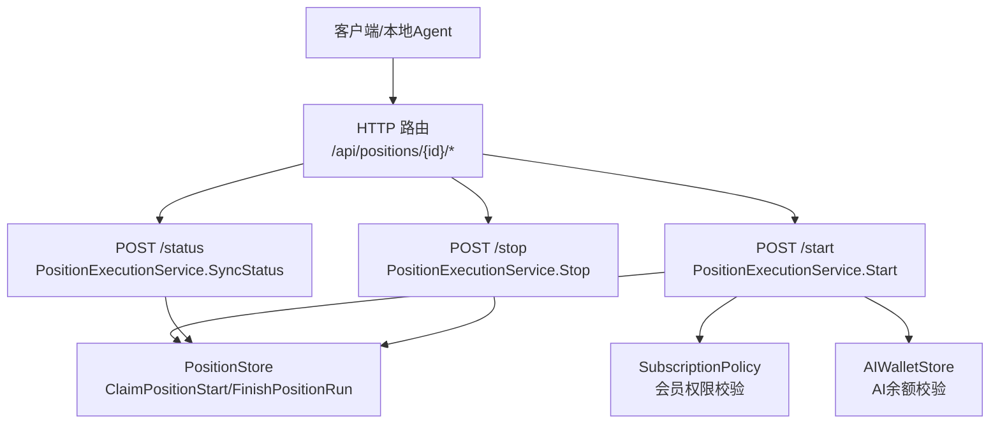
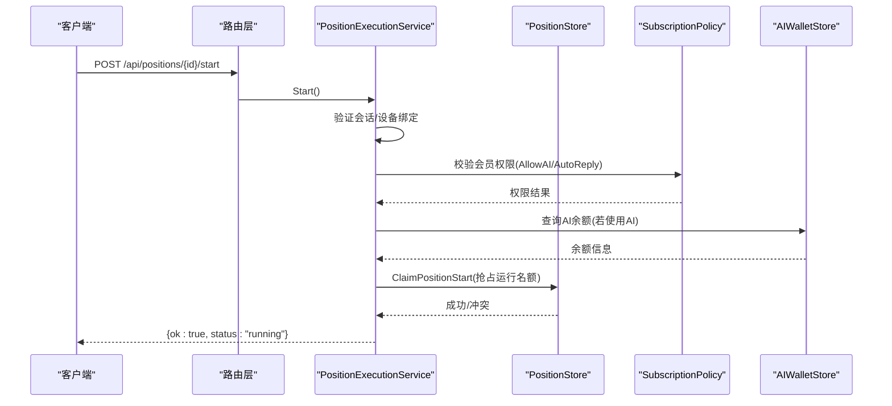
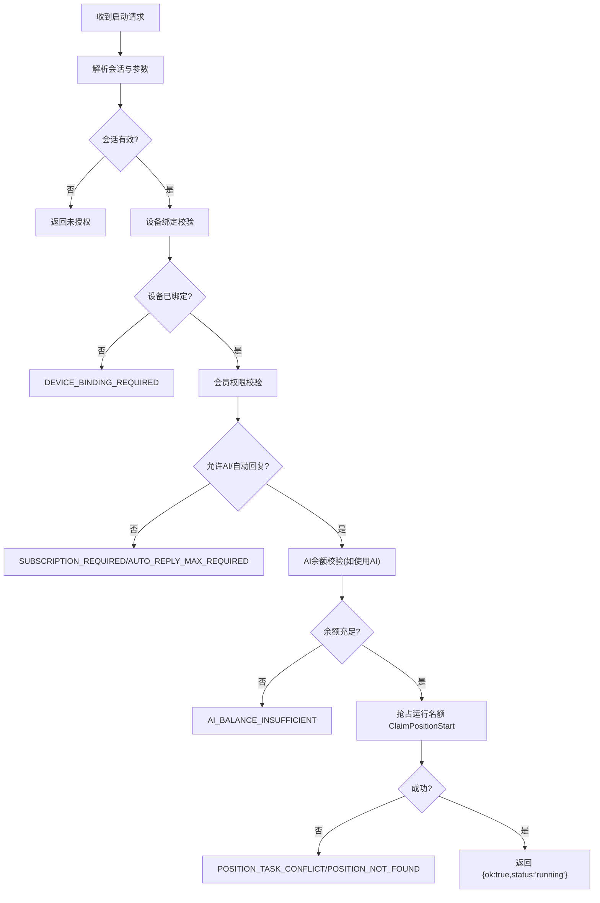
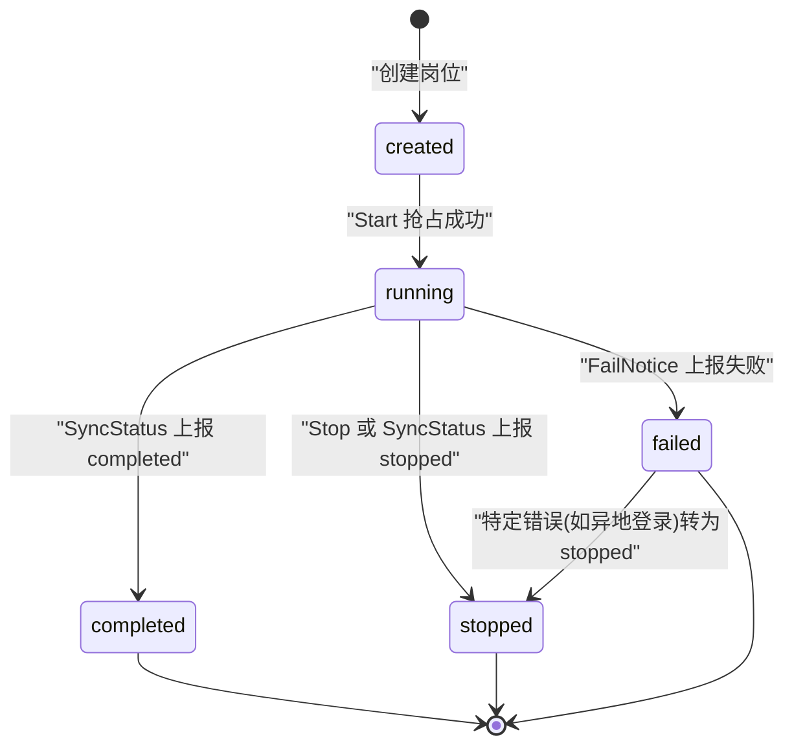
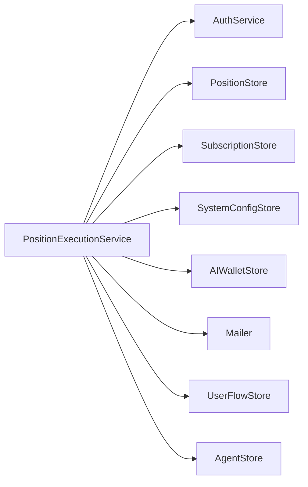

# 岗位执行控制接口

<cite>
**本文引用的文件**
- [position_execution.go](file://goodhr5/cloud/backend/internal/httpapi/position_execution.go)
- [server.go](file://goodhr5/cloud/backend/internal/httpapi/server.go)
- [position_store.go](file://goodhr5/cloud/backend/internal/httpapi/position_store.go)
- [subscription_policy.go](file://goodhr5/cloud/backend/internal/httpapi/subscription_policy.go)
- [ai_wallet.go](file://goodhr5/cloud/backend/internal/httpapi/ai_wallet.go)
</cite>

## 目录
1. [简介](#简介)
2. [项目结构](#项目结构)
3. [核心组件](#核心组件)
4. [架构总览](#架构总览)
5. [详细组件分析](#详细组件分析)
6. [依赖关系分析](#依赖关系分析)
7. [性能考虑](#性能考虑)
8. [故障排查指南](#故障排查指南)
9. [结论](#结论)
10. [附录：API 规范与错误码](#附录api-规范与错误码)

## 简介
本文件为“岗位执行控制”的完整 API 文档，覆盖以下三个核心接口：
- POST /api/positions/{id}/start：启动岗位运行（含设备绑定、会员权限、AI 余额、账号冲突等启动检查）
- POST /api/positions/{id}/stop：停止岗位运行
- POST /api/positions/{id}/status：同步运行状态（running/completed/stopped）

同时说明岗位生命周期状态机转换规则、请求参数与响应格式、错误码及处理建议。

## 项目结构
云端后端通过统一路由分发到岗位执行服务，关键路径如下：
- 路由注册：/api/positions/{id} 子资源由 positionRoute 根据后缀分派到 start/stop/status 等处理器
- 业务实现：PositionExecutionService 负责启动校验、状态同步、失败通知与邮件提醒
- 数据持久化：PositionStore 提供岗位状态变更、计数更新、并发占用名额等能力
- 权限与计费：SubscriptionPolicy 计算会员可用能力；AIWalletStore 用于 AI 余额校验与扣费

图表来源
- [server.go:214-245](file://goodhr5/cloud/backend/internal/httpapi/server.go#L214-L245)
- [position_execution.go:51-213](file://goodhr5/cloud/backend/internal/httpapi/position_execution.go#L51-L213)
- [position_store.go:129-198](file://goodhr5/cloud/backend/internal/httpapi/position_store.go#L129-L198)

章节来源
- [server.go:123-245](file://goodhr5/cloud/backend/internal/httpapi/server.go#L123-L245)

## 核心组件
- PositionExecutionService：封装岗位启动、停止、状态同步、失败通知、用户流程记录与邮件提醒
- PositionStore：定义并实现岗位配置与运行状态的持久化，包含并发安全的“抢占式”启动
- SubscriptionPolicy：解析系统套餐配置，计算当前用户的会员能力（是否允许 AI、自动回复等）
- AIWalletStore：读取与调整用户 AI 余额，支持内置 AI Key 与扣费流水
- Server/Routes：HTTP 路由组装与公共响应工具

章节来源
- [position_execution.go:21-47](file://goodhr5/cloud/backend/internal/httpapi/position_execution.go#L21-L47)
- [position_store.go:49-62](file://goodhr5/cloud/backend/internal/httpapi/position_store.go#L49-L62)
- [subscription_policy.go:18-43](file://goodhr5/cloud/backend/internal/httpapi/subscription_policy.go#L18-L43)
- [ai_wallet.go:48-58](file://goodhr5/cloud/backend/internal/httpapi/ai_wallet.go#L48-L58)
- [server.go:16-44](file://goodhr5/cloud/backend/internal/httpapi/server.go#L16-L44)

## 架构总览
岗位执行控制采用“网关路由 + 领域服务 + 存储抽象”的分层设计：
- 路由层：统一接收 HTTP 请求，按路径分派到对应处理器
- 服务层：PositionExecutionService 编排校验逻辑（设备绑定、会员、AI 余额、冲突检测），调用存储与外部能力
- 存储层：PositionStore/AIWalletStore/SubscriptionPolicy 等提供数据与策略能力

图表来源
- [server.go:214-245](file://goodhr5/cloud/backend/internal/httpapi/server.go#L214-L245)
- [position_execution.go:51-91](file://goodhr5/cloud/backend/internal/httpapi/position_execution.go#L51-L91)
- [position_store.go:129-150](file://goodhr5/cloud/backend/internal/httpapi/position_store.go#L129-L150)
- [subscription_policy.go:111-142](file://goodhr5/cloud/backend/internal/httpapi/subscription_policy.go#L111-L142)
- [ai_wallet.go:498-505](file://goodhr5/cloud/backend/internal/httpapi/ai_wallet.go#L498-L505)

## 详细组件分析

### 启动接口 POST /api/positions/{id}/start
- 功能：在本地 Agent 发起启动前进行云端校验，通过后写入 running 并返回成功
- 认证与会话：从请求中解析登录会话，未登录或过期直接拒绝
- 设备绑定验证：要求来自已绑定的稳定设备，否则返回 DEVICE_BINDING_REQUIRED
- 会员权限检查：若岗位使用 AI 或自动回复，需满足会员有效且具备相应能力
- AI 余额验证：若使用 AI，需满足最低余额阈值（单位换算后不低于 0.10 元）
- 账号冲突检测：同一账号仅允许一个岗位处于 running，冲突时返回 POSITION_TASK_CONFLICT
- 成功响应：{ ok: true, status: "running" }

图表来源
- [position_execution.go:51-91](file://goodhr5/cloud/backend/internal/httpapi/position_execution.go#L51-L91)
- [position_execution.go:216-275](file://goodhr5/cloud/backend/internal/httpapi/position_execution.go#L216-L275)
- [position_store.go:129-150](file://goodhr5/cloud/backend/internal/httpapi/position_store.go#L129-L150)
- [subscription_policy.go:111-142](file://goodhr5/cloud/backend/internal/httpapi/subscription_policy.go#L111-L142)
- [ai_wallet.go:498-505](file://goodhr5/cloud/backend/internal/httpapi/ai_wallet.go#L498-L505)

章节来源
- [position_execution.go:51-91](file://goodhr5/cloud/backend/internal/httpapi/position_execution.go#L51-L91)
- [position_execution.go:216-275](file://goodhr5/cloud/backend/internal/httpapi/position_execution.go#L216-L275)

### 停止接口 POST /api/positions/{id}/stop
- 功能：将岗位状态置为 stopped，并发送停止通知邮件（若需要）
- 幂等性：若已是 stopped，则不重复写库，但仍可尝试发送邮件
- 成功响应：{ ok: true, status: "stopped" }

章节来源
- [position_execution.go:93-123](file://goodhr5/cloud/backend/internal/httpapi/position_execution.go#L93-L123)

### 状态同步接口 POST /api/positions/{id}/status
- 功能：接收本地程序上报的运行状态（running/completed/stopped），并更新数据库与统计
- running：会再次进行设备绑定与抢占校验，确保一致性
- completed：发送完成邮件，更新结束时间与打招呼数
- stopped：记录日志并发送停止邮件
- 成功响应：{ ok: true, status: "<上报状态>", notice_sent: boolean }

章节来源
- [position_execution.go:125-213](file://goodhr5/cloud/backend/internal/httpapi/position_execution.go#L125-L213)

### 状态机与转换规则
岗位状态包括 created、running、completed、stopped、failed。主要转换如下：
- created → running：通过 Start 抢占成功后写入
- running → completed：SyncStatus 上报 completed 后写入
- running → stopped：Stop 或 SyncStatus 上报 stopped 后写入
- running → failed：FailNotice 上报失败后写入（特定错误如“账号已在其他地方登录”会转为 stopped）
- 任意终态不可逆：completed/stopped/failed 为终止状态

图表来源
- [position_store.go:129-198](file://goodhr5/cloud/backend/internal/httpapi/position_store.go#L129-L198)
- [position_execution.go:311-371](file://goodhr5/cloud/backend/internal/httpapi/position_execution.go#L311-L371)

章节来源
- [position_store.go:129-198](file://goodhr5/cloud/backend/internal/httpapi/position_store.go#L129-L198)
- [position_execution.go:311-371](file://goodhr5/cloud/backend/internal/httpapi/position_execution.go#L311-L371)

### 启动检查流程详解
- 设备绑定验证：verifyActiveDevice 检查 machineID 是否为稳定设备且已绑定当前账号
- 会员权限检查：claimPositionStart 中调用 subscriptionAccess 判断 AllowAI 与 AllowAutoReply
- AI 余额验证：若使用 AI，读取 AIWalletStore.BalanceUnits 并与最小阈值比较
- 账号冲突检测：ClaimPositionStart 在同一账号维度保证仅有一个 running 任务

章节来源
- [position_execution.go:216-275](file://goodhr5/cloud/backend/internal/httpapi/position_execution.go#L216-L275)
- [subscription_policy.go:111-142](file://goodhr5/cloud/backend/internal/httpapi/subscription_policy.go#L111-L142)
- [ai_wallet.go:498-505](file://goodhr5/cloud/backend/internal/httpapi/ai_wallet.go#L498-L505)
- [position_store.go:129-150](file://goodhr5/cloud/backend/internal/httpapi/position_store.go#L129-L150)

## 依赖关系分析
- PositionExecutionService 依赖：
  - AuthService：会话校验
  - PositionStore：岗位读写与并发抢占
  - SubscriptionStore/SystemConfigStore：会员与套餐配置
  - AIWalletStore：AI 余额读取
  - Mailer：状态通知邮件
  - UserFlowStore：业务流程事件记录
  - AgentStore：设备绑定校验
- 路由层依赖 Server.positionRoute 进行分派

图表来源
- [position_execution.go:21-47](file://goodhr5/cloud/backend/internal/httpapi/position_execution.go#L21-L47)
- [server.go:16-44](file://goodhr5/cloud/backend/internal/httpapi/server.go#L16-L44)

章节来源
- [position_execution.go:21-47](file://goodhr5/cloud/backend/internal/httpapi/position_execution.go#L21-L47)
- [server.go:16-44](file://goodhr5/cloud/backend/internal/httpapi/server.go#L16-L44)

## 性能考虑
- 并发安全：ClaimPositionStart 在存储层加锁，避免多实例下重复抢占
- 幂等处理：FinishPositionRun 对相同状态写入做幂等保护
- 网络超时：AI 钱包与上游调用设置合理超时，避免阻塞
- 缓存与限流：可根据部署环境引入 Redis 缓存热点配置（如套餐配置）

[本节为通用指导，无需具体文件引用]

## 故障排查指南
- 设备绑定问题：确认本地 Agent 已成功绑定稳定设备，刷新后台并重试
- 会员权限不足：检查会员是否到期或套餐不支持 AI/自动回复
- AI 余额不足：充值至至少 0.10 元后再启动
- 账号冲突：同一账号只能有一个 running 任务，先停止现有任务
- 邮件发送失败：检查邮件服务配置，关注错误日志中的“岗位邮件”提示

章节来源
- [position_execution.go:216-275](file://goodhr5/cloud/backend/internal/httpapi/position_execution.go#L216-L275)
- [position_execution.go:373-406](file://goodhr5/cloud/backend/internal/httpapi/position_execution.go#L373-L406)

## 结论
岗位执行控制通过严格的启动检查与清晰的状态机，确保多租户环境下资源安全与一致性。配合统一的错误码与通知机制，便于前端与本地 Agent 快速定位问题并采取恢复措施。

[本节为总结，无需具体文件引用]

## 附录：API 规范与错误码

### 通用约定
- 所有接口均使用 JSON 响应体
- 成功响应统一包含 ok 字段
- 错误响应包含 error.code 与 error.message（部分接口使用字符串错误消息）

### 启动接口 POST /api/positions/{id}/start
- 路径：/api/positions/{id}/start
- 方法：POST
- 认证：需要有效会话
- 请求体：
  - task_type：string，主流程类型（例如 auto_reply）
  - machine_id：string，本地设备标识
- 成功响应：
  - { ok: true, status: "running" }
- 错误码与建议：
  - METHOD_NOT_ALLOWED：仅支持 POST
  - SESSION_EXPIRED：登录失效，请重新登录
  - INVALID_REQUEST：请求体解析失败，请重试
  - POSITION_NOT_FOUND：岗位不存在或被删除
  - DEVICE_BINDING_REQUIRED：设备未绑定，刷新后台并等待本地程序重连
  - SUBSCRIPTION_CHECK_FAILED：会员状态暂不可用，稍后重试
  - SUBSCRIPTION_REQUIRED：岗位使用 AI，会员到期无法启动，请先续费
  - AUTO_REPLY_MAX_REQUIRED：自动回复需 Max 全能版，当前套餐不支持
  - AI_BALANCE_UNAVAILABLE：AI 余额暂不可用，稍后重试
  - AI_BALANCE_INSUFFICIENT：AI 余额不足 0.10 元，请先充值
  - POSITION_TASK_CONFLICT：已有岗位运行中，请先停止
  - POSITION_START_FAILED：云端记录失败，稍后重试

章节来源
- [position_execution.go:51-91](file://goodhr5/cloud/backend/internal/httpapi/position_execution.go#L51-L91)
- [position_execution.go:216-275](file://goodhr5/cloud/backend/internal/httpapi/position_execution.go#L216-L275)

### 停止接口 POST /api/positions/{id}/stop
- 路径：/api/positions/{id}/stop
- 方法：POST
- 认证：需要有效会话
- 请求体：无
- 成功响应：
  - { ok: true, status: "stopped" }
- 错误码与建议：
  - method not allowed：仅支持 POST
  - session invalid or expired：会话无效或过期
  - position not found：岗位不存在
  - failed to load position：加载岗位失败

章节来源
- [position_execution.go:93-123](file://goodhr5/cloud/backend/internal/httpapi/position_execution.go#L93-L123)

### 状态同步接口 POST /api/positions/{id}/status
- 路径：/api/positions/{id}/status
- 方法：POST
- 认证：需要有效会话
- 请求体：
  - status：string，running/completed/stopped
  - task_type：string，主流程类型
  - run_greeted_count：int，本次打招呼数量
  - run_skipped_count：int，本次跳过数量
  - machine_id：string，本地设备标识（running 时需校验）
- 成功响应：
  - { ok: true, status: "<上报状态>", notice_sent: boolean }
- 错误码与建议：
  - method not allowed：仅支持 POST
  - invalid payload：请求体解析失败
  - unsupported status：不支持的状态值
  - position not found：岗位不存在
  - failed to load position：加载岗位失败
  - failed to send position completion notice：完成通知发送失败
  - failed to update position status：状态更新失败

章节来源
- [position_execution.go:125-213](file://goodhr5/cloud/backend/internal/httpapi/position_execution.go#L125-L213)

### 失败通知接口 POST /api/fail-notice
- 路径：/api/fail-notice
- 方法：POST
- 认证：支持旧会话（兼容）
- 请求体：
  - position_id：string，岗位 ID
  - error_message：string，错误信息
  - run_greeted_count：int，本次打招呼数量
  - run_skipped_count：int，本次跳过数量
- 成功响应：
  - { ok: true, status: "notified" }
- 行为说明：
  - 若错误包含“账号已在其他地方登录”，会将状态转为 stopped
  - 记录用户流程事件并发送状态邮件

章节来源
- [position_execution.go:311-371](file://goodhr5/cloud/backend/internal/httpapi/position_execution.go#L311-L371)