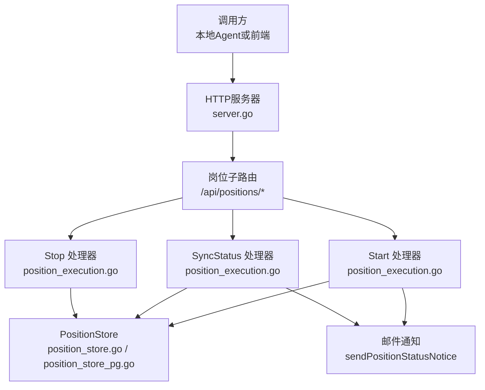
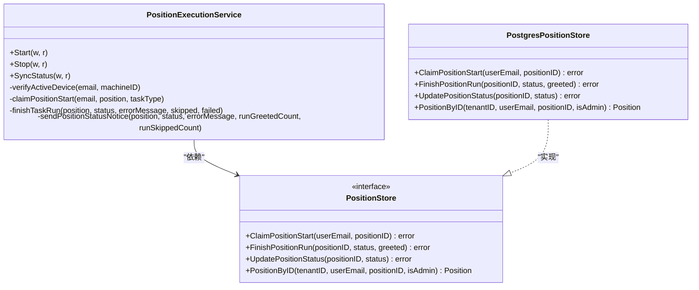
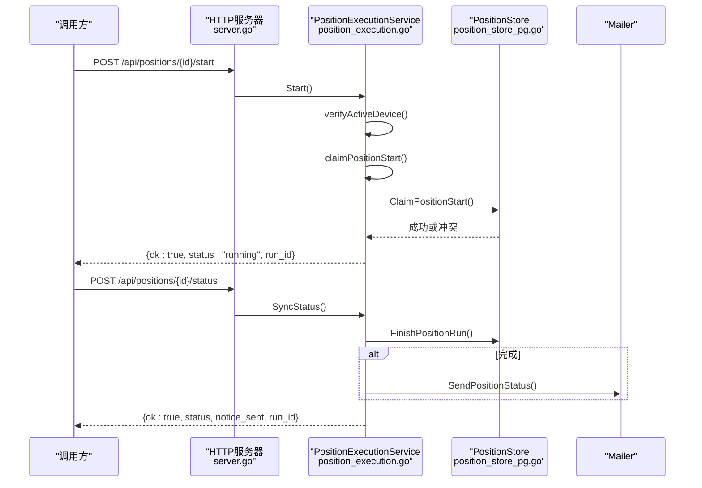
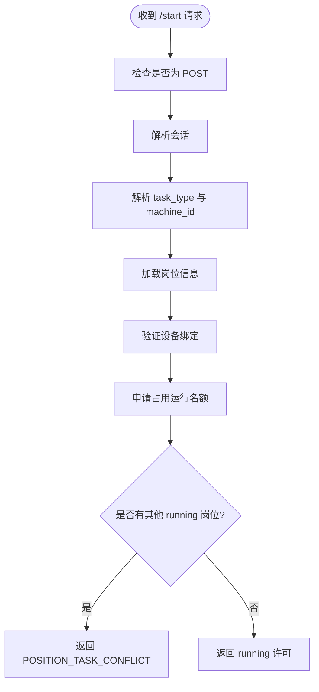
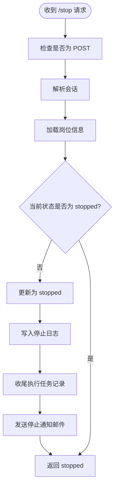
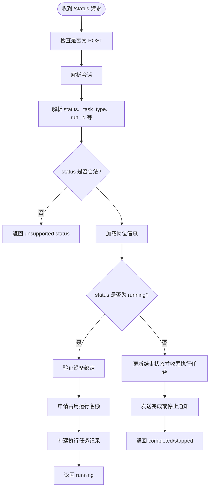
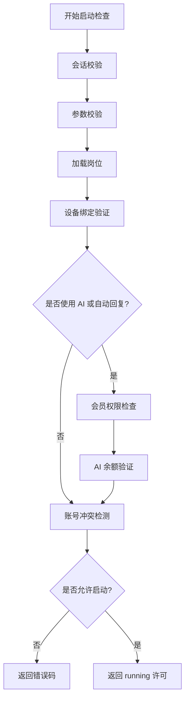
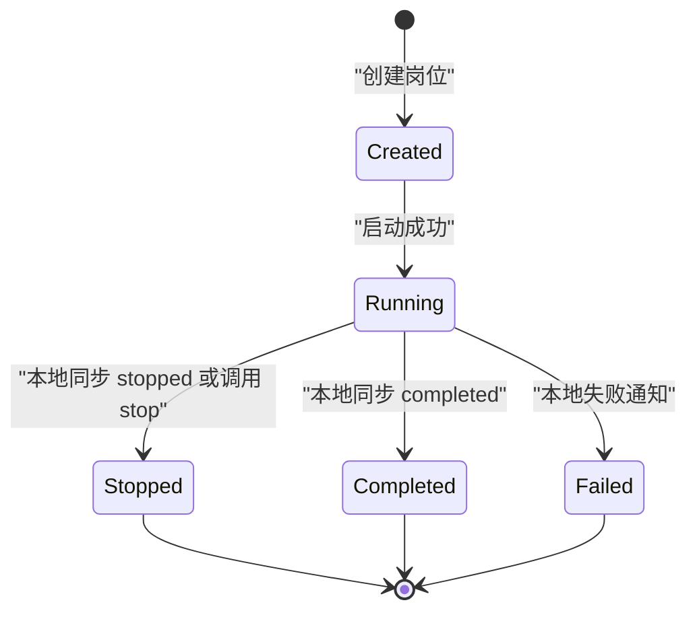
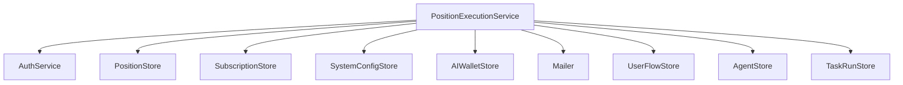

# 岗位执行控制接口

<cite>
**本文引用的文件**   
- [position_execution.go](file://goodhr5/cloud/backend/internal/httpapi/position_execution.go)
- [server.go](file://goodhr5/cloud/backend/internal/httpapi/server.go)
- [position_store.go](file://goodhr5/cloud/backend/internal/httpapi/position_store.go)
- [position_store_pg.go](file://goodhr5/cloud/backend/internal/httpapi/position_store_pg.go)
- [position_log_test.go](file://goodhr5/cloud/backend/internal/httpapi/position_log_test.go)
</cite>

## 目录
1. [简介](#简介)
2. [项目结构定位](#项目结构定位)
3. [核心组件](#核心组件)
4. [架构总览](#架构总览)
5. [详细接口规范](#详细接口规范)
6. [启动检查流程](#启动检查流程)
7. [运行状态机与转换规则](#运行状态机与转换规则)
8. [依赖关系分析](#依赖关系分析)
9. [性能与并发特性](#性能与并发特性)
10. [故障排查指南](#故障排查指南)
11. [结论](#结论)

## 简介
本文件面向“岗位执行控制”相关 API，聚焦云端后端对本地 Agent 的岗位生命周期管理。需要重点掌握三个接口：
- POST /api/positions/{id}/start：启动岗位运行许可。
- POST /api/positions/{id}/stop：停止岗位运行。
- POST /api/positions/{id}/status：同步岗位运行状态。

这些接口由云端 HTTP 服务路由到 `PositionExecutionService`，负责会话校验、设备绑定验证、会员权限检查、AI 余额校验、账号冲突检测、岗位状态持久化、执行任务记录收尾以及结束通知邮件发送。

## 项目结构定位
岗位执行控制逻辑位于云端后端的 HTTP API 层，核心实现集中在以下文件：
- 路由注册与分发：[server.go](file://goodhr5/cloud/backend/internal/httpapi/server.go)
- 岗位执行服务：[position_execution.go](file://goodhr5/cloud/backend/internal/httpapi/position_execution.go)
- 岗位数据模型与存储接口：[position_store.go](file://goodhr5/cloud/backend/internal/httpapi/position_store.go)
- PostgreSQL 岗位存储实现：[position_store_pg.go](file://goodhr5/cloud/backend/internal/httpapi/position_store_pg.go)
- 停止接口行为测试用例参考：[position_log_test.go](file://goodhr5/cloud/backend/internal/httpapi/position_log_test.go)

**图表来源**
- [server.go:231-281](file://goodhr5/cloud/backend/internal/httpapi/server.go#L231-L281)
- [position_execution.go:55-96](file://goodhr5/cloud/backend/internal/httpapi/position_execution.go#L55-L96)
- [position_execution.go:138-167](file://goodhr5/cloud/backend/internal/httpapi/position_execution.go#L138-L167)
- [position_execution.go:170-276](file://goodhr5/cloud/backend/internal/httpapi/position_execution.go#L170-L276)

**章节来源**
- [server.go:231-281](file://goodhr5/cloud/backend/internal/httpapi/server.go#L231-L281)
- [position_execution.go:22-51](file://goodhr5/cloud/backend/internal/httpapi/position_execution.go#L22-L51)

## 核心组件
- `PositionExecutionService`：岗位执行控制的核心服务，封装启动、停止、状态同步、失败通知、用户流程记录、执行任务记录收尾等能力。
- `PositionStore`：岗位配置与状态的存储抽象，包含内存实现和 PostgreSQL 实现。
- `PostgresPositionStore`：使用 PostgreSQL 事务与行级锁保证并发安全，防止同一账号同时运行多个岗位。
- 邮件通知：通过 `sendPositionStatusNotice` 在岗位完成、停止或失败时发送邮件提醒。

**图表来源**
- [position_execution.go:22-51](file://goodhr5/cloud/backend/internal/httpapi/position_execution.go#L22-L51)
- [position_store.go:50-63](file://goodhr5/cloud/backend/internal/httpapi/position_store.go#L50-L63)
- [position_store_pg.go:13-21](file://goodhr5/cloud/backend/internal/httpapi/position_store_pg.go#L13-L21)

**章节来源**
- [position_execution.go:22-51](file://goodhr5/cloud/backend/internal/httpapi/position_execution.go#L22-L51)
- [position_store.go:50-63](file://goodhr5/cloud/backend/internal/httpapi/position_store.go#L50-L63)
- [position_store_pg.go:13-21](file://goodhr5/cloud/backend/internal/httpapi/position_store_pg.go#L13-L21)

## 架构总览
岗位执行控制的请求路径统一经过 `/api/positions` 路由，再根据后缀分发到具体处理器：
- `/start` → `PositionExecutionService.Start`
- `/stop` → `PositionExecutionService.Stop`
- `/status` → `PositionExecutionService.SyncStatus`

**图表来源**
- [server.go:231-281](file://goodhr5/cloud/backend/internal/httpapi/server.go#L231-L281)
- [position_execution.go:55-96](file://goodhr5/cloud/backend/internal/httpapi/position_execution.go#L55-L96)
- [position_execution.go:170-276](file://goodhr5/cloud/backend/internal/httpapi/position_execution.go#L170-L276)
- [position_store_pg.go:343-385](file://goodhr5/cloud/backend/internal/httpapi/position_store_pg.go#L343-L385)

## 详细接口规范

### POST /api/positions/{id}/start（启动岗位运行）
- 功能：校验登录、设备绑定、岗位归属、会员权限、AI 余额、账号冲突，通过后返回运行许可。
- 方法：POST
- 路径：`/api/positions/{id}/start`
- 认证：需要有效会话；错误时返回 `SESSION_EXPIRED`。
- 请求体字段：
  - `task_type`：本地主流程类型，例如打招呼或自动回复。
  - `machine_id`：本地设备的机器码，用于设备绑定校验。
- 成功响应：
  - `ok`：布尔值，表示是否成功。
  - `status`：固定为 `"running"`。
  - `run_id`：本次执行任务记录 ID，可能为空。
- 典型错误：
  - `METHOD_NOT_ALLOWED`：非 POST。
  - `INVALID_REQUEST`：请求体无效。
  - `POSITION_NOT_FOUND`：岗位不存在。
  - `DEVICE_BINDING_REQUIRED`：设备未绑定或未激活。
  - `SUBSCRIPTION_CHECK_FAILED`：会员状态查询失败。
  - `SUBSCRIPTION_REQUIRED`：会员不允许使用 AI。
  - `AUTO_REPLY_MAX_REQUIRED`：自动回复需要更高套餐权限。
  - `AI_BALANCE_UNAVAILABLE`：AI 余额查询失败。
  - `AI_BALANCE_INSUFFICIENT`：AI 余额不足。
  - `POSITION_TASK_CONFLICT`：账号已有岗位运行中。
  - `POSITION_START_FAILED`：云端未能记录岗位状态。

**图表来源**
- [position_execution.go:55-96](file://goodhr5/cloud/backend/internal/httpapi/position_execution.go#L55-L96)
- [position_execution.go:279-338](file://goodhr5/cloud/backend/internal/httpapi/position_execution.go#L279-L338)

**章节来源**
- [position_execution.go:55-96](file://goodhr5/cloud/backend/internal/httpapi/position_execution.go#L55-L96)
- [position_execution.go:279-338](file://goodhr5/cloud/backend/internal/httpapi/position_execution.go#L279-L338)

### POST /api/positions/{id}/stop（停止岗位运行）
- 功能：将岗位状态更新为 `stopped`，写入日志，收尾执行任务记录，并尝试发送停止通知邮件。
- 方法：POST
- 路径：`/api/positions/{id}/stop`
- 认证：需要有效会话。
- 请求体：无必需字段。
- 成功响应：
  - `ok`：布尔值。
  - `status`：固定为 `"stopped"`。
- 幂等性：如果岗位已经是 `stopped`，则不重复写库，但仍会尝试发送通知。
- 典型错误：
  - `method not allowed`：非 POST。
  - `session invalid or expired`：会话失效。
  - `position not found`：岗位不存在。
  - `failed to load position`：加载岗位失败。

**图表来源**
- [position_execution.go:138-167](file://goodhr5/cloud/backend/internal/httpapi/position_execution.go#L138-L167)

**章节来源**
- [position_execution.go:138-167](file://goodhr5/cloud/backend/internal/httpapi/position_execution.go#L138-L167)
- [position_log_test.go:71-96](file://goodhr5/cloud/backend/internal/httpapi/position_log_test.go#L71-L96)

### POST /api/positions/{id}/status（同步运行状态）
- 功能：接收本地程序同步的岗位运行状态，支持 `running`、`completed`、`stopped`。
- 方法：POST
- 路径：`/api/positions/{id}/status`
- 认证：需要有效会话。
- 请求体字段：
  - `status`：`running`、`completed`、`stopped`。
  - `task_type`：本地主流程类型。
  - `run_id`：本次执行任务记录 ID。
  - `run_greeted_count`：本次打招呼数量。
  - `run_skipped_count`：本次跳过数量。
  - `machine_id`：本地设备机器码。
- 成功响应：
  - `ok`：布尔值。
  - `status`：同步的状态。
  - `notice_sent`：是否已发送状态通知邮件。
  - `run_id`：本次执行任务记录 ID。
- 典型错误：
  - `method not allowed`：非 POST。
  - `invalid payload`：请求体无效。
  - `unsupported status`：不支持的状态值。
  - `position not found`：岗位不存在。
  - `failed to load position`：加载岗位失败。
  - `failed to send position completion notice`：完成通知邮件发送失败。
  - `failed to update position status`：更新岗位状态失败。

**图表来源**
- [position_execution.go:170-276](file://goodhr5/cloud/backend/internal/httpapi/position_execution.go#L170-L276)

**章节来源**
- [position_execution.go:170-276](file://goodhr5/cloud/backend/internal/httpapi/position_execution.go#L170-L276)

## 启动检查流程
启动检查由 `verifyActiveDevice` 与 `claimPositionStart` 共同完成，顺序如下：

1. **会话校验**：从请求中提取会话，失败返回 `SESSION_EXPIRED`。
2. **参数校验**：解析 `task_type` 与 `machine_id`，失败返回 `INVALID_REQUEST`。
3. **岗位加载**：按租户与邮箱加载岗位，失败返回 `POSITION_NOT_FOUND` 或 `POSITION_LOAD_FAILED`。
4. **设备绑定验证**：
   - 要求 `machine_id` 稳定且已绑定。
   - 若未绑定或绑定无效，返回 `DEVICE_BINDING_REQUIRED`。
5. **会员权限检查**：
   - 若岗位使用 AI 或任务类型为自动回复，则读取会员套餐。
   - 若不允许使用 AI，返回 `SUBSCRIPTION_REQUIRED`。
   - 若自动回复需要 Pro 权限但当前套餐不允许，返回 `AUTO_REPLY_MAX_REQUIRED`。
6. **AI 余额验证**：
   - 若 AI 余额不可用，返回 `AI_BALANCE_UNAVAILABLE`。
   - 若余额低于最低阈值，返回 `AI_BALANCE_INSUFFICIENT`。
7. **账号冲突检测**：
   - 通过 `ClaimPositionStart` 原子抢占运行名额。
   - 若已有 running 岗位，返回 `POSITION_TASK_CONFLICT`。
   - 若岗位不存在，返回 `POSITION_NOT_FOUND`。
   - 若云端无法记录状态，返回 `POSITION_START_FAILED`。

**图表来源**
- [position_execution.go:55-96](file://goodhr5/cloud/backend/internal/httpapi/position_execution.go#L55-L96)
- [position_execution.go:279-338](file://goodhr5/cloud/backend/internal/httpapi/position_execution.go#L279-L338)

**章节来源**
- [position_execution.go:55-96](file://goodhr5/cloud/backend/internal/httpapi/position_execution.go#L55-L96)
- [position_execution.go:279-338](file://goodhr5/cloud/backend/internal/httpapi/position_execution.go#L279-L338)

## 运行状态机与转换规则
岗位状态主要包含 `created`、`running`、`completed`、`stopped`、`failed`。关键转换规则如下：

- `created` → `running`：通过 `ClaimPositionStart` 成功后设置。
- `running` → `completed`：本地程序上报 `status=completed`，云端调用 `FinishPositionRun` 并发送完成通知。
- `running` → `stopped`：本地程序上报 `status=stopped`，或调用 `/stop` 接口，云端调用 `FinishPositionRun` 并发送停止通知。
- `running` → `failed`：本地程序通过失败通知接口上报错误，云端根据错误内容判断是否转为 `stopped`，否则标记为 `failed`。
- `stopped`、`completed`、`failed`：终态，不再进入 `running`。

**图表来源**
- [position_store.go:130-173](file://goodhr5/cloud/backend/internal/httpapi/position_store.go#L130-L173)
- [position_store_pg.go:343-414](file://goodhr5/cloud/backend/internal/httpapi/position_store_pg.go#L343-L414)
- [position_execution.go:138-167](file://goodhr5/cloud/backend/internal/httpapi/position_execution.go#L138-L167)
- [position_execution.go:170-276](file://goodhr5/cloud/backend/internal/httpapi/position_execution.go#L170-L276)
- [position_execution.go:375-435](file://goodhr5/cloud/backend/internal/httpapi/position_execution.go#L375-L435)

**章节来源**
- [position_store.go:130-173](file://goodhr5/cloud/backend/internal/httpapi/position_store.go#L130-L173)
- [position_store_pg.go:343-414](file://goodhr5/cloud/backend/internal/httpapi/position_store_pg.go#L343-L414)
- [position_execution.go:138-167](file://goodhr5/cloud/backend/internal/httpapi/position_execution.go#L138-L167)
- [position_execution.go:170-276](file://goodhr5/cloud/backend/internal/httpapi/position_execution.go#L170-L276)
- [position_execution.go:375-435](file://goodhr5/cloud/backend/internal/httpapi/position_execution.go#L375-L435)

## 依赖关系分析
- `PositionExecutionService` 依赖：
  - `AuthService`：会话校验。
  - `PositionStore`：岗位加载、状态更新、运行名额抢占。
  - `PlatformAccountStore`：平台账号信息。
  - `SubscriptionStore`：会员套餐查询。
  - `SystemConfigStore`：系统配置读取。
  - `AIWalletStore`：AI 余额查询。
  - `Mailer`：岗位状态通知邮件。
  - `UserFlowStore`：业务流程事件记录。
  - `AgentStore`：设备绑定校验。
  - `TaskRunStore`：执行任务记录创建与收尾。

**图表来源**
- [position_execution.go:22-51](file://goodhr5/cloud/backend/internal/httpapi/position_execution.go#L22-L51)
- [server.go:100-129](file://goodhr5/cloud/backend/internal/httpapi/server.go#L100-L129)

**章节来源**
- [position_execution.go:22-51](file://goodhr5/cloud/backend/internal/httpapi/position_execution.go#L22-L51)
- [server.go:100-129](file://goodhr5/cloud/backend/internal/httpapi/server.go#L100-L129)

## 性能与并发特性
- 并发安全：PostgreSQL 实现使用事务与 advisory lock 确保同一账号只能有一个岗位处于 `running` 状态。
- 幂等性：`FinishPositionRun` 对相同状态进行幂等处理，避免重复统计。
- 超时控制：数据库操作均带上下文超时，防止长时间阻塞。
- 异步通知：邮件发送失败不会阻塞主流程，仅记录日志。

**章节来源**
- [position_store_pg.go:343-385](file://goodhr5/cloud/backend/internal/httpapi/position_store_pg.go#L343-L385)
- [position_store_pg.go:387-414](file://goodhr5/cloud/backend/internal/httpapi/position_store_pg.go#L387-L414)
- [position_execution.go:438-456](file://goodhr5/cloud/backend/internal/httpapi/position_execution.go#L438-L456)

## 故障排查指南
- 启动失败常见原因：
  - 会话过期：检查登录状态。
  - 设备未绑定：确认本地程序已绑定当前账号。
  - 会员权限不足：检查订阅套餐是否允许 AI 或自动回复。
  - AI 余额不足：充值 AI 余额。
  - 账号冲突：停止当前运行的岗位后再启动。
- 停止失败常见原因：
  - 会话失效：重新登录后重试。
  - 岗位不存在：确认岗位 ID 正确。
- 状态同步失败常见原因：
  - 不支持的状态值：只接受 `running`、`completed`、`stopped`。
  - 邮件发送失败：检查邮件配置。
  - 数据库更新失败：检查数据库连接与权限。

**章节来源**
- [position_execution.go:55-96](file://goodhr5/cloud/backend/internal/httpapi/position_execution.go#L55-L96)
- [position_execution.go:138-167](file://goodhr5/cloud/backend/internal/httpapi/position_execution.go#L138-L167)
- [position_execution.go:170-276](file://goodhr5/cloud/backend/internal/httpapi/position_execution.go#L170-L276)

## 结论
岗位执行控制接口通过云端后端对本地 Agent 的生命周期进行严格管控，涵盖启动检查、状态同步、停止处理和失败通知。其核心优势在于：
- 明确的错误码与中文消息，便于前端和用户理解。
- 基于 PostgreSQL 的并发安全机制，防止账号级岗位冲突。
- 完整的状态机定义，确保岗位运行状态可追踪、可审计。
- 可扩展的执行任务记录体系，便于后续分析与统计。

在实际使用中，建议优先关注设备绑定、会员权限和 AI 余额这三个前置条件，并在出现冲突或失败时结合错误码快速定位问题。