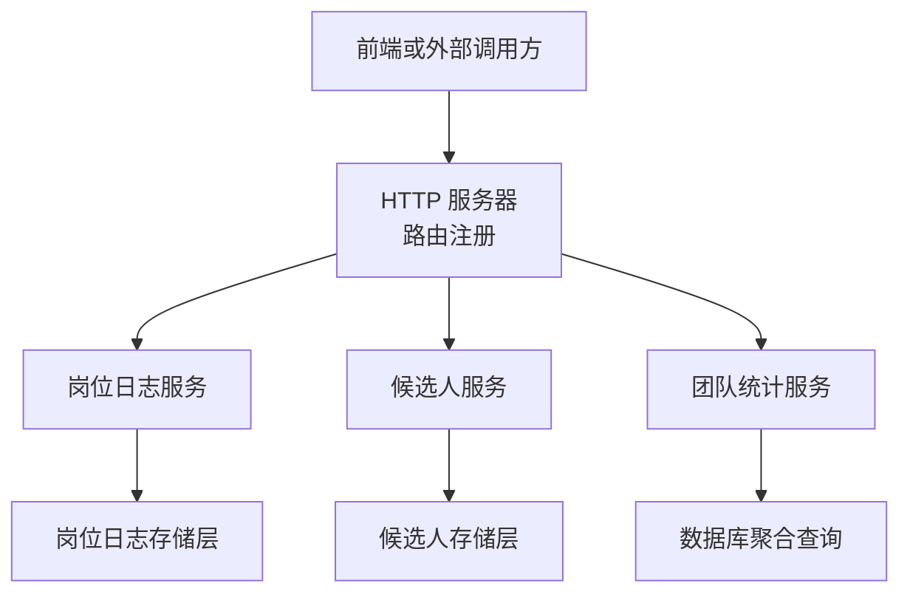
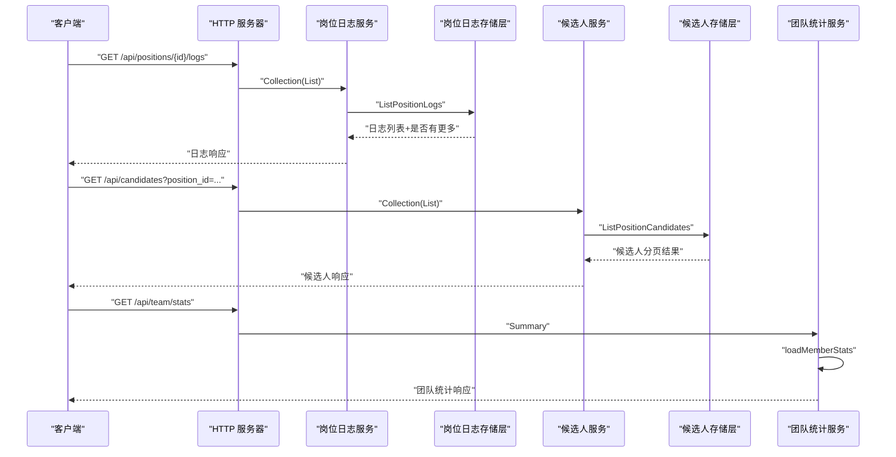
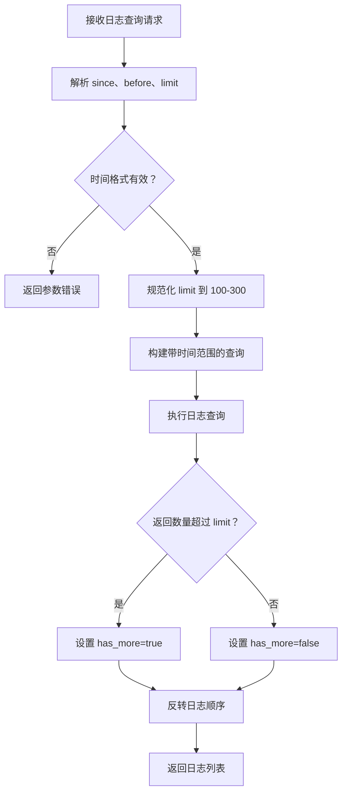
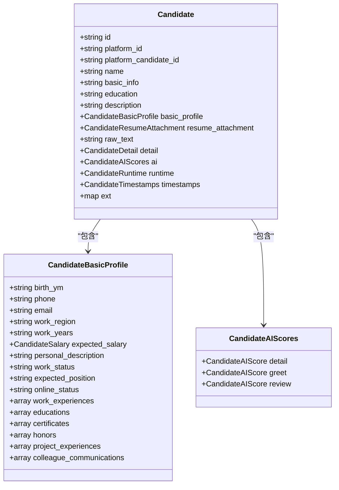
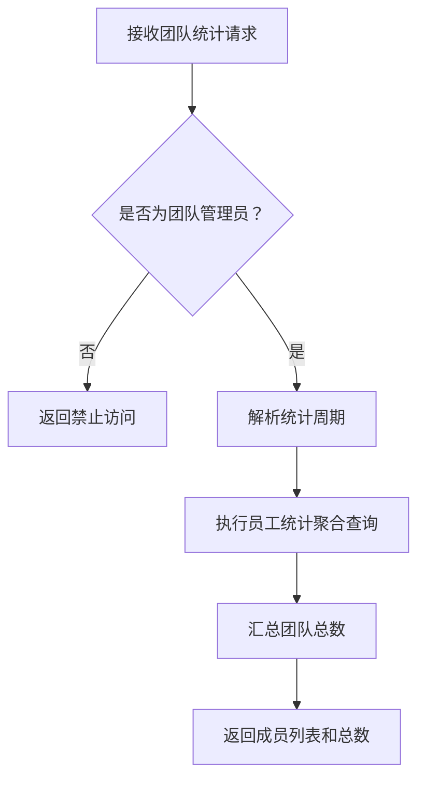
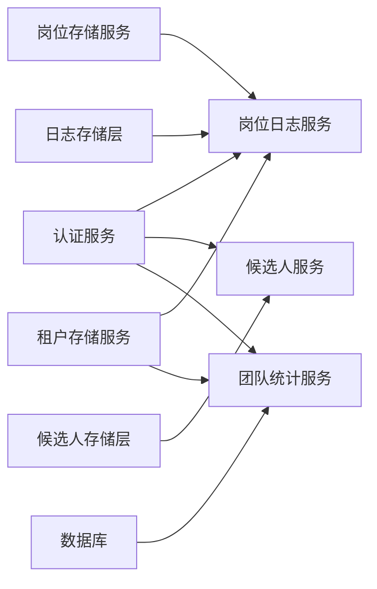

# 岗位监控查询接口

<cite>
**本文引用的文件**   
- [server.go](file://goodhr5/cloud/backend/internal/httpapi/server.go)
- [position_log.go](file://goodhr5/cloud/backend/internal/httpapi/position_log.go)
- [position_log_store_pg.go](file://goodhr5/cloud/backend/internal/httpapi/position_log_store_pg.go)
- [candidate.go](file://goodhr5/cloud/backend/internal/httpapi/candidate.go)
- [candidate_store_pg.go](file://goodhr5/cloud/backend/internal/httpapi/candidate_store_pg.go)
- [team_stats.go](file://goodhr5/cloud/backend/internal/httpapi/team_stats.go)
</cite>

## 目录
1. [简介](#简介)
2. [项目结构定位](#项目结构定位)
3. [核心接口总览](#核心接口总览)
4. [架构与调用链路](#架构与调用链路)
5. [日志查询接口详解](#日志查询接口详解)
6. [候选人列表接口详解](#候选人列表接口详解)
7. [统计数据接口详解](#统计数据接口详解)
8. [依赖关系分析](#依赖关系分析)
9. [性能与分页特性](#性能与分页特性)
10. [故障排查指南](#故障排查指南)
11. [结论](#结论)

## 简介
本文面向“岗位监控查询”场景，说明云端后端提供的三类接口能力：
- 岗位运行日志查询：用于查看某个岗位的自动化运行摘要、错误提示和状态变化。
- 候选人列表查询：用于查看岗位运行过程中同步到云端的候选人数据，包括简历解析结果、匹配评分、沟通历史等。
- 统计数据查询：用于获取团队或岗位维度的运行效率和质量评估指标。

这些接口由云端 HTTP 服务统一注册路由，并由岗位日志服务、候选人存储服务和团队统计服务分别实现业务逻辑。

## 项目结构定位
岗位监控相关代码集中在云端后端的 `internal/httpapi` 包中：
- 路由注册和公共响应工具位于服务器入口文件。
- 岗位日志读取、写入和清理逻辑位于岗位日志服务文件。
- 候选人数据结构定义和 PostgreSQL 存储实现位于候选人相关文件。
- 团队统计汇总逻辑位于团队统计服务文件。

**图表来源**
- [server.go:132-228](file://goodhr5/cloud/backend/internal/httpapi/server.go#L132-L228)
- [position_log.go:13-68](file://goodhr5/cloud/backend/internal/httpapi/position_log.go#L13-L68)
- [candidate_store_pg.go:14-22](file://goodhr5/cloud/backend/internal/httpapi/candidate_store_pg.go#L14-L22)
- [team_stats.go:12-23](file://goodhr5/cloud/backend/internal/httpapi/team_stats.go#L12-L23)

**章节来源**
- [server.go:132-228](file://goodhr5/cloud/backend/internal/httpapi/server.go#L132-L228)

## 核心接口总览
根据需求，岗位监控查询主要包含以下接口路径：
- GET `/api/positions/{id}/logs`：获取岗位运行日志。
- GET `/api/positions/{id}/candidates`：获取岗位下的候选人列表。
- GET `/api/positions/{id}/stats`：获取岗位统计数据。

需要特别说明的是：
- `/api/positions/{id}/logs` 在云端后端有明确实现。
- `/api/positions/{id}/candidates` 在云端后端存在候选人列表接口，但路由注册为 `/api/candidates`，并支持按岗位筛选；当前仓库未找到 `/api/positions/{id}/candidates` 的独立路由。
- `/api/positions/{id}/stats` 在云端后端未找到直接对应实现；现有统计数据接口为 `/api/team/stats`，提供团队维度统计。

| 接口 | 方法 | 实际实现情况 | 说明 |
|---|---|---|---|
| `/api/positions/{id}/logs` | GET | 已实现 | 返回指定岗位的日志摘要，支持时间范围、分页限制。 |
| `/api/positions/{id}/candidates` | GET | 未直接实现 | 候选人列表通过 `/api/candidates` 提供，可传入岗位 ID 筛选。 |
| `/api/positions/{id}/stats` | GET | 未直接实现 | 现有统计接口为 `/api/team/stats`，返回团队维度统计。 |

**章节来源**
- [server.go:194-202](file://goodhr5/cloud/backend/internal/httpapi/server.go#L194-L202)
- [server.go:231-281](file://goodhr5/cloud/backend/internal/httpapi/server.go#L231-L281)

## 架构与调用链路
岗位监控查询的整体调用链路如下：
1. 客户端发起 HTTP 请求。
2. 服务器根据 URL 后缀分发到具体服务。
3. 日志接口由岗位日志服务处理，校验会话、岗位归属后调用日志存储层。
4. 候选人接口由候选人服务处理，最终由候选人存储层执行 SQL 查询。
5. 统计接口由团队统计服务处理，直接对数据库进行聚合查询。

**图表来源**
- [server.go:231-281](file://goodhr5/cloud/backend/internal/httpapi/server.go#L231-L281)
- [position_log.go:56-163](file://goodhr5/cloud/backend/internal/httpapi/position_log.go#L56-L163)
- [candidate_store_pg.go:374-407](file://goodhr5/cloud/backend/internal/httpapi/candidate_store_pg.go#L374-L407)
- [team_stats.go:25-66](file://goodhr5/cloud/backend/internal/httpapi/team_stats.go#L25-L66)

## 日志查询接口详解

### 接口定义
- 路径：`/api/positions/{id}/logs`
- 方法：GET
- 认证：需要有效登录会话
- 权限：只能查看自己岗位或管理员可访问范围内的日志

该接口返回岗位运行过程中的日志摘要，不包含完整的候选人详情，因为候选人详情仍保存在本地 Agent 侧。

### 查询参数
| 参数 | 类型 | 是否必填 | 默认值 | 说明 |
|---|---|---|---|---|
| `since` | RFC3339 时间字符串 | 否 | 无 | 只返回该时间之后的日志 |
| `before` | RFC3339 时间字符串 | 否 | 无 | 只返回该时间之前的日志 |
| `limit` | 整数 | 否 | 100 | 单次返回日志条数，最大 300 |

### 响应字段
| 字段 | 类型 | 说明 |
|---|---|---|
| `ok` | 布尔值 | 表示请求是否成功 |
| `logs` | 数组 | 日志条目列表，从旧到新排序 |
| `has_more` | 布尔值 | 表示是否还有更多日志未返回 |

每条日志包含：
- `id`：日志主键
- `position_id`：岗位 ID
- `level`：日志级别
- `message`：日志消息
- `created_at`：创建时间

### 过滤与分页逻辑
日志查询支持时间范围过滤，但不支持日志级别过滤和关键词搜索。后端会：
1. 解析 `since` 和 `before` 时间参数。
2. 将 `limit` 规范化为 100 到 300 之间。
3. 按创建时间倒序查询，多查一条判断是否还有更多。
4. 返回前将顺序反转，使前端看到从旧到新的阅读顺序。

**图表来源**
- [position_log.go:205-240](file://goodhr5/cloud/backend/internal/httpapi/position_log.go#L205-L240)
- [position_log_store_pg.go:70-124](file://goodhr5/cloud/backend/internal/httpapi/position_log_store_pg.go#L70-L124)

### 错误处理
| 场景 | 状态码 | 响应含义 |
|---|---|---|
| 会话无效或过期 | 401 | 登录状态失效 |
| 岗位不存在 | 404 | 岗位未找到 |
| 加载岗位失败 | 500 | 服务器内部错误 |
| 列出日志失败 | 500 | 服务器内部错误 |
| 参数格式错误 | 400 | 时间或 limit 参数无效 |

**章节来源**
- [position_log.go:56-163](file://goodhr5/cloud/backend/internal/httpapi/position_log.go#L56-L163)
- [position_log.go:205-240](file://goodhr5/cloud/backend/internal/httpapi/position_log.go#L205-L240)
- [position_log_store_pg.go:70-124](file://goodhr5/cloud/backend/internal/httpapi/position_log_store_pg.go#L70-L124)

## 候选人列表接口详解

### 接口定义
虽然需求描述中的路径是 `/api/positions/{id}/candidates`，但当前后端实际暴露的候选人列表接口为：
- 路径：`/api/candidates`
- 方法：GET
- 认证：需要有效登录会话
- 权限：按团队隔离，非管理员只能看自己相关数据

该接口返回候选人主体、触达上下文和最近备注等信息，支持按岗位、用户、状态和关键词筛选，并支持分页。

### 查询参数
| 参数 | 类型 | 是否必填 | 默认值 | 说明 |
|---|---|---|---|---|
| `page` | 整数 | 否 | 1 | 页码 |
| `page_size` | 整数 | 否 | 默认值 | 每页数量 |
| `position_id` | 字符串 | 否 | 无 | 按岗位筛选候选人 |
| `user_email` | 字符串 | 否 | 无 | 按创建人邮箱筛选 |
| `status` | 字符串 | 否 | 无 | 按候选人状态筛选 |
| `keyword` | 字符串 | 否 | 无 | 关键词模糊搜索 |

### 支持的候选人状态
| 状态值 | 含义 |
|---|---|
| `resume_pending` | 简历待处理 |
| `resume_requested` | 已请求简历 |
| `resume_received` | 已收到简历 |
| `resume_downloaded` | 已下载简历 |
| `resume_failed` | 简历处理失败 |
| `detail` | 已抓取详情 |
| `greeted` | 已打招呼 |
| `resume` | 已请求过简历 |

### 候选人数据结构
候选人对象包含以下关键信息：
- 基础信息：姓名、出生年月、电话、邮箱、工作地区、工作年限、期望职位、在线状态、个人描述、工作状态。
- 薪资区间：期望最低薪资和最高薪资。
- 教育经历：学校、专业、学历层次、起止年月。
- 工作经历：公司、职位、内容、起止年月。
- 资格证书、荣誉、项目经验。
- 沟通记录：沟通人、沟通时间、沟通内容。
- AI 评分：详情阶段、打招呼阶段的评分和原因。
- 运行态：元素引用、卡片索引、指纹。
- 时间戳：首次发现时间、详情抓取时间、更新时间、打招呼时间。
- 扩展字段：平台或流程附加信息。

**图表来源**
- [candidate.go:126-143](file://goodhr5/cloud/backend/internal/httpapi/candidate.go#L126-L143)
- [candidate.go:61-98](file://goodhr5/cloud/backend/internal/httpapi/candidate.go#L61-L98)

### 筛选与导出能力
当前实现的候选人筛选包括：
- 按岗位筛选：通过 `position_id` 限定候选人必须与该岗位存在触达关系。
- 按用户筛选：通过 `user_email` 限定候选人必须由指定用户创建。
- 按状态筛选：支持简历状态、详情抓取、打招呼、简历请求等状态。
- 关键词搜索：对姓名、电话、邮箱、工作地区、工作年限、学历、期望职位、基本信息、个人描述、原始文本进行模糊匹配。

关于导出功能：
- 当前后端未实现专门的 CSV 或 Excel 导出接口。
- 前端可通过分页接口拉取全部候选人数据后进行本地导出。
- 候选人详情接口支持获取事件流水，可用于分析沟通历史和 AI 评分过程。

**章节来源**
- [candidate.go:6-153](file://goodhr5/cloud/backend/internal/httpapi/candidate.go#L6-L153)
- [candidate_store_pg.go:374-407](file://goodhr5/cloud/backend/internal/httpapi/candidate_store_pg.go#L374-L407)
- [candidate_store_pg.go:683-729](file://goodhr5/cloud/backend/internal/httpapi/candidate_store_pg.go#L683-L729)

## 统计数据接口详解

### 接口定义
需求中提到的 `/api/positions/{id}/stats` 在当前后端没有直接实现。现有统计数据接口为：
- 路径：`/api/team/stats`
- 方法：GET
- 权限：仅团队管理员可访问
- 默认周期：本月

该接口返回团队内每个员工的岗位运行数据和候选人处理数据，并提供汇总总数。

### 查询参数
| 参数 | 类型 | 是否必填 | 默认值 | 说明 |
|---|---|---|---|---|
| `period` | 字符串 | 否 | month | 统计周期：today、week、month、last_month、custom |
| `start_date` | 日期字符串 | 否 | 无 | 自定义开始日期，格式 YYYY-MM-DD |
| `end_date` | 日期字符串 | 否 | 无 | 自定义结束日期，格式 YYYY-MM-DD |

### 响应字段
| 字段 | 类型 | 说明 |
|---|---|---|
| `ok` | 布尔值 | 请求是否成功 |
| `period` | 字符串 | 统计周期标识 |
| `start_date` | 字符串 | 统计开始日期 |
| `end_date` | 字符串 | 统计结束日期 |
| `totals` | 对象 | 团队汇总指标 |
| `members` | 数组 | 员工明细列表 |

### 统计指标说明
| 指标 | 计算逻辑 | 业务含义 |
|---|---|---|
| `position_count` | 统计周期内创建的岗位数量 | 反映岗位活跃度 |
| `scanned_count` | 扫描数量求和 | 反映简历扫描工作量 |
| `skipped_count` | 跳过数量求和 | 反映不符合条件的简历量 |
| `failed_count` | 失败数量求和 | 反映运行异常量 |
| `resume_count` | 候选人主体去重计数 | 反映简历入库量 |
| `detail_count` | 详情抓取事件计数 | 反映详情抓取质量 |
| `greeted_count` | 打招呼事件计数 | 反映主动沟通能力 |

### 统计时间解析规则
| period 值 | 时间范围 |
|---|---|
| `today` | 当天 0 点到次日 0 点 |
| `week` | 本周周一到周日 |
| `month` | 当月 1 日到下月 1 日 |
| `last_month` | 上月 1 日到本月 1 日 |
| `custom` | 使用 start_date 和 end_date |

**图表来源**
- [team_stats.go:25-66](file://goodhr5/cloud/backend/internal/httpapi/team_stats.go#L25-L66)
- [team_stats.go:135-159](file://goodhr5/cloud/backend/internal/httpapi/team_stats.go#L135-L159)

**章节来源**
- [team_stats.go:25-66](file://goodhr5/cloud/backend/internal/httpapi/team_stats.go#L25-L66)
- [team_stats.go:70-133](file://goodhr5/cloud/backend/internal/httpapi/team_stats.go#L70-L133)
- [team_stats.go:135-188](file://goodhr5/cloud/backend/internal/httpapi/team_stats.go#L135-L188)

## 依赖关系分析
岗位监控查询涉及的核心依赖如下：
- 认证服务：所有接口都需要验证登录会话。
- 岗位存储服务：日志接口需要确认岗位归属。
- 租户存储服务：用于判断用户所属团队和管理员身份。
- 日志存储层：PostgreSQL 实现负责日志持久化。
- 候选人存储层：PostgreSQL 实现负责候选人三表模型查询。
- 数据库连接：团队统计接口直接执行 SQL 聚合。

**图表来源**
- [server.go:47-129](file://goodhr5/cloud/backend/internal/httpapi/server.go#L47-L129)
- [position_log.go:13-34](file://goodhr5/cloud/backend/internal/httpapi/position_log.go#L13-L34)
- [team_stats.go:12-23](file://goodhr5/cloud/backend/internal/httpapi/team_stats.go#L12-L23)

**章节来源**
- [server.go:47-129](file://goodhr5/cloud/backend/internal/httpapi/server.go#L47-L129)

## 性能与分页特性
### 日志查询性能
- 默认返回 100 条日志，最大 300 条。
- 查询时多查一条用于判断 `has_more`。
- 日志写入前会检查岗位日志数量上限，超出则删除最早日志，防止单岗位日志无限增长。
- 查询按创建时间倒序，适合最近运行状态快速查看。

### 候选人查询性能
- 使用分页查询，避免一次性加载大量候选人。
- COUNT 查询与 SELECT 查询保持相同 JOIN 条件，确保总数准确。
- 关键词搜索使用 ILIKE 模糊匹配，可能影响大表性能，建议配合岗位和用户筛选缩小范围。
- 候选人详情接口最多返回 200 条事件流水，避免事件过多导致响应过大。

### 统计查询性能
- 团队统计查询设置 5 秒超时。
- 使用 LEFT JOIN 聚合岗位和候选人数据。
- 按打招呼数量、简历数量、邮箱排序，便于优先展示活跃员工。

**章节来源**
- [position_log.go:232-240](file://goodhr5/cloud/backend/internal/httpapi/position_log.go#L232-L240)
- [position_log_store_pg.go:199-235](file://goodhr5/cloud/backend/internal/httpapi/position_log_store_pg.go#L199-L235)
- [candidate_store_pg.go:374-407](file://goodhr5/cloud/backend/internal/httpapi/candidate_store_pg.go#L374-L407)
- [candidate_store_pg.go:485-538](file://goodhr5/cloud/backend/internal/httpapi/candidate_store_pg.go#L485-L538)
- [team_stats.go:70-72](file://goodhr5/cloud/backend/internal/httpapi/team_stats.go#L70-L72)

## 故障排查指南

### 日志查询常见问题
| 问题 | 可能原因 | 排查建议 |
|---|---|---|
| 返回 401 | 会话无效或过期 | 重新登录并携带有效会话 |
| 返回 404 | 岗位不存在 | 检查岗位 ID 是否正确 |
| 返回 400 | 时间或 limit 参数格式错误 | 检查 RFC3339 时间和整数格式 |
| 日志为空 | 岗位尚未产生日志 | 确认岗位已启动并产生运行记录 |
| has_more 始终为 false | 日志数量未超过 limit | 调整 limit 或检查时间范围 |

### 候选人查询常见问题
| 问题 | 可能原因 | 排查建议 |
|---|---|---|
| 候选人列表为空 | 岗位无候选人数据 | 确认本地 Agent 已同步候选人 |
| 关键词搜索无结果 | 关键词不匹配任何字段 | 尝试更宽泛的关键词 |
| 状态筛选无效 | 使用了不支持的状态值 | 检查 status 参数取值 |
| 分页总数不准确 | COUNT 与 SELECT 条件不一致 | 检查后端查询实现 |

### 统计查询常见问题
| 问题 | 可能原因 | 排查建议 |
|---|---|---|
| 返回 403 | 非团队管理员 | 使用管理员账号访问 |
| 统计数据为空 | 数据库未配置或查询失败 | 检查数据库连接和权限 |
| 自定义日期无效 | start_date 或 end_date 格式错误 | 使用 YYYY-MM-DD 格式 |
| 周期解析异常 | 传入了不支持的 period 值 | 使用 today、week、month、last_month、custom |

**章节来源**
- [position_log.go:123-163](file://goodhr5/cloud/backend/internal/httpapi/position_log.go#L123-L163)
- [position_log.go:205-240](file://goodhr5/cloud/backend/internal/httpapi/position_log.go#L205-L240)
- [candidate_store_pg.go:683-729](file://goodhr5/cloud/backend/internal/httpapi/candidate_store_pg.go#L683-L729)
- [team_stats.go:25-66](file://goodhr5/cloud/backend/internal/httpapi/team_stats.go#L25-L66)

## 结论
岗位监控查询接口围绕日志、候选人和统计三个维度提供能力：
- 日志查询接口已完整实现，支持时间范围过滤和分页，但不支持日志级别过滤和关键词搜索。
- 候选人列表接口通过 `/api/candidates` 实现，支持岗位筛选、状态筛选和关键词搜索，但未实现独立的 `/api/positions/{id}/candidates` 路由。
- 统计数据接口目前提供团队维度统计 `/api/team/stats`，未实现岗位维度的 `/api/positions/{id}/stats`。

如果需要完全对齐需求文档中的路径，建议在路由层增加 `/api/positions/{id}/candidates` 和 `/api/positions/{id}/stats` 的转发逻辑，或在现有接口基础上增加岗位维度的统计聚合能力。同时，日志查询可增加日志级别过滤和关键词搜索，以提升运维排查效率。