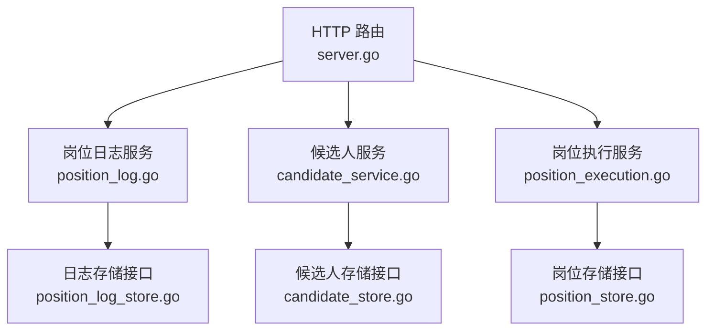
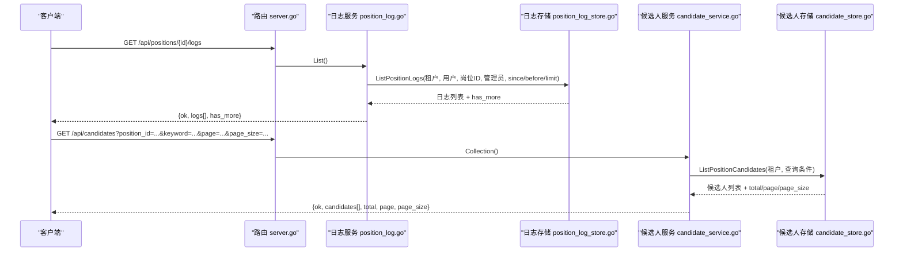
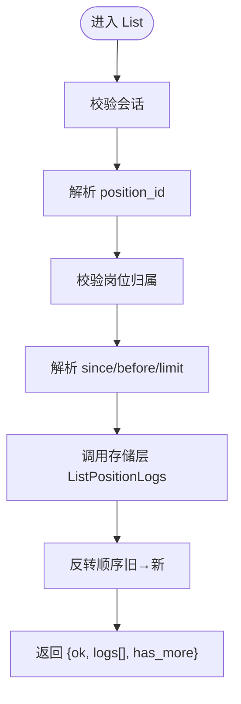
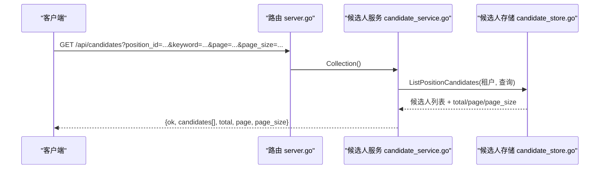
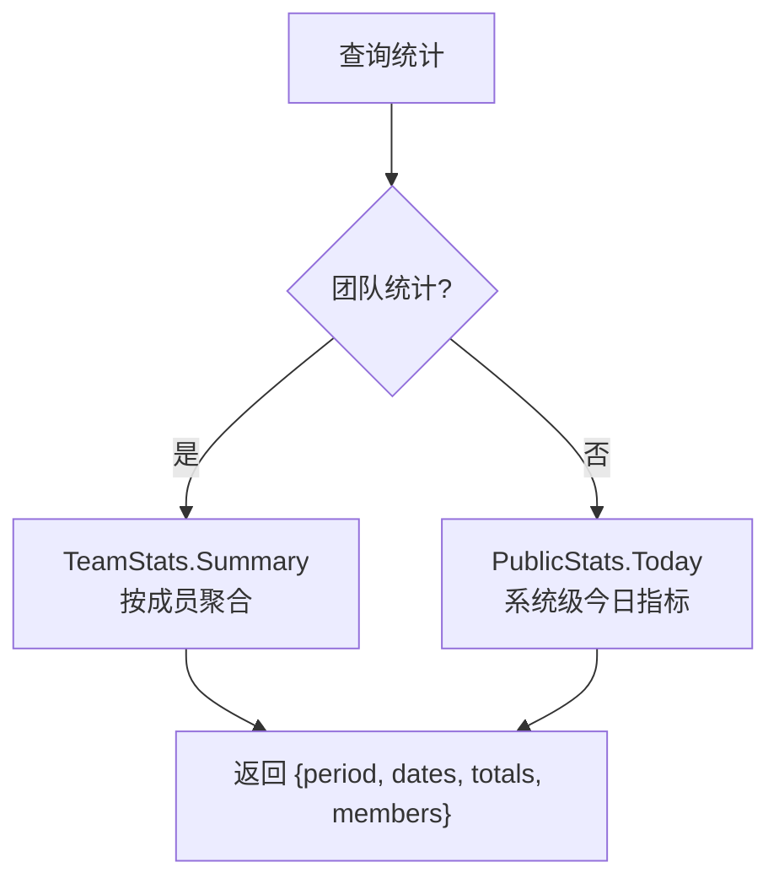
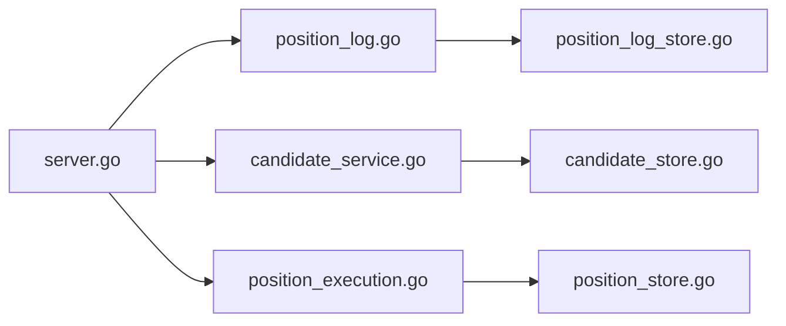

# 岗位监控查询接口

<cite>
**本文引用的文件**
- [server.go](file://goodhr5/cloud/backend/internal/httpapi/server.go)
- [position_log.go](file://goodhr5/cloud/backend/internal/httpapi/position_log.go)
- [position_log_store.go](file://goodhr5/cloud/backend/internal/httpapi/position_log_store.go)
- [candidate_service.go](file://goodhr5/cloud/backend/internal/httpapi/candidate_service.go)
- [candidate_store.go](file://goodhr5/cloud/backend/internal/httpapi/candidate_store.go)
- [position_execution.go](file://goodhr5/cloud/backend/internal/httpapi/position_execution.go)
- [public_stats.go](file://goodhr5/cloud/backend/internal/httpapi/public_stats.go)
- [team_stats.go](file://goodhr5/cloud/backend/internal/httpapi/team_stats.go)
</cite>

## 目录
1. [简介](#简介)
2. [项目结构](#项目结构)
3. [核心组件](#核心组件)
4. [架构总览](#架构总览)
5. [详细组件分析](#详细组件分析)
6. [依赖关系分析](#依赖关系分析)
7. [性能考虑](#性能考虑)
8. [故障排查指南](#故障排查指南)
9. [结论](#结论)
10. [附录](#附录)

## 简介
本文件面向“岗位监控查询”能力，围绕以下三个接口进行详细说明：
- GET /api/positions/{id}/logs：获取岗位运行日志（支持时间范围与分页）
- GET /api/positions/{id}/candidates：获取某岗位下的候选人列表（支持关键词筛选与分页）
- GET /api/positions/{id}/stats：获取岗位统计数据（基于日志与运行状态汇总）

文档重点说明：
- 日志查询的过滤条件与分页参数（since、before、limit）
- 候选人数据的筛选与导出相关字段（简历解析结果、匹配评分、沟通历史等）
- 统计数据的计算逻辑与展示格式（运行效率指标、质量评估数据）

## 项目结构
云端后端通过统一路由注册各业务模块。岗位监控相关的三条接口由以下路径分发：
- /api/positions/{id}/logs → PositionLogService.List
- /api/positions/{id}/candidates → PositionExecution.SaveLocalCandidate（用于本地程序同步候选人到云端；前端通常使用 /api/candidates?position_id=... 查看候选人）
- /api/positions/{id}/stats → 通过团队统计或公开统计聚合得到（见下文）

图表来源
- [server.go:124-245](file://goodhr5/cloud/backend/internal/httpapi/server.go#L124-L245)
- [position_log.go:57-164](file://goodhr5/cloud/backend/internal/httpapi/position_log.go#L57-L164)
- [candidate_service.go:29-76](file://goodhr5/cloud/backend/internal/httpapi/candidate_service.go#L29-L76)
- [position_execution.go:214-245](file://goodhr5/cloud/backend/internal/httpapi/position_execution.go#L214-L245)

章节来源
- [server.go:124-245](file://goodhr5/cloud/backend/internal/httpapi/server.go#L124-L245)

## 核心组件
- 岗位日志服务：负责写入、列出、清空岗位日志摘要，并支持按时间范围与分页查询。
- 候选人服务：提供候选人列表、详情、备注等能力，支持按岗位与关键词筛选及分页。
- 岗位执行服务：接收本地程序的状态同步、失败通知、候选人同步等。
- 统计服务：提供团队统计与公开统计，用于汇总运行效率和质量评估指标。

章节来源
- [position_log.go:13-164](file://goodhr5/cloud/backend/internal/httpapi/position_log.go#L13-L164)
- [candidate_service.go:12-76](file://goodhr5/cloud/backend/internal/httpapi/candidate_service.go#L12-L76)
- [position_execution.go:21-245](file://goodhr5/cloud/backend/internal/httpapi/position_execution.go#L21-L245)
- [public_stats.go:6-69](file://goodhr5/cloud/backend/internal/httpapi/public_stats.go#L6-L69)
- [team_stats.go:12-66](file://goodhr5/cloud/backend/internal/httpapi/team_stats.go#L12-L66)

## 架构总览
岗位监控查询的整体调用链如下：
- 客户端发起请求
- HTTP 路由根据路径分派到对应服务
- 服务层校验权限、解析参数、调用存储层
- 存储层返回数据后，服务层封装为统一的 JSON 响应

图表来源
- [server.go:124-245](file://goodhr5/cloud/backend/internal/httpapi/server.go#L124-L245)
- [position_log.go:124-164](file://goodhr5/cloud/backend/internal/httpapi/position_log.go#L124-L164)
- [position_log_store.go:88-115](file://goodhr5/cloud/backend/internal/httpapi/position_log_store.go#L88-L115)
- [candidate_service.go:29-76](file://goodhr5/cloud/backend/internal/httpapi/candidate_service.go#L29-L76)
- [candidate_store.go:327-356](file://goodhr5/cloud/backend/internal/httpapi/candidate_store.go#L327-L356)

## 详细组件分析

### 接口一：GET /api/positions/{id}/logs
- 功能：获取指定岗位的日志摘要列表，支持时间范围与分页。
- 认证：需要有效会话；仅允许访问自己岗位或团队管理员。
- 路径解析：从 /api/positions/{id}/logs 提取 position_id。
- 查询参数：
  - since：RFC3339Nano 时间戳，表示“不早于该时间”
  - before：RFC3339Nano 时间戳，表示“早于该时间”
  - limit：整数，限制返回条数；默认 100，最大 300
- 返回字段：
  - ok：布尔
  - logs[]：每条日志包含 id、position_id、level、message、created_at
  - has_more：是否还有更多数据
- 错误码：
  - 401：会话无效或过期
  - 404：岗位不存在
  - 400：参数非法（如 since/before 格式错误、limit 非整数）
  - 500：内部错误

图表来源
- [position_log.go:124-164](file://goodhr5/cloud/backend/internal/httpapi/position_log.go#L124-L164)
- [position_log_store.go:88-115](file://goodhr5/cloud/backend/internal/httpapi/position_log_store.go#L88-L115)

章节来源
- [position_log.go:57-164](file://goodhr5/cloud/backend/internal/httpapi/position_log.go#L57-L164)
- [position_log_store.go:30-115](file://goodhr5/cloud/backend/internal/httpapi/position_log_store.go#L30-L115)

### 接口二：GET /api/positions/{id}/candidates
- 实际实现说明：
  - 路径 /api/positions/{id}/candidates 在路由中用于“保存本地候选人”，供本地程序同步至云端。
  - 前端查看候选人应使用 /api/candidates?position_id=...&keyword=...&page=...&page_size=...
- 候选人列表查询（推荐）：
  - 认证：需要有效会话；非管理员仅能查看本人候选人
  - 查询参数：
    - position_id：限定岗位
    - keyword/q：关键词搜索（命中姓名、电话、邮箱、地区、年限、基本信息、教育、期望职位、个人描述、原始文本、过滤文本、简历文本）
    - page：页码，默认 1
    - page_size：每页条数，默认 20，最大 100
  - 返回字段：
    - ok：布尔
    - candidates[]：候选人对象数组（含基础信息、AI 评分与原因、沟通历史、备注等）
    - total：总数
    - page：当前页
    - page_size：每页大小
- 候选人详情：
  - GET /api/candidates/{id}
  - 可选 engagement_id：筛选特定触达上下文的事件流水
- 候选人备注：
  - GET /api/candidates/{id}/notes：获取备注列表
  - POST /api/candidates/{id}/notes：新增备注（内容长度限制）

图表来源
- [server.go:184-192](file://goodhr5/cloud/backend/internal/httpapi/server.go#L184-L192)
- [candidate_service.go:29-76](file://goodhr5/cloud/backend/internal/httpapi/candidate_service.go#L29-L76)
- [candidate_store.go:327-356](file://goodhr5/cloud/backend/internal/httpapi/candidate_store.go#L327-L356)

章节来源
- [server.go:184-192](file://goodhr5/cloud/backend/internal/httpapi/server.go#L184-L192)
- [candidate_service.go:29-146](file://goodhr5/cloud/backend/internal/httpapi/candidate_service.go#L29-L146)
- [candidate_store.go:12-61](file://goodhr5/cloud/backend/internal/httpapi/candidate_store.go#L12-L61)
- [candidate_store.go:146-173](file://goodhr5/cloud/backend/internal/httpapi/candidate_store.go#L146-L173)
- [candidate_store.go:327-356](file://goodhr5/cloud/backend/internal/httpapi/candidate_store.go#L327-L356)

### 接口三：GET /api/positions/{id}/stats
- 说明：仓库未直接暴露 /api/positions/{id}/stats 路由。岗位统计可通过以下方式获得：
  - 团队统计：GET /api/team/stats（管理员可用），支持 period、start_date、end_date
  - 公开统计：GET /api/public/stats/today（无需登录），返回系统级今日指标
- 团队统计字段（示例）：
  - period：today/week/month/last_month/custom
  - start_date/end_date：统计起止日期
  - totals：岗位数量、扫描数、跳过数、失败数、简历数、详情数、打招呼数
  - members：成员维度明细
- 公开统计字段（示例）：
  - processed_resume_count：已处理简历数
  - today_greeted_count：今日打招呼数
  - today_registered_count：今日注册用户数
  - agent_binding_count：设备绑定数

图表来源
- [team_stats.go:25-66](file://goodhr5/cloud/backend/internal/httpapi/team_stats.go#L25-L66)
- [public_stats.go:20-69](file://goodhr5/cloud/backend/internal/httpapi/public_stats.go#L20-L69)

章节来源
- [team_stats.go:25-66](file://goodhr5/cloud/backend/internal/httpapi/team_stats.go#L25-L66)
- [public_stats.go:20-69](file://goodhr5/cloud/backend/internal/httpapi/public_stats.go#L20-L69)

## 依赖关系分析
- 路由层：server.go 将 /api/positions/* 子资源分发到日志、状态、候选人与计数等处理函数。
- 日志层：position_log.go 依赖 position_log_store.go 提供的持久化能力。
- 候选人层：candidate_service.go 依赖 candidate_store.go 提供的持久化能力。
- 执行层：position_execution.go 负责本地程序与云端的运行状态同步、失败通知与候选人同步。

图表来源
- [server.go:124-245](file://goodhr5/cloud/backend/internal/httpapi/server.go#L124-L245)
- [position_log.go:13-164](file://goodhr5/cloud/backend/internal/httpapi/position_log.go#L13-L164)
- [candidate_service.go:12-76](file://goodhr5/cloud/backend/internal/httpapi/candidate_service.go#L12-L76)
- [position_execution.go:21-245](file://goodhr5/cloud/backend/internal/httpapi/position_execution.go#L21-L245)

章节来源
- [server.go:124-245](file://goodhr5/cloud/backend/internal/httpapi/server.go#L124-L245)

## 性能考虑
- 日志分页：limit 默认 100，上限 300，避免一次性拉取过多数据。
- 候选人分页：page_size 默认 20，上限 100，减少单次响应体积。
- 关键词搜索：内存实现会拼接多字段进行包含匹配，建议在大数据量时结合 position_id 缩小范围。
- 团队统计：数据库查询带超时保护（5秒），避免长时间阻塞。

[本节为通用指导，不直接分析具体文件]

## 故障排查指南
- 401 未授权：检查会话是否有效；确保请求携带正确的 Authorization。
- 404 岗位不存在：确认 position_id 正确且属于当前用户或团队。
- 400 参数错误：
  - since/before 必须为 RFC3339Nano 时间格式
  - limit 必须为整数
  - keyword/q 为空不影响查询，但会影响筛选结果
- 500 内部错误：重试或查看服务端日志定位存储层问题。

章节来源
- [position_log.go:242-255](file://goodhr5/cloud/backend/internal/httpapi/position_log.go#L242-L255)
- [candidate_service.go:218-230](file://goodhr5/cloud/backend/internal/httpapi/candidate_service.go#L218-L230)

## 结论
- 日志查询接口支持精确的时间范围与分页，适合构建实时或近实时的岗位运行监控面板。
- 候选人查询接口提供灵活的关键词筛选与分页，便于快速定位目标候选人。
- 统计能力通过团队统计与公开统计组合覆盖岗位运行效率与质量评估需求。
- 建议在前端对日志与候选人列表实施分页加载，并结合关键词缩小查询范围以提升性能。

[本节为总结性内容，不直接分析具体文件]

## 附录

### API 定义速查表
- GET /api/positions/{id}/logs
  - 查询参数：since、before、limit
  - 返回：ok、logs[]、has_more
- GET /api/candidates
  - 查询参数：position_id、keyword/q、page、page_size
  - 返回：ok、candidates[]、total、page、page_size
- GET /api/team/stats
  - 查询参数：period、start_date、end_date
  - 返回：ok、period、start_date、end_date、totals、members
- GET /api/public/stats/today
  - 返回：ok、processed_resume_count、today_greeted_count、today_registered_count、agent_binding_count

章节来源
- [position_log.go:124-164](file://goodhr5/cloud/backend/internal/httpapi/position_log.go#L124-L164)
- [candidate_service.go:29-76](file://goodhr5/cloud/backend/internal/httpapi/candidate_service.go#L29-L76)
- [team_stats.go:25-66](file://goodhr5/cloud/backend/internal/httpapi/team_stats.go#L25-L66)
- [public_stats.go:20-69](file://goodhr5/cloud/backend/internal/httpapi/public_stats.go#L20-L69)