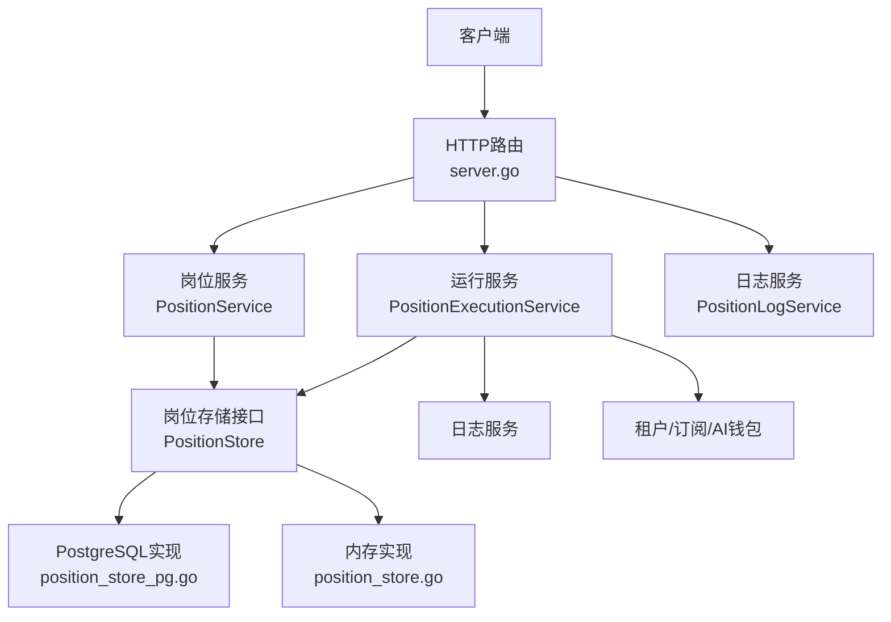
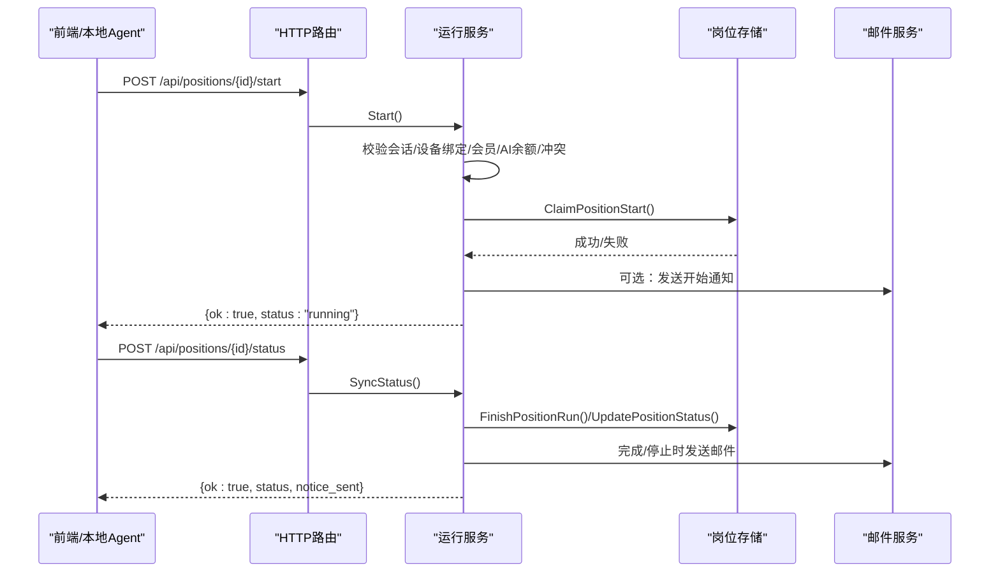
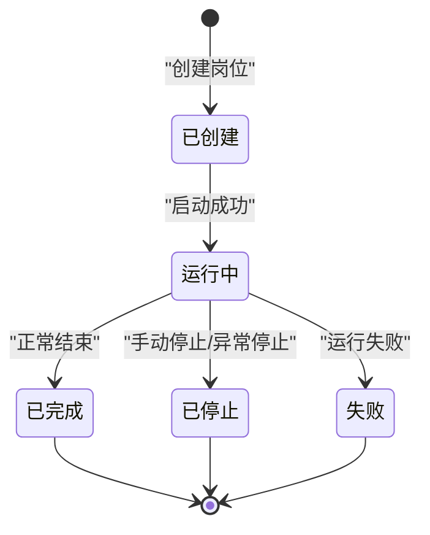
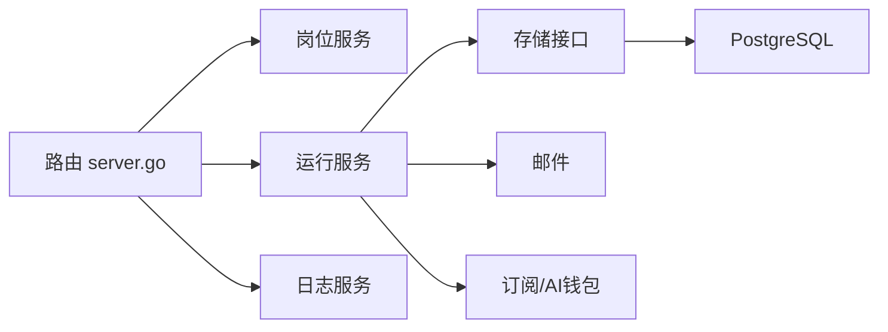

# 岗位管理API

<cite>
**本文引用的文件**
- [server.go](file://goodhr5/cloud/backend/internal/httpapi/server.go)
- [position_store.go](file://goodhr5/cloud/backend/internal/httpapi/position_store.go)
- [position_store_pg.go](file://goodhr5/cloud/backend/internal/httpapi/position_store_pg.go)
- [position_execution.go](file://goodhr5/cloud/backend/internal/httpapi/position_execution.go)
- [position_log.go](file://goodhr5/cloud/backend/internal/httpapi/position_log.go)
- [position_test.go](file://goodhr5/cloud/backend/internal/httpapi/position_test.go)
</cite>

## 目录
1. [简介](#简介)
2. [项目结构](#项目结构)
3. [核心组件](#核心组件)
4. [架构总览](#架构总览)
5. [详细接口规范](#详细接口规范)
6. [依赖关系分析](#依赖关系分析)
7. [性能与一致性](#性能与一致性)
8. [故障排查指南](#故障排查指南)
9. [结论](#结论)

## 简介
本文件为“岗位管理API”的完整接口文档，覆盖岗位配置CRUD、运行控制（启动/停止）、状态同步机制、日志查询、候选人收集等能力。重点说明以下路由：
- /api/positions：岗位列表与创建
- /api/positions/{id}：岗位详情与删除
- /api/positions/{id}/start：启动运行
- /api/positions/{id}/stop：停止运行
- /api/positions/{id}/status：状态同步
- /api/positions/{id}/candidates：候选人收集
- /api/positions/{id}/processed-resumes：已处理简历上报
- /api/positions/{id}/counts：统计计数同步
- /api/positions/{id}/logs：日志查询与管理

同时涵盖岗位搜索条件配置、AI提示词设置、运行策略定义，以及岗位执行状态机、错误码与状态码说明。

## 项目结构
后端HTTP服务通过统一路由注册岗位相关接口，并由PositionService、PositionExecutionService、PositionLogService分别负责岗位配置、运行控制与日志。存储层提供内存实现与PostgreSQL实现，保证开发与生产一致的数据模型。

**图示来源**
- [server.go:124-245](file://goodhr5/cloud/backend/internal/httpapi/server.go#L124-L245)
- [position_store.go:14-62](file://goodhr5/cloud/backend/internal/httpapi/position_store.go#L14-L62)
- [position_store_pg.go:13-21](file://goodhr5/cloud/backend/internal/httpapi/position_store_pg.go#L13-L21)

**章节来源**
- [server.go:124-245](file://goodhr5/cloud/backend/internal/httpapi/server.go#L124-L245)

## 核心组件
- 岗位数据模型与存储接口：定义岗位字段、统计字段、状态与时间戳；提供列表、保存、按ID读取、删除、启动抢占、状态更新、结束收尾、计数同步、用户流程进度等能力。
- 运行控制服务：校验登录设备绑定、会员权限、AI余额与冲突，原子抢占运行位，记录用户流程事件，发送状态通知邮件。
- 日志服务：写入、分页查询、清空岗位日志摘要，支持since/before/limit过滤。
- 路由分发：将/api/positions/*路径根据后缀分发到详情、日志、启动、停止、状态同步、候选人收集等处理器。

**章节来源**
- [position_store.go:14-62](file://goodhr5/cloud/backend/internal/httpapi/position_store.go#L14-L62)
- [position_execution.go:21-47](file://goodhr5/cloud/backend/internal/httpapi/position_execution.go#L21-L47)
- [position_log.go:13-34](file://goodhr5/cloud/backend/internal/httpapi/position_log.go#L13-L34)
- [server.go:179-245](file://goodhr5/cloud/backend/internal/httpapi/server.go#L179-L245)

## 架构总览
岗位生命周期由前端或本地Agent触发，经HTTP路由进入对应服务，服务进行鉴权、权限校验、并发控制与业务规则检查后，调用存储层持久化并返回结果。运行过程中，本地Agent持续上报状态、候选人与统计，云端完成状态收敛与通知。

**图示来源**
- [server.go:214-245](file://goodhr5/cloud/backend/internal/httpapi/server.go#L214-L245)
- [position_execution.go:49-91](file://goodhr5/cloud/backend/internal/httpapi/position_execution.go#L49-L91)
- [position_execution.go:125-213](file://goodhr5/cloud/backend/internal/httpapi/position_execution.go#L125-L213)
- [position_store_pg.go:338-380](file://goodhr5/cloud/backend/internal/httpapi/position_store_pg.go#L338-L380)

## 详细接口规范

### 通用约定
- 认证：除明确标注外，所有接口需携带有效会话（Authorization: Bearer <token>）。
- 响应格式：
  - 成功：{ ok: true, ... }
  - 失败：{ ok: false, error: "消息" } 或启动类错误 { ok: false, error: { code: "...", message: "..." } }
- 状态码：使用标准HTTP状态码表示错误类型（如401未授权、403禁止、404不存在、409冲突、422参数错误、500内部错误等）。

### GET /api/positions
- 功能：列出当前用户（或管理员）的岗位列表。
- 请求头：Authorization: Bearer <token>
- 响应体：
  - positions: 岗位数组
- 示例响应：
  - { "ok": true, "positions": [ { "id": "pos_1", "name": "带货主播", "status": "created" } ] }

**章节来源**
- [position_test.go:47-65](file://goodhr5/cloud/backend/internal/httpapi/position_test.go#L47-L65)
- [position_store_pg.go:23-109](file://goodhr5/cloud/backend/internal/httpapi/position_store_pg.go#L23-L109)

### POST /api/positions
- 功能：创建岗位配置。
- 必填字段：name
- 可选字段：platform_id、keywords、exclude_keywords、description、greet_message、is_and_mode、common_config、ai_config、keyword_config、match_limit、enable_sound、enable_thinking
- common_config关键字段：
  - mode_default：筛选模式（如 keyword、ai、dom、ocr），受平台规则约束
  - detail_mode：详情页识别模式（受平台限制）
- AI提示词：ai_config中可包含提示词模板与评分模式等
- 权限校验：若使用AI或自动回复，需满足会员与AI余额要求
- 示例请求体：
  - { "name": "带货主播", "keywords": ["直播","带货"], "exclude_keywords": ["销售"], "description": "成都岗位", "greet_message": "你好", "is_and_mode": true, "common_config": {"mode_default":"keyword","detail_mode":"dom"}, "ai_config": {} }
- 示例响应：
  - { "ok": true, "position": { "id": "pos_1", "name": "带货主播", "status": "created", ... } }

**章节来源**
- [position_test.go:19-45](file://goodhr5/cloud/backend/internal/httpapi/position_test.go#L19-L45)
- [position_store_pg.go:111-267](file://goodhr5/cloud/backend/internal/httpapi/position_store_pg.go#L111-L267)
- [position_execution.go:234-282](file://goodhr5/cloud/backend/internal/httpapi/position_execution.go#L234-L282)

### DELETE /api/positions/{id}
- 功能：删除指定岗位。
- 权限：仅岗位所属用户或管理员可操作。
- 示例响应：
  - { "ok": true }

**章节来源**
- [position_test.go:67-74](file://goodhr5/cloud/backend/internal/httpapi/position_test.go#L67-L74)
- [position_store_pg.go:487-515](file://goodhr5/cloud/backend/internal/httpapi/position_store_pg.go#L487-L515)

### GET /api/positions/{id}
- 功能：获取岗位详情。
- 权限：仅岗位所属用户或管理员可操作。
- 示例响应：
  - { "ok": true, "position": { "id": "pos_1", "name": "带货主播", "status": "created", "keywords": [...], "common_config": {...}, "ai_config": {...}, ... } }

**章节来源**
- [position_store_pg.go:269-311](file://goodhr5/cloud/backend/internal/httpapi/position_store_pg.go#L269-L311)
- [server.go:214-245](file://goodhr5/cloud/backend/internal/httpapi/server.go#L214-L245)

### POST /api/positions/{id}/start
- 功能：启动岗位运行。
- 请求体：
  - task_type：任务类型（如 auto_reply）
  - machine_id：本地设备标识
- 前置校验：
  - 会话有效
  - 设备绑定校验
  - 会员权限与AI余额校验（若使用AI或自动回复）
  - 账号级运行冲突检查（同一账号仅允许一个running岗位）
- 示例请求体：
  - { "task_type": "auto_reply", "machine_id": "device_abc" }
- 示例响应：
  - { "ok": true, "status": "running" }
- 常见错误：
  - 401 会话失效
  - 403 设备未绑定或无权限
  - 409 已有岗位在运行
  - 422 参数无效
  - 503 会员/AI余额不可用

**章节来源**
- [position_execution.go:49-91](file://goodhr5/cloud/backend/internal/httpapi/position_execution.go#L49-L91)
- [position_execution.go:215-275](file://goodhr5/cloud/backend/internal/httpapi/position_execution.go#L215-L275)
- [position_store_pg.go:338-380](file://goodhr5/cloud/backend/internal/httpapi/position_store_pg.go#L338-L380)

### POST /api/positions/{id}/stop
- 功能：停止岗位运行。
- 行为：若岗位非stopped则更新为stopped，写日志并发送邮件通知。
- 示例响应：
  - { "ok": true, "status": "stopped" }

**章节来源**
- [position_execution.go:93-123](file://goodhr5/cloud/backend/internal/httpapi/position_execution.go#L93-L123)

### POST /api/positions/{id}/status
- 功能：本地程序同步岗位运行状态。
- 请求体：
  - status：completed | stopped | running
  - task_type：任务类型
  - run_greeted_count：本次打招呼数量
  - run_skipped_count：本次跳过数量
  - machine_id：设备标识
- 行为：
  - running：重新校验设备与冲突，确保处于运行态
  - completed/stopped：更新结束状态，必要时发送邮件通知，累计今日打招呼数
- 示例请求体：
  - { "status": "completed", "run_greeted_count": 5, "run_skipped_count": 2, "machine_id": "device_abc" }
- 示例响应：
  - { "ok": true, "status": "completed", "notice_sent": true }

**章节来源**
- [position_execution.go:125-213](file://goodhr5/cloud/backend/internal/httpapi/position_execution.go#L125-L213)

### POST /api/positions/{id}/candidates
- 功能：本地程序提交候选人信息。
- 权限：需要会话校验（具体以服务端实现为准）。
- 示例请求体：
  - { "candidate": { "name": "张三", "phone": "13800000000", "resume_url": "https://...", "source": "boss" } }
- 示例响应：
  - { "ok": true }

**章节来源**
- [server.go:214-245](file://goodhr5/cloud/backend/internal/httpapi/server.go#L214-L245)

### POST /api/positions/{id}/processed-resumes
- 功能：上报已处理的简历集合。
- 示例请求体：
  - { "resume_ids": ["r1","r2"] }
- 示例响应：
  - { "ok": true }

**章节来源**
- [server.go:214-245](file://goodhr5/cloud/backend/internal/httpapi/server.go#L214-L245)

### POST /api/positions/{id}/counts
- 功能：同步岗位统计计数（扫描、跳过、失败）。
- 示例请求体：
  - { "scanned": 10, "skipped": 3, "failed": 1 }
- 示例响应：
  - { "ok": true }

**章节来源**
- [position_store_pg.go:411-457](file://goodhr5/cloud/backend/internal/httpapi/position_store_pg.go#L411-L457)
- [server.go:214-245](file://goodhr5/cloud/backend/internal/httpapi/server.go#L214-L245)

### /api/positions/{id}/logs
- GET：分页查询岗位日志摘要
  - 查询参数：
    - since：RFC3339时间，起始时间
    - before：RFC3339时间，截止时间
    - limit：整数，默认100，最大300
  - 示例响应：
    - { "ok": true, "logs": [{ "id":"log_1","level":"info","message":"...","created_at":"..."}], "has_more": false }
- POST：写入一条日志摘要
  - 请求体：{ "level": "info", "message": "岗位启动检查通过" }
  - 示例响应：{ "ok": true, "log": { "id":"log_1","level":"info","message":"...","created_at":"..." } }
- DELETE：清空该岗位日志摘要
  - 示例响应：{ "ok": true }

**章节来源**
- [position_log.go:56-203](file://goodhr5/cloud/backend/internal/httpapi/position_log.go#L56-L203)
- [position_log.go:205-240](file://goodhr5/cloud/backend/internal/httpapi/position_log.go#L205-L240)

### 岗位搜索条件配置与AI提示词
- 搜索条件：
  - keywords：关键词数组
  - exclude_keywords：排除关键词数组
  - is_and_mode：是否AND匹配
  - match_limit：匹配上限
- 运行策略：
  - common_config.mode_default：筛选模式（keyword/ai/dom/ocr）
  - common_config.detail_mode：详情页识别模式（受平台限制）
  - enable_sound：启用声音提醒
  - enable_thinking：启用思考模式
- AI提示词：
  - ai_config：可包含提示词模板、评分模式等（由系统迁移与默认提示词管理）

**章节来源**
- [position_store.go:14-41](file://goodhr5/cloud/backend/internal/httpapi/position_store.go#L14-L41)
- [position_store_pg.go:111-267](file://goodhr5/cloud/backend/internal/httpapi/position_store_pg.go#L111-L267)
- [position_test.go:98-125](file://goodhr5/cloud/backend/internal/httpapi/position_test.go#L98-L125)

### 岗位执行状态机

**图示来源**
- [position_store_pg.go:313-336](file://goodhr5/cloud/backend/internal/httpapi/position_store_pg.go#L313-L336)
- [position_store_pg.go:382-409](file://goodhr5/cloud/backend/internal/httpapi/position_store_pg.go#L382-L409)

## 依赖关系分析
- 路由层：统一注册岗位相关接口，并根据路径后缀分发到不同处理器。
- 服务层：
  - PositionService：岗位配置CRUD与优化需求
  - PositionExecutionService：启动/停止/状态同步/失败通知/候选人收集/统计同步
  - PositionLogService：日志写入、查询、清空
- 存储层：
  - MemoryPositionStore：开发期内存实现
  - PostgresPositionStore：生产期PostgreSQL实现，提供事务与锁保障
- 外部依赖：
  - 认证与会话
  - 租户与订阅
  - AI钱包余额
  - 邮件服务

**图示来源**
- [server.go:124-245](file://goodhr5/cloud/backend/internal/httpapi/server.go#L124-L245)
- [position_execution.go:21-47](file://goodhr5/cloud/backend/internal/httpapi/position_execution.go#L21-L47)
- [position_store_pg.go:13-21](file://goodhr5/cloud/backend/internal/httpapi/position_store_pg.go#L13-L21)

**章节来源**
- [server.go:124-245](file://goodhr5/cloud/backend/internal/httpapi/server.go#L124-L245)
- [position_execution.go:21-47](file://goodhr5/cloud/backend/internal/httpapi/position_execution.go#L21-L47)
- [position_store_pg.go:13-21](file://goodhr5/cloud/backend/internal/httpapi/position_store_pg.go#L13-L21)

## 性能与一致性
- 并发安全：
  - PostgreSQL实现使用事务与 advisory lock 保证账号级运行冲突检测与启动抢占的原子性。
  - 内存实现使用互斥锁保护并发访问。
- 幂等性：
  - 结束状态写入对重复同步幂等，避免重复累加今日打招呼数。
- 限流与分页：
  - 日志查询支持since/before/limit，默认100条，最大300条，防止大响应。
- 超时控制：
  - 数据库操作设置3秒超时，避免长尾阻塞。

**章节来源**
- [position_store_pg.go:23-51](file://goodhr5/cloud/backend/internal/httpapi/position_store_pg.go#L23-L51)
- [position_store_pg.go:338-380](file://goodhr5/cloud/backend/internal/httpapi/position_store_pg.go#L338-L380)
- [position_store_pg.go:382-409](file://goodhr5/cloud/backend/internal/httpapi/position_store_pg.go#L382-L409)
- [position_log.go:205-240](file://goodhr5/cloud/backend/internal/httpapi/position_log.go#L205-L240)

## 故障排查指南
- 启动失败：
  - 401：会话失效，请重新登录
  - 403：设备未绑定或无权限，请刷新后台并等待本地程序重新连接
  - 409：账号已有岗位在运行，请先停止当前任务
  - 422：参数无效，检查task_type与machine_id
  - 503：会员/AI余额不可用，稍后再试
- 状态同步失败：
  - 404：岗位不存在
  - 500：更新状态失败，重试或检查数据库
- 日志问题：
  - 400：since/before格式错误或limit非法
  - 500：写入/查询失败，检查存储层

**章节来源**
- [position_execution.go:49-91](file://goodhr5/cloud/backend/internal/httpapi/position_execution.go#L49-L91)
- [position_execution.go:125-213](file://goodhr5/cloud/backend/internal/httpapi/position_execution.go#L125-L213)
- [position_log.go:70-121](file://goodhr5/cloud/backend/internal/httpapi/position_log.go#L70-L121)
- [position_log.go:123-164](file://goodhr5/cloud/backend/internal/httpapi/position_log.go#L123-L164)

## 结论
本API围绕岗位配置与运行控制构建了清晰的职责分层：路由分发、服务编排、存储持久化与外部协作（订阅、AI钱包、邮件）。通过严格的权限校验、并发控制与幂等设计，保障了多端协同下的稳定性与一致性。建议在生产环境优先采用PostgreSQL存储实现，并结合日志分页与状态同步机制进行监控与排障。