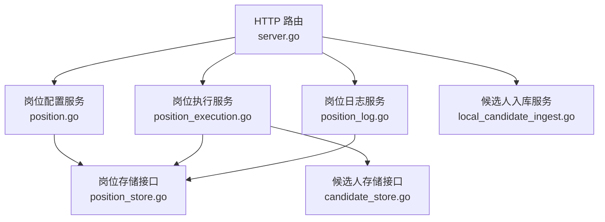
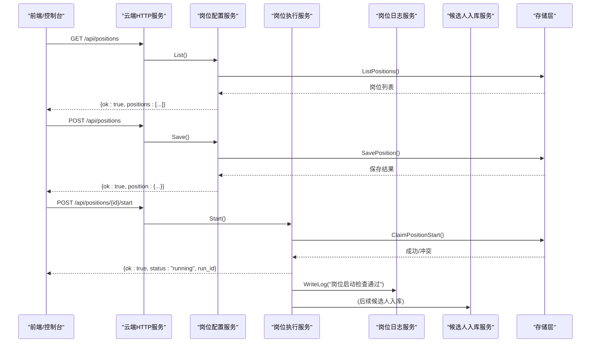
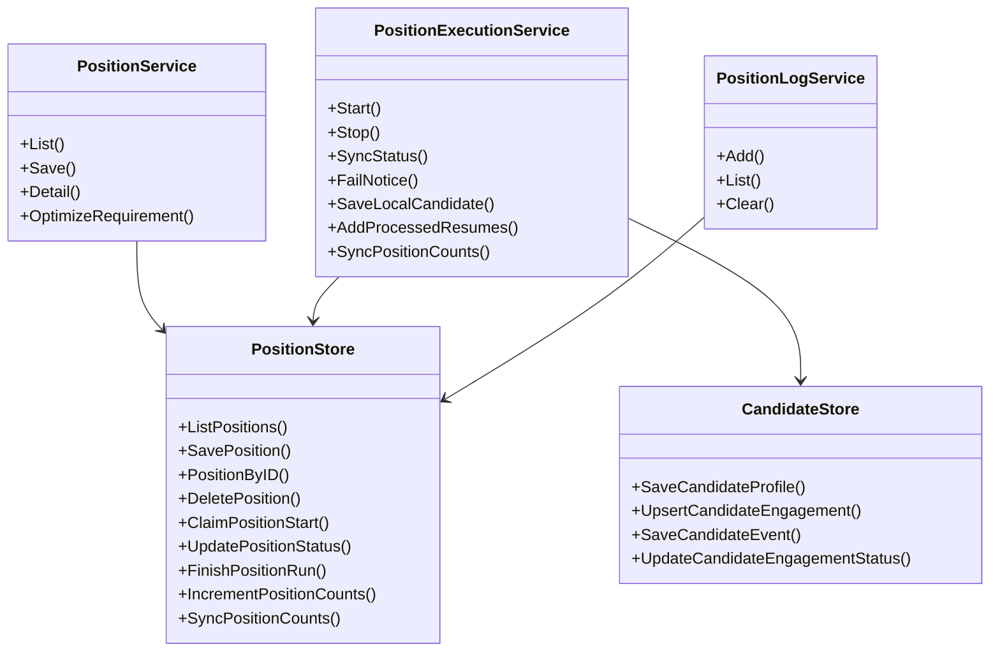
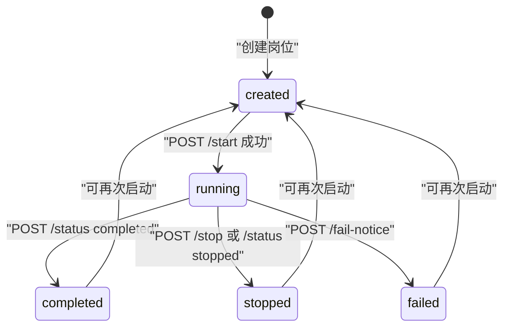

# 岗位管理API

<cite>
**本文引用的文件**
- [server.go](file://goodhr5/cloud/backend/internal/httpapi/server.go)
- [position.go](file://goodhr5/cloud/backend/internal/httpapi/position.go)
- [position_execution.go](file://goodhr5/cloud/backend/internal/httpapi/position_execution.go)
- [position_log.go](file://goodhr5/cloud/backend/internal/httpapi/position_log.go)
- [local_candidate_ingest.go](file://goodhr5/cloud/backend/internal/httpapi/local_candidate_ingest.go)
- [position_store.go](file://goodhr5/cloud/backend/internal/httpapi/position_store.go)
- [candidate_store.go](file://goodhr5/cloud/backend/internal/httpapi/candidate_store.go)
</cite>

## 目录
1. [简介](#简介)
2. [项目结构](#项目结构)
3. [核心组件](#核心组件)
4. [架构总览](#架构总览)
5. [详细接口规范](#详细接口规范)
6. [依赖关系分析](#依赖关系分析)
7. [性能与一致性](#性能与一致性)
8. [故障排查指南](#故障排查指南)
9. [结论](#结论)
10. [附录：状态机、错误码与示例](#附录：状态机错误码与示例)

## 简介
本文件为 HRPlus 云端后端的“岗位管理”相关 API 的完整接口文档，覆盖岗位配置 CRUD、运行控制（启动/停止）、状态同步、日志查询、候选人收集与统计等能力。重点说明以下路径：
- /api/positions：岗位列表与创建/更新
- /api/positions/{id}：岗位详情、更新、删除
- /api/positions/{id}/start：启动运行（本地 Agent 调用）
- /api/positions/{id}/stop：停止运行（本地 Agent 调用）
- /api/positions/{id}/status：运行状态同步（本地 Agent 调用）
- /api/positions/{id}/logs：岗位日志摘要
- /api/positions/{id}/candidates：候选人入库
- /api/positions/{id}/counts：累计统计同步
- /api/positions/{id}/processed-resumes：已处理简历数量上报

所有接口均通过统一 JSON 响应格式返回，错误使用统一的 { ok: false, error: ... } 或带稳定错误码的结构。

## 项目结构
后端 HTTP 路由集中在服务装配文件中，岗位相关路由由位置分发器统一转发到具体服务方法；业务逻辑分布在岗位配置、执行、日志、候选人入库等模块中；数据模型与存储接口定义在 store 文件中。

图表来源
- [server.go:133-228](file://goodhr5/cloud/backend/internal/httpapi/server.go#L133-L228)
- [position.go:74-298](file://goodhr5/cloud/backend/internal/httpapi/position.go#L74-L298)
- [position_execution.go:53-276](file://goodhr5/cloud/backend/internal/httpapi/position_execution.go#L53-L276)
- [position_log.go:56-164](file://goodhr5/cloud/backend/internal/httpapi/position_log.go#L56-L164)
- [local_candidate_ingest.go:23-232](file://goodhr5/cloud/backend/internal/httpapi/local_candidate_ingest.go#L23-L232)

章节来源
- [server.go:133-228](file://goodhr5/cloud/backend/internal/httpapi/server.go#L133-L228)

## 核心组件
- 岗位配置服务：提供岗位列表、创建/更新、删除、AI 优化岗位要求等能力。
- 岗位执行服务：负责启动校验、运行状态同步、停止、失败通知、候选人入库、统计同步。
- 岗位日志服务：提供日志写入、分页查询、清空等能力。
- 候选人入库服务：接收本地程序回传的候选人 JSON，持久化到云端简历库并记录事件。
- 存储层：岗位与候选人的内存/数据库抽象，保证并发安全与一致性。

章节来源
- [position.go:28-72](file://goodhr5/cloud/backend/internal/httpapi/position.go#L28-L72)
- [position_execution.go:21-51](file://goodhr5/cloud/backend/internal/httpapi/position_execution.go#L21-L51)
- [position_log.go:13-34](file://goodhr5/cloud/backend/internal/httpapi/position_log.go#L13-L34)
- [local_candidate_ingest.go:23-127](file://goodhr5/cloud/backend/internal/httpapi/local_candidate_ingest.go#L23-L127)
- [position_store.go:14-63](file://goodhr5/cloud/backend/internal/httpapi/position_store.go#L14-L63)
- [candidate_store.go:12-167](file://goodhr5/cloud/backend/internal/httpapi/candidate_store.go#L12-L167)

## 架构总览
岗位生命周期由本地 Agent 驱动，云端负责权限校验、资源占用、状态落盘、邮件通知与数据汇总。

图表来源
- [server.go:193-280](file://goodhr5/cloud/backend/internal/httpapi/server.go#L193-L280)
- [position.go:74-206](file://goodhr5/cloud/backend/internal/httpapi/position.go#L74-L206)
- [position_execution.go:53-96](file://goodhr5/cloud/backend/internal/httpapi/position_execution.go#L53-L96)
- [position_store.go:130-151](file://goodhr5/cloud/backend/internal/httpapi/position_store.go#L130-L151)

## 详细接口规范

### 通用约定
- 认证：除特别说明外，需携带有效会话（Authorization）。
- 响应格式：
  - 成功：{ ok: true, ... }
  - 失败：{ ok: false, error: "..." } 或启动类接口返回 { ok: false, error: { code: "...", message: "..." } }
- 内容类型：application/json
- 跨域：服务端已启用 CORS

章节来源
- [server.go:297-313](file://goodhr5/cloud/backend/internal/httpapi/server.go#L297-L313)
- [server.go:613-624](file://goodhr5/cloud/backend/internal/httpapi/server.go#L613-L624)

### 岗位配置 CRUD

#### GET /api/positions
- 功能：获取当前用户可访问的岗位列表（团队内岗位，标记是否当前用户创建）。
- 请求参数：无
- 响应字段：
  - ok: boolean
  - positions: array of 岗位对象
    - id, creator_email, platform_id, name, label, keywords, exclude_keywords, description, greet_message, is_and_mode, common_config, ai_config, keyword_config, match_limit, enable_sound, enable_thinking, status, scanned_count, daily_greeted_count, daily_greeted_date, today_greeted_count, skipped_count, failed_count, started_at, finished_at, created_at, updated_at, is_current_user
- 错误：
  - 401 会话无效
  - 500 读取失败

章节来源
- [position.go:86-112](file://goodhr5/cloud/backend/internal/httpapi/position.go#L86-L112)
- [position.go:476-507](file://goodhr5/cloud/backend/internal/httpapi/position.go#L476-L507)

#### POST /api/positions
- 功能：创建或更新岗位配置。
- 请求体关键字段：
  - id: string（可选，用于更新）
  - platform_id: string（默认 boss）
  - name: string（必填）
  - label: string（选填，最多20字）
  - keywords: string[]
  - exclude_keywords: string[]
  - description: string
  - greet_message: string
  - is_and_mode: boolean
  - common_config: object（包含 detail_mode、mode_default、output_structured_resume 等）
  - ai_config: object
  - keyword_config: object
  - match_limit: number（默认 50）
  - enable_sound: boolean
  - enable_thinking: boolean
- 响应：
  - ok: boolean
  - position: 岗位对象（同列表项）
- 错误：
  - 400 参数非法（如 name 为空、label 超长）
  - 403 AI 功能需要会员
  - 500 保存失败

章节来源
- [position.go:168-206](file://goodhr5/cloud/backend/internal/httpapi/position.go#L168-L206)
- [position.go:379-445](file://goodhr5/cloud/backend/internal/httpapi/position.go#L379-L445)

#### PUT /api/positions/{id}
- 功能：更新指定岗位配置（复用 POST 保存逻辑）。
- 请求体：同 POST
- 响应：同 POST
- 错误：同 POST

章节来源
- [position.go:265-298](file://goodhr5/cloud/backend/internal/httpapi/position.go#L265-L298)

#### DELETE /api/positions/{id}
- 功能：删除岗位配置。
- 响应：{ ok: true }
- 错误：
  - 404 岗位不存在
  - 500 删除失败

章节来源
- [position.go:231-263](file://goodhr5/cloud/backend/internal/httpapi/position.go#L231-L263)

#### POST /api/positions/optimize-requirement
- 功能：基于当前用户的 AI 配置，将原始岗位要求优化为结构化筛选规则。
- 请求体：{ text: string }
- 响应：{ ok: true, optimized: string }
- 错误：
  - 400 文本为空或JSON非法
  - 409 未启用或未配置个人 AI
  - 502 AI 调用失败

章节来源
- [position.go:114-166](file://goodhr5/cloud/backend/internal/httpapi/position.go#L114-L166)
- [position.go:300-362](file://goodhr5/cloud/backend/internal/httpapi/position.go#L300-L362)

### 运行控制与状态同步

#### POST /api/positions/{id}/start
- 功能：本地 Agent 申请启动岗位运行。云端进行会话校验、设备绑定校验、会员与 AI 余额校验、并发占用校验，通过后写入 running 并记录执行任务。
- 请求体：
  - task_type: string（greeting 或 auto_reply）
  - machine_id: string（必须为已绑定的稳定设备）
- 响应：
  - ok: true
  - status: "running"
  - run_id: string（本次执行任务ID）
- 错误：
  - 401 会话失效
  - 400 参数非法
  - 403 设备未绑定
  - 409 账号已有岗位运行中
  - 402 AI 余额不足
  - 404 岗位不存在
  - 500 内部错误

章节来源
- [position_execution.go:53-96](file://goodhr5/cloud/backend/internal/httpapi/position_execution.go#L53-L96)
- [position_execution.go:278-338](file://goodhr5/cloud/backend/internal/httpapi/position_execution.go#L278-L338)

#### POST /api/positions/{id}/stop
- 功能：本地 Agent 主动停止岗位运行。
- 请求体：{}
- 响应：{ ok: true, status: "stopped" }
- 行为：若岗位非 stopped，则更新状态、写日志、收尾执行任务、发送停止通知邮件。
- 错误：
  - 404 岗位不存在
  - 500 内部错误

章节来源
- [position_execution.go:136-167](file://goodhr5/cloud/backend/internal/httpapi/position_execution.go#L136-L167)

#### POST /api/positions/{id}/status
- 功能：本地 Agent 同步运行状态（running/completed/stopped），并回传计数与执行任务 ID。
- 请求体：
  - status: "running" | "completed" | "stopped"
  - task_type: string
  - run_id: string（可选）
  - run_greeted_count: number
  - run_skipped_count: number
  - machine_id: string
- 响应：
  - ok: true
  - status: 传入的状态
  - notice_sent: boolean（是否已发送邮件通知）
  - run_id: string（本次执行任务ID）
- 行为：
  - running：校验设备与会员/AI余额，必要时补建执行任务记录。
  - completed/stopped：更新岗位结束状态、写日志、收尾执行任务、发送邮件通知（完成时必发，停止时按需）。
- 错误：
  - 400 不支持的状态或参数非法
  - 404 岗位不存在
  - 500 内部错误

章节来源
- [position_execution.go:169-276](file://goodhr5/cloud/backend/internal/httpapi/position_execution.go#L169-L276)

#### POST /api/fail-notice
- 功能：本地 Agent 上报运行失败，云端更新状态、记录流程、发送邮件。
- 请求体：
  - position_id: string
  - error_message: string
  - run_greeted_count: number
  - run_skipped_count: number
- 响应：{ ok: true, status: "notified" }
- 行为：根据错误信息判断最终状态为 failed 或 stopped，并发送通知。

章节来源
- [position_execution.go:374-435](file://goodhr5/cloud/backend/internal/httpapi/position_execution.go#L374-L435)

### 日志查询

#### GET /api/positions/{id}/logs
- 功能：分页查询岗位日志摘要（从旧到新排序）。
- 查询参数：
  - since: RFC3339 时间（可选）
  - before: RFC3339 时间（可选）
  - limit: integer（默认100，最大300）
- 响应：
  - ok: true
  - logs: array of { id, position_id, level, message, created_at }
  - has_more: boolean
- 错误：
  - 400 参数非法
  - 404 岗位不存在
  - 500 读取失败

章节来源
- [position_log.go:123-164](file://goodhr5/cloud/backend/internal/httpapi/position_log.go#L123-L164)
- [position_log.go:205-240](file://goodhr5/cloud/backend/internal/httpapi/position_log.go#L205-L240)

#### POST /api/positions/{id}/logs
- 功能：写入一条岗位日志摘要。
- 请求体：{ level: string, message: string }
- 响应：{ ok: true, log: {...} }
- 错误：
  - 400 消息为空或JSON非法
  - 404 岗位不存在
  - 500 写入失败

章节来源
- [position_log.go:70-121](file://goodhr5/cloud/backend/internal/httpapi/position_log.go#L70-L121)

#### DELETE /api/positions/{id}/logs
- 功能：清空该岗位的日志摘要。
- 响应：{ ok: true }
- 错误：
  - 404 岗位不存在
  - 500 清空失败

章节来源
- [position_log.go:174-203](file://goodhr5/cloud/backend/internal/httpapi/position_log.go#L174-L203)

### 候选人收集与统计

#### POST /api/positions/{id}/candidates
- 功能：接收本地 Agent 回传的候选人 JSON，保存到云端简历库，并记录事件与统计。
- 请求体：候选人 JSON（包含平台、姓名、联系方式、工作地、期望薪资、教育、经历、证书、荣誉、项目经验、沟通记录、AI评分与原因、状态、打招呼信息等）
- 响应：
  - ok: true
  - candidate: 候选人主体对象
  - engagement: 触达上下文ID
- 行为：
  - 保存候选人主体与触达上下文
  - 保存 AI 评分事件与动作事件（打招呼、索要手机/微信/简历）
  - 更新触达状态与时间戳
  - 累加岗位扫描/跳过/失败计数
  - 记录用户流程事件（首次处理简历、首次打招呼成功）
- 错误：
  - 400 参数非法
  - 404 岗位不存在
  - 500 保存失败

章节来源
- [local_candidate_ingest.go:23-127](file://goodhr5/cloud/backend/internal/httpapi/local_candidate_ingest.go#L23-L127)
- [local_candidate_ingest.go:234-327](file://goodhr5/cloud/backend/internal/httpapi/local_candidate_ingest.go#L234-L327)

#### POST /api/positions/{id}/processed-resumes
- 功能：上报本次去重后新增的已处理简历数量。
- 请求体：{ count: number }（1~500）
- 响应：{ ok: true, count: number }
- 错误：
  - 400 数量非法
  - 404 岗位不存在
  - 500 更新失败

章节来源
- [local_candidate_ingest.go:137-188](file://goodhr5/cloud/backend/internal/httpapi/local_candidate_ingest.go#L137-L188)

#### POST /api/positions/{id}/counts
- 功能：同步岗位累计统计（扫描、跳过、失败）。
- 请求体：{ scanned_count, skipped_count, failed_count }（均 >= 0）
- 响应：{ ok: true }
- 错误：
  - 400 数值非法
  - 404 岗位不存在
  - 500 同步失败

章节来源
- [local_candidate_ingest.go:190-232](file://goodhr5/cloud/backend/internal/httpapi/local_candidate_ingest.go#L190-L232)

## 依赖关系分析
- 路由分发：server.go 将 /api/positions 及其子资源分发至 PositionService 与 PositionExecutionService。
- 权限与会话：所有接口通过 AuthService.SessionFromRequest 解析会话，确保归属与租户隔离。
- 并发与占用：ClaimPositionStart 在同一账号维度限制仅一个岗位处于 running。
- 会员与AI：启动前校验订阅权限、自动回复权限与 AI 余额。
- 日志与通知：运行过程中写日志，结束时发送邮件通知。
- 候选人入库：本地 Agent 推送候选人 JSON，云端持久化并记录事件，同时更新岗位统计。

图表来源
- [position.go:28-72](file://goodhr5/cloud/backend/internal/httpapi/position.go#L28-L72)
- [position_execution.go:21-51](file://goodhr5/cloud/backend/internal/httpapi/position_execution.go#L21-L51)
- [position_log.go:13-34](file://goodhr5/cloud/backend/internal/httpapi/position_log.go#L13-L34)
- [position_store.go:50-63](file://goodhr5/cloud/backend/internal/httpapi/position_store.go#L50-L63)
- [candidate_store.go:155-167](file://goodhr5/cloud/backend/internal/httpapi/candidate_store.go#L155-L167)

章节来源
- [server.go:193-280](file://goodhr5/cloud/backend/internal/httpapi/server.go#L193-L280)
- [position_execution.go:278-338](file://goodhr5/cloud/backend/internal/httpapi/position_execution.go#L278-L338)

## 性能与一致性
- 并发控制：ClaimPositionStart 在同一账号维度原子性占用运行名额，避免重复启动。
- 幂等性：FinishPositionRun 对相同状态幂等；completed 重复同步直接确认通知已发送。
- 限流与保护：日志 limit 上限 300；processed-resumes count 上限 500；候选人入库批量写入事件。
- 异步通知：邮件发送失败不阻塞主流程，仅记录日志。
- 缓存与持久化：日志支持缓冲刷新（实现层决定），减少频繁 IO。

[本节为通用指导，无需特定文件引用]

## 故障排查指南
- 启动失败常见原因：
  - DEVICE_BINDING_REQUIRED：设备未绑定或会话过期，请刷新后台并重新连接本地 Agent。
  - POSITION_TASK_CONFLICT：同一账号已有岗位运行中，请先停止当前任务。
  - SUBSCRIPTION_REQUIRED/AUTO_REPLY_MAX_REQUIRED：会员到期或套餐不支持，请续费或升级。
  - AI_BALANCE_INSUFFICIENT：AI 余额不足，请充值。
- 状态不同步：
  - 检查 /api/positions/{id}/status 是否正确回传 completed/stopped。
  - 查看 /api/positions/{id}/logs 是否有异常日志。
- 候选人未入库：
  - 检查 candidates 接口是否返回 success。
  - 查看候选人事件流水（通过候选人详情接口关联的事件）。

章节来源
- [position_execution.go:278-338](file://goodhr5/cloud/backend/internal/httpapi/position_execution.go#L278-L338)
- [position_log.go:123-164](file://goodhr5/cloud/backend/internal/httpapi/position_log.go#L123-L164)
- [local_candidate_ingest.go:23-127](file://goodhr5/cloud/backend/internal/httpapi/local_candidate_ingest.go#L23-L127)

## 结论
本 API 以“岗位配置 + 运行控制 + 状态同步 + 日志 + 候选人入库”为主线，形成完整的自动化招聘岗位闭环。通过严格的权限校验、会员与 AI 余额控制、并发占用与幂等设计，保障多租户环境下的稳定性与一致性。前端与本地 Agent 可通过标准 JSON 接口完成岗位全生命周期管理。

[本节为总结，无需特定文件引用]

## 附录：状态机、错误码与示例

### 岗位执行状态机

图表来源
- [position_store.go:130-173](file://goodhr5/cloud/backend/internal/httpapi/position_store.go#L130-L173)
- [position_execution.go:169-276](file://goodhr5/cloud/backend/internal/httpapi/position_execution.go#L169-L276)

### 启动失败错误码
- METHOD_NOT_ALLOWED：请求方法不正确
- SESSION_EXPIRED：会话失效
- INVALID_REQUEST：启动参数无效
- DEVICE_BINDING_REQUIRED：设备未绑定
- POSITION_NOT_FOUND：岗位不存在
- POSITION_TASK_CONFLICT：账号已有岗位运行中
- SUBSCRIPTION_CHECK_FAILED：会员状态查询失败
- SUBSCRIPTION_REQUIRED：需要有效会员
- AUTO_REPLY_MAX_REQUIRED：自动回复需要更高套餐
- AI_BALANCE_UNAVAILABLE：AI 余额查询失败
- AI_BALANCE_INSUFFICIENT：AI 余额不足
- POSITION_START_FAILED：云端未能记下岗位状态

章节来源
- [position_execution.go:363-372](file://goodhr5/cloud/backend/internal/httpapi/position_execution.go#L363-L372)

### 典型请求与响应示例（描述性）
- 创建岗位
  - 请求：POST /api/positions，body 包含 name、keywords、common_config 等
  - 响应：{ ok: true, position: { id, name, status: "created", ... } }
- 启动运行
  - 请求：POST /api/positions/{id}/start，body 包含 task_type、machine_id
  - 响应：{ ok: true, status: "running", run_id: "..." }
- 同步完成
  - 请求：POST /api/positions/{id}/status，body 包含 status: "completed"、run_greeted_count、run_skipped_count
  - 响应：{ ok: true, status: "completed", notice_sent: true, run_id: "..." }
- 候选人入库
  - 请求：POST /api/positions/{id}/candidates，body 为候选人 JSON
  - 响应：{ ok: true, candidate: {...}, engagement: "..." }
- 日志查询
  - 请求：GET /api/positions/{id}/logs?limit=100
  - 响应：{ ok: true, logs: [...], has_more: false }

[以上为描述性示例，实际字段以接口规范为准]