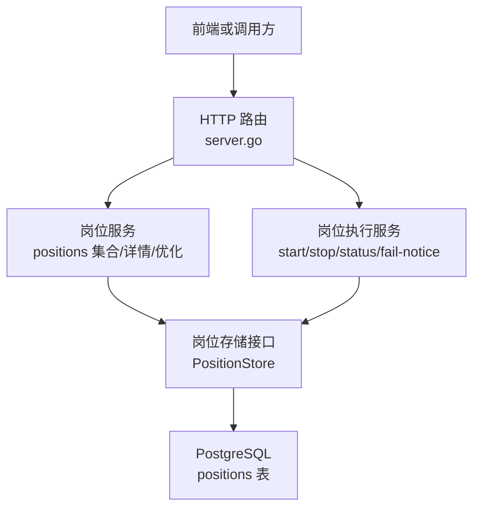
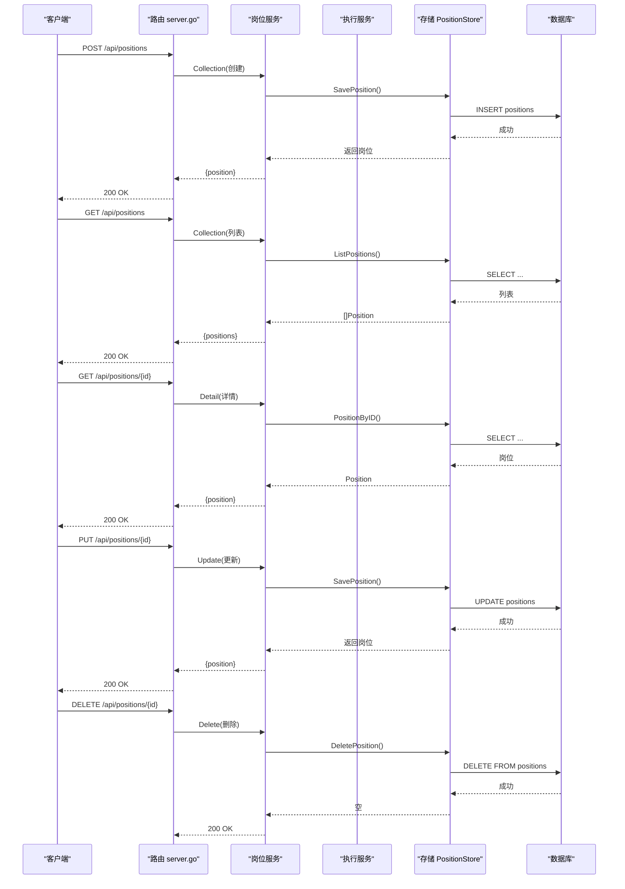
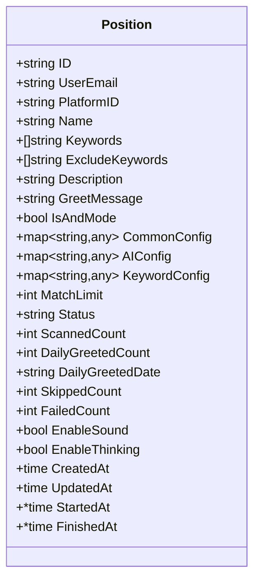
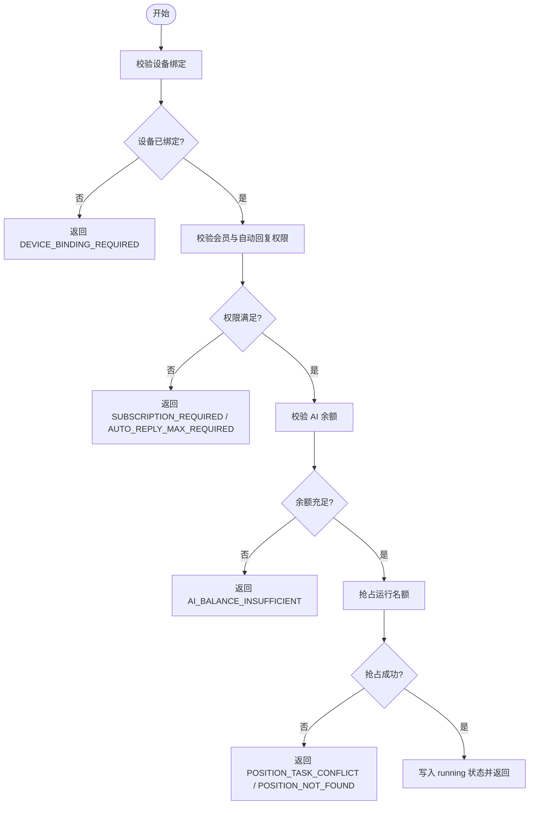
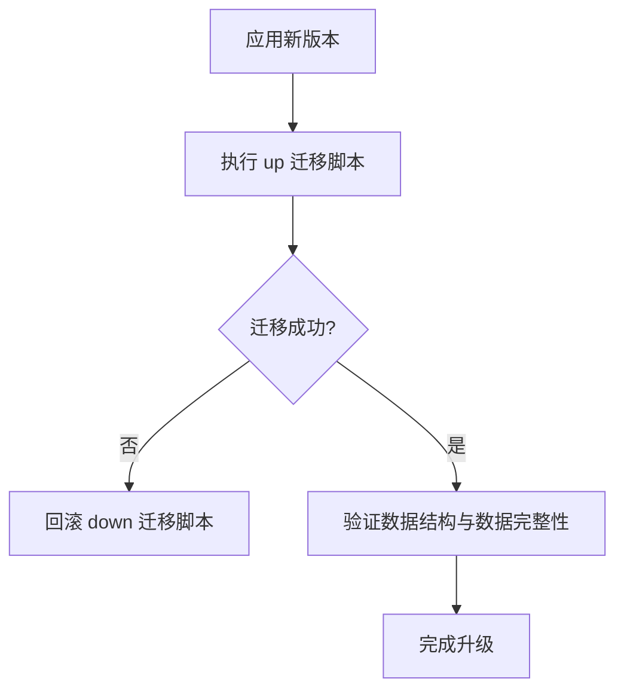
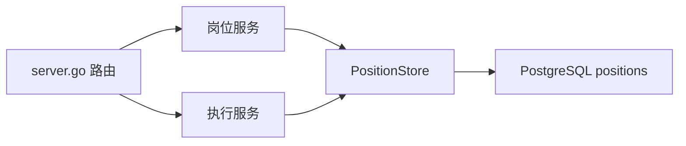

# 岗位配置管理接口

<cite>
**本文引用的文件**
- [server.go](file://goodhr5/cloud/backend/internal/httpapi/server.go)
- [position_store.go](file://goodhr5/cloud/backend/internal/httpapi/position_store.go)
- [position_execution.go](file://goodhr5/cloud/backend/internal/httpapi/position_execution.go)
- [position_test.go](file://goodhr5/cloud/backend/internal/httpapi/position_test.go)
- [0001_initial_schema.sql](file://goodhr5/cloud/backend/db/migrations/0001_initial_schema.sql)
- [0009_position_template_configs.sql](file://goodhr5/cloud/backend/db/migrations/0009_position_template_configs.sql)
- [0019_upgrade_position_ai_prompts_to_score_mode.sql](file://goodhr5/cloud/backend/db/migrations/0019_upgrade_position_ai_prompts_to_score_mode.sql)
</cite>

## 目录
1. [简介](#简介)
2. [项目结构](#项目结构)
3. [核心组件](#核心组件)
4. [架构总览](#架构总览)
5. [详细组件分析](#详细组件分析)
6. [依赖关系分析](#依赖关系分析)
7. [性能考虑](#性能考虑)
8. [故障排查指南](#故障排查指南)
9. [结论](#结论)
10. [附录：API 规范与示例](#附录api-规范与示例)

## 简介
本文件为“岗位配置管理”的完整 API 文档，覆盖岗位的创建、查询、详情、更新与删除等 CRUD 操作，并详细说明岗位配置的数据结构（搜索条件、AI 提示词、运行策略、平台适配器等），以及版本迁移与回滚机制。同时给出请求/响应示例、校验规则与错误处理约定。

## 项目结构
后端 HTTP 服务通过统一路由注册岗位相关接口，岗位配置的核心数据模型与持久化能力由存储层提供，运行时的启动、停止、状态同步由执行服务负责。数据库表结构与字段扩展由迁移脚本维护。

**图表来源**
- [server.go:123-245](file://goodhr5/cloud/backend/internal/httpapi/server.go#L123-L245)
- [position_store.go:14-62](file://goodhr5/cloud/backend/internal/httpapi/position_store.go#L14-L62)

**章节来源**
- [server.go:123-245](file://goodhr5/cloud/backend/internal/httpapi/server.go#L123-L245)
- [position_store.go:14-62](file://goodhr5/cloud/backend/internal/httpapi/position_store.go#L14-L62)

## 核心组件
- 岗位数据模型：包含基础信息、关键词匹配、公共配置、AI 配置、关键词专属配置、统计计数、运行时间戳等。
- 岗位存储接口：提供列表、保存、按 ID 获取、删除、运行抢占、状态更新、结束收尾、计数同步、今日打招呼汇总、用户流程进度等能力。
- 岗位执行服务：负责本地 Agent 启动许可校验、设备绑定检查、会员/AI 余额校验、运行冲突控制、状态同步与通知。
- 路由分发：将 /api/positions 及其子资源映射到具体处理器。

**章节来源**
- [position_store.go:14-62](file://goodhr5/cloud/backend/internal/httpapi/position_store.go#L14-L62)
- [position_execution.go:21-91](file://goodhr5/cloud/backend/internal/httpapi/position_execution.go#L21-L91)
- [server.go:179-183](file://goodhr5/cloud/backend/internal/httpapi/server.go#L179-L183)

## 架构总览
岗位配置的读写走“服务 + 存储”分层；运行态控制由执行服务集中处理，保证同一账号下仅有一个岗位可运行，并在需要时校验会员权限与 AI 余额。

**图表来源**
- [server.go:179-183](file://goodhr5/cloud/backend/internal/httpapi/server.go#L179-L183)
- [position_store.go:50-62](file://goodhr5/cloud/backend/internal/httpapi/position_store.go#L50-L62)

## 详细组件分析

### 岗位数据模型与配置结构
- 基础字段：ID、所属邮箱、平台标识、名称、关键词、排除关键词、描述、问候语、AND 模式开关等。
- 配置对象：
  - common_config：公共参数（如提示音开关、延迟策略、默认模式等）。
  - ai_config：AI 模式专属参数（模型、温度、提示词、评分阈值等）。
  - keyword_config：关键词模式专属参数（关键词行为、详情打开概率等）。
- 运行与统计：匹配上限、状态、扫描/跳过/失败计数、今日打招呼计数与日期、是否启用声音/思考、创建/更新/开始/结束时间。

**图表来源**
- [position_store.go:14-41](file://goodhr5/cloud/backend/internal/httpapi/position_store.go#L14-L41)

**章节来源**
- [position_store.go:14-41](file://goodhr5/cloud/backend/internal/httpapi/position_store.go#L14-L41)
- [0009_position_template_configs.sql:1-10](file://goodhr5/cloud/backend/db/migrations/0009_position_template_configs.sql#L1-L10)
- [0019_upgrade_position_ai_prompts_to_score_mode.sql:1-47](file://goodhr5/cloud/backend/db/migrations/0019_upgrade_position_ai_prompts_to_score_mode.sql#L1-L47)

### 岗位 CRUD 接口规范

#### POST /api/positions（创建岗位）
- 功能：创建新的岗位配置。
- 鉴权：需登录会话。
- 请求体关键字段：
  - name：必填，字符串。
  - keywords：可选，字符串数组。
  - exclude_keywords：可选，字符串数组。
  - description：可选，字符串。
  - greet_message：可选，字符串。
  - is_and_mode：可选，布尔。
  - platform_id：可选，字符串（用于平台适配规则修正）。
  - common_config：可选，JSON 对象（公共参数）。
  - ai_config：可选，JSON 对象（AI 参数）。
  - keyword_config：可选，JSON 对象（关键词模式参数）。
- 服务端校验：
  - 名称不能为空。
  - 若使用 AI 模式或自动回复，会校验会员权限与 AI 余额。
  - 根据平台标识修正不支持的详情识别模式（例如某些平台只支持 DOM）。
- 响应：
  - 200：{ position: {...} }
  - 400：请求体无效或缺少必填字段。
  - 403：未满足会员/权限要求。
  - 500：服务器内部错误。

**章节来源**
- [position_test.go:19-45](file://goodhr5/cloud/backend/internal/httpapi/position_test.go#L19-L45)
- [position_test.go:76-96](file://goodhr5/cloud/backend/internal/httpapi/position_test.go#L76-L96)
- [position_test.go:98-125](file://goodhr5/cloud/backend/internal/httpapi/position_test.go#L98-L125)
- [position_test.go:127-141](file://goodhr5/cloud/backend/internal/httpapi/position_test.go#L127-L141)

#### GET /api/positions（获取岗位列表）
- 功能：列出当前用户（或管理员）的岗位列表。
- 鉴权：需登录会话。
- 响应：
  - 200：{ positions: [{ id, name, ... }] }

**章节来源**
- [position_test.go:47-65](file://goodhr5/cloud/backend/internal/httpapi/position_test.go#L47-L65)
- [position_store.go:262-275](file://goodhr5/cloud/backend/internal/httpapi/position_store.go#L262-L275)

#### GET /api/positions/{id}（获取岗位详情）
- 功能：获取指定岗位详情。
- 鉴权：需登录会话。
- 路径参数：id（岗位 ID）。
- 响应：
  - 200：{ position: {...} }
  - 404：岗位不存在。

**章节来源**
- [server.go:214-245](file://goodhr5/cloud/backend/internal/httpapi/server.go#L214-L245)
- [position_store.go:276-285](file://goodhr5/cloud/backend/internal/httpapi/position_store.go#L276-L285)

#### PUT /api/positions/{id}（更新岗位配置）
- 功能：更新现有岗位配置。
- 鉴权：需登录会话。
- 路径参数：id（岗位 ID）。
- 请求体：同创建接口，但仅更新提供的字段。
- 服务端校验：同创建接口（名称、平台适配规则、AI 权限等）。
- 响应：
  - 200：{ position: {...} }
  - 404：岗位不存在。

**章节来源**
- [server.go:179-183](file://goodhr5/cloud/backend/internal/httpapi/server.go#L179-L183)
- [position_store.go:85-110](file://goodhr5/cloud/backend/internal/httpapi/position_store.go#L85-L110)

#### DELETE /api/positions/{id}（删除岗位）
- 功能：删除指定岗位。
- 鉴权：需登录会话。
- 路径参数：id（岗位 ID）。
- 响应：
  - 200：删除成功。
  - 404：岗位不存在。

**章节来源**
- [position_test.go:67-74](file://goodhr5/cloud/backend/internal/httpapi/position_test.go#L67-L74)
- [position_store.go:287-299](file://goodhr5/cloud/backend/internal/httpapi/position_store.go#L287-L299)

### 运行策略与平台适配器
- 运行策略：
  - 同一账号仅允许一个岗位处于 running 状态。
  - 启动前进行设备绑定校验、会员权限校验、AI 余额校验。
  - 支持任务类型区分（如 greeting、auto_reply），不同任务可能触发不同的权限检查。
- 平台适配器：
  - 根据 platform_id 对 detail_mode 等字段进行修正，确保平台兼容性（例如 Boss 不支持 DOM，某些平台只支持 DOM）。

**图表来源**
- [position_execution.go:215-275](file://goodhr5/cloud/backend/internal/httpapi/position_execution.go#L215-L275)

**章节来源**
- [position_execution.go:49-91](file://goodhr5/cloud/backend/internal/httpapi/position_execution.go#L49-L91)
- [position_execution.go:234-282](file://goodhr5/cloud/backend/internal/httpapi/position_execution.go#L234-L282)
- [position_test.go:98-125](file://goodhr5/cloud/backend/internal/httpapi/position_test.go#L98-L125)

### 版本管理与回滚机制
- 版本管理：
  - 通过数据库迁移脚本逐步演进 positions 表结构，新增 JSONB 字段以承载模板配置与 AI 提示词。
  - 历史迁移会将旧版布尔决策提示词升级为评分模式提示词，并补齐 greet/click 提示词字段。
- 回滚机制：
  - 每个迁移均配套 .down.sql 文件，用于在需要时回滚变更。
  - 建议在升级前备份数据库，并在回滚后验证数据一致性。

**图表来源**
- [0009_position_template_configs.sql:1-10](file://goodhr5/cloud/backend/db/migrations/0009_position_template_configs.sql#L1-L10)
- [0019_upgrade_position_ai_prompts_to_score_mode.sql:1-47](file://goodhr5/cloud/backend/db/migrations/0019_upgrade_position_ai_prompts_to_score_mode.sql#L1-L47)

**章节来源**
- [0001_initial_schema.sql:51-68](file://goodhr5/cloud/backend/db/migrations/0001_initial_schema.sql#L51-L68)
- [0009_position_template_configs.sql:1-10](file://goodhr5/cloud/backend/db/migrations/0009_position_template_configs.sql#L1-L10)
- [0019_upgrade_position_ai_prompts_to_score_mode.sql:1-47](file://goodhr5/cloud/backend/db/migrations/0019_upgrade_position_ai_prompts_to_score_mode.sql#L1-L47)

## 依赖关系分析
- 路由层：server.go 将 /api/positions 及子资源分发至岗位服务与执行服务。
- 服务层：
  - 岗位服务：负责配置 CRUD、平台规则修正、AI 权限校验。
  - 执行服务：负责启动许可、设备绑定、会员/AI 余额校验、运行冲突控制、状态同步与通知。
- 存储层：PositionStore 抽象了内存与 PostgreSQL 实现，屏蔽底层差异。
- 数据库：positions 表为核心实体，配合迁移脚本演进结构。

**图表来源**
- [server.go:179-183](file://goodhr5/cloud/backend/internal/httpapi/server.go#L179-L183)
- [position_store.go:50-62](file://goodhr5/cloud/backend/internal/httpapi/position_store.go#L50-L62)

**章节来源**
- [server.go:179-183](file://goodhr5/cloud/backend/internal/httpapi/server.go#L179-L183)
- [position_store.go:50-62](file://goodhr5/cloud/backend/internal/httpapi/position_store.go#L50-L62)

## 性能考虑
- 并发控制：内存存储使用互斥锁保护岗位状态与计数更新，避免竞态条件。
- 幂等性：结束状态同步具备幂等逻辑，重复提交不会重复累加今日打招呼数量。
- 索引建议：基于 user_id、status、created_at 等常用查询维度建立索引以提升列表与筛选性能。
- 缓存策略：对于频繁读取的平台配置与系统配置，可在上层引入缓存以减少数据库压力。

**章节来源**
- [position_store.go:129-150](file://goodhr5/cloud/backend/internal/httpapi/position_store.go#L129-L150)
- [position_store.go:174-198](file://goodhr5/cloud/backend/internal/httpapi/position_store.go#L174-L198)
- [0001_initial_schema.sql:129-135](file://goodhr5/cloud/backend/db/migrations/0001_initial_schema.sql#L129-L135)

## 故障排查指南
- 常见错误码与含义：
  - METHOD_NOT_ALLOWED：请求方法不正确。
  - SESSION_EXPIRED：登录态失效。
  - INVALID_REQUEST：请求体解析失败。
  - POSITION_NOT_FOUND：岗位不存在。
  - DEVICE_BINDING_REQUIRED：设备未绑定。
  - SUBSCRIPTION_REQUIRED：会员权限不足。
  - AUTO_REPLY_MAX_REQUIRED：自动回复需更高套餐。
  - AI_BALANCE_UNAVAILABLE：AI 余额不可用。
  - AI_BALANCE_INSUFFICIENT：AI 余额不足。
  - POSITION_TASK_CONFLICT：账号已有岗位运行中。
  - POSITION_START_FAILED：云端记录失败。
- 排查步骤：
  - 确认 Authorization 头是否正确携带。
  - 检查请求体字段是否符合规范（特别是 name、keywords、common_config、ai_config）。
  - 查看岗位状态是否为 running，若是则先停止再启动。
  - 核对平台标识与 detail_mode 是否被正确修正。
  - 检查会员状态与 AI 钱包余额是否满足要求。

**章节来源**
- [position_execution.go:51-91](file://goodhr5/cloud/backend/internal/httpapi/position_execution.go#L51-L91)
- [position_execution.go:215-275](file://goodhr5/cloud/backend/internal/httpapi/position_execution.go#L215-L275)
- [position_execution.go:300-309](file://goodhr5/cloud/backend/internal/httpapi/position_execution.go#L300-L309)

## 结论
岗位配置管理通过清晰的分层设计与严格的运行时校验，提供了稳定可靠的 CRUD 能力与安全的启动控制。借助迁移脚本的版本管理与回滚机制，系统具备良好的演进与恢复能力。建议在实际使用中遵循本文档的接口规范与校验规则，并结合平台适配策略进行配置优化。

## 附录：API 规范与示例

### 通用约定
- 认证：所有受保护接口需在请求头携带 Authorization: Bearer <token>。
- 响应格式：
  - 成功：{ ok: true, ... }
  - 失败：{ ok: false, error: "..." } 或 { ok: false, error: { code: "...", message: "..." } }

### POST /api/positions（创建岗位）
- 请求体示例（节选关键字段）：
  - name: "带货主播"
  - keywords: ["直播", "带货"]
  - exclude_keywords: ["销售"]
  - description: "成都岗位"
  - greet_message: "你好"
  - is_and_mode: true
  - platform_id: "boss"
  - common_config: { "mode_default": "keyword", "detail_mode": "ocr" }
  - ai_config: { "open_detail_prompt": "...", "filter_prompt": "...", "greet_prompt": "..." }
  - keyword_config: { "open_probability": 0.8 }
- 成功响应示例：
  - { position: { id: "...", name: "带货主播", keywords: [...], ... } }
- 失败响应示例：
  - { ok: false, error: "name required" }
  - { ok: false, error: { code: "SUBSCRIPTION_REQUIRED", message: "..." } }

**章节来源**
- [position_test.go:19-45](file://goodhr5/cloud/backend/internal/httpapi/position_test.go#L19-L45)
- [position_test.go:76-96](file://goodhr5/cloud/backend/internal/httpapi/position_test.go#L76-L96)
- [position_test.go:127-141](file://goodhr5/cloud/backend/internal/httpapi/position_test.go#L127-L141)

### GET /api/positions（获取岗位列表）
- 成功响应示例：
  - { positions: [{ id: "...", name: "带货主播" }, { id: "...", name: "数学教师" }] }

**章节来源**
- [position_test.go:47-65](file://goodhr5/cloud/backend/internal/httpapi/position_test.go#L47-L65)

### GET /api/positions/{id}（获取岗位详情）
- 成功响应示例：
  - { position: { id: "...", name: "带货主播", keywords: [...], common_config: {...}, ai_config: {...}, status: "created", ... } }

**章节来源**
- [server.go:214-245](file://goodhr5/cloud/backend/internal/httpapi/server.go#L214-L245)
- [position_store.go:276-285](file://goodhr5/cloud/backend/internal/httpapi/position_store.go#L276-L285)

### PUT /api/positions/{id}（更新岗位配置）
- 请求体示例（节选）：
  - name: "更新后的岗位名"
  - common_config: { "mode_default": "ai", "detail_mode": "dom" }
  - ai_config: { "open_detail_prompt": "...", "filter_prompt": "...", "greet_prompt": "..." }
- 成功响应示例：
  - { position: { id: "...", name: "更新后的岗位名", ... } }

**章节来源**
- [server.go:179-183](file://goodhr5/cloud/backend/internal/httpapi/server.go#L179-L183)
- [position_store.go:85-110](file://goodhr5/cloud/backend/internal/httpapi/position_store.go#L85-L110)

### DELETE /api/positions/{id}（删除岗位）
- 成功响应：200 OK（无 body 或 { ok: true }）

**章节来源**
- [position_test.go:67-74](file://goodhr5/cloud/backend/internal/httpapi/position_test.go#L67-L74)
- [position_store.go:287-299](file://goodhr5/cloud/backend/internal/httpapi/position_store.go#L287-L299)

### 运行相关接口（补充）
- POST /api/positions/{id}/start：本地程序申请启动岗位，返回运行许可。
- POST /api/positions/{id}/stop：停止岗位运行。
- POST /api/positions/{id}/status：同步运行状态（running/completed/stopped）。
- POST /api/fail-notice：接收失败通知并发送邮件提醒。

**章节来源**
- [server.go:214-245](file://goodhr5/cloud/backend/internal/httpapi/server.go#L214-L245)
- [position_execution.go:49-213](file://goodhr5/cloud/backend/internal/httpapi/position_execution.go#L49-L213)