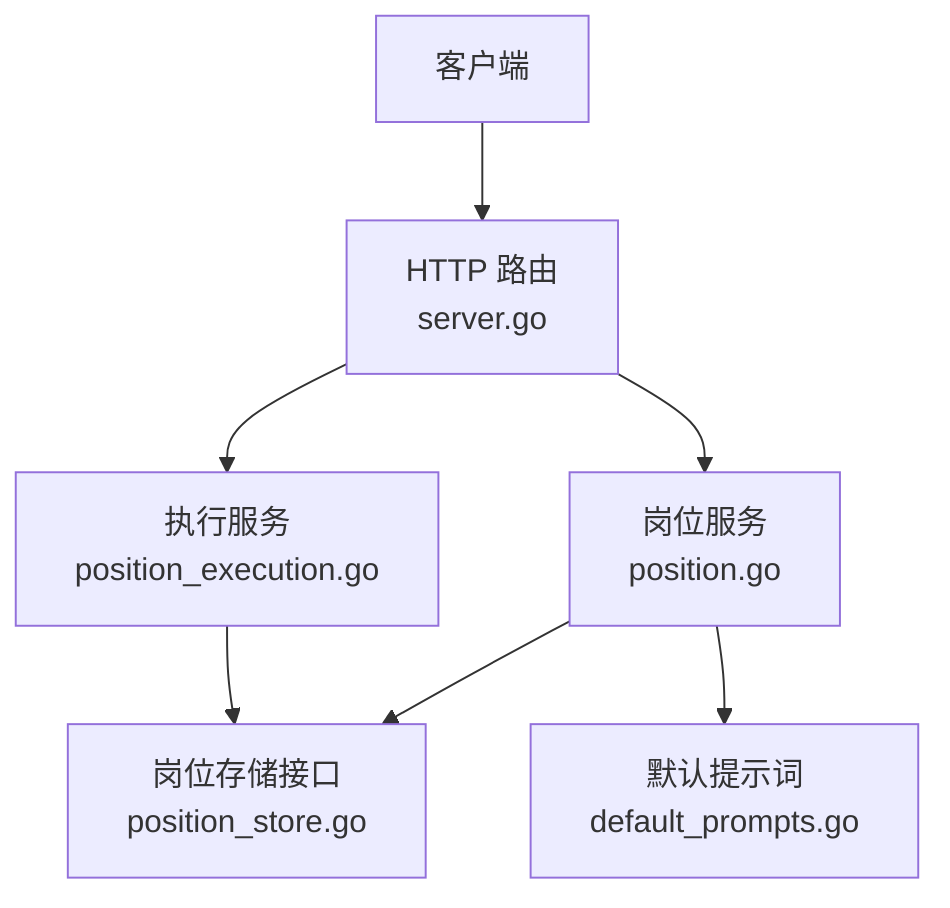
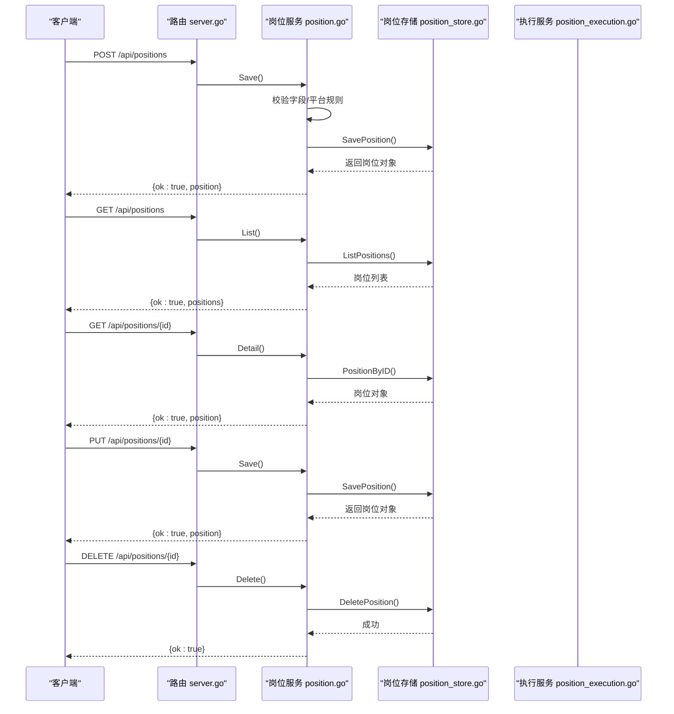
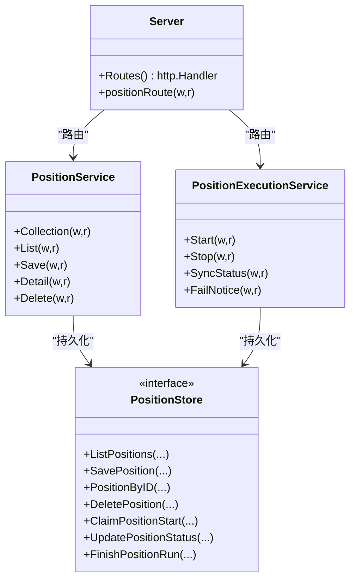
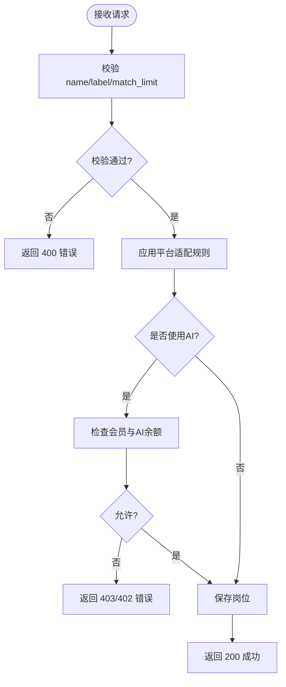

# 岗位配置管理接口

<cite>
**本文引用的文件**
- [position.go](file://goodhr5/cloud/backend/internal/httpapi/position.go)
- [position_store.go](file://goodhr5/cloud/backend/internal/httpapi/position_store.go)
- [server.go](file://goodhr5/cloud/backend/internal/httpapi/server.go)
- [position_execution.go](file://goodhr5/cloud/backend/internal/httpapi/position_execution.go)
- [default_prompts.go](file://goodhr5/cloud/backend/internal/httpapi/default_prompts.go)
- [position_test.go](file://goodhr5/cloud/backend/internal/httpapi/position_test.go)
</cite>

## 目录
1. [简介](#简介)
2. [项目结构](#项目结构)
3. [核心组件](#核心组件)
4. [架构总览](#架构总览)
5. [详细组件分析](#详细组件分析)
6. [依赖关系分析](#依赖关系分析)
7. [性能考虑](#性能考虑)
8. [故障排查指南](#故障排查指南)
9. [结论](#结论)
10. [附录](#附录)

## 简介
本文件为“岗位配置管理”的完整API文档，覆盖岗位配置的创建、查询、更新与删除（CRUD），并说明岗位配置的数据结构、验证规则、错误处理、版本管理与回滚机制。岗位配置用于定义筛选条件、AI提示词、运行策略与平台适配参数，供云端前端与本地Agent协同执行岗位任务。

## 项目结构
后端HTTP服务通过统一路由注册岗位相关接口：
- 集合资源：POST /api/positions（创建）、GET /api/positions（列表）
- 单资源：GET /api/positions/{id}（详情）、PUT /api/positions/{id}（更新）、DELETE /api/positions/{id}（删除）
- 辅助能力：优化岗位要求、获取系统默认提示词、平台配置读取等

**图表来源**
- [server.go:133-228](file://goodhr5/cloud/backend/internal/httpapi/server.go#L133-L228)
- [position.go:74-298](file://goodhr5/cloud/backend/internal/httpapi/position.go#L74-L298)
- [position_execution.go:55-96](file://goodhr5/cloud/backend/internal/httpapi/position_execution.go#L55-L96)
- [default_prompts.go:59-76](file://goodhr5/cloud/backend/internal/httpapi/default_prompts.go#L59-L76)

**章节来源**
- [server.go:133-228](file://goodhr5/cloud/backend/internal/httpapi/server.go#L133-L228)

## 核心组件
- 岗位服务 PositionService：负责岗位配置的校验、保存、查询与删除，以及“优化岗位要求”能力。
- 岗位存储 PositionStore：抽象持久化能力，提供内存实现与数据库实现。
- 执行服务 PositionExecutionService：负责岗位启动、停止、状态同步、失败通知及执行任务记录。
- 默认提示词 DefaultPrompts：从系统配置加载过滤、打开详情、复核评分等默认提示词。

**章节来源**
- [position.go:28-72](file://goodhr5/cloud/backend/internal/httpapi/position.go#L28-L72)
- [position_store.go:50-63](file://goodhr5/cloud/backend/internal/httpapi/position_store.go#L50-L63)
- [position_execution.go:21-51](file://goodhr5/cloud/backend/internal/httpapi/position_execution.go#L21-L51)
- [default_prompts.go:29-56](file://goodhr5/cloud/backend/internal/httpapi/default_prompts.go#L29-L56)

## 架构总览
岗位配置管理的请求-响应流程如下：
- 认证：所有接口需携带有效会话。
- 路由分发：/api/positions 由 Server 路由到 PositionService；/api/positions/{id} 支持 GET/PUT/DELETE。
- 业务校验：名称必填、标签长度限制、匹配上限默认值、平台适配规则修正。
- 权限控制：使用AI功能需满足会员与AI余额要求。
- 持久化：通过 PositionStore 保存或读取岗位数据。
- 扩展能力：可调用系统默认提示词与平台配置。

**图表来源**
- [server.go:193-280](file://goodhr5/cloud/backend/internal/httpapi/server.go#L193-L280)
- [position.go:74-298](file://goodhr5/cloud/backend/internal/httpapi/position.go#L74-L298)
- [position_store.go:86-111](file://goodhr5/cloud/backend/internal/httpapi/position_store.go#L86-L111)

## 详细组件分析

### 接口规范与数据结构
- 通用请求头
  - Authorization: Bearer <token>
- 通用响应格式
  - 成功：{ ok: true, ... }
  - 失败：{ ok: false, error: "错误信息" } 或带稳定错误码的启动错误

#### POST /api/positions（创建岗位）
- 请求体字段
  - name: 字符串，必填
  - label: 字符串，选填，最多20字
  - keywords: 字符串数组，选填
  - exclude_keywords: 字符串数组，选填
  - description: 字符串，选填
  - greet_message: 字符串，选填
  - is_and_mode: 布尔，选填
  - common_config: 对象，选填，包含运行策略与平台适配参数
  - ai_config: 对象，选填，AI相关配置
  - keyword_config: 对象，选填，关键词相关配置
  - match_limit: 整数，选填，默认50
  - enable_sound: 布尔，选填
  - enable_thinking: 布尔，选填
- 响应体
  - { ok: true, position: {...} }
- 验证规则
  - name 为空时拒绝
  - label 超过20字拒绝
  - match_limit <= 0 时默认50
  - 平台适配规则自动修正 detail_mode（如Boss不支持DOM则改为OCR；猎聘/智联只允许DOM）
- 权限与会员
  - 若岗位使用AI（mode_default不为keyword或detail_mode为ai），需要Plus/Max会员且AI余额充足
- 示例
  - 请求：{"name":"带货主播","label":"晚班主力","keywords":["直播","带货"],"exclude_keywords":["销售"],"description":"成都岗位","greet_message":"你好","is_and_mode":true,"common_config":{"mode_default":"ai","detail_mode":"ocr"},"match_limit":100,"enable_sound":false,"enable_thinking":true}
  - 响应：{"ok":true,"position":{"id":"...","name":"带货主播","label":"晚班主力","keywords":["直播","带货"],"exclude_keywords":["销售"],"description":"成都岗位","greet_message":"你好","is_and_mode":true,"common_config":{"mode_default":"ai","detail_mode":"ocr"},"ai_config":{},"keyword_config":{},"match_limit":100,"enable_sound":false,"enable_thinking":true,"status":"created","scanned_count":0,"daily_greeted_count":0,"daily_greeted_date":"YYYY-MM-DD","skipped_count":0,"failed_count":0,"started_at":null,"finished_at":null,"created_at":"...","updated_at":"..."}}

**章节来源**
- [position.go:74-206](file://goodhr5/cloud/backend/internal/httpapi/position.go#L74-L206)
- [position.go:379-445](file://goodhr5/cloud/backend/internal/httpapi/position.go#L379-L445)
- [position_test.go:15-93](file://goodhr5/cloud/backend/internal/httpapi/position_test.go#L15-L93)

#### GET /api/positions（获取岗位列表）
- 响应体
  - { ok: true, positions: [...] }
- 列表项字段同岗位对象，额外包含 is_current_user 标记是否当前登录用户创建的岗位
- 示例
  - 响应：{"ok":true,"positions":[{"id":"...","name":"...","is_current_user":true},...]}

**章节来源**
- [position.go:86-112](file://goodhr5/cloud/backend/internal/httpapi/position.go#L86-L112)
- [position.go:458-474](file://goodhr5/cloud/backend/internal/httpapi/position.go#L458-L474)

#### GET /api/positions/{id}（获取岗位详情）
- 路径参数
  - id: 岗位ID
- 响应体
  - { ok: true, position: {...} }
- 示例
  - 响应：{"ok":true,"position":{"id":"...","name":"...","common_config":{...},"ai_config":{...}}}

**章节来源**
- [position.go:265-298](file://goodhr5/cloud/backend/internal/httpapi/position.go#L265-L298)

#### PUT /api/positions/{id}（更新岗位配置）
- 行为
  - 复用创建逻辑进行校验与保存，仅更新指定字段
- 响应体
  - { ok: true, position: {...} }
- 示例
  - 请求：{"id":"...","name":"更新后的岗位","common_config":{"mode_default":"keyword"}}
  - 响应：{"ok":true,"position":{"id":"...","name":"更新后的岗位",...}}

**章节来源**
- [position.go:265-273](file://goodhr5/cloud/backend/internal/httpapi/position.go#L265-L273)
- [position.go:168-206](file://goodhr5/cloud/backend/internal/httpapi/position.go#L168-L206)

#### DELETE /api/positions/{id}（删除岗位）
- 路径参数
  - id: 岗位ID
- 响应体
  - { ok: true }
- 示例
  - 响应：{"ok":true}

**章节来源**
- [position.go:231-263](file://goodhr5/cloud/backend/internal/httpapi/position.go#L231-L263)

### 岗位配置结构详解
- 基础字段
  - id: 字符串，唯一标识
  - creator_email: 字符串，创建者邮箱
  - platform_id: 字符串，平台标识（boss/hliepin/liepin/zhaopin等）
  - name: 字符串，岗位名称（必填）
  - label: 字符串，岗位标签（选填，≤20字）
  - keywords: 字符串数组，搜索关键词
  - exclude_keywords: 字符串数组，排除关键词
  - description: 字符串，描述
  - greet_message: 字符串，打招呼消息
  - is_and_mode: 布尔，AND模式开关
  - match_limit: 整数，匹配上限（默认50）
  - enable_sound: 布尔，启用声音提醒
  - enable_thinking: 布尔，启用思考模式
- 运行策略与平台适配器
  - common_config: 对象
    - mode_default: 字符串，默认筛选模式（keyword/ai）
    - detail_mode: 字符串，详情识别模式（dom/ocr），受平台规则约束
    - output_structured_resume: 布尔，输出结构化简历（默认false）
  - ai_config: 对象，AI相关配置（模型、温度等）
  - keyword_config: 对象，关键词相关配置
- 统计与状态
  - status: 字符串，运行状态（created/running/completed/stopped/failed）
  - scanned_count: 整数，已扫描数量
  - skipped_count: 整数，跳过数量
  - failed_count: 整数，失败数量
  - daily_greeted_count: 整数，今日打招呼数
  - daily_greeted_date: 字符串，业务日期（YYYY-MM-DD）
  - today_greeted_count: 整数，当日打招呼数（计算字段）
  - started_at: 时间戳，开始时间
  - finished_at: 时间戳，结束时间
  - created_at/updated_at: 时间戳，创建/更新时间

**章节来源**
- [position.go:39-55](file://goodhr5/cloud/backend/internal/httpapi/position.go#L39-L55)
- [position.go:476-507](file://goodhr5/cloud/backend/internal/httpapi/position.go#L476-L507)
- [position_store.go:14-42](file://goodhr5/cloud/backend/internal/httpapi/position_store.go#L14-L42)

### 验证规则与错误处理
- 必填校验
  - name 为空返回 400
- 长度限制
  - label 超过20字返回 400
- 默认值
  - match_limit <= 0 时设为50
- 平台适配
  - Boss 不支持 DOM，自动改为 OCR
  - 猎聘/智联只允许 DOM
- 会员与AI余额
  - 使用AI需Plus/Max会员且AI余额≥0.10元
- 统一错误格式
  - 普通错误：{ ok: false, error: "message" }
  - 启动错误：{ ok: false, error: { code: "...", message: "..." } }

**章节来源**
- [position.go:168-206](file://goodhr5/cloud/backend/internal/httpapi/position.go#L168-L206)
- [position.go:379-445](file://goodhr5/cloud/backend/internal/httpapi/position.go#L379-L445)
- [position_execution.go:363-372](file://goodhr5/cloud/backend/internal/httpapi/position_execution.go#L363-L372)

### 版本管理与回滚机制
- 版本管理
  - 当前实现未提供显式版本字段或版本历史表；每次保存会更新 updated_at，便于外部审计或快照对比。
- 回滚机制
  - 无内置回滚；建议前端或运维在保存前备份岗位配置，或在数据库层维护历史快照以便恢复。
- 运行状态与日志
  - 岗位运行状态变更会写入日志，可用于回溯运行过程；执行任务记录（task_runs）可关联每次启动与结果。

**章节来源**
- [position_store.go:86-111](file://goodhr5/cloud/backend/internal/httpapi/position_store.go#L86-L111)
- [position_execution.go:98-134](file://goodhr5/cloud/backend/internal/httpapi/position_execution.go#L98-L134)

### 默认提示词与平台配置
- 默认提示词
  - 过滤提示词、打开详情提示词、复核评分提示词可从系统配置加载；未设置时使用内置默认。
- 平台配置
  - 可通过 /api/platforms/config/ 获取平台选择器与行为配置，供岗位运行执行使用。

**章节来源**
- [default_prompts.go:29-76](file://goodhr5/cloud/backend/internal/httpapi/default_prompts.go#L29-L76)
- [server.go:410-428](file://goodhr5/cloud/backend/internal/httpapi/server.go#L410-L428)

## 依赖关系分析
- 路由与服务装配
  - Server 在 NewServer 中注入各服务，包括 PositionService、PositionExecutionService、PositionLogService 等。
- 路由分发
  - /api/positions 集合与单资源由 Server.positionRoute 与 PositionService 共同处理。
- 存储抽象
  - PositionStore 提供 List/Save/Get/Delete/Claim/Update/Finish 等方法，内存与数据库实现均遵循该接口。

**图表来源**
- [server.go:47-129](file://goodhr5/cloud/backend/internal/httpapi/server.go#L47-L129)
- [server.go:193-280](file://goodhr5/cloud/backend/internal/httpapi/server.go#L193-L280)
- [position_store.go:50-63](file://goodhr5/cloud/backend/internal/httpapi/position_store.go#L50-L63)

**章节来源**
- [server.go:47-129](file://goodhr5/cloud/backend/internal/httpapi/server.go#L47-L129)
- [server.go:193-280](file://goodhr5/cloud/backend/internal/httpapi/server.go#L193-L280)
- [position_store.go:50-63](file://goodhr5/cloud/backend/internal/httpapi/position_store.go#L50-L63)

## 性能考虑
- 并发安全
  - 内存存储在关键操作中使用互斥锁保证线程安全。
- 默认值与快速路径
  - match_limit 默认值减少无效请求；平台规则自动修正避免后续运行时错误。
- 缓存与限流
  - 当前实现未对岗位列表做缓存；可根据访问量引入Redis缓存岗位列表或热点岗位。
- 异步与重试
  - 邮件发送失败不影响主流程；执行任务记录创建失败仅记录日志不阻塞启动。

[本节为通用指导，无需具体文件引用]

## 故障排查指南
- 常见错误码与原因
  - 400 invalid json body：请求JSON格式错误
  - 400 name is required：岗位名称为空
  - 400 岗位标签不能超过20字：label超长
  - 401 session is invalid or expired：会话失效
  - 403 AI 筛选和 AI 详情识别需要有效的 Plus 或 Max 会员：会员不足
  - 409 POSITION_TASK_CONFLICT：同一账号已有岗位在运行
  - 404 position not found：岗位不存在
  - 500 failed to save position：保存失败
- 启动失败定位
  - 检查设备绑定、会员状态、AI余额、平台登录态
  - 查看执行任务记录与岗位日志，确认运行阶段与错误原因

**章节来源**
- [position.go:168-206](file://goodhr5/cloud/backend/internal/httpapi/position.go#L168-L206)
- [position_execution.go:279-338](file://goodhr5/cloud/backend/internal/httpapi/position_execution.go#L279-L338)
- [position_execution.go:374-435](file://goodhr5/cloud/backend/internal/httpapi/position_execution.go#L374-L435)

## 结论
岗位配置管理提供了完整的CRUD能力，结合平台适配规则与AI能力校验，确保岗位在不同平台上的正确运行。通过统一的错误格式与详细的日志记录，便于问题定位与运维监控。建议在业务层增加版本快照与回滚机制，以增强配置的可追溯性与安全性。

[本节为总结性内容，无需具体文件引用]

## 附录

### 流程图：岗位保存与平台适配

**图表来源**
- [position.go:168-206](file://goodhr5/cloud/backend/internal/httpapi/position.go#L168-L206)
- [position.go:379-445](file://goodhr5/cloud/backend/internal/httpapi/position.go#L379-L445)