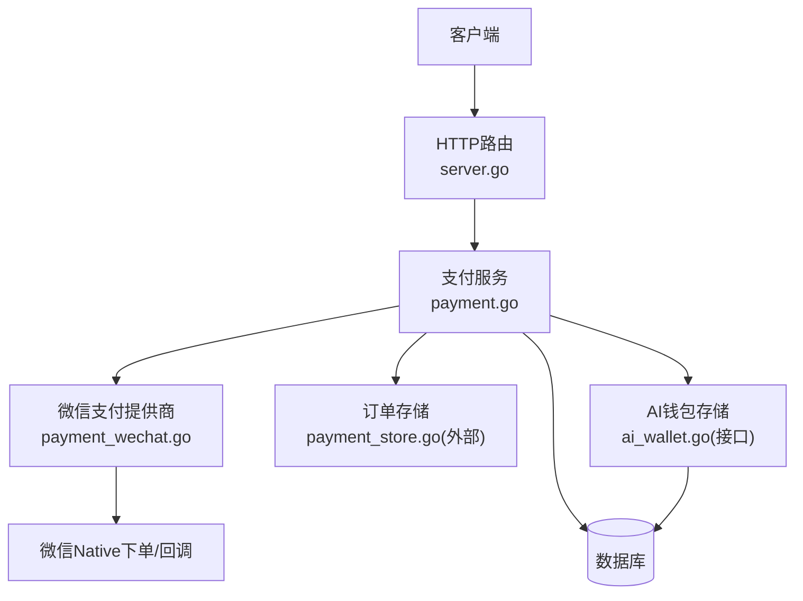
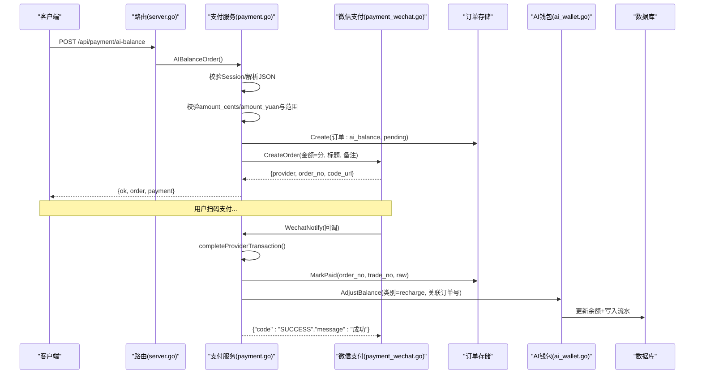
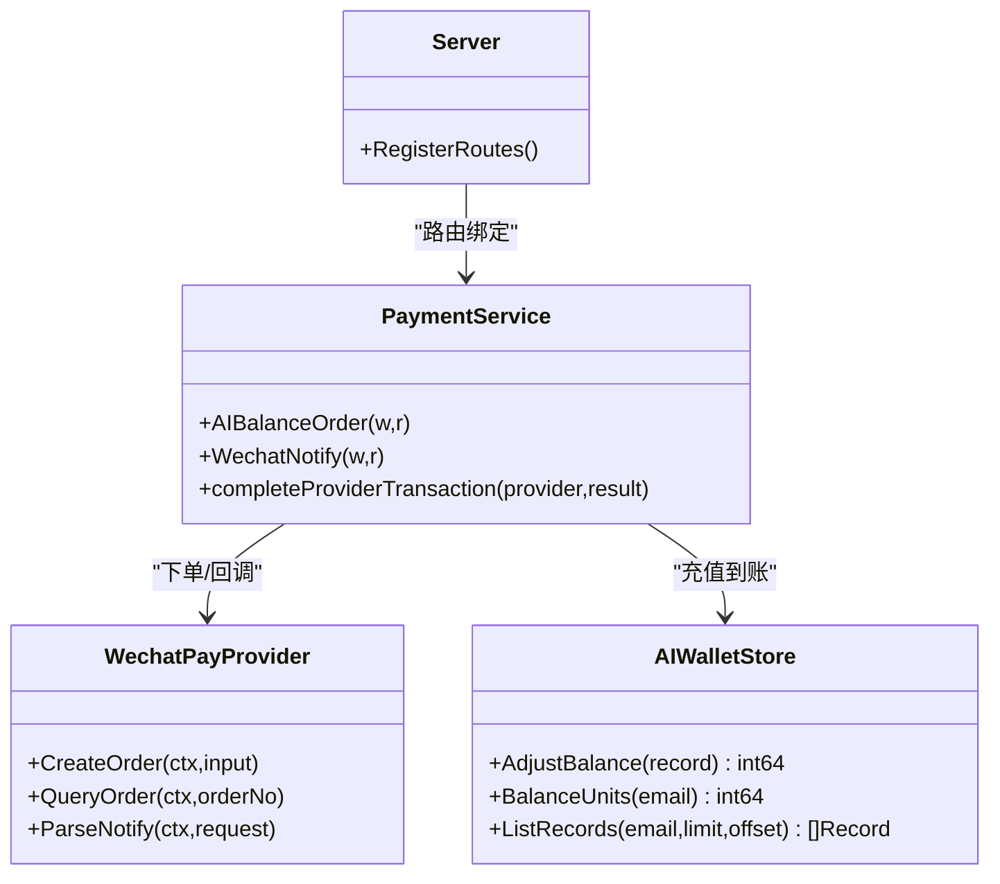

# AI余额充值接口

<cite>
**本文引用的文件**
- [server.go](file://goodhr5/cloud/backend/internal/httpapi/server.go)
- [payment.go](file://goodhr5/cloud/backend/internal/httpapi/payment.go)
- [payment_provider.go](file://goodhr5/cloud/backend/internal/httpapi/payment_provider.go)
- [payment_wechat.go](file://goodhr5/cloud/backend/internal/httpapi/payment_wechat.go)
- [ai_wallet.go](file://goodhr5/cloud/backend/internal/httpapi/ai_wallet.go)
</cite>

## 目录
1. [简介](#简介)
2. [项目结构](#项目结构)
3. [核心组件](#核心组件)
4. [架构总览](#架构总览)
5. [详细组件分析](#详细组件分析)
6. [依赖关系分析](#依赖关系分析)
7. [性能与一致性](#性能与一致性)
8. [故障排查指南](#故障排查指南)
9. [结论](#结论)
10. [附录：API调用示例与错误处理](#附录api调用示例与错误处理)

## 简介
本文档面向后端开发者与集成方，详细说明 POST /api/payment/ai-balance 接口的实现细节与业务规则，包括：
- 充值金额验证范围（1-1000元）
- 默认充值金额设置
- 订单创建流程
- 请求参数 amount_cents 与 amount_yuan 的处理逻辑与单位转换
- AI余额充值与会员订阅的区别
- 支付成功后AI钱包余额调整机制
- 完整的API调用示例与错误处理方案

## 项目结构
该接口位于云端后端 HTTP API 层，路由注册在统一服务中，具体业务由支付服务完成，并通过微信支付提供商完成下单与回调处理，最终落库并更新AI钱包。

图表来源
- [server.go:140-170](file://goodhr5/cloud/backend/internal/httpapi/server.go#L140-L170)
- [payment.go:191-259](file://goodhr5/cloud/backend/internal/httpapi/payment.go#L191-L259)
- [payment_wechat.go:69-100](file://goodhr5/cloud/backend/internal/httpapi/payment_wechat.go#L69-L100)

章节来源
- [server.go:140-170](file://goodhr5/cloud/backend/internal/httpapi/server.go#L140-L170)

## 核心组件
- 路由注册：将 /api/payment/ai-balance 映射到支付服务的 AIBalanceOrder 方法。
- 支付服务：负责校验登录态、解析请求体、金额校验与单位转换、创建订单、调用第三方支付、返回订单与支付信息。
- 微信支付提供商：封装V3 Native下单、主动查单与回调验签解密。
- AI钱包：定义余额单位、充值流水、扣费逻辑与持久化接口。
- 支付结果处理：统一回调入口 completeProviderTransaction 根据订单类型执行不同到账逻辑（AI余额或会员订阅）。

章节来源
- [server.go:140-170](file://goodhr5/cloud/backend/internal/httpapi/server.go#L140-L170)
- [payment.go:191-259](file://goodhr5/cloud/backend/internal/httpapi/payment.go#L191-L259)
- [payment_provider.go:46-69](file://goodhr5/cloud/backend/internal/httpapi/payment_provider.go#L46-L69)
- [payment_wechat.go:69-100](file://goodhr5/cloud/backend/internal/httpapi/payment_wechat.go#L69-L100)
- [ai_wallet.go:23-31](file://goodhr5/cloud/backend/internal/httpapi/ai_wallet.go#L23-L31)

## 架构总览
AI余额充值的核心时序如下：

图表来源
- [server.go:140-170](file://goodhr5/cloud/backend/internal/httpapi/server.go#L140-L170)
- [payment.go:191-259](file://goodhr5/cloud/backend/internal/httpapi/payment.go#L191-L259)
- [payment.go:341-405](file://goodhr5/cloud/backend/internal/httpapi/payment.go#L341-L405)
- [payment_wechat.go:119-137](file://goodhr5/cloud/backend/internal/httpapi/payment_wechat.go#L119-L137)
- [ai_wallet.go:587-632](file://goodhr5/cloud/backend/internal/httpapi/ai_wallet.go#L587-L632)

## 详细组件分析

### 路由与入口
- 路由注册：/api/payment/ai-balance 指向 PaymentService.AIBalanceOrder。
- 仅支持POST方法，非POST直接返回方法不允许。

章节来源
- [server.go:140-170](file://goodhr5/cloud/backend/internal/httpapi/server.go#L140-L170)
- [payment.go:191-206](file://goodhr5/cloud/backend/internal/httpapi/payment.go#L191-L206)

### 请求参数与金额处理
- 请求体字段：
  - amount_cents：整数，单位为“分”。可选。
  - amount_yuan：字符串，表示“元”，保留两位小数精度。可选。
- 处理顺序：
  1) 若 amount_cents <= 0 且 amount_yuan 非空，则使用 yuanTextToCents 将“元”字符串转换为“分”。
  2) 若仍为 <= 0，则采用默认充值金额 defaultAIRechargeAmountCents（常量定义见AI钱包模块）。
  3) 校验范围：必须在 100 分到 100000 分之间，即 1元到1000元之间；否则返回错误。
- 单位换算：
  - 元转分：yuanTextToCents(value) = round(value * 100)。
  - 分转元：centsToYuanString(cents) = "%.2f"。
  - 分转AI单位：centsToAIUnits(cents) = cents * aiWalletUnitsPerCent。
  - AI单位转分：aiUnitsToCents(units) = units / aiWalletUnitsPerCent。
  - AI单位转元字符串：aiUnitsToYuanString(units) 以四位小数输出。

章节来源
- [payment.go:202-221](file://goodhr5/cloud/backend/internal/httpapi/payment.go#L202-L221)
- [payment.go:602-614](file://goodhr5/cloud/backend/internal/httpapi/payment.go#L602-L614)
- [payment_provider.go:46-69](file://goodhr5/cloud/backend/internal/httpapi/payment_provider.go#L46-L69)
- [ai_wallet.go:23-31](file://goodhr5/cloud/backend/internal/httpapi/ai_wallet.go#L23-L31)

### 订单创建流程
- 生成唯一订单号与过期时间（30分钟）。
- 订单类型固定为 ai_balance，计划ID与名称用于标识“AI余额充值”。
- 保存订单状态为 pending，并记录原始金额、折扣金额（本场景为0）、实付金额等。
- 调用默认支付提供商（微信支付）创建订单，返回 provider、order_no、code_url。
- 响应包含订单信息与支付信息，前端据此展示二维码或跳转支付。

章节来源
- [payment.go:222-259](file://goodhr5/cloud/backend/internal/httpapi/payment.go#L222-L259)
- [payment_wechat.go:69-100](file://goodhr5/cloud/backend/internal/httpapi/payment_wechat.go#L69-L100)

### 支付回调与到账逻辑
- 统一回调入口 WechatNotify 接收微信支付通知，解析并调用 completeProviderTransaction。
- completeProviderTransaction 校验：
  - 支付提供商匹配
  - 订单金额一致
  - 订单状态为待支付
- 针对订单类型为 ai_balance：
  - 通过 AIWalletStore.AdjustBalance 增加余额，类别为 recharge，原因“AI余额充值成功”，并记录关联订单号。
  - 余额单位转换：使用 centsToAIUnits 将“分”转为AI钱包单位。
- 针对普通订阅订单：走 applyPaidSubscriptionOrder 发放会员权益。

章节来源
- [payment.go:341-405](file://goodhr5/cloud/backend/internal/httpapi/payment.go#L341-L405)
- [payment_provider.go:51-59](file://goodhr5/cloud/backend/internal/httpapi/payment_provider.go#L51-L59)
- [ai_wallet.go:587-632](file://goodhr5/cloud/backend/internal/httpapi/ai_wallet.go#L587-L632)

### AI余额充值与会员订阅的区别
- 订单类型：
  - AI余额充值：order_type = ai_balance，不改变会员等级与到期时间。
  - 会员订阅：order_type 通常为 subscription，会变更会员类型与有效期。
- 到账逻辑：
  - AI余额充值：调用 AIWalletStore.AdjustBalance 增加余额，写入充值流水。
  - 会员订阅：调用 SubscriptionStore.ApplyGrant 发放会员天数或切换套餐，并可能发送奖励邮件。
- 支付提供商：两者均可使用微信支付，但订单用途不同。

章节来源
- [payment.go:391-405](file://goodhr5/cloud/backend/internal/httpapi/payment.go#L391-L405)
- [payment.go:407-439](file://goodhr5/cloud/backend/internal/httpapi/payment.go#L407-L439)

### 金额单位转换规则汇总
- 输入侧：
  - amount_yuan -> amount_cents：yuanTextToCents(value) = round(value*100)
  - 默认充值金额：defaultAIRechargeAmountCents（常量）
- 内部侧：
  - 分 -> AI单位：centsToAIUnits(cents) = cents * aiWalletUnitsPerCent
  - AI单位 -> 分：aiUnitsToCents(units) = units / aiWalletUnitsPerCent
- 输出侧：
  - 分 -> 元字符串：centsToYuanString(cents) = "%.2f"
  - AI单位 -> 元字符串：aiUnitsToYuanString(units) 四位小数

章节来源
- [payment.go:602-614](file://goodhr5/cloud/backend/internal/httpapi/payment.go#L602-L614)
- [payment_provider.go:46-69](file://goodhr5/cloud/backend/internal/httpapi/payment_provider.go#L46-L69)
- [ai_wallet.go:23-31](file://goodhr5/cloud/backend/internal/httpapi/ai_wallet.go#L23-L31)

## 依赖关系分析
- 路由依赖：server.go 将 /api/payment/ai-balance 绑定到 PaymentService.AIBalanceOrder。
- 支付服务依赖：
  - AuthService：校验会话
  - PaymentStore：创建与查询订单
  - SystemConfigStore：读取系统配置（如微信支付配置）
  - Mailer：订阅奖励邮件（AI充值不涉及）
  - AIWalletStore：充值后调整余额
  - PaymentProvider：微信支付实现
- 微信支付提供商依赖：
  - SystemConfigStore：读取 system.payment_wechat 配置
  - 微信官方SDK：Native下单、查单、回调验签

图表来源
- [server.go:140-170](file://goodhr5/cloud/backend/internal/httpapi/server.go#L140-L170)
- [payment.go:191-259](file://goodhr5/cloud/backend/internal/httpapi/payment.go#L191-L259)
- [payment_wechat.go:69-100](file://goodhr5/cloud/backend/internal/httpapi/payment_wechat.go#L69-L100)
- [ai_wallet.go:48-58](file://goodhr5/cloud/backend/internal/httpapi/ai_wallet.go#L48-L58)

章节来源
- [server.go:140-170](file://goodhr5/cloud/backend/internal/httpapi/server.go#L140-L170)
- [payment.go:191-259](file://goodhr5/cloud/backend/internal/httpapi/payment.go#L191-L259)
- [payment_wechat.go:69-100](file://goodhr5/cloud/backend/internal/httpapi/payment_wechat.go#L69-L100)
- [ai_wallet.go:48-58](file://goodhr5/cloud/backend/internal/httpapi/ai_wallet.go#L48-L58)

## 性能与一致性
- 幂等性：AI钱包充值按“关联订单号”去重，避免重复入账。
- 事务性：AI钱包余额调整与流水写入在同一事务中提交，保证一致性。
- 超时控制：AI钱包查询与更新设置了合理的上下文超时，防止阻塞。
- 并发安全：内存钱包实现使用互斥锁保护余额与流水；Postgres实现通过事务与行级更新保证并发安全。

章节来源
- [ai_wallet.go:587-632](file://goodhr5/cloud/backend/internal/httpapi/ai_wallet.go#L587-L632)
- [ai_wallet.go:507-523](file://goodhr5/cloud/backend/internal/httpapi/ai_wallet.go#L507-L523)

## 故障排查指南
- Session无效或过期：检查请求是否携带有效认证信息。
- JSON解析失败：确认请求体格式正确，amount_cents为整数，amount_yuan为数字字符串。
- 金额不在范围内：确保充值金额在1-1000元之间（100-100000分）。
- 支付提供商未配置：检查系统配置中微信支付参数是否完整。
- 回调处理失败：核对微信支付回调签名与解密过程，关注日志中的错误信息。
- 订单金额不一致：核对订单创建时的金额与回调返回金额是否一致。
- AI钱包未配置：确认AI钱包存储已注入并可读写。

章节来源
- [payment.go:191-259](file://goodhr5/cloud/backend/internal/httpapi/payment.go#L191-L259)
- [payment.go:341-405](file://goodhr5/cloud/backend/internal/httpapi/payment.go#L341-L405)
- [payment_wechat.go:119-137](file://goodhr5/cloud/backend/internal/httpapi/payment_wechat.go#L119-L137)

## 结论
POST /api/payment/ai-balance 提供了标准化的AI余额充值能力，具备严格的金额校验、清晰的单位转换、可靠的订单创建与支付回调处理，以及幂等一致的AI钱包余额调整机制。与会员订阅相比，AI余额充值专注于提升用户的AI使用额度，不影响会员等级与有效期。

## 附录：API调用示例与错误处理

### 接口定义
- 路径：POST /api/payment/ai-balance
- 鉴权：需要有效的登录会话
- 请求体：
  - amount_cents：整数，单位“分”，可选
  - amount_yuan：字符串，单位“元”，可选
- 响应体：
  - ok：布尔
  - order：订单对象（包含 order_no、amount_cents、status 等）
  - payment：支付信息（包含 provider、order_no、code_url）

### 调用示例
- 示例1：指定金额（元）
  - 请求体：{"amount_yuan": "10.00"}
  - 说明：系统将自动转换为1000分，并在范围内校验通过后创建订单。
- 示例2：指定金额（分）
  - 请求体：{"amount_cents": 500}
  - 说明：500分等于5元，符合1-1000元范围。
- 示例3：不传金额
  - 请求体：{}
  - 说明：使用默认充值金额 defaultAIRechargeAmountCents（常量），需满足范围校验。

### 错误处理
- 400 非法请求：
  - JSON解析失败
  - 金额不在1-1000元范围
  - 金额解析失败
- 401 未授权：
  - Session无效或过期
- 500 服务器错误：
  - 支付提供商未配置
  - 创建订单失败
  - 回调处理失败
  - AI钱包未配置或写入失败

### 支付回调与到账
- 回调地址：/api/payment/notify/wechat
- 回调成功后：
  - 订单状态更新为 paid
  - AI钱包余额增加，类别为 recharge，关联订单号
  - 返回标准成功响应给微信支付

章节来源
- [payment.go:191-259](file://goodhr5/cloud/backend/internal/httpapi/payment.go#L191-L259)
- [payment.go:341-405](file://goodhr5/cloud/backend/internal/httpapi/payment.go#L341-L405)
- [payment_wechat.go:119-137](file://goodhr5/cloud/backend/internal/httpapi/payment_wechat.go#L119-L137)
- [ai_wallet.go:587-632](file://goodhr5/cloud/backend/internal/httpapi/ai_wallet.go#L587-L632)