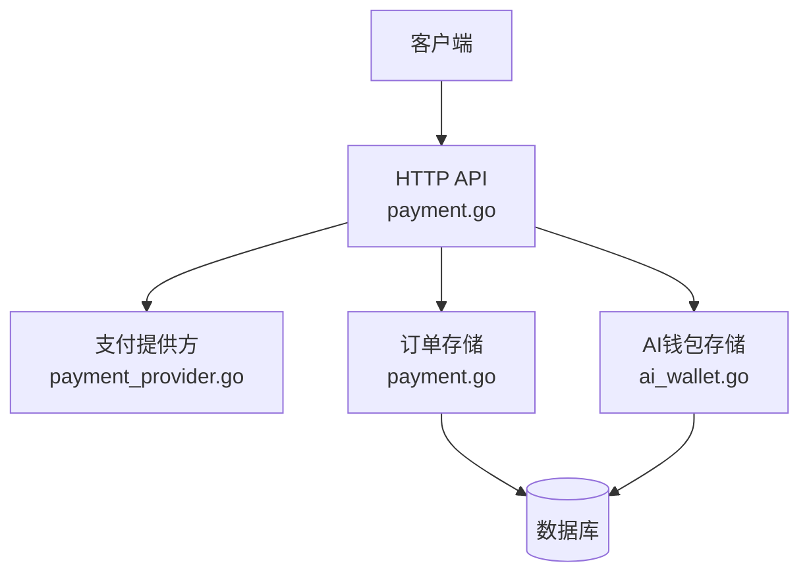
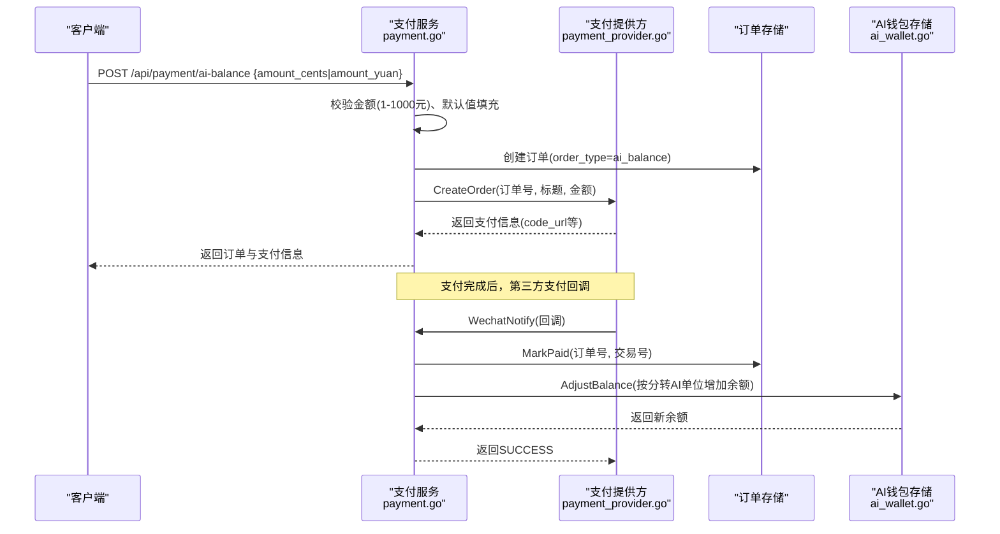
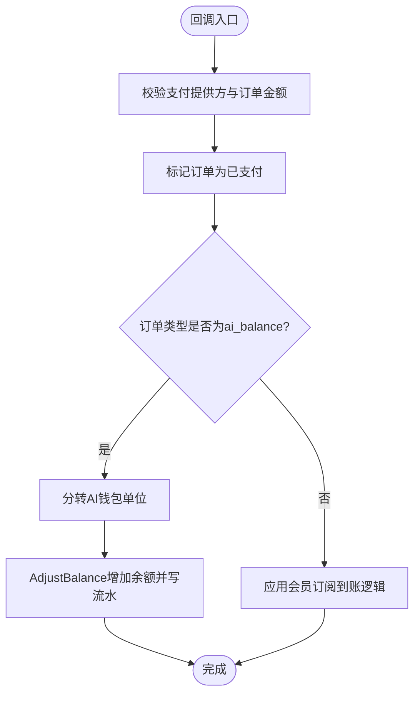
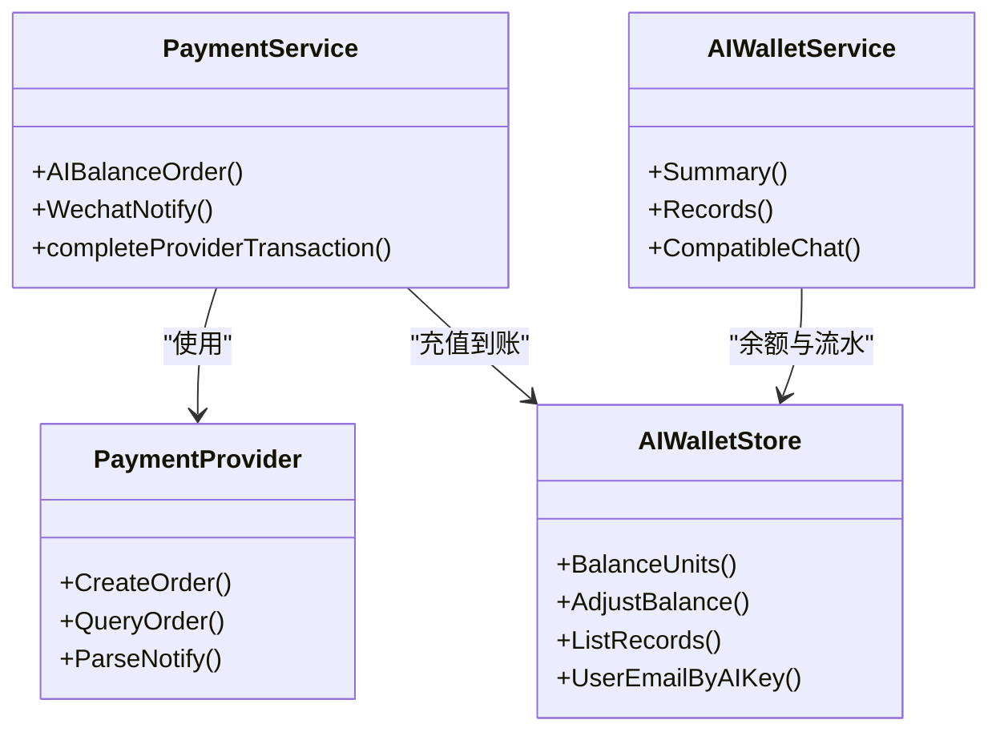

# AI余额充值接口

<cite>
**本文引用的文件**
- [payment.go](file://goodhr5/cloud/backend/internal/httpapi/payment.go)
- [ai_wallet.go](file://goodhr5/cloud/backend/internal/httpapi/ai_wallet.go)
- [payment_provider.go](file://goodhr5/cloud/backend/internal/httpapi/payment_provider.go)
- [0055_ai_wallet_and_builtin_ai.sql](file://goodhr5/cloud/backend/db/migrations/0055_ai_wallet_and_builtin_ai.sql)
</cite>

## 目录
1. [简介](#简介)
2. [项目结构](#项目结构)
3. [核心组件](#核心组件)
4. [架构总览](#架构总览)
5. [详细组件分析](#详细组件分析)
6. [依赖关系分析](#依赖关系分析)
7. [性能与一致性](#性能与一致性)
8. [故障排查指南](#故障排查指南)
9. [结论](#结论)
10. [附录：API调用示例与错误处理](#附录api调用示例与错误处理)

## 简介
本文件面向后端开发者与对接方，详细说明 POST /api/payment/ai-balance 接口的实现细节，包括：
- 充值金额验证（1-1000元范围）
- 默认充值金额设置
- 订单创建流程
- 请求参数 amount_cents 与 amount_yuan 的处理逻辑及金额单位转换规则
- AI余额充值与会员订阅的区别
- 充值成功后AI钱包余额调整机制
- 完整的API调用示例与错误处理方案

## 项目结构
该功能位于云后端 HTTP API 层，主要涉及以下文件：
- payment.go：支付服务、AI余额充值订单创建、支付回调到账处理
- ai_wallet.go：AI钱包服务、余额查询、流水记录、扣费逻辑
- payment_provider.go：支付平台抽象与金额单位转换工具
- 数据库迁移：新增AI钱包表与订单类型字段

图表来源
- [payment.go:191-259](file://goodhr5/cloud/backend/internal/httpapi/payment.go#L191-L259)
- [payment.go:364-405](file://goodhr5/cloud/backend/internal/httpapi/payment.go#L364-L405)
- [ai_wallet.go:48-58](file://goodhr5/cloud/backend/internal/httpapi/ai_wallet.go#L48-L58)
- [payment_provider.go:10-44](file://goodhr5/cloud/backend/internal/httpapi/payment_provider.go#L10-L44)

章节来源
- [payment.go:191-259](file://goodhr5/cloud/backend/internal/httpapi/payment.go#L191-L259)
- [payment.go:364-405](file://goodhr5/cloud/backend/internal/httpapi/payment.go#L364-L405)
- [ai_wallet.go:48-58](file://goodhr5/cloud/backend/internal/httpapi/ai_wallet.go#L48-L58)
- [payment_provider.go:10-44](file://goodhr5/cloud/backend/internal/httpapi/payment_provider.go#L10-L44)

## 核心组件
- 支付服务 PaymentService：负责创建AI余额充值订单、统一回调到账处理。
- AI钱包服务 AIWalletService：提供余额查询、流水记录、OpenAI兼容调用扣费等能力。
- 支付提供方抽象 PaymentProvider：封装第三方下单、查单、回调解析。
- 金额单位转换工具：分与元字符串互转、分与AI钱包单位互转。

章节来源
- [payment.go:34-65](file://goodhr5/cloud/backend/internal/httpapi/payment.go#L34-L65)
- [ai_wallet.go:79-97](file://goodhr5/cloud/backend/internal/httpapi/ai_wallet.go#L79-L97)
- [payment_provider.go:10-44](file://goodhr5/cloud/backend/internal/httpapi/payment_provider.go#L10-L44)

## 架构总览
AI余额充值的核心流程分为“创建订单”和“回调到账”两个阶段：
- 创建订单：校验金额、生成订单号、写入订单、调用第三方支付创建支付单。
- 回调到账：支付成功回调后，校验订单与金额，标记订单已支付，并根据订单类型执行到账逻辑；AI余额充值将分转换为AI钱包单位并增加用户余额。

图表来源
- [payment.go:191-259](file://goodhr5/cloud/backend/internal/httpapi/payment.go#L191-L259)
- [payment.go:341-362](file://goodhr5/cloud/backend/internal/httpapi/payment.go#L341-L362)
- [payment.go:364-405](file://goodhr5/cloud/backend/internal/httpapi/payment.go#L364-L405)
- [ai_wallet.go:589-634](file://goodhr5/cloud/backend/internal/httpapi/ai_wallet.go#L589-L634)

## 详细组件分析

### 接口定义与请求参数
- 端点：POST /api/payment/ai-balance
- 请求体字段：
  - amount_cents：整数，单位为分。可选。
  - amount_yuan：字符串，单位为元（支持小数）。可选。
- 认证：需要有效会话（Session），否则返回未授权。

处理逻辑要点：
- 若 amount_cents <= 0 且 amount_yuan 非空，则通过 yuanTextToCents 将元字符串转为分。
- 若最终 amount_cents <= 0，则使用默认充值金额 defaultAIRechargeAmountCents（1000分，即10元）。
- 金额范围校验：必须在 100 到 100000 分之间（即1元到1000元），否则返回错误提示。

章节来源
- [payment.go:191-221](file://goodhr5/cloud/backend/internal/httpapi/payment.go#L191-L221)
- [payment.go:607-614](file://goodhr5/cloud/backend/internal/httpapi/payment.go#L607-L614)
- [ai_wallet.go:23-31](file://goodhr5/cloud/backend/internal/httpapi/ai_wallet.go#L23-L31)

### 订单创建流程
- 生成订单号与过期时间（30分钟）。
- 写入订单记录，order_type 固定为 "ai_balance"，plan_id 为 "ai_balance"，plan_name 为 "AI余额充值"。
- 调用支付提供方 CreateOrder，传入订单号、标题、金额与备注。
- 返回订单信息与支付信息（如二维码链接或支付URL）。

章节来源
- [payment.go:222-259](file://goodhr5/cloud/backend/internal/httpapi/payment.go#L222-L259)

### 金额单位转换规则
- 元字符串转分：yuanTextToCents 将元字符串解析为浮点数后乘以100取整得到分。
- 分转AI钱包单位：centsToAIUnits 将分乘以 aiWalletUnitsPerCent（100）得到AI钱包单位（0.0001元精度）。
- AI钱包单位转分：aiUnitsToCents 将AI钱包单位除以 aiWalletUnitsPerCent 得到分。
- AI钱包单位转元字符串：aiUnitsToYuanString 输出四位小数元字符串。

章节来源
- [payment.go:602-614](file://goodhr5/cloud/backend/internal/httpapi/payment.go#L602-L614)
- [payment_provider.go:46-69](file://goodhr5/cloud/backend/internal/httpapi/payment_provider.go#L46-L69)
- [ai_wallet.go:23-31](file://goodhr5/cloud/backend/internal/httpapi/ai_wallet.go#L23-L31)

### 充值到账与AI钱包余额调整
- 支付回调入口：WechatNotify 解析回调并调用 completeProviderTransaction。
- 到账逻辑：
  - 校验支付提供方、订单号、金额一致。
  - 标记订单为已支付。
  - 若 order_type == "ai_balance"，则调用 AIWalletStore.AdjustBalance，以 category="recharge"、reason="AI余额充值成功" 写入流水，并将 AmountCents 转换为AI钱包单位增加用户余额。
  - 同时防止重复到账：对同一订单号的充值流水进行幂等检查。

图表来源
- [payment.go:341-362](file://goodhr5/cloud/backend/internal/httpapi/payment.go#L341-L362)
- [payment.go:364-405](file://goodhr5/cloud/backend/internal/httpapi/payment.go#L364-L405)
- [ai_wallet.go:589-634](file://goodhr5/cloud/backend/internal/httpapi/ai_wallet.go#L589-L634)

章节来源
- [payment.go:341-405](file://goodhr5/cloud/backend/internal/httpapi/payment.go#L341-L405)
- [ai_wallet.go:589-634](file://goodhr5/cloud/backend/internal/httpapi/ai_wallet.go#L589-L634)

### AI余额充值与会员订阅的区别
- 订单类型：
  - AI余额充值：order_type = "ai_balance"，不改变会员状态，仅增加AI钱包余额。
  - 会员订阅：order_type 默认为 "subscription"，支付成功后会更新会员套餐、有效期等。
- 到账逻辑：
  - AI余额充值：调用 AIWalletStore.AdjustBalance，category="recharge"。
  - 会员订阅：调用 applyPaidSubscriptionOrder，更新订阅并发送奖励通知。
- 业务影响：
  - AI余额用于调用内置AI模型时的token计费扣费。
  - 会员订阅用于解锁平台功能与权益。

章节来源
- [payment.go:229-243](file://goodhr5/cloud/backend/internal/httpapi/payment.go#L229-L243)
- [payment.go:407-439](file://goodhr5/cloud/backend/internal/httpapi/payment.go#L407-L439)
- [0055_ai_wallet_and_builtin_ai.sql:7-12](file://goodhr5/cloud/backend/db/migrations/0055_ai_wallet_and_builtin_ai.sql#L7-L12)

### 默认充值金额与前端展示
- 默认充值金额常量：defaultAIRechargeAmountCents = 1000（即10元）。
- 前端可通过AI钱包摘要接口获取默认充值金额与当前余额等信息。

章节来源
- [ai_wallet.go:23-31](file://goodhr5/cloud/backend/internal/httpapi/ai_wallet.go#L23-L31)
- [ai_wallet.go:99-126](file://goodhr5/cloud/backend/internal/httpapi/ai_wallet.go#L99-L126)

## 依赖关系分析
- PaymentService 依赖：
  - AuthService：会话校验。
  - PaymentStore：订单持久化。
  - SystemConfigStore：系统配置读取。
  - Mailer：邮件通知（会员订阅场景）。
  - AIWalletStore：AI余额调整（AI余额充值场景）。
  - PaymentProvider：第三方支付下单与回调解析。
- AIWalletService 依赖：
  - AIWalletStore：余额读写与流水记录。
  - AIConfigStore：内置AI配置。
  - SystemConfigStore：系统配置。

图表来源
- [payment.go:34-65](file://goodhr5/cloud/backend/internal/httpapi/payment.go#L34-L65)
- [ai_wallet.go:79-97](file://goodhr5/cloud/backend/internal/httpapi/ai_wallet.go#L79-L97)
- [payment_provider.go:10-44](file://goodhr5/cloud/backend/internal/httpapi/payment_provider.go#L10-L44)
- [ai_wallet.go:48-58](file://goodhr5/cloud/backend/internal/httpapi/ai_wallet.go#L48-L58)

章节来源
- [payment.go:34-65](file://goodhr5/cloud/backend/internal/httpapi/payment.go#L34-L65)
- [ai_wallet.go:79-97](file://goodhr5/cloud/backend/internal/httpapi/ai_wallet.go#L79-L97)
- [payment_provider.go:10-44](file://goodhr5/cloud/backend/internal/httpapi/payment_provider.go#L10-L44)
- [ai_wallet.go:48-58](file://goodhr5/cloud/backend/internal/httpapi/ai_wallet.go#L48-L58)

## 性能与一致性
- 幂等性：AI钱包充值流水对同一订单号进行去重，避免重复到账。
- 事务性：AI钱包余额调整使用数据库事务，确保余额与流水一致性。
- 超时控制：数据库操作设置合理超时，避免长时间阻塞。
- 流式响应：AI调用支持SSE流式转发，并在最后提取usage进行扣费。

章节来源
- [ai_wallet.go:589-634](file://goodhr5/cloud/backend/internal/httpapi/ai_wallet.go#L589-L634)
- [ai_wallet.go:208-307](file://goodhr5/cloud/backend/internal/httpapi/ai_wallet.go#L208-L307)

## 故障排查指南
常见错误与处理：
- 未登录或会话过期：返回未授权。
- JSON解析失败：返回请求体无效。
- 金额无效或超出范围：返回充值金额无效或建议范围提示。
- 支付提供方未配置：返回内部错误。
- 订单创建失败：返回内部错误。
- 支付回调处理失败：返回失败消息并记录日志。
- AI钱包未配置：回调到账时返回内部错误。

建议排查步骤：
- 确认请求包含有效的会话与JSON格式正确。
- 检查金额是否在1-1000元范围内。
- 查看订单是否创建成功以及支付提供方是否返回支付信息。
- 核对支付回调是否到达服务端，订单是否标记为已支付。
- 检查AI钱包存储是否可用，流水是否写入成功。

章节来源
- [payment.go:191-259](file://goodhr5/cloud/backend/internal/httpapi/payment.go#L191-L259)
- [payment.go:341-362](file://goodhr5/cloud/backend/internal/httpapi/payment.go#L341-L362)
- [payment.go:364-405](file://goodhr5/cloud/backend/internal/httpapi/payment.go#L364-L405)

## 结论
POST /api/payment/ai-balance 提供了安全的AI余额充值能力，具备完善的金额校验、默认值填充、订单创建与回调到账流程。充值成功后，系统将分转换为AI钱包单位并增加用户余额，同时记录流水。与会员订阅不同，AI余额充值不影响会员状态，仅用于后续AI调用的token计费扣费。

## 附录：API调用示例与错误处理

### 请求示例
- 方法：POST
- 路径：/api/payment/ai-balance
- 头部：需携带有效会话（Cookie或Token，依服务端实现）
- 请求体（二选一）：
  - 使用分：{"amount_cents": 500}
  - 使用元：{"amount_yuan": "5.00"}
- 若两者均未提供或无效，则使用默认充值金额（10元）。

### 成功响应示例
- 状态码：200
- 响应体包含：
  - ok: true
  - order: 订单对象（含order_no、amount_cents、status等）
  - payment: 支付对象（含provider、code_url等）

### 错误响应示例
- 400 非法请求体或金额无效
- 401 未登录或会话过期
- 500 内部错误（支付提供方未配置、订单创建失败、回调处理失败等）

### 错误处理方案
- 客户端应重试策略：对网络错误可重试，对业务错误（如金额无效）需提示用户修正。
- 支付结果查询：可通过订单详情接口主动查询订单状态，必要时触发服务端主动查单。
- 幂等保障：服务端对同一订单号的充值流水进行去重，避免重复到账。

章节来源
- [payment.go:191-259](file://goodhr5/cloud/backend/internal/httpapi/payment.go#L191-L259)
- [payment.go:341-362](file://goodhr5/cloud/backend/internal/httpapi/payment.go#L341-L362)
- [payment.go:364-405](file://goodhr5/cloud/backend/internal/httpapi/payment.go#L364-L405)