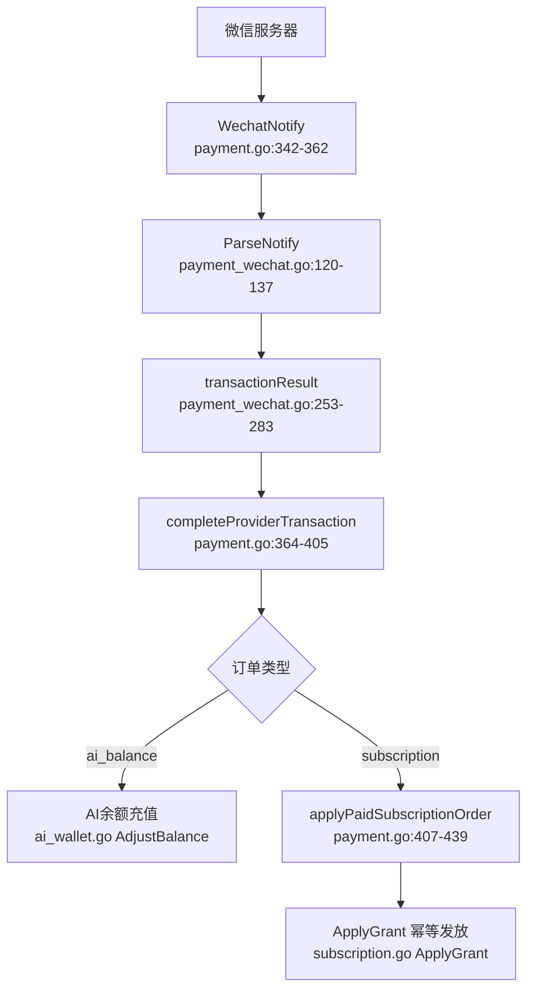
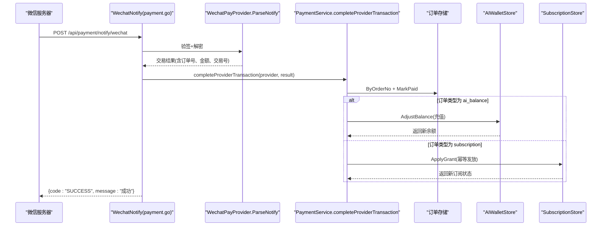
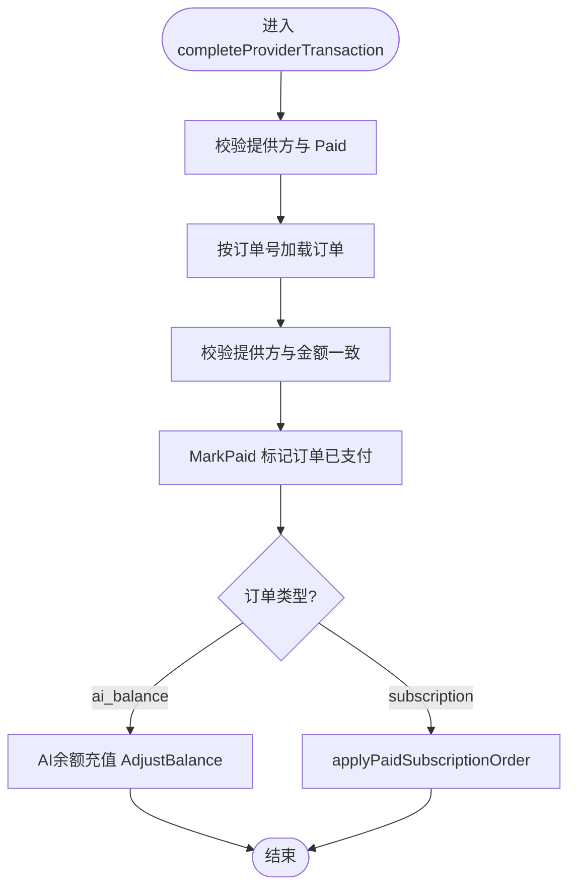
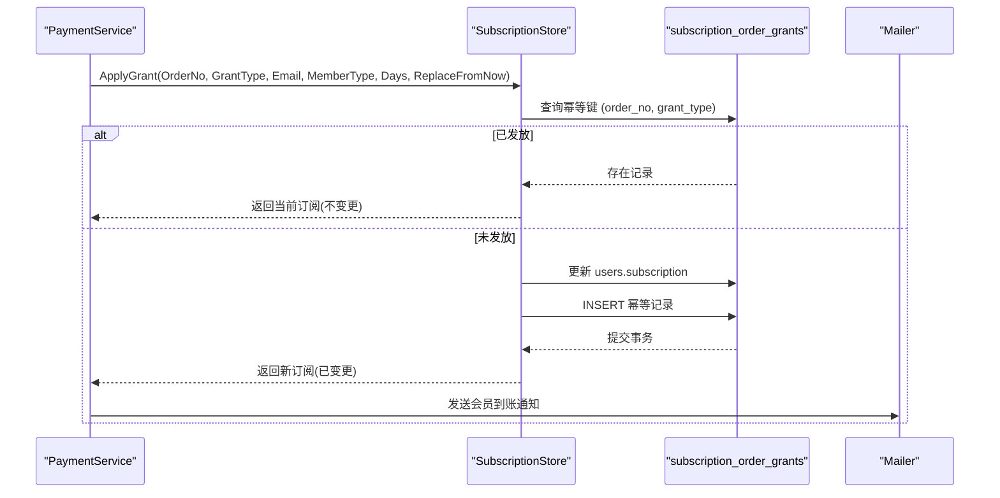
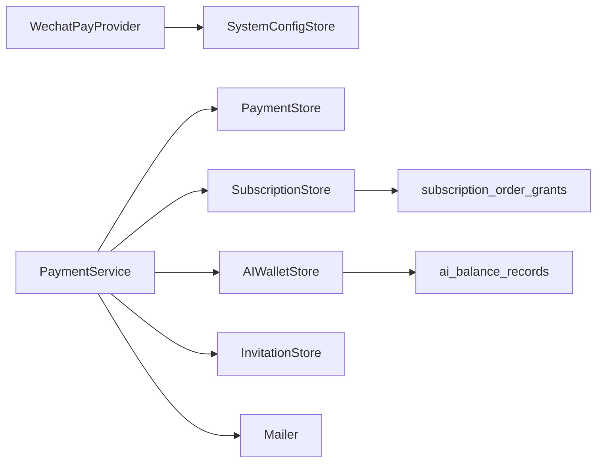
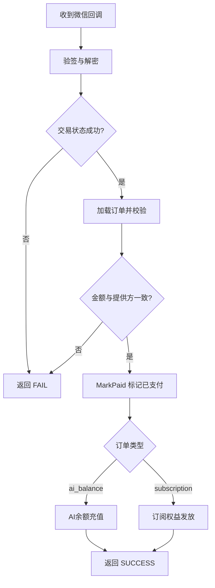

# 支付回调处理

<cite>
**本文引用的文件**
- [payment.go](file://goodhr5/cloud/backend/internal/httpapi/payment.go)
- [payment_wechat.go](file://goodhr5/cloud/backend/internal/httpapi/payment_wechat.go)
- [ai_wallet.go](file://goodhr5/cloud/backend/internal/httpapi/ai_wallet.go)
- [subscription.go](file://goodhr5/cloud/backend/internal/httpapi/subscription.go)
- [0023_payment_orders.sql](file://goodhr5/cloud/backend/db/migrations/0023_payment_orders.sql)
- [0068_subscription_tiers.sql](file://goodhr5/cloud/backend/db/migrations/0068_subscription_tiers.sql)
- [0069_subscription_grant_backfill.sql](file://goodhr5/cloud/backend/db/migrations/0069_subscription_grant_backfill.sql)
</cite>

## 目录
1. [简介](#简介)
2. [项目结构](#项目结构)
3. [核心组件](#核心组件)
4. [架构总览](#架构总览)
5. [详细组件分析](#详细组件分析)
6. [依赖关系分析](#依赖关系分析)
7. [性能与可靠性](#性能与可靠性)
8. [故障排查指南](#故障排查指南)
9. [结论](#结论)
10. [附录：流程图与异常示例](#附录：流程图与异常示例)

## 简介
本文档围绕微信支付回调接口 POST /api/payment/notify/wechat 的完整处理链路展开，重点说明签名验证、参数解析、订单状态更新、completeProviderTransaction 的业务逻辑、AI 余额充值与会员订阅的不同到账流程，以及错误处理策略、重试机制与日志记录方案。文档同时提供完整的回调处理流程图和典型异常处理示例，帮助读者快速理解并安全落地支付回调。

## 项目结构
支付回调相关代码集中在后端 HTTP API 层，主要涉及以下模块：
- 支付服务与统一回调入口：payment.go
- 微信支付提供商实现（下单、查单、回调验签解密）：payment_wechat.go
- AI 钱包与余额调整：ai_wallet.go
- 订阅权益发放与幂等控制：subscription.go
- 数据库迁移（订单表、订阅等级与幂等表）：0023_payment_orders.sql、0068_subscription_tiers.sql、0069_subscription_grant_backfill.sql

图表来源
- [payment.go:342-405](file://goodhr5/cloud/backend/internal/httpapi/payment.go#L342-L405)
- [payment_wechat.go:120-283](file://goodhr5/cloud/backend/internal/httpapi/payment_wechat.go#L120-L283)
- [ai_wallet.go:587-632](file://goodhr5/cloud/backend/internal/httpapi/ai_wallet.go#L587-L632)
- [subscription.go:401-459](file://goodhr5/cloud/backend/internal/httpapi/subscription.go#L401-L459)

章节来源
- [payment.go:342-405](file://goodhr5/cloud/backend/internal/httpapi/payment.go#L342-L405)
- [payment_wechat.go:120-283](file://goodhr5/cloud/backend/internal/httpapi/payment_wechat.go#L120-L283)
- [ai_wallet.go:587-632](file://goodhr5/cloud/backend/internal/httpapi/ai_wallet.go#L587-L632)
- [subscription.go:401-459](file://goodhr5/cloud/backend/internal/httpapi/subscription.go#L401-L459)

## 核心组件
- WechatPayProvider：负责微信支付 V3 Native 下单、主动查单、回调验签解密与交易结果转换。
- PaymentService：统一支付业务编排，包含创建订单、查询订单、微信回调入口、完成到账逻辑。
- AIWalletStore：AI 钱包余额读写与流水记录，支持幂等充值。
- SubscriptionStore：订阅权益发放与幂等控制，支持按订单号防重放。
- 数据模型：payment_orders 订单表、subscription_order_grants 幂等表、users.subscription 用户订阅信息。

章节来源
- [payment_wechat.go:51-137](file://goodhr5/cloud/backend/internal/httpapi/payment_wechat.go#L51-L137)
- [payment.go:34-45](file://goodhr5/cloud/backend/internal/httpapi/payment.go#L34-L45)
- [ai_wallet.go:48-58](file://goodhr5/cloud/backend/internal/httpapi/ai_wallet.go#L48-L58)
- [subscription.go:18-48](file://goodhr5/cloud/backend/internal/httpapi/subscription.go#L18-L48)
- [0023_payment_orders.sql:1-22](file://goodhr5/cloud/backend/db/migrations/0023_payment_orders.sql#L1-L22)
- [0068_subscription_tiers.sql:27-38](file://goodhr5/cloud/backend/db/migrations/0068_subscription_tiers.sql#L27-L38)

## 架构总览
微信支付回调进入 WechatNotify，调用 WechatPayProvider.ParseNotify 进行签名验证与解密，得到统一交易结果后交由 completeProviderTransaction 完成到账。completeProviderTransaction 会校验订单归属、金额一致性与订单状态，随后根据订单类型分别处理：
- AI 余额充值：通过 AIWalletStore.AdjustBalance 增加余额并写入流水，支持基于订单号的幂等。
- 会员订阅：通过 applyPaidSubscriptionOrder 调用 SubscriptionStore.ApplyGrant 幂等发放会员时间，并根据升级/降级场景计算到期时间。

图表来源
- [payment.go:342-405](file://goodhr5/cloud/backend/internal/httpapi/payment.go#L342-L405)
- [payment_wechat.go:120-137](file://goodhr5/cloud/backend/internal/httpapi/payment_wechat.go#L120-L137)
- [ai_wallet.go:587-632](file://goodhr5/cloud/backend/internal/httpapi/ai_wallet.go#L587-L632)
- [subscription.go:401-459](file://goodhr5/cloud/backend/internal/httpapi/subscription.go#L401-L459)

## 详细组件分析

### 微信支付回调入口与签名验证
- 入口方法 WechatNotify 仅接受 POST 请求，未配置微信支付时返回不可用；否则调用 provider.ParseNotify 完成验签与解密。
- ParseNotify 使用官方 SDK 的 notify.Handler 对回调进行签名验证与内容解密，并将 payments.Transaction 转换为统一的 PaymentProviderTransactionResult。
- transactionResult 进一步校验交易归属（AppID、商户号）、币种（CNY）、交易类型（NATIVE），并提取订单号、金额、交易号，标记是否支付成功。

章节来源
- [payment.go:342-362](file://goodhr5/cloud/backend/internal/httpapi/payment.go#L342-L362)
- [payment_wechat.go:120-137](file://goodhr5/cloud/backend/internal/httpapi/payment_wechat.go#L120-L137)
- [payment_wechat.go:253-283](file://goodhr5/cloud/backend/internal/httpapi/payment_wechat.go#L253-L283)

### completeProviderTransaction 业务逻辑
completeProviderTransaction 是到账的核心方法，执行以下关键步骤：
- 校验支付提供方名称与结果 Paid 标志。
- 根据订单号查询订单，校验订单所属提供方与金额一致性。
- 将订单标记为已支付，并保存第三方交易原始数据。
- 若订单类型为 ai_balance，则调用 AIWalletStore.AdjustBalance 以“recharge”类别增加余额，并记录关联订单号。
- 若订单类型为 subscription，则调用 applyPaidSubscriptionOrder 发放会员权益。

图表来源
- [payment.go:364-405](file://goodhr5/cloud/backend/internal/httpapi/payment.go#L364-L405)

章节来源
- [payment.go:364-405](file://goodhr5/cloud/backend/internal/httpapi/payment.go#L364-L405)

### AI 余额充值到账流程
- 当订单类型为 ai_balance 时，系统通过 AIWalletStore.AdjustBalance 增加用户余额，并以 category="recharge" 写入流水，记录 reason、related_order_no。
- 在 PostgresAIWalletStore 中，针对 recharge 且携带 related_order_no 的记录，会通过唯一索引或查询避免重复充值，确保幂等。
- 单位换算：AI 余额单位为“0.0001元”，充值时将订单金额分转换为对应单位。

章节来源
- [payment.go:391-402](file://goodhr5/cloud/backend/internal/httpapi/payment.go#L391-L402)
- [ai_wallet.go:587-632](file://goodhr5/cloud/backend/internal/httpapi/ai_wallet.go#L587-L632)
- [ai_wallet.go:23-31](file://goodhr5/cloud/backend/internal/httpapi/ai_wallet.go#L23-L31)

### 会员订阅到账流程
- applyPaidSubscriptionOrder 根据订单中的 member_type、duration_days、upgrade_from_member_type 等信息，调用 SubscriptionStore.ApplyGrant 发放会员时间。
- ApplyGrant 在同一事务内检查 subscription_order_grants 幂等表，防止同一订单重复发放。
- 对于 Plus 升 Max 或 Max 切换 Plus 的场景，ReplaceFromNow 控制是否从当前时间重新计算到期时间。
- 发放成功后发送通知邮件，并尝试给邀请人发放奖励。

图表来源
- [payment.go:407-439](file://goodhr5/cloud/backend/internal/httpapi/payment.go#L407-L439)
- [subscription.go:401-459](file://goodhr5/cloud/backend/internal/httpapi/subscription.go#L401-L459)
- [0068_subscription_tiers.sql:27-38](file://goodhr5/cloud/backend/db/migrations/0068_subscription_tiers.sql#L27-L38)

章节来源
- [payment.go:407-439](file://goodhr5/cloud/backend/internal/httpapi/payment.go#L407-L439)
- [subscription.go:401-459](file://goodhr5/cloud/backend/internal/httpapi/subscription.go#L401-L459)
- [0068_subscription_tiers.sql:27-38](file://goodhr5/cloud/backend/db/migrations/0068_subscription_tiers.sql#L27-L38)

### 订单校验与金额核对
- 在 completeProviderTransaction 中，先按订单号加载订单，再校验订单的 payment_provider 与 result 的 providerName 一致，并严格比对 amount_cents。
- 若不一致，直接返回错误，避免错误到账。
- 订单状态必须为 pending，MarkPaid 成功后才继续后续到账逻辑。

章节来源
- [payment.go:373-390](file://goodhr5/cloud/backend/internal/httpapi/payment.go#L373-L390)

### 主动查单与补到账
- 在订单详情查询接口中，若订单仍为 pending 且在有效期内，会调用 provider.QueryOrder 主动查询支付状态。
- 若查询结果为已支付，则同样调用 completeProviderTransaction 完成到账，保证回调丢失时的最终一致性。

章节来源
- [payment.go:324-338](file://goodhr5/cloud/backend/internal/httpapi/payment.go#L324-L338)

## 依赖关系分析
- WechatPayProvider 依赖 SystemConfigStore 读取微信支付配置，并在每次请求前校验配置完整性，必要时重建 SDK 客户端。
- PaymentService 依赖多个 Store：订单存储、订阅存储、AI 钱包存储、邮件发送器、邀请存储。
- SubscriptionStore 通过幂等表 subscription_order_grants 保障同一订单不会重复发放权益。
- AIWalletStore 通过订单号与类别组合保证充值幂等。

图表来源
- [payment_wechat.go:139-251](file://goodhr5/cloud/backend/internal/httpapi/payment_wechat.go#L139-L251)
- [payment.go:34-45](file://goodhr5/cloud/backend/internal/httpapi/payment.go#L34-L45)
- [subscription.go:401-459](file://goodhr5/cloud/backend/internal/httpapi/subscription.go#L401-L459)
- [ai_wallet.go:587-632](file://goodhr5/cloud/backend/internal/httpapi/ai_wallet.go#L587-L632)

章节来源
- [payment_wechat.go:139-251](file://goodhr5/cloud/backend/internal/httpapi/payment_wechat.go#L139-L251)
- [payment.go:34-45](file://goodhr5/cloud/backend/internal/httpapi/payment.go#L34-L45)
- [subscription.go:401-459](file://goodhr5/cloud/backend/internal/httpapi/subscription.go#L401-L459)
- [ai_wallet.go:587-632](file://goodhr5/cloud/backend/internal/httpapi/ai_wallet.go#L587-L632)

## 性能与可靠性
- 幂等性：
  - 订阅权益发放通过 subscription_order_grants 表实现订单级幂等，避免重复发放。
  - AI 余额充值通过 ai_balance_records 的 unique index on related_order_no 限制重复充值。
- 最终一致性：
  - 订单详情查询时会主动查单并补到账，弥补回调延迟或丢失。
- 配置热更新：
  - 微信支付配置变化时自动重建 SDK 客户端，无需重启服务。
- 并发安全：
  - 订阅发放与 AI 余额调整均在事务或锁保护下执行，避免竞态条件。

[本节为通用指导，不直接分析具体文件]

## 故障排查指南
常见错误与处理建议：
- 回调验签失败：
  - 检查微信支付公钥、私钥、APIv3 Key 是否正确配置。
  - 确认回调地址与证书序列号匹配。
- 金额不匹配：
  - 核对订单创建金额与回调金额是否一致，避免前端篡改。
- 订单状态异常：
  - 若订单已关闭或已支付，回调不应再次到账；检查 MarkPaid 的状态机。
- 订阅重复发放：
  - 检查 subscription_order_grants 是否存在相同 order_no 与 grant_type 的记录。
- AI 余额重复充值：
  - 检查 ai_balance_records 中是否有相同 category 与 related_order_no 的记录。

章节来源
- [payment_wechat.go:159-179](file://goodhr5/cloud/backend/internal/httpapi/payment_wechat.go#L159-L179)
- [payment.go:373-390](file://goodhr5/cloud/backend/internal/httpapi/payment.go#L373-L390)
- [subscription.go:427-453](file://goodhr5/cloud/backend/internal/httpapi/subscription.go#L427-L453)
- [ai_wallet.go:600-613](file://goodhr5/cloud/backend/internal/httpapi/ai_wallet.go#L600-L613)

## 结论
本系统通过严格的签名验证、订单校验与金额核对，结合幂等设计与最终一致性补偿，确保了微信支付回调的安全与可靠。AI 余额充值与会员订阅采用不同的到账路径，既满足即时到账需求，又保证了数据一致性与可追溯性。建议在部署时完善日志与监控，并对回调失败进行告警与重试。

[本节为总结，不直接分析具体文件]

## 附录：流程图与异常示例

### 回调处理主流程

图表来源
- [payment.go:342-405](file://goodhr5/cloud/backend/internal/httpapi/payment.go#L342-L405)
- [payment_wechat.go:120-283](file://goodhr5/cloud/backend/internal/httpapi/payment_wechat.go#L120-L283)

### 异常处理示例
- 验签失败：
  - 现象：回调被拒绝，返回 FAIL。
  - 原因：公钥/私钥/密钥配置错误或请求体被篡改。
  - 处理：检查系统配置与证书，记录详细日志。
- 金额不匹配：
  - 现象：completeProviderTransaction 报错。
  - 原因：订单创建金额与回调金额不一致。
  - 处理：拒绝到账，记录差异，人工核查。
- 订单已关闭：
  - 现象：MarkPaid 不改变状态。
  - 原因：订单已过期或手动关闭。
  - 处理：忽略回调，记录日志。
- 订阅重复发放：
  - 现象：ApplyGrant 返回 unchanged。
  - 原因：幂等表已有记录。
  - 处理：视为正常，无需重复操作。
- AI 余额重复充值：
  - 现象：AdjustBalance 返回历史余额。
  - 原因：唯一索引约束。
  - 处理：视为正常，无需重复充值。

章节来源
- [payment.go:356-362](file://goodhr5/cloud/backend/internal/httpapi/payment.go#L356-L362)
- [payment.go:373-390](file://goodhr5/cloud/backend/internal/httpapi/payment.go#L373-L390)
- [subscription.go:427-453](file://goodhr5/cloud/backend/internal/httpapi/subscription.go#L427-L453)
- [ai_wallet.go:600-613](file://goodhr5/cloud/backend/internal/httpapi/ai_wallet.go#L600-L613)