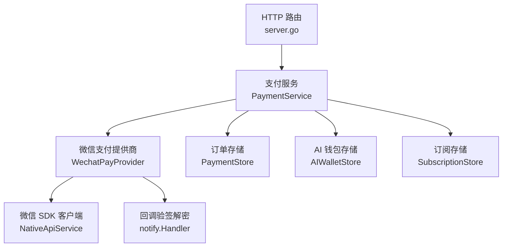
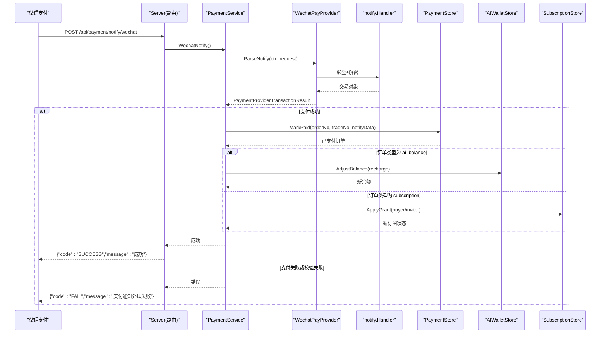
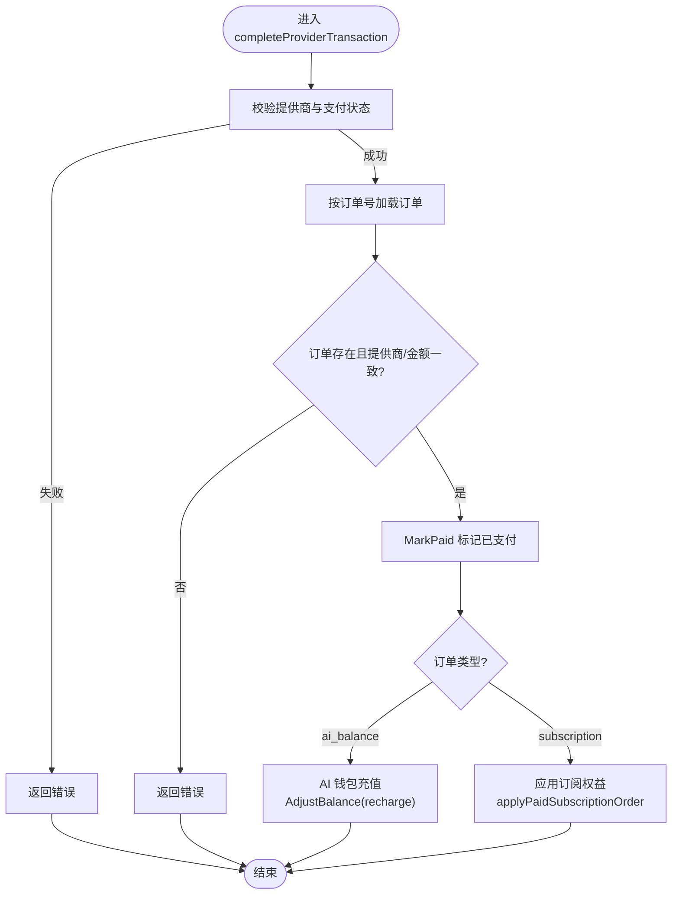
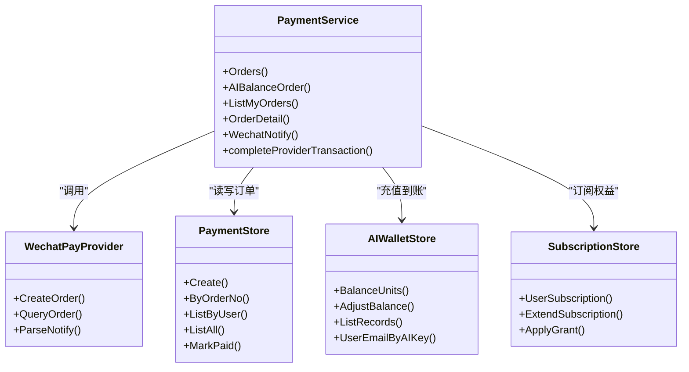
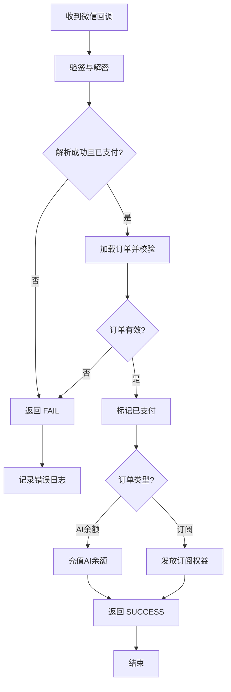

# 支付回调处理

<cite>
**本文引用的文件**
- [server.go](file://goodhr5/cloud/backend/internal/httpapi/server.go)
- [payment.go](file://goodhr5/cloud/backend/internal/httpapi/payment.go)
- [payment_provider.go](file://goodhr5/cloud/backend/internal/httpapi/payment_provider.go)
- [payment_wechat.go](file://goodhr5/cloud/backend/internal/httpapi/payment_wechat.go)
- [payment_store.go](file://goodhr5/cloud/backend/internal/httpapi/payment_store.go)
- [ai_wallet.go](file://goodhr5/cloud/backend/internal/httpapi/ai_wallet.go)
- [subscription.go](file://goodhr5/cloud/backend/internal/httpapi/subscription.go)
</cite>

## 目录
1. [简介](#简介)
2. [项目结构](#项目结构)
3. [核心组件](#核心组件)
4. [架构总览](#架构总览)
5. [详细组件分析](#详细组件分析)
6. [依赖关系分析](#依赖关系分析)
7. [性能与可靠性](#性能与可靠性)
8. [故障排查指南](#故障排查指南)
9. [结论](#结论)
10. [附录](#附录)

## 简介
本文档聚焦于微信支付回调处理机制，围绕 POST /api/payment/notify/wechat 接口的签名验证、参数解析、订单状态更新进行说明；重点拆解 completeProviderTransaction 的业务逻辑，包括订单校验、金额核对、交易完成后的到账处理。同时解释 AI 余额充值与会员订阅两种不同到账流程的差异，并给出错误处理策略、重试建议与日志记录方案，最后提供完整的回调处理流程图与异常处理示例。

## 项目结构
支付回调相关代码位于后端 HTTP API 模块中，路由注册在统一服务入口，具体业务由 PaymentService 编排，第三方支付能力通过 PaymentProvider 抽象实现（当前为微信支付），订单持久化由 PaymentStore 负责，AI 钱包与会员订阅分别由对应存储与服务完成最终到账。

图表来源
- [server.go:167-171](file://goodhr5/cloud/backend/internal/httpapi/server.go#L167-L171)
- [payment.go:341-362](file://goodhr5/cloud/backend/internal/httpapi/payment.go#L341-L362)
- [payment_wechat.go:119-137](file://goodhr5/cloud/backend/internal/httpapi/payment_wechat.go#L119-L137)
- [payment_store.go:38-50](file://goodhr5/cloud/backend/internal/httpapi/payment_store.go#L38-L50)
- [ai_wallet.go:48-58](file://goodhr5/cloud/backend/internal/httpapi/ai_wallet.go#L48-L58)
- [subscription.go:34-48](file://goodhr5/cloud/backend/internal/httpapi/subscription.go#L34-L48)

章节来源
- [server.go:167-171](file://goodhr5/cloud/backend/internal/httpapi/server.go#L167-L171)

## 核心组件
- 支付服务 PaymentService：统一编排创建订单、查询订单、处理回调、完成到账等业务。
- 微信支付提供商 WechatPayProvider：封装 V3 Native 下单、查单、回调验签解密与结果转换。
- 订单存储 PaymentStore：内存或 PostgreSQL 双实现，提供订单创建、查询、标记已支付等能力。
- AI 钱包存储 AIWalletStore：提供余额查询、调整与流水记录。
- 订阅存储 SubscriptionStore：提供用户订阅状态读取与幂等权益发放。

章节来源
- [payment.go:34-65](file://goodhr5/cloud/backend/internal/httpapi/payment.go#L34-L65)
- [payment_provider.go:10-44](file://goodhr5/cloud/backend/internal/httpapi/payment_provider.go#L10-L44)
- [payment_wechat.go:51-62](file://goodhr5/cloud/backend/internal/httpapi/payment_wechat.go#L51-L62)
- [payment_store.go:13-50](file://goodhr5/cloud/backend/internal/httpapi/payment_store.go#L13-L50)
- [ai_wallet.go:48-58](file://goodhr5/cloud/backend/internal/httpapi/ai_wallet.go#L48-L58)
- [subscription.go:18-48](file://goodhr5/cloud/backend/internal/httpapi/subscription.go#L18-L48)

## 架构总览
POST /api/payment/notify/wechat 的回调处理链路如下：
- 路由将请求分发到 PaymentService.WechatNotify。
- WechatNotify 调用 WechatPayProvider.ParseNotify 完成签名验证、解密与结果转换。
- 若解析成功且结果为“已支付”，则调用 PaymentService.completeProviderTransaction 完成订单与到账。
- completeProviderTransaction 根据订单类型区分 AI 余额充值与会员订阅，分别调用 AIWalletStore.AdjustBalance 或 SubscriptionStore.ApplyGrant。

图表来源
- [server.go:167-171](file://goodhr5/cloud/backend/internal/httpapi/server.go#L167-L171)
- [payment.go:341-362](file://goodhr5/cloud/backend/internal/httpapi/payment.go#L341-L362)
- [payment_wechat.go:119-137](file://goodhr5/cloud/backend/internal/httpapi/payment_wechat.go#L119-L137)
- [payment_store.go:233-257](file://goodhr5/cloud/backend/internal/httpapi/payment_store.go#L233-L257)
- [ai_wallet.go:589-634](file://goodhr5/cloud/backend/internal/httpapi/ai_wallet.go#L589-L634)
- [subscription.go:401-459](file://goodhr5/cloud/backend/internal/httpapi/subscription.go#L401-L459)

## 详细组件分析

### 微信支付回调接口 POST /api/payment/notify/wechat
- 路由注册：服务端在统一路由中注册该路径，交由 PaymentService.WechatNotify 处理。
- 方法校验：仅接受 POST，否则返回不支持的方法响应。
- 提供商检查：未配置微信支付时直接返回不可用。
- 回调解析：调用 WechatPayProvider.ParseNotify，内部使用微信官方 SDK 的 notify.Handler 完成签名验证与内容解密，并将交易对象转换为统一的 PaymentProviderTransactionResult。
- 到账处理：若解析成功且结果为已支付，则调用 completeProviderTransaction 完成订单与到账。
- 应答格式：成功返回微信要求的 SUCCESS 应答；失败返回 FAIL 应答并记录日志。

章节来源
- [server.go:167-171](file://goodhr5/cloud/backend/internal/httpapi/server.go#L167-L171)
- [payment.go:341-362](file://goodhr5/cloud/backend/internal/httpapi/payment.go#L341-L362)
- [payment_wechat.go:119-137](file://goodhr5/cloud/backend/internal/httpapi/payment_wechat.go#L119-L137)

### 签名验证与参数解析（WechatPayProvider）
- 配置加载：每次请求前从系统配置表读取微信支付配置，支持 Base64 或直接 PEM 文本，自动重建 SDK 客户端以支持热更新。
- 验签解密：使用 RSA 公钥校验签名，APIv3 Key 用于解密通知体。
- 结果转换：校验交易归属（AppID、MchID）、币种（CNY）、交易类型（NATIVE）、金额有效性，并映射 Paid 状态与交易号。
- 错误处理：对缺失字段、不匹配、非成功状态等情况返回明确错误信息。

章节来源
- [payment_wechat.go:139-180](file://goodhr5/cloud/backend/internal/httpapi/payment_wechat.go#L139-L180)
- [payment_wechat.go:195-251](file://goodhr5/cloud/backend/internal/httpapi/payment_wechat.go#L195-L251)
- [payment_wechat.go:253-283](file://goodhr5/cloud/backend/internal/httpapi/payment_wechat.go#L253-L283)
- [payment_wechat.go:285-309](file://goodhr5/cloud/backend/internal/httpapi/payment_wechat.go#L285-L309)

### 订单状态更新与到账处理（completeProviderTransaction）
completeProviderTransaction 是回调到账的核心方法，职责包括：
- 提供商校验：确保传入的 providerName 与实际提供商一致，且结果为已支付。
- 订单查找与一致性校验：按订单号查找订单，校验订单所属提供商与金额是否一致。
- 订单标记已支付：调用 PaymentStore.MarkPaid 写入 tradeNo、notifyData、paidAt 等字段。
- 到账分支：
  - AI 余额充值：调用 AIWalletStore.AdjustBalance，类别为 recharge，原因包含订单号，单位换算使用 centsToAIUnits。
  - 会员订阅：调用 applyPaidSubscriptionOrder，基于订单信息发放买家权益，并根据邀请关系发放邀请人奖励。

图表来源
- [payment.go:364-405](file://goodhr5/cloud/backend/internal/httpapi/payment.go#L364-L405)
- [payment_store.go:233-257](file://goodhr5/cloud/backend/internal/httpapi/payment_store.go#L233-L257)
- [ai_wallet.go:589-634](file://goodhr5/cloud/backend/internal/httpapi/ai_wallet.go#L589-L634)
- [payment.go:407-485](file://goodhr5/cloud/backend/internal/httpapi/payment.go#L407-L485)

章节来源
- [payment.go:364-405](file://goodhr5/cloud/backend/internal/httpapi/payment.go#L364-L405)

### AI 余额充值到账流程
- 触发条件：订单类型为 ai_balance。
- 单位换算：将订单金额（分）转换为 AI 钱包单位（每分对应固定单位数）。
- 幂等保护：AI 钱包存储对同一订单号的充值流水具备幂等保护，避免重复入账。
- 结果：更新用户余额并写入流水记录，包含类别、原因、关联订单号等信息。

章节来源
- [payment.go:391-403](file://goodhr5/cloud/backend/internal/httpapi/payment.go#L391-L403)
- [payment_provider.go:51-54](file://goodhr5/cloud/backend/internal/httpapi/payment_provider.go#L51-L54)
- [ai_wallet.go:589-634](file://goodhr5/cloud/backend/internal/httpapi/ai_wallet.go#L589-L634)

### 会员订阅到账流程
- 触发条件：订单类型为普通订阅购买或套餐切换。
- 买家权益：调用 SubscriptionStore.ApplyGrant，按订单号与权益类型幂等发放会员天数或替换有效期。
- 邀请奖励：若被邀请用户支付成功，按配置向邀请人发放奖励天数，并发送通知邮件。
- 通知：会员权益变更后尝试发送邮件提醒，失败不影响主流程。

章节来源
- [payment.go:407-485](file://goodhr5/cloud/backend/internal/httpapi/payment.go#L407-L485)
- [subscription.go:401-459](file://goodhr5/cloud/backend/internal/httpapi/subscription.go#L401-L459)

### 主动查单与补偿
- 查询时机：当用户查看订单详情且订单仍为 pending 且在有效期内时，会主动调用第三方支付查询接口。
- 到账补偿：若查询结果为已支付，则同样调用 completeProviderTransaction 完成到账。
- 日志记录：查询失败或到账失败均记录日志，便于排查。

章节来源
- [payment.go:324-337](file://goodhr5/cloud/backend/internal/httpapi/payment.go#L324-L337)

## 依赖关系分析
- 路由层依赖 PaymentService，后者依赖各 Provider、Store 与服务。
- WechatPayProvider 依赖系统配置存储与微信 SDK。
- PaymentStore 提供订单持久化，支持内存与 PostgreSQL。
- AIWalletStore 与 SubscriptionStore 分别负责余额与订阅的最终一致性。

图表来源
- [payment.go:34-65](file://goodhr5/cloud/backend/internal/httpapi/payment.go#L34-L65)
- [payment_provider.go:10-44](file://goodhr5/cloud/backend/internal/httpapi/payment_provider.go#L10-L44)
- [payment_store.go:38-50](file://goodhr5/cloud/backend/internal/httpapi/payment_store.go#L38-L50)
- [ai_wallet.go:48-58](file://goodhr5/cloud/backend/internal/httpapi/ai_wallet.go#L48-L58)
- [subscription.go:34-48](file://goodhr5/cloud/backend/internal/httpapi/subscription.go#L34-L48)

章节来源
- [payment.go:34-65](file://goodhr5/cloud/backend/internal/httpapi/payment.go#L34-L65)
- [payment_provider.go:10-44](file://goodhr5/cloud/backend/internal/httpapi/payment_provider.go#L10-L44)
- [payment_store.go:38-50](file://goodhr5/cloud/backend/internal/httpapi/payment_store.go#L38-L50)
- [ai_wallet.go:48-58](file://goodhr5/cloud/backend/internal/httpapi/ai_wallet.go#L48-L58)
- [subscription.go:34-48](file://goodhr5/cloud/backend/internal/httpapi/subscription.go#L34-L48)

## 性能与可靠性
- 配置热更新：WechatPayProvider 在每次初始化时计算配置指纹，变化时重建 SDK 客户端，无需重启即可生效。
- 幂等性：
  - 订单标记已支付使用乐观更新（WHERE status='pending'），避免重复入账。
  - AI 钱包充值对同一订单号具备幂等保护。
  - 订阅权益发放通过订单号与权益类型组合键保证幂等。
- 主动查单：在订单详情查询时进行补偿，降低回调丢失风险。
- 日志记录：关键步骤（回调失败、主动查单失败、到账失败、邮件发送失败）均有日志输出，便于监控与排障。

[本节为通用指导，不直接分析具体文件]

## 故障排查指南
- 回调失败常见原因：
  - 未配置微信支付：返回不可用。
  - 签名验证失败或解密失败：检查商户私钥、公钥、APIv3 Key 与证书序列号是否正确。
  - 交易数据不完整或不匹配：检查 AppID、MchID、币种、交易类型与金额。
  - 订单不存在或金额不一致：检查订单创建与回调中的金额是否一致。
- 到账失败常见原因：
  - AI 钱包未配置或数据库连接异常。
  - 订阅权益发放失败：检查订阅配置与数据库事务。
- 重试建议：
  - 对外部网络或第三方接口失败，建议采用指数退避重试。
  - 对幂等操作可安全重试；对非幂等操作需结合订单状态与唯一键控制。
- 日志定位：
  - 关注“支付”相关日志，包括回调处理失败、主动查单失败、到账失败与邮件发送失败。

章节来源
- [payment.go:341-362](file://goodhr5/cloud/backend/internal/httpapi/payment.go#L341-L362)
- [payment.go:324-337](file://goodhr5/cloud/backend/internal/httpapi/payment.go#L324-L337)
- [payment.go:407-485](file://goodhr5/cloud/backend/internal/httpapi/payment.go#L407-L485)

## 结论
本系统通过统一的 PaymentService 编排微信支付回调处理，结合 WechatPayProvider 的签名验证与结果转换，以及 PaymentStore、AIWalletStore、SubscriptionStore 的幂等保障，实现了稳定可靠的订单到账。AI 余额充值与会员订阅分别走不同的到账路径，满足多样化业务需求。配合主动查单与完善的日志记录，能够有效提升系统的鲁棒性与可维护性。

[本节为总结，不直接分析具体文件]

## 附录
- 回调处理完整流程图（概念级）

[此图为概念性流程，不直接映射具体源码文件]