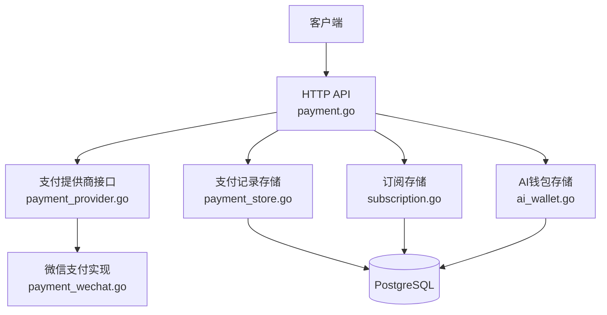
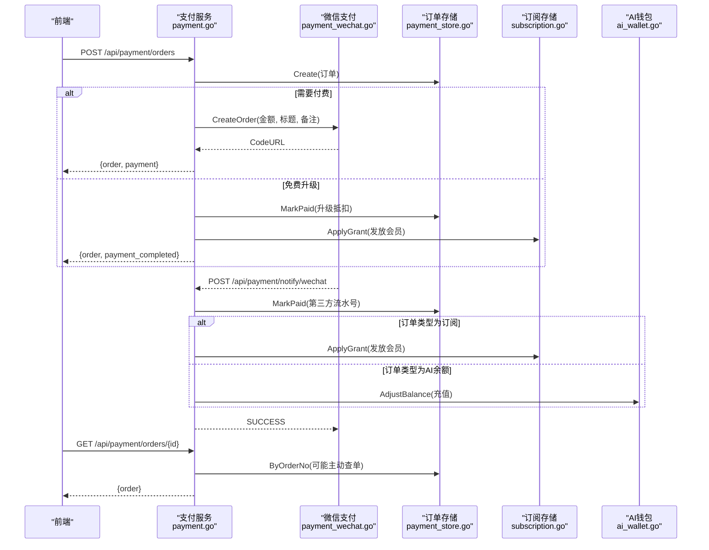
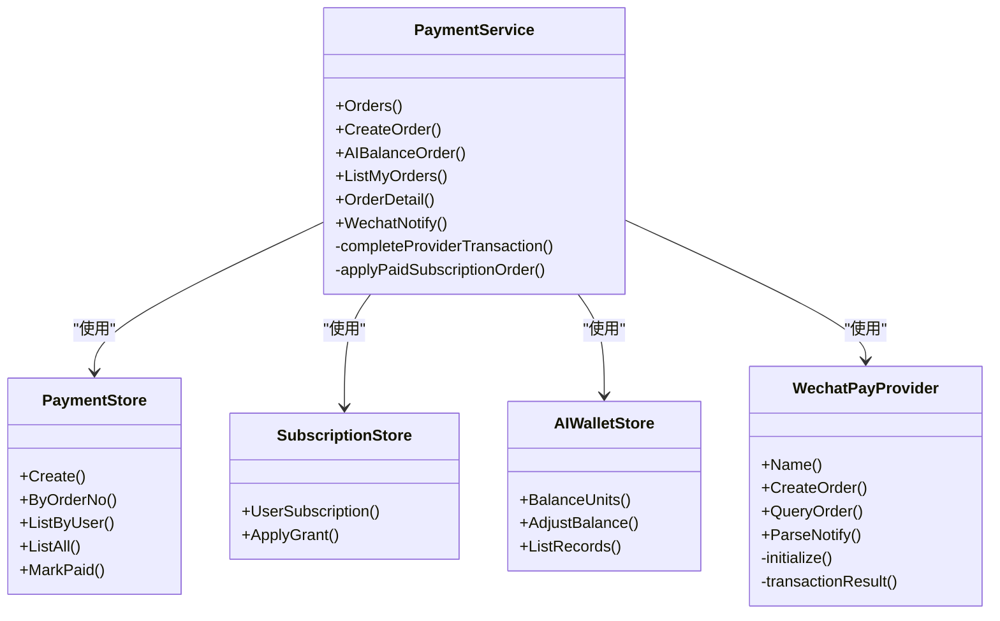

# 支付订阅API

<cite>
**本文引用的文件**
- [payment.go](file://goodhr5/cloud/backend/internal/httpapi/payment.go)
- [payment_wechat.go](file://goodhr5/cloud/backend/internal/httpapi/payment_wechat.go)
- [payment_store.go](file://goodhr5/cloud/backend/internal/httpapi/payment_store.go)
- [payment_provider.go](file://goodhr5/cloud/backend/internal/httpapi/payment_provider.go)
- [ai_wallet.go](file://goodhr5/cloud/backend/internal/httpapi/ai_wallet.go)
- [subscription.go](file://goodhr5/cloud/backend/internal/httpapi/subscription.go)
- [subscription_policy.go](file://goodhr5/cloud/backend/internal/httpapi/subscription_policy.go)
- [0023_payment_orders.sql](file://goodhr5/cloud/backend/db/migrations/0023_payment_orders.sql)
- [0068_subscription_tiers.sql](file://goodhr5/cloud/backend/db/migrations/0068_subscription_tiers.sql)
- [0074_wechat_payment_provider.sql](file://goodhr5/cloud/backend/db/migrations/0074_wechat_payment_provider.sql)
- [0075_system_payment_wechat.sql](file://goodhr5/cloud/backend/db/migrations/0075_system_payment_wechat.sql)
</cite>

## 目录
1. [简介](#简介)
2. [项目结构](#项目结构)
3. [核心组件](#核心组件)
4. [架构总览](#架构总览)
5. [详细接口说明](#详细接口说明)
6. [依赖关系分析](#依赖关系分析)
7. [性能与可靠性](#性能与可靠性)
8. [故障排查指南](#故障排查指南)
9. [结论](#结论)
10. [附录：前端调用最佳实践与安全注意事项](#附录前端调用最佳实践与安全注意事项)

## 简介
本文件为“支付订阅API”的完整接口文档，覆盖微信支付集成、订单管理、订阅套餐控制、AI余额充值等能力。重点说明以下接口：
- /api/payment/orders（创建订阅订单或列出订单）
- /api/payment/ai-balance（AI余额充值订单）
- /api/payment/orders/{id}（订单详情）
- /api/payment/notify/wechat（微信支付回调通知）

同时给出支付流程、订单状态管理、订阅权益分配、微信签名验证与异步通知处理、退款策略建议，以及前端调用最佳实践和安全注意事项。

## 项目结构
后端支付相关代码集中在 HTTP API 层，采用“服务 + 存储抽象 + 支付提供商插件”的分层设计：
- 支付服务：统一编排订单创建、查询、回调处理、权益发放。
- 支付提供商：以接口形式接入微信支付，支持未来扩展其他支付方式。
- 存储抽象：内存与PostgreSQL双实现，持久化支付订单与AI钱包流水。
- 订阅策略：从系统配置加载套餐，计算购买报价、升级抵扣、会员权限。
- 数据库迁移：定义支付订单表、订阅等级、微信支付配置等。

**图表来源**
- [payment.go:67-189](file://goodhr5/cloud/backend/internal/httpapi/payment.go#L67-L189)
- [payment_provider.go:10-44](file://goodhr5/cloud/backend/internal/httpapi/payment_provider.go#L10-L44)
- [payment_wechat.go:69-137](file://goodhr5/cloud/backend/internal/httpapi/payment_wechat.go#L69-L137)
- [payment_store.go:13-50](file://goodhr5/cloud/backend/internal/httpapi/payment_store.go#L13-L50)
- [subscription.go:18-48](file://goodhr5/cloud/backend/internal/httpapi/subscription.go#L18-L48)
- [ai_wallet.go:33-58](file://goodhr5/cloud/backend/internal/httpapi/ai_wallet.go#L33-L58)

**章节来源**
- [payment.go:67-189](file://goodhr5/cloud/backend/internal/httpapi/payment.go#L67-L189)
- [payment_store.go:13-50](file://goodhr5/cloud/backend/internal/httpapi/payment_store.go#L13-L50)
- [payment_provider.go:10-44](file://goodhr5/cloud/backend/internal/httpapi/payment_provider.go#L10-L44)
- [payment_wechat.go:69-137](file://goodhr5/cloud/backend/internal/httpapi/payment_wechat.go#L69-L137)
- [subscription.go:18-48](file://goodhr5/cloud/backend/internal/httpapi/subscription.go#L18-L48)
- [ai_wallet.go:33-58](file://goodhr5/cloud/backend/internal/httpapi/ai_wallet.go#L33-L58)

## 核心组件
- 支付服务（PaymentService）：负责创建订阅订单、AI余额充值订单、订单列表与详情、微信回调处理、完成交易后的权益发放。
- 微信支付提供商（WechatPayProvider）：封装V3 Native下单、主动查单、回调验签解密，参数来自系统配置。
- 支付存储（PaymentStore）：内存与PostgreSQL实现，提供订单CRUD与MarkPaid幂等更新。
- 订阅存储（SubscriptionStore）：读取/发放会员权益，支持幂等发放与到期时间计算。
- AI钱包（AIWalletStore）：充值、扣费、流水记录，单位换算与防重放。
- 订阅策略（subscription_policy）：解析套餐配置、计算购买报价、升级抵扣、会员权限。

**章节来源**
- [payment.go:34-65](file://goodhr5/cloud/backend/internal/httpapi/payment.go#L34-L65)
- [payment_wechat.go:51-67](file://goodhr5/cloud/backend/internal/httpapi/payment_wechat.go#L51-L67)
- [payment_store.go:13-50](file://goodhr5/cloud/backend/internal/httpapi/payment_store.go#L13-L50)
- [subscription.go:18-48](file://goodhr5/cloud/backend/internal/httpapi/subscription.go#L18-L48)
- [ai_wallet.go:33-58](file://goodhr5/cloud/backend/internal/httpapi/ai_wallet.go#L33-L58)
- [subscription_policy.go:18-43](file://goodhr5/cloud/backend/internal/httpapi/subscription_policy.go#L18-L43)

## 架构总览
支付订阅的整体流程如下：
- 前端请求创建订单，服务端校验用户会话、加载套餐并计算报价，写入本地订单。
- 若需付费，调用微信支付Native下单，返回二维码链接；否则直接标记已支付（如升级抵扣）。
- 微信异步回调至服务端，进行签名验证与解密，转换为统一交易结果。
- 完成交易后，根据订单类型发放订阅权益或AI余额，并发送通知邮件。
- 前端可轮询订单详情，或在回调成功后刷新状态。

**图表来源**
- [payment.go:79-189](file://goodhr5/cloud/backend/internal/httpapi/payment.go#L79-L189)
- [payment.go:191-259](file://goodhr5/cloud/backend/internal/httpapi/payment.go#L191-L259)
- [payment.go:341-405](file://goodhr5/cloud/backend/internal/httpapi/payment.go#L341-L405)
- [payment_wechat.go:69-137](file://goodhr5/cloud/backend/internal/httpapi/payment_wechat.go#L69-L137)
- [payment_store.go:147-257](file://goodhr5/cloud/backend/internal/httpapi/payment_store.go#L147-L257)
- [subscription.go:401-459](file://goodhr5/cloud/backend/internal/httpapi/subscription.go#L401-L459)
- [ai_wallet.go:589-634](file://goodhr5/cloud/backend/internal/httpapi/ai_wallet.go#L589-L634)

## 详细接口说明

### 通用约定
- 认证：除微信回调外，所有接口均需携带有效会话（通过鉴权中间件获取用户邮箱）。
- 金额单位：内部使用“分”，对外响应字段包含元字符串以便前端展示。
- 幂等性：订单号唯一，支付回调与权益发放均具备幂等保护。
- 错误码：业务错误返回对应HTTP状态码与中文消息，便于前端提示。

### 创建订阅订单：POST /api/payment/orders
- 功能：为当前用户创建订阅支付订单；GET方法用于列出当前用户的支付记录。
- 请求体（POST）：
  - plan_id：字符串，必填，表示目标套餐ID。
- 响应体（POST）：
  - ok：布尔
  - order：订单对象（见下方订单字段）
  - payment：支付信息（provider、order_no、code_url）
  - 若为免费升级（金额为0），额外返回 payment_completed=true 并直接完成订单。
- 业务逻辑要点：
  - 校验会话与plan_id，加载套餐并计算报价（含升级抵扣）。
  - 创建本地订单，状态为pending，过期时间为30分钟。
  - 若金额为0，直接标记已支付并应用会员权益。
  - 否则调用微信支付Native下单，返回二维码链接。
- 错误场景：
  - 未登录、非法JSON、套餐不存在、套餐价格配置错误、支付提供商未配置、创建订单失败。

**章节来源**
- [payment.go:67-189](file://goodhr5/cloud/backend/internal/httpapi/payment.go#L67-L189)
- [subscription_policy.go:45-108](file://goodhr5/cloud/backend/internal/httpapi/subscription_policy.go#L45-L108)
- [0068_subscription_tiers.sql:55-103](file://goodhr5/cloud/backend/db/migrations/0068_subscription_tiers.sql#L55-L103)

### AI余额充值订单：POST /api/payment/ai-balance
- 功能：为当前用户创建AI余额充值订单。
- 请求体：
  - amount_cents：整数，可选，充值金额（分）
  - amount_yuan：字符串，可选，充值金额（元文本）
  - 二者至少提供一个；默认值由系统常量决定；范围限制在1元到1000元之间。
- 响应体：
  - ok：布尔
  - order：订单对象
  - payment：支付信息（provider、order_no、code_url）
- 业务逻辑要点：
  - 校验会话与金额，创建本地订单（order_type=ai_balance），状态pending，过期30分钟。
  - 调用微信支付Native下单，返回二维码链接。
  - 支付成功后，将金额转换为AI钱包单位并充值，写入流水。

**章节来源**
- [payment.go:191-259](file://goodhr5/cloud/backend/internal/httpapi/payment.go#L191-L259)
- [payment_provider.go:51-69](file://goodhr5/cloud/backend/internal/httpapi/payment_provider.go#L51-L69)
- [ai_wallet.go:589-634](file://goodhr5/cloud/backend/internal/httpapi/ai_wallet.go#L589-L634)

### 订单详情：GET /api/payment/orders/{id}
- 功能：查看指定订单详情，仅允许本人或超级管理员访问。
- 路径参数：
  - id：订单号（order_no）
- 响应体：
  - ok：布尔
  - order：订单对象
- 业务逻辑要点：
  - 校验会话与权限。
  - 若订单仍为pending且未过期，会主动查询第三方支付状态，若已支付则完成到账处理。
  - 返回脱敏后的订单信息。

**章节来源**
- [payment.go:295-339](file://goodhr5/cloud/backend/internal/httpapi/payment.go#L295-L339)

### 微信支付回调通知：POST /api/payment/notify/wechat
- 功能：接收微信支付异步通知，完成验签、解密、交易结果转换与到账处理。
- 请求体：微信支付V3回调报文（由SDK解析）。
- 响应体：必须返回微信要求的成功格式（SUCCESS）或失败格式（FAIL）。
- 业务逻辑要点：
  - 校验请求方法与支付提供商配置。
  - 使用SDK进行验签与解密，转换为统一交易结果。
  - 校验订单归属、金额、币种、交易类型等。
  - 标记订单为已支付，并根据订单类型发放权益或充值AI余额。
  - 返回SUCCESS给微信，避免重复回调。

**章节来源**
- [payment.go:341-405](file://goodhr5/cloud/backend/internal/httpapi/payment.go#L341-L405)
- [payment_wechat.go:119-137](file://goodhr5/cloud/backend/internal/httpapi/payment_wechat.go#L119-L137)
- [payment_wechat.go:253-283](file://goodhr5/cloud/backend/internal/httpapi/payment_wechat.go#L253-L283)

### 订单数据模型
- 关键字段：
  - id：主键
  - order_no：系统生成的订单号（唯一）
  - order_type：订单类型（subscription或ai_balance）
  - user_email：购买者邮箱
  - plan_id/plan_name：套餐标识与名称
  - member_type：会员类型（free/plus/pro）
  - duration_days：增加的天数
  - original_amount_cents/discount_amount_cents/amount_cents：原价、优惠、实付（分）
  - upgrade_from_member_type/upgrade_credit_cents：升级来源与抵扣金额
  - payment_provider：支付平台标识（wechat）
  - trade_no：第三方支付流水号
  - status：pending/paid/closed
  - paid_at/expired_at：支付时间与过期时间
  - notify_data：回调原始数据（JSONB）
  - created_at/updated_at：时间戳

**章节来源**
- [payment_store.go:13-36](file://goodhr5/cloud/backend/internal/httpapi/payment_store.go#L13-L36)
- [0023_payment_orders.sql:1-48](file://goodhr5/cloud/backend/db/migrations/0023_payment_orders.sql#L1-L48)
- [0068_subscription_tiers.sql:20-25](file://goodhr5/cloud/backend/db/migrations/0068_subscription_tiers.sql#L20-L25)
- [0074_wechat_payment_provider.sql:1-6](file://goodhr5/cloud/backend/db/migrations/0074_wechat_payment_provider.sql#L1-L6)

### 订阅套餐与权益
- 套餐来源：系统配置system.subscription_plans，包含免费版、Plus包月、Pro包年。
- 权益发放：按订单号与权益类型幂等发放，支持从当前时间重新计算到期时间。
- 升级抵扣：有效Plus升级Pro时，按剩余时间折算抵扣金额；Pro降级到Plus不享受抵扣。
- 邀请奖励：被邀请用户支付成功后，邀请人获得按月计算的会员天数奖励。

**章节来源**
- [subscription_policy.go:45-108](file://goodhr5/cloud/backend/internal/httpapi/subscription_policy.go#L45-L108)
- [subscription.go:401-459](file://goodhr5/cloud/backend/internal/httpapi/subscription.go#L401-L459)
- [payment.go:407-485](file://goodhr5/cloud/backend/internal/httpapi/payment.go#L407-L485)
- [0068_subscription_tiers.sql:55-103](file://goodhr5/cloud/backend/db/migrations/0068_subscription_tiers.sql#L55-L103)

### 微信支付配置
- 配置键：system.payment_wechat
- 字段：app_id、mch_id、merchant_serial_no、private_key_base64、api_v3_key、public_key_id、public_key_base64、notify_url
- 行为：每次请求前从系统配置读取，变化时自动重建SDK客户端，修改后立即生效。
- 安全：私钥与公钥支持Base64或直接PEM文本；回调地址需公网可达。

**章节来源**
- [payment_wechat.go:32-42](file://goodhr5/cloud/backend/internal/httpapi/payment_wechat.go#L32-L42)
- [payment_wechat.go:139-179](file://goodhr5/cloud/backend/internal/httpapi/payment_wechat.go#L139-L179)
- [payment_wechat.go:195-251](file://goodhr5/cloud/backend/internal/httpapi/payment_wechat.go#L195-L251)
- [0075_system_payment_wechat.sql:1-19](file://goodhr5/cloud/backend/db/migrations/0075_system_payment_wechat.sql#L1-L19)

## 依赖关系分析
- 支付服务依赖：
  - 鉴权服务：获取会话与用户邮箱。
  - 订单存储：创建、查询、标记已支付。
  - 订阅存储：发放会员权益。
  - AI钱包存储：充值AI余额。
  - 支付提供商：微信支付实现。
- 微信支付提供商依赖：
  - 系统配置存储：读取商户配置。
  - 微信官方SDK：下单、查单、回调验签。
- 数据存储依赖：
  - PostgreSQL：支付订单表、订阅信息、AI余额流水。

**图表来源**
- [payment.go:34-65](file://goodhr5/cloud/backend/internal/httpapi/payment.go#L34-L65)
- [payment_wechat.go:51-67](file://goodhr5/cloud/backend/internal/httpapi/payment_wechat.go#L51-L67)
- [payment_store.go:38-50](file://goodhr5/cloud/backend/internal/httpapi/payment_store.go#L38-L50)
- [subscription.go:34-48](file://goodhr5/cloud/backend/internal/httpapi/subscription.go#L34-L48)
- [ai_wallet.go:48-58](file://goodhr5/cloud/backend/internal/httpapi/ai_wallet.go#L48-L58)

**章节来源**
- [payment.go:34-65](file://goodhr5/cloud/backend/internal/httpapi/payment.go#L34-L65)
- [payment_wechat.go:51-67](file://goodhr5/cloud/backend/internal/httpapi/payment_wechat.go#L51-L67)
- [payment_store.go:38-50](file://goodhr5/cloud/backend/internal/httpapi/payment_store.go#L38-L50)
- [subscription.go:34-48](file://goodhr5/cloud/backend/internal/httpapi/subscription.go#L34-L48)
- [ai_wallet.go:48-58](file://goodhr5/cloud/backend/internal/httpapi/ai_wallet.go#L48-L58)

## 性能与可靠性
- 幂等性：
  - 订单号唯一，MarkPaid对重复回调安全。
  - 订阅权益发放基于订单号与权益类型的联合幂等键。
- 并发安全：
  - 内存存储使用互斥锁保护。
  - PostgreSQL实现使用事务与FOR UPDATE保证一致性。
- 超时与重试：
  - 订单过期时间30分钟，前端应在过期前引导支付。
  - 微信回调可能重复，服务端需幂等处理。
- 可扩展性：
  - 支付提供商接口抽象，便于接入新支付方式。
  - 系统配置驱动微信支付参数，热更新无需重启。

**章节来源**
- [payment_store.go:113-135](file://goodhr5/cloud/backend/internal/httpapi/payment_store.go#L113-L135)
- [payment_store.go:233-257](file://goodhr5/cloud/backend/internal/httpapi/payment_store.go#L233-L257)
- [subscription.go:401-459](file://goodhr5/cloud/backend/internal/httpapi/subscription.go#L401-L459)
- [payment_wechat.go:195-251](file://goodhr5/cloud/backend/internal/httpapi/payment_wechat.go#L195-L251)

## 故障排查指南
- 常见错误：
  - 会话无效或过期：检查登录态与Token。
  - 套餐不存在或配置错误：检查system.subscription_plans。
  - 支付提供商未配置：检查system.payment_wechat是否填写完整。
  - 回调验签失败：确认APIv3密钥与公钥配置正确。
  - 金额不匹配：核对订单金额与回调金额一致。
- 日志定位：
  - 主动查单失败与到账处理失败会记录日志，便于排查网络或配置问题。
  - 回调处理失败返回FAIL，微信会重试，需确保幂等与错误恢复。

**章节来源**
- [payment.go:80-189](file://goodhr5/cloud/backend/internal/httpapi/payment.go#L80-L189)
- [payment.go:341-362](file://goodhr5/cloud/backend/internal/httpapi/payment.go#L341-L362)
- [payment_wechat.go:139-179](file://goodhr5/cloud/backend/internal/httpapi/payment_wechat.go#L139-L179)
- [payment_wechat.go:253-283](file://goodhr5/cloud/backend/internal/httpapi/payment_wechat.go#L253-L283)

## 结论
本支付订阅API通过清晰的分层设计与幂等机制，实现了安全的微信支付集成、灵活的订阅套餐控制与AI余额充值。系统支持热更新配置、主动查单与回调幂等，具备良好的可靠性与可扩展性。建议在生产环境严格校验配置、完善监控告警与审计日志，并遵循前端最佳实践确保安全与用户体验。

## 附录：前端调用最佳实践与安全注意事项
- 前端调用流程：
  - 创建订单：POST /api/payment/orders，传入plan_id。
  - 展示二维码：使用返回的code_url生成二维码供用户扫码支付。
  - 轮询订单状态：GET /api/payment/orders/{id}，直到status=paid或过期。
  - AI余额充值：POST /api/payment/ai-balance，传入amount_cents或amount_yuan。
- 安全注意事项：
  - 所有非回调接口必须携带有效会话。
  - 不要信任前端金额，服务端以订单为准。
  - 回调接口仅接受微信支付来源，并进行签名验证。
  - 防止重放攻击：服务端幂等处理，订单号唯一。
- 退款流程建议：
  - 当前代码未实现退款接口，建议在支付提供商层新增退款能力，并在订单表增加退款字段与状态。
  - 退款需人工审核或自动化规则，记录退款原因与流水，保持财务对账一致。

**章节来源**
- [payment.go:67-189](file://goodhr5/cloud/backend/internal/httpapi/payment.go#L67-L189)
- [payment.go:191-259](file://goodhr5/cloud/backend/internal/httpapi/payment.go#L191-L259)
- [payment.go:295-339](file://goodhr5/cloud/backend/internal/httpapi/payment.go#L295-L339)
- [payment_wechat.go:119-137](file://goodhr5/cloud/backend/internal/httpapi/payment_wechat.go#L119-L137)