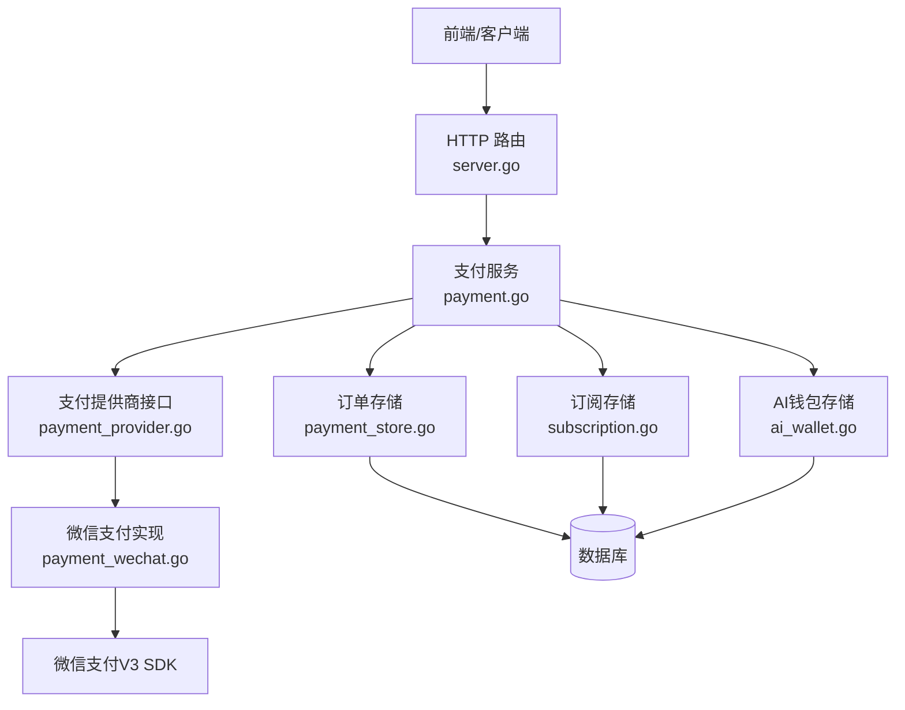
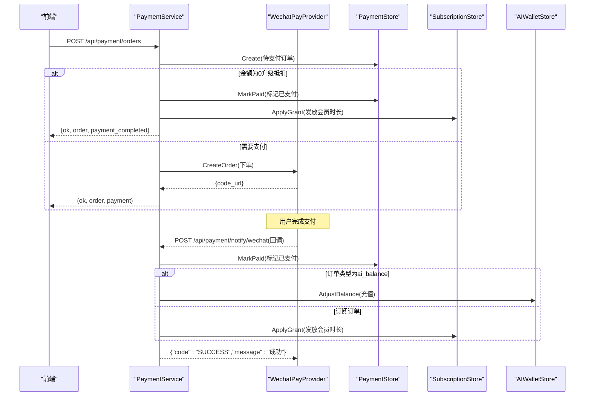
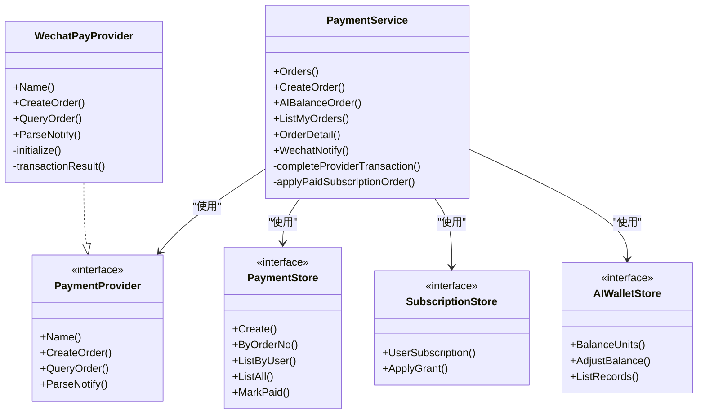

# 支付订阅API

<cite>
**本文引用的文件**
- [payment.go](file://goodhr5/cloud/backend/internal/httpapi/payment.go)
- [payment_wechat.go](file://goodhr5/cloud/backend/internal/httpapi/payment_wechat.go)
- [payment_store.go](file://goodhr5/cloud/backend/internal/httpapi/payment_store.go)
- [payment_provider.go](file://goodhr5/cloud/backend/internal/httpapi/payment_provider.go)
- [ai_wallet.go](file://goodhr5/cloud/backend/internal/httpapi/ai_wallet.go)
- [subscription.go](file://goodhr5/cloud/backend/internal/httpapi/subscription.go)
- [subscription_policy.go](file://goodhr5/cloud/backend/internal/httpapi/subscription_policy.go)
- [server.go](file://goodhr5/cloud/backend/internal/httpapi/server.go)
</cite>

## 目录
1. [简介](#简介)
2. [项目结构](#项目结构)
3. [核心组件](#核心组件)
4. [架构总览](#架构总览)
5. [详细接口说明](#详细接口说明)
6. [依赖关系分析](#依赖关系分析)
7. [性能与可靠性](#性能与可靠性)
8. [故障排查指南](#故障排查指南)
9. [结论](#结论)
10. [附录：前端调用与安全建议](#附录前端调用与安全建议)

## 简介
本文件为 GoodHR 云端后端的“支付订阅”能力提供完整接口文档，覆盖微信支付集成、订单管理、订阅套餐控制、AI余额充值等。重点包括：
- 创建订阅订单、查询订单详情、列出用户订单
- AI余额充值订单
- 微信支付回调通知处理（签名验证、解密、幂等到账）
- 订阅权益发放与邀请奖励
- 退款流程说明（当前实现未包含退款）

## 项目结构
支付相关代码位于后端 HTTP API 层，采用服务+存储+提供商的解耦设计：
- 路由注册：server.go
- 业务编排：payment.go
- 第三方支付抽象与微信实现：payment_provider.go、payment_wechat.go
- 订单持久化：payment_store.go（内存/PostgreSQL）
- 订阅状态与套餐策略：subscription.go、subscription_policy.go
- AI钱包与充值到账：ai_wallet.go

图表来源
- [server.go:153-157](file://goodhr5/cloud/backend/internal/httpapi/server.go#L153-L157)
- [payment.go:35-65](file://goodhr5/cloud/backend/internal/httpapi/payment.go#L35-L65)
- [payment_provider.go:10-44](file://goodhr5/cloud/backend/internal/httpapi/payment_provider.go#L10-L44)
- [payment_wechat.go:51-137](file://goodhr5/cloud/backend/internal/httpapi/payment_wechat.go#L51-L137)
- [payment_store.go:13-50](file://goodhr5/cloud/backend/internal/httpapi/payment_store.go#L13-L50)
- [subscription.go:18-48](file://goodhr5/cloud/backend/internal/httpapi/subscription.go#L18-L48)
- [ai_wallet.go:33-58](file://goodhr5/cloud/backend/internal/httpapi/ai_wallet.go#L33-L58)

章节来源
- [server.go:153-157](file://goodhr5/cloud/backend/internal/httpapi/server.go#L153-L157)

## 核心组件
- PaymentService：统一编排创建订单、查询订单、列表、微信回调、到账处理、订阅权益发放、邀请奖励、AI余额充值到账。
- PaymentProvider 接口与 WechatPayProvider 实现：封装第三方下单、查单、回调解析；微信支付配置从系统配置表读取并动态重建客户端。
- PaymentStore：订单持久化抽象，支持内存和PostgreSQL两种实现。
- SubscriptionStore：订阅状态与权益发放，支持幂等发放与到期时间计算。
- AIWalletStore：AI余额查询、调整与流水记录，充值到账时写入余额与流水。

章节来源
- [payment.go:35-65](file://goodhr5/cloud/backend/internal/httpapi/payment.go#L35-L65)
- [payment_provider.go:10-44](file://goodhr5/cloud/backend/internal/httpapi/payment_provider.go#L10-L44)
- [payment_wechat.go:51-137](file://goodhr5/cloud/backend/internal/httpapi/payment_wechat.go#L51-L137)
- [payment_store.go:13-50](file://goodhr5/cloud/backend/internal/httpapi/payment_store.go#L13-L50)
- [subscription.go:18-48](file://goodhr5/cloud/backend/internal/httpapi/subscription.go#L18-L48)
- [ai_wallet.go:33-58](file://goodhr5/cloud/backend/internal/httpapi/ai_wallet.go#L33-L58)

## 架构总览
支付订阅的核心流程如下：
- 前端发起创建订单请求，服务端校验会话、加载套餐、计算实付金额、落库待支付订单。
- 若金额为0（升级抵扣），直接标记已支付并应用订阅权益。
- 否则调用第三方支付（默认微信支付）创建预支付订单，返回二维码链接或支付参数。
- 支付成功后，微信支付异步回调至 /api/payment/notify/wechat，服务端验签解密、校验交易归属、更新订单状态并应用权益。
- 订阅权益通过 SubscriptionStore.ApplyGrant 幂等发放，可能触发邮件通知与邀请奖励。
- AI余额充值订单在回调到账后，通过 AIWalletStore.AdjustBalance 增加余额并写流水。

图表来源
- [payment.go:79-189](file://goodhr5/cloud/backend/internal/httpapi/payment.go#L79-L189)
- [payment.go:191-259](file://goodhr5/cloud/backend/internal/httpapi/payment.go#L191-L259)
- [payment.go:341-405](file://goodhr5/cloud/backend/internal/httpapi/payment.go#L341-L405)
- [payment_wechat.go:69-137](file://goodhr5/cloud/backend/internal/httpapi/payment_wechat.go#L69-L137)

## 详细接口说明

### 通用约定
- 认证：除微信回调外，所有接口需携带有效会话（Cookie/Session）。
- 响应格式：统一 JSON，错误响应包含 ok=false 与 error 字段；成功响应包含 ok=true 与业务数据。
- 金额单位：订单金额以“分”为单位，部分接口同时返回“元”字符串便于前端展示。

### 创建订阅订单
- 路径：POST /api/payment/orders
- 鉴权：需要登录会话
- 请求体：
  - plan_id: string，必填，对应系统配置的订阅套餐ID
- 处理逻辑：
  - 校验会话与套餐存在性
  - 计算实际应付金额（含升级抵扣）
  - 生成订单号、过期时间（30分钟）、保存待支付订单
  - 若金额为0，直接标记已支付并应用订阅权益
  - 否则调用微信支付创建预支付订单，返回 code_url
- 响应：
  - 成功：{ok:true, order:{...}, payment:{provider,order_no,code_url}}
  - 失败：{ok:false, error:"..."}

章节来源
- [payment.go:79-189](file://goodhr5/cloud/backend/internal/httpapi/payment.go#L79-L189)
- [server.go:153](file://goodhr5/cloud/backend/internal/httpapi/server.go#L153)

### AI余额充值订单
- 路径：POST /api/payment/ai-balance
- 鉴权：需要登录会话
- 请求体：
  - amount_cents: int，可选，充值金额（分）
  - amount_yuan: string，可选，充值金额（元文本）
- 处理逻辑：
  - 校验会话与金额范围（1元到1000元）
  - 生成订单号、过期时间（30分钟）、保存待支付订单
  - 调用微信支付创建预支付订单
- 响应：
  - 成功：{ok:true, order:{...}, payment:{...}}
  - 失败：{ok:false, error:"..."}

章节来源
- [payment.go:191-259](file://goodhr5/cloud/backend/internal/httpapi/payment.go#L191-L259)
- [server.go:154](file://goodhr5/cloud/backend/internal/httpapi/server.go#L154)

### 订单详情
- 路径：GET /api/payment/orders/{id}
- 鉴权：需要登录会话（仅能查看自己的订单，超级管理员可查看所有）
- 处理逻辑：
  - 按订单号查询订单
  - 若订单仍为待支付且在有效期内，主动查询第三方支付状态，若已支付则完成到账处理
- 响应：
  - 成功：{ok:true, order:{...}}
  - 失败：{ok:false, error:"..."}

章节来源
- [payment.go:295-339](file://goodhr5/cloud/backend/internal/httpapi/payment.go#L295-L339)
- [server.go:155](file://goodhr5/cloud/backend/internal/httpapi/server.go#L155)

### 列出我的订单
- 路径：GET /api/payment/orders
- 鉴权：需要登录会话
- 响应：{ok:true, orders:[...]}

章节来源
- [payment.go:261-274](file://goodhr5/cloud/backend/internal/httpapi/payment.go#L261-L274)
- [server.go:153](file://goodhr5/cloud/backend/internal/httpapi/server.go#L153)

### 列出全部订单（管理员）
- 路径：GET /api/admin/payment/orders
- 鉴权：需要超级管理员会话
- 响应：{ok:true, orders:[...]}

章节来源
- [payment.go:276-293](file://goodhr5/cloud/backend/internal/httpapi/payment.go#L276-L293)
- [server.go:157](file://goodhr5/cloud/backend/internal/httpapi/server.go#L157)

### 微信支付回调通知
- 路径：POST /api/payment/notify/wechat
- 鉴权：无需登录（由微信支付回调）
- 处理逻辑：
  - 使用微信支付公钥与APIv3密钥进行签名验证与内容解密
  - 校验交易归属（APPID、商户号、币种、交易类型）
  - 将订单标记为已支付，并应用到账业务（订阅权益或AI余额充值）
  - 返回微信要求的应答格式
- 响应：
  - 成功：{"code":"SUCCESS","message":"成功"}
  - 失败：{"code":"FAIL","message":"..."}

章节来源
- [payment.go:341-362](file://goodhr5/cloud/backend/internal/httpapi/payment.go#L341-L362)
- [payment_wechat.go:119-137](file://goodhr5/cloud/backend/internal/httpapi/payment_wechat.go#L119-L137)
- [server.go:156](file://goodhr5/cloud/backend/internal/httpapi/server.go#L156)

### 订阅套餐与状态
- 获取套餐列表：GET /api/subscription/plans
- 获取当前用户订阅状态：GET /api/subscription/status
- 权益发放：通过 SubscriptionStore.ApplyGrant 幂等发放，支持从当前时间替换或叠加到期时间

章节来源
- [subscription.go:62-119](file://goodhr5/cloud/backend/internal/httpapi/subscription.go#L62-L119)
- [subscription_policy.go:45-157](file://goodhr5/cloud/backend/internal/httpapi/subscription_policy.go#L45-L157)

## 依赖关系分析
- PaymentService 依赖：
  - AuthService：会话校验
  - PaymentStore：订单持久化
  - SubscriptionStore：订阅权益发放
  - SystemConfigStore：读取套餐与微信支付配置
  - InvitationStore：邀请奖励
  - Mailer：发送会员变动通知
  - AIWalletStore：AI余额充值到账
  - PaymentProvider：第三方支付能力（默认 wechat）

- WechatPayProvider 依赖：
  - SystemConfigStore：读取微信支付配置（app_id、mch_id、证书、回调地址等）
  - 微信支付 V3 SDK：下单、查单、回调验签解密

- 数据存储：
  - 订单：memory 或 PostgreSQL
  - 订阅：memory 或 PostgreSQL
  - AI余额：memory 或 PostgreSQL

图表来源
- [payment.go:35-65](file://goodhr5/cloud/backend/internal/httpapi/payment.go#L35-L65)
- [payment_provider.go:10-44](file://goodhr5/cloud/backend/internal/httpapi/payment_provider.go#L10-L44)
- [payment_wechat.go:51-137](file://goodhr5/cloud/backend/internal/httpapi/payment_wechat.go#L51-L137)
- [payment_store.go:13-50](file://goodhr5/cloud/backend/internal/httpapi/payment_store.go#L13-L50)
- [subscription.go:18-48](file://goodhr5/cloud/backend/internal/httpapi/subscription.go#L18-L48)
- [ai_wallet.go:33-58](file://goodhr5/cloud/backend/internal/httpapi/ai_wallet.go#L33-L58)

## 性能与可靠性
- 幂等性：
  - 订单标记已支付使用乐观条件更新（status='pending'），避免重复到账
  - 订阅权益发放通过订单号+权益类型去重，确保幂等
- 重试与容错：
  - 微信回调失败返回 FAIL，微信会重试；服务端日志记录错误以便排查
  - 主动查单：订单详情页在待支付且有效期内会主动查询第三方状态并补发权益
- 配置热更新：
  - 微信支付配置变化时自动重建SDK客户端，修改后立即生效
- 并发安全：
  - 内存存储使用互斥锁保护
  - PostgreSQL 使用事务与行级锁保证一致性

章节来源
- [payment_store.go:233-257](file://goodhr5/cloud/backend/internal/httpapi/payment_store.go#L233-L257)
- [subscription.go:401-459](file://goodhr5/cloud/backend/internal/httpapi/subscription.go#L401-L459)
- [payment_wechat.go:195-251](file://goodhr5/cloud/backend/internal/httpapi/payment_wechat.go#L195-L251)

## 故障排查指南
- 常见错误与定位：
  - 会话无效或过期：检查 Cookie/Session 是否有效
  - 套餐不存在或配置无效：检查 system.subscription_plans 配置
  - 微信支付配置缺失：检查 system.payment_wechat 配置项是否齐全
  - 回调验签失败：检查 APIv3 密钥与公钥是否正确
  - 金额不匹配：核对订单金额与回调金额是否一致
  - 订单状态非 pending：确认是否存在重复回调或并发问题
- 日志关键字：
  - “[支付] 微信回调处理失败”
  - “[支付] 主动查单失败”
  - “[支付] 主动查单到账处理失败”
  - “[支付] 会员已到账，但通知邮件发送失败”
  - “[支付] 邀请奖励已到账，但通知邮件发送失败”

章节来源
- [payment.go:324-337](file://goodhr5/cloud/backend/internal/httpapi/payment.go#L324-L337)
- [payment.go:341-362](file://goodhr5/cloud/backend/internal/httpapi/payment.go#L341-L362)
- [payment.go:407-485](file://goodhr5/cloud/backend/internal/httpapi/payment.go#L407-L485)

## 结论
该支付订阅模块通过清晰的职责划分与可扩展的提供商模式，实现了订阅订单创建、微信支付集成、回调验签到账、订阅权益发放与AI余额充值的完整闭环。系统具备幂等、重试、配置热更新与多存储实现等特性，适合在生产环境稳定运行。

## 附录：前端调用与安全建议

### 前端最佳实践
- 创建订单：
  - 调用 POST /api/payment/orders，传入 plan_id
  - 若返回 payment.code_url，使用微信客户端扫码支付
- 查询订单状态：
  - 轮询 GET /api/payment/orders/{id}，直到 status=paid
  - 若仍在有效期内但未收到回调，服务端会在详情接口中主动查单并补发权益
- AI余额充值：
  - 调用 POST /api/payment/ai-balance，传入金额（分或元文本）
  - 支付完成后余额自动到账，可通过 /api/ai-wallet 查询余额与流水

### 安全注意事项
- 所有涉及资金与权益的变更必须基于服务端逻辑，前端不得信任本地状态
- 微信支付回调必须由服务端验签解密后再处理，禁止直接使用前端传参
- 金额比较必须在服务端进行，防止篡改
- 敏感配置（微信支付私钥、公钥、APIv3密钥）应保存在系统配置表中，并通过只读接口供运行时使用
- 退款流程：
  - 当前代码未实现退款接口；如需退款，应在服务端新增独立接口，严格校验订单归属、金额与权限，并记录审计日志

章节来源
- [payment.go:79-189](file://goodhr5/cloud/backend/internal/httpapi/payment.go#L79-L189)
- [payment.go:191-259](file://goodhr5/cloud/backend/internal/httpapi/payment.go#L191-L259)
- [payment.go:295-339](file://goodhr5/cloud/backend/internal/httpapi/payment.go#L295-L339)
- [payment_wechat.go:119-137](file://goodhr5/cloud/backend/internal/httpapi/payment_wechat.go#L119-L137)