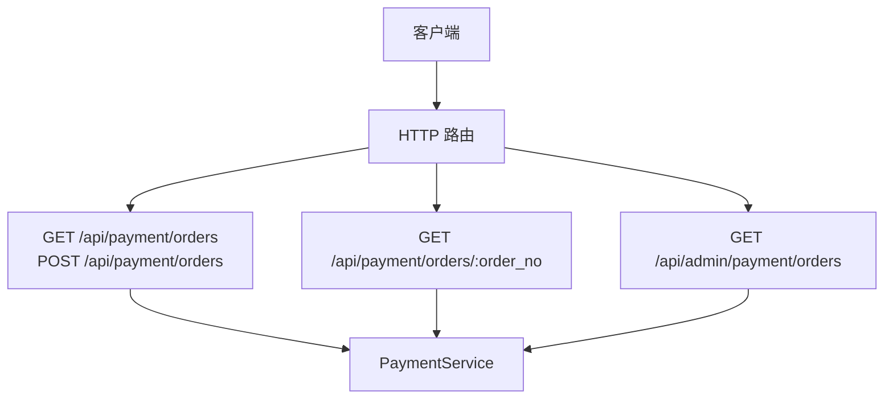
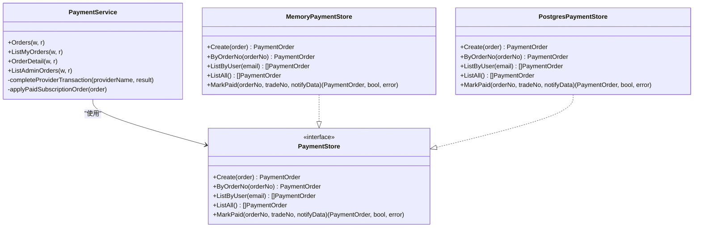
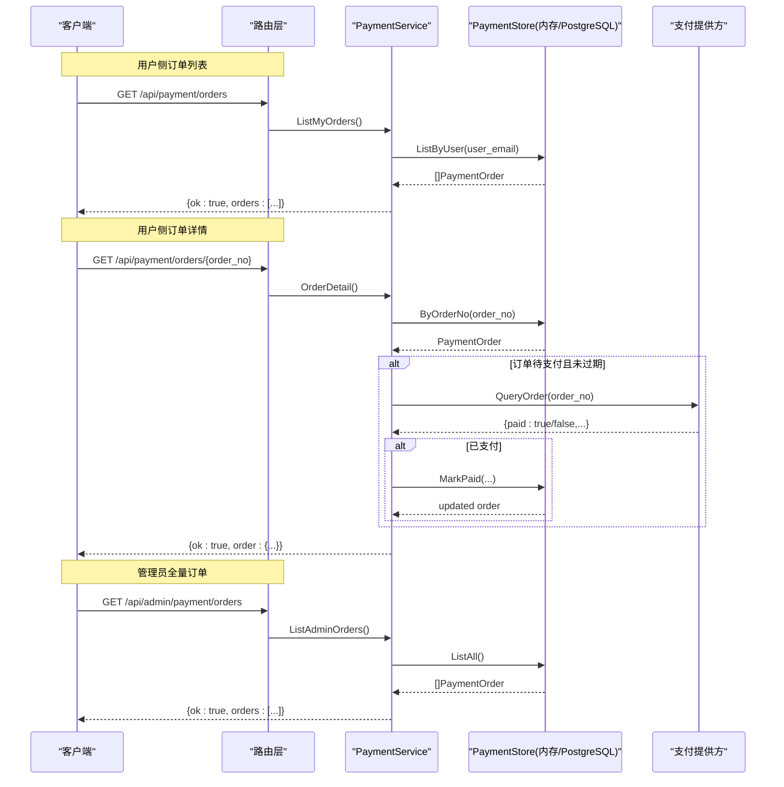
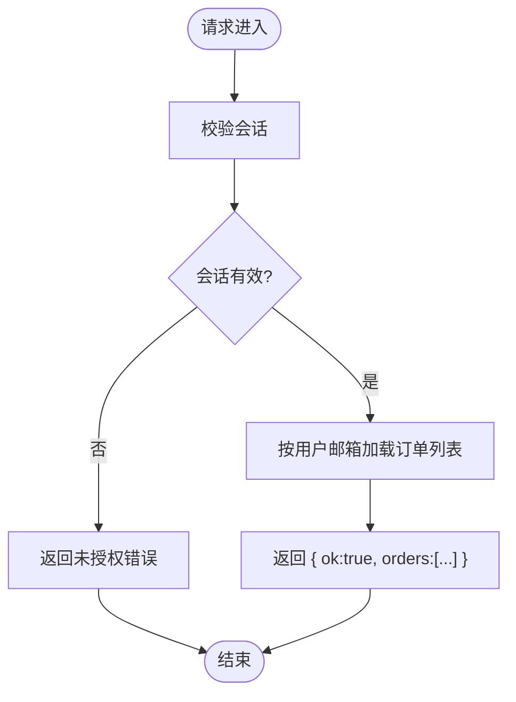
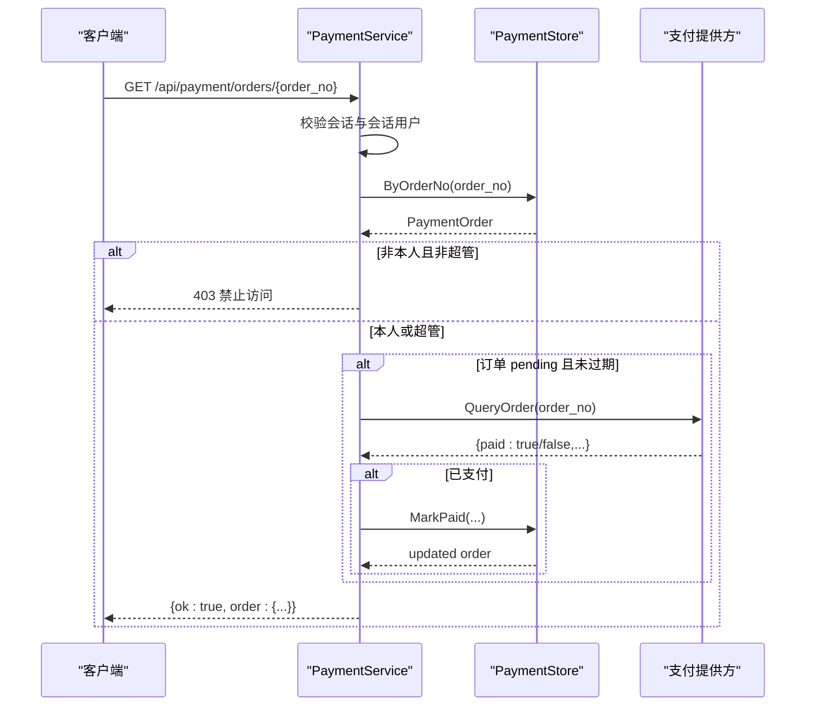
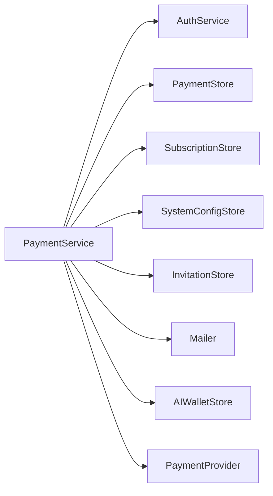

# 订单管理接口

<cite>
**本文引用的文件**   
- [payment.go](file://goodhr5/cloud/backend/internal/httpapi/payment.go)
- [server.go](file://goodhr5/cloud/backend/internal/httpapi/server.go)
- [payment_store.go](file://goodhr5/cloud/backend/internal/httpapi/payment_store.go)
- [0023_payment_orders.sql](file://goodhr5/cloud/backend/db/migrations/0023_payment_orders.sql)
- [payment_test.go](file://goodhr5/cloud/backend/internal/httpapi/payment_test.go)
</cite>

## 目录
1. [简介](#简介)
2. [项目结构与入口](#项目结构与入口)
3. [核心组件](#核心组件)
4. [架构总览](#架构总览)
5. [详细接口说明](#详细接口说明)
6. [依赖关系分析](#依赖关系分析)
7. [性能与扩展性](#性能与扩展性)
8. [故障排查指南](#故障排查指南)
9. [结论](#结论)

## 简介
本文档面向订单管理相关接口的使用者与维护者，重点覆盖以下能力：
- 用户侧订单列表查询：GET /api/payment/orders
- 用户侧订单详情查询：GET /api/payment/orders/{order_no}
- 管理员全量订单查询：GET /api/admin/payment/orders
- 权限控制、数据过滤、响应格式、主动查单机制、订单状态同步等关键实现细节
- 调用示例与常见用法（分页、筛选、排序的当前支持与限制）

## 项目结构与入口
支付与订单相关的 HTTP 路由在服务器启动时注册，统一由 PaymentService 处理。

**图表来源**
- [server.go:167-171](file://goodhr5/cloud/backend/internal/httpapi/server.go#L167-L171)
- [payment.go:67-77](file://goodhr5/cloud/backend/internal/httpapi/payment.go#L67-L77)
- [payment.go:276-293](file://goodhr5/cloud/backend/internal/httpapi/payment.go#L276-L293)

**章节来源**
- [server.go:167-171](file://goodhr5/cloud/backend/internal/httpapi/server.go#L167-L171)

## 核心组件
- PaymentService：封装支付业务逻辑，包括创建订单、查询用户订单、查询订单详情、管理员全量订单、支付回调与到账处理、主动查单等。
- PaymentStore：支付记录持久化抽象，提供内存与 PostgreSQL 两种实现。
- 数据库表 payment_orders：存储订单主数据与状态。

**图表来源**
- [payment.go:34-65](file://goodhr5/cloud/backend/internal/httpapi/payment.go#L34-L65)
- [payment_store.go:13-50](file://goodhr5/cloud/backend/internal/httpapi/payment_store.go#L13-L50)
- [payment_store.go:52-145](file://goodhr5/cloud/backend/internal/httpapi/payment_store.go#L52-L145)
- [payment_store.go:137-257](file://goodhr5/cloud/backend/internal/httpapi/payment_store.go#L137-L257)

**章节来源**
- [payment.go:34-65](file://goodhr5/cloud/backend/internal/httpapi/payment.go#L34-L65)
- [payment_store.go:13-50](file://goodhr5/cloud/backend/internal/httpapi/payment_store.go#L13-L50)

## 架构总览
订单管理接口整体流程如下：
- 用户侧 GET /api/payment/orders：校验会话后返回当前用户的订单列表。
- 用户侧 GET /api/payment/orders/{order_no}：校验会话与权限后返回订单详情；若订单仍为待支付且未过期，会主动调用支付提供方查询并尝试同步状态。
- 管理员侧 GET /api/admin/payment/orders：仅超级管理员可访问，返回系统内全部订单（默认限制条数）。

**图表来源**
- [payment.go:261-293](file://goodhr5/cloud/backend/internal/httpapi/payment.go#L261-L293)
- [payment.go:295-339](file://goodhr5/cloud/backend/internal/httpapi/payment.go#L295-L339)
- [payment_store.go:197-231](file://goodhr5/cloud/backend/internal/httpapi/payment_store.go#L197-L231)

## 详细接口说明

### 用户订单列表查询：GET /api/payment/orders
- 功能：返回当前登录用户的支付记录列表。
- 权限验证：
  - 必须携带有效会话（Authorization: Bearer <token>）。
  - 会话无效或过期将返回未授权错误。
- 数据过滤：
  - 后端按当前用户邮箱过滤，仅返回该用户的订单。
- 排序：
  - 默认按创建时间倒序返回。
- 分页与筛选：
  - 当前实现不支持分页参数与筛选参数。
- 响应格式：
  - 成功：{ ok: true, orders: [...] }
  - 失败：{ ok: false, error: "..." }

**图表来源**
- [payment.go:261-274](file://goodhr5/cloud/backend/internal/httpapi/payment.go#L261-L274)
- [payment_store.go:197-213](file://goodhr5/cloud/backend/internal/httpapi/payment_store.go#L197-L213)

**章节来源**
- [payment.go:261-274](file://goodhr5/cloud/backend/internal/httpapi/payment.go#L261-L274)
- [payment_store.go:197-213](file://goodhr5/cloud/backend/internal/httpapi/payment_store.go#L197-L213)

### 用户订单详情查询：GET /api/payment/orders/{order_no}
- 功能：根据订单号返回订单详情。
- 权限控制：
  - 必须携带有效会话。
  - 仅当订单属于当前用户或调用者为超级管理员时允许访问。
- 主动查单与状态同步：
  - 若订单状态为 pending 且未过期，则调用支付提供方进行主动查单。
  - 若查单结果显示已支付，则标记订单为 paid 并刷新返回数据。
- 响应格式：
  - 成功：{ ok: true, order: {...} }
  - 失败：{ ok: false, error: "..." }

**图表来源**
- [payment.go:295-339](file://goodhr5/cloud/backend/internal/httpapi/payment.go#L295-L339)
- [payment_store.go:185-195](file://goodhr5/cloud/backend/internal/httpapi/payment_store.go#L185-L195)
- [payment_store.go:233-257](file://goodhr5/cloud/backend/internal/httpapi/payment_store.go#L233-L257)

**章节来源**
- [payment.go:295-339](file://goodhr5/cloud/backend/internal/httpapi/payment.go#L295-L339)

### 管理员订单查询：GET /api/admin/payment/orders
- 功能：返回系统内全部支付记录，供超级管理员查看。
- 权限控制：
  - 必须携带有效会话。
  - 仅超级管理员可访问，否则返回禁止访问错误。
- 数据范围：
  - 默认返回最近 500 条订单（按创建时间倒序）。
- 分页与筛选：
  - 当前实现不支持分页参数与筛选参数。
- 响应格式：
  - 成功：{ ok: true, orders: [...] }
  - 失败：{ ok: false, error: "..." }

**章节来源**
- [payment.go:276-293](file://goodhr5/cloud/backend/internal/httpapi/payment.go#L276-L293)
- [payment_store.go:215-231](file://goodhr5/cloud/backend/internal/httpapi/payment_store.go#L215-L231)

### 公共字段与响应模型
所有订单对象在响应中通过统一转换函数输出，包含以下关键字段：
- id：内部记录 ID
- order_no：本系统生成的订单号
- order_type：订单类型（subscription 订阅、ai_balance AI 余额充值等）
- user_email：购买用户邮箱
- plan_id / plan_name：套餐标识与名称
- member_type：会员类型（如 plus/pro）
- duration_days：购买增加的会员天数
- original_amount_cents / discount_amount_cents / amount_cents：原价、优惠金额、实付金额（单位分）
- upgrade_from_member_type / upgrade_credit_cents：升级来源与抵扣金额
- payment_provider：支付提供方标识（如 wechat）
- trade_no：第三方支付流水号
- status：pending/paid/closed
- paid_at / expired_at / created_at：时间戳

**章节来源**
- [payment.go:571-595](file://goodhr5/cloud/backend/internal/httpapi/payment.go#L571-L595)

### 数据库模型概览
payment_orders 表用于持久化订单数据，关键字段包括：
- order_no：唯一订单号
- user_id / user_email：关联用户与邮箱
- plan_id / plan_name / member_type / duration_days：套餐信息
- original_amount_cents / discount_amount_cents / amount_cents：金额信息
- payment_provider / trade_no：支付渠道与流水号
- status / paid_at / expired_at / notify_data / created_at / updated_at：状态与审计字段

索引：
- idx_payment_orders_user_created：按用户与创建时间排序
- idx_payment_orders_status：按状态索引
- idx_payment_orders_user_email：按用户邮箱索引

**章节来源**
- [0023_payment_orders.sql:1-48](file://goodhr5/cloud/backend/db/migrations/0023_payment_orders.sql#L1-L48)

## 依赖关系分析
- PaymentService 依赖：
  - AuthService：会话解析与超级管理员判断
  - PaymentStore：订单持久化（内存/PostgreSQL）
  - SubscriptionStore：会员权益发放与查询
  - SystemConfigStore：套餐配置读取
  - InvitationStore：邀请奖励计算
  - Mailer：发送会员到账通知邮件
  - AIWalletStore：AI 余额充值到账处理
  - PaymentProvider：微信支付等第三方支付提供方

**图表来源**
- [payment.go:34-65](file://goodhr5/cloud/backend/internal/httpapi/payment.go#L34-L65)

**章节来源**
- [payment.go:34-65](file://goodhr5/cloud/backend/internal/httpapi/payment.go#L34-L65)

## 性能与扩展性
- 列表查询：
  - 用户侧按 user_email 精确匹配，配合索引 idx_payment_orders_user_email 提升查询效率。
  - 默认排序为 created_at DESC，利用 idx_payment_orders_user_created 优化排序。
- 管理员全量：
  - 默认 LIMIT 500，避免一次性返回过大结果集。
- 主动查单：
  - 仅在 pending 且未过期时触发，减少不必要的第三方网络调用。
- 可扩展点：
  - 可在 PaymentStore 层增加分页与筛选能力，以支持更复杂的查询需求。
  - 可增加缓存层以减少重复查单与频繁数据库访问。

[本节为通用指导，不直接分析具体文件]

## 故障排查指南
- 会话无效或过期：
  - 现象：返回未授权错误。
  - 排查：确认 Authorization 头是否携带有效 token。
- 权限不足：
  - 现象：访问订单详情或管理员接口返回禁止访问。
  - 排查：确认订单归属是否为当前用户，或调用者是否为超级管理员。
- 订单不存在：
  - 现象：返回未找到错误。
  - 排查：确认 order_no 是否正确。
- 主动查单失败：
  - 现象：日志中出现“主动查单失败”提示。
  - 排查：检查支付提供方配置与网络连通性；必要时等待回调或重试。
- 支付回调处理失败：
  - 现象：日志中出现“微信回调处理失败”。
  - 排查：核对回调签名、金额与订单号一致性；检查幂等处理逻辑。

**章节来源**
- [payment.go:261-339](file://goodhr5/cloud/backend/internal/httpapi/payment.go#L261-L339)
- [payment_test.go:15-97](file://goodhr5/cloud/backend/internal/httpapi/payment_test.go#L15-L97)

## 结论
- 用户侧订单列表与详情接口具备完善的会话校验与权限控制。
- 订单详情在 pending 且未过期时会主动查单并同步状态，确保前端展示准确。
- 管理员接口仅限超级管理员访问，默认返回最近 500 条订单。
- 当前实现未提供分页与筛选参数，如需复杂查询可在存储层扩展。
- 建议在生产环境结合数据库索引与缓存策略优化查询性能，并在前端对异常状态进行友好提示。

[本节为总结性内容，不直接分析具体文件]