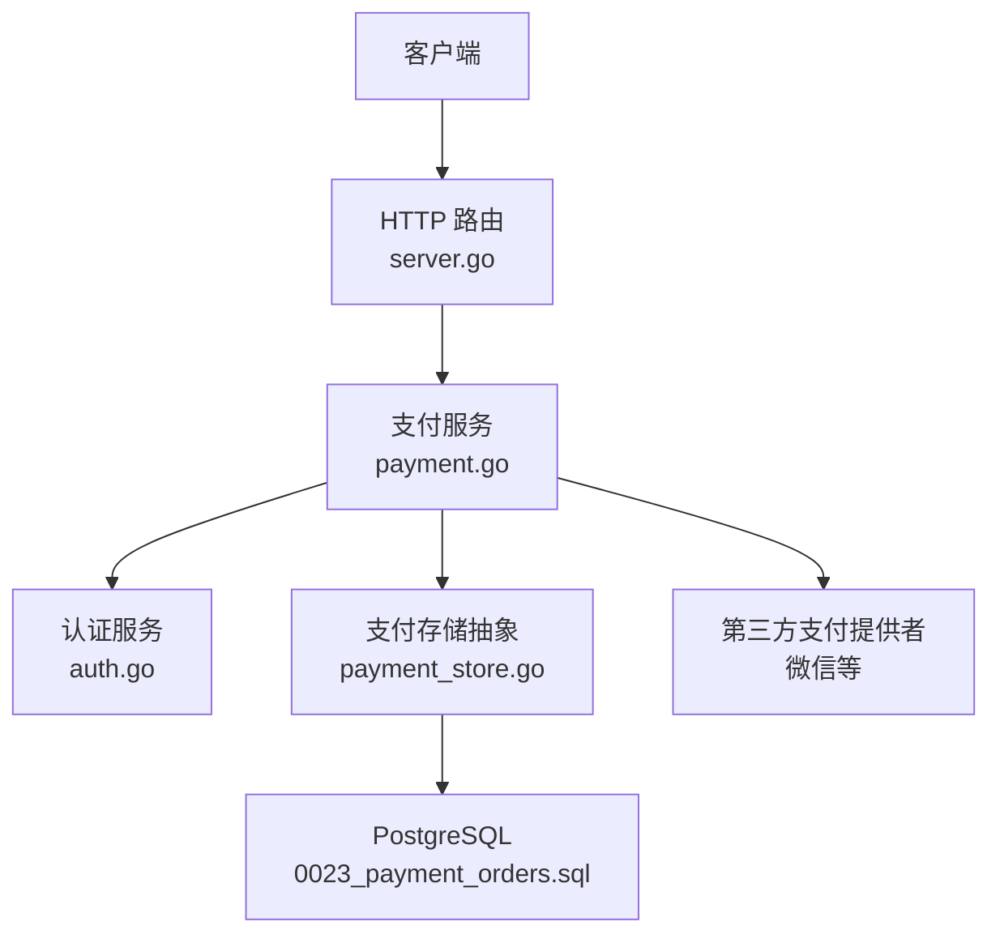
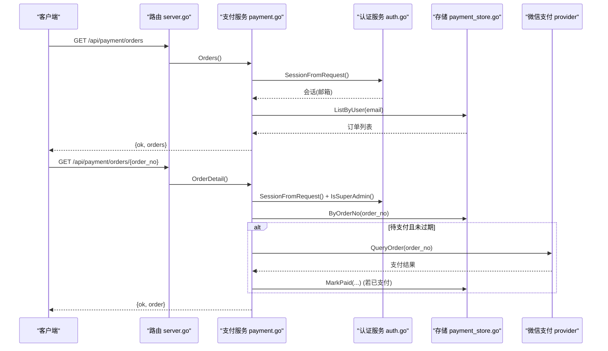
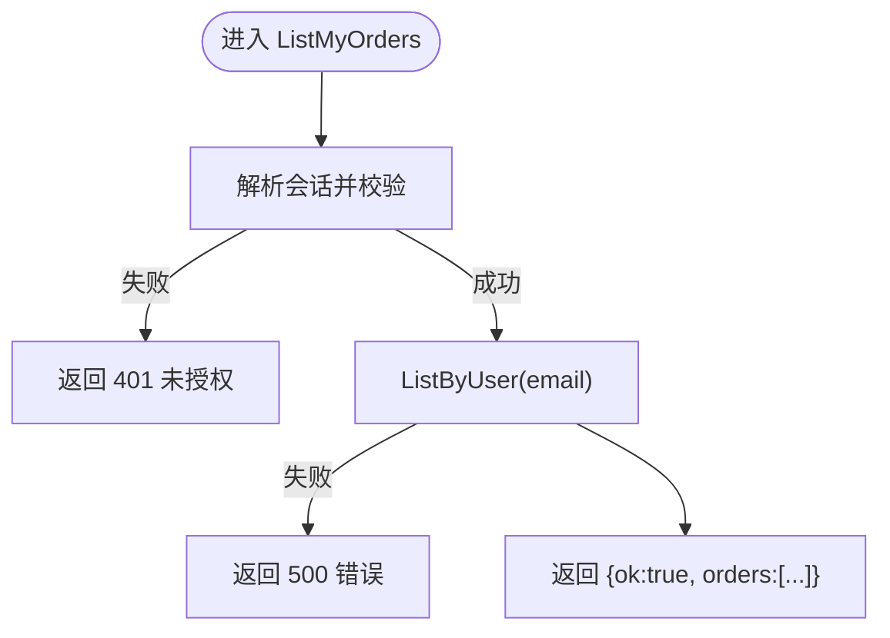
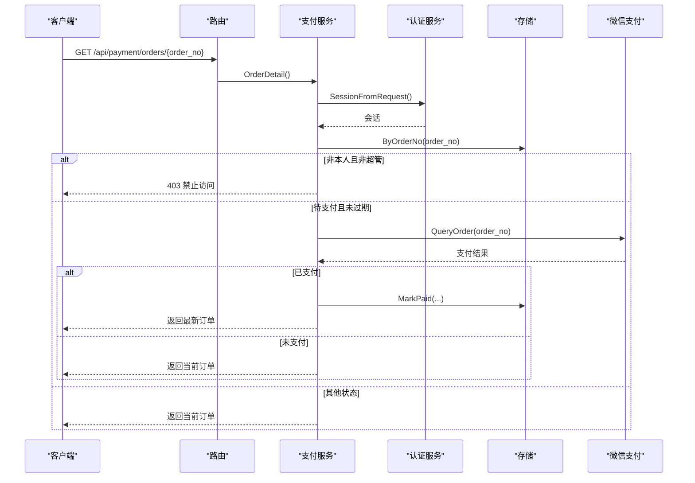
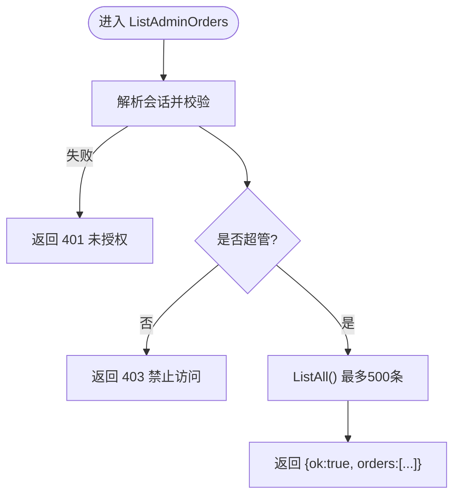
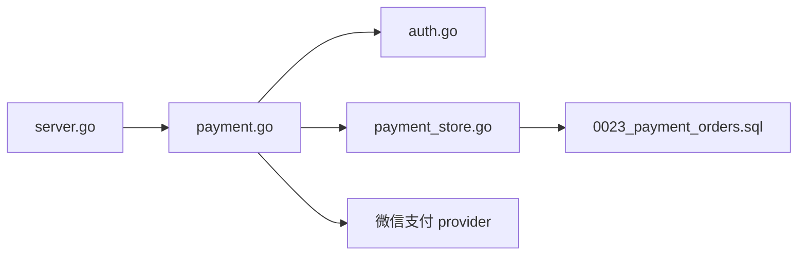

# 订单管理接口

<cite>
**本文引用的文件**
- [payment.go](file://goodhr5/cloud/backend/internal/httpapi/payment.go)
- [payment_store.go](file://goodhr5/cloud/backend/internal/httpapi/payment_store.go)
- [server.go](file://goodhr5/cloud/backend/internal/httpapi/server.go)
- [auth.go](file://goodhr5/cloud/backend/internal/httpapi/auth.go)
- [0023_payment_orders.sql](file://goodhr5/cloud/backend/db/migrations/0023_payment_orders.sql)
- [payment_test.go](file://goodhr5/cloud/backend/internal/httpapi/payment_test.go)
</cite>

## 目录
1. [简介](#简介)
2. [项目结构](#项目结构)
3. [核心组件](#核心组件)
4. [架构总览](#架构总览)
5. [详细组件分析](#详细组件分析)
6. [依赖关系分析](#依赖关系分析)
7. [性能考虑](#性能考虑)
8. [故障排查指南](#故障排查指南)
9. [结论](#结论)
10. [附录：API 调用示例与最佳实践](#附录api-调用示例与最佳实践)

## 简介
本文件面向订单管理相关接口的使用与维护，重点说明以下能力：
- 用户订单列表查询：GET /api/payment/orders
- 订单详情查询：GET /api/payment/orders/{order_no}
- 管理员全量订单查询：GET /api/admin/payment/orders
文档覆盖权限验证、数据过滤、响应格式、主动查单机制、订单状态同步等关键点，并提供可操作的调用示例与注意事项。

## 项目结构
订单管理功能位于后端 HTTP API 层，由路由注册、支付服务、存储抽象与认证模块共同组成：
- 路由注册：将 /api/payment/orders 与 /api/payment/orders/ 映射到支付服务的统一处理器与详情处理器；管理员订单列表挂载在 /api/admin/payment/orders。
- 支付服务：实现创建订单、用户订单列表、订单详情（含主动查单）、微信支付回调处理、订单到账业务应用等。
- 存储抽象：定义 PaymentStore 接口，提供内存与 PostgreSQL 两种实现，负责订单的增删改查与状态变更。
- 认证模块：提供会话解析与超级管理员判断，用于接口鉴权与权限控制。
- 数据库迁移：定义 payment_orders 表结构与索引，支撑订单持久化。

**图表来源**
- [server.go:153-157](file://goodhr5/cloud/backend/internal/httpapi/server.go#L153-L157)
- [payment.go:67-339](file://goodhr5/cloud/backend/internal/httpapi/payment.go#L67-L339)
- [payment_store.go:38-50](file://goodhr5/cloud/backend/internal/httpapi/payment_store.go#L38-L50)
- [0023_payment_orders.sql:1-48](file://goodhr5/cloud/backend/db/migrations/0023_payment_orders.sql#L1-L48)
- [auth.go:544-551](file://goodhr5/cloud/backend/internal/httpapi/auth.go#L544-L551)

**章节来源**
- [server.go:153-157](file://goodhr5/cloud/backend/internal/httpapi/server.go#L153-L157)
- [payment.go:67-339](file://goodhr5/cloud/backend/internal/httpapi/payment.go#L67-L339)
- [payment_store.go:38-50](file://goodhr5/cloud/backend/internal/httpapi/payment_store.go#L38-L50)
- [0023_payment_orders.sql:1-48](file://goodhr5/cloud/backend/db/migrations/0023_payment_orders.sql#L1-L48)
- [auth.go:544-551](file://goodhr5/cloud/backend/internal/httpapi/auth.go#L544-L551)

## 核心组件
- 支付服务 PaymentService：封装订单生命周期、支付回调、订单到账等业务逻辑。
- 存储层 PaymentStore：统一订单读写接口，支持内存与 PostgreSQL 实现。
- 认证服务 AuthService：提供 SessionFromRequest 与 IsSuperAdmin，用于鉴权与权限控制。
- 路由 Server：将 HTTP 路径绑定到具体处理器方法。
- 数据库模型：payment_orders 表承载订单记录，包含状态、金额、过期时间等字段。

关键职责划分：
- 路由仅做请求分发与基础校验。
- 支付服务负责业务规则、权限检查、第三方交互与状态同步。
- 存储层专注数据存取与一致性保障。
- 认证服务提供身份与角色判定。

**章节来源**
- [payment.go:34-65](file://goodhr5/cloud/backend/internal/httpapi/payment.go#L34-L65)
- [payment_store.go:13-50](file://goodhr5/cloud/backend/internal/httpapi/payment_store.go#L13-L50)
- [auth.go:21-69](file://goodhr5/cloud/backend/internal/httpapi/auth.go#L21-L69)
- [server.go:153-157](file://goodhr5/cloud/backend/internal/httpapi/server.go#L153-L157)
- [0023_payment_orders.sql:1-48](file://goodhr5/cloud/backend/db/migrations/0023_payment_orders.sql#L1-L48)

## 架构总览
订单管理接口采用“路由-服务-存储”的分层架构，结合认证与第三方支付提供者，形成完整的订单查询与状态同步链路。

**图表来源**
- [server.go:153-157](file://goodhr5/cloud/backend/internal/httpapi/server.go#L153-L157)
- [payment.go:67-339](file://goodhr5/cloud/backend/internal/httpapi/payment.go#L67-L339)
- [payment_store.go:185-231](file://goodhr5/cloud/backend/internal/httpapi/payment_store.go#L185-L231)
- [auth.go:544-551](file://goodhr5/cloud/backend/internal/httpapi/auth.go#L544-L551)

## 详细组件分析

### 用户订单列表查询：GET /api/payment/orders
- 权限验证
  - 必须携带有效会话（Authorization: Bearer <token>）。
  - 通过认证服务解析会话，获取当前用户邮箱。
- 数据过滤
  - 仅返回当前用户自己的订单列表，按创建时间倒序。
- 响应格式
  - 成功：{ ok: true, orders: [...] }
  - 失败：{ ok: false, error: "..." }
- 分页、筛选、排序
  - 当前实现不支持分页参数、筛选条件或自定义排序。
  - 如需高级用法，可在前端本地对返回列表进行二次处理。

**图表来源**
- [payment.go:261-274](file://goodhr5/cloud/backend/internal/httpapi/payment.go#L261-L274)
- [payment_store.go:197-213](file://goodhr5/cloud/backend/internal/httpapi/payment_store.go#L197-L213)

**章节来源**
- [payment.go:261-274](file://goodhr5/cloud/backend/internal/httpapi/payment.go#L261-L274)
- [payment_store.go:197-213](file://goodhr5/cloud/backend/internal/httpapi/payment_store.go#L197-L213)
- [server.go:153](file://goodhr5/cloud/backend/internal/httpapi/server.go#L153)

### 订单详情查询：GET /api/payment/orders/{order_no}
- 权限控制
  - 必须携带有效会话。
  - 仅允许查看本人订单；超级管理员可查看任意订单。
- 主动查单机制
  - 当订单状态为 pending 且未过期时，会调用第三方支付提供者进行主动查询。
  - 若查询结果为已支付，则执行订单到账流程并刷新本地订单状态。
- 订单状态同步
  - 通过 completeProviderTransaction 完成幂等到账处理，避免重复加时长。
- 响应格式
  - 成功：{ ok: true, order: {...} }
  - 失败：{ ok: false, error: "..." }

**图表来源**
- [payment.go:295-339](file://goodhr5/cloud/backend/internal/httpapi/payment.go#L295-L339)
- [payment_store.go:185-195](file://goodhr5/cloud/backend/internal/httpapi/payment_store.go#L185-L195)
- [auth.go:544-551](file://goodhr5/cloud/backend/internal/httpapi/auth.go#L544-L551)

**章节来源**
- [payment.go:295-339](file://goodhr5/cloud/backend/internal/httpapi/payment.go#L295-L339)
- [payment_store.go:185-195](file://goodhr5/cloud/backend/internal/httpapi/payment_store.go#L185-L195)
- [auth.go:544-551](file://goodhr5/cloud/backend/internal/httpapi/auth.go#L544-L551)

### 管理员订单查询：GET /api/admin/payment/orders
- 权限控制
  - 必须携带有效会话。
  - 仅超级管理员可访问，否则返回 403。
- 全量订单获取
  - 返回全部订单列表（数据库层限制最多 500 条），按创建时间倒序。
- 响应格式
  - 成功：{ ok: true, orders: [...] }
  - 失败：{ ok: false, error: "..." }

**图表来源**
- [payment.go:276-293](file://goodhr5/cloud/backend/internal/httpapi/payment.go#L276-L293)
- [payment_store.go:215-231](file://goodhr5/cloud/backend/internal/httpapi/payment_store.go#L215-L231)
- [auth.go:544-551](file://goodhr5/cloud/backend/internal/httpapi/auth.go#L544-L551)

**章节来源**
- [payment.go:276-293](file://goodhr5/cloud/backend/internal/httpapi/payment.go#L276-L293)
- [payment_store.go:215-231](file://goodhr5/cloud/backend/internal/httpapi/payment_store.go#L215-L231)
- [auth.go:544-551](file://goodhr5/cloud/backend/internal/httpapi/auth.go#L544-L551)

### 数据结构与复杂度
- 订单实体 PaymentOrder
  - 关键字段：order_no、user_email、plan_id、amount_cents、status、paid_at、expired_at、created_at。
  - 复杂度：列表查询 O(n)（内存）或 O(k)（数据库 LIMIT k）；详情查询 O(1) 或 O(log n)（按索引）。
- 存储实现
  - 内存存储：线程安全 map，适合开发环境。
  - PostgreSQL 存储：使用索引 user_id、user_email、status 提升查询效率。

**章节来源**
- [payment_store.go:13-50](file://goodhr5/cloud/backend/internal/httpapi/payment_store.go#L13-L50)
- [payment_store.go:197-231](file://goodhr5/cloud/backend/internal/httpapi/payment_store.go#L197-L231)
- [0023_payment_orders.sql:1-48](file://goodhr5/cloud/backend/db/migrations/0023_payment_orders.sql#L1-L48)

## 依赖关系分析
- 路由依赖支付服务，支付服务依赖认证服务与存储抽象，存储抽象依赖数据库。
- 订单详情涉及第三方支付提供者，用于主动查单与状态同步。
- 管理员接口依赖认证服务的超管判断。

**图表来源**
- [server.go:153-157](file://goodhr5/cloud/backend/internal/httpapi/server.go#L153-L157)
- [payment.go:67-339](file://goodhr5/cloud/backend/internal/httpapi/payment.go#L67-L339)
- [payment_store.go:38-50](file://goodhr5/cloud/backend/internal/httpapi/payment_store.go#L38-L50)
- [0023_payment_orders.sql:1-48](file://goodhr5/cloud/backend/db/migrations/0023_payment_orders.sql#L1-L48)

**章节来源**
- [server.go:153-157](file://goodhr5/cloud/backend/internal/httpapi/server.go#L153-L157)
- [payment.go:67-339](file://goodhr5/cloud/backend/internal/httpapi/payment.go#L67-L339)
- [payment_store.go:38-50](file://goodhr5/cloud/backend/internal/httpapi/payment_store.go#L38-L50)
- [0023_payment_orders.sql:1-48](file://goodhr5/cloud/backend/db/migrations/0023_payment_orders.sql#L1-L48)

## 性能考虑
- 列表查询
  - 用户列表按 created_at 倒序，数据库层有索引优化。
  - 管理员全量列表限制最多 500 条，避免大结果集影响性能。
- 详情查询
  - 仅在待支付且未过期时触发主动查单，减少不必要的第三方调用。
  - 到账处理具备幂等性，避免重复到账。
- 存储层
  - 内存存储在开发环境快速可用；生产建议使用 PostgreSQL 以获得更好的并发与持久化能力。

[本节为通用指导，不直接分析具体文件]

## 故障排查指南
- 401 未授权
  - 检查 Authorization 头是否携带有效 token。
  - 确认会话未过期。
- 403 禁止访问
  - 管理员接口需超管权限；普通用户无法访问。
  - 订单详情需为本人的订单或超管。
- 404 未找到
  - 订单号不存在或无效。
- 500 服务器错误
  - 存储层或第三方调用异常；查看日志中的支付回调与主动查单错误信息。
- 重复到账
  - 系统已通过幂等处理避免重复；如仍出现，检查回调与主动查单的顺序与重试策略。

**章节来源**
- [payment.go:261-339](file://goodhr5/cloud/backend/internal/httpapi/payment.go#L261-L339)
- [payment_store.go:233-257](file://goodhr5/cloud/backend/internal/httpapi/payment_store.go#L233-L257)
- [payment_test.go:15-97](file://goodhr5/cloud/backend/internal/httpapi/payment_test.go#L15-L97)

## 结论
订单管理接口围绕“用户可见、权限可控、状态同步”的核心目标设计：
- 用户订单列表仅暴露本人数据，简单可靠。
- 订单详情支持主动查单与状态同步，确保前后端数据一致。
- 管理员接口提供全量订单视图，便于运营与审计。
建议在生产环境中启用 PostgreSQL 存储，并结合监控与告警关注支付回调与主动查单的错误率。

[本节为总结性内容，不直接分析具体文件]

## 附录：API 调用示例与最佳实践

### 公共约定
- 所有需要鉴权的接口需在请求头中携带 Authorization: Bearer <token>。
- 成功响应统一包含 ok 字段；失败响应包含 error 字段。
- 金额以分为单位（amount_cents），对外展示通常转换为元字符串（amount）。

### 用户订单列表：GET /api/payment/orders
- 请求
  - 方法：GET
  - 路径：/api/payment/orders
  - 头部：Authorization: Bearer <token>
- 响应
  - 成功：{ ok: true, orders: [{ id, order_no, order_type, user_email, plan_id, plan_name, member_type, duration_days, original_amount_cents, discount_amount_cents, upgrade_from_member_type, upgrade_credit_cents, amount_cents, amount, payment_provider, trade_no, status, paid_at, expired_at, created_at }, ...] }
  - 失败：{ ok: false, error: "session is invalid or expired" | "failed to list payment orders" }
- 注意
  - 当前不支持分页、筛选与排序参数。
  - 列表按创建时间倒序返回。

**章节来源**
- [payment.go:67-77](file://goodhr5/cloud/backend/internal/httpapi/payment.go#L67-L77)
- [payment.go:261-274](file://goodhr5/cloud/backend/internal/httpapi/payment.go#L261-L274)
- [payment_store.go:197-213](file://goodhr5/cloud/backend/internal/httpapi/payment_store.go#L197-L213)
- [payment.go:571-595](file://goodhr5/cloud/backend/internal/httpapi/payment.go#L571-L595)

### 订单详情：GET /api/payment/orders/{order_no}
- 请求
  - 方法：GET
  - 路径：/api/payment/orders/{order_no}
  - 头部：Authorization: Bearer <token>
- 行为
  - 校验会话与权限（本人或超管）。
  - 若订单为 pending 且未过期，主动查询第三方支付平台并同步状态。
- 响应
  - 成功：{ ok: true, order: {...} }
  - 失败：{ ok: false, error: "permission denied" | "payment order not found" | "failed to load payment order" }

**章节来源**
- [payment.go:295-339](file://goodhr5/cloud/backend/internal/httpapi/payment.go#L295-L339)
- [payment_store.go:185-195](file://goodhr5/cloud/backend/internal/httpapi/payment_store.go#L185-L195)
- [auth.go:544-551](file://goodhr5/cloud/backend/internal/httpapi/auth.go#L544-L551)

### 管理员订单查询：GET /api/admin/payment/orders
- 请求
  - 方法：GET
  - 路径：/api/admin/payment/orders
  - 头部：Authorization: Bearer <token>（需超管）
- 行为
  - 校验会话与超管权限。
  - 返回全部订单（数据库层限制最多 500 条）。
- 响应
  - 成功：{ ok: true, orders: [...] }
  - 失败：{ ok: false, error: "super admin access required" | "failed to list payment orders" }

**章节来源**
- [payment.go:276-293](file://goodhr5/cloud/backend/internal/httpapi/payment.go#L276-L293)
- [payment_store.go:215-231](file://goodhr5/cloud/backend/internal/httpapi/payment_store.go#L215-L231)
- [auth.go:544-551](file://goodhr5/cloud/backend/internal/httpapi/auth.go#L544-L551)

### 高级用法建议
- 分页
  - 当前接口未提供分页参数；可在前端对返回列表进行分页显示。
- 筛选
  - 当前接口未提供筛选参数；可在前端根据 status、plan_id 等字段进行本地筛选。
- 排序
  - 列表默认按 created_at 倒序；如需自定义排序，建议在服务端扩展查询接口。

[本节为通用指导，不直接分析具体文件]