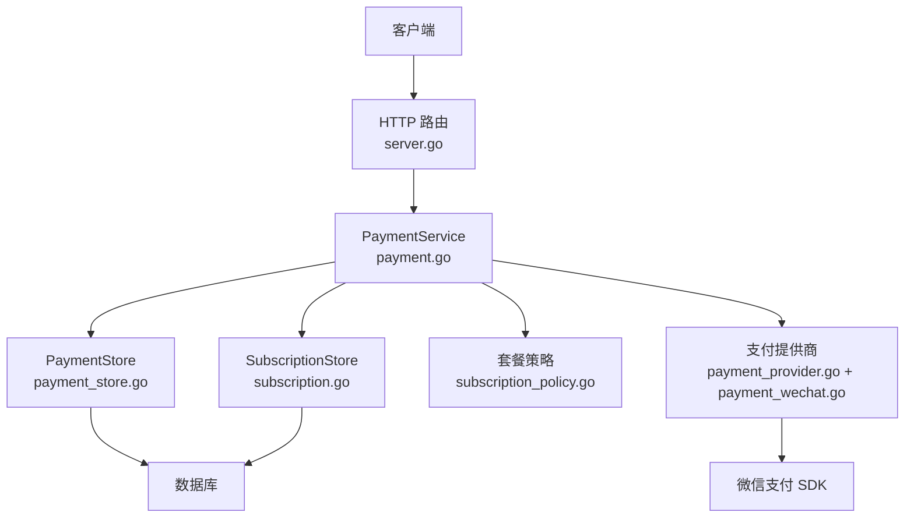
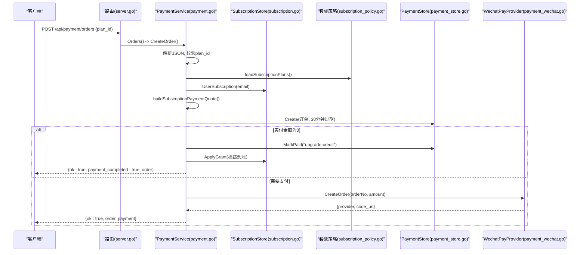
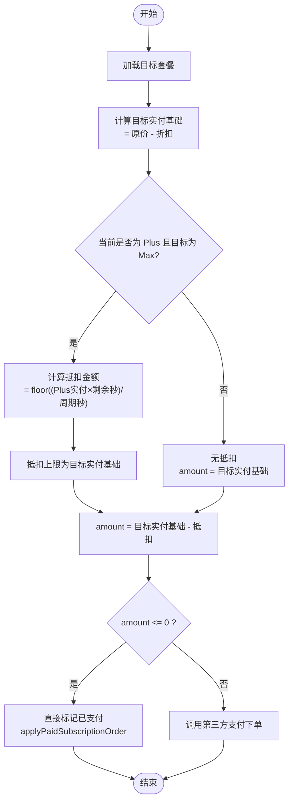
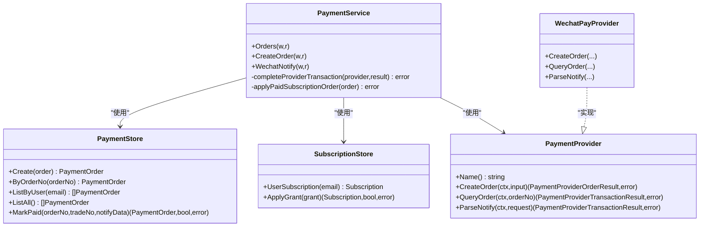

# 订阅支付接口

<cite>
**本文引用的文件**
- [payment.go](file://goodhr5/cloud/backend/internal/httpapi/payment.go)
- [payment_store.go](file://goodhr5/cloud/backend/internal/httpapi/payment_store.go)
- [subscription.go](file://goodhr5/cloud/backend/internal/httpapi/subscription.go)
- [subscription_policy.go](file://goodhr5/cloud/backend/internal/httpapi/subscription_policy.go)
- [payment_provider.go](file://goodhr5/cloud/backend/internal/httpapi/payment_provider.go)
- [payment_wechat.go](file://goodhr5/cloud/backend/internal/httpapi/payment_wechat.go)
- [server.go](file://goodhr5/cloud/backend/internal/httpapi/server.go)
</cite>

## 目录
1. [简介](#简介)
2. [项目结构](#项目结构)
3. [核心组件](#核心组件)
4. [架构总览](#架构总览)
5. [详细组件分析](#详细组件分析)
6. [依赖关系分析](#依赖关系分析)
7. [性能与可靠性](#性能与可靠性)
8. [故障排查指南](#故障排查指南)
9. [结论](#结论)
10. [附录：API 规范与示例](#附录api-规范与示例)

## 简介
本文档面向“订阅支付接口”的完整实现，重点说明 POST /api/payment/orders 接口的端到端流程，包括：
- 创建订阅订单、计算套餐切换折扣、生成订单号
- 请求参数 plan_id 的验证规则
- 响应数据结构与错误处理机制
- 订阅套餐价格计算算法（原价、折扣价、升级抵扣金额）
- 订单状态流转与 30 分钟过期机制
- 完整的 API 调用示例（成功与失败场景）

该接口用于为当前登录用户创建会员订阅支付订单。若为“Plus 升级 Max”，将根据 Plus 剩余有效期按比例抵扣；若金额为 0，则直接按“升级抵扣”完成到账，无需第三方支付。

## 项目结构
本功能位于后端 HTTP 服务模块中，核心文件职责如下：
- payment.go：定义支付服务、订单创建、回调处理、订单查询等 HTTP 逻辑
- payment_store.go：支付记录的数据存储抽象与内存/PostgreSQL 实现
- subscription.go：用户订阅状态与权益发放（幂等）
- subscription_policy.go：套餐配置解析、权限计算、会员类型标准化
- payment_provider.go：支付平台统一接口定义
- payment_wechat.go：微信支付 V3 Native 下单、查单、回调验签解密
- server.go：路由注册，将 /api/payment/* 映射到 PaymentService

图表来源
- [server.go:123-157](file://goodhr5/cloud/backend/internal/httpapi/server.go#L123-L157)
- [payment.go:67-189](file://goodhr5/cloud/backend/internal/httpapi/payment.go#L67-L189)
- [payment_store.go:13-50](file://goodhr5/cloud/backend/internal/httpapi/payment_store.go#L13-L50)
- [subscription.go:18-48](file://goodhr5/cloud/backend/internal/httpapi/subscription.go#L18-L48)
- [subscription_policy.go:18-30](file://goodhr5/cloud/backend/internal/httpapi/subscription_policy.go#L18-L30)
- [payment_provider.go:10-44](file://goodhr5/cloud/backend/internal/httpapi/payment_provider.go#L10-L44)
- [payment_wechat.go:69-137](file://goodhr5/cloud/backend/internal/httpapi/payment_wechat.go#L69-L137)

章节来源
- [server.go:123-157](file://goodhr5/cloud/backend/internal/httpapi/server.go#L123-L157)

## 核心组件
- PaymentService：统一编排订单创建、价格计算、第三方下单、回调处理、权益到账
- PaymentStore：持久化支付订单（内存或 PostgreSQL），提供创建、查询、标记已支付
- SubscriptionStore：读取/更新用户订阅状态，支持幂等权益发放
- SubscriptionPolicy：解析系统配置的套餐列表，计算会员权限与名称
- PaymentProvider：支付平台抽象（当前实现为微信支付）
- WechatPayProvider：微信支付 V3 Native 下单、查单、回调解析

章节来源
- [payment.go:34-65](file://goodhr5/cloud/backend/internal/httpapi/payment.go#L34-L65)
- [payment_store.go:13-50](file://goodhr5/cloud/backend/internal/httpapi/payment_store.go#L13-L50)
- [subscription.go:18-48](file://goodhr5/cloud/backend/internal/httpapi/subscription.go#L18-L48)
- [subscription_policy.go:18-30](file://goodhr5/cloud/backend/internal/httpapi/subscription_policy.go#L18-L30)
- [payment_provider.go:10-44](file://goodhr5/cloud/backend/internal/httpapi/payment_provider.go#L10-L44)
- [payment_wechat.go:51-67](file://goodhr5/cloud/backend/internal/httpapi/payment_wechat.go#L51-L67)

## 架构总览
POST /api/payment/orders 的核心流程如下：
1. 鉴权：从请求中获取会话，校验用户身份
2. 解析请求体：读取 plan_id
3. 加载目标套餐：根据 plan_id 从系统配置中查找有效套餐
4. 读取当前订阅：获取用户当前会员类型与到期时间
5. 计算报价：根据套餐与当前订阅计算实付金额、升级抵扣信息
6. 生成订单：生成唯一订单号、设置 30 分钟过期时间、写入订单记录
7. 分支处理：
   - 若实付金额为 0：使用“升级抵扣”直接标记已支付并应用权益
   - 否则：调用第三方支付（默认微信支付）创建支付订单，返回支付参数
8. 回调处理：微信支付回调到达后，校验并标记订单已支付，应用权益

图表来源
- [server.go:153-156](file://goodhr5/cloud/backend/internal/httpapi/server.go#L153-L156)
- [payment.go:67-189](file://goodhr5/cloud/backend/internal/httpapi/payment.go#L67-L189)
- [payment_store.go:147-183](file://goodhr5/cloud/backend/internal/httpapi/payment_store.go#L147-L183)
- [subscription.go:401-459](file://goodhr5/cloud/backend/internal/httpapi/subscription.go#L401-L459)
- [payment_wechat.go:69-101](file://goodhr5/cloud/backend/internal/httpapi/payment_wechat.go#L69-L101)

## 详细组件分析

### 接口：POST /api/payment/orders
- 路径：/api/payment/orders
- 方法：POST
- 鉴权：需要有效会话（Session）
- 请求体：
  - plan_id: string，必填，表示要购买的订阅套餐 ID
- 响应体：
  - ok: boolean
  - order: 订单对象（见下方字段说明）
  - payment: 支付对象（仅当需要支付时返回）
  - payment_completed: boolean（仅当实付为 0 且自动完成时返回）

#### 请求参数 plan_id 验证规则
- 非空：trim 后为空视为未找到套餐
- 有效性：必须存在于系统配置的套餐列表中，且 duration_days > 0
- 不存在或无效：返回 404 或 500（取决于具体错误）

章节来源
- [payment.go:87-100](file://goodhr5/cloud/backend/internal/httpapi/payment.go#L87-L100)
- [subscription_policy.go:45-108](file://goodhr5/cloud/backend/internal/httpapi/subscription_policy.go#L45-L108)

#### 订单号生成与过期机制
- 订单号：以 “S” 前缀 + UnixNano 时间戳生成，保证唯一性
- 过期时间：创建订单时设置 ExpiredAt = now + 30 分钟
- 订单状态：初始为 pending，支付成功后变为 paid

章节来源
- [payment.go:121-142](file://goodhr5/cloud/backend/internal/httpapi/payment.go#L121-L142)
- [payment_store.go:147-183](file://goodhr5/cloud/backend/internal/httpapi/payment_store.go#L147-L183)

#### 响应数据结构
订单对象字段：
- id: string
- order_no: string
- order_type: string（默认 "subscription"）
- user_email: string
- plan_id: string
- plan_name: string
- member_type: string（free/plus/max）
- duration_days: int
- original_amount_cents: int（原价，单位分）
- discount_amount_cents: int（折扣金额，单位分）
- upgrade_from_member_type: string（升级来源会员类型）
- upgrade_credit_cents: int（升级抵扣金额，单位分）
- amount_cents: int（实付金额，单位分）
- amount: string（元字符串，两位小数）
- payment_provider: string（如 wechat）
- trade_no: string（第三方支付流水号）
- status: string（pending/paid）
- paid_at: timestamp?
- expired_at: timestamp?
- created_at: timestamp

支付对象字段（需要支付时）：
- provider: string
- order_no: string
- code_url: string（二维码链接）

章节来源
- [payment.go:571-595](file://goodhr5/cloud/backend/internal/httpapi/payment.go#L571-L595)
- [payment_provider.go:22-44](file://goodhr5/cloud/backend/internal/httpapi/payment_provider.go#L22-L44)

#### 错误处理机制
常见错误码与含义：
- 400：请求体 JSON 非法、plan_id 无效、金额不合法
- 401：会话无效或过期
- 404：套餐不存在
- 409：套餐配置冲突（例如价格配置不正确）
- 500：内部错误（加载套餐失败、创建订单失败、支付提供商未配置、回调处理失败等）
- 503：服务暂时不可用（如会员状态或套餐配置读取失败）

章节来源
- [payment.go:81-119](file://goodhr5/cloud/backend/internal/httpapi/payment.go#L81-L119)
- [payment.go:168-181](file://goodhr5/cloud/backend/internal/httpapi/payment.go#L168-L181)
- [payment.go:341-362](file://goodhr5/cloud/backend/internal/httpapi/payment.go#L341-L362)

### 价格计算与套餐切换折扣算法
- 目标套餐实付基础：original_price - discount_amount（转换为分）
- 普通购买：amount_cents = 目标套餐实付基础
- 套餐切换：
  - 若当前为 Max 且目标为 Plus：允许原价切换，无抵扣
  - 若当前为 Plus 且目标为 Max：按 Plus 剩余有效期比例抵扣
    - 抵扣金额 = floor((Plus 实付基础 × 剩余秒数) / (Plus 周期秒数))
    - 抵扣上限不超过目标套餐实付基础
    - 最终 amount_cents = 目标实付基础 - 抵扣金额
- 若 amount_cents <= 0：走“升级抵扣”通道，直接标记已支付并应用权益

图表来源
- [payment.go:524-560](file://goodhr5/cloud/backend/internal/httpapi/payment.go#L524-L560)
- [subscription_policy.go:120-142](file://goodhr5/cloud/backend/internal/httpapi/subscription_policy.go#L120-L142)

章节来源
- [payment.go:524-560](file://goodhr5/cloud/backend/internal/httpapi/payment.go#L524-L560)

### 订单状态流转与 30 分钟过期
- 初始状态：pending，ExpiredAt = now + 30 分钟
- 支付成功：
  - 第三方支付回调或主动查单成功后，MarkPaid 将状态改为 paid，记录 trade_no 与 paid_at
  - 应用权益：
    - AI 余额充值：调整 AI 钱包余额
    - 订阅订单：ApplyGrant 增加会员天数或替换会员类型
- 过期处理：
  - 订单详情接口在 pending 且未过期时会尝试主动查单
  - 前端可基于 expired_at 提示用户订单即将过期

章节来源
- [payment.go:324-338](file://goodhr5/cloud/backend/internal/httpapi/payment.go#L324-L338)
- [payment_store.go:233-257](file://goodhr5/cloud/backend/internal/httpapi/payment_store.go#L233-L257)
- [payment_wechat.go:103-117](file://goodhr5/cloud/backend/internal/httpapi/payment_wechat.go#L103-L117)

### 回调处理与权益到账
- 微信支付回调：
  - 验签与解密，校验交易归属（AppID、商户号、币种、交易类型）
  - 若支付成功，调用 completeProviderTransaction 标记订单并应用权益
- 权益到账：
  - 订阅订单：ApplyGrant 幂等发放会员时间或替换会员类型
  - 邀请奖励：根据配置给邀请人发放会员天数
  - 通知邮件：发送会员到账提醒

章节来源
- [payment.go:341-405](file://goodhr5/cloud/backend/internal/httpapi/payment.go#L341-L405)
- [payment_wechat.go:119-137](file://goodhr5/cloud/backend/internal/httpapi/payment_wechat.go#L119-L137)
- [subscription.go:401-459](file://goodhr5/cloud/backend/internal/httpapi/subscription.go#L401-L459)

## 依赖关系分析
- PaymentService 依赖：
  - AuthService：会话校验
  - PaymentStore：订单持久化
  - SubscriptionStore：订阅状态与权益发放
  - SystemConfigStore：套餐配置、邀请配置、微信支付配置
  - Mailer：发送邮件通知
  - AIWalletStore：AI 余额充值
  - PaymentProvider：第三方支付（微信）
- 微信支付 Provider：
  - 从系统配置动态加载商户证书、公钥、回调地址
  - 每次请求前校验配置完整性，支持热更新

图表来源
- [payment.go:34-65](file://goodhr5/cloud/backend/internal/httpapi/payment.go#L34-L65)
- [payment_store.go:38-50](file://goodhr5/cloud/backend/internal/httpapi/payment_store.go#L38-L50)
- [subscription.go:34-48](file://goodhr5/cloud/backend/internal/httpapi/subscription.go#L34-L48)
- [payment_provider.go:10-44](file://goodhr5/cloud/backend/internal/httpapi/payment_provider.go#L10-L44)
- [payment_wechat.go:51-67](file://goodhr5/cloud/backend/internal/httpapi/payment_wechat.go#L51-L67)

章节来源
- [payment.go:34-65](file://goodhr5/cloud/backend/internal/httpapi/payment.go#L34-L65)
- [payment_store.go:38-50](file://goodhr5/cloud/backend/internal/httpapi/payment_store.go#L38-L50)
- [subscription.go:34-48](file://goodhr5/cloud/backend/internal/httpapi/subscription.go#L34-L48)
- [payment_provider.go:10-44](file://goodhr5/cloud/backend/internal/httpapi/payment_provider.go#L10-L44)
- [payment_wechat.go:51-67](file://goodhr5/cloud/backend/internal/httpapi/payment_wechat.go#L51-L67)

## 性能与可靠性
- 幂等性：
  - 权益发放通过订单号+权益类型去重，避免重复到账
- 并发安全：
  - 内存存储使用互斥锁保护
  - PostgreSQL 使用行级锁与事务保证一致性
- 超时与重试：
  - 订单 30 分钟过期，减少长期占用资源
  - 订单详情主动查单，提升支付结果同步可靠性
- 配置热更新：
  - 微信支付配置变化时自动重建客户端，无需重启服务

[本节为通用指导，不直接分析具体文件]

## 故障排查指南
常见问题与定位要点：
- 401 未授权：检查会话是否有效
- 404 套餐不存在：确认 plan_id 是否存在于系统配置且 duration_days > 0
- 409 配置冲突：检查套餐价格与折扣配置是否合理（折扣不能超过原价）
- 500 内部错误：
  - 加载套餐失败：检查 system.subscription_plans 配置
  - 支付提供商未配置：检查 system.payment_wechat 配置
  - 回调处理失败：查看日志中的支付回调错误信息
- 503 服务不可用：会员状态或套餐配置暂时无法读取，稍后重试

章节来源
- [payment.go:81-119](file://goodhr5/cloud/backend/internal/httpapi/payment.go#L81-L119)
- [payment.go:341-362](file://goodhr5/cloud/backend/internal/httpapi/payment.go#L341-L362)
- [payment_wechat.go:139-179](file://goodhr5/cloud/backend/internal/httpapi/payment_wechat.go#L139-L179)

## 结论
POST /api/payment/orders 提供了完整的订阅支付能力，涵盖订单创建、价格计算、第三方支付集成、回调处理与权益到账。其设计强调幂等性与可靠性，并通过 30 分钟过期机制控制订单生命周期。对于 Plus 升级 Max 的场景，系统实现了按剩余有效期比例的抵扣逻辑，确保公平计费。

[本节为总结，不直接分析具体文件]

## 附录：API 规范与示例

### 接口定义
- 路径：/api/payment/orders
- 方法：POST
- 鉴权：需要有效会话
- 请求体：
  - plan_id: string（必填）
- 响应体：
  - ok: boolean
  - order: 订单对象
  - payment: 支付对象（需要支付时）
  - payment_completed: boolean（实付为 0 时）

章节来源
- [server.go:153-156](file://goodhr5/cloud/backend/internal/httpapi/server.go#L153-L156)
- [payment.go:67-189](file://goodhr5/cloud/backend/internal/httpapi/payment.go#L67-L189)

### 成功场景示例
- 请求：
  - POST /api/payment/orders
  - Body: {"plan_id": "monthly"}
- 响应（需要支付）：
  - {
      "ok": true,
      "order": { ... },
      "payment": {
        "provider": "wechat",
        "order_no": "S...",
        "code_url": "weixin://..."
      }
    }
- 响应（实付为 0，自动完成）：
  - {
      "ok": true,
      "payment_completed": true,
      "order": { ... }
    }

章节来源
- [payment.go:121-189](file://goodhr5/cloud/backend/internal/httpapi/payment.go#L121-L189)

### 失败场景示例
- 会话无效：
  - 401: {"error": "session is invalid or expired"}
- 套餐不存在：
  - 404: {"error": "subscription plan not found"}
- 套餐配置错误：
  - 409: {"error": "套餐价格配置不正确"}
- 支付提供商未配置：
  - 500: {"error": "payment provider is not configured"}
- 回调处理失败：
  - 400: {"code": "FAIL", "message": "支付通知处理失败"}

章节来源
- [payment.go:81-119](file://goodhr5/cloud/backend/internal/httpapi/payment.go#L81-L119)
- [payment.go:168-181](file://goodhr5/cloud/backend/internal/httpapi/payment.go#L168-L181)
- [payment.go:341-362](file://goodhr5/cloud/backend/internal/httpapi/payment.go#L341-L362)

### 订单详情与主动查单
- 路径：/api/payment/orders/{order_no}
- 方法：GET
- 行为：若订单 pending 且未过期，会主动查询第三方支付状态并尝试完成到账

章节来源
- [payment.go:295-338](file://goodhr5/cloud/backend/internal/httpapi/payment.go#L295-L338)

### 微信支付回调
- 路径：/api/payment/notify/wechat
- 方法：POST
- 行为：验签、解密、校验交易归属，标记订单已支付并应用权益

章节来源
- [payment.go:341-362](file://goodhr5/cloud/backend/internal/httpapi/payment.go#L341-L362)
- [payment_wechat.go:119-137](file://goodhr5/cloud/backend/internal/httpapi/payment_wechat.go#L119-L137)