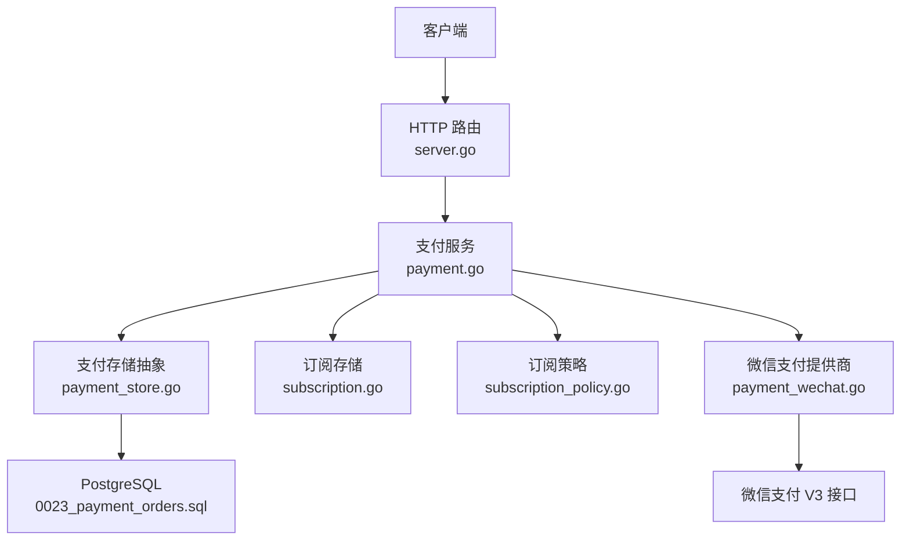
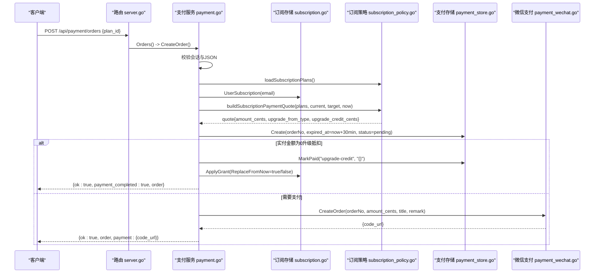
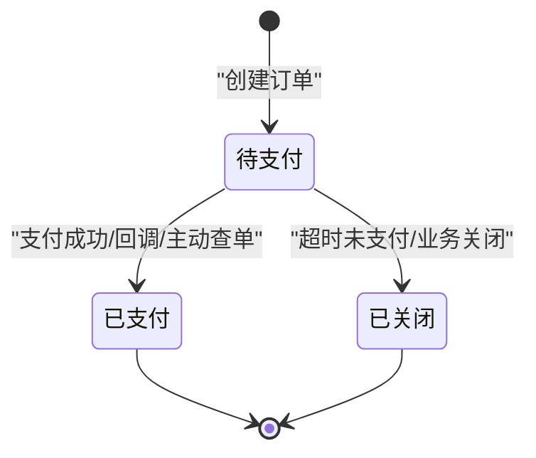
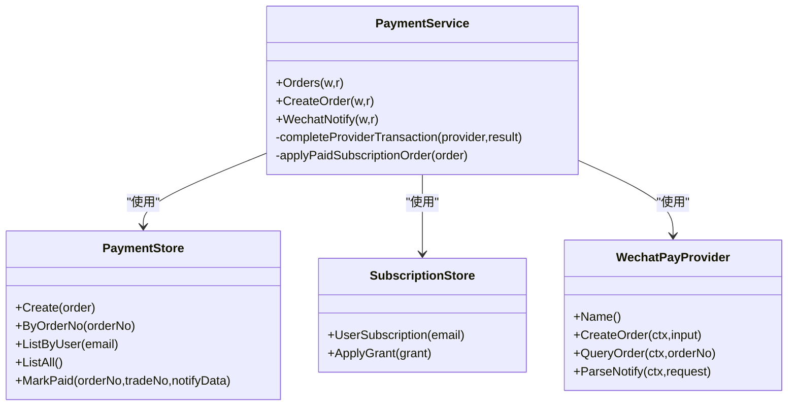

# 订阅支付接口

<cite>
**本文引用的文件**
- [payment.go](file://goodhr5/cloud/backend/internal/httpapi/payment.go)
- [payment_store.go](file://goodhr5/cloud/backend/internal/httpapi/payment_store.go)
- [payment_wechat.go](file://goodhr5/cloud/backend/internal/httpapi/payment_wechat.go)
- [subscription.go](file://goodhr5/cloud/backend/internal/httpapi/subscription.go)
- [subscription_policy.go](file://goodhr5/cloud/backend/internal/httpapi/subscription_policy.go)
- [server.go](file://goodhr5/cloud/backend/internal/httpapi/server.go)
- [0023_payment_orders.sql](file://goodhr5/cloud/backend/db/migrations/0023_payment_orders.sql)
- [0074_wechat_payment_provider.sql](file://goodhr5/cloud/backend/db/migrations/0074_wechat_payment_provider.sql)
- [0075_system_payment_wechat.sql](file://goodhr5/cloud/backend/db/migrations/0075_system_payment_wechat.sql)
</cite>

## 目录
1. [简介](#简介)
2. [项目结构](#项目结构)
3. [核心组件](#核心组件)
4. [架构总览](#架构总览)
5. [详细组件分析](#详细组件分析)
6. [依赖关系分析](#依赖关系分析)
7. [性能与可靠性](#性能与可靠性)
8. [故障排查指南](#故障排查指南)
9. [结论](#结论)
10. [附录：API 调用示例](#附录api-调用示例)

## 简介
本文档面向后端与前端开发者，系统化说明订阅支付接口 POST /api/payment/orders 的完整流程。内容涵盖：创建订阅订单、计算套餐切换折扣、生成订单号、请求参数 plan_id 的验证规则、响应数据结构、错误处理机制；详细说明订阅套餐价格计算算法（原价、折扣价、升级抵扣金额）；给出成功与失败场景的调用示例；解释订单状态流转与 30 分钟过期机制。

## 项目结构
本接口位于云端 HTTP API 模块中，由路由注册、支付服务、存储抽象、微信支付提供商、订阅策略等共同协作完成。数据库层通过迁移脚本定义支付订单表及微信支付系统配置。

图表来源
- [server.go:132-171](file://goodhr5/cloud/backend/internal/httpapi/server.go#L132-L171)
- [payment.go:67-189](file://goodhr5/cloud/backend/internal/httpapi/payment.go#L67-L189)
- [payment_store.go:13-50](file://goodhr5/cloud/backend/internal/httpapi/payment_store.go#L13-L50)
- [subscription.go:18-48](file://goodhr5/cloud/backend/internal/httpapi/subscription.go#L18-L48)
- [subscription_policy.go:45-108](file://goodhr5/cloud/backend/internal/httpapi/subscription_policy.go#L45-L108)
- [payment_wechat.go:69-101](file://goodhr5/cloud/backend/internal/httpapi/payment_wechat.go#L69-L101)
- [0023_payment_orders.sql:1-48](file://goodhr5/cloud/backend/db/migrations/0023_payment_orders.sql#L1-L48)

章节来源
- [server.go:132-171](file://goodhr5/cloud/backend/internal/httpapi/server.go#L132-L171)
- [payment.go:67-189](file://goodhr5/cloud/backend/internal/httpapi/payment.go#L67-L189)
- [payment_store.go:13-50](file://goodhr5/cloud/backend/internal/httpapi/payment_store.go#L13-L50)
- [subscription.go:18-48](file://goodhr5/cloud/backend/internal/httpapi/subscription.go#L18-L48)
- [subscription_policy.go:45-108](file://goodhr5/cloud/backend/internal/httpapi/subscription_policy.go#L45-L108)
- [payment_wechat.go:69-101](file://goodhr5/cloud/backend/internal/httpapi/payment_wechat.go#L69-L101)
- [0023_payment_orders.sql:1-48](file://goodhr5/cloud/backend/db/migrations/0023_payment_orders.sql#L1-L48)

## 核心组件
- 支付服务 PaymentService：统一编排创建订单、计算报价、落库、调用第三方支付、回调处理、权益发放。
- 支付存储 PaymentStore：内存与 PostgreSQL 双实现，提供订单创建、查询、标记已支付等能力。
- 微信支付提供商 WechatPayProvider：封装微信 Native 下单、主动查单、回调验签解密。
- 订阅策略 SubscriptionPolicy：解析并校验系统配置的会员套餐，计算权限与到期时间。
- 订阅存储 SubscriptionStore：按用户邮箱读取或更新订阅状态，支持幂等权益发放。

章节来源
- [payment.go:34-65](file://goodhr5/cloud/backend/internal/httpapi/payment.go#L34-L65)
- [payment_store.go:13-50](file://goodhr5/cloud/backend/internal/httpapi/payment_store.go#L13-L50)
- [payment_wechat.go:51-67](file://goodhr5/cloud/backend/internal/httpapi/payment_wechat.go#L51-L67)
- [subscription_policy.go:18-43](file://goodhr5/cloud/backend/internal/httpapi/subscription_policy.go#L18-L43)
- [subscription.go:18-48](file://goodhr5/cloud/backend/internal/httpapi/subscription.go#L18-L48)

## 架构总览
POST /api/payment/orders 的核心时序如下：

图表来源
- [server.go:167-170](file://goodhr5/cloud/backend/internal/httpapi/server.go#L167-L170)
- [payment.go:67-189](file://goodhr5/cloud/backend/internal/httpapi/payment.go#L67-L189)
- [payment_store.go:147-183](file://goodhr5/cloud/backend/internal/httpapi/payment_store.go#L147-L183)
- [payment_wechat.go:69-101](file://goodhr5/cloud/backend/internal/httpapi/payment_wechat.go#L69-L101)
- [subscription.go:401-459](file://goodhr5/cloud/backend/internal/httpapi/subscription.go#L401-L459)
- [subscription_policy.go:45-108](file://goodhr5/cloud/backend/internal/httpapi/subscription_policy.go#L45-L108)

## 详细组件分析

### 接口：POST /api/payment/orders
- 功能：为当前登录用户创建订阅支付订单，返回订单信息与支付信息（二维码链接），或在升级抵扣场景直接完成订单。
- 认证：必须携带有效会话（Session）。
- 请求体：
  - plan_id：字符串，必填。表示要购买的订阅套餐 ID。
- 响应体：
  - ok：布尔值，表示请求是否成功。
  - order：订单对象（见“响应数据模型”）。
  - payment：支付对象（仅当需要支付时返回），包含 code_url（二维码链接）。
  - error：错误消息（失败时返回）。

#### 请求参数 plan_id 验证规则
- 非空且去除空白后存在。
- 必须在系统配置的套餐列表中存在，且 duration_days > 0。
- 若不存在或无效，返回“未找到套餐”或“加载套餐失败”。

章节来源
- [payment.go:80-119](file://goodhr5/cloud/backend/internal/httpapi/payment.go#L80-L119)
- [subscription_policy.go:45-108](file://goodhr5/cloud/backend/internal/httpapi/subscription_policy.go#L45-L108)

#### 订单创建与 30 分钟过期
- 订单号：由 generatePaymentOrderNo() 生成，格式为“S”加纳秒级时间戳。
- 过期时间：创建订单时设置 expired_at = now + 30 分钟。
- 初始状态：pending。
- 支付渠道：默认 wechat；当实付金额为 0 时使用内部升级抵扣通道。

章节来源
- [payment.go:121-142](file://goodhr5/cloud/backend/internal/httpapi/payment.go#L121-L142)
- [payment.go:597-600](file://goodhr5/cloud/backend/internal/httpapi/payment.go#L597-L600)
- [0023_payment_orders.sql:1-48](file://goodhr5/cloud/backend/db/migrations/0023_payment_orders.sql#L1-L48)

#### 套餐切换折扣与升级抵扣计算
- 目标套餐实付基础：targetAmount = 原价 - 折扣价（单位分）。
- 若当前为 Pro 且购买 Plus：不扣费，直接返回目标套餐价格（无抵扣）。
- 若当前为 Plus 且购买 Pro：
  - 计算 Plus 剩余有效期秒数 remainingSeconds。
  - 计算抵扣金额 credit = floor(plusAmount * remainingSeconds / (plusPlan.durationDays * 24h))。
  - 抵扣上限不超过 targetAmount。
  - 最终应付 amount_cents = targetAmount - credit。
- 其他情况：按目标套餐实付基础计算，无抵扣。

章节来源
- [payment.go:524-560](file://goodhr5/cloud/backend/internal/httpapi/payment.go#L524-L560)
- [subscription_policy.go:111-142](file://goodhr5/cloud/backend/internal/httpapi/subscription_policy.go#L111-L142)

#### 支付流程与回调处理
- 需要支付时：调用微信支付 Native 下单，返回 code_url 给前端展示二维码。
- 回调处理：WechatNotify 接收微信通知，验签解密后调用 completeProviderTransaction 完成到账。
- 主动查单：在订单详情查询时，若仍 pending 且未过期，会主动查询第三方状态并尝试完成到账。

章节来源
- [payment.go:168-189](file://goodhr5/cloud/backend/internal/httpapi/payment.go#L168-L189)
- [payment.go:341-362](file://goodhr5/cloud/backend/internal/httpapi/payment.go#L341-L362)
- [payment.go:295-339](file://goodhr5/cloud/backend/internal/httpapi/payment.go#L295-L339)
- [payment_wechat.go:69-101](file://goodhr5/cloud/backend/internal/httpapi/payment_wechat.go#L69-L101)
- [payment_wechat.go:119-137](file://goodhr5/cloud/backend/internal/httpapi/payment_wechat.go#L119-L137)

#### 权益发放与邀请奖励
- 支付成功后：根据订单信息调用 subscriptions.ApplyGrant 发放会员天数或替换类型。
- 邀请奖励：若被邀请用户支付成功，按配置给邀请人发放奖励天数，并发送邮件通知。

章节来源
- [payment.go:407-485](file://goodhr5/cloud/backend/internal/httpapi/payment.go#L407-L485)
- [subscription.go:401-459](file://goodhr5/cloud/backend/internal/httpapi/subscription.go#L401-L459)

#### 响应数据模型
- order 字段：
  - id：记录ID
  - order_no：订单号
  - order_type：订单类型（subscription 或 ai_balance）
  - user_email：用户邮箱
  - plan_id：套餐ID
  - plan_name：套餐名称
  - member_type：会员类型（free/plus/pro）
  - duration_days：购买增加的天数
  - original_amount_cents：原价（分）
  - discount_amount_cents：优惠金额（分）
  - upgrade_from_member_type：升级来源会员类型
  - upgrade_credit_cents：升级抵扣金额（分）
  - amount_cents：实付金额（分）
  - amount：实付金额（元字符串）
  - payment_provider：支付平台标识（wechat 或 upgrade_credit）
  - trade_no：第三方支付流水号
  - status：订单状态（pending/paid/closed）
  - paid_at：支付成功时间
  - expired_at：订单过期时间
  - created_at：创建时间

章节来源
- [payment.go:571-595](file://goodhr5/cloud/backend/internal/httpapi/payment.go#L571-L595)

#### 错误处理机制
- 会话无效或过期：401。
- JSON 解析失败：400。
- 套餐不存在：404。
- 套餐配置读取失败：503。
- 套餐价格配置不正确：409。
- 创建订单失败：500。
- 支付提供商未配置：500。
- 微信支付回调失败：400。
- 通用错误格式：{ok:false, error:"..."}。

章节来源
- [payment.go:80-189](file://goodhr5/cloud/backend/internal/httpapi/payment.go#L80-L189)
- [payment.go:341-362](file://goodhr5/cloud/backend/internal/httpapi/payment.go#L341-L362)
- [server.go:307-313](file://goodhr5/cloud/backend/internal/httpapi/server.go#L307-L313)

### 订单状态流转与 30 分钟过期机制
- 初始状态：pending，expired_at = now + 30 分钟。
- 支付成功：状态变为 paid，trade_no 与 paid_at 写入。
- 关闭状态：closed（用于业务关闭，例如超时未支付）。
- 过期机制：
  - 订单创建时设置 expired_at。
  - 微信支付下单也设置 TimeExpire = now + 30 分钟。
  - 订单详情查询时，若仍 pending 且未过期，会主动查询第三方状态并尝试完成到账。

图表来源
- [payment.go:121-142](file://goodhr5/cloud/backend/internal/httpapi/payment.go#L121-L142)
- [payment_wechat.go:69-101](file://goodhr5/cloud/backend/internal/httpapi/payment_wechat.go#L69-L101)
- [payment.go:295-339](file://goodhr5/cloud/backend/internal/httpapi/payment.go#L295-L339)
- [0023_payment_orders.sql:1-48](file://goodhr5/cloud/backend/db/migrations/0023_payment_orders.sql#L1-L48)

章节来源
- [payment.go:121-142](file://goodhr5/cloud/backend/internal/httpapi/payment.go#L121-L142)
- [payment.go:295-339](file://goodhr5/cloud/backend/internal/httpapi/payment.go#L295-L339)
- [payment_wechat.go:69-101](file://goodhr5/cloud/backend/internal/httpapi/payment_wechat.go#L69-L101)
- [0023_payment_orders.sql:1-48](file://goodhr5/cloud/backend/db/migrations/0023_payment_orders.sql#L1-L48)

## 依赖关系分析
- 路由层：server.go 将 /api/payment/orders 映射到 PaymentService.Orders。
- 支付服务：依赖认证、订阅存储、系统配置、邀请存储、邮件、AI钱包、支付提供商。
- 存储层：PaymentStore 提供内存与 PostgreSQL 两种实现；SubscriptionStore 提供订阅读写与幂等发放。
- 外部依赖：微信支付 V3 SDK，系统配置 system.payment_wechat。

图表来源
- [payment.go:34-65](file://goodhr5/cloud/backend/internal/httpapi/payment.go#L34-L65)
- [payment_store.go:13-50](file://goodhr5/cloud/backend/internal/httpapi/payment_store.go#L13-L50)
- [subscription.go:18-48](file://goodhr5/cloud/backend/internal/httpapi/subscription.go#L18-L48)
- [payment_wechat.go:51-67](file://goodhr5/cloud/backend/internal/httpapi/payment_wechat.go#L51-L67)

章节来源
- [server.go:167-171](file://goodhr5/cloud/backend/internal/httpapi/server.go#L167-L171)
- [payment.go:34-65](file://goodhr5/cloud/backend/internal/httpapi/payment.go#L34-L65)
- [payment_store.go:13-50](file://goodhr5/cloud/backend/internal/httpapi/payment_store.go#L13-L50)
- [subscription.go:18-48](file://goodhr5/cloud/backend/internal/httpapi/subscription.go#L18-L48)
- [payment_wechat.go:51-67](file://goodhr5/cloud/backend/internal/httpapi/payment_wechat.go#L51-L67)

## 性能与可靠性
- 幂等性：
  - 支付回调与主动查单均通过订单号与金额校验，避免重复到账。
  - 订阅权益发放通过订单号与权益类型键进行幂等控制。
- 并发安全：
  - 内存存储使用互斥锁保护。
  - PostgreSQL 权益发放使用事务与行级锁（FOR UPDATE）保证一致性。
- 配置热更新：
  - 微信支付提供商每次请求前从系统配置读取，配置变化自动重建客户端，修改后立即生效。
- 超时与重试：
  - 订单 30 分钟过期；微信支付下单也设置相同过期时间。
  - 订单详情查询时主动查单，提升到账及时性。

章节来源
- [payment_store.go:52-135](file://goodhr5/cloud/backend/internal/httpapi/payment_store.go#L52-L135)
- [subscription.go:401-459](file://goodhr5/cloud/backend/internal/httpapi/subscription.go#L401-L459)
- [payment_wechat.go:195-251](file://goodhr5/cloud/backend/internal/httpapi/payment_wechat.go#L195-L251)
- [payment.go:121-142](file://goodhr5/cloud/backend/internal/httpapi/payment.go#L121-L142)
- [payment.go:295-339](file://goodhr5/cloud/backend/internal/httpapi/payment.go#L295-L339)

## 故障排查指南
- 会话无效或过期：检查客户端是否正确携带会话，服务端是否已登录。
- JSON 解析失败：确认请求体为合法 JSON，且包含 plan_id。
- 套餐不存在：检查系统配置 system.subscription_plans 是否包含该 plan_id 且 duration_days > 0。
- 套餐价格配置不正确：确保原价不小于折扣价，且非免费套餐的 duration_days > 0。
- 支付提供商未配置：检查 system.payment_wechat 是否已填写必要字段。
- 微信支付回调失败：核对回调地址、签名与解密逻辑，查看日志中的错误信息。
- 订单未到账：使用订单详情接口主动查单，或等待回调；检查支付金额是否一致。

章节来源
- [payment.go:80-189](file://goodhr5/cloud/backend/internal/httpapi/payment.go#L80-L189)
- [payment.go:341-362](file://goodhr5/cloud/backend/internal/httpapi/payment.go#L341-L362)
- [payment_wechat.go:139-179](file://goodhr5/cloud/backend/internal/httpapi/payment_wechat.go#L139-L179)
- [server.go:307-313](file://goodhr5/cloud/backend/internal/httpapi/server.go#L307-L313)

## 结论
POST /api/payment/orders 提供了完整的订阅支付能力，包括订单创建、套餐切换折扣计算、订单号生成、30 分钟过期机制、微信支付集成与回调处理、权益发放与邀请奖励。通过统一的存储抽象与策略解析，系统在灵活性与可靠性之间取得平衡，适合生产环境部署与扩展。

## 附录：API 调用示例

### 成功场景：普通购买（需要支付）
- 请求
  - 方法：POST
  - 路径：/api/payment/orders
  - 头部：Content-Type: application/json
  - 主体：{"plan_id": "pro_monthly"}
- 响应
  - 状态码：200
  - 主体：
    - ok: true
    - order: {order_no, plan_id, amount_cents, status: "pending", ...}
    - payment: {provider: "wechat", code_url: "..."}

### 成功场景：升级抵扣（Plus 升级到 Pro，实付为 0）
- 请求
  - 方法：POST
  - 路径：/api/payment/orders
  - 头部：Content-Type: application/json
  - 主体：{"plan_id": "pro_monthly"}
- 响应
  - 状态码：200
  - 主体：
    - ok: true
    - payment_completed: true
    - order: {order_no, plan_id, amount_cents: 0, status: "paid", ...}

### 失败场景：会话无效
- 请求
  - 方法：POST
  - 路径：/api/payment/orders
  - 主体：{"plan_id": "pro_monthly"}
- 响应
  - 状态码：401
  - 主体：{ok: false, error: "session is invalid or expired"}

### 失败场景：套餐不存在
- 请求
  - 方法：POST
  - 路径：/api/payment/orders
  - 主体：{"plan_id": "nonexistent_plan"}
- 响应
  - 状态码：404
  - 主体：{ok: false, error: "subscription plan not found"}

### 失败场景：套餐价格配置不正确
- 请求
  - 方法：POST
  - 路径：/api/payment/orders
  - 主体：{"plan_id": "invalid_plan"}
- 响应
  - 状态码：409
  - 主体：{ok: false, error: "套餐价格配置不正确"}

章节来源
- [payment.go:80-189](file://goodhr5/cloud/backend/internal/httpapi/payment.go#L80-L189)
- [payment.go:524-560](file://goodhr5/cloud/backend/internal/httpapi/payment.go#L524-L560)
- [server.go:307-313](file://goodhr5/cloud/backend/internal/httpapi/server.go#L307-L313)