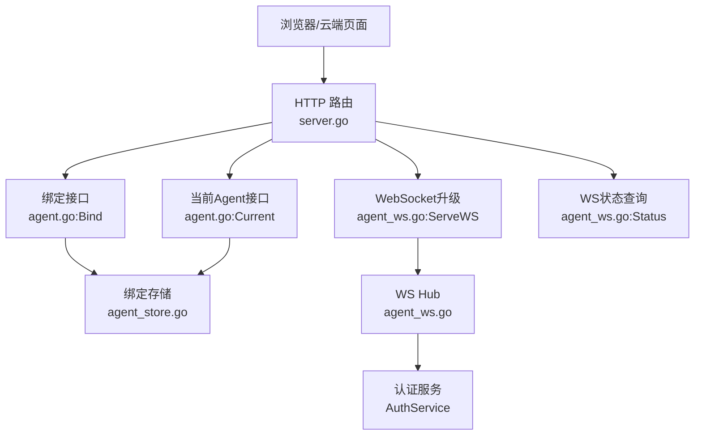
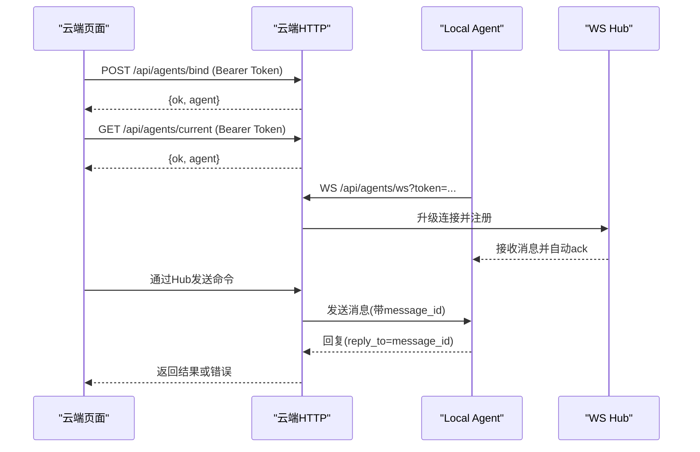
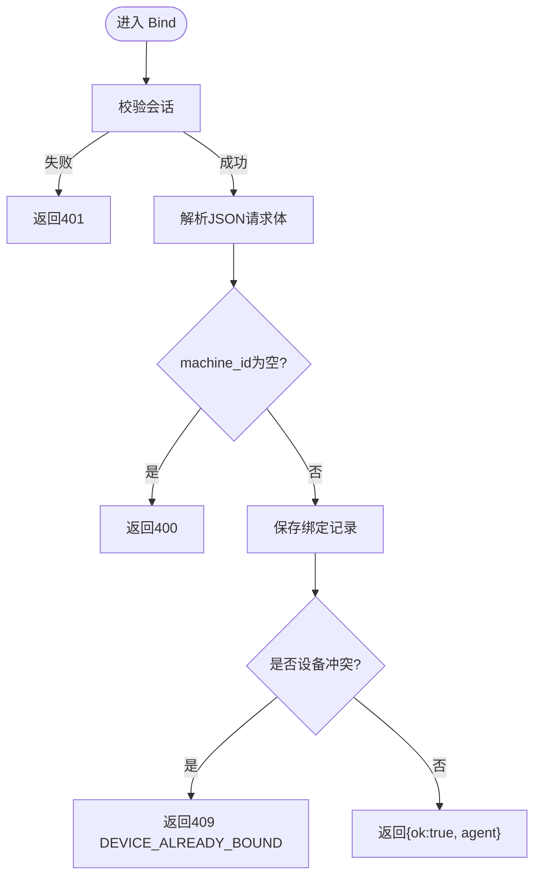
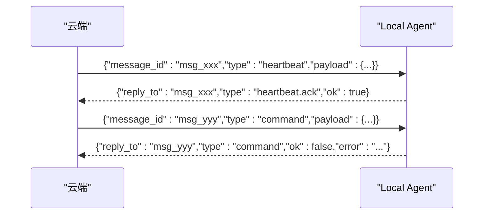
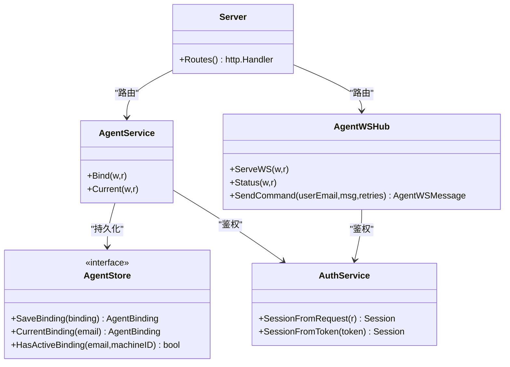

# 本地Agent管理API

<cite>
**本文引用的文件**
- [server.go](file://goodhr5/cloud/backend/internal/httpapi/server.go)
- [agent.go](file://goodhr5/cloud/backend/internal/httpapi/agent.go)
- [agent_store.go](file://goodhr5/cloud/backend/internal/httpapi/agent_store.go)
- [agent_ws.go](file://goodhr5/cloud/backend/internal/httpapi/agent_ws.go)
- [cloud-control-local-agent-architecture.md](file://docs/cloud-control-local-agent-architecture.md)
</cite>

## 目录
1. [简介](#简介)
2. [项目结构](#项目结构)
3. [核心组件](#核心组件)
4. [架构总览](#架构总览)
5. [详细接口说明](#详细接口说明)
6. [依赖关系分析](#依赖关系分析)
7. [性能与可靠性](#性能与可靠性)
8. [故障排查指南](#故障排查指南)
9. [结论](#结论)
10. [附录：完整示例流程](#附录完整示例流程)

## 简介
本文件面向“云端控制台 + 本地执行器（Local Agent）”的本地 Agent 管理 API，覆盖以下能力：
- 设备绑定：将当前登录用户的本地 Agent 机器与云端账号绑定。
- 状态查询：获取当前用户最近连接的本地 Agent 信息。
- WebSocket 实时通信：云端与 Local Agent 建立长连接，用于心跳、状态同步和远程命令下发。
- 错误处理与重试：统一的 JSON 错误格式、消息确认机制、超时重试策略。

该文档以代码实现为依据，给出协议规范、字段含义、调用时序和排错建议，帮助开发者快速对接云端与本地 Agent。

## 项目结构
云端后端在 Go 项目中提供 HTTP 路由与服务组装，关键路径如下：
- 路由注册：HTTP 路由统一在 Server 中注册，包含 /api/agents/bind、/api/agents/current、/api/agents/ws、/api/agents/ws-status。
- Agent 服务：负责绑定与查询逻辑，使用存储层保存绑定记录。
- WebSocket Hub：维护每个用户的唯一在线 Local Agent 连接，支持命令发送、回复等待、超时重试。

**图表来源**
- [server.go:149-153](file://goodhr5/cloud/backend/internal/httpapi/server.go#L149-L153)
- [agent.go:34-135](file://goodhr5/cloud/backend/internal/httpapi/agent.go#L34-L135)
- [agent_ws.go:54-97](file://goodhr5/cloud/backend/internal/httpapi/agent_ws.go#L54-L97)

**章节来源**
- [server.go:149-153](file://goodhr5/cloud/backend/internal/httpapi/server.go#L149-L153)

## 核心组件
- AgentService：处理绑定与当前 Agent 查询，校验会话并持久化绑定记录。
- AgentStore：定义绑定记录的保存、查询、冲突检测等能力；默认内存实现，生产可替换为 PostgreSQL。
- AgentWSHub：管理 WebSocket 连接，提供命令发送、回复匹配、超时重试、在线状态查询。
- AuthService：提供会话解析与鉴权，确保只有已登录用户才能绑定或查询。

**章节来源**
- [agent.go:11-32](file://goodhr5/cloud/backend/internal/httpapi/agent.go#L11-L32)
- [agent_store.go:24-43](file://goodhr5/cloud/backend/internal/httpapi/agent_store.go#L24-L43)
- [agent_ws.go:34-52](file://goodhr5/cloud/backend/internal/httpapi/agent_ws.go#L34-L52)

## 架构总览
云端通过 HTTP 暴露绑定与查询接口；通过 WebSocket 与 Local Agent 建立双向通道。Local Agent 主动连接云端，携带 token 完成鉴权；云端按用户维度维护唯一在线连接，新连接会替换旧连接。

**图表来源**
- [agent.go:34-135](file://goodhr5/cloud/backend/internal/httpapi/agent.go#L34-L135)
- [agent_ws.go:54-141](file://goodhr5/cloud/backend/internal/httpapi/agent_ws.go#L54-L141)

## 详细接口说明

### 通用约定
- 所有响应均为 JSON，成功时包含 ok 字段；失败时包含 error 字段。
- 需要认证的接口通过 Authorization: Bearer <access_token> 传递会话。
- CORS 允许跨域请求，便于前端访问本地 Agent 与云端。

**章节来源**
- [server.go:297-313](file://goodhr5/cloud/backend/internal/httpapi/server.go#L297-L313)
- [server.go:613-624](file://goodhr5/cloud/backend/internal/httpapi/server.go#L613-L624)

### 绑定接口：POST /api/agents/bind
- 功能：将当前登录用户的本地 Agent 机器与云端账号绑定。
- 请求体字段：
  - machine_id：必填，设备标识（稳定设备前缀为 goodhr-device-v1-）。
  - agent_version：可选，Agent 版本。
  - local_port：可选，本地监听端口。
  - public_key：可选，公钥（用于后续加密通信）。
- 成功响应：
  - ok: true
  - agent: 包含 machine_id、agent_version、local_port、public_key、bind_status、last_seen_at
- 错误处理：
  - 未登录：401 session is invalid or expired
  - 缺少 machine_id：400 machine_id is required
  - 设备冲突：409 DEVICE_ALREADY_BOUND（提示已被其他账号绑定）
  - 服务器错误：500 failed to bind agent

**图表来源**
- [agent.go:34-94](file://goodhr5/cloud/backend/internal/httpapi/agent.go#L34-L94)
- [agent_store.go:60-88](file://goodhr5/cloud/backend/internal/httpapi/agent_store.go#L60-L88)

**章节来源**
- [agent.go:34-94](file://goodhr5/cloud/backend/internal/httpapi/agent.go#L34-L94)
- [agent_store.go:60-88](file://goodhr5/cloud/backend/internal/httpapi/agent_store.go#L60-L88)

### 当前Agent接口：GET /api/agents/current
- 功能：返回当前登录用户最近连接的本地 Agent 信息。
- 成功响应：
  - ok: true
  - agent: 包含 machine_id、agent_version、local_port、public_key、bind_status、last_seen_at
- 无绑定时：
  - ok: true
  - agent: null
- 错误处理：
  - 未登录：401 session is invalid or expired
  - 服务器错误：500 failed to load agent

**章节来源**
- [agent.go:96-135](file://goodhr5/cloud/backend/internal/httpapi/agent.go#L96-L135)

### WebSocket 连接：/api/agents/ws
- 功能：Local Agent 主动连接云端，建立双向通信通道。
- 鉴权方式：
  - URL 参数 token 或 Authorization: Bearer <token>
- 行为特性：
  - 同一用户只保留一条在线连接，新连接会替换旧连接。
  - 连接成功后启动读循环与写循环。
  - 收到消息后自动回复 ack（type 追加 .ack），用于链路健康检查。
- 错误处理：
  - 未提供 token：401 missing token
  - 会话无效或过期：401 session is invalid or expired

**章节来源**
- [agent_ws.go:54-80](file://goodhr5/cloud/backend/internal/httpapi/agent_ws.go#L54-L80)

### WebSocket 状态查询：GET /api/agents/ws-status
- 功能：查询当前登录用户的 Local Agent WebSocket 是否在线。
- 成功响应：
  - ok: true
  - connected: true/false
- 错误处理：
  - 未登录：401 session is invalid or expired

**章节来源**
- [agent_ws.go:82-97](file://goodhr5/cloud/backend/internal/httpapi/agent_ws.go#L82-L97)

### WebSocket 消息协议
- 统一消息结构：
  - message_id：消息唯一标识（云端生成）
  - reply_to：回复对应的 message_id
  - type：消息类型（如 heartbeat、command、status 等）
  - position_id：岗位运行相关消息需填写
  - attempt：重试次数（云端发送时递增）
  - ok：布尔值，表示执行是否成功
  - error：错误信息（当 ok=false 时）
  - payload：业务数据（键值对）
- 自动确认机制：
  - 云端收到消息后，若存在 message_id，会自动回复 type 为 "<原type>.ack" 的确认消息。
- 超时与重试：
  - 云端发送命令后等待回复，默认超时时间为 90 秒。
  - 支持多次重试，每次重试 attempt 递增。

**图表来源**
- [agent_ws.go:21-32](file://goodhr5/cloud/backend/internal/httpapi/agent_ws.go#L21-L32)
- [agent_ws.go:194-217](file://goodhr5/cloud/backend/internal/httpapi/agent_ws.go#L194-L217)
- [agent_ws.go:325-350](file://goodhr5/cloud/backend/internal/httpapi/agent_ws.go#L325-L350)

**章节来源**
- [agent_ws.go:21-32](file://goodhr5/cloud/backend/internal/httpapi/agent_ws.go#L21-L32)
- [agent_ws.go:194-217](file://goodhr5/cloud/backend/internal/httpapi/agent_ws.go#L194-L217)
- [agent_ws.go:325-350](file://goodhr5/cloud/backend/internal/httpapi/agent_ws.go#L325-L350)

## 依赖关系分析
- 路由层：Server 将 /api/agents/* 路由到对应处理器。
- 认证层：所有 Agent 接口均通过 AuthService.SessionFromRequest 或 SessionFromToken 校验会话。
- 存储层：AgentStore 抽象了绑定记录的持久化，默认内存实现，支持冲突检测与开发模式放宽。
- WebSocket 层：AgentWSHub 维护用户维度的连接表，提供命令发送与回复匹配。

**图表来源**
- [server.go:16-45](file://goodhr5/cloud/backend/internal/httpapi/server.go#L16-L45)
- [agent.go:11-32](file://goodhr5/cloud/backend/internal/httpapi/agent.go#L11-L32)
- [agent_store.go:36-43](file://goodhr5/cloud/backend/internal/httpapi/agent_store.go#L36-L43)
- [agent_ws.go:34-52](file://goodhr5/cloud/backend/internal/httpapi/agent_ws.go#L34-L52)

**章节来源**
- [server.go:16-45](file://goodhr5/cloud/backend/internal/httpapi/server.go#L16-L45)

## 性能与可靠性
- 连接复用：每个用户仅保留一条在线 WebSocket 连接，避免多连接竞争。
- 超时控制：命令回复默认 90 秒超时，防止阻塞。
- 重试机制：支持多次重试，attempt 递增，便于定位问题。
- 并发安全：Hub 与 Client 使用互斥锁保护共享状态。
- 日志输出：关键步骤均有日志，便于追踪消息流向与错误原因。

[本节为通用性能讨论，不直接分析具体文件]

## 故障排查指南
- 绑定失败：
  - 检查是否已登录（401）。
  - 检查 machine_id 是否为空（400）。
  - 检查设备冲突（409），必要时由管理员解绑。
- WebSocket 连接失败：
  - 检查 token 是否正确（401）。
  - 检查服务端是否已升级连接。
- 命令无回复：
  - 检查 Local Agent 是否在线（ws-status）。
  - 检查消息类型与 payload 是否符合预期。
  - 查看服务端日志中的 message_id 与 attempt。

**章节来源**
- [agent.go:34-94](file://goodhr5/cloud/backend/internal/httpapi/agent.go#L34-L94)
- [agent_ws.go:54-97](file://goodhr5/cloud/backend/internal/httpapi/agent_ws.go#L54-L97)
- [agent_ws.go:325-350](file://goodhr5/cloud/backend/internal/httpapi/agent_ws.go#L325-L350)

## 结论
本地 Agent 管理 API 提供了清晰的设备绑定、状态查询与 WebSocket 实时通信能力。通过统一的 JSON 协议、自动 ack 机制与超时重试，确保了云端与 Local Agent 之间的可靠交互。开发者可基于本文档快速集成绑定流程、状态监控与指令下发。

[本节为总结性内容，不直接分析具体文件]

## 附录：完整示例流程

### 设备识别与绑定
- 本地 Agent 生成 machine_id（建议使用稳定前缀 goodhr-device-v1-）。
- 云端页面登录后调用 POST /api/agents/bind，提交 machine_id、agent_version、local_port、public_key。
- 云端保存绑定记录并返回 agent 信息。

**章节来源**
- [cloud-control-local-agent-architecture.md:181-244](file://docs/cloud-control-local-agent-architecture.md#L181-L244)
- [agent.go:34-94](file://goodhr5/cloud/backend/internal/httpapi/agent.go#L34-L94)

### 心跳检测与状态同步
- Local Agent 通过 WebSocket 连接云端，定期发送心跳消息。
- 云端自动回复 ack，保持链路健康。
- 云端可通过 ws-status 查询当前用户是否在线。

**章节来源**
- [agent_ws.go:54-97](file://goodhr5/cloud/backend/internal/httpapi/agent_ws.go#L54-L97)
- [agent_ws.go:194-217](file://goodhr5/cloud/backend/internal/httpapi/agent_ws.go#L194-L217)

### 远程命令下发与执行
- 云端通过 Hub.SendCommand 向 Local Agent 发送命令，指定 type、position_id、payload。
- Local Agent 执行后回复 ok 与 error。
- 云端支持重试与超时处理。

**章节来源**
- [agent_ws.go:111-141](file://goodhr5/cloud/backend/internal/httpapi/agent_ws.go#L111-L141)
- [agent_ws.go:325-350](file://goodhr5/cloud/backend/internal/httpapi/agent_ws.go#L325-L350)