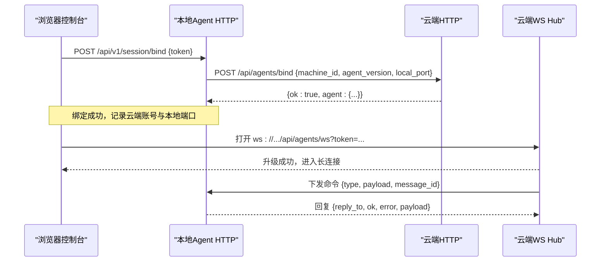
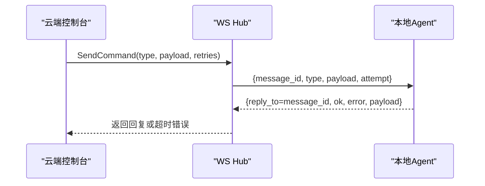
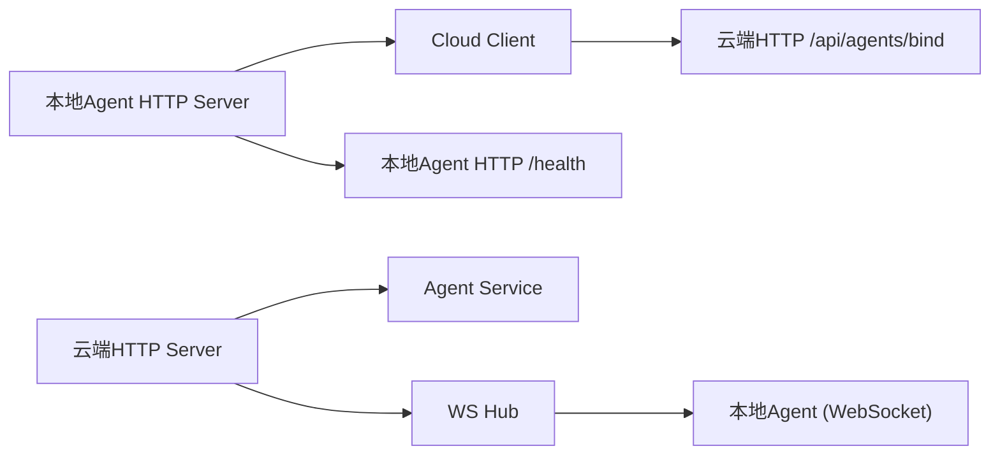

# 本地Agent管理API

<cite>
**本文引用的文件**
- [server.go](file://goodhr5/local-agent-go/internal/api/server.go)
- [agent_binding.go](file://goodhr5/local-agent-go/internal/api/agent_binding.go)
- [agent.go](file://goodhr5/cloud/backend/internal/httpapi/agent.go)
- [agent_ws.go](file://goodhr5/cloud/backend/internal/httpapi/agent_ws.go)
- [server.go](file://goodhr5/cloud/backend/internal/httpapi/server.go)
- [client.go](file://goodhr5/local-agent-go/internal/integration/cloud/client.go)
- [cloud-control-local-agent-architecture.md](file://docs/cloud-control-local-agent-architecture.md)
</cite>

## 目录
1. [简介](#简介)
2. [项目结构](#项目结构)
3. [核心组件](#核心组件)
4. [架构总览](#架构总览)
5. [接口规范详解](#接口规范详解)
6. [WebSocket协议与事件](#websocket协议与事件)
7. [设备识别与心跳机制](#设备识别与心跳机制)
8. [远程命令下发流程](#远程命令下发流程)
9. [依赖关系分析](#依赖关系分析)
10. [性能与可靠性](#性能与可靠性)
11. [故障排查指南](#故障排查指南)
12. [结论](#结论)

## 简介
本文件面向“本地Agent管理API”，覆盖Agent绑定、当前Agent信息查询、云端与本地Agent的WebSocket实时通信等能力。文档基于仓库中云端HTTP API与本地Agent HTTP服务实现，给出协议规范、消息格式、错误处理以及连接建立、状态同步、指令执行的完整示例路径。

## 项目结构
- 云端后端提供：
  - Agent绑定接口：POST /api/agents/bind
  - 当前Agent信息接口：GET /api/agents/current
  - WebSocket长连接：/api/agents/ws（用于云端向本地Agent下发命令并等待回复）
  - WebSocket在线状态查询：/api/agents/ws-status
- 本地Agent提供：
  - 健康检查：GET /health
  - 会话绑定入口：POST /api/v1/session/bind（将浏览器登录凭证转发到云端完成稳定设备绑定）
  - 运行态、任务、浏览器、Worker、OCR、下载、更新等本地能力接口（与本API文档相关的主要是绑定流程）

```mermaid
graph TB
subgraph "云端"
A["HTTP路由<br/>/api/agents/*"]
B["Agent服务<br/>Bind/Current"]
C["WS Hub<br/>ServeWS/Status"]
end
subgraph "本地Agent"
D["HTTP Server<br/>/api/v1/session/bind"]
E["Cloud Client<br/>调用 /api/agents/bind"]
end
A --> B
A --> C
D --> E
E --> A
C < --> D
```

图表来源
- [server.go:136-139](file://goodhr5/cloud/backend/internal/httpapi/server.go#L136-L139)
- [agent.go:35-135](file://goodhr5/cloud/backend/internal/httpapi/agent.go#L35-L135)
- [agent_ws.go:54-97](file://goodhr5/cloud/backend/internal/httpapi/agent_ws.go#L54-L97)
- [server.go:77-119](file://goodhr5/local-agent-go/internal/api/server.go#L77-L119)
- [client.go:63-85](file://goodhr5/local-agent-go/internal/integration/cloud/client.go#L63-L85)

章节来源
- [server.go:136-139](file://goodhr5/cloud/backend/internal/httpapi/server.go#L136-L139)
- [server.go:77-119](file://goodhr5/local-agent-go/internal/api/server.go#L77-L119)

## 核心组件
- 云端Agent服务
  - 负责保存当前登录用户的本地Agent绑定记录，并返回机器ID、版本、端口、公钥、绑定状态、最近可见时间等。
  - 提供当前用户最近绑定的Agent信息读取。
- 云端WebSocket Hub
  - 维护每个云端用户唯一在线的Local Agent连接，支持命令发送、重试、超时、ACK确认。
  - 提供在线状态查询。
- 本地Agent HTTP服务
  - 暴露健康检查与绑定入口，接收浏览器侧Token后调用云端完成绑定。
  - 通过Cloud Client访问云端REST接口。
- Cloud Client
  - 封装对云端REST的强类型调用，包括绑定、岗位、配置、统计等。

章节来源
- [agent.go:11-135](file://goodhr5/cloud/backend/internal/httpapi/agent.go#L11-L135)
- [agent_ws.go:21-170](file://goodhr5/cloud/backend/internal/httpapi/agent_ws.go#L21-L170)
- [server.go:35-119](file://goodhr5/local-agent-go/internal/api/server.go#L35-L119)
- [client.go:17-85](file://goodhr5/local-agent-go/internal/integration/cloud/client.go#L17-L85)

## 架构总览
本地Agent通过HTTP将浏览器登录凭证转发给云端完成设备绑定；随后云端与本地Agent之间通过WebSocket进行双向通信，云端可下发命令并等待本地回复，本地也可上报状态或结果。



图表来源
- [agent_binding.go:18-54](file://goodhr5/local-agent-go/internal/api/agent_binding.go#L18-L54)
- [client.go:63-85](file://goodhr5/local-agent-go/internal/integration/cloud/client.go#L63-L85)
- [agent_ws.go:54-97](file://goodhr5/cloud/backend/internal/httpapi/agent_ws.go#L54-L97)
- [agent_ws.go:111-141](file://goodhr5/cloud/backend/internal/httpapi/agent_ws.go#L111-L141)

## 接口规范详解

### 通用响应格式
- 成功响应
  - 结构：{ ok: true, data: ... }
- 失败响应
  - 结构：{ ok: false, error: { code: "...", message: "..." } }

说明
- 本地Agent HTTP统一使用writeSuccess/writeError输出上述格式。
- 云端HTTP在部分场景直接返回{ ok, agent }等结构，但错误通常以{ ok:false, error:"..." }形式返回。

章节来源
- [server.go:357-384](file://goodhr5/local-agent-go/internal/api/server.go#L357-L384)
- [agent.go:70-93](file://goodhr5/cloud/backend/internal/httpapi/agent.go#L70-L93)

### POST /api/agents/bind（云端：Agent绑定）
- 用途：保存当前登录用户的本地Agent连接记录，用于后续云端页面展示机器状态及远程命令下发。
- 认证：需要有效的云端会话（Bearer token）。
- 请求体字段
  - machine_id: string，必填，设备编号
  - agent_version: string，可选，Agent版本号
  - local_port: int，可选，本地Agent监听端口
  - public_key: string，可选，公钥
- 成功响应
  - { ok: true, agent: { machine_id, agent_version, local_port, public_key, bind_status, last_seen_at } }
- 错误码
  - 400：无效JSON或缺少machine_id
  - 401：会话无效或过期
  - 409：设备已绑定（DEVICE_ALREADY_BOUND）
  - 500：绑定失败

章节来源
- [agent.go:35-93](file://goodhr5/cloud/backend/internal/httpapi/agent.go#L35-L93)
- [server.go:136-139](file://goodhr5/cloud/backend/internal/httpapi/server.go#L136-L139)

### GET /api/agents/current（云端：当前Agent信息）
- 用途：返回当前登录用户最近连接的本地Agent信息。
- 认证：需要有效的云端会话（Bearer token）。
- 成功响应
  - 未绑定：{ ok: true, agent: null }
  - 已绑定：{ ok: true, agent: { machine_id, agent_version, local_port, public_key, bind_status, last_seen_at } }
- 错误码
  - 401：会话无效或过期
  - 500：加载失败

章节来源
- [agent.go:96-135](file://goodhr5/cloud/backend/internal/httpapi/agent.go#L96-L135)
- [server.go:136-139](file://goodhr5/cloud/backend/internal/httpapi/server.go#L136-L139)

### GET /api/agents/ws-status（云端：WebSocket在线状态）
- 用途：查询当前登录用户是否有在线的Local Agent WebSocket连接。
- 认证：需要有效的云端会话（Bearer token）。
- 成功响应
  - { ok: true, connected: boolean }
- 错误码
  - 401：会话无效或过期

章节来源
- [agent_ws.go:82-97](file://goodhr5/cloud/backend/internal/httpapi/agent_ws.go#L82-L97)
- [server.go:136-139](file://goodhr5/cloud/backend/internal/httpapi/server.go#L136-L139)

### POST /api/v1/session/bind（本地：会话绑定入口）
- 用途：本地Agent接收浏览器侧Token，读取本机设备编号，调用云端完成绑定。
- 请求体字段
  - token: string，必填，浏览器登录凭证
- 成功响应
  - { ok: true, data: { agent: {...} } }
- 错误码
  - 400：TOKEN_REQUIRED（Token为空）
  - 503：DEVICE_BINDING_UNAVAILABLE（绑定能力未就绪）
  - 500：DEVICE_ID_UNAVAILABLE（无法读取设备编号）
  - 502：DEVICE_BIND_FAILED（云端返回绑定失败）

章节来源
- [agent_binding.go:18-54](file://goodhr5/local-agent-go/internal/api/agent_binding.go#L18-L54)
- [client.go:63-85](file://goodhr5/local-agent-go/internal/integration/cloud/client.go#L63-L85)

### GET /health（本地：健康检查）
- 用途：检查本地Agent进程是否存活及基础信息。
- 成功响应
  - { ok: true, data: { status, version, agent_version, port, dataDir, logsDir, profilesDir, extensionsDir, extensionPaths, downloadsDir, screenshotsDir, dbPath } }

章节来源
- [server.go:137-161](file://goodhr5/local-agent-go/internal/api/server.go#L137-L161)

## WebSocket协议与事件

### 连接建立
- 地址：ws://<云端地址>/api/agents/ws
- 认证：URL参数token或Authorization头中的Bearer token
- 行为：同一用户仅保留一条在线连接，新连接会替换旧连接

章节来源
- [agent_ws.go:54-80](file://goodhr5/cloud/backend/internal/httpapi/agent_ws.go#L54-L80)

### 消息结构
- 统一消息体：AgentWSMessage
  - message_id: string，消息唯一标识
  - reply_to: string，可选，表示这是对哪条消息的回复
  - type: string，必填，消息类型
  - position_id: string，可选，岗位ID
  - attempt: int，可选，第几次尝试
  - ok: bool，可选，执行结果标志
  - error: string，可选，错误信息
  - payload: map[string]any，可选，业务负载

章节来源
- [agent_ws.go:21-32](file://goodhr5/cloud/backend/internal/httpapi/agent_ws.go#L21-L32)

### 事件类型与语义
- 下行命令：云端 -> 本地
  - type: 自定义业务类型（如启动任务、停止任务、截图、OCR等）
  - payload: 具体参数
  - 本地需回复 reply_to=message_id，type为原type + ".ack" 或直接携带业务结果
- 上行回复：本地 -> 云端
  - reply_to: 对应下行message_id
  - ok: true/false
  - error: 当ok=false时携带错误信息
  - payload: 业务数据

章节来源
- [agent_ws.go:194-217](file://goodhr5/cloud/backend/internal/httpapi/agent_ws.go#L194-L217)
- [agent_ws.go:325-350](file://goodhr5/cloud/backend/internal/httpapi/agent_ws.go#L325-L350)

### 重试与超时
- 云端发送命令默认超时90秒
- 支持多次重试，每次attempt递增
- 若本地无响应，云端返回超时错误

章节来源
- [agent_ws.go:19-19](file://goodhr5/cloud/backend/internal/httpapi/agent_ws.go#L19-L19)
- [agent_ws.go:111-141](file://goodhr5/cloud/backend/internal/httpapi/agent_ws.go#L111-L141)
- [agent_ws.go:325-350](file://goodhr5/cloud/backend/internal/httpapi/agent_ws.go#L325-L350)

### 错误处理
- 连接层：缺少token、会话无效、升级失败
- 应用层：本地返回ok=false并附带error
- 传输层：写入失败、队列满、连接关闭

章节来源
- [agent_ws.go:54-80](file://goodhr5/cloud/backend/internal/httpapi/agent_ws.go#L54-L80)
- [agent_ws.go:219-230](file://goodhr5/cloud/backend/internal/httpapi/agent_ws.go#L219-L230)
- [agent_ws.go:352-366](file://goodhr5/cloud/backend/internal/httpapi/agent_ws.go#L352-L366)

## 设备识别与心跳机制

### 设备识别
- 本地Agent在绑定前读取本机设备编号（machine_id），随绑定请求一起发送到云端。
- 云端保存machine_id、agent_version、local_port、public_key等信息，并记录last_seen_at。

章节来源
- [agent_binding.go:33-40](file://goodhr5/local-agent-go/internal/api/agent_binding.go#L33-L40)
- [agent.go:53-66](file://goodhr5/cloud/backend/internal/httpapi/agent.go#L53-L66)
- [cloud-control-local-agent-architecture.md:200-244](file://docs/cloud-control-local-agent-architecture.md#L200-L244)

### 心跳检测
- 代码中未发现显式的心跳定时上报逻辑。
- 实际心跳可通过以下方式体现：
  - WebSocket连接保持活跃，断开即视为离线
  - 云端WS Hub在收到消息时记录日志，可用于监控连通性
  - 绑定接口返回last_seen_at，可在未来扩展为周期性上报

章节来源
- [agent_ws.go:194-217](file://goodhr5/cloud/backend/internal/httpapi/agent_ws.go#L194-L217)
- [agent.go:82-93](file://goodhr5/cloud/backend/internal/httpapi/agent.go#L82-L93)

## 远程命令下发流程



图表来源
- [agent_ws.go:111-141](file://goodhr5/cloud/backend/internal/httpapi/agent_ws.go#L111-L141)
- [agent_ws.go:325-350](file://goodhr5/cloud/backend/internal/httpapi/agent_ws.go#L325-L350)

章节来源
- [agent_ws.go:111-141](file://goodhr5/cloud/backend/internal/httpapi/agent_ws.go#L111-L141)

## 依赖关系分析



图表来源
- [server.go:77-119](file://goodhr5/local-agent-go/internal/api/server.go#L77-L119)
- [client.go:63-85](file://goodhr5/local-agent-go/internal/integration/cloud/client.go#L63-L85)
- [server.go:136-139](file://goodhr5/cloud/backend/internal/httpapi/server.go#L136-L139)
- [agent.go:35-135](file://goodhr5/cloud/backend/internal/httpapi/agent.go#L35-L135)
- [agent_ws.go:54-97](file://goodhr5/cloud/backend/internal/httpapi/agent_ws.go#L54-L97)

章节来源
- [server.go:77-119](file://goodhr5/local-agent-go/internal/api/server.go#L77-L119)
- [server.go:136-139](file://goodhr5/cloud/backend/internal/httpapi/server.go#L136-L139)

## 性能与可靠性
- 超时控制：云端WS命令默认90秒超时，避免长期阻塞
- 重试机制：SendCommand支持retries参数，自动递增attempt并重试
- 并发安全：Hub使用互斥锁保护客户端映射，单用户单连接
- 资源清理：连接关闭时清理pending消息与通道，防止内存泄漏
- 限流与防护：本地HTTP限制请求体大小，禁用未知字段，严格CORS白名单

章节来源
- [agent_ws.go:19-19](file://goodhr5/cloud/backend/internal/httpapi/agent_ws.go#L19-L19)
- [agent_ws.go:111-141](file://goodhr5/cloud/backend/internal/httpapi/agent_ws.go#L111-L141)
- [agent_ws.go:143-169](file://goodhr5/cloud/backend/internal/httpapi/agent_ws.go#L143-L169)
- [agent_ws.go:395-413](file://goodhr5/cloud/backend/internal/httpapi/agent_ws.go#L395-L413)
- [server.go:342-355](file://goodhr5/local-agent-go/internal/api/server.go#L342-L355)
- [server.go:304-340](file://goodhr5/local-agent-go/internal/api/server.go#L304-L340)

## 故障排查指南
- 绑定失败
  - 检查本地Token是否为空（TOKEN_REQUIRED）
  - 检查绑定能力是否就绪（DEVICE_BINDING_UNAVAILABLE）
  - 检查设备编号是否可读（DEVICE_ID_UNAVAILABLE）
  - 查看云端返回的错误码（DEVICE_BIND_FAILED）
- WebSocket连接问题
  - 确认token有效且会话未过期
  - 检查是否已有同用户连接被替换
  - 观察写入失败与队列满情况
- 命令超时
  - 增加retries或延长超时
  - 检查本地是否及时回复reply_to
- 常见错误码
  - 400：请求格式错误或参数缺失
  - 401：会话无效或过期
  - 409：设备已绑定
  - 500/502/503：服务端内部错误或不可用

章节来源
- [agent_binding.go:20-54](file://goodhr5/local-agent-go/internal/api/agent_binding.go#L20-L54)
- [agent.go:47-93](file://goodhr5/cloud/backend/internal/httpapi/agent.go#L47-L93)
- [agent_ws.go:54-80](file://goodhr5/cloud/backend/internal/httpapi/agent_ws.go#L54-L80)
- [agent_ws.go:219-230](file://goodhr5/cloud/backend/internal/httpapi/agent_ws.go#L219-L230)
- [agent_ws.go:325-350](file://goodhr5/cloud/backend/internal/httpapi/agent_ws.go#L325-L350)

## 结论
本API体系通过“本地HTTP绑定 + 云端REST记录 + WebSocket长连接”的组合，实现了稳定的设备绑定、状态查询与远程命令下发。云端WS Hub提供可靠的命令发送、重试与超时控制，本地Agent通过统一的JSON消息结构与云端交互。建议在生产环境中补充心跳上报与更细粒度的错误码，以便更好地监控与排障。