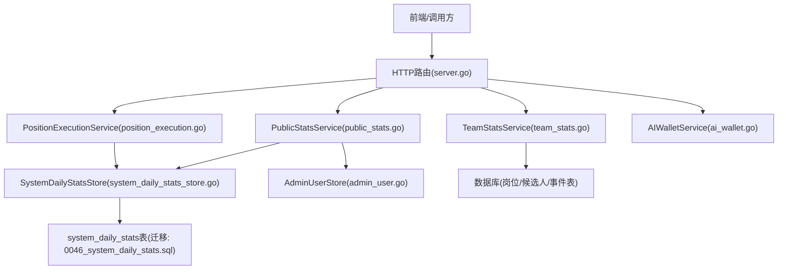
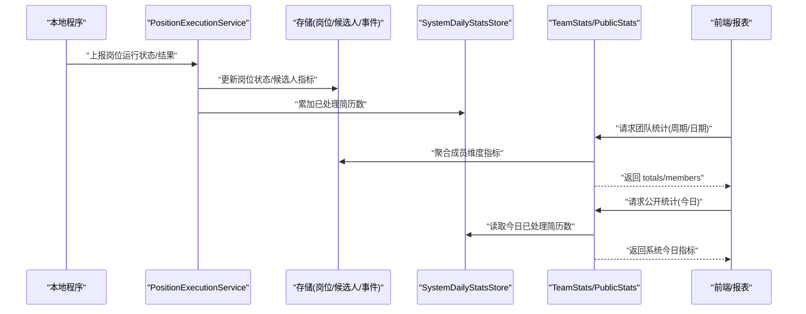
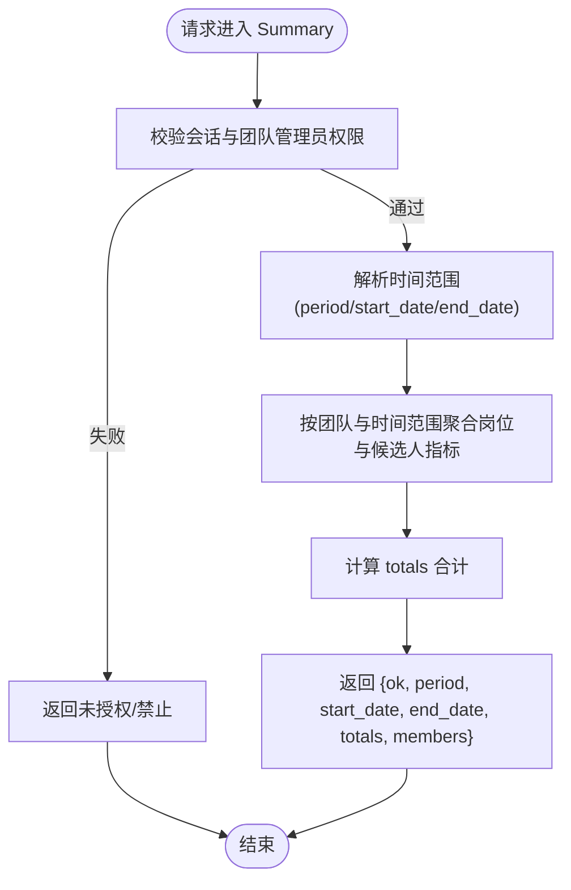
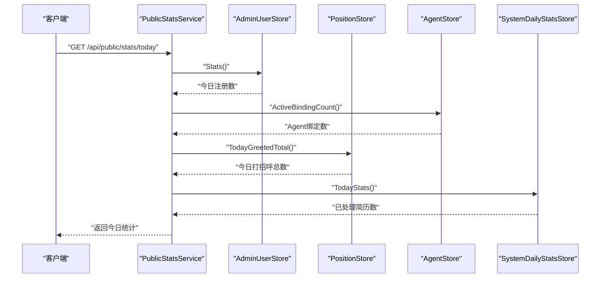
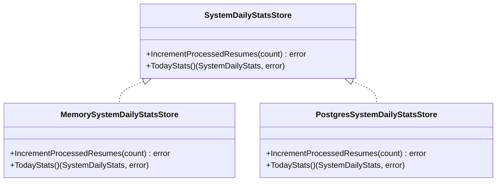
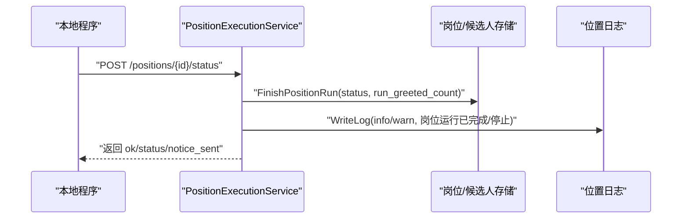
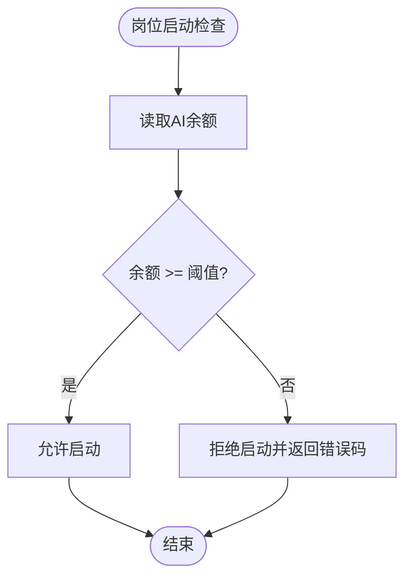
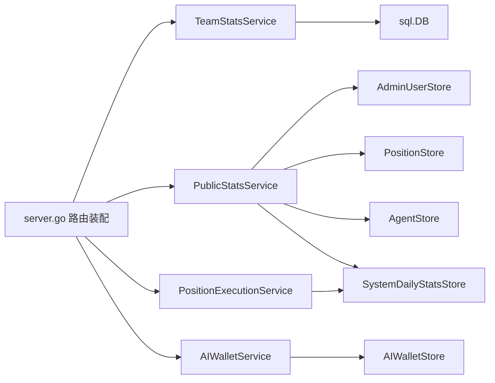

# 团队统计API

<cite>
**本文引用的文件**
- [team_stats.go](file://goodhr5/cloud/backend/internal/httpapi/team_stats.go)
- [public_stats.go](file://goodhr5/cloud/backend/internal/httpapi/public_stats.go)
- [system_daily_stats_store.go](file://goodhr5/cloud/backend/internal/httpapi/system_daily_stats_store.go)
- [0046_system_daily_stats.sql](file://goodhr5/cloud/backend/db/migrations/0046_system_daily_stats.sql)
- [position_execution.go](file://goodhr5/cloud/backend/internal/httpapi/position_execution.go)
- [ai_wallet.go](file://goodhr5/cloud/backend/internal/httpapi/ai_wallet.go)
- [admin_user.go](file://goodhr5/cloud/backend/internal/httpapi/admin_user.go)
- [server.go](file://goodhr5/cloud/backend/internal/httpapi/server.go)
</cite>

## 目录
1. [简介](#简介)
2. [项目结构](#项目结构)
3. [核心组件](#核心组件)
4. [架构总览](#架构总览)
5. [详细组件分析](#详细组件分析)
6. [依赖关系分析](#依赖关系分析)
7. [性能与大数据处理](#性能与大数据处理)
8. [故障排查指南](#故障排查指南)
9. [结论](#结论)
10. [附录：接口清单与使用示例](#附录接口清单与使用示例)

## 简介
本文件面向团队统计相关能力，提供团队数据聚合、成员活动统计、岗位运行统计、候选人处理量、AI使用量等指标的查询方法；说明实时数据统计、历史趋势分析与对比分析的实现方式；并给出数据缓存策略、查询优化方案、大数据量处理机制以及报表导出与图表数据获取建议。文档基于后端代码实现进行说明，确保与实际行为一致。

## 项目结构
团队统计能力由多个服务与存储组成：
- 团队统计服务：负责按时间范围聚合团队成员的岗位运行与候选人触达指标。
- 公开统计服务：面向官网展示系统级今日统计（如已处理简历数、今日打招呼数、注册数、Agent绑定数）。
- 系统按日统计存储：维护每日累计指标，支持内存与PostgreSQL两种实现。
- 岗位执行服务：接收本地程序同步的岗位运行状态与结果，驱动统计数据更新。
- AI钱包服务：管理内置AI余额与流水，支撑AI使用量统计与扣费。
- 用户管理统计：提供今日注册数与Agent绑定数等基础指标。
- 路由装配：将各服务挂载到HTTP路由中对外暴露。

**图示来源**
- [server.go:98-112](file://goodhr5/cloud/backend/internal/httpapi/server.go#L98-L112)
- [team_stats.go:12-66](file://goodhr5/cloud/backend/internal/httpapi/team_stats.go#L12-L66)
- [public_stats.go:6-69](file://goodhr5/cloud/backend/internal/httpapi/public_stats.go#L6-L69)
- [system_daily_stats_store.go:10-103](file://goodhr5/cloud/backend/internal/httpapi/system_daily_stats_store.go#L10-L103)
- [position_execution.go:21-47](file://goodhr5/cloud/backend/internal/httpapi/position_execution.go#L21-L47)
- [ai_wallet.go:79-126](file://goodhr5/cloud/backend/internal/httpapi/ai_wallet.go#L79-L126)
- [admin_user.go:630-741](file://goodhr5/cloud/backend/internal/httpapi/admin_user.go#L630-L741)
- [0046_system_daily_stats.sql:1-14](file://goodhr5/cloud/backend/db/migrations/0046_system_daily_stats.sql#L1-L14)

**章节来源**
- [server.go:98-112](file://goodhr5/cloud/backend/internal/httpapi/server.go#L98-L112)

## 核心组件
- TeamStatsService：提供团队统计汇总接口，支持按周期（今天、本周、本月、上月、自定义）聚合成员维度指标。
- PublicStatsService：提供官网公开统计接口，聚合用户注册、岗位打招呼、Agent绑定、系统按日统计等指标。
- SystemDailyStatsStore：按日累加“已处理简历数”，提供内存与PostgreSQL实现。
- PositionExecutionService：接收本地程序上报的岗位运行状态与结果，驱动统计数据更新与通知。
- AIWalletService：提供AI余额查询与流水记录，用于AI使用量统计与计费。
- AdminUserStore：提供今日注册用户数与Agent绑定数等统计。

**章节来源**
- [team_stats.go:12-66](file://goodhr5/cloud/backend/internal/httpapi/team_stats.go#L12-L66)
- [public_stats.go:6-69](file://goodhr5/cloud/backend/internal/httpapi/public_stats.go#L6-L69)
- [system_daily_stats_store.go:10-103](file://goodhr5/cloud/backend/internal/httpapi/system_daily_stats_store.go#L10-L103)
- [position_execution.go:21-47](file://goodhr5/cloud/backend/internal/httpapi/position_execution.go#L21-L47)
- [ai_wallet.go:79-126](file://goodhr5/cloud/backend/internal/httpapi/ai_wallet.go#L79-L126)
- [admin_user.go:630-741](file://goodhr5/cloud/backend/internal/httpapi/admin_user.go#L630-L741)

## 架构总览
团队统计工作流从数据采集到报表展示的端到端流程如下：
- 数据采集：本地程序在候选人处理完成后上报岗位运行状态与结果，云端写入岗位与候选人相关表，并累加系统按日统计。
- 指标聚合：团队统计接口通过SQL聚合岗位运行与候选人触达指标；公开统计接口聚合用户注册、打招呼、Agent绑定与系统按日统计。
- 指标消费：前端或报表系统调用团队统计与公开统计接口，获取成员维度与系统维度指标，用于看板与报表。
- 趋势与对比：通过传入不同时间周期参数（today/week/month/last_month/custom）实现实时、历史趋势与对比分析。

**图示来源**
- [position_execution.go:125-200](file://goodhr5/cloud/backend/internal/httpapi/position_execution.go#L125-L200)
- [system_daily_stats_store.go:68-103](file://goodhr5/cloud/backend/internal/httpapi/system_daily_stats_store.go#L68-L103)
- [team_stats.go:27-66](file://goodhr5/cloud/backend/internal/httpapi/team_stats.go#L27-L66)
- [public_stats.go:22-69](file://goodhr5/cloud/backend/internal/httpapi/public_stats.go#L22-L69)

## 详细组件分析

### 团队统计接口（Summary）
- 功能：返回当前团队在指定时间范围内的员工统计与总计。
- 权限：仅团队管理员可访问。
- 时间范围参数：
  - period：today、week、month、last_month、custom。默认 month。
  - start_date/end_date：当period为custom时生效，格式YYYY-MM-DD。
- 成员筛选条件：按团队ID过滤，未显式提供成员筛选字段；如需按成员筛选，可在调用前限定团队上下文。
- 统计数据维度：
  - 岗位运行：position_count、scanned_count、skipped_count、failed_count。
  - 候选人处理：resume_count、detail_count、greeted_count。
- 响应结构：包含period、start_date、end_date、totals（各项指标合计）、members（成员列表）。

**图示来源**
- [team_stats.go:27-66](file://goodhr5/cloud/backend/internal/httpapi/team_stats.go#L27-L66)
- [team_stats.go:137-166](file://goodhr5/cloud/backend/internal/httpapi/team_stats.go#L137-L166)
- [team_stats.go:70-133](file://goodhr5/cloud/backend/internal/httpapi/team_stats.go#L70-L133)

**章节来源**
- [team_stats.go:27-66](file://goodhr5/cloud/backend/internal/httpapi/team_stats.go#L27-L66)
- [team_stats.go:137-166](file://goodhr5/cloud/backend/internal/httpapi/team_stats.go#L137-L166)
- [team_stats.go:70-133](file://goodhr5/cloud/backend/internal/httpapi/team_stats.go#L70-L133)

### 公开统计接口（Today）
- 功能：返回官网首页需要展示的今日统计。
- 指标来源：
  - 今日注册数：来自用户管理统计。
  - 今日打招呼总数：来自岗位服务。
  - Agent绑定数：来自Agent存储。
  - 已处理简历数：来自系统按日统计存储。
- 响应结构：包含processed_resume_count、today_greeted_count、today_registered_count、agent_binding_count及对应标签字符串。

**图示来源**
- [public_stats.go:22-69](file://goodhr5/cloud/backend/internal/httpapi/public_stats.go#L22-L69)
- [admin_user.go:730-741](file://goodhr5/cloud/backend/internal/httpapi/admin_user.go#L730-L741)
- [system_daily_stats_store.go:88-103](file://goodhr5/cloud/backend/internal/httpapi/system_daily_stats_store.go#L88-L103)

**章节来源**
- [public_stats.go:22-69](file://goodhr5/cloud/backend/internal/httpapi/public_stats.go#L22-L69)
- [admin_user.go:730-741](file://goodhr5/cloud/backend/internal/httpapi/admin_user.go#L730-L741)

### 系统按日统计存储
- 功能：按日累加“已处理简历数”，并提供当日统计读取。
- 实现：
  - 内存实现：MemorySystemDailyStatsStore，适用于测试与本地开发。
  - PostgreSQL实现：PostgresSystemDailyStatsStore，使用ON CONFLICT DO UPDATE保证幂等累加。
- 表结构：stat_date主键，processed_resume_count计数，created_at/updated_at时间戳。

**图示来源**
- [system_daily_stats_store.go:10-103](file://goodhr5/cloud/backend/internal/httpapi/system_daily_stats_store.go#L10-L103)
- [0046_system_daily_stats.sql:1-14](file://goodhr5/cloud/backend/db/migrations/0046_system_daily_stats.sql#L1-L14)

**章节来源**
- [system_daily_stats_store.go:10-103](file://goodhr5/cloud/backend/internal/httpapi/system_daily_stats_store.go#L10-L103)
- [0046_system_daily_stats.sql:1-14](file://goodhr5/cloud/backend/db/migrations/0046_system_daily_stats.sql#L1-L14)

### 岗位运行统计与候选人处理量
- 岗位运行：本地程序通过PositionExecutionService上报运行状态与结果，包括完成、停止、运行中，并携带run_greeted_count与run_skipped_count。
- 候选人处理量：团队统计接口通过候选人与事件表聚合resume_count、detail_count、greeted_count。
- 指标联动：岗位完成时会触发邮件通知与日志记录，同时更新岗位状态与计数。

**图示来源**
- [position_execution.go:125-200](file://goodhr5/cloud/backend/internal/httpapi/position_execution.go#L125-L200)
- [team_stats.go:70-133](file://goodhr5/cloud/backend/internal/httpapi/team_stats.go#L70-L133)

**章节来源**
- [position_execution.go:125-200](file://goodhr5/cloud/backend/internal/httpapi/position_execution.go#L125-L200)
- [team_stats.go:70-133](file://goodhr5/cloud/backend/internal/httpapi/team_stats.go#L70-L133)

### AI使用量与余额
- AI余额：AIWalletService提供余额查询与流水记录，单位换算为元/分/单位。
- 使用量：AI调用会记录prompt_tokens与completion_tokens，可用于统计Token消耗。
- 启动限制：岗位启动前检查AI余额是否满足最低要求，不足则拒绝启动。

**图示来源**
- [ai_wallet.go:99-126](file://goodhr5/cloud/backend/internal/httpapi/ai_wallet.go#L99-L126)
- [position_execution.go:13-47](file://goodhr5/cloud/backend/internal/httpapi/position_execution.go#L13-L47)

**章节来源**
- [ai_wallet.go:99-126](file://goodhr5/cloud/backend/internal/httpapi/ai_wallet.go#L99-L126)
- [position_execution.go:13-47](file://goodhr5/cloud/backend/internal/httpapi/position_execution.go#L13-L47)

## 依赖关系分析
- 路由装配：server.go将各服务注入到HTTP路由中，统一对外暴露。
- 服务耦合：
  - TeamStatsService依赖AuthService、sql.DB、TenantStore。
  - PublicStatsService依赖AdminUserStore、PositionStore、AgentStore、SystemDailyStatsStore。
  - PositionExecutionService依赖多类存储与通知服务，驱动统计数据更新。
  - AIWalletService依赖AIWalletStore、AIConfigStore、SystemConfigStore。
- 外部依赖：PostgreSQL数据库、可能的Redis（未在本文直接体现）、邮件服务。

**图示来源**
- [server.go:98-112](file://goodhr5/cloud/backend/internal/httpapi/server.go#L98-L112)
- [team_stats.go:12-23](file://goodhr5/cloud/backend/internal/httpapi/team_stats.go#L12-L23)
- [public_stats.go:6-18](file://goodhr5/cloud/backend/internal/httpapi/public_stats.go#L6-L18)
- [position_execution.go:21-47](file://goodhr5/cloud/backend/internal/httpapi/position_execution.go#L21-L47)
- [ai_wallet.go:79-97](file://goodhr5/cloud/backend/internal/httpapi/ai_wallet.go#L79-L97)

**章节来源**
- [server.go:98-112](file://goodhr5/cloud/backend/internal/httpapi/server.go#L98-L112)

## 性能与大数据处理
- 查询优化：
  - 团队统计使用单次SQL聚合岗位与候选人指标，避免多次往返；对候选人与事件表建立索引以提升过滤与排序效率。
  - 系统按日统计使用ON CONFLICT DO UPDATE保证幂等累加，减少竞争与重复写入。
- 超时控制：
  - 团队统计查询设置5秒超时，防止长事务阻塞。
  - 系统按日统计读写设置3秒超时，保障高并发下的稳定性。
- 大数据量处理：
  - 分页与限制：AI钱包流水查询支持page/page_size限制，避免一次性加载过多数据。
  - 聚合粒度：团队统计按成员维度聚合，适合中等规模团队；超大规模可考虑物化视图或预聚合表。
- 缓存策略（建议）：
  - 公开统计接口可引入短期缓存（如1-5分钟），降低高频读压力。
  - 团队统计可按周期缓存（如月/周），结合失效策略（定时刷新或写后失效）。
- 监控与告警：
  - 对慢查询与错误率进行监控，结合日志定位瓶颈。
  - 对AI余额不足、岗位启动失败等关键路径进行告警。

[本节为通用指导，不直接分析具体文件]

## 故障排查指南
- 未授权/禁止：
  - 团队统计接口需团队管理员权限，会话无效或过期将返回未授权。
- 数据库错误：
  - 团队统计与公开统计在数据库不可用时返回内部错误，检查连接与迁移是否成功。
- 岗位运行异常：
  - 岗位启动前检查AI余额与本地程序版本，余额不足或版本过低将阻止启动。
- 通知发送失败：
  - 岗位完成时发送邮件通知，失败不影响状态更新但需关注日志。

**章节来源**
- [team_stats.go:27-50](file://goodhr5/cloud/backend/internal/httpapi/team_stats.go#L27-L50)
- [public_stats.go:22-69](file://goodhr5/cloud/backend/internal/httpapi/public_stats.go#L22-L69)
- [position_execution.go:51-91](file://goodhr5/cloud/backend/internal/httpapi/position_execution.go#L51-L91)

## 结论
团队统计API提供了完整的团队数据聚合与成员活动统计能力，支持多种时间周期与自定义范围，便于实现实时统计、历史趋势与对比分析。通过系统按日统计存储与岗位执行服务，实现了从数据采集到指标聚合的闭环。AI钱包与余额检查保障了AI使用的可控性与可计费性。建议在大规模场景下引入缓存与预聚合，进一步提升性能与可扩展性。

[本节为总结，不直接分析具体文件]

## 附录：接口清单与使用示例
- 团队统计接口
  - 方法：GET
  - 路径：/api/team/stats/summary
  - 参数：
    - period：today、week、month、last_month、custom（默认month）
    - start_date：YYYY-MM-DD（period=custom时有效）
    - end_date：YYYY-MM-DD（period=custom时有效）
  - 响应：{ok, period, start_date, end_date, totals, members}
  - 权限：团队管理员
  - 参考实现：[team_stats.go:27-66](file://goodhr5/cloud/backend/internal/httpapi/team_stats.go#L27-L66)

- 公开统计接口
  - 方法：GET
  - 路径：/api/public/stats/today
  - 响应：{ok, processed_resume_count, today_greeted_count, today_registered_count, agent_binding_count, ..._label}
  - 参考实现：[public_stats.go:22-69](file://goodhr5/cloud/backend/internal/httpapi/public_stats.go#L22-L69)

- AI余额与流水
  - 余额查询：GET /api/ai-wallet
  - 流水查询：GET /api/ai-wallet/records?page&page_size&email（超管可查他人）
  - 参考实现：[ai_wallet.go:99-172](file://goodhr5/cloud/backend/internal/httpapi/ai_wallet.go#L99-L172)

- 岗位运行状态同步
  - 启动：POST /api/positions/{id}/start
  - 停止：POST /api/positions/{id}/stop
  - 状态同步：POST /api/positions/{id}/status
  - 参考实现：[position_execution.go:51-200](file://goodhr5/cloud/backend/internal/httpapi/position_execution.go#L51-L200)

- 系统按日统计
  - 累加：IncrementProcessedResumes(count)
  - 读取：TodayStats()
  - 参考实现：[system_daily_stats_store.go:68-103](file://goodhr5/cloud/backend/internal/httpapi/system_daily_stats_store.go#L68-L103)

[本节为接口清单，不直接分析具体文件]