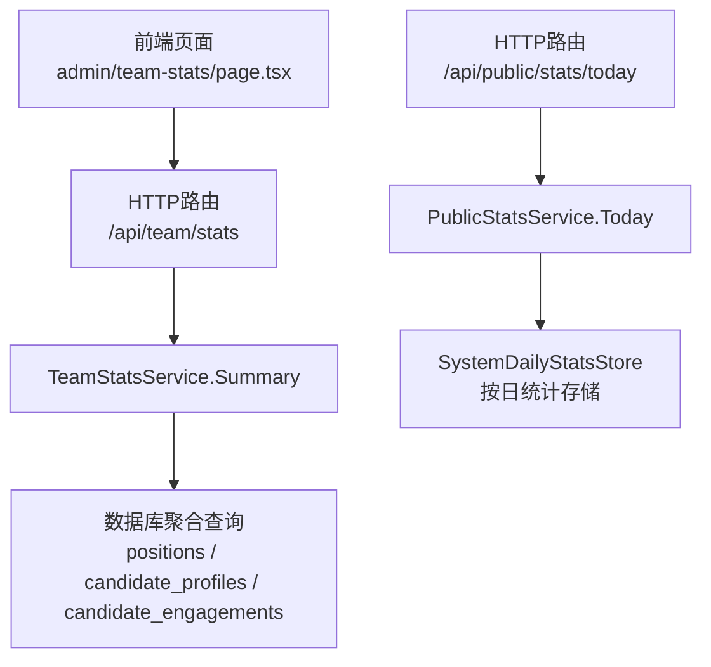
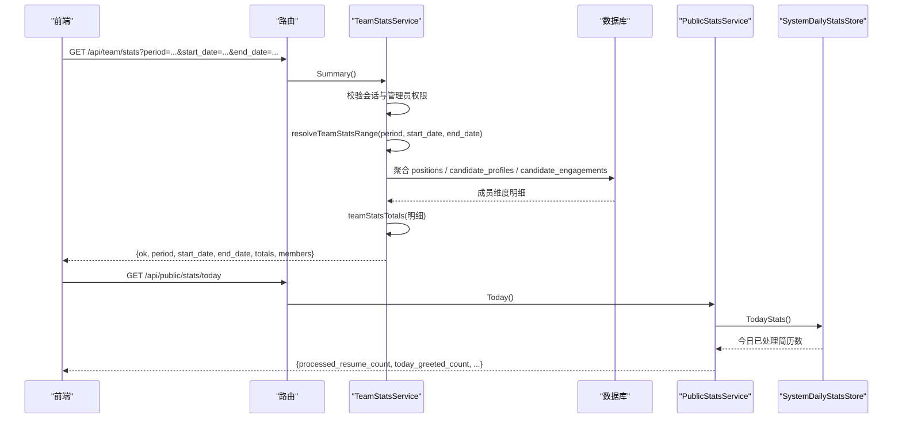
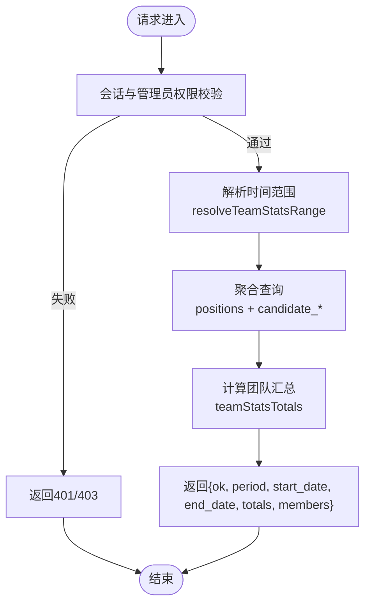
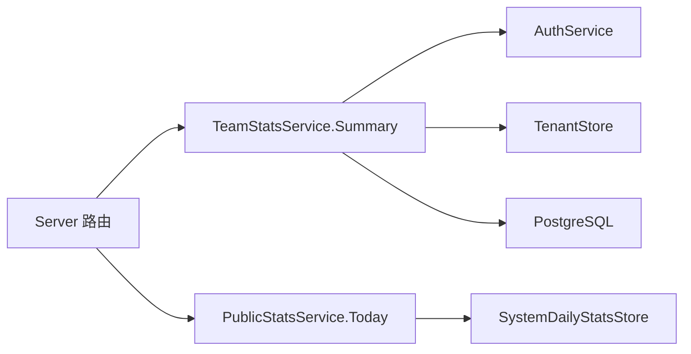

# 团队统计API

<cite>
**本文引用的文件**
- [team_stats.go](file://goodhr5/cloud/backend/internal/httpapi/team_stats.go)
- [server.go](file://goodhr5/cloud/backend/internal/httpapi/server.go)
- [public_stats.go](file://goodhr5/cloud/backend/internal/httpapi/public_stats.go)
- [system_daily_stats_store.go](file://goodhr5/cloud/backend/internal/httpapi/system_daily_stats_store.go)
- [position_execution.go](file://goodhr5/cloud/backend/internal/httpapi/position_execution.go)
- [page.tsx](file://goodhr5/cloud/frontend-next/app/admin/team-stats/page.tsx)
</cite>

## 目录
1. [简介](#简介)
2. [项目结构](#项目结构)
3. [核心组件](#核心组件)
4. [架构总览](#架构总览)
5. [详细组件分析](#详细组件分析)
6. [依赖关系分析](#依赖关系分析)
7. [性能与大数据量处理](#性能与大数据量处理)
8. [故障排查指南](#故障排查指南)
9. [结论](#结论)
10. [附录：接口规范与使用示例](#附录接口规范与使用示例)

## 简介
本文件面向“团队统计”相关能力，提供端到端的接口文档与实现说明。内容覆盖：
- 团队数据聚合、成员活动统计、岗位运行统计、候选人处理量等核心指标
- 时间范围参数、成员筛选条件、统计数据维度
- 实时数据统计、历史趋势分析、对比分析的实现方式
- 数据缓存策略、查询优化方案、大数据量处理机制
- 团队报表生成（Excel导出、图表数据）的扩展建议
- 从数据采集到报表展示的完整工作流

## 项目结构
后端通过统一的HTTP路由注册团队统计接口，前端在管理后台页面调用该接口并渲染统计卡片与明细表格。系统还维护按日统计用于公开展示和全局指标汇总。

**图示来源**
- [server.go:174](file://goodhr5/cloud/backend/internal/httpapi/server.go#L174)
- [team_stats.go:27-66](file://goodhr5/cloud/backend/internal/httpapi/team_stats.go#L27-L66)
- [public_stats.go:22-69](file://goodhr5/cloud/backend/internal/httpapi/public_stats.go#L22-L69)
- [system_daily_stats_store.go:17-20](file://goodhr5/cloud/backend/internal/httpapi/system_daily_stats_store.go#L17-L20)

**章节来源**
- [server.go:174](file://goodhr5/cloud/backend/internal/httpapi/server.go#L174)
- [team_stats.go:27-66](file://goodhr5/cloud/backend/internal/httpapi/team_stats.go#L27-L66)
- [public_stats.go:22-69](file://goodhr5/cloud/backend/internal/httpapi/public_stats.go#L22-L69)
- [system_daily_stats_store.go:17-20](file://goodhr5/cloud/backend/internal/httpapi/system_daily_stats_store.go#L17-L20)

## 核心组件
- TeamStatsService：负责团队维度的统计聚合，包含权限校验、时间范围解析、成员维度明细与总数汇总。
- PublicStatsService：负责官网公开统计，如今日已问候数、已处理简历数等。
- SystemDailyStatsStore：按日统计的存储抽象，提供内存与PostgreSQL两种实现，用于累计“已处理简历数”。
- PositionExecutionService：岗位执行服务，负责记录每次运行的候选人与处理结果，并可增量更新“已处理简历数”。

**章节来源**
- [team_stats.go:12-23](file://goodhr5/cloud/backend/internal/httpapi/team_stats.go#L12-L23)
- [public_stats.go:6-18](file://goodhr5/cloud/backend/internal/httpapi/public_stats.go#L6-L18)
- [system_daily_stats_store.go:10-20](file://goodhr5/cloud/backend/internal/httpapi/system_daily_stats_store.go#L10-L20)
- [position_execution.go:34-42](file://goodhr5/cloud/backend/internal/httpapi/position_execution.go#L34-L42)

## 架构总览
团队统计由“认证与授权 -> 时间范围解析 -> 多表聚合 -> 汇总输出”构成；公开统计则通过“按日统计存储 + 岗位今日问候总量”组合返回。

**图示来源**
- [team_stats.go:27-66](file://goodhr5/cloud/backend/internal/httpapi/team_stats.go#L27-L66)
- [team_stats.go:135-166](file://goodhr5/cloud/backend/internal/httpapi/team_stats.go#L135-L166)
- [team_stats.go:70-133](file://goodhr5/cloud/backend/internal/httpapi/team_stats.go#L70-L133)
- [public_stats.go:22-69](file://goodhr5/cloud/backend/internal/httpapi/public_stats.go#L22-L69)
- [system_daily_stats_store.go:50-102](file://goodhr5/cloud/backend/internal/httpapi/system_daily_stats_store.go#L50-L102)

## 详细组件分析

### 团队统计接口：GET /api/team/stats
- 功能：返回当前团队在指定时间范围内的员工统计与汇总。
- 鉴权：需要有效会话且为团队管理员。
- 时间范围参数：
  - period：today、week、month、last_month、custom；未传或非法时默认本月。
  - start_date、end_date：当 period=custom 时生效，格式为 YYYY-MM-DD。
- 返回字段：
  - ok：布尔值，表示请求是否成功。
  - period：实际使用的周期标识。
  - start_date、end_date：统计起止日期（闭区间）。
  - totals：团队级汇总指标，包括 position_count、scanned_count、resume_count、detail_count、greeted_count、skipped_count、failed_count。
  - members：成员维度明细列表，每项包含 email 及上述各指标。
- 数据来源：
  - 岗位运行：positions（创建时间与扫描/跳过/失败计数）。
  - 候选人处理：candidate_profiles（创建时间与简历数量）、candidate_engagements（详情抓取与问候时间）。
- 排序：优先按问候数降序，其次简历数降序，最后邮箱排序。

**图示来源**
- [team_stats.go:27-66](file://goodhr5/cloud/backend/internal/httpapi/team_stats.go#L27-L66)
- [team_stats.go:135-166](file://goodhr5/cloud/backend/internal/httpapi/team_stats.go#L135-L166)
- [team_stats.go:70-133](file://goodhr5/cloud/backend/internal/httpapi/team_stats.go#L70-L133)

**章节来源**
- [team_stats.go:27-66](file://goodhr5/cloud/backend/internal/httpapi/team_stats.go#L27-L66)
- [team_stats.go:70-133](file://goodhr5/cloud/backend/internal/httpapi/team_stats.go#L70-L133)
- [team_stats.go:135-166](file://goodhr5/cloud/backend/internal/httpapi/team_stats.go#L135-L166)

### 公开统计接口：GET /api/public/stats/today
- 功能：返回官网首页需要的今日统计，包括今日问候总数、已处理简历数、今日注册用户数、本地程序绑定数等。
- 数据来源：
  - 用户统计：AdminUserStore.Stats()
  - 岗位今日问候：PositionStore.TodayGreetedTotal()
  - 按日统计：SystemDailyStatsStore.TodayStats()
  - 本地程序绑定：AgentStore.ActiveBindingCount()

**章节来源**
- [public_stats.go:22-69](file://goodhr5/cloud/backend/internal/httpapi/public_stats.go#L22-L69)

### 按日统计存储：SystemDailyStatsStore
- 作用：累计并读取“已处理简历数”，支持内存与PostgreSQL两种实现。
- 关键方法：
  - IncrementProcessedResumes(count)：累加当天已处理简历数（count<=0忽略）。
  - TodayStats()：返回当日统计（若无记录则返回空对象）。
- PostgreSQL实现使用UPSERT保证并发安全与幂等性。

**章节来源**
- [system_daily_stats_store.go:10-20](file://goodhr5/cloud/backend/internal/httpapi/system_daily_stats_store.go#L10-L20)
- [system_daily_stats_store.go:36-56](file://goodhr5/cloud/backend/internal/httpapi/system_daily_stats_store.go#L36-L56)
- [system_daily_stats_store.go:68-102](file://goodhr5/cloud/backend/internal/httpapi/system_daily_stats_store.go#L68-L102)

### 岗位执行与AI使用量
- 岗位执行服务会记录每次运行的候选人与处理结果，并在合适时机增量更新“已处理简历数”。
- AI使用量通常通过AI钱包或平台配置进行计量，可在后续扩展中接入统一指标面板。

**章节来源**
- [position_execution.go:34-42](file://goodhr5/cloud/backend/internal/httpapi/position_execution.go#L34-L42)

### 前端统计页面
- 页面路径：admin/team-stats/page.tsx
- 行为：
  - 根据周期选择器与自定义日期构造查询参数。
  - 调用 /api/team/stats 获取数据。
  - 渲染顶部指标卡片与成员明细表格。
  - 无数据时显示“暂无数据，团队开始运行后将显示统计”。

**章节来源**
- [page.tsx:39-85](file://goodhr5/cloud/frontend-next/app/admin/team-stats/page.tsx#L39-L85)

## 依赖关系分析
- 路由注册：/api/team/stats 映射至 TeamStatsService.Summary。
- 团队统计依赖：
  - 认证与会话：AuthService.SessionFromRequest
  - 租户与权限：TenantStore.GetOrCreateTenant、IsTenantAdmin
  - 数据库：positions、candidate_profiles、candidate_engagements
- 公开统计依赖：
  - AdminUserStore、PositionStore、AgentStore、SystemDailyStatsStore

**图示来源**
- [server.go:174](file://goodhr5/cloud/backend/internal/httpapi/server.go#L174)
- [team_stats.go:27-66](file://goodhr5/cloud/backend/internal/httpapi/team_stats.go#L27-L66)
- [public_stats.go:22-69](file://goodhr5/cloud/backend/internal/httpapi/public_stats.go#L22-L69)

**章节来源**
- [server.go:174](file://goodhr5/cloud/backend/internal/httpapi/server.go#L174)
- [team_stats.go:27-66](file://goodhr5/cloud/backend/internal/httpapi/team_stats.go#L27-L66)
- [public_stats.go:22-69](file://goodhr5/cloud/backend/internal/httpapi/public_stats.go#L22-L69)

## 性能与大数据量处理
- 查询超时控制：团队统计聚合查询设置5秒上下文超时，避免长事务阻塞。
- 数据库聚合：
  - 使用LEFT JOIN与GROUP BY对岗位与候选人数据进行聚合。
  - 通过过滤条件限制时间范围，减少扫描行数。
- 并发与幂等：
  - 按日统计使用UPSERT，确保高并发下的正确性与幂等性。
- 缓存策略建议：
  - 对高频只读指标（如公开统计）可引入短期缓存（例如Redis），TTL与刷新策略需结合业务峰值。
  - 团队统计可按周期与租户维度缓存，注意权限隔离与失效策略。
- 分页与分片：
  - 若成员规模较大，可对 members 列表增加分页参数，降低单次响应体积。
  - 历史趋势分析可采用物化视图或预聚合表，按天/周/月粒度存储。
- 大数据量处理机制：
  - 将复杂聚合拆分为多次轻量查询，或使用异步任务离线计算后写入汇总表。
  - 对大表建立合适索引（如 created_at、tenant_id、user_id）以提升查询效率。

[本节为通用性能建议，不直接分析具体代码文件]

## 故障排查指南
- 401 未授权：会话无效或过期，检查登录态与Cookie/Token。
- 403 禁止访问：非团队管理员，确认当前用户是否为团队管理员。
- 500 服务器错误：
  - 数据库连接异常或SQL执行失败，检查数据库状态与慢查询。
  - 租户信息获取失败，检查租户配置与用户归属。
- 无数据：
  - 团队尚未运行或无岗位/候选人数据，等待数据产生后再查看。
- 公开统计异常：
  - 按日统计为空或增长异常，检查增量更新逻辑与数据库记录。

**章节来源**
- [team_stats.go:27-66](file://goodhr5/cloud/backend/internal/httpapi/team_stats.go#L27-L66)
- [public_stats.go:22-69](file://goodhr5/cloud/backend/internal/httpapi/public_stats.go#L22-L69)

## 结论
团队统计API以“权限校验 + 时间范围解析 + 多表聚合 + 汇总输出”为核心流程，提供成员维度明细与团队级指标。配合按日统计与岗位执行服务，可实现实时与历史趋势分析。通过合理的缓存、分页与预聚合策略，可支撑大规模数据场景。后续可扩展报表导出（Excel/CSV）与图表数据接口，完善统计分析闭环。

[本节为总结性内容，不直接分析具体代码文件]

## 附录：接口规范与使用示例

### 接口一：团队统计
- 方法：GET
- 路径：/api/team/stats
- 查询参数：
  - period：today | week | month | last_month | custom（默认 month）
  - start_date：YYYY-MM-DD（仅当 period=custom 时生效）
  - end_date：YYYY-MM-DD（仅当 period=custom 时生效）
- 响应体字段：
  - ok：boolean
  - period：string
  - start_date：string（YYYY-MM-DD）
  - end_date：string（YYYY-MM-DD）
  - totals：object，包含 position_count、scanned_count、resume_count、detail_count、greeted_count、skipped_count、failed_count
  - members：array，每项包含 email 与上述各指标
- 使用示例（前端）：
  - 选择周期或自定义日期，拼接URL参数调用接口，渲染 totals 与 members。

**章节来源**
- [team_stats.go:27-66](file://goodhr5/cloud/backend/internal/httpapi/team_stats.go#L27-L66)
- [team_stats.go:135-166](file://goodhr5/cloud/backend/internal/httpapi/team_stats.go#L135-L166)
- [page.tsx:39-85](file://goodhr5/cloud/frontend-next/app/admin/team-stats/page.tsx#L39-L85)

### 接口二：公开统计
- 方法：GET
- 路径：/api/public/stats/today
- 响应体字段：
  - processed_resume_count：number（已处理简历数）
  - today_greeted_count：number（今日问候总数）
  - today_registered_count：number（今日注册用户数）
  - agent_binding_count：number（本地程序绑定数）
  - 对应 label 字段用于展示格式化文本
- 使用示例：
  - 官网首页展示今日关键指标，无需登录即可访问。

**章节来源**
- [public_stats.go:22-69](file://goodhr5/cloud/backend/internal/httpapi/public_stats.go#L22-L69)

### 指标定义与维度
- 岗位运行统计：
  - position_count：统计期内创建的岗位数量
  - scanned_count：扫描总数
  - skipped_count：跳过总数
  - failed_count：失败总数
- 候选人处理量：
  - resume_count：新增简历数（按候选人档案创建时间）
  - detail_count：详情抓取次数（按 engagement 抓取时间）
  - greeted_count：问候次数（按 engagement 问候时间）
- 时间范围：
  - 左闭右开区间用于内部聚合，返回给前端的 start_date/end_date 为闭区间展示
- 成员筛选：
  - 当前实现按团队内所有成员聚合，如需按角色/部门筛选，可在查询层增加过滤条件

**章节来源**
- [team_stats.go:70-133](file://goodhr5/cloud/backend/internal/httpapi/team_stats.go#L70-L133)

### 实时统计、历史趋势与对比分析
- 实时统计：
  - 通过岗位执行服务增量更新“已处理简历数”，公开统计接口可反映最新值
- 历史趋势：
  - 基于 positions/candidate_* 的时间字段进行按日/周/月聚合，建议使用预聚合表提升性能
- 对比分析：
  - 支持不同周期（如本月 vs 上月）的数据对比，前端可通过两次查询合并展示

**章节来源**
- [system_daily_stats_store.go:68-102](file://goodhr5/cloud/backend/internal/httpapi/system_daily_stats_store.go#L68-L102)
- [team_stats.go:135-166](file://goodhr5/cloud/backend/internal/httpapi/team_stats.go#L135-L166)

### 报表导出与图表数据
- Excel导出：
  - 可将 members 与 totals 序列化为CSV/Excel，建议在服务端提供导出接口，支持按周期与成员筛选
- 图表数据：
  - 提供按日/周/月的趋势数据接口，便于前端图表库渲染
- 注意事项：
  - 导出与图表数据应遵循权限控制，避免越权访问
  - 大数据量导出需考虑异步任务与下载链接机制

[本节为扩展建议，不直接分析具体代码文件]