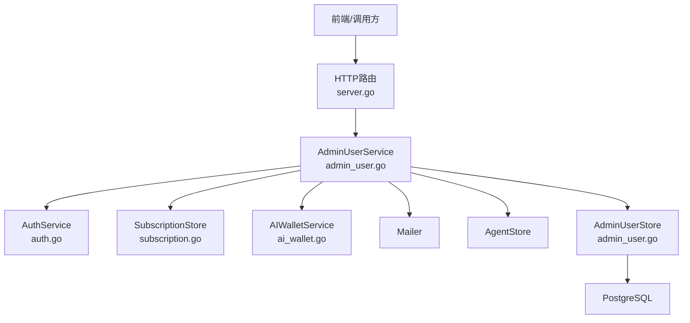
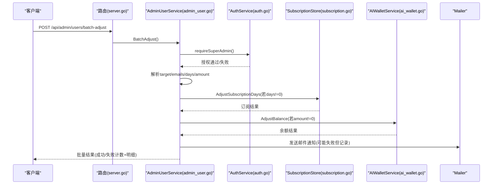
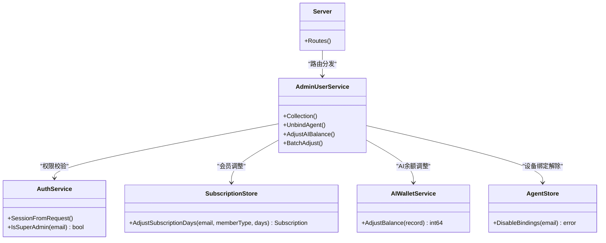

# 用户管理API

<cite>
**本文引用的文件**
- [server.go](file://goodhr5/cloud/backend/internal/httpapi/server.go)
- [admin_user.go](file://goodhr5/cloud/backend/internal/httpapi/admin_user.go)
- [auth.go](file://goodhr5/cloud/backend/internal/httpapi/auth.go)
- [subscription.go](file://goodhr5/cloud/backend/internal/httpapi/subscription.go)
- [ai_wallet.go](file://goodhr5/cloud/backend/internal/httpapi/ai_wallet.go)
- [postgres_user.go](file://goodhr5/cloud/backend/internal/httpapi/postgres_user.go)
</cite>

## 目录
1. [简介](#简介)
2. [项目结构](#项目结构)
3. [核心组件](#核心组件)
4. [架构总览](#架构总览)
5. [详细接口说明](#详细接口说明)
6. [依赖关系分析](#依赖关系分析)
7. [性能与可用性](#性能与可用性)
8. [故障排查指南](#故障排查指南)
9. [结论](#结论)

## 简介
本文件面向超级管理员，提供用户管理的后端API文档。覆盖以下能力：
- 超级管理员用户列表查询（分页、搜索）
- 单个用户信息获取（通过列表返回）
- 会员天数调整（支持正负天数与会员类型选择）
- AI余额调整（支持按分或按元输入）
- 批量调整（all目标与邮箱列表）
- 权限验证机制、错误处理策略
- 高级功能：设备绑定解除等

所有接口均要求携带有效的登录会话令牌（Bearer Token），并仅允许系统超级管理员访问。

## 项目结构
云端HTTP服务在统一路由中注册了管理员用户相关接口，并通过服务层组合认证、订阅、AI钱包、邮件通知等能力。

图表来源
- [server.go:123-166](file://goodhr5/cloud/backend/internal/httpapi/server.go#L123-L166)
- [admin_user.go:113-127](file://goodhr5/cloud/backend/internal/httpapi/admin_user.go#L113-L127)
- [auth.go:452-470](file://goodhr5/cloud/backend/internal/httpapi/auth.go#L452-L470)
- [subscription.go:34-48](file://goodhr5/cloud/backend/internal/httpapi/subscription.go#L34-L48)
- [ai_wallet.go:48-58](file://goodhr5/cloud/backend/internal/httpapi/ai_wallet.go#L48-L58)

章节来源
- [server.go:123-166](file://goodhr5/cloud/backend/internal/httpapi/server.go#L123-L166)

## 核心组件
- 认证与会话校验：从请求头解析Bearer Token，校验会话有效性，判断是否为超级管理员。
- 用户列表与统计：分页查询用户，支持关键词搜索；返回统计数据（今日注册数、Agent绑定数）。
- 会员调整：按正负天数调整到期时间，可选设置会员类型（Plus/Max），发送通知邮件。
- AI余额调整：按分或按元调整内置AI余额，写入流水并发送通知邮件。
- 批量调整：支持all目标（遍历全部用户）或指定邮箱列表，分别对会员和AI余额进行调整。
- 设备绑定解除：解除指定用户的全部有效设备占用，释放机器ID以便重新绑定其他账号。

章节来源
- [auth.go:452-470](file://goodhr5/cloud/backend/internal/httpapi/auth.go#L452-L470)
- [admin_user.go:151-189](file://goodhr5/cloud/backend/internal/httpapi/admin_user.go#L151-L189)
- [admin_user.go:191-227](file://goodhr5/cloud/backend/internal/httpapi/admin_user.go#L191-L227)
- [admin_user.go:266-317](file://goodhr5/cloud/backend/internal/httpapi/admin_user.go#L266-L317)
- [admin_user.go:319-397](file://goodhr5/cloud/backend/internal/httpapi/admin_user.go#L319-L397)
- [admin_user.go:229-264](file://goodhr5/cloud/backend/internal/httpapi/admin_user.go#L229-L264)

## 架构总览
管理员用户管理接口的调用流程如下：

图表来源
- [server.go:163-166](file://goodhr5/cloud/backend/internal/httpapi/server.go#L163-L166)
- [admin_user.go:319-397](file://goodhr5/cloud/backend/internal/httpapi/admin_user.go#L319-L397)
- [auth.go:452-470](file://goodhr5/cloud/backend/internal/httpapi/auth.go#L452-L470)
- [subscription.go:34-48](file://goodhr5/cloud/backend/internal/httpapi/subscription.go#L34-L48)
- [ai_wallet.go:48-58](file://goodhr5/cloud/backend/internal/httpapi/ai_wallet.go#L48-L58)

## 详细接口说明

### 通用说明
- 鉴权方式：请求头 Authorization: Bearer <token>
- 权限要求：必须为系统超级管理员
- 统一响应格式：
  - 成功：{"ok": true, ...}
  - 失败：{"ok": false, "error": "错误信息"}

章节来源
- [auth.go:452-470](file://goodhr5/cloud/backend/internal/httpapi/auth.go#L452-L470)
- [server.go:261-277](file://goodhr5/cloud/backend/internal/httpapi/server.go#L261-L277)

### GET /api/admin/users
超级管理员用户列表查询（分页、搜索）

- 方法：GET
- 路径：/api/admin/users
- 权限：超级管理员
- 查询参数：
  - page：页码，默认1，最小1
  - page_size：每页数量，默认20，范围1-100
  - q：搜索条件，模糊匹配邮箱、角色、状态、邀请人邮箱
- 返回字段：
  - ok：布尔
  - users：数组，元素包含：
    - id：字符串
    - email：字符串
    - role：字符串（user/admin/super_admin）
    - status：字符串（如active）
    - inviter_email：字符串
    - agent：对象或null（machine_id、agent_version、public_key、bind_status、last_seen_at、created_at）
    - subscription：对象（member_type、member_name、expires_at、active）
    - notification_profile：对象
    - ai_balance_units：整数（单位：0.0001元）
    - ai_balance_cents：整数（分）
    - ai_balance：字符串（元）
    - flow：对象
    - created_at：时间戳
    - last_login_at：时间戳或null
  - total：总数
  - page：当前页
  - page_size：每页数量
  - stats：对象（today_registered_count、agent_binding_count）

示例请求
- GET /api/admin/users?page=1&page_size=20&q=test@example.com

示例响应
- {"ok":true,"users":[...],"total":100,"page":1,"page_size":20,"stats":{"today_registered_count":5,"agent_binding_count":12}}

章节来源
- [server.go:163-163](file://goodhr5/cloud/backend/internal/httpapi/server.go#L163-L163)
- [admin_user.go:151-189](file://goodhr5/cloud/backend/internal/httpapi/admin_user.go#L151-L189)
- [admin_user.go:543-583](file://goodhr5/cloud/backend/internal/httpapi/admin_user.go#L543-L583)
- [admin_user.go:508-541](file://goodhr5/cloud/backend/internal/httpapi/admin_user.go#L508-L541)
- [subscription.go:121-135](file://goodhr5/cloud/backend/internal/httpapi/subscription.go#L121-L135)

### POST /api/admin/users
单个用户会员调整

- 方法：POST
- 路径：/api/admin/users
- 权限：超级管理员
- 请求体字段：
  - email：字符串（必填，标准邮箱）
  - days：整数（必填，非零，正数增加到期时间，负数减少）
  - member_type：字符串（可选，仅支持“Plus”或“Max”，为空则沿用当前会员类型）
  - reason：字符串（可选，为空时默认“超级管理员调整会员天数”）
- 返回字段：
  - ok：布尔
  - subscription：对象（member_type、member_name、expires_at、active）

示例请求
- {"email":"user@example.com","days":30,"member_type":"Plus","reason":"活动赠送"}

示例响应
- {"ok":true,"subscription":{"member_type":"Plus","member_name":"Plus会员","expires_at":"2026-01-01T00:00:00Z","active":true}}

章节来源
- [server.go:163-163](file://goodhr5/cloud/backend/internal/httpapi/server.go#L163-L163)
- [admin_user.go:191-227](file://goodhr5/cloud/backend/internal/httpapi/admin_user.go#L191-L227)
- [subscription.go:34-48](file://goodhr5/cloud/backend/internal/httpapi/subscription.go#L34-L48)

### POST /api/admin/users/adjust-ai-balance
单个用户AI余额调整

- 方法：POST
- 路径：/api/admin/users/adjust-ai-balance
- 权限：超级管理员
- 请求体字段：
  - email：字符串（必填，标准邮箱）
  - amount_cents：整数（可选，非零，单位为分）
  - amount_yuan：字符串（可选，与amount_cents二选一，例如“1.00”）
  - reason：字符串（可选，为空时默认“超级管理员调整AI余额”）
- 返回字段：
  - ok：布尔
  - balance_units：整数（调整后余额，单位：0.0001元）
  - balance_cents：整数（调整后余额，单位：分）
  - balance：字符串（调整后余额，单位：元）

示例请求
- {"email":"user@example.com","amount_yuan":"1.00","reason":"补偿"}

示例响应
- {"ok":true,"balance_units":10000,"balance_cents":100,"balance":"1.00"}

章节来源
- [server.go:165-165](file://goodhr5/cloud/backend/internal/httpapi/server.go#L165-L165)
- [admin_user.go:266-317](file://goodhr5/cloud/backend/internal/httpapi/admin_user.go#L266-L317)
- [ai_wallet.go:48-58](file://goodhr5/cloud/backend/internal/httpapi/ai_wallet.go#L48-L58)

### POST /api/admin/users/batch-adjust
批量调整会员天数与AI余额

- 方法：POST
- 路径：/api/admin/users/batch-adjust
- 权限：超级管理员
- 请求体字段：
  - target：字符串（必填，支持“all”表示全部用户；否则忽略）
  - emails：字符串数组（可选，支持逗号、中文逗号、换行、分号、空格分隔的多个邮箱；当target为all时会被清空）
  - days：整数（可选，非零时对每个用户执行会员调整）
  - amount_cents：整数（可选，非零时对每个用户执行AI余额调整）
  - amount_yuan：字符串（可选，与amount_cents二选一）
  - reason：字符串（可选，为空时默认“超级管理员批量调整”）
- 返回字段：
  - ok：布尔
  - total_count：总数
  - success_count：完全成功的用户数
  - failed_count：失败的用户数
  - results：数组，每项包含：
    - email：字符串
    - days_adjusted：布尔
    - balance_adjusted：布尔
    - errors：字符串数组（记录失败原因或通知邮件发送失败的提示）

示例请求
- {"target":"all","days":7,"amount_cents":100,"reason":"批量赠送"}

示例响应
- {"ok":true,"total_count":100,"success_count":98,"failed_count":2,"results":[{"email":"a@x.com","days_adjusted":true,"balance_adjusted":true,"errors":[]},{"email":"b@x.com","days_adjusted":false,"balance_adjusted":true,"errors":["会员天数调整失败：..."]}]}

章节来源
- [server.go:166-166](file://goodhr5/cloud/backend/internal/httpapi/server.go#L166-L166)
- [admin_user.go:319-397](file://goodhr5/cloud/backend/internal/httpapi/admin_user.go#L319-L397)

### POST /api/admin/users/unbind-agent
解除用户设备绑定

- 方法：POST
- 路径：/api/admin/users/unbind-agent
- 权限：超级管理员
- 请求体字段：
  - email：字符串（必填，标准邮箱）
- 返回字段：
  - ok：布尔

说明：该接口会解除指定用户的全部有效设备占用，使这些电脑可以重新绑定其他账号。

示例请求
- {"email":"user@example.com"}

示例响应
- {"ok":true}

章节来源
- [server.go:164-164](file://goodhr5/cloud/backend/internal/httpapi/server.go#L164-L164)
- [admin_user.go:229-264](file://goodhr5/cloud/backend/internal/httpapi/admin_user.go#L229-L264)

## 依赖关系分析
- 路由注册：/api/admin/users、/api/admin/users/unbind-agent、/api/admin/users/adjust-ai-balance、/api/admin/users/batch-adjust 由服务器统一注册。
- 权限校验：所有管理员接口通过 AuthService.SessionFromRequest 解析会话，并使用 IsSuperAdmin 进行权限控制。
- 数据源：
  - 用户列表与统计：AdminUserStore（内存/PostgreSQL实现）
  - 会员调整：SubscriptionStore（Extend/Adjust/Replace）
  - AI余额调整：AIWalletService（AdjustBalance、记录流水）
  - 设备绑定：AgentStore（DisableBindings）
- 通知：邮件通知在调整成功后尝试发送，失败不影响主流程，但会在批量结果中记录提示。

图表来源
- [server.go:123-166](file://goodhr5/cloud/backend/internal/httpapi/server.go#L123-L166)
- [admin_user.go:113-127](file://goodhr5/cloud/backend/internal/httpapi/admin_user.go#L113-L127)
- [auth.go:452-470](file://goodhr5/cloud/backend/internal/httpapi/auth.go#L452-L470)
- [subscription.go:34-48](file://goodhr5/cloud/backend/internal/httpapi/subscription.go#L34-L48)
- [ai_wallet.go:48-58](file://goodhr5/cloud/backend/internal/httpapi/ai_wallet.go#L48-L58)

章节来源
- [server.go:123-166](file://goodhr5/cloud/backend/internal/httpapi/server.go#L123-L166)
- [admin_user.go:113-127](file://goodhr5/cloud/backend/internal/httpapi/admin_user.go#L113-L127)

## 性能与可用性
- 分页与搜索：
  - 默认每页20条，最大100条；搜索条件q支持邮箱、角色、状态、邀请人邮箱模糊匹配。
  - PostgreSQL实现使用LIMIT/OFFSET与WHERE条件，查询超时保护（3秒）。
- 批量调整：
  - all目标会分页读取全部用户（每页100条），去重后排序处理。
  - 会员与AI余额调整可独立生效，任一失败不影响另一项。
- 通知邮件：
  - 调整成功后尝试发送邮件通知；若失败，不会回滚数据，仅在批量结果中记录提示。
- 错误处理：
  - 统一错误格式{"ok":false,"error":"..."}，便于前端展示。
  - 常见错误包括：会话无效、非超级管理员、参数非法、数据库错误、AI钱包未就绪等。

章节来源
- [admin_user.go:543-583](file://goodhr5/cloud/backend/internal/httpapi/admin_user.go#L543-L583)
- [admin_user.go:658-727](file://goodhr5/cloud/backend/internal/httpapi/admin_user.go#L658-L727)
- [admin_user.go:466-506](file://goodhr5/cloud/backend/internal/httpapi/admin_user.go#L466-L506)
- [server.go:261-277](file://goodhr5/cloud/backend/internal/httpapi/server.go#L261-L277)

## 故障排查指南
- 会话无效或过期：
  - 检查Authorization头是否包含Bearer Token；必要时重新登录获取新token。
- 非超级管理员：
  - 确认当前登录用户是否为系统超级管理员。
- 参数错误：
  - email需为标准邮箱；days不能为0；amount_cents与amount_yuan至少一个非零；member_type仅支持Plus或Max。
- 数据库或存储不可用：
  - 检查PostgreSQL连接、AI钱包服务、AgentStore是否就绪。
- 邮件通知失败：
  - 不影响数据变更，可在批量结果中看到提示；检查邮件服务配置。

章节来源
- [auth.go:452-470](file://goodhr5/cloud/backend/internal/httpapi/auth.go#L452-L470)
- [admin_user.go:191-227](file://goodhr5/cloud/backend/internal/httpapi/admin_user.go#L191-L227)
- [admin_user.go:266-317](file://goodhr5/cloud/backend/internal/httpapi/admin_user.go#L266-L317)
- [admin_user.go:319-397](file://goodhr5/cloud/backend/internal/httpapi/admin_user.go#L319-L397)

## 结论
本API为超级管理员提供了完整的用户管理能力，涵盖用户列表查询、会员调整、AI余额调整、批量操作及设备绑定解除。接口设计遵循统一的鉴权与错误处理规范，具备良好的可扩展性与可维护性。建议在生产环境结合监控与日志，关注批量调整成功率与邮件通知状态，确保运营操作的可靠性与可追溯性。