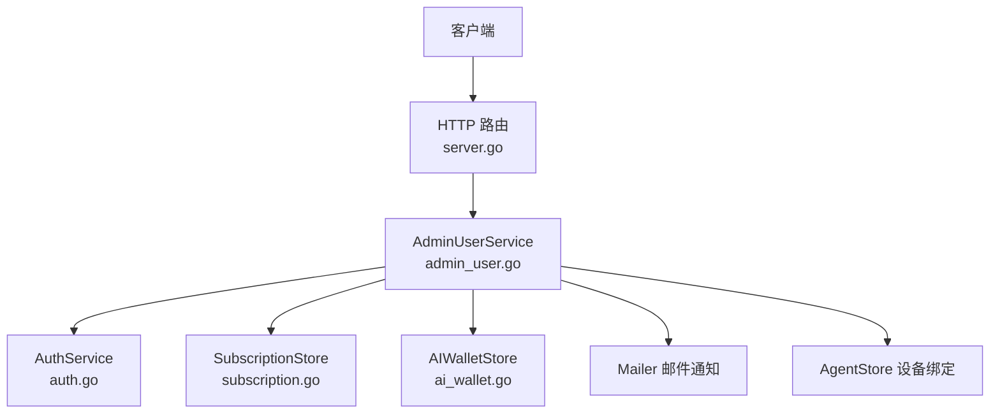
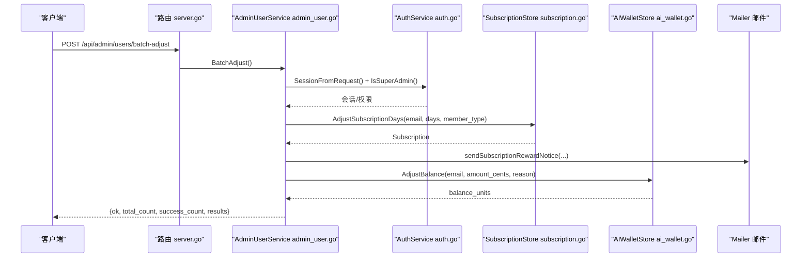
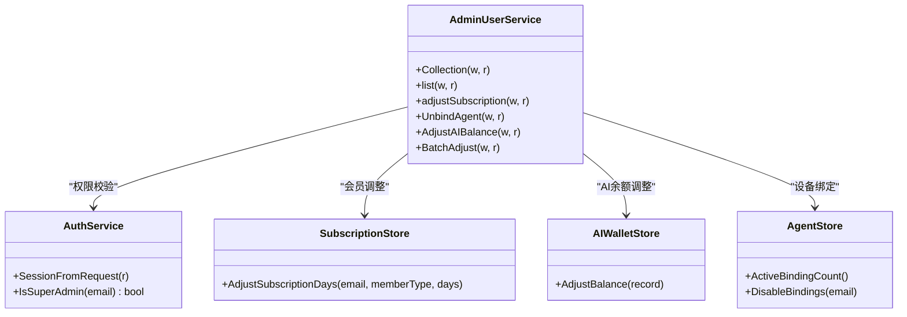

# 用户管理API

<cite>
**本文引用的文件**
- [admin_user.go](file://goodhr5/cloud/backend/internal/httpapi/admin_user.go)
- [server.go](file://goodhr5/cloud/backend/internal/httpapi/server.go)
- [auth.go](file://goodhr5/cloud/backend/internal/httpapi/auth.go)
- [ai_wallet.go](file://goodhr5/cloud/backend/internal/httpapi/ai_wallet.go)
- [subscription.go](file://goodhr5/cloud/backend/internal/httpapi/subscription.go)
</cite>

## 目录
1. [简介](#简介)
2. [项目结构](#项目结构)
3. [核心组件](#核心组件)
4. [架构总览](#架构总览)
5. [详细接口说明](#详细接口说明)
6. [依赖关系分析](#依赖关系分析)
7. [性能与可用性](#性能与可用性)
8. [故障排查指南](#故障排查指南)
9. [结论](#结论)

## 简介
本文件面向超级管理员，提供用户管理的后端 API 文档。覆盖以下能力：
- 查询用户列表（分页、搜索）
- 调整单个用户的会员天数与会员类型
- 调整单个用户的 AI 余额
- 批量调整（支持 all 目标与邮箱列表）
- 解除设备绑定
- 权限校验、错误处理策略与请求响应示例

所有接口均要求通过 Bearer Token 认证，且仅允许超级管理员访问。

## 项目结构
用户管理相关路由在 HTTP 服务中统一注册，由 AdminUserService 处理业务逻辑，并依赖认证、订阅、AI钱包、邮件通知等子系统。

**图表来源**
- [server.go:177-180](file://goodhr5/cloud/backend/internal/httpapi/server.go#L177-L180)
- [admin_user.go:114-127](file://goodhr5/cloud/backend/internal/httpapi/admin_user.go#L114-L127)
- [auth.go:617-716](file://goodhr5/cloud/backend/internal/httpapi/auth.go#L617-L716)
- [subscription.go:34-48](file://goodhr5/cloud/backend/internal/httpapi/subscription.go#L34-L48)
- [ai_wallet.go:48-58](file://goodhr5/cloud/backend/internal/httpapi/ai_wallet.go#L48-L58)

**章节来源**
- [server.go:177-180](file://goodhr5/cloud/backend/internal/httpapi/server.go#L177-L180)

## 核心组件
- 认证与会话：从请求头 Authorization 提取 Bearer Token，解析会话并校验是否为超级管理员。
- 用户列表与统计：分页查询用户，支持关键词搜索；返回统计数据（今日注册数、设备绑定数）。
- 会员调整：按正负天数调整到期时间，可选指定会员类型；发送通知邮件。
- AI余额调整：按分或元调整内置AI余额，写入流水并发送通知邮件。
- 批量调整：支持 target=all 或 emails 列表；分别对每个用户执行会员与AI余额调整，汇总结果。
- 设备绑定解除：禁用指定用户的全部有效设备绑定。

**章节来源**
- [admin_user.go:17-127](file://goodhr5/cloud/backend/internal/httpapi/admin_user.go#L17-L127)
- [auth.go:617-716](file://goodhr5/cloud/backend/internal/httpapi/auth.go#L617-L716)
- [subscription.go:18-48](file://goodhr5/cloud/backend/internal/httpapi/subscription.go#L18-L48)
- [ai_wallet.go:48-58](file://goodhr5/cloud/backend/internal/httpapi/ai_wallet.go#L48-L58)

## 架构总览
下图展示了典型调用链：客户端发起请求 -> 路由分发 -> 权限校验 -> 业务处理 -> 存储/通知 -> 响应。

**图表来源**
- [server.go:177-180](file://goodhr5/cloud/backend/internal/httpapi/server.go#L177-L180)
- [admin_user.go:319-397](file://goodhr5/cloud/backend/internal/httpapi/admin_user.go#L319-L397)
- [auth.go:617-716](file://goodhr5/cloud/backend/internal/httpapi/auth.go#L617-L716)
- [subscription.go:34-48](file://goodhr5/cloud/backend/internal/httpapi/subscription.go#L34-L48)
- [ai_wallet.go:48-58](file://goodhr5/cloud/backend/internal/httpapi/ai_wallet.go#L48-L58)

## 详细接口说明

### 通用约定
- 认证方式：请求头 Authorization: Bearer <token>
- 权限：仅超级管理员可调用
- 统一成功格式：{ ok: true, ... }
- 统一失败格式：{ ok: false, error: "..." }
- 错误码：常见为 400/401/403/404/500/424（支付相关）等

**章节来源**
- [auth.go:617-716](file://goodhr5/cloud/backend/internal/httpapi/auth.go#L617-L716)
- [server.go:297-313](file://goodhr5/cloud/backend/internal/httpapi/server.go#L297-L313)

---

### GET /api/admin/users
超级管理员用户列表查询（分页、搜索），同时返回统计数据。

- 方法：GET
- 路径：/api/admin/users
- 权限：超级管理员
- 查询参数
  - page：页码，默认 1，最小 1
  - page_size：每页数量，默认 20，范围 1..100
  - q：搜索关键词，模糊匹配 email、role、status、inviter_email
- 响应字段
  - ok：布尔
  - users：数组，元素为用户对象
  - total：总数
  - page：当前页
  - page_size：每页大小
  - stats：统计信息
    - today_registered_count：今日注册用户数
    - agent_binding_count：活跃设备绑定数

用户对象字段（部分）
- id、email、role、status、inviter_email
- agent：本地程序绑定信息（machine_id、agent_version、public_key、bind_status、last_seen_at、created_at）
- subscription：会员状态（member_type、expires_at、active）
- notification_profile：通知配置
- ai_balance_units、ai_balance_cents、ai_balance：AI余额（单位转换）
- flow：用户流程状态
- created_at、last_login_at

请求示例
- GET /api/admin/users?page=1&page_size=20&q=test@example.com

响应示例
- {
    "ok": true,
    "users": [...],
    "total": 123,
    "page": 1,
    "page_size": 20,
    "stats": {
      "today_registered_count": 5,
      "agent_binding_count": 10
    }
  }

**章节来源**
- [admin_user.go:151-189](file://goodhr5/cloud/backend/internal/httpapi/admin_user.go#L151-L189)
- [admin_user.go:543-583](file://goodhr5/cloud/backend/internal/httpapi/admin_user.go#L543-L583)
- [admin_user.go:508-541](file://goodhr5/cloud/backend/internal/httpapi/admin_user.go#L508-L541)

---

### POST /api/admin/users
调整单个用户的会员天数与会员类型。

- 方法：POST
- 路径：/api/admin/users
- 权限：超级管理员
- 请求体
  - email：用户邮箱（必须合法）
  - days：调整天数（整数，可为正或负，不能为 0）
  - member_type：会员类型（可选，支持 Plus 或 Pro；为空则沿用现有类型）
  - reason：操作原因（可选，为空时默认“超级管理员调整会员天数”）
- 响应
  - ok：布尔
  - subscription：调整后订阅信息（member_type、expires_at、active）

请求示例
- {
    "email": "user@example.com",
    "days": 30,
    "member_type": "Pro",
    "reason": "活动赠送"
  }

响应示例
- {
    "ok": true,
    "subscription": {
      "member_type": "Pro",
      "expires_at": "2026-01-01T00:00:00Z",
      "active": true
    }
  }

注意
- 若邮件通知发送失败，会返回特定错误类型，但会员天数已调整成功。

**章节来源**
- [admin_user.go:191-227](file://goodhr5/cloud/backend/internal/httpapi/admin_user.go#L191-L227)
- [admin_user.go:413-428](file://goodhr5/cloud/backend/internal/httpapi/admin_user.go#L413-L428)

---

### POST /api/admin/users/adjust-ai-balance
调整单个用户的内置 AI 余额。

- 方法：POST
- 路径：/api/admin/users/adjust-ai-balance
- 权限：超级管理员
- 请求体
  - email：用户邮箱（必须合法）
  - amount_cents：以分为单位的金额（整数，非零）
  - amount_yuan：以元为单位的金额文本（与 amount_cents 二选一）
  - reason：操作原因（可选，为空时默认“超级管理员调整AI余额”）
- 响应
  - ok：布尔
  - balance_units：调整后余额（单位：0.0001元）
  - balance_cents：调整后余额（分）
  - balance：调整后余额（元字符串）

请求示例
- {
    "email": "user@example.com",
    "amount_yuan": "10.00",
    "reason": "补偿"
  }

响应示例
- {
    "ok": true,
    "balance_units": 100000,
    "balance_cents": 1000,
    "balance": "10.00"
  }

**章节来源**
- [admin_user.go:266-317](file://goodhr5/cloud/backend/internal/httpapi/admin_user.go#L266-L317)
- [ai_wallet.go:48-58](file://goodhr5/cloud/backend/internal/httpapi/ai_wallet.go#L48-L58)

---

### POST /api/admin/users/batch-adjust
批量调整多个用户的会员天数与 AI 余额。

- 方法：POST
- 路径：/api/admin/users/batch-adjust
- 权限：超级管理员
- 请求体
  - target：目标选择，支持 "all" 表示全部用户；或留空配合 emails 使用
  - emails：邮箱列表，支持多种分隔符（逗号、中文逗号、换行、分号、空格），自动去重与规范化；若包含 "all" 也视为全部
  - days：调整天数（整数，可为正或负，与 amount_cents 至少填一个）
  - amount_cents：以分为单位的金额（整数，可为 0）
  - amount_yuan：以元为单位的金额文本（与 amount_cents 二选一）
  - reason：操作原因（可选，为空时默认“超级管理员批量调整”）
- 响应
  - ok：布尔
  - total_count：处理用户总数
  - success_count：完全成功的用户数
  - failed_count：失败的用户数
  - results：每个用户的调整结果
    - email：邮箱
    - days_adjusted：是否已调整会员天数
    - balance_adjusted：是否已调整AI余额
    - errors：错误信息列表（如通知邮件发送失败等）

请求示例
- {
    "target": "all",
    "emails": [],
    "days": 7,
    "amount_cents": 0,
    "reason": "系统维护补偿"
  }

响应示例
- {
    "ok": true,
    "total_count": 100,
    "success_count": 98,
    "failed_count": 2,
    "results": [
      {
        "email": "u1@example.com",
        "days_adjusted": true,
        "balance_adjusted": false,
        "errors": []
      },
      {
        "email": "u2@example.com",
        "days_adjusted": true,
        "balance_adjusted": true,
        "errors": ["AI 余额已调整，但通知邮件发送失败"]
      }
    ]
  }

**章节来源**
- [admin_user.go:319-397](file://goodhr5/cloud/backend/internal/httpapi/admin_user.go#L319-L397)
- [admin_user.go:455-506](file://goodhr5/cloud/backend/internal/httpapi/admin_user.go#L455-L506)

---

### POST /api/admin/users/unbind-agent
解除指定用户的全部有效设备绑定。

- 方法：POST
- 路径：/api/admin/users/unbind-agent
- 权限：超级管理员
- 请求体
  - email：用户邮箱（必须合法）
- 响应
  - ok：布尔

请求示例
- {
    "email": "user@example.com"
  }

响应示例
- {
    "ok": true
  }

**章节来源**
- [admin_user.go:229-264](file://goodhr5/cloud/backend/internal/httpapi/admin_user.go#L229-L264)

---

### 权限验证机制
- 所有管理接口均通过 AuthService.SessionFromRequest 解析 Bearer Token，并通过 IsSuperAdmin 校验是否为超级管理员。
- 未登录或会话过期返回 401；非超管返回 403。

**章节来源**
- [auth.go:617-716](file://goodhr5/cloud/backend/internal/httpapi/auth.go#L617-L716)
- [admin_user.go:129-149](file://goodhr5/cloud/backend/internal/httpapi/admin_user.go#L129-L149)
- [admin_user.go:399-411](file://goodhr5/cloud/backend/internal/httpapi/admin_user.go#L399-L411)

---

### 错误处理策略
- 参数校验失败：400 Bad Request（如非法邮箱、金额为 0、JSON 无效）
- 权限不足：401 Unauthorized 或 403 Forbidden
- 业务异常：500 Internal Server Error（数据库/存储不可用、内部错误）
- 通知邮件失败：会员/AI余额可能已成功调整，但会在结果中记录错误提示（用于区分数据变更与通知失败）

**章节来源**
- [server.go:297-313](file://goodhr5/cloud/backend/internal/httpapi/server.go#L297-L313)
- [admin_user.go:191-227](file://goodhr5/cloud/backend/internal/httpapi/admin_user.go#L191-L227)
- [admin_user.go:319-397](file://goodhr5/cloud/backend/internal/httpapi/admin_user.go#L319-L397)

---

### 用户状态管理与高级功能
- 用户状态：列表返回 status 字段，可用于前端展示与筛选。
- 设备绑定：可通过 UnbindAgent 解除绑定，便于释放设备占用。
- 通知配置：notification_profile 字段反映用户通知偏好。
- 流程状态：flow 字段用于跟踪用户引导/激活流程。

**章节来源**
- [admin_user.go:17-31](file://goodhr5/cloud/backend/internal/httpapi/admin_user.go#L17-L31)
- [admin_user.go:229-264](file://goodhr5/cloud/backend/internal/httpapi/admin_user.go#L229-L264)

## 依赖关系分析
- AdminUserService 依赖：
  - AuthService：会话解析与超管判断
  - SubscriptionStore：会员天数调整与套餐信息
  - AIWalletStore：AI余额调整与流水记录
  - Mailer：发送会员与AI余额调整通知
  - AgentStore：设备绑定计数与解除绑定
- 路由注册：Server.Routes 将 /api/admin/* 映射到对应处理器。

**图表来源**
- [admin_user.go:114-127](file://goodhr5/cloud/backend/internal/httpapi/admin_user.go#L114-L127)
- [auth.go:617-716](file://goodhr5/cloud/backend/internal/httpapi/auth.go#L617-L716)
- [subscription.go:34-48](file://goodhr5/cloud/backend/internal/httpapi/subscription.go#L34-L48)
- [ai_wallet.go:48-58](file://goodhr5/cloud/backend/internal/httpapi/ai_wallet.go#L48-L58)

**章节来源**
- [server.go:177-180](file://goodhr5/cloud/backend/internal/httpapi/server.go#L177-L180)
- [admin_user.go:114-127](file://goodhr5/cloud/backend/internal/httpapi/admin_user.go#L114-L127)

## 性能与可用性
- 列表查询：
  - 分页参数限制：page_size 最大 100，避免大结果集拖慢响应。
  - 搜索条件：q 对 email、role、status、inviter_email 进行模糊匹配，建议在大数据量下结合分页使用。
- 批量调整：
  - 支持 all 目标时，服务端分页拉取全部用户邮箱（每批 100），再逐一调整。
  - 每个用户独立处理，部分失败不影响其他用户；结果汇总返回。
- 通知邮件：
  - 邮件发送失败不阻断数据调整，仅在结果中记录错误，保证数据一致性。

[本节为通用指导，无需代码引用]

## 故障排查指南
- 401 Unauthorized：检查 Authorization 头是否正确携带 Bearer Token，确认会话未过期。
- 403 Forbidden：确认当前用户是否为超级管理员。
- 400 Bad Request：检查请求体字段是否完整、邮箱格式是否合法、金额是否为零、JSON 是否有效。
- 500 Internal Server Error：检查数据库连接、存储实现是否就绪；查看日志中的具体错误信息。
- 通知邮件失败：检查邮件服务配置；关注批量结果中的 errors 字段。

**章节来源**
- [server.go:297-313](file://goodhr5/cloud/backend/internal/httpapi/server.go#L297-L313)
- [admin_user.go:191-227](file://goodhr5/cloud/backend/internal/httpapi/admin_user.go#L191-L227)
- [admin_user.go:319-397](file://goodhr5/cloud/backend/internal/httpapi/admin_user.go#L319-L397)

## 结论
本 API 为超级管理员提供了完整的用户管理能力，包括用户列表查询、会员天数与类型调整、AI余额调整、批量调整以及设备绑定解除。所有接口具备严格的权限校验与统一的错误处理策略，确保数据安全与一致性。建议在生产环境中结合监控与日志，重点关注批量调整的结果与邮件通知状态。

[本节为总结性内容，无需代码引用]