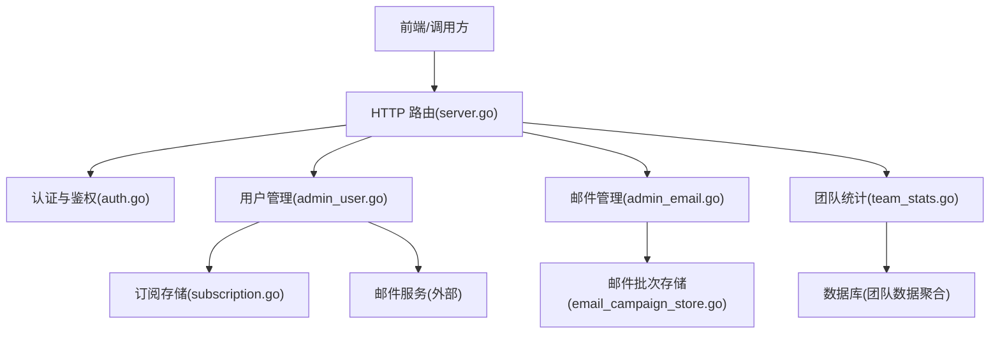
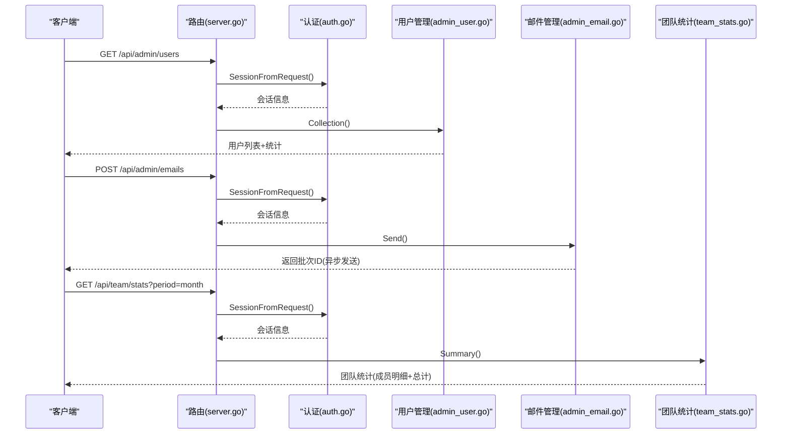
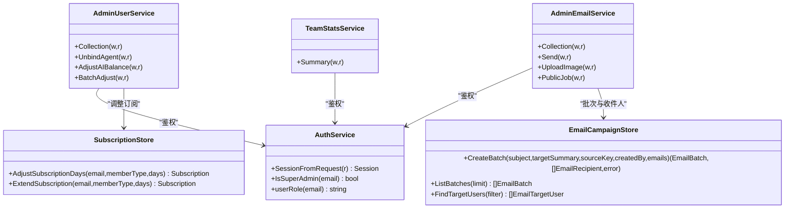

# 管理后台API

<cite>
**本文引用的文件**
- [server.go](file://goodhr5/cloud/backend/internal/httpapi/server.go)
- [auth.go](file://goodhr5/cloud/backend/internal/httpapi/auth.go)
- [admin_user.go](file://goodhr5/cloud/backend/internal/httpapi/admin_user.go)
- [admin_email.go](file://goodhr5/cloud/backend/internal/httpapi/admin_email.go)
- [team_stats.go](file://goodhr5/cloud/backend/internal/httpapi/team_stats.go)
- [email_campaign_store.go](file://goodhr5/cloud/backend/internal/httpapi/email_campaign_store.go)
- [subscription.go](file://goodhr5/cloud/backend/internal/httpapi/subscription.go)
</cite>

## 目录
1. [简介](#简介)
2. [项目结构](#项目结构)
3. [核心组件](#核心组件)
4. [架构总览](#架构总览)
5. [详细接口说明](#详细接口说明)
6. [依赖关系分析](#依赖关系分析)
7. [性能与可用性](#性能与可用性)
8. [故障排查指南](#故障排查指南)
9. [结论](#结论)
10. [附录：操作示例](#附录操作示例)

## 简介
本文件为 GoodHR 云端后端的管理后台 API 文档，覆盖管理员用户管理、邮件营销、团队统计等关键能力。重点说明以下接口的权限控制、请求参数、响应字段、错误码与最佳实践：
- /api/admin/users（用户管理）
- /api/admin/emails（邮件管理）
- /api/team/stats（团队统计）

同时涵盖：
- 管理员权限验证与会话机制
- 批量操作与幂等性设计
- 数据统计分析与报表导出思路
- 审计与通知（会员调整、AI余额调整、邮件发送追踪）

## 项目结构
管理后台相关路由在统一服务中注册，并通过认证中间件进行鉴权。核心文件职责如下：
- server.go：HTTP 路由注册、公共响应封装、CORS、健康检查
- auth.go：登录、会话、角色判定（超管/管理员/成员）、邮箱白名单
- admin_user.go：超级管理员用户列表、订阅天数调整、AI余额调整、解绑本地设备、批量调整
- admin_email.go：邮件批次创建与发送、图片上传、已读追踪、自动任务触发
- team_stats.go：团队统计汇总（仅团队管理员可访问）
- email_campaign_store.go：邮件批次与收件人记录存储（内存实现）
- subscription.go：订阅状态与套餐查询、发放与调整

图表来源
- [server.go:123-212](file://goodhr5/cloud/backend/internal/httpapi/server.go#L123-L212)
- [auth.go:452-551](file://goodhr5/cloud/backend/internal/httpapi/auth.go#L452-L551)
- [admin_user.go:129-189](file://goodhr5/cloud/backend/internal/httpapi/admin_user.go#L129-L189)
- [admin_email.go:59-142](file://goodhr5/cloud/backend/internal/httpapi/admin_email.go#L59-L142)
- [team_stats.go:25-66](file://goodhr5/cloud/backend/internal/httpapi/team_stats.go#L25-L66)

章节来源
- [server.go:123-212](file://goodhr5/cloud/backend/internal/httpapi/server.go#L123-L212)

## 核心组件
- 认证与授权
  - 通过 Bearer Token 解析会话，校验是否超管或团队管理员
  - 提供 IsSuperAdmin、SessionFromRequest 等方法用于鉴权
- 用户管理服务
  - 分页查询用户、统计今日注册数与设备绑定数
  - 调整会员到期时间、调整内置 AI 余额、解绑本地设备、批量调整
- 邮件管理服务
  - 创建并异步发送邮件批次、上传图片、标记已读、自动任务触发
  - 支持按标签、流程节点、未登录天数筛选目标用户
- 团队统计服务
  - 按时间范围聚合岗位运行与候选人互动指标，输出成员明细与总计

章节来源
- [auth.go:452-551](file://goodhr5/cloud/backend/internal/httpapi/auth.go#L452-L551)
- [admin_user.go:113-189](file://goodhr5/cloud/backend/internal/httpapi/admin_user.go#L113-L189)
- [admin_email.go:20-142](file://goodhr5/cloud/backend/internal/httpapi/admin_email.go#L20-L142)
- [team_stats.go:12-66](file://goodhr5/cloud/backend/internal/httpapi/team_stats.go#L12-L66)

## 架构总览
管理后台 API 采用“路由 -> 服务 -> 存储”的分层结构。所有管理接口均要求有效会话，并根据角色限制访问。部分接口使用异步处理（如邮件发送），并提供幂等键避免重复执行。

图表来源
- [server.go:123-212](file://goodhr5/cloud/backend/internal/httpapi/server.go#L123-L212)
- [auth.go:452-470](file://goodhr5/cloud/backend/internal/httpapi/auth.go#L452-L470)
- [admin_user.go:129-189](file://goodhr5/cloud/backend/internal/httpapi/admin_user.go#L129-L189)
- [admin_email.go:59-142](file://goodhr5/cloud/backend/internal/httpapi/admin_email.go#L59-L142)
- [team_stats.go:25-66](file://goodhr5/cloud/backend/internal/httpapi/team_stats.go#L25-L66)

## 详细接口说明

### 通用约定
- 认证方式：请求头 Authorization: Bearer <token>
- 成功响应格式：{"ok": true, ...}
- 失败响应格式：{"ok": false, "error": "描述"}
- 常见状态码：200 成功；400 参数错误；401 未登录或会话过期；403 无权限；500 服务器错误

章节来源
- [server.go:261-277](file://goodhr5/cloud/backend/internal/httpapi/server.go#L261-L277)
- [auth.go:452-470](file://goodhr5/cloud/backend/internal/httpapi/auth.go#L452-L470)

### /api/admin/users（用户管理）
- 权限：必须为超级管理员
- 方法：
  - GET：获取用户列表与统计
  - POST：调整指定用户的会员到期时间
  - POST /unbind-agent：解除用户全部有效设备绑定
  - POST /adjust-ai-balance：调整用户内置 AI 余额
  - POST /batch-adjust：批量调整会员天数与 AI 余额

- GET /api/admin/users
  - 查询参数
    - q：搜索关键词（邮箱、角色、状态、邀请人邮箱模糊匹配）
    - page：页码，默认 1
    - page_size：每页数量，默认 20，最大 100
  - 响应字段
    - users：用户数组（id、email、role、status、inviter_email、agent、subscription、notification_profile、ai_balance_units、flow、created_at、last_login_at）
    - total：总数
    - page：当前页
    - page_size：每页数量
    - stats：统计（today_registered_count、agent_binding_count）
  - 错误
    - 401：会话无效或过期
    - 403：非超级管理员
    - 500：加载用户或统计失败

- POST /api/admin/users
  - 请求体
    - email：目标用户邮箱
    - days：正负天数（不能为 0）
    - member_type：Plus 或 Max（可选）
    - reason：原因（为空时默认“超级管理员调整会员天数”）
  - 行为
    - 调整会员到期时间，并发送通知邮件
  - 响应
    - ok、subscription（member_type、expires_at、active）
  - 错误
    - 400：JSON 无效、邮箱非法、days 为 0、member_type 非法
    - 401/403：权限问题
    - 500：发送通知失败

- POST /api/admin/users/unbind-agent
  - 请求体
    - email：目标用户邮箱
  - 行为
    - 禁用该用户的全部有效设备绑定
  - 响应
    - ok
  - 错误
    - 400/401/403/500：同上

- POST /api/admin/users/adjust-ai-balance
  - 请求体
    - email：目标用户邮箱
    - amount_cents：以分为单位的金额（与 amount_yuan 二选一）
    - amount_yuan：以元为单位的字符串（会被转换为分）
    - reason：原因（为空时默认“超级管理员调整AI余额”）
  - 行为
    - 调整用户 AI 余额，写入流水，发送通知邮件
  - 响应
    - ok、balance_units、balance_cents、balance（元字符串）
  - 错误
    - 400：金额非法或为零
    - 401/403：权限问题
    - 500：钱包不可用或调整失败

- POST /api/admin/users/batch-adjust
  - 请求体
    - target：all 或空（all 表示全部用户）
    - emails：逗号/换行/分号分隔的邮箱列表（去重）
    - days：批量调整的天数（可为 0）
    - amount_cents/amount_yuan：批量调整的 AI 余额（可为 0）
    - reason：原因（为空时默认“超级管理员批量调整”）
  - 行为
    - 对每个目标用户分别调整会员天数和 AI 余额，记录结果
  - 响应
    - ok、total_count、success_count、failed_count、results[]（每条包含 email、days_adjusted、balance_adjusted、errors[]）
  - 错误
    - 400：参数非法、未找到目标用户
    - 401/403：权限问题
    - 500：内部错误

章节来源
- [admin_user.go:129-189](file://goodhr5/cloud/backend/internal/httpapi/admin_user.go#L129-L189)
- [admin_user.go:191-227](file://goodhr5/cloud/backend/internal/httpapi/admin_user.go#L191-L227)
- [admin_user.go:229-264](file://goodhr5/cloud/backend/internal/httpapi/admin_user.go#L229-L264)
- [admin_user.go:266-317](file://goodhr5/cloud/backend/internal/httpapi/admin_user.go#L266-L317)
- [admin_user.go:319-397](file://goodhr5/cloud/backend/internal/httpapi/admin_user.go#L319-L397)
- [admin_user.go:413-453](file://goodhr5/cloud/backend/internal/httpapi/admin_user.go#L413-L453)
- [admin_user.go:455-506](file://goodhr5/cloud/backend/internal/httpapi/admin_user.go#L455-L506)

### /api/admin/emails（邮件管理）
- 权限：必须为超级管理员
- 方法：
  - GET：列出最近邮件批次
  - POST：创建并异步发送邮件批次
  - GET /{id}：查看指定批次详情（含收件人列表）
  - POST /upload-image：上传图片并返回 URL
  - 公共接口（无需超管，但需令牌）：/api/public/email-jobs/{job}、/api/public/mail/open?id=...

- GET /api/admin/emails
  - 响应
    - ok、batches[]（id、subject、target_summary、source_key、created_by_email、total_count、sent_count、failed_count、opened_count、created_at、finished_at）

- POST /api/admin/emails
  - 请求体
    - subject：邮件主题（必填）
    - html：HTML 正文（必填）
    - mode：all 或空（all 表示全部用户）
    - emails：指定邮箱列表（支持多种分隔符）
    - tags：画像标签（可选）
    - flows：流程节点（可选）
    - last_login_before_days：至少 N 天未登录（可选）
    - meta：自定义元数据（可选）
  - 行为
    - 解析收件人，追加统一页脚，创建批次，异步发送
  - 响应
    - ok、batch（批次信息）
  - 错误
    - 400：缺少必填字段、无匹配收件人
    - 401/403：权限问题
    - 500：创建批次失败

- GET /api/admin/emails/{id}
  - 响应
    - ok、batch、recipients[]（id、batch_id、email、status、error_message、opened、opened_at、created_at、sent_at）
  - 错误
    - 400：批次 ID 缺失或非法
    - 404：批次不存在
    - 500：加载失败

- POST /api/admin/emails/upload-image
  - 请求
    - multipart/form-data，字段 file
  - 限制
    - 大小不超过 8MB
    - 仅允许 png/jpg/jpeg/gif/webp
  - 响应
    - ok、url、absolute_url

- 公共接口
  - /api/public/email-jobs/{job}：由定时任务触发，需要 GOODHR_EMAIL_JOB_TOKEN
    - job 支持：yesterday-incomplete、inactive-3-days、inactive-7-days、inactive-30-days、flow-reminder
  - /api/public/mail/open?id=...：标记邮件被打开，返回 1x1 gif

章节来源
- [admin_email.go:59-142](file://goodhr5/cloud/backend/internal/httpapi/admin_email.go#L59-L142)
- [admin_email.go:74-104](file://goodhr5/cloud/backend/internal/httpapi/admin_email.go#L74-L104)
- [admin_email.go:144-191](file://goodhr5/cloud/backend/internal/httpapi/admin_email.go#L144-L191)
- [admin_email.go:193-236](file://goodhr5/cloud/backend/internal/httpapi/admin_email.go#L193-L236)
- [admin_email.go:238-307](file://goodhr5/cloud/backend/internal/httpapi/admin_email.go#L238-L307)
- [admin_email.go:309-356](file://goodhr5/cloud/backend/internal/httpapi/admin_email.go#L309-L356)
- [admin_email.go:369-451](file://goodhr5/cloud/backend/internal/httpapi/admin_email.go#L369-L451)
- [admin_email.go:482-521](file://goodhr5/cloud/backend/internal/httpapi/admin_email.go#L482-L521)
- [admin_email.go:523-546](file://goodhr5/cloud/backend/internal/httpapi/admin_email.go#L523-L546)
- [admin_email.go:548-615](file://goodhr5/cloud/backend/internal/httpapi/admin_email.go#L548-L615)
- [admin_email.go:617-661](file://goodhr5/cloud/backend/internal/httpapi/admin_email.go#L617-L661)

### /api/team/stats（团队统计）
- 权限：团队管理员（普通成员不可访问）
- 方法：GET
- 查询参数
  - period：today、week、last_month、custom（默认 month）
  - start_date：自定义开始日期（YYYY-MM-DD）
  - end_date：自定义结束日期（YYYY-MM-DD）
- 响应
  - ok、period、start_date、end_date、totals（position_count、scanned_count、resume_count、detail_count、greeted_count、skipped_count、failed_count）、members[]（email 及各项计数）
- 错误
  - 401：会话无效或过期
  - 403：非团队管理员
  - 500：加载租户或统计数据失败

章节来源
- [team_stats.go:25-66](file://goodhr5/cloud/backend/internal/httpapi/team_stats.go#L25-L66)
- [team_stats.go:68-133](file://goodhr5/cloud/backend/internal/httpapi/team_stats.go#L68-L133)
- [team_stats.go:135-166](file://goodhr5/cloud/backend/internal/httpapi/team_stats.go#L135-L166)
- [team_stats.go:168-203](file://goodhr5/cloud/backend/internal/httpapi/team_stats.go#L168-L203)

## 依赖关系分析
- 认证依赖
  - AuthService 负责会话解析、角色判定、邮箱白名单、邀请绑定与试用通知
- 用户管理依赖
  - AdminUserService 依赖订阅存储、系统配置、邮件服务、Agent 存储、AI 钱包存储
- 邮件管理依赖
  - AdminEmailService 依赖邮件批次存储、邮件服务、系统配置
- 团队统计依赖
  - TeamStatsService 依赖数据库连接与租户存储

图表来源
- [auth.go:452-551](file://goodhr5/cloud/backend/internal/httpapi/auth.go#L452-L551)
- [admin_user.go:113-189](file://goodhr5/cloud/backend/internal/httpapi/admin_user.go#L113-L189)
- [admin_email.go:20-142](file://goodhr5/cloud/backend/internal/httpapi/admin_email.go#L20-L142)
- [team_stats.go:12-66](file://goodhr5/cloud/backend/internal/httpapi/team_stats.go#L12-L66)
- [email_campaign_store.go:57-66](file://goodhr5/cloud/backend/internal/httpapi/email_campaign_store.go#L57-L66)
- [subscription.go:34-48](file://goodhr5/cloud/backend/internal/httpapi/subscription.go#L34-L48)

章节来源
- [auth.go:452-551](file://goodhr5/cloud/backend/internal/httpapi/auth.go#L452-L551)
- [admin_user.go:113-189](file://goodhr5/cloud/backend/internal/httpapi/admin_user.go#L113-L189)
- [admin_email.go:20-142](file://goodhr5/cloud/backend/internal/httpapi/admin_email.go#L20-L142)
- [team_stats.go:12-66](file://goodhr5/cloud/backend/internal/httpapi/team_stats.go#L12-L66)
- [email_campaign_store.go:57-66](file://goodhr5/cloud/backend/internal/httpapi/email_campaign_store.go#L57-L66)
- [subscription.go:34-48](file://goodhr5/cloud/backend/internal/httpapi/subscription.go#L34-L48)

## 性能与可用性
- 超时与限流
  - 用户列表查询与统计使用短上下文超时（约 3 秒）
  - 团队统计查询使用 5 秒超时
- 异步处理
  - 邮件发送采用 goroutine 异步执行，避免阻塞请求
  - 已读追踪通过 1x1 gif 像素接口记录
- 幂等性
  - 自动邮件任务使用 source_key 防止重复发送
  - 会员权益发放基于订单号与权益类型幂等
- 分页与过滤
  - 用户列表支持分页与关键词模糊搜索
  - 邮件目标用户支持标签、流程节点、未登录天数筛选

章节来源
- [admin_user.go:658-727](file://goodhr5/cloud/backend/internal/httpapi/admin_user.go#L658-L727)
- [team_stats.go:68-133](file://goodhr5/cloud/backend/internal/httpapi/team_stats.go#L68-L133)
- [admin_email.go:309-356](file://goodhr5/cloud/backend/internal/httpapi/admin_email.go#L309-L356)
- [subscription.go:401-459](file://goodhr5/cloud/backend/internal/httpapi/subscription.go#L401-L459)

## 故障排查指南
- 401 未登录或会话过期
  - 检查 Authorization 头是否携带有效 Bearer token
  - 确认 token 未过期（会话有效期 30 天）
- 403 无权限
  - 用户管理接口需超级管理员
  - 团队统计需团队管理员
- 400 参数错误
  - 邮箱格式不合法
  - days 或 amount_cents 为零
  - member_type 不是 Plus 或 Max
  - 图片大小或类型不符合限制
- 500 服务器错误
  - 数据库连接或查询失败
  - 邮件服务不可用
  - 钱包或订阅存储不可用

章节来源
- [auth.go:452-470](file://goodhr5/cloud/backend/internal/httpapi/auth.go#L452-L470)
- [admin_user.go:191-227](file://goodhr5/cloud/backend/internal/httpapi/admin_user.go#L191-L227)
- [admin_email.go:144-191](file://goodhr5/cloud/backend/internal/httpapi/admin_email.go#L144-L191)
- [team_stats.go:25-66](file://goodhr5/cloud/backend/internal/httpapi/team_stats.go#L25-L66)

## 结论
本管理后台 API 提供了完善的管理能力：
- 用户管理：支持分页查询、订阅天数调整、AI 余额调整、设备解绑、批量调整
- 邮件营销：支持自定义邮件、批量发送、图片上传、已读追踪、自动任务
- 团队统计：支持按周期聚合岗位与候选人指标，输出成员明细与总计

所有管理接口均具备严格的权限控制与错误处理，适合在生产环境中安全使用。建议结合自动化脚本与定时任务实现报表生成与运营维护。

## 附录：操作示例

### 批量用户操作
- 批量调整会员天数与 AI 余额
  - 方法：POST /api/admin/users/batch-adjust
  - 请求体示例
    - target: "all"
    - emails: []
    - days: 7
    - amount_cents: 1000
    - reason: "活动补偿"
  - 响应
    - ok、total_count、success_count、failed_count、results[]

章节来源
- [admin_user.go:319-397](file://goodhr5/cloud/backend/internal/httpapi/admin_user.go#L319-L397)

### 报表生成
- 团队统计
  - 方法：GET /api/team/stats?period=month
  - 响应
    - totals：岗位创建、扫描、跳过、失败、简历数、详情数、打招呼数
    - members：成员明细
  - 导出建议
    - 将 totals 与 members 序列化为 CSV/Excel 供业务分析

章节来源
- [team_stats.go:25-66](file://goodhr5/cloud/backend/internal/httpapi/team_stats.go#L25-L66)
- [team_stats.go:168-203](file://goodhr5/cloud/backend/internal/httpapi/team_stats.go#L168-L203)

### 邮件营销
- 创建并发送邮件批次
  - 方法：POST /api/admin/emails
  - 请求体示例
    - subject: "活动通知"
    - html: "<h1>欢迎参加</h1>"
    - mode: "all"
    - tags: ["vip"]
    - flows: ["position_created"]
    - last_login_before_days: 7
  - 响应
    - ok、batch（批次ID）
- 查看批次详情
  - 方法：GET /api/admin/emails/{id}
  - 响应
    - batch、recipients[]（状态、错误、已读）

章节来源
- [admin_email.go:59-142](file://goodhr5/cloud/backend/internal/httpapi/admin_email.go#L59-L142)
- [admin_email.go:74-104](file://goodhr5/cloud/backend/internal/httpapi/admin_email.go#L74-L104)

### 权限与审计
- 权限验证
  - 所有管理接口通过 SessionFromRequest 校验会话
  - 超管接口使用 IsSuperAdmin 校验
  - 团队统计使用 IsTenantAdmin 校验
- 审计与通知
  - 会员调整与 AI 余额调整会发送通知邮件
  - 邮件发送记录包含批次与收件人状态
  - 自动任务使用 source_key 保证幂等

章节来源
- [auth.go:452-551](file://goodhr5/cloud/backend/internal/httpapi/auth.go#L452-L551)
- [admin_user.go:413-453](file://goodhr5/cloud/backend/internal/httpapi/admin_user.go#L413-L453)
- [admin_email.go:309-356](file://goodhr5/cloud/backend/internal/httpapi/admin_email.go#L309-L356)