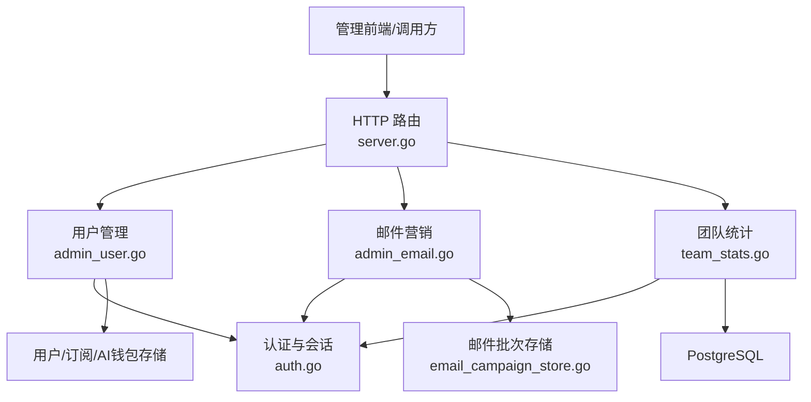
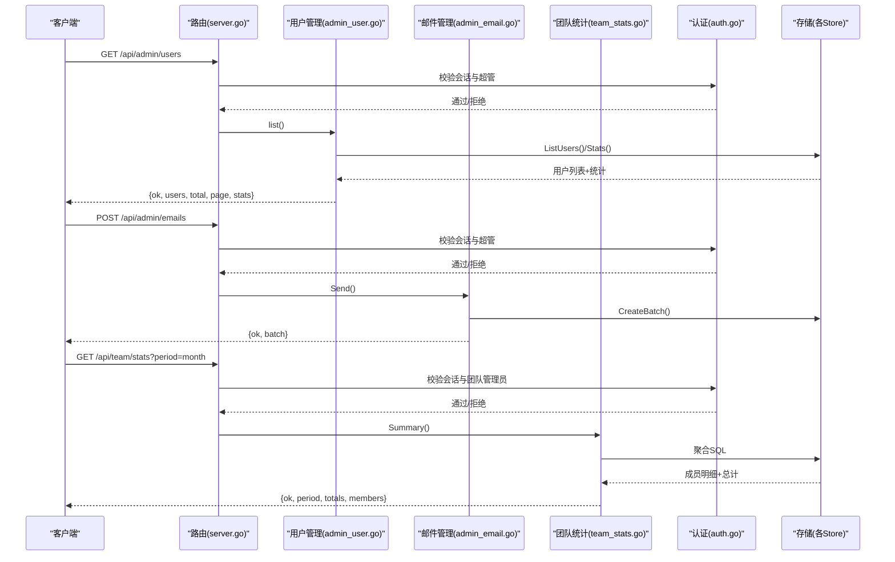
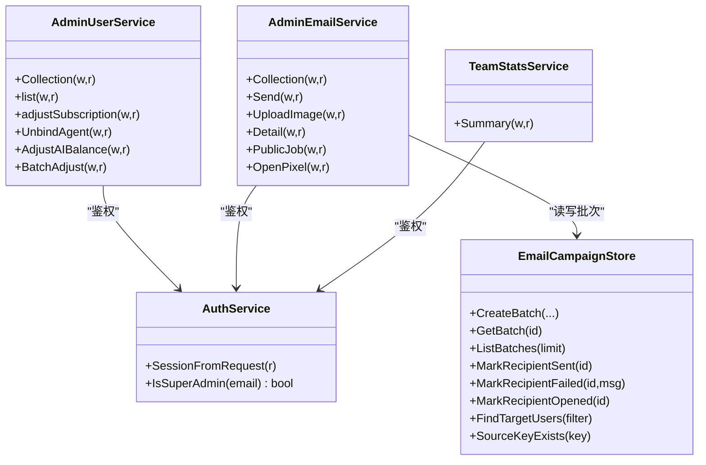

# 管理后台API

<cite>
**本文引用的文件**
- [server.go](file://goodhr5/cloud/backend/internal/httpapi/server.go)
- [admin_user.go](file://goodhr5/cloud/backend/internal/httpapi/admin_user.go)
- [admin_email.go](file://goodhr5/cloud/backend/internal/httpapi/admin_email.go)
- [team_stats.go](file://goodhr5/cloud/backend/internal/httpapi/team_stats.go)
- [auth.go](file://goodhr5/cloud/backend/internal/httpapi/auth.go)
- [email_campaign_store.go](file://goodhr5/cloud/backend/internal/httpapi/email_campaign_store.go)
</cite>

## 目录
1. [简介](#简介)
2. [项目结构](#项目结构)
3. [核心组件](#核心组件)
4. [架构总览](#架构总览)
5. [详细接口说明](#详细接口说明)
6. [依赖关系分析](#依赖关系分析)
7. [性能与可用性](#性能与可用性)
8. [故障排查指南](#故障排查指南)
9. [结论](#结论)
10. [附录：操作示例](#附录：操作示例)

## 简介
本文件面向系统管理员，提供 HRPlus 云端后端的管理后台 API 文档。重点覆盖以下能力：
- 用户管理：查看用户列表、分页搜索、调整会员天数、调整 AI 余额、批量调整、解除设备绑定等。
- 邮件营销：创建并发送自定义邮件批次、上传富文本图片、查看批次详情与收件人状态、自动流程提醒任务、已读追踪。
- 团队统计：按时间范围汇总团队成员的岗位运行与候选人互动数据。
- 权限控制：所有管理接口均要求超级管理员或团队管理员身份；公共定时任务使用令牌鉴权。
- 审计与导出：邮件发送批次记录可查询；用户列表支持分页与关键词检索；统计数据可按周期导出（由前端组合）。

## 项目结构
管理后台相关路由在 HTTP 服务中统一注册，并通过服务层进行权限校验、业务处理与存储访问。关键文件职责如下：
- server.go：HTTP 路由注册、CORS、健康检查、公共配置读取、服务装配。
- admin_user.go：超级管理员用户管理（列表、调整订阅、AI 余额、批量调整、解绑 Agent）。
- admin_email.go：超级管理员邮件营销（发送、上传、批次详情、自动任务、已读追踪）。
- team_stats.go：团队统计（成员维度聚合指标）。
- auth.go：认证与会话、超级管理员判定、登录态校验。
- email_campaign_store.go：邮件批次与收件人的内存/数据库存储抽象与实现。

**图表来源**
- [server.go:132-228](file://goodhr5/cloud/backend/internal/httpapi/server.go#L132-L228)
- [admin_user.go:113-149](file://goodhr5/cloud/backend/internal/httpapi/admin_user.go#L113-L149)
- [admin_email.go:54-72](file://goodhr5/cloud/backend/internal/httpapi/admin_email.go#L54-L72)
- [team_stats.go:12-23](file://goodhr5/cloud/backend/internal/httpapi/team_stats.go#L12-L23)
- [auth.go:22-90](file://goodhr5/cloud/backend/internal/httpapi/auth.go#L22-L90)
- [email_campaign_store.go:57-66](file://goodhr5/cloud/backend/internal/httpapi/email_campaign_store.go#L57-L66)

**章节来源**
- [server.go:132-228](file://goodhr5/cloud/backend/internal/httpapi/server.go#L132-L228)

## 核心组件
- 认证与会话：通过 SessionFromRequest 获取会话，IsSuperAdmin 判断是否为超级管理员；团队统计额外校验租户管理员。
- 用户管理服务：提供用户列表、统计、订阅调整、AI 余额调整、批量调整、Agent 解绑。
- 邮件营销服务：提供邮件批次创建与发送、图片上传、批次详情、自动任务调度、已读追踪。
- 团队统计服务：按租户与时间范围聚合岗位与候选人数据，返回成员明细与总计。

**章节来源**
- [auth.go:22-90](file://goodhr5/cloud/backend/internal/httpapi/auth.go#L22-L90)
- [admin_user.go:113-149](file://goodhr5/cloud/backend/internal/httpapi/admin_user.go#L113-L149)
- [admin_email.go:54-72](file://goodhr5/cloud/backend/internal/httpapi/admin_email.go#L54-L72)
- [team_stats.go:12-23](file://goodhr5/cloud/backend/internal/httpapi/team_stats.go#L12-L23)

## 架构总览
管理后台 API 采用“路由 -> 服务 -> 存储”的分层设计。路由负责方法分发与基础参数解析；服务层完成权限校验、业务规则与外部通知；存储层对接数据库或内存实现。

**图表来源**
- [server.go:174-184](file://goodhr5/cloud/backend/internal/httpapi/server.go#L174-L184)
- [admin_user.go:130-188](file://goodhr5/cloud/backend/internal/httpapi/admin_user.go#L130-L188)
- [admin_email.go:59-142](file://goodhr5/cloud/backend/internal/httpapi/admin_email.go#L59-L142)
- [team_stats.go:25-66](file://goodhr5/cloud/backend/internal/httpapi/team_stats.go#L25-L66)
- [auth.go:22-90](file://goodhr5/cloud/backend/internal/httpapi/auth.go#L22-L90)

## 详细接口说明

### 通用约定
- 鉴权方式：除明确标注为公共接口外，管理接口均需携带有效会话；超级管理员接口需 IsSuperAdmin 通过。
- 响应格式：成功返回 { ok: true, ... }；失败返回 { ok: false, error: "..." }。
- 错误码：常见包括 400 参数错误、401 未授权、403 无权限、404 资源不存在、500 服务器错误。

#### 1) 用户管理：/api/admin/users
- 权限：超级管理员
- 方法：GET（列表）、POST（调整会员天数）
- 功能：
  - GET：分页查询用户列表，支持关键词 q（邮箱、角色、状态、邀请人邮箱），page/page_size 分页。返回用户基本信息、订阅信息、通知配置、AI 余额、流程状态、创建时间与最后登录时间，以及统计 today_registered_count、agent_binding_count。
  - POST：按正负天数调整指定用户的会员到期时间，可选 member_type（Plus/Pro），reason 用于审计。
- 请求参数（GET）：q, page, page_size
- 请求参数（POST）：email, days, member_type, reason
- 响应字段：ok, users[], total, page, page_size, stats{}
- 注意事项：
  - days 不能为 0。
  - member_type 仅允许 Plus 或 Pro。
  - 调整成功后会发送通知邮件（若失败会返回特定错误类型以便上层区分）。

**章节来源**
- [server.go:177-180](file://goodhr5/cloud/backend/internal/httpapi/server.go#L177-L180)
- [admin_user.go:130-188](file://goodhr5/cloud/backend/internal/httpapi/admin_user.go#L130-L188)
- [admin_user.go:191-227](file://goodhr5/cloud/backend/internal/httpapi/admin_user.go#L191-L227)

#### 2) 用户管理：/api/admin/users/unbind-agent
- 权限：超级管理员
- 方法：POST
- 功能：解除指定用户的全部有效设备绑定，使这些电脑可重新绑定其他账号。
- 请求体：{ email }
- 响应：{ ok: true }

**章节来源**
- [server.go:178-179](file://goodhr5/cloud/backend/internal/httpapi/server.go#L178-L179)
- [admin_user.go:229-264](file://goodhr5/cloud/backend/internal/httpapi/admin_user.go#L229-L264)

#### 3) 用户管理：/api/admin/users/adjust-ai-balance
- 权限：超级管理员
- 方法：POST
- 功能：调整指定用户的内置 AI 余额（单位：分），支持 amount_cents 或 amount_yuan（字符串），reason 用于审计。
- 请求体：{ email, amount_cents, amount_yuan, reason }
- 响应：{ ok: true, balance_units, balance_cents, balance }

**章节来源**
- [server.go:179-180](file://goodhr5/cloud/backend/internal/httpapi/server.go#L179-L180)
- [admin_user.go:266-317](file://goodhr5/cloud/backend/internal/httpapi/admin_user.go#L266-L317)

#### 4) 用户管理：/api/admin/users/batch-adjust
- 权限：超级管理员
- 方法：POST
- 功能：批量调整用户会员天数与 AI 余额。target 支持 all 或 emails 列表（支持多种分隔符）。days 与 amount_cents/amount_yuan 至少填一个。
- 请求体：{ target, emails[], days, amount_cents, amount_yuan, reason }
- 响应：{ ok: true, total_count, success_count, failed_count, results[] }
- 结果项：每个用户包含 email, days_adjusted, balance_adjusted, errors[]

**章节来源**
- [server.go:180-181](file://goodhr5/cloud/backend/internal/httpapi/server.go#L180-L181)
- [admin_user.go:319-397](file://goodhr5/cloud/backend/internal/httpapi/admin_user.go#L319-L397)

#### 5) 邮件管理：/api/admin/emails
- 权限：超级管理员
- 方法：GET（最近批次列表）、POST（创建并异步发送）
- 功能：
  - GET：返回最近 50 条邮件批次摘要。
  - POST：创建邮件批次并异步发送。支持 mode=all 或指定 emails[]；支持 tags[]、flows[]、last_login_before_days 筛选目标；meta 用于附加元数据。
- 请求体（POST）：{ subject, html, mode, emails[], tags[], flows[], last_login_before_days, meta }
- 响应：{ ok: true, batch }
- 注意：HTML 会自动追加页脚与已读追踪像素；发送过程后台执行。

**章节来源**
- [server.go:181-183](file://goodhr5/cloud/backend/internal/httpapi/server.go#L181-L183)
- [admin_email.go:59-142](file://goodhr5/cloud/backend/internal/httpapi/admin_email.go#L59-L142)

#### 6) 邮件管理：/api/admin/emails/upload-image
- 权限：超级管理员
- 方法：POST（multipart/form-data）
- 功能：上传富文本图片，返回相对路径与绝对 URL。
- 限制：最大 8MB；仅支持 png/jpg/gif/webp。
- 响应：{ ok: true, url, absolute_url }

**章节来源**
- [server.go:182-183](file://goodhr5/cloud/backend/internal/httpapi/server.go#L182-L183)
- [admin_email.go:144-191](file://goodhr5/cloud/backend/internal/httpapi/admin_email.go#L144-L191)

#### 7) 邮件管理：/api/admin/emails/{id}
- 权限：超级管理员
- 方法：GET
- 功能：查看指定邮件批次的详情与收件人列表（含发送状态、失败原因、打开状态）。
- 响应：{ ok: true, batch, recipients[] }

**章节来源**
- [server.go:183-184](file://goodhr5/cloud/backend/internal/httpapi/server.go#L183-L184)
- [admin_email.go:74-104](file://goodhr5/cloud/backend/internal/httpapi/admin_email.go#L74-L104)

#### 8) 公共定时任务：/api/public/email-jobs/{job}
- 权限：需要 GOODHR_EMAIL_JOB_TOKEN（Query token 或 Authorization: Bearer）
- 方法：GET/POST
- 功能：触发自动邮件任务，如 flow-reminder、yesterday-incomplete、inactive-3-days、inactive-7-days、inactive-30-days。flow-reminder 支持 flows、stalled_hours、created_day、limit、dry_run 等参数。
- 响应：{ ok: true, result }

**章节来源**
- [server.go:184-185](file://goodhr5/cloud/backend/internal/httpapi/server.go#L184-L185)
- [admin_email.go:204-236](file://goodhr5/cloud/backend/internal/httpapi/admin_email.go#L204-L236)
- [admin_email.go:238-307](file://goodhr5/cloud/backend/internal/httpapi/admin_email.go#L238-L307)
- [admin_email.go:369-385](file://goodhr5/cloud/backend/internal/httpapi/admin_email.go#L369-L385)

#### 9) 已读追踪：/api/public/mail/open
- 权限：无需鉴权（仅记录打开事件）
- 方法：GET
- 功能：标记邮件被打开，返回 1x1 GIF 像素。
- 参数：id（收件人ID）

**章节来源**
- [server.go:185-186](file://goodhr5/cloud/backend/internal/httpapi/server.go#L185-L186)
- [admin_email.go:193-202](file://goodhr5/cloud/backend/internal/httpapi/admin_email.go#L193-L202)

#### 10) 团队统计：/api/team/stats
- 权限：团队管理员（基于当前会话邮箱所属租户）
- 方法：GET
- 功能：返回当前团队在指定时间范围内的员工统计。默认本月。
- 参数：period（today/week/month/last_month/custom）、start_date、end_date（custom 时必填）
- 响应：{ ok: true, period, start_date, end_date, totals{}, members[] }
- 成员字段：email, position_count, scanned_count, skipped_count, failed_count, resume_count, detail_count, greeted_count

**章节来源**
- [server.go:174-175](file://goodhr5/cloud/backend/internal/httpapi/server.go#L174-L175)
- [team_stats.go:25-66](file://goodhr5/cloud/backend/internal/httpapi/team_stats.go#L25-L66)
- [team_stats.go:68-133](file://goodhr5/cloud/backend/internal/httpapi/team_stats.go#L68-L133)
- [team_stats.go:135-166](file://goodhr5/cloud/backend/internal/httpapi/team_stats.go#L135-L166)

## 依赖关系分析
- 认证依赖：所有管理接口通过 AuthService.SessionFromRequest 与 IsSuperAdmin 进行鉴权；团队统计额外通过 TenantStore.IsTenantAdmin 校验。
- 存储依赖：
  - 用户管理依赖 AdminUserStore、SubscriptionStore、SystemConfigStore、AgentStore、AIWalletStore。
  - 邮件管理依赖 EmailCampaignStore、Mailer、SystemConfigStore。
  - 团队统计依赖 PostgreSQL 直接聚合数据。
- 外部集成：邮件发送、模板渲染、已读追踪像素、自动任务调度。

**图表来源**
- [auth.go:22-90](file://goodhr5/cloud/backend/internal/httpapi/auth.go#L22-L90)
- [admin_user.go:113-149](file://goodhr5/cloud/backend/internal/httpapi/admin_user.go#L113-L149)
- [admin_email.go:20-57](file://goodhr5/cloud/backend/internal/httpapi/admin_email.go#L20-L57)
- [team_stats.go:12-23](file://goodhr5/cloud/backend/internal/httpapi/team_stats.go#L12-L23)
- [email_campaign_store.go:57-66](file://goodhr5/cloud/backend/internal/httpapi/email_campaign_store.go#L57-L66)

**章节来源**
- [auth.go:22-90](file://goodhr5/cloud/backend/internal/httpapi/auth.go#L22-L90)
- [admin_user.go:113-149](file://goodhr5/cloud/backend/internal/httpapi/admin_user.go#L113-L149)
- [admin_email.go:20-57](file://goodhr5/cloud/backend/internal/httpapi/admin_email.go#L20-L57)
- [team_stats.go:12-23](file://goodhr5/cloud/backend/internal/httpapi/team_stats.go#L12-L23)
- [email_campaign_store.go:57-66](file://goodhr5/cloud/backend/internal/httpapi/email_campaign_store.go#L57-L66)

## 性能与可用性
- 超时控制：用户列表与统计查询设置合理超时，避免长事务阻塞。
- 分页与限流：用户列表 page_size 上限为 100；批量调整对全部用户场景分页拉取，避免一次性加载过多。
- 异步发送：邮件发送采用 goroutine 异步执行，降低请求延迟。
- 幂等性：自动邮件任务通过 source_key 去重，防止重复发送。
- 缓存策略：响应头禁止缓存，确保实时性。

[本节为通用指导，不直接分析具体文件]

## 故障排查指南
- 401 未授权：检查会话是否有效，确认请求携带了正确的 Authorization 头。
- 403 无权限：确认当前用户为超级管理员或团队管理员。
- 400 参数错误：检查 JSON 结构、必填字段、数值范围（如 days 非零、金额非零、日期格式等）。
- 500 服务器错误：检查数据库连接、邮件服务配置、存储实现可用性。
- 邮件发送失败：查看批次详情中的 recipients 失败原因；检查 mailer 配置与网络连通性。
- 自动任务失败：核对 GOODHR_EMAIL_JOB_TOKEN 是否正确；检查 flow-reminder 参数是否在合法范围。

**章节来源**
- [server.go:297-313](file://goodhr5/cloud/backend/internal/httpapi/server.go#L297-L313)
- [admin_email.go:595-606](file://goodhr5/cloud/backend/internal/httpapi/admin_email.go#L595-L606)
- [admin_email.go:651-661](file://goodhr5/cloud/backend/internal/httpapi/admin_email.go#L651-L661)

## 结论
本管理后台 API 提供了完整的管理员能力集：用户生命周期与权益管理、邮件营销自动化、团队绩效统计。通过严格的权限控制、清晰的错误响应与可观测的批次记录，满足日常运营与数据分析需求。建议在生产环境启用完善的日志与监控，并对敏感操作（批量调整、全量邮件）增加二次确认与审计留痕。

[本节为总结，不直接分析具体文件]

## 附录：操作示例

### 示例一：批量用户操作（批量调整会员天数与 AI 余额）
- 端点：POST /api/admin/users/batch-adjust
- 权限：超级管理员
- 请求体示例：
  - {
      "target": "all",
      "emails": [],
      "days": 30,
      "amount_cents": 0,
      "amount_yuan": "",
      "reason": "季度福利发放"
    }
- 说明：
  - target=all 表示对所有用户生效；也可传入 emails[] 指定用户集合。
  - days 与 amount_cents/amount_yuan 至少填写一项。
  - 响应包含每个用户的调整结果与错误信息。

**章节来源**
- [admin_user.go:319-397](file://goodhr5/cloud/backend/internal/httpapi/admin_user.go#L319-L397)

### 示例二：报表生成（团队统计导出）
- 端点：GET /api/team/stats?period=month
- 权限：团队管理员
- 说明：
  - 支持 period=today|week|month|last_month|custom。
  - custom 时需同时提供 start_date 与 end_date。
  - 返回 totals 与 members 列表，前端可据此生成报表或导出 CSV。

**章节来源**
- [team_stats.go:25-66](file://goodhr5/cloud/backend/internal/httpapi/team_stats.go#L25-L66)
- [team_stats.go:135-166](file://goodhr5/cloud/backend/internal/httpapi/team_stats.go#L135-L166)

### 示例三：邮件营销（创建并发送自定义邮件）
- 端点：POST /api/admin/emails
- 权限：超级管理员
- 请求体示例：
  - {
      "subject": "活动通知",
      "html": "<h1>欢迎参加</h1>
详情见正文
",
      "mode": "tags",
      "emails": [],
      "tags": ["vip"],
      "flows": [],
      "last_login_before_days": 0,
      "meta": {"campaign_id": "123"}
    }
- 说明：
  - HTML 将自动追加页脚与已读追踪像素。
  - 发送为异步，立即返回批次信息。

**章节来源**
- [admin_email.go:59-142](file://goodhr5/cloud/backend/internal/httpapi/admin_email.go#L59-L142)

### 示例四：自动流程提醒（定时任务）
- 端点：POST /api/public/email-jobs/flow-reminder
- 权限：需要 GOODHR_EMAIL_JOB_TOKEN
- 参数示例（Query 或 JSON）：
  - flows=position_created&stalled_hours=24&limit=1000&dry_run=true&created_day=2025-01-01
- 说明：
  - dry_run=true 仅预览匹配人数，不实际发送。
  - 参数校验严格，超出范围将返回错误。

**章节来源**
- [admin_email.go:204-236](file://goodhr5/cloud/backend/internal/httpapi/admin_email.go#L204-L236)
- [admin_email.go:238-307](file://goodhr5/cloud/backend/internal/httpapi/admin_email.go#L238-L307)