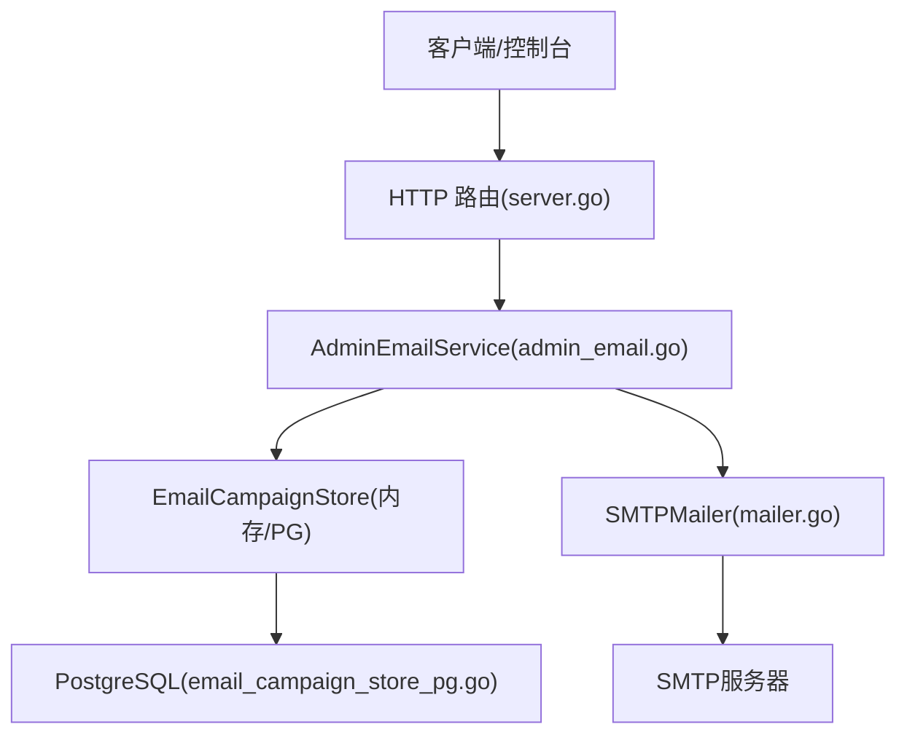
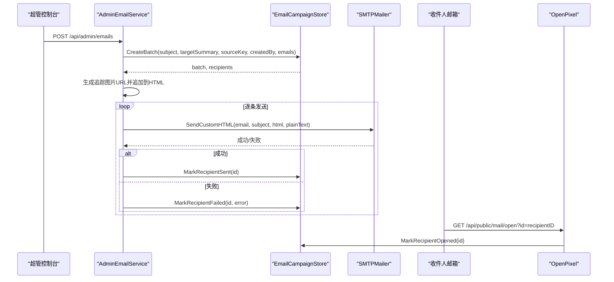
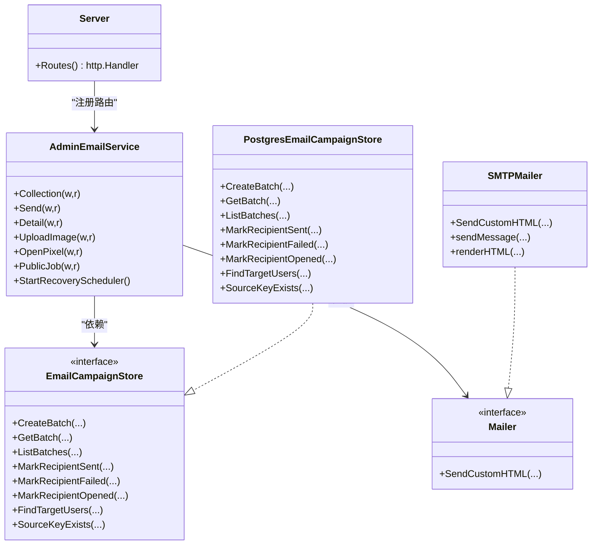

# 邮件营销API

<cite>
**本文引用的文件**
- [admin_email.go](file://goodhr5/cloud/backend/internal/httpapi/admin_email.go)
- [mailer.go](file://goodhr5/cloud/backend/internal/httpapi/mailer.go)
- [email_campaign_store.go](file://goodhr5/cloud/backend/internal/httpapi/email_campaign_store.go)
- [email_campaign_store_pg.go](file://goodhr5/cloud/backend/internal/httpapi/email_campaign_store_pg.go)
- [server.go](file://goodhr5/cloud/backend/internal/httpapi/server.go)
- [0053_admin_email_campaigns.sql](file://goodhr5/cloud/backend/db/migrations/0053_admin_email_campaigns.sql)
- [footer.html](file://goodhr5/cloud/backend/templates/automatic_emails/footer.html)
</cite>

## 目录
1. [简介](#简介)
2. [项目结构](#项目结构)
3. [核心组件](#核心组件)
4. [架构总览](#架构总览)
5. [详细组件分析](#详细组件分析)
6. [依赖关系分析](#依赖关系分析)
7. [性能与可靠性](#性能与可靠性)
8. [故障排查指南](#故障排查指南)
9. [结论](#结论)
10. [附录：完整工作流示例](#附录完整工作流示例)

## 简介
本接口文档面向邮件营销能力，覆盖以下功能：
- 邮件模板管理：自动挽回邮件模板的默认配置、系统配置覆盖、统一页脚注入。
- 邮件发送控制：超管批量发送邮件、按标签/流程/登录状态筛选收件人、异步发送队列与进度追踪。
- 邮件统计查询：批次列表、批次详情（含收件人明细）、打开率等指标。
- 安全与合规：超级管理员鉴权、外部定时任务令牌校验、图片上传白名单限制、幂等键防重发。
- 失败处理与重试：发送失败记录错误信息，支持后续重试策略（由上层调度决定）。
- 内容审核与频率限制：通过参数校验、目标用户上限、幂等键与定时任务限频避免误发与滥用。

## 项目结构
邮件营销相关代码位于后端 HTTP API 层，围绕“服务-存储-邮件发送”三层组织：
- 路由与服务：server.go 注册 /api/admin/emails 与 /api/public/* 路由；admin_email.go 实现业务逻辑。
- 存储抽象：email_campaign_store.go 定义 EmailCampaignStore 接口及内存实现；email_campaign_store_pg.go 提供 PostgreSQL 实现。
- 邮件发送：mailer.go 定义 Mailer 接口与 SMTPMailer 实现，负责模板渲染与 SMTP 投递。
- 数据模型：迁移脚本 0053_admin_email_campaigns.sql 定义 email_batches 与 email_recipients 表。
- 模板资源：templates/automatic_emails 下包含自动邮件模板与统一页脚 footer.html。

图表来源
- [server.go:123-172](file://goodhr5/cloud/backend/internal/httpapi/server.go#L123-L172)
- [admin_email.go:54-142](file://goodhr5/cloud/backend/internal/httpapi/admin_email.go#L54-L142)
- [email_campaign_store_pg.go:21-58](file://goodhr5/cloud/backend/internal/httpapi/email_campaign_store_pg.go#L21-L58)
- [mailer.go:278-295](file://goodhr5/cloud/backend/internal/httpapi/mailer.go#L278-L295)

章节来源
- [server.go:123-172](file://goodhr5/cloud/backend/internal/httpapi/server.go#L123-L172)
- [0053_admin_email_campaigns.sql:1-55](file://goodhr5/cloud/backend/db/migrations/0053_admin_email_campaigns.sql#L1-L55)

## 核心组件
- AdminEmailService：提供超管邮件发送、图片上传、已读追踪、自动任务触发、定时恢复邮件等功能。
- EmailCampaignStore：抽象邮件批次与收件人的持久化操作，支持内存与 PostgreSQL 两种实现。
- Mailer：抽象邮件发送能力，提供多种内置通知类型与自定义 HTML 邮件发送。
- SMTPMailer：基于 SMTP 的实际发送实现，支持 TLS 端口与多部分 MIME 邮件体。
- 迁移脚本：创建 email_batches 与 email_recipients 表，并插入默认系统配置。

章节来源
- [admin_email.go:20-57](file://goodhr5/cloud/backend/internal/httpapi/admin_email.go#L20-L57)
- [email_campaign_store.go:57-77](file://goodhr5/cloud/backend/internal/httpapi/email_campaign_store.go#L57-L77)
- [mailer.go:19-25](file://goodhr5/cloud/backend/internal/httpapi/mailer.go#L19-L25)
- [mailer.go:104-111](file://goodhr5/cloud/backend/internal/httpapi/mailer.go#L104-L111)
- [0053_admin_email_campaigns.sql:1-55](file://goodhr5/cloud/backend/db/migrations/0053_admin_email_campaigns.sql#L1-L55)

## 架构总览
邮件营销整体流程如下：
- 超管调用 /api/admin/emails POST 发起批量发送，服务端校验参数、解析收件人、创建批次与收件人记录，随后在后台 goroutine 中逐条发送。
- 发送时附加 1x1 像素的已读追踪图片，收件人打开邮件会回调 /api/public/mail/open 标记已读。
- 自动任务通过 /api/public/email-jobs/{job} 触发，支持流程提醒与分阶段挽回邮件，具备幂等键与限频保护。
- 所有发送结果与打开事件写入数据库，供查询批次与统计。

图表来源
- [admin_email.go:106-142](file://goodhr5/cloud/backend/internal/httpapi/admin_email.go#L106-L142)
- [admin_email.go:523-534](file://goodhr5/cloud/backend/internal/httpapi/admin_email.go#L523-L534)
- [admin_email.go:193-202](file://goodhr5/cloud/backend/internal/httpapi/admin_email.go#L193-L202)
- [email_campaign_store_pg.go:116-141](file://goodhr5/cloud/backend/internal/httpapi/email_campaign_store_pg.go#L116-L141)
- [mailer.go:278-295](file://goodhr5/cloud/backend/internal/httpapi/mailer.go#L278-L295)

## 详细组件分析

### 超管邮件接口（AdminEmailService）
- 路由挂载
  - GET /api/admin/emails：返回最近邮件批次列表。
  - POST /api/admin/emails：创建邮件批次并异步发送。
  - GET /api/admin/emails/{id}：获取指定批次详情与收件人明细。
  - POST /api/admin/emails/upload-image：上传图片并返回 URL。
  - GET /api/public/mail/open?id={id}：标记邮件被打开。
  - POST/GET /api/public/email-jobs/{job}：外部定时任务触发自动邮件（需令牌校验）。

- 请求与响应要点
  - 批量发送请求体字段：subject、html、mode、emails、tags、flows、last_login_before_days、meta。
  - mode=all 表示向全部用户发送；否则可组合 emails、tags、flows、last_login_before_days 筛选。
  - 响应包含 ok、batch、batches、skipped、preview 等字段，用于展示批次与预览数量。
  - 图片上传限制：最大 8MB，仅允许 png/jpg/jpeg/gif/webp。
  - 已读追踪：为每封邮件追加 1x1 透明 GIF，点击后回调 OpenPixel 更新 opened 与 opened_at。

- 权限与安全
  - 超管鉴权：requireSuperAdmin 校验会话与角色。
  - 外部任务令牌：validJobToken 从查询参数或 Authorization Bearer 读取 GOODHR_EMAIL_JOB_TOKEN。
  - 幂等键：source_key 防止重复创建相同来源的批次。
  - 限频与保护：flowReminderRequest 与 incompleteMilestoneSourceKey 对自动任务进行参数归一化与上限限制。

- 发送与追踪
  - sendBatch 遍历收件人，调用 Mailer.SendCustomHTML，成功则 MarkRecipientSent，失败则 MarkRecipientFailed。
  - 自动邮件 base URL 优先使用当前请求 Host，其次环境变量，最后系统配置网站地址。
  - 统一页脚 appendEmailFooter 注入联系方式与官网链接。

章节来源
- [server.go:167-172](file://goodhr5/cloud/backend/internal/httpapi/server.go#L167-L172)
- [admin_email.go:59-142](file://goodhr5/cloud/backend/internal/httpapi/admin_email.go#L59-L142)
- [admin_email.go:144-202](file://goodhr5/cloud/backend/internal/httpapi/admin_email.go#L144-L202)
- [admin_email.go:204-356](file://goodhr5/cloud/backend/internal/httpapi/admin_email.go#L204-L356)
- [admin_email.go:523-546](file://goodhr5/cloud/backend/internal/httpapi/admin_email.go#L523-L546)
- [admin_email.go:548-615](file://goodhr5/cloud/backend/internal/httpapi/admin_email.go#L548-L615)
- [admin_email.go:651-661](file://goodhr5/cloud/backend/internal/httpapi/admin_email.go#L651-L661)

### 邮件存储（EmailCampaignStore 与 PG 实现）
- 数据模型
  - EmailBatch：批次 ID、主题、目标摘要、源键、创建者、总数、已发送数、失败数、已打开数、创建时间、完成时间。
  - EmailRecipient：收件人 ID、所属批次、邮箱、状态、错误信息、是否打开、打开时间、创建时间、发送时间。
  - 内存实现 MemoryEmailCampaignStore：线程安全，维护 batches 与 recipients 映射，支持重算批次统计。
  - PG 实现 PostgresEmailCampaignStore：事务创建批次与收件人，支持唯一约束与索引优化。

- 关键方法
  - CreateBatch：创建批次与收件人，支持 source_key 幂等检查。
  - GetBatch/ListBatches：查询批次与列表，按创建时间倒序。
  - MarkRecipientSent/Failed/Opened：更新状态并重算批次统计。
  - FindTargetUsers：按标签、流程卡点、注册日期、登录间隔筛选目标用户（PG 实现）。
  - SourceKeyExists：判断自动任务幂等键是否存在。

- 表结构与索引
  - email_batches：主键 id，唯一索引 on source_key（非空），统计字段 sent_count/failed_count/opened_count，完成时间 finished_at。
  - email_recipients：外键 batch_id，唯一约束 (batch_id, email)，索引 on batch_id 与 opened。

章节来源
- [email_campaign_store.go:14-66](file://goodhr5/cloud/backend/internal/httpapi/email_campaign_store.go#L14-L66)
- [email_campaign_store.go:74-165](file://goodhr5/cloud/backend/internal/httpapi/email_campaign_store.go#L74-L165)
- [email_campaign_store_pg.go:21-151](file://goodhr5/cloud/backend/internal/httpapi/email_campaign_store_pg.go#L21-L151)
- [0053_admin_email_campaigns.sql:1-55](file://goodhr5/cloud/backend/db/migrations/0053_admin_email_campaigns.sql#L1-L55)

### 邮件发送（Mailer 与 SMTPMailer）
- 接口设计
  - Mailer 抽象：SendLoginCode、SendSubscriptionReward、SendAIBalanceNotice、SendPositionStatus、SendCustomHTML。
  - DevMailer：开发模式日志输出，不实际发送邮件。
  - SMTPMailer：真实 SMTP 发送，支持 TLS 端口 465 与普通端口。

- 发送流程
  - sendMessage：组装纯文本与 HTML 正文，构建 multipart/alternative MIME 消息，选择 TLS 或普通发送。
  - renderHTML：读取模板文件并渲染，失败时回退为空字符串并使用纯文本兜底。
  - buildMailMessage：生成标准邮件头与主体，支持 UTF-8 Base64 编码提升兼容性。
  - wrapCustomMailHTML：移动端友好的 HTML 包装，适配小屏阅读。

- 模板与资源
  - 自动邮件模板路径：templates/automatic_emails/*.html。
  - 统一页脚：footer.html 注入联系方式与官网链接。

章节来源
- [mailer.go:19-25](file://goodhr5/cloud/backend/internal/httpapi/mailer.go#L19-L25)
- [mailer.go:67-96](file://goodhr5/cloud/backend/internal/httpapi/mailer.go#L67-L96)
- [mailer.go:104-111](file://goodhr5/cloud/backend/internal/httpapi/mailer.go#L104-L111)
- [mailer.go:278-312](file://goodhr5/cloud/backend/internal/httpapi/mailer.go#L278-L312)
- [mailer.go:314-356](file://goodhr5/cloud/backend/internal/httpapi/mailer.go#L314-L356)
- [mailer.go:358-408](file://goodhr5/cloud/backend/internal/httpapi/mailer.go#L358-L408)
- [mailer.go:410-449](file://goodhr5/cloud/backend/internal/httpapi/mailer.go#L410-L449)
- [mailer.go:451-463](file://goodhr5/cloud/backend/internal/httpapi/mailer.go#L451-L463)
- [footer.html:1-8](file://goodhr5/cloud/backend/templates/automatic_emails/footer.html#L1-L8)

### 自动任务与定时恢复
- 外部任务入口：/api/public/email-jobs/{job}
  - job=flow-reminder：流程提醒任务，支持 flows、stalled_hours、created_day、limit、dry_run 参数。
  - 其他 job：yesterday-incomplete、inactive-3-days、inactive-7-days、inactive-30-days。
- 参数归一化与限频
  - normalizeFlowReminderRequest：校验 stalled_hours 范围、limit 上限、日期格式、流程步骤合法性。
  - dry_run：仅预览匹配用户数量，不实际发送。
- 定时恢复
  - StartRecoveryScheduler：每日定时执行 SendScheduledRecovery，根据 system.email_recovery 配置启用与小时。
  - sendIncompleteMilestone：按注册天数分阶段发送提醒，使用 incompleteMilestoneSourceKey 作为幂等键。

章节来源
- [admin_email.go:204-356](file://goodhr5/cloud/backend/internal/httpapi/admin_email.go#L204-L356)
- [admin_email.go:358-451](file://goodhr5/cloud/backend/internal/httpapi/admin_email.go#L358-L451)
- [admin_email.go:482-521](file://goodhr5/cloud/backend/internal/httpapi/admin_email.go#L482-L521)
- [admin_email.go:663-761](file://goodhr5/cloud/backend/internal/httpapi/admin_email.go#L663-L761)

## 依赖关系分析
- 路由依赖：server.go 将 adminEmails 服务挂载到多个路径，包括超管邮件、公共任务与已读追踪。
- 服务依赖：AdminEmailService 依赖 AuthService、EmailCampaignStore、Mailer、SystemConfigStore。
- 存储依赖：PostgresEmailCampaignStore 依赖 sql.DB，使用事务与聚合查询保证一致性。
- 邮件依赖：SMTPMailer 依赖 SMTP 服务器配置，支持 TLS 与多部分 MIME。

图表来源
- [server.go:167-172](file://goodhr5/cloud/backend/internal/httpapi/server.go#L167-L172)
- [admin_email.go:20-57](file://goodhr5/cloud/backend/internal/httpapi/admin_email.go#L20-L57)
- [email_campaign_store.go:57-66](file://goodhr5/cloud/backend/internal/httpapi/email_campaign_store.go#L57-L66)
- [email_campaign_store_pg.go:12-19](file://goodhr5/cloud/backend/internal/httpapi/email_campaign_store_pg.go#L12-L19)
- [mailer.go:19-25](file://goodhr5/cloud/backend/internal/httpapi/mailer.go#L19-L25)
- [mailer.go:104-111](file://goodhr5/cloud/backend/internal/httpapi/mailer.go#L104-L111)

章节来源
- [server.go:167-172](file://goodhr5/cloud/backend/internal/httpapi/server.go#L167-L172)
- [admin_email.go:20-57](file://goodhr5/cloud/backend/internal/httpapi/admin_email.go#L20-L57)
- [email_campaign_store.go:57-66](file://goodhr5/cloud/backend/internal/httpapi/email_campaign_store.go#L57-L66)
- [email_campaign_store_pg.go:12-19](file://goodhr5/cloud/backend/internal/httpapi/email_campaign_store_pg.go#L12-L19)
- [mailer.go:19-25](file://goodhr5/cloud/backend/internal/httpapi/mailer.go#L19-L25)

## 性能与可靠性
- 并发发送：sendBatch 使用 goroutine 逐条发送，避免阻塞请求响应。
- 幂等性：source_key 防止自动任务重复创建批次，结合数据库唯一索引保障一致性。
- 限频保护：flowReminderRequest 与 incompleteMilestoneSourceKey 限制单次任务规模与频率。
- 容错与回退：模板渲染失败回退为纯文本；发送失败记录错误信息，便于后续重试。
- 统计重算：每次收件人状态变更都会重算批次统计，finished_at 在所有收件人完成后设置。
- 传输安全：SMTP 支持 TLS 1.2+，Base64 编码提升跨客户端兼容性。

[本节为通用指导，无需特定文件引用]

## 故障排查指南
- 常见错误
  - 参数校验失败：subject/html 必填、图片大小与类型限制、stalled_hours/limit 范围、日期格式。
  - 权限不足：非超管访问超管接口、外部任务令牌不匹配。
  - 存储异常：数据库连接失败、事务提交失败、唯一约束冲突。
  - 发送失败：SMTP 认证失败、网络超时、收件人无效。
- 定位建议
  - 查看批次详情与收件人明细，确认状态与错误信息。
  - 检查系统配置 system.email_recovery 是否正确启用与模板是否完整。
  - 验证外部任务令牌与环境变量 GOODHR_EMAIL_JOB_TOKEN、GOODHR_PUBLIC_BASE_URL。
  - 核对 SMTP 配置主机、端口、用户名、密码与 TLS 设置。

章节来源
- [admin_email.go:106-142](file://goodhr5/cloud/backend/internal/httpapi/admin_email.go#L106-L142)
- [admin_email.go:144-202](file://goodhr5/cloud/backend/internal/httpapi/admin_email.go#L144-L202)
- [admin_email.go:204-356](file://goodhr5/cloud/backend/internal/httpapi/admin_email.go#L204-L356)
- [email_campaign_store_pg.go:21-151](file://goodhr5/cloud/backend/internal/httpapi/email_campaign_store_pg.go#L21-L151)
- [mailer.go:278-312](file://goodhr5/cloud/backend/internal/httpapi/mailer.go#L278-L312)

## 结论
该邮件营销 API 提供了完整的超管批量发送、自动任务触发、已读追踪与统计分析能力。通过清晰的接口分层、幂等键与限频保护、以及可靠的存储与发送实现，能够满足企业级邮件营销场景的需求。建议在生产环境完善 SMTP 配置、监控发送成功率与打开率，并结合业务需求扩展模板与自动化策略。

[本节为总结，无需特定文件引用]

## 附录：完整工作流示例
以下展示从模板设计到效果分析的全过程：
- 模板设计
  - 使用 templates/automatic_emails 下的模板文件，或通过系统配置覆盖默认模板。
  - 统一页脚 footer.html 注入联系方式与官网链接。
- 批量发送
  - 调用 POST /api/admin/emails，传入 subject、html、mode、emails/tags/flows/last_login_before_days。
  - 服务端创建批次与收件人记录，并在后台异步发送。
- 已读追踪
  - 每封邮件附加 1x1 像素追踪图片，收件人打开后回调 /api/public/mail/open?id={id}。
- 自动任务
  - 通过 /api/public/email-jobs/flow-reminder 或分阶段任务触发，支持 dry_run 预览与 limit 限频。
- 统计查询
  - GET /api/admin/emails：最近批次列表。
  - GET /api/admin/emails/{id}：批次详情与收件人明细，包含 sent_count、failed_count、opened_count。
- 效果分析
  - 计算发送成功率 = sent_count / total_count。
  - 计算打开率 = opened_count / sent_count。
  - 结合业务指标（如转化率）评估邮件效果。

章节来源
- [admin_email.go:59-142](file://goodhr5/cloud/backend/internal/httpapi/admin_email.go#L59-L142)
- [admin_email.go:193-202](file://goodhr5/cloud/backend/internal/httpapi/admin_email.go#L193-L202)
- [admin_email.go:204-356](file://goodhr5/cloud/backend/internal/httpapi/admin_email.go#L204-L356)
- [email_campaign_store_pg.go:92-114](file://goodhr5/cloud/backend/internal/httpapi/email_campaign_store_pg.go#L92-L114)
- [footer.html:1-8](file://goodhr5/cloud/backend/templates/automatic_emails/footer.html#L1-L8)