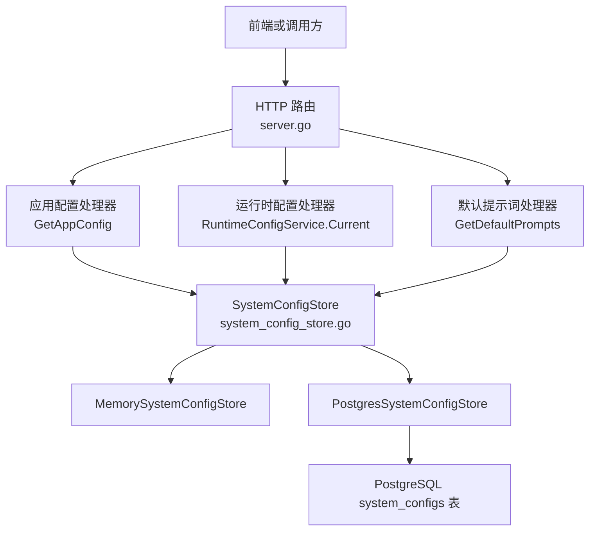
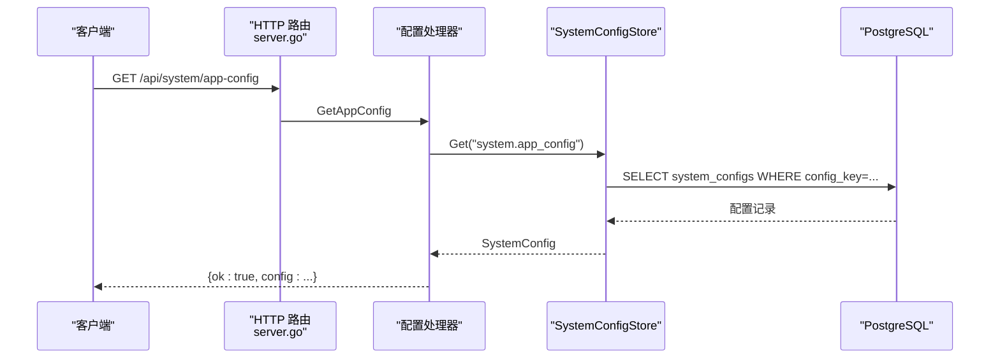
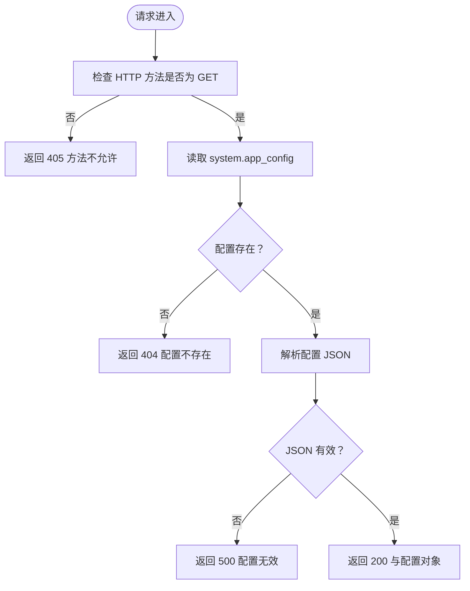
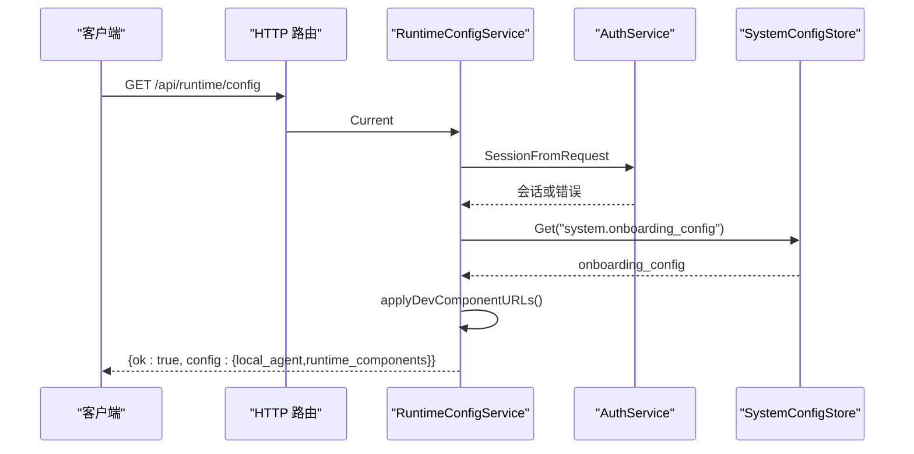
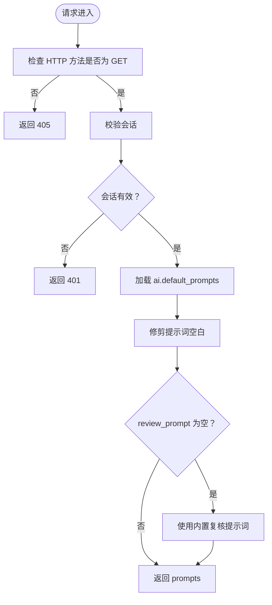
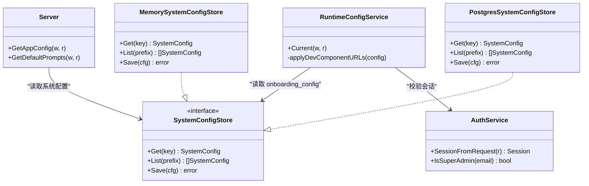

# 系统配置API

<cite>
**本文引用的文件**   
- [server.go](file://goodhr5/cloud/backend/internal/httpapi/server.go)
- [config.go](file://goodhr5/cloud/backend/internal/httpapi/config.go)
- [system_config_store.go](file://goodhr5/cloud/backend/internal/httpapi/system_config_store.go)
- [runtime_config.go](file://goodhr5/cloud/backend/internal/httpapi/runtime_config.go)
- [default_prompts.go](file://goodhr5/cloud/backend/internal/httpapi/default_prompts.go)
- [system_public_test.go](file://goodhr5/cloud/backend/internal/httpapi/system_public_test.go)
- [runtime_config_test.go](file://goodhr5/cloud/backend/internal/httpapi/runtime_config_test.go)
- [0002_add_system_configs.sql](file://goodhr5/cloud/backend/db/migrations/0002_add_system_configs.sql)
- [0021_system_app_config.sql](file://goodhr5/cloud/backend/db/migrations/0021_system_app_config.sql)
</cite>

## 目录
1. [简介](#简介)
2. [项目结构](#项目结构)
3. [核心组件](#核心组件)
4. [架构总览](#架构总览)
5. [详细接口说明](#详细接口说明)
6. [依赖关系分析](#依赖关系分析)
7. [性能与一致性](#性能与一致性)
8. [故障排查指南](#故障排查指南)
9. [结论](#结论)
10. [附录：配置项分类与示例](#附录配置项分类与示例)

## 简介
本文档面向 HRPlus 云端后端的“系统配置 API”，重点说明以下三类能力：
- 应用配置：前端公共系统参数，例如免费每日打招呼上限、公告、后台横幅等。
- 运行时配置：本地程序与运行组件的下载信息、控制台地址、版本要求等。
- 默认提示词管理：AI 筛选、打开详情、复核评分等默认提示词。

这些接口统一基于云端后端的系统配置存储层，支持内存实现（开发环境）和 PostgreSQL 持久化实现（生产环境），并通过管理员接口进行动态更新。

## 项目结构
系统配置相关代码集中在云端后端 HTTP API 包中：
- 路由注册与通用响应封装位于 server.go。
- 环境变量与后端启动配置位于 config.go。
- 系统配置的抽象接口与内存/PostgreSQL 双实现位于 system_config_store.go。
- 运行时配置服务位于 runtime_config.go。
- 默认提示词读取逻辑位于 default_prompts.go。
- 数据库迁移定义在 db/migrations 下。

**图表来源**
- [server.go:172-217](file://goodhr5/cloud/backend/internal/httpapi/server.go#L172-L217)
- [system_config_store.go:11-27](file://goodhr5/cloud/backend/internal/httpapi/system_config_store.go#L11-L27)

**章节来源**
- [server.go:160-229](file://goodhr5/cloud/backend/internal/httpapi/server.go#L160-L229)
- [system_config_store.go:11-27](file://goodhr5/cloud/backend/internal/httpapi/system_config_store.go#L11-L27)

## 核心组件
- SystemConfigStore：系统配置持久化抽象，提供 Get、List、Save 三个方法。
- MemorySystemConfigStore：内存实现，适合未启用 PostgreSQL 的开发环境。
- PostgresSystemConfigStore：PostgreSQL 实现，使用 system_configs 表持久化配置。
- RuntimeConfigService：运行时配置服务，负责返回本地程序与运行组件配置，并在开发环境下覆盖组件下载地址。
- Server.GetAppConfig：应用配置接口实现，从 system.app_config 键读取 JSON 并返回。
- Server.GetDefaultPrompts：默认提示词接口实现，从 ai.default_prompts 键读取并兜底内置复核提示词。

**章节来源**
- [system_config_store.go:11-27](file://goodhr5/cloud/backend/internal/httpapi/system_config_store.go#L11-L27)
- [runtime_config.go:10-20](file://goodhr5/cloud/backend/internal/httpapi/runtime_config.go#L10-L20)
- [server.go:315-342](file://goodhr5/cloud/backend/internal/httpapi/server.go#L315-L342)
- [default_prompts.go:29-76](file://goodhr5/cloud/backend/internal/httpapi/default_prompts.go#L29-L76)

## 架构总览
系统配置 API 的整体流程如下：
1. 客户端发起 HTTP 请求到对应路由。
2. 路由分发到具体处理器。
3. 处理器通过 SystemConfigStore 读取系统配置。
4. 配置值以 JSON 字符串形式存储，处理器按需反序列化为业务结构。
5. 处理器返回统一 JSON 响应，包含 ok 字段和业务数据。

**图表来源**
- [server.go:315-342](file://goodhr5/cloud/backend/internal/httpapi/server.go#L315-L342)
- [system_config_store.go:384-405](file://goodhr5/cloud/backend/internal/httpapi/system_config_store.go#L384-L405)

## 详细接口说明

### /api/system/app-config（应用配置）
- 方法：GET
- 认证：无需登录，前端初始化即可获取公共系统配置。
- 数据来源：system.app_config 配置键。
- 返回值：
  - ok：布尔值，表示请求是否成功。
  - config：任意 JSON 对象，包含前端公共系统参数。
- 典型配置项：
  - free_daily_greet_limit：免费用户每日打招呼上限。
  - position_requirement_optimize_prompt：岗位要求优化提示词。
  - email_domain_whitelist：邮箱域名白名单。
  - announcements_enabled：公告开关。
  - announcements：公告列表，包含 id、title、content、url、once、enabled、created_at。
  - admin_banner：后台横幅配置，包含 enabled、text、background_color、text_color、url。
  - admin_banners：后台横幅数组。
- 错误处理：
  - 配置不存在时返回 404。
  - 配置 JSON 无效时返回 500。
  - 非 GET 方法返回 405。

**图表来源**
- [server.go:315-342](file://goodhr5/cloud/backend/internal/httpapi/server.go#L315-L342)

**章节来源**
- [server.go:315-342](file://goodhr5/cloud/backend/internal/httpapi/server.go#L315-L342)
- [system_config_store.go:45-85](file://goodhr5/cloud/backend/internal/httpapi/system_config_store.go#L45-L85)
- [system_public_test.go:11-33](file://goodhr5/cloud/backend/internal/httpapi/system_public_test.go#L11-L33)

### /api/runtime/config（运行时配置）
- 方法：GET
- 认证：需要已登录会话。
- 数据来源：system.onboarding_config 配置键中的 local_agent 与 runtime_components。
- 返回值：
  - ok：布尔值。
  - config：运行时配置对象，包含 local_agent 与 runtime_components。
- 开发环境行为：
  - 若运行环境为 dev，则自动将 runtime_components 中 cloakbrowser、node_runtime、ocr 的下载地址覆盖为本地后端 /uploads/ 路径，避免依赖外部 OSS。
- 错误处理：
  - 非 GET 方法返回 405。
  - 会话无效或过期返回 401。

**图表来源**
- [runtime_config.go:22-45](file://goodhr5/cloud/backend/internal/httpapi/runtime_config.go#L22-L45)
- [runtime_config.go:47-67](file://goodhr5/cloud/backend/internal/httpapi/runtime_config.go#L47-L67)

**章节来源**
- [runtime_config.go:10-77](file://goodhr5/cloud/backend/internal/httpapi/runtime_config.go#L10-L77)
- [runtime_config_test.go:11-35](file://goodhr5/cloud/backend/internal/httpapi/runtime_config_test.go#L11-L35)

### /api/system/default-prompts（默认提示词）
- 方法：GET
- 认证：需要已登录会话。
- 数据来源：ai.default_prompts 配置键。
- 返回值：
  - ok：布尔值。
  - prompts：默认提示词对象，包含 filter_prompt、open_detail_prompt、review_prompt。
- 默认行为：
  - 如果 review_prompt 为空，则使用内置复核提示词作为兜底。
  - 所有提示词字段会进行空白字符修剪。
- 错误处理：
  - 非 GET 方法返回 405。
  - 会话无效或过期返回 401。

**图表来源**
- [default_prompts.go:36-76](file://goodhr5/cloud/backend/internal/httpapi/default_prompts.go#L36-L76)

**章节来源**
- [default_prompts.go:1-77](file://goodhr5/cloud/backend/internal/httpapi/default_prompts.go#L1-L77)

## 依赖关系分析
- 路由层：server.go 注册 /api/system/app-config、/api/runtime/config、/api/system/default-prompts 等路由。
- 认证层：runtime_config.go 与 default_prompts.go 依赖 AuthService 校验会话；app-config 不强制登录。
- 配置存储层：所有配置均通过 SystemConfigStore 读取，支持内存与 PostgreSQL 两种实现。
- 环境变量层：config.go 提供后端启动配置，包括 AppEnv、Redis、PostgreSQL、SMTP 等，用于决定运行环境与降级策略。

**图表来源**
- [server.go:315-342](file://goodhr5/cloud/backend/internal/httpapi/server.go#L315-L342)
- [runtime_config.go:10-45](file://goodhr5/cloud/backend/internal/httpapi/runtime_config.go#L10-L45)
- [system_config_store.go:11-27](file://goodhr5/cloud/backend/internal/httpapi/system_config_store.go#L11-L27)

**章节来源**
- [server.go:160-229](file://goodhr5/cloud/backend/internal/httpapi/server.go#L160-L229)
- [config.go:23-71](file://goodhr5/cloud/backend/internal/httpapi/config.go#L23-L71)

## 性能与一致性
- 配置读取路径短：每个接口仅一次 Get 操作，无复杂缓存层。
- 配置值以 JSON 字符串存储，处理器按需反序列化，避免额外中间结构。
- 开发环境运行时配置会覆盖组件 URL，属于轻量级 map 操作，不影响性能。
- 配置变更即时生效：管理员通过 /api/admin/system/configs/ 或 /api/admin/platforms/config/ 更新配置后，后续请求直接读取最新值。
- 并发安全：内存存储在单进程内简单 map 读写；PostgreSQL 实现由数据库保证一致性。

[本节为通用指导，不直接分析具体文件]

## 故障排查指南
- 404 配置不存在：
  - 检查 system.app_config 或 ai.default_prompts 是否已在数据库中插入。
  - 确认配置记录的 enabled 字段为 true。
- 500 配置无效：
  - 检查配置 JSON 是否合法。
  - 检查后端日志中“系统应用配置无效”或类似错误。
- 401 会话无效：
  - 检查 Authorization 头是否正确携带 Token。
  - 检查会话是否过期。
- 405 方法不允许：
  - 确认请求方法为 GET。
- 运行时配置缺少 runtime_components：
  - 检查 system.onboarding_config 是否存在且 JSON 合法。
  - 检查开发环境 URL 覆盖逻辑是否被正确执行。

**章节来源**
- [server.go:307-342](file://goodhr5/cloud/backend/internal/httpapi/server.go#L307-L342)
- [runtime_config.go:22-45](file://goodhr5/cloud/backend/internal/httpapi/runtime_config.go#L22-L45)
- [default_prompts.go:58-76](file://goodhr5/cloud/backend/internal/httpapi/default_prompts.go#L58-L76)

## 结论
HRPlus 的系统配置 API 围绕统一的 SystemConfigStore 构建，提供应用配置、运行时配置与默认提示词三类能力。接口设计简洁、错误处理明确，支持开发环境与生产环境的不同行为。管理员可通过管理员接口动态更新配置，实现热重载效果。建议在部署时确保 system_configs 表结构与初始数据完整，并合理配置环境变量以保证运行稳定性。

[本节为总结性内容，不直接分析具体文件]

## 附录：配置项分类与示例

### 配置项分类
- 基础配置：
  - system.app_config：前端公共系统配置。
  - system.guide：帮助中心与系统指南。
- AI 配置：
  - ai.default_prompts：AI 默认提示词。
- 订阅支付：
  - system.subscription_plans：订阅套餐。
  - system.payment_wechat：微信支付配置。
- 本地组件：
  - system.onboarding_config：本地程序与运行组件。
- 邀请帮助：
  - system.invite_config：邀请奖励。

**章节来源**
- [system_config_store.go:45-187](file://goodhr5/cloud/backend/internal/httpapi/system_config_store.go#L45-L187)

### 动态更新机制
- 管理员可通过 /api/admin/system/configs/{key} 或 /api/admin/platforms/config/{key} 更新任意系统配置。
- 更新成功后，后续请求直接读取最新配置，无需重启服务。
- 配置保存使用 Upsert 语义，避免重复插入。

**章节来源**
- [server.go:470-531](file://goodhr5/cloud/backend/internal/httpapi/server.go#L470-L531)
- [system_config_store.go:441-456](file://goodhr5/cloud/backend/internal/httpapi/system_config_store.go#L441-L456)

### 配置验证规则
- 配置键必须唯一。
- 配置值必须为合法 JSON 字符串。
- 配置记录必须启用（enabled=true）才会被读取。
- 默认提示词中 review_prompt 为空时使用内置兜底。

**章节来源**
- [system_config_store.go:343-370](file://goodhr5/cloud/backend/internal/httpapi/system_config_store.go#L343-L370)
- [default_prompts.go:49-55](file://goodhr5/cloud/backend/internal/httpapi/default_prompts.go#L49-L55)

### 热重载机制
- 配置变更后，下一次请求即读取新值。
- 运行时配置在开发环境下自动覆盖组件下载地址。
- 应用配置与默认提示词均为实时读取，无进程级缓存。

**章节来源**
- [runtime_config.go:40-67](file://goodhr5/cloud/backend/internal/httpapi/runtime_config.go#L40-L67)
- [server.go:315-342](file://goodhr5/cloud/backend/internal/httpapi/server.go#L315-L342)

### 配置备份恢复建议
- 由于配置存储在 PostgreSQL 的 system_configs 表中，建议使用数据库备份工具对表进行定期备份。
- 恢复时确保配置键与 JSON 结构一致，避免业务异常。
- 对于敏感配置（如微信支付密钥），应结合密钥管理系统或环境变量进行保护。

**章节来源**
- [0002_add_system_configs.sql](file://goodhr5/cloud/backend/db/migrations/0002_add_system_configs.sql)
- [0021_system_app_config.sql](file://goodhr5/cloud/backend/db/migrations/0021_system_app_config.sql)