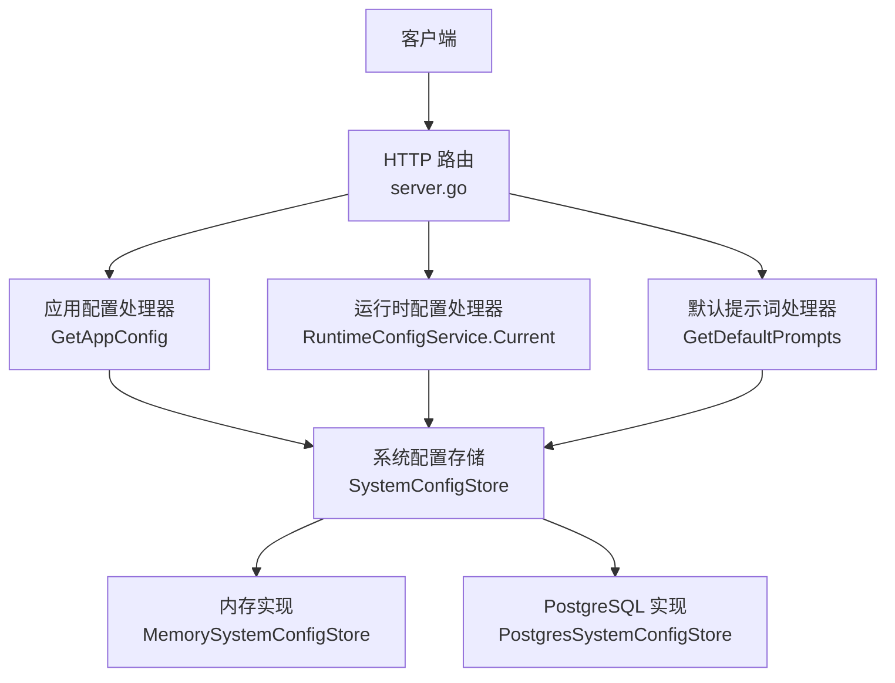
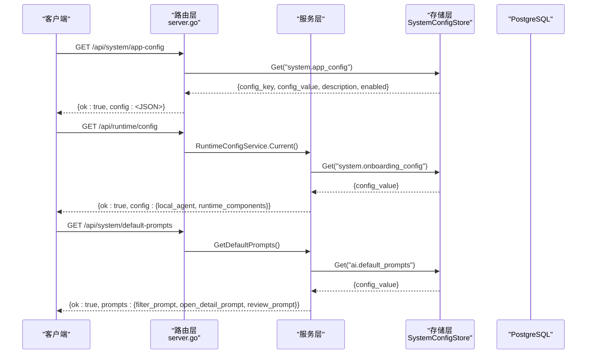
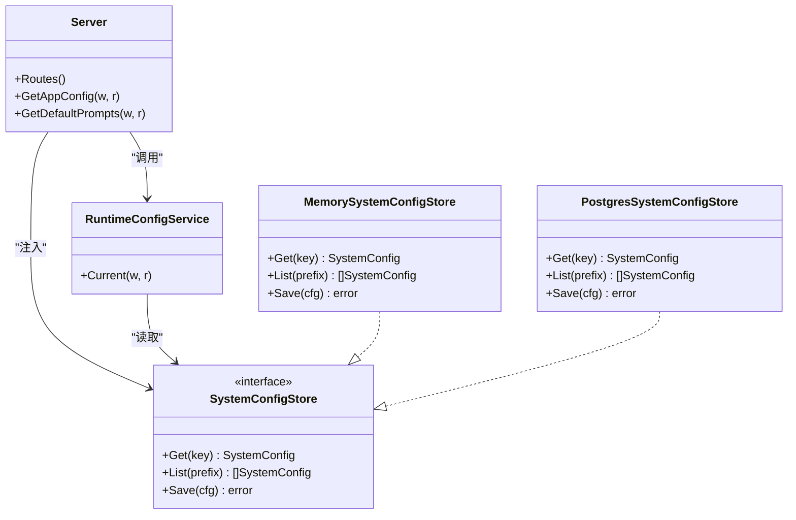

# 系统配置API

<cite>
**本文引用的文件**
- [server.go](file://goodhr5/cloud/backend/internal/httpapi/server.go)
- [runtime_config.go](file://goodhr5/cloud/backend/internal/httpapi/runtime_config.go)
- [default_prompts.go](file://goodhr5/cloud/backend/internal/httpapi/default_prompts.go)
- [system_config_store.go](file://goodhr5/cloud/backend/internal/httpapi/system_config_store.go)
- [0021_system_app_config.sql](file://goodhr5/cloud/backend/db/migrations/0021_system_app_config.sql)
- [0015_system_default_prompts.down.sql](file://goodhr5/cloud/backend/db/migrations/0015_system_default_prompts.down.sql)
</cite>

## 目录
1. [简介](#简介)
2. [项目结构](#项目结构)
3. [核心组件](#核心组件)
4. [架构总览](#架构总览)
5. [详细接口说明](#详细接口说明)
6. [依赖关系分析](#依赖关系分析)
7. [性能与一致性](#性能与一致性)
8. [故障排查指南](#故障排查指南)
9. [结论](#结论)
10. [附录：配置示例与最佳实践](#附录配置示例与最佳实践)

## 简介
本文件面向系统配置相关 API，覆盖三类能力：
- 应用配置：对外暴露前端公共系统配置（版本要求、公告、广告位等）。
- 运行时配置：为已登录用户返回本地程序与运行组件的下载与版本信息。
- 默认提示词：统一从系统配置表读取 AI 默认提示词，供岗位模板空字段兜底使用。

这些接口均基于统一的系统配置存储抽象，支持内存实现（开发）与 PostgreSQL 实现（生产），并通过迁移脚本提供初始数据。

## 项目结构
与系统配置 API 相关的后端代码集中在云端 HTTP API 包中：
- 路由注册与公共响应封装位于 server.go。
- 运行时配置服务位于 runtime_config.go。
- 默认提示词服务位于 default_prompts.go。
- 系统配置存储抽象与实现位于 system_config_store.go。
- 数据库迁移定义系统配置初始值与回滚逻辑。

图表来源
- [server.go:123-211](file://goodhr5/cloud/backend/internal/httpapi/server.go#L123-L211)
- [runtime_config.go:20-38](file://goodhr5/cloud/backend/internal/httpapi/runtime_config.go#L20-L38)
- [default_prompts.go:59-76](file://goodhr5/cloud/backend/internal/httpapi/default_prompts.go#L59-L76)
- [system_config_store.go:19-27](file://goodhr5/cloud/backend/internal/httpapi/system_config_store.go#L19-L27)

章节来源
- [server.go:123-211](file://goodhr5/cloud/backend/internal/httpapi/server.go#L123-L211)
- [system_config_store.go:19-27](file://goodhr5/cloud/backend/internal/httpapi/system_config_store.go#L19-L27)

## 核心组件
- 系统配置存储抽象 SystemConfigStore：定义 Get/List/Save 三个方法，屏蔽底层存储差异。
- 内存实现 MemorySystemConfigStore：用于未启用 PostgreSQL 的开发环境，内置默认配置键值。
- PostgreSQL 实现 PostgresSystemConfigStore：通过 system_configs 表持久化配置，支持按前缀列出启用配置。
- 运行时配置服务 RuntimeConfigService：校验会话后，从 system.onboarding_config 读取并返回本地程序与运行组件配置。
- 默认提示词处理 GetDefaultPrompts：校验会话后，从 ai.default_prompts 读取 JSON，缺失时回退内置提示词。
- 应用配置处理 GetAppConfig：无需鉴权，直接返回 system.app_config 的 JSON。

章节来源
- [system_config_store.go:11-27](file://goodhr5/cloud/backend/internal/httpapi/system_config_store.go#L11-L27)
- [system_config_store.go:33-43](file://goodhr5/cloud/backend/internal/httpapi/system_config_store.go#L33-L43)
- [system_config_store.go:380-462](file://goodhr5/cloud/backend/internal/httpapi/system_config_store.go#L380-L462)
- [runtime_config.go:9-38](file://goodhr5/cloud/backend/internal/httpapi/runtime_config.go#L9-L38)
- [default_prompts.go:29-76](file://goodhr5/cloud/backend/internal/httpapi/default_prompts.go#L29-L76)
- [server.go:279-306](file://goodhr5/cloud/backend/internal/httpapi/server.go#L279-L306)

## 架构总览
系统配置 API 采用“路由层 + 服务层 + 存储抽象”的分层设计：
- 路由层负责 HTTP 方法校验、鉴权（部分接口）、参数解析与统一响应封装。
- 服务层聚焦业务语义：如读取 onboarding_config、ai.default_prompts。
- 存储层提供一致的 Get/List/Save 接口，支持内存与数据库双实现。

图表来源
- [server.go:279-306](file://goodhr5/cloud/backend/internal/httpapi/server.go#L279-L306)
- [runtime_config.go:20-38](file://goodhr5/cloud/backend/internal/httpapi/runtime_config.go#L20-L38)
- [default_prompts.go:59-76](file://goodhr5/cloud/backend/internal/httpapi/default_prompts.go#L59-L76)
- [system_config_store.go:380-462](file://goodhr5/cloud/backend/internal/httpapi/system_config_store.go#L380-L462)

## 详细接口说明

### /api/system/app-config（应用配置）
- 功能：返回前端公共系统配置，包含本地执行器最低版本、邮箱域名白名单、系统公告、后台横幅等。
- 鉴权：无需登录。
- 请求：GET
- 响应：
  - ok: boolean
  - config: object（来自 system.app_config 的 JSON）
- 错误：
  - 404：未找到 system.app_config
  - 500：配置项无效或加载失败
- 数据来源：system_configs 表中 config_key = "system.app_config" 的 config_value 字段。
- 动态更新：修改该配置后，下一次请求即生效（无缓存）。
- 版本兼容：前端根据 local_agent_version 进行版本校验；announcements 列表控制公告展示。

章节来源
- [server.go:279-306](file://goodhr5/cloud/backend/internal/httpapi/server.go#L279-L306)
- [system_config_store.go:380-462](file://goodhr5/cloud/backend/internal/httpapi/system_config_store.go#L380-L462)
- [0021_system_app_config.sql:1-24](file://goodhr5/cloud/backend/db/migrations/0021_system_app_config.sql#L1-L24)

### /api/runtime/config（运行时配置）
- 功能：为已登录用户返回本地程序与运行组件的配置，包括本地程序版本列表、各平台运行组件下载地址与哈希、控制台地址等。
- 鉴权：需要有效会话。
- 请求：GET
- 响应：
  - ok: boolean
  - config: object
    - local_agent: array（本地程序版本与下载信息）
    - runtime_components: object（node_runtime、cloakbrowser、ocr 等组件的版本与下载信息）
- 错误：
  - 401：会话无效或过期
  - 405：非 GET 方法
  - 500：加载失败
- 数据来源：system_configs 表中 config_key = "system.onboarding_config" 的 config_value 字段。
- 动态更新：修改该配置后，下一次请求即生效。
- 版本兼容：前端依据 local_agent.version 与 runtime_components.*.version 判断是否需要更新。

章节来源
- [runtime_config.go:20-38](file://goodhr5/cloud/backend/internal/httpapi/runtime_config.go#L20-L38)
- [system_config_store.go:380-462](file://goodhr5/cloud/backend/internal/httpapi/system_config_store.go#L380-L462)

### /api/system/default-prompts（默认提示词）
- 功能：返回系统级 AI 默认提示词，供岗位模板空字段兜底使用。
- 鉴权：需要有效会话。
- 请求：GET
- 响应：
  - ok: boolean
  - prompts: object
    - filter_prompt: string（筛选提示词）
    - open_detail_prompt: string（打开详情提示词）
    - review_prompt: string（复核提示词，为空时使用内置默认值）
- 错误：
  - 401：会话无效或过期
  - 405：非 GET 方法
  - 500：加载失败
- 数据来源：system_configs 表中 config_key = "ai.default_prompts" 的 config_value 字段。
- 动态更新：修改该配置后，下一次请求即生效。
- 版本兼容：review_prompt 为空时自动回退到内置默认提示词，保证向后兼容。

章节来源
- [default_prompts.go:29-76](file://goodhr5/cloud/backend/internal/httpapi/default_prompts.go#L29-L76)
- [system_config_store.go:380-462](file://goodhr5/cloud/backend/internal/httpapi/system_config_store.go#L380-L462)
- [0015_system_default_prompts.down.sql:1-3](file://goodhr5/cloud/backend/db/migrations/0015_system_default_prompts.down.sql#L1-L3)

## 依赖关系分析
- 路由层依赖：
  - 认证服务：对需要鉴权的接口进行会话校验。
  - 系统配置存储：统一读取 system_configs。
- 存储层依赖：
  - 内存实现：适用于开发环境，内置默认配置键值。
  - PostgreSQL 实现：通过 system_configs 表持久化配置，支持按前缀列出启用配置。
- 迁移脚本：
  - 0021_system_app_config.sql：初始化 system.app_config。
  - 0015_system_default_prompts.down.sql：回滚移除 ai.default_prompts。

图表来源
- [server.go:16-44](file://goodhr5/cloud/backend/internal/httpapi/server.go#L16-L44)
- [server.go:279-306](file://goodhr5/cloud/backend/internal/httpapi/server.go#L279-L306)
- [runtime_config.go:9-38](file://goodhr5/cloud/backend/internal/httpapi/runtime_config.go#L9-L38)
- [system_config_store.go:11-27](file://goodhr5/cloud/backend/internal/httpapi/system_config_store.go#L11-L27)
- [system_config_store.go:33-43](file://goodhr5/cloud/backend/internal/httpapi/system_config_store.go#L33-L43)
- [system_config_store.go:380-462](file://goodhr5/cloud/backend/internal/httpapi/system_config_store.go#L380-L462)

章节来源
- [server.go:16-44](file://goodhr5/cloud/backend/internal/httpapi/server.go#L16-L44)
- [system_config_store.go:11-27](file://goodhr5/cloud/backend/internal/httpapi/system_config_store.go#L11-L27)

## 性能与一致性
- 读取路径：所有配置读取均为单次数据库查询（或内存映射），无额外缓存层，确保最新配置即时生效。
- 并发安全：内存存储在进程内读写，适合单进程开发；PostgreSQL 实现由数据库保证一致性与并发安全。
- 序列化开销：配置以 JSON 字符串存储，读取后进行反序列化为对象，注意大 JSON 时的网络与 CPU 开销。
- 建议：
  - 将频繁读取且稳定的配置（如平台选择器）放在独立的 key，避免一次读取过大 JSON。
  - 在生产环境开启连接池与合理的超时设置（已在数据库连接处配置）。

[本节为通用指导，不直接分析具体文件]

## 故障排查指南
- 401 未授权：
  - 检查会话是否有效或过期。
  - 确认请求携带了正确的认证头。
- 404 未找到：
  - 检查 system.app_config 是否存在于 system_configs 表。
  - 检查迁移脚本是否正确执行。
- 500 内部错误：
  - 检查配置 JSON 是否合法。
  - 检查数据库连接与权限。
- 默认提示词为空：
  - 若 ai.default_prompts 不存在或 review_prompt 为空，系统将回退到内置默认提示词。

章节来源
- [server.go:279-306](file://goodhr5/cloud/backend/internal/httpapi/server.go#L279-L306)
- [default_prompts.go:59-76](file://goodhr5/cloud/backend/internal/httpapi/default_prompts.go#L59-L76)
- [system_config_store.go:380-462](file://goodhr5/cloud/backend/internal/httpapi/system_config_store.go#L380-L462)

## 结论
系统配置 API 通过统一的存储抽象，提供了稳定、可扩展的配置管理能力。应用配置、运行时配置与默认提示词三大接口覆盖了前端与本地执行器的关键需求。配置变更即时生效，便于热重载；同时通过迁移脚本保障初始数据与版本演进。建议在团队内建立配置变更流程，确保键名、结构与描述的一致性。

[本节为总结性内容，不直接分析具体文件]

## 附录：配置示例与最佳实践

### 配置项分类
- 应用配置（system.app_config）：
  - local_agent_version：本地程序最低版本要求。
  - email_domain_whitelist：邮箱域名白名单。
  - announcements_enabled：是否启用公告。
  - announcements：公告数组，包含 id、title、content、once、enabled、created_at。
  - admin_banner/admin_banners：后台横幅配置。
- 运行时配置（system.onboarding_config）：
  - local_agent：本地程序版本与下载信息数组。
  - local_agent_console_url：本地程序控制台地址。
  - runtime_components：运行组件（node_runtime、cloakbrowser、ocr）在各平台的版本、URL、SHA256 与说明。
  - trial_days：试用天数。
- 默认提示词（ai.default_prompts）：
  - filter_prompt：筛选提示词。
  - open_detail_prompt：打开详情提示词。
  - review_prompt：复核提示词（为空时使用内置默认值）。

章节来源
- [system_config_store.go:45-187](file://goodhr5/cloud/backend/internal/httpapi/system_config_store.go#L45-L187)
- [0021_system_app_config.sql:1-24](file://goodhr5/cloud/backend/db/migrations/0021_system_app_config.sql#L1-L24)

### 动态更新与热重载
- 所有配置读取均直接从存储层获取，无缓存，修改后立即生效。
- 建议：
  - 在低峰期发布配置变更。
  - 对关键配置增加描述与变更记录，便于回溯。

章节来源
- [server.go:279-306](file://goodhr5/cloud/backend/internal/httpapi/server.go#L279-L306)
- [runtime_config.go:20-38](file://goodhr5/cloud/backend/internal/httpapi/runtime_config.go#L20-L38)
- [default_prompts.go:59-76](file://goodhr5/cloud/backend/internal/httpapi/default_prompts.go#L59-L76)

### 配置验证规则
- 必填字段：
  - system.app_config：至少包含 local_agent_version 与 announcements_enabled。
  - system.onboarding_config：至少包含 local_agent 与 runtime_components。
  - ai.default_prompts：至少包含 filter_prompt 与 open_detail_prompt；review_prompt 可为空。
- 类型约束：
  - local_agent_version：字符串，遵循语义化版本。
  - announcements：数组，每项需包含 id、title、content、once、enabled、created_at。
  - runtime_components：对象，键为组件名，值为平台对象（win/mac），包含 version、url、sha256、note。
- 行为约束：
  - 仅启用（enabled=true）的配置会被 List 返回。
  - review_prompt 为空时回退到内置默认提示词。

章节来源
- [system_config_store.go:45-187](file://goodhr5/cloud/backend/internal/httpapi/system_config_store.go#L45-L187)
- [default_prompts.go:29-76](file://goodhr5/cloud/backend/internal/httpapi/default_prompts.go#L29-L76)

### 配置备份与恢复
- 备份：
  - 导出 system_configs 表的全部记录，保留 config_key、config_value、description、enabled。
- 恢复：
  - 导入备份 SQL，注意 ON CONFLICT 策略以避免重复插入。
- 建议：
  - 变更前先备份。
  - 对关键配置（如支付、订阅）增加变更审批与回滚预案。

[本节为通用指导，不直接分析具体文件]

### 完整示例：系统参数调整与平台配置更新
- 调整系统参数：
  - 修改 system.app_config 中的 local_agent_version，以强制前端升级本地程序。
  - 更新 announcements 列表，发布新版本公告。
- 更新平台配置：
  - 修改 system.onboarding_config 中的 runtime_components，发布新的 node_runtime 或 cloakbrowser 版本。
  - 更新 local_agent_console_url，指向新的控制台地址。
- 默认提示词优化：
  - 在 ai.default_prompts 中完善 filter_prompt 与 open_detail_prompt，提升筛选与详情打开质量。
  - 如需自定义 review_prompt，可替换为空或新文本，否则保持为空以使用内置默认值。

章节来源
- [system_config_store.go:45-187](file://goodhr5/cloud/backend/internal/httpapi/system_config_store.go#L45-L187)
- [server.go:279-306](file://goodhr5/cloud/backend/internal/httpapi/server.go#L279-L306)
- [runtime_config.go:20-38](file://goodhr5/cloud/backend/internal/httpapi/runtime_config.go#L20-L38)
- [default_prompts.go:59-76](file://goodhr5/cloud/backend/internal/httpapi/default_prompts.go#L59-L76)