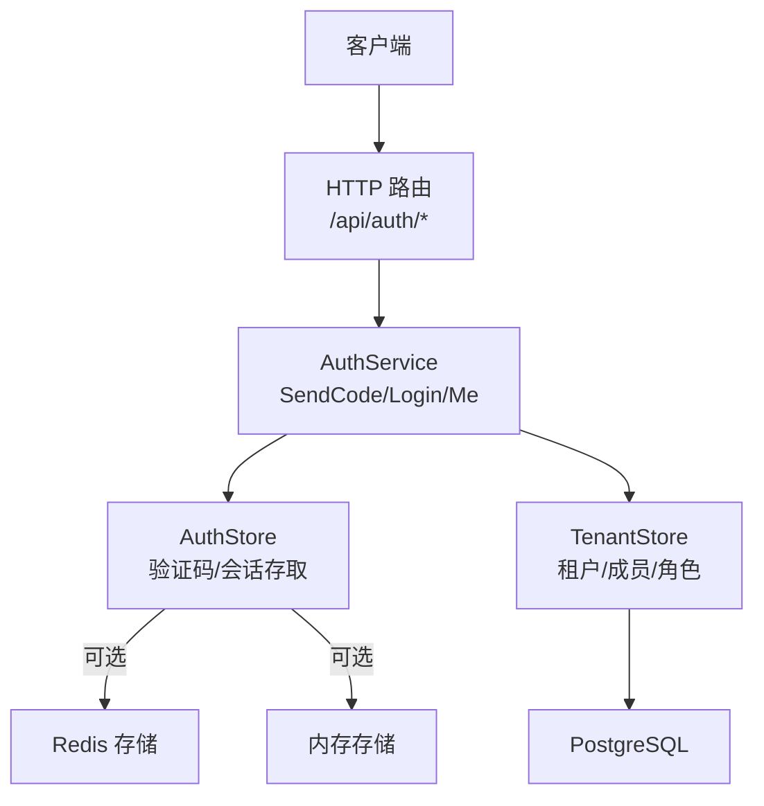
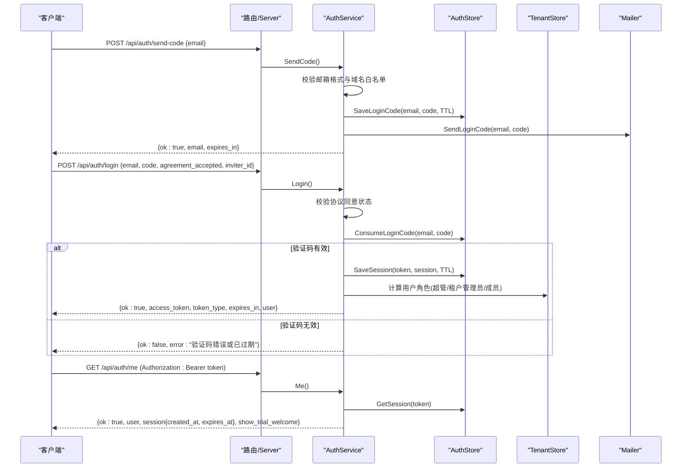
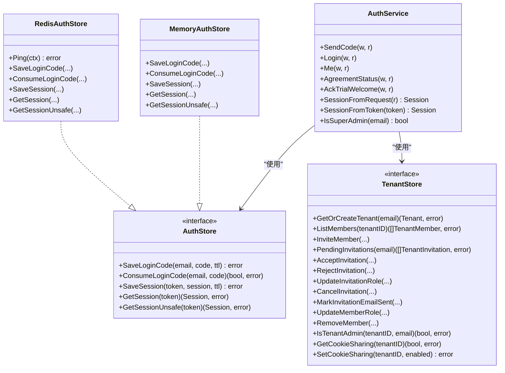

# 认证授权API

<cite>
**本文引用的文件**
- [server.go](file://goodhr5/cloud/backend/internal/httpapi/server.go)
- [auth.go](file://goodhr5/cloud/backend/internal/httpapi/auth.go)
- [auth_store.go](file://goodhr5/cloud/backend/internal/httpapi/auth_store.go)
- [redis_auth_store.go](file://goodhr5/cloud/backend/internal/httpapi/redis_auth_store.go)
- [tenant.go](file://goodhr5/cloud/backend/internal/httpapi/tenant.go)
- [tenant_store.go](file://goodhr5/cloud/backend/internal/httpapi/tenant_store.go)
- [postgres_user.go](file://goodhr5/cloud/backend/internal/httpapi/postgres_user.go)
- [auth_test.go](file://goodhr5/cloud/backend/internal/httpapi/auth_test.go)
</cite>

## 目录
1. [简介](#简介)
2. [项目结构](#项目结构)
3. [核心组件](#核心组件)
4. [架构总览](#架构总览)
5. [详细接口说明](#详细接口说明)
6. [依赖关系分析](#依赖关系分析)
7. [性能与安全考虑](#性能与安全考虑)
8. [故障排查指南](#故障排查指南)
9. [结论](#结论)

## 简介
本文件为 GoodHR 云端后端的认证授权 API 文档，覆盖邮箱验证码登录流程、会话管理机制与租户隔离实现。重点说明以下接口：
- POST /api/auth/send-code：发送邮箱验证码
- POST /api/auth/login：使用验证码登录并获取访问令牌
- GET /api/auth/me：校验当前登录态并返回用户信息

同时说明权限验证中间件（基于 Bearer Token 的会话校验）、超管理员权限检查、租户角色判定等实现细节，并提供成功与失败场景的请求响应示例。

## 项目结构
认证相关能力集中在 HTTP API 层，由路由注册、认证服务、存储抽象与租户管理组成：
- 路由注册：统一挂载 /api/auth/* 路径到对应处理器
- 认证服务：处理验证码生成、登录校验、会话创建与会话解析
- 存储抽象：验证码与会话可基于内存或 Redis 持久化
- 租户管理：根据邮箱归属租户及成员角色计算用户角色与权限

图表来源
- [server.go:124-133](file://goodhr5/cloud/backend/internal/httpapi/server.go#L124-L133)
- [auth.go:21-69](file://goodhr5/cloud/backend/internal/httpapi/auth.go#L21-L69)
- [auth_store.go:11-23](file://goodhr5/cloud/backend/internal/httpapi/auth_store.go#L11-L23)
- [redis_auth_store.go:12-24](file://goodhr5/cloud/backend/internal/httpapi/redis_auth_store.go#L12-L24)
- [tenant_store.go:55-70](file://goodhr5/cloud/backend/internal/httpapi/tenant_store.go#L55-L70)

章节来源
- [server.go:124-133](file://goodhr5/cloud/backend/internal/httpapi/server.go#L124-L133)

## 核心组件
- AuthService：封装验证码发送、登录校验、会话创建与解析、用户信息输出、超管判断、邀请绑定与试用奖励通知等
- AuthStore 接口：定义验证码保存/消费与会话存取的统一抽象；提供内存实现与 Redis 实现
- TenantStore 接口：定义租户与成员管理、角色判定、邀请流程等；提供内存与 PostgreSQL 实现
- Server：负责路由注册与公共响应工具，所有认证接口通过该服务暴露

关键职责与交互：
- 发送验证码：校验邮箱域名白名单，生成随机验证码，保存到存储，发送邮件
- 登录：校验协议同意状态，验证验证码（支持动态万能码），创建会话，记录登录活动，发放试用奖励与邀请奖励，返回 access_token
- 获取当前用户：从 Authorization 头解析 Bearer token，读取会话，返回用户公开信息与会话有效期

章节来源
- [auth.go:71-214](file://goodhr5/cloud/backend/internal/httpapi/auth.go#L71-L214)
- [auth_store.go:11-23](file://goodhr5/cloud/backend/internal/httpapi/auth_store.go#L11-L23)
- [redis_auth_store.go:36-87](file://goodhr5/cloud/backend/internal/httpapi/redis_auth_store.go#L36-L87)
- [tenant_store.go:55-70](file://goodhr5/cloud/backend/internal/httpapi/tenant_store.go#L55-L70)

## 架构总览
认证授权的整体流程如下：

图表来源
- [server.go:124-133](file://goodhr5/cloud/backend/internal/httpapi/server.go#L124-L133)
- [auth.go:71-214](file://goodhr5/cloud/backend/internal/httpapi/auth.go#L71-L214)
- [auth_store.go:45-98](file://goodhr5/cloud/backend/internal/httpapi/auth_store.go#L45-L98)
- [redis_auth_store.go:36-87](file://goodhr5/cloud/backend/internal/httpapi/redis_auth_store.go#L36-L87)
- [tenant_store.go:55-70](file://goodhr5/cloud/backend/internal/httpapi/tenant_store.go#L55-L70)

## 详细接口说明

### POST /api/auth/send-code（发送验证码）
- 功能：向指定邮箱发送登录验证码，验证码有效期固定
- 请求体字段
  - email: 字符串，邮箱地址（会被规范化为小写并校验格式）
- 成功响应
  - ok: true
  - email: 规范化后的邮箱
  - expires_in: 验证码有效期秒数
  - debug_code: 仅在调试模式下返回（开发环境）
- 错误响应
  - 方法不允许：当非 POST
  - 参数错误：JSON 解析失败或邮箱格式非法
  - 禁止访问：邮箱域名不在系统配置白名单
  - 内部错误：验证码保存失败或邮件发送失败

典型请求示例
- 请求
  - POST /api/auth/send-code
  - Content-Type: application/json
  - Body: {"email":"User@Example.com"}
- 成功响应
  - 200 OK
  - Body: {"ok":true,"email":"user@example.com","expires_in":300}
- 失败响应（域名不在白名单）
  - 403 Forbidden
  - Body: {"ok":false,"error":"该邮箱域名不在白名单内，请使用qq邮箱、163 等等常见邮箱域名"}

安全要点
- 验证码有效期固定为 5 分钟
- 验证码仅用于一次性验证，验证后即被消费删除
- 支持“动态万能验证码”机制（需配置偏移分钟数），用于特定测试或运维场景

章节来源
- [auth.go:17-19](file://goodhr5/cloud/backend/internal/httpapi/auth.go#L17-L19)
- [auth.go:71-119](file://goodhr5/cloud/backend/internal/httpapi/auth.go#L71-L119)
- [auth.go:304-329](file://goodhr5/cloud/backend/internal/httpapi/auth.go#L304-L329)
- [auth_test.go:19-40](file://goodhr5/cloud/backend/internal/httpapi/auth_test.go#L19-L40)
- [auth_test.go:358-373](file://goodhr5/cloud/backend/internal/httpapi/auth_test.go#L358-L373)

### POST /api/auth/login（验证码登录）
- 功能：使用邮箱验证码登录，成功后创建会话并返回访问令牌
- 请求体字段
  - email: 字符串，邮箱地址
  - code: 字符串，4 位验证码
  - agreement_accepted: 布尔值，是否在本次登录时同意使用协议
  - inviter_id: 字符串，可选，邀请人标识，用于绑定邀请关系并发放奖励
- 成功响应
  - ok: true
  - access_token: 访问令牌（前缀 gh5_）
  - token_type: "Bearer"
  - expires_in: 会话有效期秒数（默认 30 天）
  - user: 用户公开信息对象，包含 id、invite_id、email、role、role_label、is_super_admin
- 错误响应
  - 方法不允许：当非 POST
  - 参数错误：JSON 解析失败、邮箱非法、验证码长度不为 4
  - 未同意协议：若尚未同意且本次未勾选同意
  - 验证码错误：验证码不匹配或已过期
  - 内部错误：令牌生成失败、会话保存失败、登录记录失败、邀请绑定失败、试用奖励通知失败

典型请求示例
- 请求
  - POST /api/auth/login
  - Content-Type: application/json
  - Body: {"email":"user@example.com","code":"1234","agreement_accepted":true,"inviter_id":""}
- 成功响应
  - 200 OK
  - Body: {"ok":true,"access_token":"gh5_...","token_type":"Bearer","expires_in":2592000,"user":{"id":"...","invite_id":"...","email":"user@example.com","role":"admin","role_label":"管理员","is_super_admin":false}}
- 失败响应（验证码错误）
  - 401 Unauthorized
  - Body: {"ok":false,"error":"验证码错误或已过期"}

安全要点
- 验证码一次性使用，验证后立即删除
- 支持动态万能验证码（需配置偏移分钟数），用于特定场景
- 登录成功后会记录最近登录时间并刷新试用欢迎提示状态
- 首次登录可能触发试用会员赠送邮件与 AI 钱包初始化

章节来源
- [auth.go:121-214](file://goodhr5/cloud/backend/internal/httpapi/auth.go#L121-L214)
- [auth.go:304-329](file://goodhr5/cloud/backend/internal/httpapi/auth.go#L304-L329)
- [auth_test.go:42-63](file://goodhr5/cloud/backend/internal/httpapi/auth_test.go#L42-L63)
- [auth_test.go:268-288](file://goodhr5/cloud/backend/internal/httpapi/auth_test.go#L268-L288)

### GET /api/auth/me（获取当前用户信息）
- 功能：校验当前登录态并返回用户公开信息与会话有效期
- 请求头
  - Authorization: Bearer <access_token>
- 成功响应
  - ok: true
  - user: 用户公开信息对象（同登录返回）
  - session: 会话信息对象，包含 created_at、expires_at
  - show_trial_welcome: 是否展示试用欢迎弹框
- 错误响应
  - 方法不允许：当非 GET
  - 未授权：缺少 Authorization 头或 token 无效/过期

典型请求示例
- 请求
  - GET /api/auth/me
  - Authorization: Bearer gh5_...
- 成功响应
  - 200 OK
  - Body: {"ok":true,"user":{"id":"...","email":"user@example.com","role":"admin","role_label":"管理员","is_super_admin":false},"session":{"created_at":"...","expires_at":"..."},"show_trial_welcome":false}
- 失败响应（未带 token）
  - 401 Unauthorized
  - Body: {"ok":false,"error":"请刷新浏览器，重新登录"}

安全要点
- 会话有效期默认 30 天，过期后需重新登录
- 每次调用会刷新最近登录活动时间（便于统计与风控）

章节来源
- [auth.go:216-255](file://goodhr5/cloud/backend/internal/httpapi/auth.go#L216-L255)
- [auth_test.go:65-88](file://goodhr5/cloud/backend/internal/httpapi/auth_test.go#L65-L88)
- [auth_test.go:375-387](file://goodhr5/cloud/backend/internal/httpapi/auth_test.go#L375-L387)

## 依赖关系分析
认证授权涉及的核心依赖与关系如下：

图表来源
- [auth.go:21-69](file://goodhr5/cloud/backend/internal/httpapi/auth.go#L21-L69)
- [auth_store.go:11-23](file://goodhr5/cloud/backend/internal/httpapi/auth_store.go#L11-L23)
- [redis_auth_store.go:12-24](file://goodhr5/cloud/backend/internal/httpapi/redis_auth_store.go#L12-L24)
- [tenant_store.go:55-70](file://goodhr5/cloud/backend/internal/httpapi/tenant_store.go#L55-L70)

章节来源
- [auth.go:21-69](file://goodhr5/cloud/backend/internal/httpapi/auth.go#L21-L69)
- [auth_store.go:11-23](file://goodhr5/cloud/backend/internal/httpapi/auth_store.go#L11-L23)
- [redis_auth_store.go:12-24](file://goodhr5/cloud/backend/internal/httpapi/redis_auth_store.go#L12-L24)
- [tenant_store.go:55-70](file://goodhr5/cloud/backend/internal/httpapi/tenant_store.go#L55-L70)

## 性能与安全考虑

### 性能特性
- 验证码与会话存储可选择内存或 Redis：
  - 内存实现适合单机或开发环境，读写快速但进程重启丢失
  - Redis 实现适合多实例部署，具备持久化与高可用能力
- 会话有效期较长（默认 30 天），减少频繁登录开销
- 登录与 me 接口均会记录最近登录时间，便于统计与风控

### 安全事项
- 验证码有效期固定为 5 分钟，且一次性使用
- 支持动态万能验证码（需配置偏移分钟数），仅用于特定测试或运维场景
- 会话以随机令牌形式存储，避免猜测攻击
- 密码加密存储：当前认证流程采用邮箱验证码登录，不涉及密码存储与校验
- 邮箱域名白名单：限制可接收验证码的邮箱域名，降低滥用风险
- 协议同意：登录前需确认用户已同意使用协议，否则拒绝登录
- 超管理员权限：通过配置列表判断是否为超管，超管可访问敏感管理接口
- 租户隔离：用户角色基于租户成员身份判定，管理员与普通成员权限不同

章节来源
- [auth.go:17-19](file://goodhr5/cloud/backend/internal/httpapi/auth.go#L17-L19)
- [auth.go:83-119](file://goodhr5/cloud/backend/internal/httpapi/auth.go#L83-L119)
- [auth.go:121-214](file://goodhr5/cloud/backend/internal/httpapi/auth.go#L121-L214)
- [auth.go:522-563](file://goodhr5/cloud/backend/internal/httpapi/auth.go#L522-L563)
- [redis_auth_store.go:36-87](file://goodhr5/cloud/backend/internal/httpapi/redis_auth_store.go#L36-L87)

## 故障排查指南
常见问题与定位建议：
- 发送验证码失败
  - 检查邮箱格式与域名白名单配置
  - 检查邮件服务是否正常
  - 查看日志中验证码保存与发送的错误信息
- 登录失败
  - 确认验证码是否正确且未过期
  - 确认是否已同意使用协议
  - 检查验证码消费逻辑与存储可用性
- 获取当前用户失败
  - 确认 Authorization 头是否携带正确的 Bearer token
  - 检查会话是否过期或无效
- 超管权限不足
  - 确认当前邮箱是否在超管配置列表中
  - 检查租户管理员判定逻辑

章节来源
- [auth.go:71-214](file://goodhr5/cloud/backend/internal/httpapi/auth.go#L71-L214)
- [auth.go:216-255](file://goodhr5/cloud/backend/internal/httpapi/auth.go#L216-L255)
- [auth_test.go:268-288](file://goodhr5/cloud/backend/internal/httpapi/auth_test.go#L268-L288)
- [auth_test.go:375-387](file://goodhr5/cloud/backend/internal/httpapi/auth_test.go#L375-L387)

## 结论
GoodHR 云端认证授权 API 采用邮箱验证码登录模式，结合会话管理与租户隔离，提供简洁安全的身份认证与权限控制。通过可插拔的存储抽象，支持内存与 Redis 两种实现，满足开发与生产环境的差异化需求。超管理员权限与租户管理员角色清晰分离，确保敏感操作受控。建议在部署时合理配置邮箱域名白名单、验证码有效期与会话超时策略，并结合日志与监控进行安全审计与问题定位。