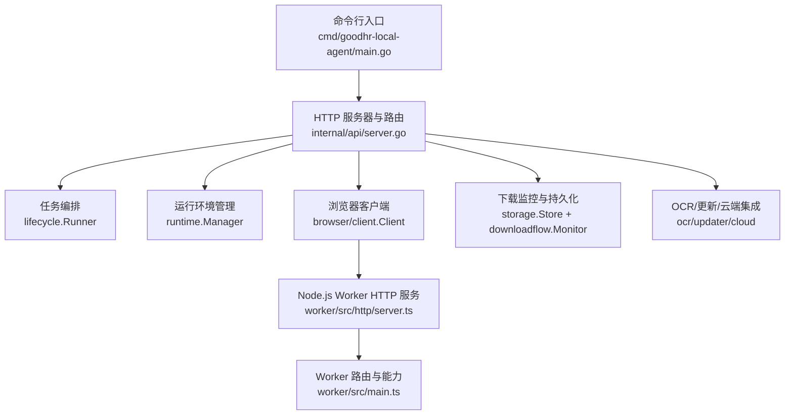
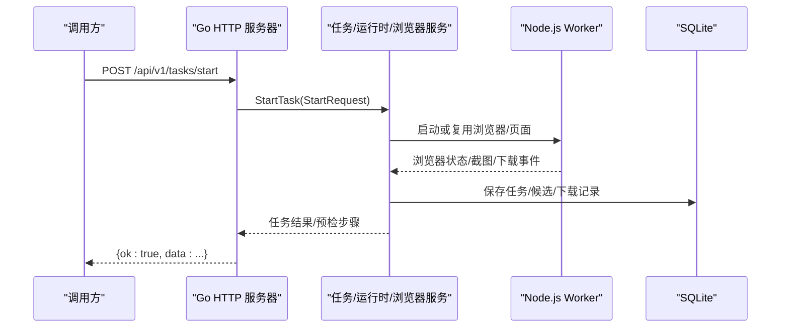
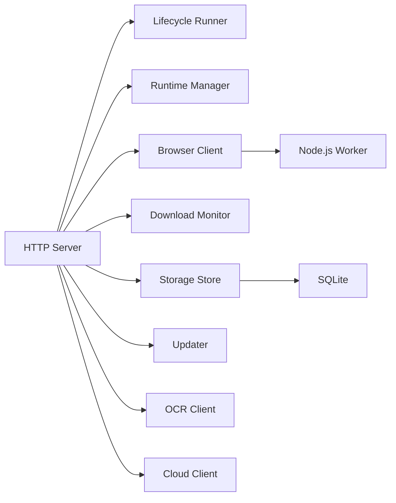

# 本地Agent HTTP API

<cite>
**本文引用的文件**
- [main.go](file://goodhr5/local-agent-go-new/cmd/goodhr-local-agent/main.go)
- [server.go](file://goodhr5/local-agent-go-new/internal/api/server.go)
- [agent_binding.go](file://goodhr5/local-agent-go-new/internal/api/agent_binding.go)
- [diagnostics.go](file://goodhr5/local-agent-go-new/internal/api/diagnostics.go)
- [downloads.go](file://goodhr5/local-agent-go-new/internal/api/downloads.go)
- [update.go](file://goodhr5/local-agent-go-new/internal/api/update.go)
- [config.go](file://goodhr5/local-agent-go-new/internal/config/config.go)
- [browser-api.md](file://goodhr5/local-agent-go-new/contracts/browser-api.md)
- [worker main.ts](file://goodhr5/local-agent-go-new/worker/src/main.ts)
- [worker server.ts](file://goodhr5/local-agent-go-new/worker/src/http/server.ts)
- [store.go](file://goodhr5/local-agent-go-new/internal/storage/store.go)
- [download.go](file://goodhr5/local-agent-go-new/internal/storage/download.go)
</cite>

## 目录
1. [简介](#简介)
2. [项目结构](#项目结构)
3. [核心组件](#核心组件)
4. [架构总览](#架构总览)
5. [详细接口说明](#详细接口说明)
6. [依赖关系分析](#依赖关系分析)
7. [性能与可靠性](#性能与可靠性)
8. [故障排查指南](#故障排查指南)
9. [结论](#结论)
10. [附录：配置与环境变量](#附录：配置与环境变量)

## 简介
本文件为 HRPlus 新本地 Agent 的 HTTP API 完整参考，覆盖本地服务暴露的所有端点、请求参数校验、响应数据结构、错误处理机制、安全与跨域策略、端口与路径约定，以及浏览器 Worker 进程与主程序之间的 IPC 协议。文档同时涵盖本地存储访问、文件操作、系统资源监控等底层能力，便于本地执行器开发与系统集成。

## 项目结构
新本地程序由 Go 主进程提供 HTTP 服务，内部通过路由将请求分发到任务编排、运行时管理、浏览器控制、下载管理、更新、诊断等子系统；Node.js Worker 作为浏览器自动化子进程，仅监听本机地址并提供稳定的内部 HTTP 协议。

图表来源
- [main.go:21-63](file://goodhr5/local-agent-go-new/cmd/goodhr-local-agent/main.go#L21-L63)
- [server.go:67-119](file://goodhr5/local-agent-go-new/internal/api/server.go#L67-L119)
- [worker server.ts:6-41](file://goodhr5/local-agent-go-new/worker/src/http/server.ts#L6-L41)
- [worker main.ts:5-38](file://goodhr5/local-agent-go-new/worker/src/main.ts#L5-L38)

章节来源
- [main.go:21-63](file://goodhr5/local-agent-go-new/cmd/goodhr-local-agent/main.go#L21-L63)
- [server.go:67-119](file://goodhr5/local-agent-go-new/internal/api/server.go#L67-L119)

## 核心组件
- HTTP 服务器与中间件：统一健康检查、CORS 白名单、请求大小限制、严格 JSON 解码、统一成功/错误响应格式。
- 任务生命周期：启动、停止、状态查询，支持预检步骤返回。
- 运行环境：Node/Worker/CloakBrowser 安装与就绪检查、按需安装与确保。
- 浏览器控制：会话状态、页面打开/URL、截图、Cookie、下载管理等。
- 下载管理：当前下载列表、历史归档、目录切换、清理、文件打开/显示。
- 应用更新：更新进度查询与异步启动更新流程。
- 诊断信息：目录可写性、端口占用、Profile 锁、运行组件就绪情况与建议。
- 设备绑定：使用本机设备编号与浏览器 Token 完成云端绑定。
- 本地存储：SQLite 迁移、任务/候选人/对话/下载记录持久化与过期清理。

章节来源
- [server.go:137-421](file://goodhr5/local-agent-go-new/internal/api/server.go#L137-L421)
- [agent_binding.go:14-54](file://goodhr5/local-agent-go-new/internal/api/agent_binding.go#L14-L54)
- [diagnostics.go:18-192](file://goodhr5/local-agent-go-new/internal/api/diagnostics.go#L18-L192)
- [downloads.go:17-177](file://goodhr5/local-agent-go-new/internal/api/downloads.go#L17-L177)
- [update.go:11-37](file://goodhr5/local-agent-go-new/internal/api/update.go#L11-L37)
- [store.go:19-410](file://goodhr5/local-agent-go-new/internal/storage/store.go#L19-L410)
- [download.go:11-108](file://goodhr5/local-agent-go-new/internal/storage/download.go#L11-L108)

## 架构总览
本地 Agent 对外暴露一组受控的 HTTP 接口，所有请求经中间件进行安全头设置与受限跨域放行；业务处理器负责参数解析、调用下游服务并返回统一 JSON 结构。浏览器自动化由 Node.js Worker 承担，Go 通过内部 HTTP 协议与其通信，Worker 仅监听 127.0.0.1。

图表来源
- [server.go:163-184](file://goodhr5/local-agent-go-new/internal/api/server.go#L163-L184)
- [browser-api.md:37-68](file://goodhr5/local-agent-go-new/contracts/browser-api.md#L37-L68)
- [store.go:116-160](file://goodhr5/local-agent-go-new/internal/storage/store.go#L116-L160)

## 详细接口说明

### 通用约定
- 基础地址：http://{Host}:{Port}/...，默认 Host=127.0.0.1，默认 Port=43129。
- 请求体：JSON 对象，禁止未知字段，最大请求体大小限制为 1MB。
- 响应体：统一包装
  - 成功：{ ok: true, data: ... }
  - 失败：{ ok: false, error: { code, message }, trace_id? }
- 安全头：X-Content-Type-Options=nosniff；Cache-Control=no-store。
- 跨域：仅允许空 Origin、http://127.0.0.1、http://localhost 及特定 https goodhr5.58it.cn。

章节来源
- [config.go:15-28](file://goodhr5/local-agent-go-new/internal/config/config.go#L15-L28)
- [server.go:304-340](file://goodhr5/local-agent-go-new/internal/api/server.go#L304-L340)
- [server.go:342-384](file://goodhr5/local-agent-go-new/internal/api/server.go#L342-L384)

### 健康检查
- GET /health
- 用途：快速探测本地服务是否存活及版本、端口、数据目录等信息。
- 响应 data 字段包含：status、version、agent_version、port、data_dir、logs_dir、profiles_dir、extensions_dir、extension_paths、downloads_dir、screenshots_dir、db_path。

章节来源
- [server.go:137-161](file://goodhr5/local-agent-go-new/internal/api/server.go#L137-L161)

### 设备绑定（Agent 绑定）
- POST /api/v1/session/bind
- 请求体：{ token: string }
- 行为：读取本机设备编号，携带 agent_version、local_port 调用云端绑定。
- 错误码示例：TOKEN_REQUIRED、DEVICE_BINDING_UNAVAILABLE、DEVICE_ID_UNAVAILABLE、DEVICE_BIND_FAILED。
- 成功时返回云端绑定结果。

章节来源
- [agent_binding.go:14-54](file://goodhr5/local-agent-go-new/internal/api/agent_binding.go#L14-L54)

### 诊断信息
- GET /api/v1/diagnostics
- 返回：操作系统、架构、主机、端口、各目录存在性与可写性、端口占用情况、运行组件就绪状态（Node/Worker/OCR）、Profile 残留锁、建议项。
- 扩展目录打开：POST /api/v1/extensions/open-directory 用于用系统文件管理器打开扩展目录。

章节来源
- [diagnostics.go:18-192](file://goodhr5/local-agent-go-new/internal/api/diagnostics.go#L18-L192)

### 任务管理
- POST /api/v1/tasks/start
  - 请求体：强类型 StartRequest（由内部 shared 包定义），包含平台、岗位、动作等上下文。
  - 行为：启动统一任务流程，可能返回预检步骤结果。
  - 状态码：202 Accepted（已接受）、409 Conflict（冲突/预检失败）。
- POST /api/v1/tasks/stop
  - 请求体：{ task_id: string }
  - 行为：安全停止指定任务。
  - 错误码：INVALID_REQUEST、TASK_NOT_FOUND。
- GET /api/v1/tasks/{task_id}
  - 行为：查询任务状态，缺失时返回 404。

章节来源
- [server.go:163-218](file://goodhr5/local-agent-go-new/internal/api/server.go#L163-L218)

### 运行环境
- GET /api/v1/runtime/status
  - 返回 Node/Worker/CloakBrowser 安装与就绪状态、版本、数据目录、扩展目录等。
- POST /api/v1/runtime/ensure
  - 行为：确保 Worker 就绪，若未就绪返回 503。
- POST /api/v1/runtime/install
  - 行为：根据云端清单异步安装所需运行组件，需无活跃任务。
  - 错误码：TASK_RUNNING、RUNTIME_INSTALL_FAILED。

章节来源
- [server.go:220-278](file://goodhr5/local-agent-go-new/internal/api/server.go#L220-L278)

### 浏览器控制
- GET /api/v1/browser/status
  - 返回 CloakBrowser 会话状态。
- POST /api/v1/browser/stop
  - 行为：关闭浏览器会话，若有活跃任务则拒绝。
- POST /api/v1/page/open
  - 行为：打开页面（复用或新建标签页），遵循 Worker 协议中的 page.open 规则。
- GET /api/v1/page/url
  - 行为：获取当前页面 URL。

章节来源
- [server.go:280-302](file://goodhr5/local-agent-go-new/internal/api/server.go#L280-L302)
- [browser-api.md:37-68](file://goodhr5/local-agent-go-new/contracts/browser-api.md#L37-L68)

### OCR 能力
- GET /api/v1/local/ocr/status
  - 行为：查询 OCR 就绪状态。
- POST /api/v1/local/ocr/recognize
  - 行为：执行 OCR 识别（具体入参与返回由内部实现决定）。

章节来源
- [server.go:96-97](file://goodhr5/local-agent-go-new/internal/api/server.go#L96-L97)

### 规则管理
- GET /api/v1/local/rules/status
  - 行为：查询规则状态。
- POST /api/v1/local/rules/update
  - 行为：更新规则（具体入参与返回由内部实现决定）。

章节来源
- [server.go:98-99](file://goodhr5/local-agent-go-new/internal/api/server.go#L98-L99)

### 截图
- GET /api/v1/local/screenshots
  - 行为：列出截图。
- POST /api/v1/local/screenshots
  - 行为：创建截图（具体入参与返回由内部实现决定）。

章节来源
- [server.go:100-101](file://goodhr5/local-agent-go-new/internal/api/server.go#L100-L101)

### 应用更新
- GET /api/v1/app-update/status
  - 行为：查询更新进度。
- POST /api/v1/app-update/start
  - 行为：校验参数后异步启动更新流程。
  - 错误码：UPDATER_NOT_READY、APP_UPDATE_FAILED。

章节来源
- [update.go:11-37](file://goodhr5/local-agent-go-new/internal/api/update.go#L11-L37)

### 下载管理
- GET /api/v1/downloads
  - 行为：返回当前浏览器下载记录（来自 Worker）。
- GET /api/v1/downloads/history
  - 行为：返回 SQLite 中已结束的下载历史（含 count）。
- GET /api/v1/local/downloads
  - 行为：兼容路径，等同于下载历史。
- POST /api/v1/downloads/configure
  - 请求体：{ directory: string }，必须为绝对路径。
  - 行为：切换后续下载保存目录，并记录允许的根目录。
  - 错误码：INVALID_REQUEST、DOWNLOAD_CONFIGURE_FAILED。
- POST /api/v1/downloads/clear
  - 行为：清空内存下载记录，不删除用户文件。
  - 错误码：DOWNLOAD_CLEAR_FAILED。
- POST /api/v1/files/open
  - 请求体：{ path: string }，仅允许打开已确认下载目录内的真实文件。
  - 错误码：INVALID_FILE_PATH、FILE_ACTION_FAILED。
- POST /api/v1/files/reveal
  - 请求体：{ path: string }，在系统中显示该文件。
  - 错误码：INVALID_FILE_PATH、FILE_ACTION_FAILED。

章节来源
- [downloads.go:17-177](file://goodhr5/local-agent-go-new/internal/api/downloads.go#L17-L177)

### 本地位置快捷操作
- GET /api/v1/local/positions/{position_id}/{action}
  - 行为：针对某岗位的快捷操作（具体 action 由内部实现决定）。

章节来源
- [server.go:84](file://goodhr5/local-agent-go-new/internal/api/server.go#L84)

### Worker 进程管理
- POST /api/v1/worker/start
  - 行为：启动或复用 Node.js Worker。
- POST /api/v1/worker/stop
  - 行为：停止 Worker。
- GET /api/v1/worker/status
  - 行为：查询 Worker 状态。

章节来源
- [server.go:89-91](file://goodhr5/local-agent-go-new/internal/api/server.go#L89-L91)

### 浏览器 Worker 内部协议（IPC）
Worker 仅监听 127.0.0.1，Go 通过内部 HTTP 协议调用其能力，包括浏览器启停、页面操作、元素交互、滚动、截图、Cookie、下载管理等。统一响应结构与错误码见契约文档。

章节来源
- [browser-api.md:1-145](file://goodhr5/local-agent-go-new/contracts/browser-api.md#L1-L145)
- [worker main.ts:5-38](file://goodhr5/local-agent-go-new/worker/src/main.ts#L5-L38)
- [worker server.ts:6-41](file://goodhr5/local-agent-go-new/worker/src/http/server.ts#L6-L41)

## 依赖关系分析
- 路由层依赖：lifecycle.Runner、runtime.Manager、browser/client.Client、downloadflow.Monitor、storage.Store、profile.Manager、ocr.Client、updater.Manager、cloudintegration.Client。
- 配置依赖：host/port、数据目录、Worker 端口、云地址、控制台地址、自动打开控制台开关等。
- 存储依赖：SQLite 内嵌驱动，迁移脚本按文件名顺序执行，任务/下载/候选人/对话记录持久化与过期清理。

图表来源
- [server.go:35-65](file://goodhr5/local-agent-go-new/internal/api/server.go#L35-L65)
- [config.go:30-50](file://goodhr5/local-agent-go-new/internal/config/config.go#L30-L50)
- [store.go:19-88](file://goodhr5/local-agent-go-new/internal/storage/store.go#L19-L88)

章节来源
- [server.go:35-65](file://goodhr5/local-agent-go-new/internal/api/server.go#L35-L65)
- [config.go:30-50](file://goodhr5/local-agent-go-new/internal/config/config.go#L30-L50)
- [store.go:19-88](file://goodhr5/local-agent-go-new/internal/storage/store.go#L19-L88)

## 性能与可靠性
- 超时配置：读头 5s、读 30s、写最长 4 分钟、空闲 90s，适合长任务与截图/下载场景。
- 请求体限制：单请求最大 1MB，防止过大负载。
- 并发与锁：下载根目录集合读写使用读写锁保护；SQLite 单连接与 busy_timeout 降低写入竞争。
- 优雅关闭：HTTP 服务与 Worker 均支持信号触发优雅退出。
- 数据保留：本地数据默认保留 90 天，定期清理过期任务、下载、日志等。

章节来源
- [server.go:111-118](file://goodhr5/local-agent-go-new/internal/api/server.go#L111-L118)
- [server.go:342-355](file://goodhr5/local-agent-go-new/internal/api/server.go#L342-L355)
- [downloads.go:133-164](file://goodhr5/local-agent-go-new/internal/api/downloads.go#L133-L164)
- [store.go:63-88](file://goodhr5/local-agent-go-new/internal/storage/store.go#L63-L88)
- [store.go:292-323](file://goodhr5/local-agent-go-new/internal/storage/store.go#L292-L323)
- [worker main.ts:21-27](file://goodhr5/local-agent-go-new/worker/src/main.ts#L21-L27)

## 故障排查指南
- 端口占用：通过 /api/v1/diagnostics 查看当前端口与其他候选端口占用情况。
- Profile 锁：诊断会扫描常见锁文件并给出建议，通常确认浏览器完全关闭后重启本地程序。
- 运行组件：Node/Worker/CloakBrowser/OCR 就绪状态可在诊断与运行时状态接口查看。
- 下载问题：检查下载目录是否为绝对路径且可写；使用 /api/v1/downloads/history 查看终态记录；必要时切换目录并清理内存记录。
- 任务异常：通过任务状态接口查看 current_step、error_code、error_message；异常中断会在启动时自动收尾。

章节来源
- [diagnostics.go:84-192](file://goodhr5/local-agent-go-new/internal/api/diagnostics.go#L84-L192)
- [downloads.go:27-74](file://goodhr5/local-agent-go-new/internal/api/downloads.go#L27-L74)
- [store.go:270-290](file://goodhr5/local-agent-go-new/internal/storage/store.go#L270-L290)

## 结论
新本地 Agent 以清晰的 HTTP 边界封装了任务编排、浏览器自动化、运行环境管理、下载与存储等能力，并通过严格的参数校验、统一响应与受限跨域保障安全性与可维护性。配合 Node.js Worker 的内部协议，实现了稳定可靠的本地执行环境，便于上层控制台与系统集成。

## 附录：配置与环境变量
- 启动参数
  - --host：本地监听地址，默认 127.0.0.1
  - --port：本地监听端口，默认 43129
  - --data-dir：本地数据目录，为空时回退至环境变量或用户配置目录
  - --version：本地程序版本号
- 环境变量
  - GOODHR_WORKER_PORT：Worker 端口，默认 39881
  - GOODHR_CLOUD_API_BASE：云端 API 基址
  - GOODHR_CONSOLE_URL：控制台前端地址
  - GOODHR_DATA_DIR：数据目录
  - GOODHR_AUTO_OPEN_CONSOLE：是否自动打开控制台
  - GOODHR_NODE_PATH：Node 可执行路径
  - GOODHR_OCR_EXECUTABLE：OCR 可执行路径
  - GOODHR_WORKER_ENTRY：Worker 入口路径

章节来源
- [main.go:21-28](file://goodhr5/local-agent-go-new/cmd/goodhr-local-agent/main.go#L21-L28)
- [config.go:52-90](file://goodhr5/local-agent-go-new/internal/config/config.go#L52-L90)
- [config.go:92-135](file://goodhr5/local-agent-go-new/internal/config/config.go#L92-L135)
- [config.go:207-259](file://goodhr5/local-agent-go-new/internal/config/config.go#L207-L259)