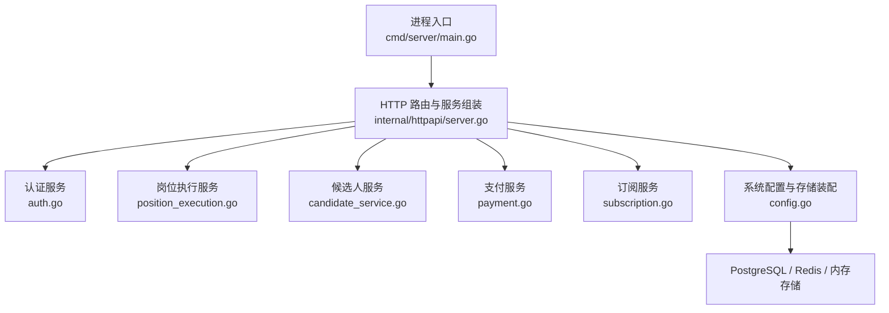
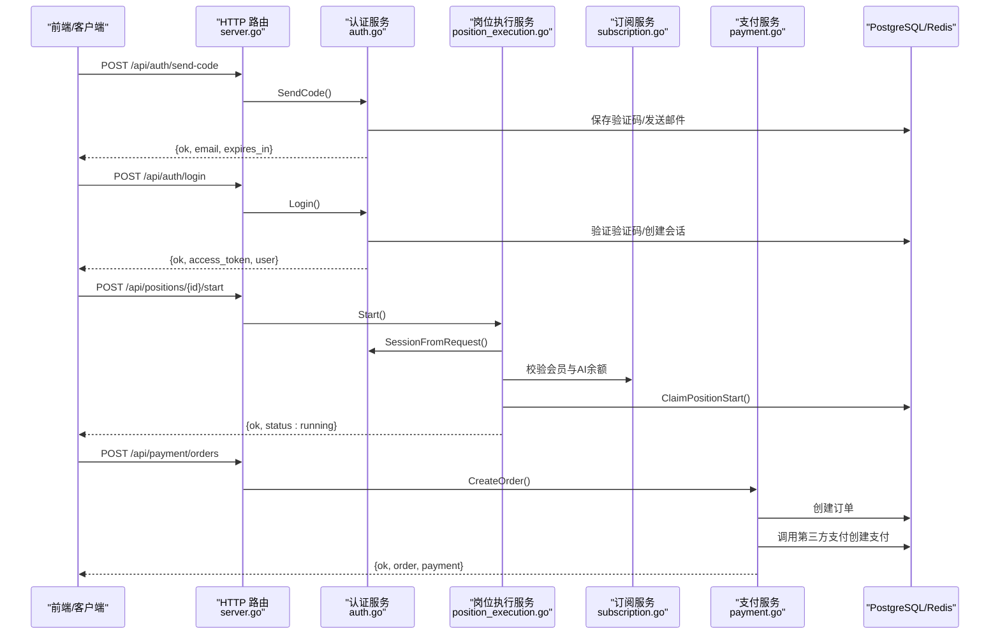
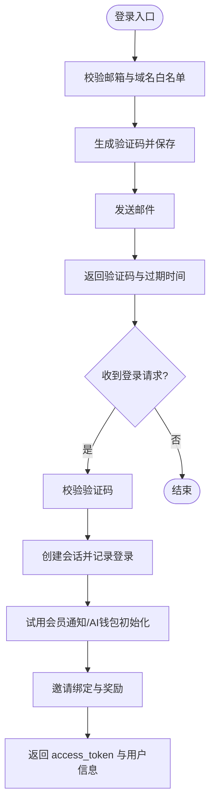
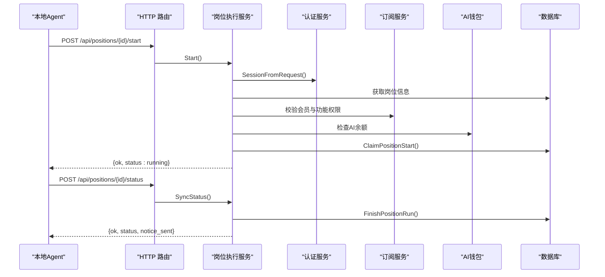
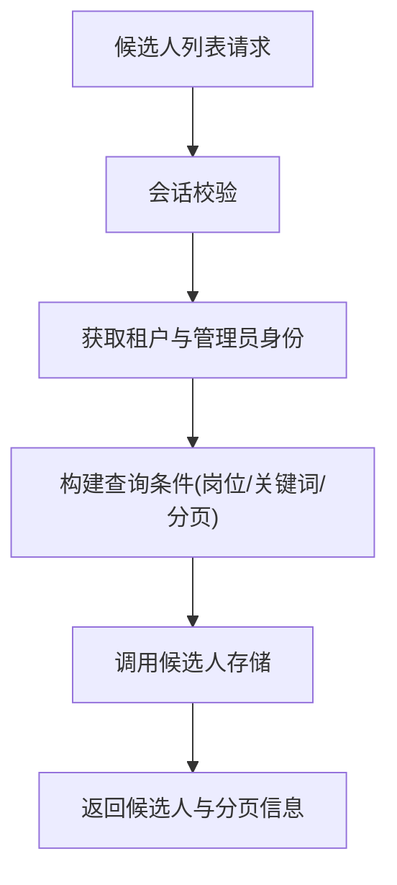
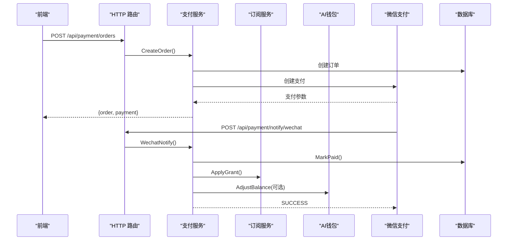
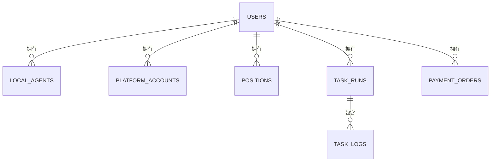
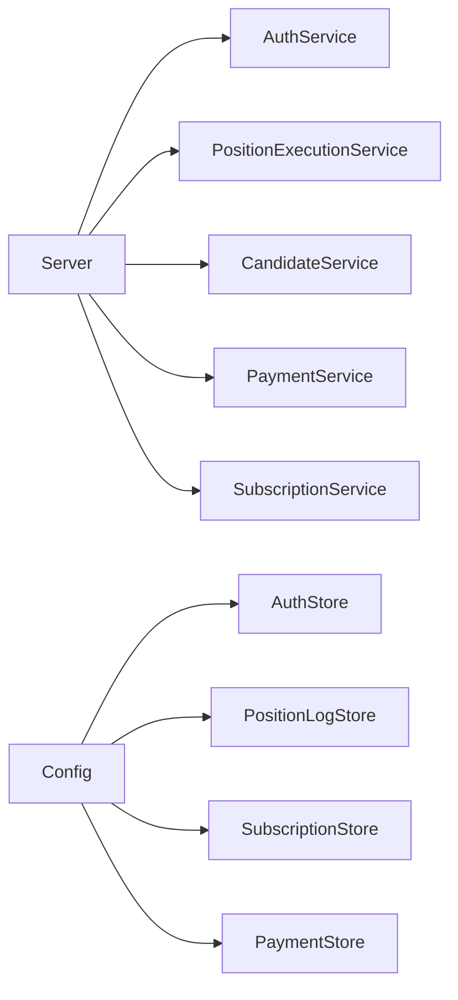

# 云端后端服务

<cite>
**本文引用的文件**
- [main.go](file://goodhr5/cloud/backend/cmd/server/main.go)
- [server.go](file://goodhr5/cloud/backend/internal/httpapi/server.go)
- [auth.go](file://goodhr5/cloud/backend/internal/httpapi/auth.go)
- [position_execution.go](file://goodhr5/cloud/backend/internal/httpapi/position_execution.go)
- [candidate_service.go](file://goodhr5/cloud/backend/internal/httpapi/candidate_service.go)
- [payment.go](file://goodhr5/cloud/backend/internal/httpapi/payment.go)
- [subscription.go](file://goodhr5/cloud/backend/internal/httpapi/subscription.go)
- [config.go](file://goodhr5/cloud/backend/internal/httpapi/config.go)
- [0001_initial_schema.sql](file://goodhr5/cloud/backend/db/migrations/0001_initial_schema.sql)
- [0022_user_subscription.sql](file://goodhr5/cloud/backend/db/migrations/0022_user_subscription.sql)
- [0023_payment_orders.sql](file://goodhr5/cloud/backend/db/migrations/0023_payment_orders.sql)
</cite>

## 目录
1. [简介](#简介)
2. [项目结构](#项目结构)
3. [核心组件](#核心组件)
4. [架构总览](#架构总览)
5. [详细组件分析](#详细组件分析)
6. [依赖关系分析](#依赖关系分析)
7. [性能与缓存](#性能与缓存)
8. [故障排查指南](#故障排查指南)
9. [结论](#结论)
10. [附录：API 规范与错误码](#附录api-规范与错误码)

## 简介
本文件为 HRPlus 云端后端的综合技术文档，面向开发者与运维人员。内容覆盖 Go 后端服务的架构设计、HTTP 路由组织、中间件机制、用户认证、岗位运行管理、候选人处理、支付订阅等核心模块的实现细节；并给出数据库模型设计、缓存策略、错误处理机制、API 接口规范、请求响应格式与错误码定义，以及扩展建议与最佳实践。

## 项目结构
云端后端采用“入口 + 服务层 + 存储抽象”的分层组织：
- 入口进程：负责启动 HTTP 服务、日志输出与环境配置读取。
- 路由与服务组装：集中注册所有 API 路由，注入各业务服务实例。
- 业务服务：按领域划分（认证、岗位执行、候选人、支付、订阅、系统配置等）。
- 存储抽象：通过接口隔离持久化实现（PostgreSQL、Redis、内存），由配置决定具体实现。
- 迁移脚本：使用 SQL 迁移维护数据库结构演进。

**图表来源**
- [main.go:14-29](file://goodhr5/cloud/backend/cmd/server/main.go#L14-L29)
- [server.go:46-121](file://goodhr5/cloud/backend/internal/httpapi/server.go#L46-L121)
- [config.go:30-276](file://goodhr5/cloud/backend/internal/httpapi/config.go#L30-L276)

**章节来源**
- [main.go:14-29](file://goodhr5/cloud/backend/cmd/server/main.go#L14-L29)
- [server.go:124-212](file://goodhr5/cloud/backend/internal/httpapi/server.go#L124-L212)
- [config.go:30-276](file://goodhr5/cloud/backend/internal/httpapi/config.go#L30-L276)

## 核心组件
- 进程入口：读取环境变量、初始化日志、创建服务并监听端口。
- 路由与服务组装：统一注册健康检查、认证、本地 Agent 绑定、AI 配置、订阅、支付、岗位、候选人、租户、Cookie 共享等接口，并提供 CORS 中间件。
- 认证服务：邮箱验证码登录、会话管理、角色判定、邀请绑定、试用欢迎提示。
- 岗位执行服务：接收本地程序的状态同步、启动许可校验、失败通知、状态邮件提醒。
- 候选人服务：团队或岗位维度的候选人列表、详情、备注。
- 支付服务：创建订单、查询订单、微信支付回调、到账处理、邀请奖励。
- 订阅服务：订阅状态查询、套餐列表、幂等权益发放（内存/PostgreSQL 双实现）。
- 配置与存储装配：根据环境变量选择 PostgreSQL/Redis/内存实现，自动执行迁移。

**章节来源**
- [server.go:46-121](file://goodhr5/cloud/backend/internal/httpapi/server.go#L46-L121)
- [auth.go:46-69](file://goodhr5/cloud/backend/internal/httpapi/auth.go#L46-L69)
- [position_execution.go:21-47](file://goodhr5/cloud/backend/internal/httpapi/position_execution.go#L21-L47)
- [candidate_service.go:12-27](file://goodhr5/cloud/backend/internal/httpapi/candidate_service.go#L12-L27)
- [payment.go:34-65](file://goodhr5/cloud/backend/internal/httpapi/payment.go#L34-L65)
- [subscription.go:50-60](file://goodhr5/cloud/backend/internal/httpapi/subscription.go#L50-L60)
- [config.go:30-276](file://goodhr5/cloud/backend/internal/httpapi/config.go#L30-L276)

## 架构总览
云端后端以 HTTP 服务为核心，围绕“认证 -> 业务服务 -> 存储抽象”的链路组织。关键特性：
- 统一响应封装：writeJSON/writeError 提供一致的 JSON 响应格式。
- 中间件：CORS 中间件允许跨域访问，便于前端部署分离。
- 多存储适配：PostgreSQL 用于持久化，Redis 用于缓存与认证会话，内存用于开发测试。
- 权限控制：基于 Bearer Token 的会话校验，支持超管与租户管理员角色。
- 本地程序联动：岗位运行由本地 Agent 驱动，云端仅做状态同步与业务校验。

**图表来源**
- [server.go:124-212](file://goodhr5/cloud/backend/internal/httpapi/server.go#L124-L212)
- [auth.go:71-214](file://goodhr5/cloud/backend/internal/httpapi/auth.go#L71-L214)
- [position_execution.go:49-91](file://goodhr5/cloud/backend/internal/httpapi/position_execution.go#L49-L91)
- [payment.go:67-189](file://goodhr5/cloud/backend/internal/httpapi/payment.go#L67-L189)

## 详细组件分析

### 认证系统
- 验证码发送：校验邮箱域名白名单，生成随机验证码，保存到存储并发送邮件；开发模式可返回 debug_code。
- 登录流程：校验验证码、写入会话、记录登录活动、首次试用会员通知、AI 钱包初始化、邀请绑定与奖励。
- 会话解析：从 Authorization 头提取 Bearer token，校验有效性；支持旧会话兜底用于通知场景。
- 角色与权限：超管判断、租户管理员判断、公开用户信息。

**图表来源**
- [auth.go:71-214](file://goodhr5/cloud/backend/internal/httpapi/auth.go#L71-L214)

**章节来源**
- [auth.go:71-214](file://goodhr5/cloud/backend/internal/httpapi/auth.go#L71-L214)
- [auth.go:452-564](file://goodhr5/cloud/backend/internal/httpapi/auth.go#L452-L564)

### 岗位运行管理
- 启动许可：校验设备绑定、岗位归属、会员权限、AI 余额与冲突，成功后写入 running 并记录用户流程。
- 状态同步：接收本地程序的状态变更（running/completed/stopped），更新岗位状态、统计计数与邮件通知。
- 失败通知：接收失败消息，归因分类（会员过期、AI 配置无效、未登录平台、运行时缺失等），发送状态邮件。
- 停止流程：将岗位状态置为 stopped，记录日志并发送邮件。

**图表来源**
- [position_execution.go:49-213](file://goodhr5/cloud/backend/internal/httpapi/position_execution.go#L49-L213)

**章节来源**
- [position_execution.go:49-213](file://goodhr5/cloud/backend/internal/httpapi/position_execution.go#L49-L213)
- [position_execution.go:215-275](file://goodhr5/cloud/backend/internal/httpapi/position_execution.go#L215-L275)
- [position_execution.go:311-371](file://goodhr5/cloud/backend/internal/httpapi/position_execution.go#L311-L371)

### 候选人处理
- 列表查询：支持按岗位筛选、关键词搜索、分页；非管理员默认限定当前用户数据。
- 详情查看：限制在团队范围内，支持 engagement_id 过滤。
- 备注管理：列出备注与新增备注（长度限制、作者记录）。
- 团队清空：仅团队管理员可清空简历库。

**图表来源**
- [candidate_service.go:29-76](file://goodhr5/cloud/backend/internal/httpapi/candidate_service.go#L29-L76)

**章节来源**
- [candidate_service.go:29-76](file://goodhr5/cloud/backend/internal/httpapi/candidate_service.go#L29-L76)
- [candidate_service.go:110-146](file://goodhr5/cloud/backend/internal/httpapi/candidate_service.go#L110-L146)
- [candidate_service.go:148-216](file://goodhr5/cloud/backend/internal/httpapi/candidate_service.go#L148-L216)

### 支付订阅
- 订单创建：计算实际支付金额（含升级抵扣）、创建订单、调用第三方支付。
- 支付回调：解析第三方回调、校验金额与订单号、标记已支付、应用会员权益或 AI 余额充值。
- 邀请奖励：支付成功后给邀请人发放会员天数并发送邮件。
- 订单查询：用户查看自己的订单，管理员查看所有订单；订单详情支持主动查单补到账。

**图表来源**
- [payment.go:67-189](file://goodhr5/cloud/backend/internal/httpapi/payment.go#L67-L189)
- [payment.go:341-405](file://goodhr5/cloud/backend/internal/httpapi/payment.go#L341-L405)

**章节来源**
- [payment.go:67-189](file://goodhr5/cloud/backend/internal/httpapi/payment.go#L67-L189)
- [payment.go:191-259](file://goodhr5/cloud/backend/internal/httpapi/payment.go#L191-L259)
- [payment.go:261-339](file://goodhr5/cloud/backend/internal/httpapi/payment.go#L261-L339)
- [payment.go:341-405](file://goodhr5/cloud/backend/internal/httpapi/payment.go#L341-L405)
- [payment.go:407-485](file://goodhr5/cloud/backend/internal/httpapi/payment.go#L407-L485)

### 数据库模型设计
- 用户与会话：users 表保存邮箱与登录时间；会话存储在 Redis 或内存。
- 本地 Agent：local_agents 表记录机器码、版本、连接状态。
- 平台账号映射：platform_accounts 仅保存名称与本地 profile 标识，不存 cookie/profile 原文。
- 岗位配置：positions 保存关键词、问候语、匹配模式等。
- 任务运行：task_runs 保存云端任务摘要与统计；task_logs 保存日志摘要。
- 订阅与支付：users.subscription JSONB 保存会员类型与到期时间；payment_orders 记录订单与支付结果。

**图表来源**
- [0001_initial_schema.sql:7-135](file://goodhr5/cloud/backend/db/migrations/0001_initial_schema.sql#L7-L135)
- [0022_user_subscription.sql:1-62](file://goodhr5/cloud/backend/db/migrations/0022_user_subscription.sql#L1-L62)
- [0023_payment_orders.sql:1-48](file://goodhr5/cloud/backend/db/migrations/0023_payment_orders.sql#L1-L48)

**章节来源**
- [0001_initial_schema.sql:7-135](file://goodhr5/cloud/backend/db/migrations/0001_initial_schema.sql#L7-L135)
- [0022_user_subscription.sql:1-62](file://goodhr5/cloud/backend/db/migrations/0022_user_subscription.sql#L1-L62)
- [0023_payment_orders.sql:1-48](file://goodhr5/cloud/backend/db/migrations/0023_payment_orders.sql#L1-L48)

## 依赖关系分析
- 服务耦合：Server 聚合多个业务服务，通过依赖注入组合；各服务依赖存储接口，降低耦合度。
- 存储抽象：Config 根据环境变量选择 PostgreSQL/Redis/内存实现，保证开发与生产一致性。
- 外部依赖：邮件服务（SMTP/开发模式）、第三方支付（微信支付）、本地 Agent（WebSocket/HTTP 状态同步）。
- 潜在循环依赖：通过接口与构造顺序避免循环；例如 AIWalletService 与 AuthService 的相互引用在服务组装时完成。

**图表来源**
- [server.go:46-121](file://goodhr5/cloud/backend/internal/httpapi/server.go#L46-L121)
- [config.go:77-276](file://goodhr5/cloud/backend/internal/httpapi/config.go#L77-L276)

**章节来源**
- [server.go:46-121](file://goodhr5/cloud/backend/internal/httpapi/server.go#L46-L121)
- [config.go:77-276](file://goodhr5/cloud/backend/internal/httpapi/config.go#L77-L276)

## 性能与缓存
- 数据库连接池：PostgreSQL 连接设置最大连接数、空闲连接数与生命周期，避免资源耗尽。
- 缓存层：位置日志支持 Redis 缓存层，提升高频读取性能；认证会话可使用 Redis 存储。
- 并发安全：订阅权益发放使用事务与幂等键，防止重复发放。
- 异步与重试：邮件发送失败记录日志但不阻塞主流程；支付回调失败进行重试与主动查单。

**章节来源**
- [config.go:47-75](file://goodhr5/cloud/backend/internal/httpapi/config.go#L47-L75)
- [config.go:256-268](file://goodhr5/cloud/backend/internal/httpapi/config.go#L256-L268)
- [subscription.go:401-459](file://goodhr5/cloud/backend/internal/httpapi/subscription.go#L401-L459)
- [payment.go:324-339](file://goodhr5/cloud/backend/internal/httpapi/payment.go#L324-L339)

## 故障排查指南
- 认证失败：检查 Authorization 头是否携带 Bearer token；确认 token 未过期；开发环境可开启 debug_code 辅助定位。
- 岗位启动失败：检查设备绑定状态、会员权限、AI 余额、岗位是否存在；关注错误码 DEVICE_BINDING_REQUIRED、SUBSCRIPTION_REQUIRED、AI_BALANCE_INSUFFICIENT、POSITION_TASK_CONFLICT。
- 支付回调失败：确认微信支付配置正确；核对订单号、金额与提供商；查看回调日志与主动查单结果。
- 邮件发送失败：检查 SMTP 配置；关注日志中的发送失败信息；不影响主流程但需人工介入。

**章节来源**
- [auth.go:71-214](file://goodhr5/cloud/backend/internal/httpapi/auth.go#L71-L214)
- [position_execution.go:215-275](file://goodhr5/cloud/backend/internal/httpapi/position_execution.go#L215-L275)
- [payment.go:341-405](file://goodhr5/cloud/backend/internal/httpapi/payment.go#L341-L405)

## 结论
HRPlus 云端后端以清晰的职责分层与存储抽象实现了可扩展、易维护的招聘自动化平台。通过统一的认证、岗位执行、候选人管理与支付订阅体系，结合灵活的配置与缓存策略，能够支撑多租户、多平台的复杂业务场景。建议在扩展新功能时遵循现有接口抽象与错误处理约定，确保一致性与可观测性。

## 附录：API 规范与错误码

### 通用响应格式
- 成功响应：
  - 字段：ok 布尔值，业务数据随接口不同而不同。
  - 示例路径：[server.go:261-269](file://goodhr5/cloud/backend/internal/httpapi/server.go#L261-L269)
- 错误响应：
  - 字段：ok=false，error=字符串消息。
  - 示例路径：[server.go:271-277](file://goodhr5/cloud/backend/internal/httpapi/server.go#L271-L277)

### 认证相关
- 发送验证码：POST /api/auth/send-code
  - 请求体：email
  - 响应：ok, email, expires_in, debug_code（开发模式）
  - 参考：[auth.go:71-119](file://goodhr5/cloud/backend/internal/httpapi/auth.go#L71-L119)
- 登录：POST /api/auth/login
  - 请求体：email, code, inviter_id, agreement_accepted
  - 响应：ok, access_token, token_type, expires_in, user
  - 参考：[auth.go:121-214](file://goodhr5/cloud/backend/internal/httpapi/auth.go#L121-L214)
- 当前用户：GET /api/auth/me
  - 响应：ok, user, session, show_trial_welcome
  - 参考：[auth.go:216-255](file://goodhr5/cloud/backend/internal/httpapi/auth.go#L216-L255)

### 岗位运行
- 启动许可：POST /api/positions/{id}/start
  - 请求体：task_type, machine_id
  - 响应：ok, status
  - 错误码：METHOD_NOT_ALLOWED, INVALID_REQUEST, SESSION_EXPIRED, POSITION_NOT_FOUND, DEVICE_BINDING_REQUIRED, SUBSCRIPTION_CHECK_FAILED, AUTO_REPLY_MAX_REQUIRED, AI_BALANCE_UNAVAILABLE, AI_BALANCE_INSUFFICIENT, POSITION_TASK_CONFLICT, POSITION_START_FAILED
  - 参考：[position_execution.go:49-91](file://goodhr5/cloud/backend/internal/httpapi/position_execution.go#L49-L91), [position_execution.go:234-275](file://goodhr5/cloud/backend/internal/httpapi/position_execution.go#L234-L275)
- 状态同步：POST /api/positions/{id}/status
  - 请求体：status, task_type, run_greeted_count, run_skipped_count, machine_id
  - 响应：ok, status, notice_sent
  - 参考：[position_execution.go:125-213](file://goodhr5/cloud/backend/internal/httpapi/position_execution.go#L125-L213)
- 失败通知：POST /api/fail-notice
  - 请求体：position_id, error_message, run_greeted_count, run_skipped_count
  - 响应：ok, status
  - 参考：[position_execution.go:311-371](file://goodhr5/cloud/backend/internal/httpapi/position_execution.go#L311-L371)

### 候选人
- 列表：GET /api/candidates
  - 查询参数：position_id, keyword/q, page, page_size
  - 响应：ok, candidates, total, page, page_size
  - 参考：[candidate_service.go:29-76](file://goodhr5/cloud/backend/internal/httpapi/candidate_service.go#L29-L76)
- 详情：GET /api/candidates/{id}
  - 查询参数：engagement_id
  - 响应：ok, candidate
  - 参考：[candidate_service.go:110-146](file://goodhr5/cloud/backend/internal/httpapi/candidate_service.go#L110-L146)
- 备注：GET/POST /api/candidates/{id}/notes
  - 请求体（POST）：content
  - 响应：ok, notes/note
  - 参考：[candidate_service.go:148-216](file://goodhr5/cloud/backend/internal/httpapi/candidate_service.go#L148-L216)

### 支付订阅
- 创建订单：POST /api/payment/orders
  - 请求体：plan_id
  - 响应：ok, order, payment
  - 参考：[payment.go:67-189](file://goodhr5/cloud/backend/internal/httpapi/payment.go#L67-L189)
- AI 余额充值：POST /api/payment/ai-balance
  - 请求体：amount_cents 或 amount_yuan
  - 响应：ok, order, payment
  - 参考：[payment.go:191-259](file://goodhr5/cloud/backend/internal/httpapi/payment.go#L191-L259)
- 订单详情：GET /api/payment/orders/{order_no}
  - 响应：ok, order
  - 参考：[payment.go:295-339](file://goodhr5/cloud/backend/internal/httpapi/payment.go#L295-L339)
- 微信支付回调：POST /api/payment/notify/wechat
  - 响应：SUCCESS/FAIL（微信要求格式）
  - 参考：[payment.go:341-362](file://goodhr5/cloud/backend/internal/httpapi/payment.go#L341-L362)

### 订阅状态与套餐
- 订阅状态：GET /api/subscription/status
  - 响应：ok, subscription
  - 参考：[subscription.go:62-93](file://goodhr5/cloud/backend/internal/httpapi/subscription.go#L62-L93)
- 套餐列表：GET /api/subscription/plans
  - 响应：ok, plans
  - 参考：[subscription.go:95-119](file://goodhr5/cloud/backend/internal/httpapi/subscription.go#L95-L119)

### 错误码汇总（岗位启动）
- METHOD_NOT_ALLOWED：方法不支持
- INVALID_REQUEST：请求参数解析失败
- SESSION_EXPIRED：会话失效
- POSITION_NOT_FOUND：岗位不存在
- DEVICE_BINDING_REQUIRED：设备未绑定
- SUBSCRIPTION_CHECK_FAILED：会员状态读取失败
- AUTO_REPLY_MAX_REQUIRED：自动回复需要 Max 全能版
- AI_BALANCE_UNAVAILABLE：AI 余额不可用
- AI_BALANCE_INSUFFICIENT：AI 余额不足
- POSITION_TASK_CONFLICT：已有岗位在运行
- POSITION_START_FAILED：云端记录失败

**章节来源**
- [position_execution.go:49-91](file://goodhr5/cloud/backend/internal/httpapi/position_execution.go#L49-L91)
- [position_execution.go:234-275](file://goodhr5/cloud/backend/internal/httpapi/position_execution.go#L234-L275)
- [server.go:261-277](file://goodhr5/cloud/backend/internal/httpapi/server.go#L261-L277)