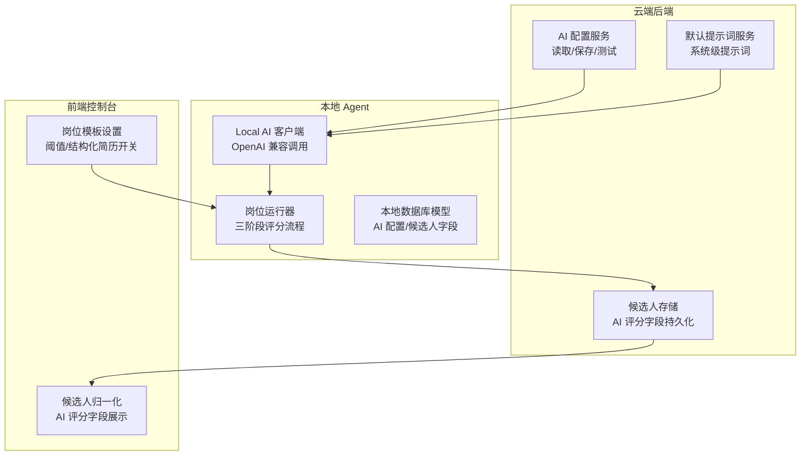
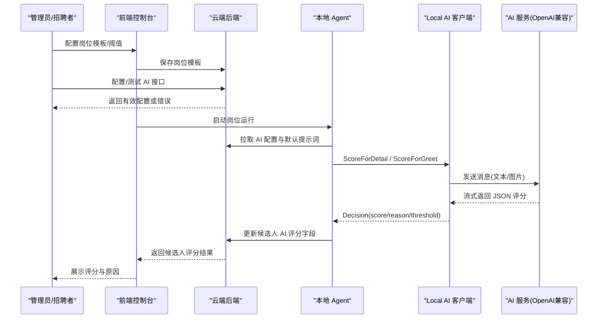
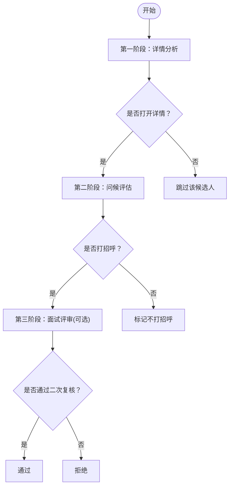
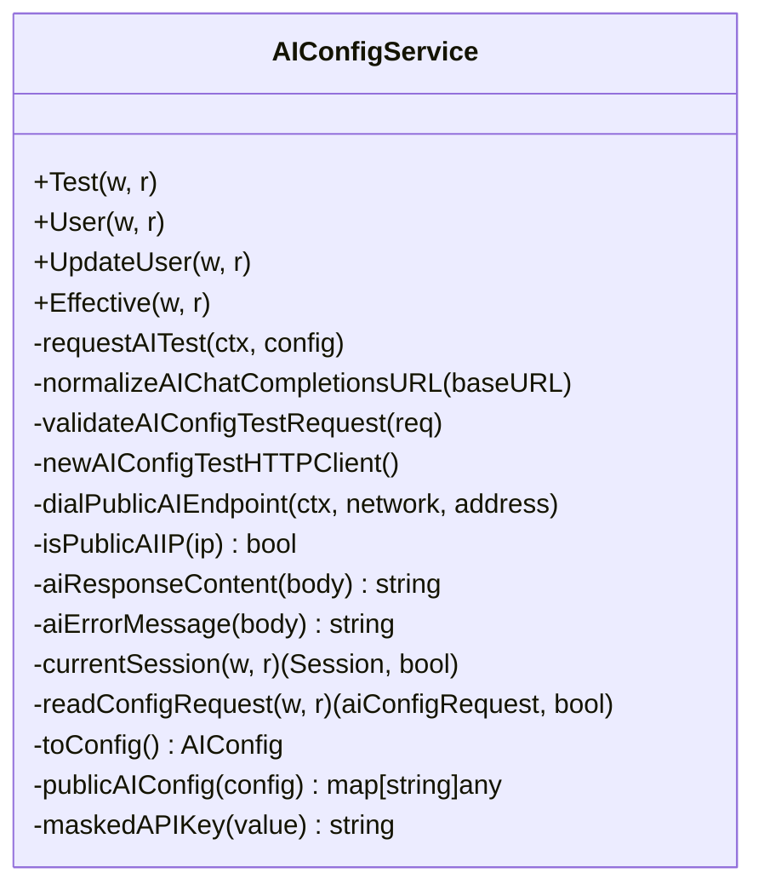
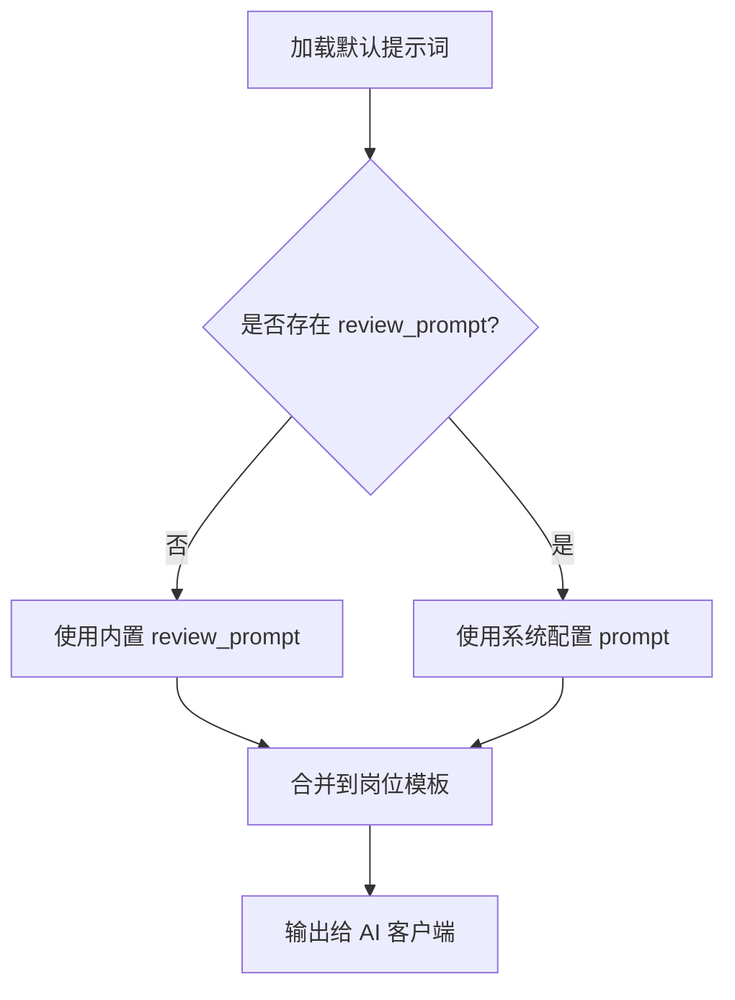
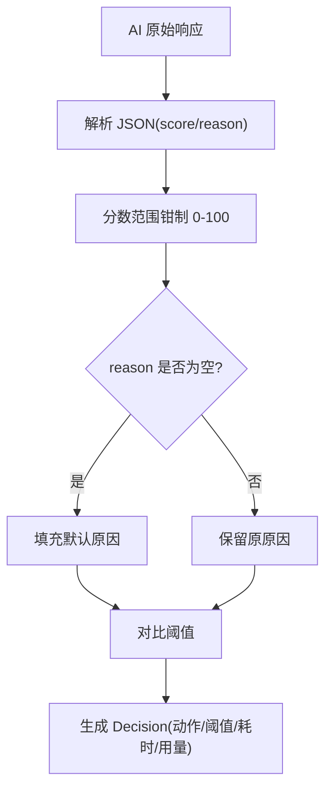
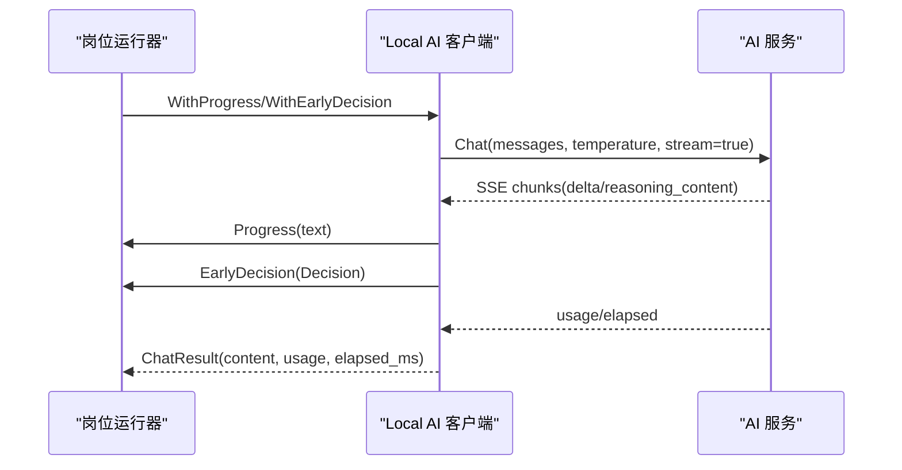
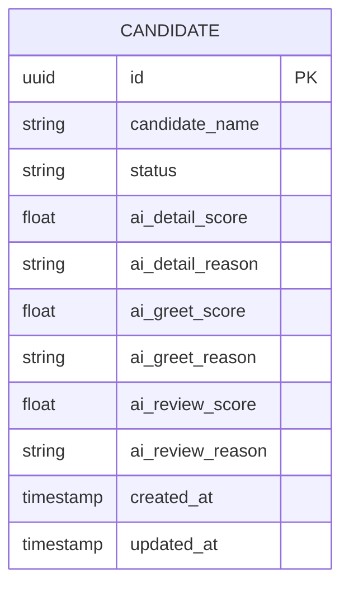
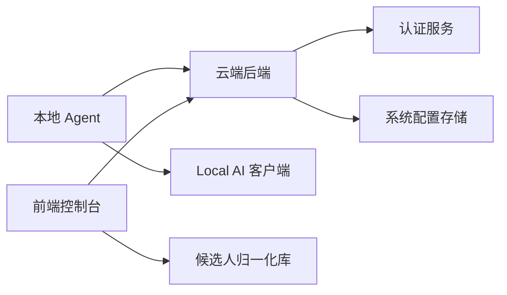

# AI匹配评分

<cite>
**本文引用的文件**   
- [ai_config.go](file://goodhr5/cloud/backend/internal/httpapi/ai_config.go)
- [default_prompts.go](file://goodhr5/cloud/backend/internal/httpapi/default_prompts.go)
- [client.go](file://goodhr5/local-agent-go/internal/localai/client.go)
- [decision.go](file://goodhr5/local-agent-go/internal/positionrunner/decision.go)
- [ai_types.go](file://goodhr5/local-agent-go/internal/localdb/ai_types.go)
- [positions.go](file://goodhr5/local-agent-go/internal/localdb/positions.go)
- [candidate_store.go](file://goodhr5/cloud/backend/internal/httpapi/candidate_store.go)
- [local_candidate_ingest.go](file://goodhr5/cloud/backend/internal/httpapi/local_candidate_ingest.go)
- [page.tsx](file://goodhr5/cloud/frontend-next/app/admin/positions/page.tsx)
- [candidate-normalize.ts](file://goodhr5/cloud/frontend-next/lib/candidate-normalize.ts)
</cite>

## 目录
1. [引言](#引言)
2. [项目结构](#项目结构)
3. [核心组件](#核心组件)
4. [架构总览](#架构总览)
5. [详细组件分析](#详细组件分析)
6. [依赖关系分析](#依赖关系分析)
7. [性能与可靠性](#性能与可靠性)
8. [故障排查指南](#故障排查指南)
9. [结论](#结论)
10. [附录：配置与调用示例](#附录配置与调用示例)

## 引言
本文件面向开发者，系统性说明 GoodHR 的“AI 匹配评分”能力。系统采用三阶段评分机制：
- 第一阶段：详情分析（是否值得打开候选人详情页）
- 第二阶段：问候评估（是否适合打招呼）
- 第三阶段：面试评审（边界候选人的二次复核）

同时涵盖 AI 配置管理、提示词模板、评分算法、AI 服务集成、结果解析、置信度与阈值判定、以及前端展示与本地 Agent 工作流。目标是帮助开发者理解并优化候选人的智能匹配和评估能力。

## 项目结构
GoodHR 的 AI 匹配评分涉及云端后端、本地 Agent、前端控制台三部分：
- 云端后端负责用户 AI 配置管理、默认提示词下发、候选人数据持久化与对外 API。
- 本地 Agent 负责岗位运行、候选人扫描、调用云端下发的 AI 配置进行评分，并在浏览器中展示思考过程与结果。
- 前端控制台提供岗位模板设置、阈值配置、结构化简历开关等交互界面。

**图表来源**
- [ai_config.go:22-45](file://goodhr5/cloud/backend/internal/httpapi/ai_config.go#L22-L45)
- [default_prompts.go:29-56](file://goodhr5/cloud/backend/internal/httpapi/default_prompts.go#L29-L56)
- [client.go:33-55](file://goodhr5/local-agent-go/internal/localai/client.go#L33-L55)
- [decision.go:16-62](file://goodhr5/local-agent-go/internal/positionrunner/decision.go#L16-L62)
- [ai_types.go:4-17](file://goodhr5/local-agent-go/internal/localdb/ai_types.go#L4-L17)
- [page.tsx:1533-1692](file://goodhr5/cloud/frontend-next/app/admin/positions/page.tsx#L1533-L1692)
- [candidate-normalize.ts:76-91](file://goodhr5/cloud/frontend-next/lib/candidate-normalize.ts#L76-L91)

**章节来源**
- [ai_config.go:22-45](file://goodhr5/cloud/backend/internal/httpapi/ai_config.go#L22-L45)
- [default_prompts.go:29-56](file://goodhr5/cloud/backend/internal/httpapi/default_prompts.go#L29-L56)
- [client.go:33-55](file://goodhr5/local-agent-go/internal/localai/client.go#L33-L55)
- [decision.go:16-62](file://goodhr5/local-agent-go/internal/positionrunner/decision.go#L16-L62)
- [ai_types.go:4-17](file://goodhr5/local-agent-go/internal/localdb/ai_types.go#L4-L17)
- [page.tsx:1533-1692](file://goodhr5/cloud/frontend-next/app/admin/positions/page.tsx#L1533-L1692)
- [candidate-normalize.ts:76-91](file://goodhr5/cloud/frontend-next/lib/candidate-normalize.ts#L76-L91)

## 核心组件
- AI 配置服务：提供用户自定义 OpenAI 兼容配置的读取、保存、测试接口，包含安全校验、公网访问限制、超时控制。
- 默认提示词服务：从系统配置表加载默认提示词，兜底“查看详情”“打招呼”“面试评审”三类提示词。
- Local AI 客户端：封装 OpenAI 兼容聊天接口，支持流式响应、提前评分提取、视觉输入（图片）、重试与错误分类。
- 岗位运行器：编排三阶段评分流程，结合关键词过滤、OCR、截图识别、浏览器浮层展示思考过程。
- 本地数据库模型：定义 AI 配置结构与候选人评分字段。
- 云端候选人存储：持久化 AI 评分结果，供前端展示与分析。
- 前端岗位模板设置：暴露阈值、结构化简历输出开关等配置项。
- 前端候选人归一化：将后端返回的候选人数据整理为统一结构，便于 UI 展示。

**章节来源**
- [ai_config.go:22-45](file://goodhr5/cloud/backend/internal/httpapi/ai_config.go#L22-L45)
- [default_prompts.go:29-56](file://goodhr5/cloud/backend/internal/httpapi/default_prompts.go#L29-L56)
- [client.go:33-55](file://goodhr5/local-agent-go/internal/localai/client.go#L33-L55)
- [decision.go:16-62](file://goodhr5/local-agent-go/internal/positionrunner/decision.go#L16-L62)
- [ai_types.go:4-17](file://goodhr5/local-agent-go/internal/localdb/ai_types.go#L4-L17)
- [candidate_store.go:219-252](file://goodhr5/cloud/backend/internal/httpapi/candidate_store.go#L219-L252)
- [page.tsx:1533-1692](file://goodhr5/cloud/frontend-next/app/admin/positions/page.tsx#L1533-L1692)
- [candidate-normalize.ts:76-91](file://goodhr5/cloud/frontend-next/lib/candidate-normalize.ts#L76-L91)

## 架构总览
三阶段评分在本地 Agent 中由岗位运行器驱动，使用云端下发的 AI 配置调用 OpenAI 兼容接口；评分结果写入候选人记录，前端通过 API 获取并展示。

**图表来源**
- [ai_config.go:47-82](file://goodhr5/cloud/backend/internal/httpapi/ai_config.go#L47-L82)
- [default_prompts.go:58-76](file://goodhr5/cloud/backend/internal/httpapi/default_prompts.go#L58-L76)
- [client.go:164-217](file://goodhr5/local-agent-go/internal/localai/client.go#L164-L217)
- [decision.go:267-302](file://goodhr5/local-agent-go/internal/positionrunner/decision.go#L267-L302)
- [candidate_store.go:219-252](file://goodhr5/cloud/backend/internal/httpapi/candidate_store.go#L219-L252)

## 详细组件分析

### 三阶段评分机制
- 第一阶段：详情分析
  - 目标：判断是否值得打开候选人详情页。
  - 实现：Local AI 客户端 ScoreForDetail 根据岗位快照与候选人基础信息生成消息，调用 AI 服务返回 score 与 reason，并与阈值比较决定 ShouldOpenDetail。
  - 关键逻辑：阈值优先从岗位快照 ai_config.detail_score_threshold/open_detail_threshold/detail_threshold 读取，否则使用默认值。
- 第二阶段：问候评估
  - 目标：判断是否适合打招呼。
  - 实现：Local AI 客户端 ScoreForGreet 构建打招呼评分消息，返回 score 与 reason，并与阈值比较决定 ShouldGreet。
  - 增强：支持视觉输入（ScoreVisionForGreet），一次性识别详情长图并打分，同时可输出结构化简历字段。
- 第三阶段：面试评审
  - 目标：对边界候选人做二次复核。
  - 实现：默认提示词中包含 review_prompt，用于“接近阈值的候选人”再次打分；岗位运行器在最终打招呼判断前可选择走关键词模式或 AI 模式。

**图表来源**
- [client.go:164-217](file://goodhr5/local-agent-go/internal/localai/client.go#L164-L217)
- [client.go:219-256](file://goodhr5/local-agent-go/internal/localai/client.go#L219-L256)
- [default_prompts.go:12-27](file://goodhr5/cloud/backend/internal/httpapi/default_prompts.go#L12-L27)
- [decision.go:285-302](file://goodhr5/local-agent-go/internal/positionrunner/decision.go#L285-L302)

**章节来源**
- [client.go:164-217](file://goodhr5/local-agent-go/internal/localai/client.go#L164-L217)
- [client.go:219-256](file://goodhr5/local-agent-go/internal/localai/client.go#L219-L256)
- [default_prompts.go:12-27](file://goodhr5/cloud/backend/internal/httpapi/default_prompts.go#L12-L27)
- [decision.go:285-302](file://goodhr5/local-agent-go/internal/positionrunner/decision.go#L285-L302)

### AI 配置管理
- 用户配置读写：提供 GET/PUT 接口，按当前登录用户隔离配置；保存时若未传 API Key，则复用已有密钥。
- 配置测试：POST 接口向用户填写的 BaseURL 发送最小请求，验证连通性与模型名称有效性；强制 HTTPS 公网地址，禁止内网与 localhost。
- 有效配置：Effective 接口返回当前用户生效的配置，本地程序可通过 reveal_api_key=1 获取明文 Key。
- 安全策略：HTTP Client 仅连接公网 IP，限制重定向次数，日志脱敏 URL。

**图表来源**
- [ai_config.go:22-45](file://goodhr5/cloud/backend/internal/httpapi/ai_config.go#L22-L45)
- [ai_config.go:47-82](file://goodhr5/cloud/backend/internal/httpapi/ai_config.go#L47-L82)
- [ai_config.go:126-139](file://goodhr5/cloud/backend/internal/httpapi/ai_config.go#L126-L139)
- [ai_config.go:150-169](file://goodhr5/cloud/backend/internal/httpapi/ai_config.go#L150-L169)
- [ai_config.go:171-224](file://goodhr5/cloud/backend/internal/httpapi/ai_config.go#L171-L224)
- [ai_config.go:226-263](file://goodhr5/cloud/backend/internal/httpapi/ai_config.go#L226-L263)
- [ai_config.go:265-340](file://goodhr5/cloud/backend/internal/httpapi/ai_config.go#L265-L340)
- [ai_config.go:342-397](file://goodhr5/cloud/backend/internal/httpapi/ai_config.go#L342-L397)
- [ai_config.go:399-461](file://goodhr5/cloud/backend/internal/httpapi/ai_config.go#L399-L461)

**章节来源**
- [ai_config.go:47-82](file://goodhr5/cloud/backend/internal/httpapi/ai_config.go#L47-L82)
- [ai_config.go:126-139](file://goodhr5/cloud/backend/internal/httpapi/ai_config.go#L126-L139)
- [ai_config.go:150-169](file://goodhr5/cloud/backend/internal/httpapi/ai_config.go#L150-L169)
- [ai_config.go:171-224](file://goodhr5/cloud/backend/internal/httpapi/ai_config.go#L171-L224)
- [ai_config.go:226-263](file://goodhr5/cloud/backend/internal/httpapi/ai_config.go#L226-L263)
- [ai_config.go:265-340](file://goodhr5/cloud/backend/internal/httpapi/ai_config.go#L265-L340)
- [ai_config.go:342-397](file://goodhr5/cloud/backend/internal/httpapi/ai_config.go#L342-L397)
- [ai_config.go:399-461](file://goodhr5/cloud/backend/internal/httpapi/ai_config.go#L399-L461)

### 提示词模板与默认提示词
- 默认提示词来源：系统配置表 key 为 ai.default_prompts，包含 filter_prompt、open_detail_prompt、review_prompt。
- 兜底规则：若系统未配置 review_prompt，则使用内置的“资深 HR 专家”二次复核提示词。
- 岗位模板覆盖：岗位快照中的 ai_config 可覆盖默认提示词，例如 greet_prompt/filter_prompt/click_prompt/open_detail_prompt。

**图表来源**
- [default_prompts.go:11-27](file://goodhr5/cloud/backend/internal/httpapi/default_prompts.go#L11-L27)
- [default_prompts.go:36-56](file://goodhr5/cloud/backend/internal/httpapi/default_prompts.go#L36-L56)
- [default_prompts.go:58-76](file://goodhr5/cloud/backend/internal/httpapi/default_prompts.go#L58-L76)

**章节来源**
- [default_prompts.go:11-27](file://goodhr5/cloud/backend/internal/httpapi/default_prompts.go#L11-L27)
- [default_prompts.go:36-56](file://goodhr5/cloud/backend/internal/httpapi/default_prompts.go#L36-L56)
- [default_prompts.go:58-76](file://goodhr5/cloud/backend/internal/httpapi/default_prompts.go#L58-L76)

### 评分算法与结果解析
- 评分输出格式：AI 必须返回 JSON，包含 score 与 reason；支持 Markdown 包裹或 analysis 嵌套结构。
- 解析逻辑：parseScoreJSON 与 parseVisionScoreJSONWithResume 分别处理文本与视觉输入；支持从流式响应中提前提取完整 JSON。
- 置信度与阈值：Decision.Threshold 来自岗位快照 ai_config 的 detail_score_threshold/greet_score_threshold；ShouldOpenDetail/ShouldGreet 由 score >= threshold 判定。
- 结构化简历：当岗位开启 output_structured_resume 时，AI 可输出 candidate_name、work_experiences、educations 等字段，供入库。

**图表来源**
- [client.go:164-217](file://goodhr5/local-agent-go/internal/localai/client.go#L164-L217)
- [client.go:219-256](file://goodhr5/local-agent-go/internal/localai/client.go#L219-L256)
- [client.go:541-627](file://goodhr5/local-agent-go/internal/localai/client.go#L541-L627)
- [client.go:689-703](file://goodhr5/local-agent-go/internal/localai/client.go#L689-L703)

**章节来源**
- [client.go:164-217](file://goodhr5/local-agent-go/internal/localai/client.go#L164-L217)
- [client.go:219-256](file://goodhr5/local-agent-go/internal/localai/client.go#L219-L256)
- [client.go:541-627](file://goodhr5/local-agent-go/internal/localai/client.go#L541-L627)
- [client.go:689-703](file://goodhr5/local-agent-go/internal/localai/client.go#L689-L703)

### AI 服务集成与流式处理
- 通用 Chat 接口：支持非流式与流式 SSE；默认开启 stream=true；支持 enable_thinking 控制思考内容显示。
- 重试与错误分类：对 429/5xx 等临时错误自动重试，解析 Retry-After；区分可重试与致命错误。
- 流式进度与提前决策：Progress 回调推送实时文本；EarlyDecision 回调在流式中提前解析出完整 JSON 后触发。
- 视觉输入：ScoreVisionForGreet 支持 base64 图片与结构化简历输出。

**图表来源**
- [client.go:258-326](file://goodhr5/local-agent-go/internal/localai/client.go#L258-L326)
- [client.go:328-376](file://goodhr5/local-agent-go/internal/localai/client.go#L328-L376)
- [client.go:378-420](file://goodhr5/local-agent-go/internal/localai/client.go#L378-L420)
- [client.go:470-539](file://goodhr5/local-agent-go/internal/localai/client.go#L470-L539)

**章节来源**
- [client.go:258-326](file://goodhr5/local-agent-go/internal/localai/client.go#L258-L326)
- [client.go:328-376](file://goodhr5/local-agent-go/internal/localai/client.go#L328-L376)
- [client.go:378-420](file://goodhr5/local-agent-go/internal/localai/client.go#L378-L420)
- [client.go:470-539](file://goodhr5/local-agent-go/internal/localai/client.go#L470-L539)

### 结果持久化与展示
- 候选人字段：云端存储 ai_detail_reason/score、ai_greet_reason/score、ai_review_reason/score 等字段。
- 本地模型：positions.go 中候选人映射包含上述 AI 评分字段。
- 前端展示：candidate-normalize.ts 将后端数据归一化为标准结构，便于 UI 展示评分与原因。

**图表来源**
- [candidate_store.go:219-252](file://goodhr5/cloud/backend/internal/httpapi/candidate_store.go#L219-L252)
- [positions.go:750-778](file://goodhr5/local-agent-go/internal/localdb/positions.go#L750-L778)
- [candidate-normalize.ts:76-91](file://goodhr5/cloud/frontend-next/lib/candidate-normalize.ts#L76-L91)

**章节来源**
- [candidate_store.go:219-252](file://goodhr5/cloud/backend/internal/httpapi/candidate_store.go#L219-L252)
- [positions.go:750-778](file://goodhr5/local-agent-go/internal/localdb/positions.go#L750-L778)
- [candidate-normalize.ts:76-91](file://goodhr5/cloud/frontend-next/lib/candidate-normalize.ts#L76-L91)

## 依赖关系分析
- 云端后端依赖认证服务与系统配置存储，提供 AI 配置与默认提示词 API。
- 本地 Agent 依赖云端下发的 AI 配置与岗位快照，调用 Local AI 客户端完成评分。
- 前端控制台依赖岗位模板设置与候选人归一化库，展示阈值与结构化简历开关。

**图表来源**
- [ai_config.go:22-45](file://goodhr5/cloud/backend/internal/httpapi/ai_config.go#L22-L45)
- [default_prompts.go:58-76](file://goodhr5/cloud/backend/internal/httpapi/default_prompts.go#L58-L76)
- [client.go:33-55](file://goodhr5/local-agent-go/internal/localai/client.go#L33-L55)
- [candidate-normalize.ts:76-91](file://goodhr5/cloud/frontend-next/lib/candidate-normalize.ts#L76-L91)

**章节来源**
- [ai_config.go:22-45](file://goodhr5/cloud/backend/internal/httpapi/ai_config.go#L22-L45)
- [default_prompts.go:58-76](file://goodhr5/cloud/backend/internal/httpapi/default_prompts.go#L58-L76)
- [client.go:33-55](file://goodhr5/local-agent-go/internal/localai/client.go#L33-L55)
- [candidate-normalize.ts:76-91](file://goodhr5/cloud/frontend-next/lib/candidate-normalize.ts#L76-L91)

## 性能与可靠性
- 超时控制：云端 AI 配置测试统一超时 180 秒；Local AI 客户端默认超时 180 秒，可按配置调整。
- 重试机制：对临时错误最多重试 3 次，遵循 Retry-After 退避。
- 流式优化：支持提前解析 JSON，减少等待时间；Progress 回调实时更新浏览器浮层。
- 结构化简历开关：output_structured_resume 控制是否输出简历字段，平衡消耗与数据价值。

[本节为通用指导，不直接分析具体文件]

## 故障排查指南
- AI 配置测试失败
  - 检查 BaseURL 是否为公网 HTTPS，避免内网与 localhost。
  - 确认 API Key 与 Model 已填写。
  - 查看日志中的状态码与错误摘要。
- 评分解析失败
  - 确保 AI 返回 JSON 包含 score 与 reason。
  - 检查是否被 Markdown 包裹或 nested in analysis。
- 流式中断
  - 检查网络与服务端 SSE 支持。
  - 查看 ServiceError 的 Retryable/Fatal 标志。
- 阈值不生效
  - 确认岗位快照 ai_config 中 detail_score_threshold/greet_score_threshold 已正确设置。
- 结构化简历未输出
  - 检查岗位模板 output_structured_resume 开关。

**章节来源**
- [ai_config.go:150-169](file://goodhr5/cloud/backend/internal/httpapi/ai_config.go#L150-L169)
- [ai_config.go:226-263](file://goodhr5/cloud/backend/internal/httpapi/ai_config.go#L226-L263)
- [client.go:378-420](file://goodhr5/local-agent-go/internal/localai/client.go#L378-L420)
- [client.go:541-627](file://goodhr5/local-agent-go/internal/localai/client.go#L541-L627)

## 结论
GoodHR 的 AI 匹配评分系统通过云端配置管理、默认提示词兜底、Local AI 客户端流式调用与岗位运行器三阶段编排，实现了从“详情分析”到“问候评估”再到“面试评审”的完整闭环。系统在安全性、可靠性与用户体验方面做了充分设计，包括公网访问限制、重试与错误分类、流式进度与提前决策、结构化简历开关等。开发者可基于岗位模板与阈值配置灵活调优，提升候选人智能匹配与评估能力。

[本节为总结性内容，不直接分析具体文件]

## 附录：配置与调用示例

### 评分配置示例
- 岗位模板高级设置
  - 看详情阈值分：detail_score_threshold，首次评分大于等于该值时打开候选人详情。
  - 是否生成简历：output_structured_resume，开启后 AI 会输出结构化简历字段。
- 用户 AI 配置
  - base_url：OpenAI 兼容接口地址（HTTPS 公网）。
  - model：模型名称。
  - api_key：API 密钥。
  - temperature：温度参数。
  - prompt_template：自定义提示词模板。
  - enabled：是否启用。

**章节来源**
- [page.tsx:1533-1692](file://goodhr5/cloud/frontend-next/app/admin/positions/page.tsx#L1533-L1692)
- [ai_config.go:29-36](file://goodhr5/cloud/backend/internal/httpapi/ai_config.go#L29-L36)
- [ai_config.go:436-449](file://goodhr5/cloud/backend/internal/httpapi/ai_config.go#L436-L449)

### AI 调用流程
- 云端测试接口
  - POST /ai-config/test，参数 base_url/model/api_key/temperature/prompt_template/enabled。
  - 返回 ok/message/content。
- 本地评分接口
  - ScoreForDetail(positionSnapshot, candidate)
  - ScoreForGreet(positionSnapshot, candidate)
  - ScoreVisionForGreet(positionSnapshot, candidate, imageBytes)

**章节来源**
- [ai_config.go:47-82](file://goodhr5/cloud/backend/internal/httpapi/ai_config.go#L47-L82)
- [client.go:164-217](file://goodhr5/local-agent-go/internal/localai/client.go#L164-L217)
- [client.go:219-256](file://goodhr5/local-agent-go/internal/localai/client.go#L219-L256)

### 结果展示格式
- 候选人对象包含
  - ai_detail_score/ai_detail_reason
  - ai_greet_score/ai_greet_reason
  - ai_review_score/ai_review_reason
- 前端归一化后用于 UI 展示评分、原因与下一步动作。

**章节来源**
- [candidate_store.go:219-252](file://goodhr5/cloud/backend/internal/httpapi/candidate_store.go#L219-L252)
- [positions.go:750-778](file://goodhr5/local-agent-go/internal/localdb/positions.go#L750-L778)
- [candidate-normalize.ts:76-91](file://goodhr5/cloud/frontend-next/lib/candidate-normalize.ts#L76-L91)