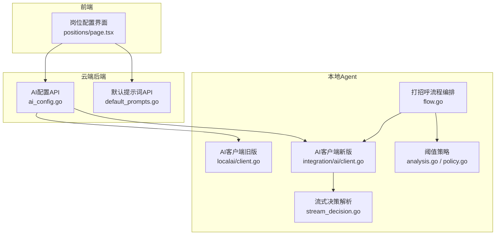
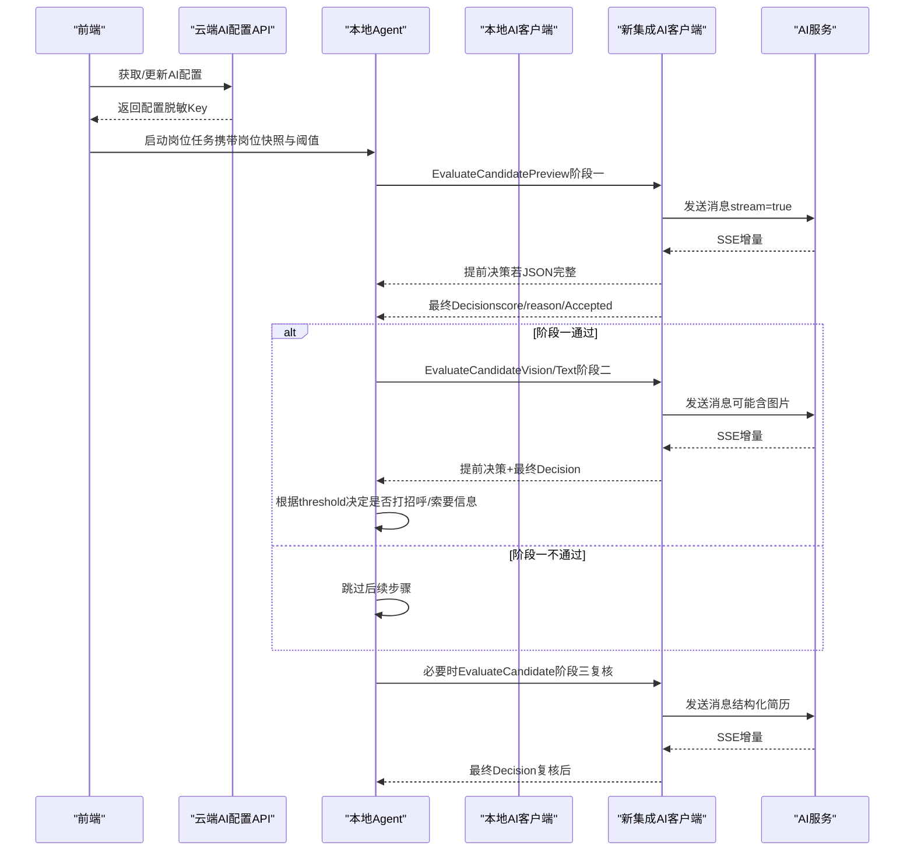
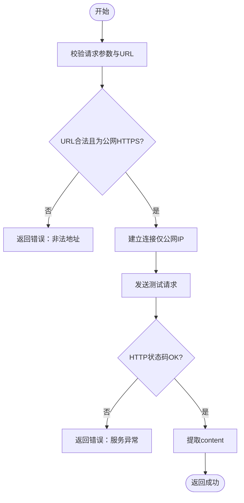
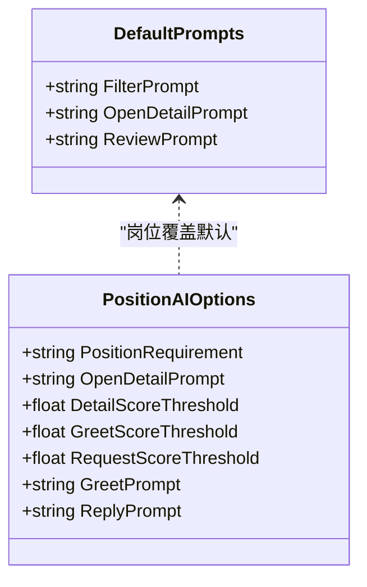
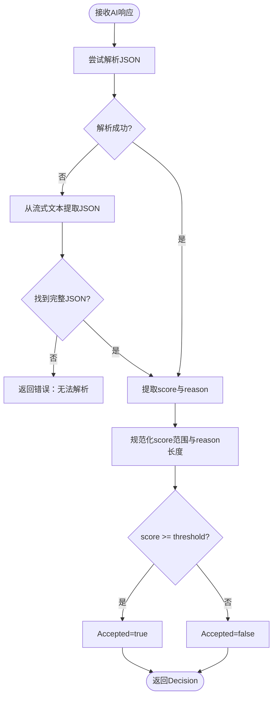
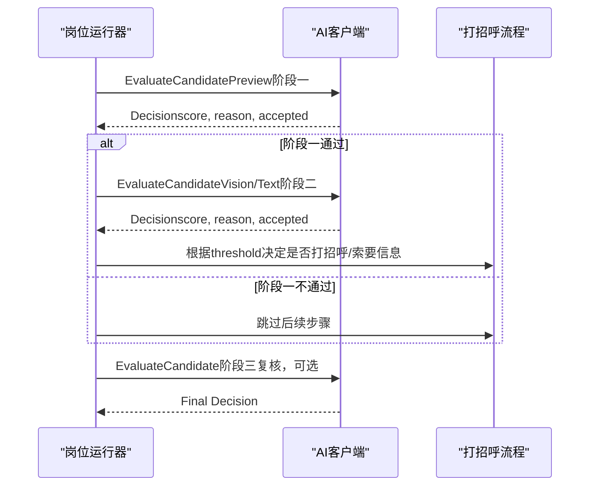
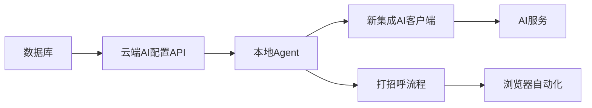

# AI匹配评分

<cite>
**本文引用的文件**
- [ai_config.go](file://goodhr5/cloud/backend/internal/httpapi/ai_config.go)
- [default_prompts.go](file://goodhr5/cloud/backend/internal/httpapi/default_prompts.go)
- [client.go（本地AI客户端）](file://goodhr5/local-agent-go/internal/localai/client.go)
- [stream_decision.go（流式决策解析）](file://goodhr5/local-agent-go-new/internal/integration/ai/stream_decision.go)
- [client.go（新集成AI客户端）](file://goodhr5/local-agent-go-new/internal/integration/ai/client.go)
- [flow.go（打招呼流程）](file://goodhr5/local-agent-go-new/internal/flow/greeting/flow.go)
- [analysis.go（阈值策略）](file://goodhr5/local-agent-go-new/internal/flow/greeting/analysis.go)
- [policy.go（索要信息阈值策略）](file://goodhr5/local-agent-go-new/internal/flow/greeting/policy.go)
- [types.go（岗位AI选项）](file://goodhr5/local-agent-go-new/internal/integration/cloud/types.go)
- [0018_upgrade_default_prompts_to_score_mode.sql](file://goodhr5/cloud/backend/db/migrations/0018_upgrade_default_prompts_to_score_mode.sql)
- [0019_upgrade_position_ai_prompts_to_score_mode.sql](file://goodhr5/cloud/backend/db/migrations/0019_upgrade_position_ai_prompts_to_score_mode.sql)
- [positions/page.tsx（前端配置界面）](file://goodhr5/cloud/frontend-next/app/admin/positions/page.tsx)
</cite>

## 目录
1. [简介](#简介)
2. [项目结构](#项目结构)
3. [核心组件](#核心组件)
4. [架构总览](#架构总览)
5. [详细组件分析](#详细组件分析)
6. [依赖关系分析](#依赖关系分析)
7. [性能与可靠性](#性能与可靠性)
8. [故障排查指南](#故障排查指南)
9. [结论](#结论)
10. [附录：配置示例与调用流程](#附录配置示例与调用流程)

## 简介
本系统提供“三阶段”候选人智能匹配与评估能力：详情分析、问候评估、面试评审。通过可配置的提示词模板、岗位级阈值和统一的AI服务接口，实现从“是否打开详情”到“是否打招呼”，再到“是否需要进一步复核或索要信息”的渐进式决策。系统支持流式响应、提前决策、结构化简历抽取、错误重试与超时控制，并提供前后端一致的配置管理界面。

## 项目结构
- 云端后端负责AI配置管理、默认提示词下发、安全校验与测试调用。
- 本地Agent负责实际调用OpenAI兼容接口，执行三阶段评分、流式解析、提前决策与结果规范化。
- 前端提供岗位模板配置界面，用于设置提示词与阈值。

**图表来源**
- [ai_config.go:1-120](file://goodhr5/cloud/backend/internal/httpapi/ai_config.go#L1-L120)
- [default_prompts.go:1-77](file://goodhr5/cloud/backend/internal/httpapi/default_prompts.go#L1-L77)
- [client.go（本地AI客户端）:164-256](file://goodhr5/local-agent-go/internal/localai/client.go#L164-L256)
- [client.go（新集成AI客户端）:108-193](file://goodhr5/local-agent-go-new/internal/integration/ai/client.go#L108-L193)
- [stream_decision.go:10-24](file://goodhr5/local-agent-go-new/internal/integration/ai/stream_decision.go#L10-L24)
- [flow.go:507-582](file://goodhr5/local-agent-go-new/internal/flow/greeting/flow.go#L507-L582)
- [analysis.go:131-148](file://goodhr5/local-agent-go-new/internal/flow/greeting/analysis.go#L131-L148)
- [policy.go:40-54](file://goodhr5/local-agent-go-new/internal/flow/greeting/policy.go#L40-L54)
- [positions/page.tsx:1469-1545](file://goodhr5/cloud/frontend-next/app/admin/positions/page.tsx#L1469-L1545)

**章节来源**
- [ai_config.go:1-120](file://goodhr5/cloud/backend/internal/httpapi/ai_config.go#L1-L120)
- [default_prompts.go:1-77](file://goodhr5/cloud/backend/internal/httpapi/default_prompts.go#L1-L77)
- [client.go（本地AI客户端）:164-256](file://goodhr5/local-agent-go/internal/localai/client.go#L164-L256)
- [client.go（新集成AI客户端）:108-193](file://goodhr5/local-agent-go-new/internal/integration/ai/client.go#L108-L193)
- [stream_decision.go:10-24](file://goodhr5/local-agent-go-new/internal/integration/ai/stream_decision.go#L10-L24)
- [flow.go:507-582](file://goodhr5/local-agent-go-new/internal/flow/greeting/flow.go#L507-L582)
- [analysis.go:131-148](file://goodhr5/local-agent-go-new/internal/flow/greeting/analysis.go#L131-L148)
- [policy.go:40-54](file://goodhr5/local-agent-go-new/internal/flow/greeting/policy.go#L40-L54)
- [positions/page.tsx:1469-1545](file://goodhr5/cloud/frontend-next/app/admin/positions/page.tsx#L1469-L1545)

## 核心组件
- AI配置管理：云端提供用户自定义AI配置读取、保存与测试调用；支持HTTPS公网校验、重定向限制与内网IP拦截。
- 提示词模板：系统默认提示词存储在数据库，支持岗位级覆盖；包含“查看详情建议分”、“打招呼建议分”、“复核提示词”。
- 评分算法：统一输出JSON格式{score, reason}，范围0-100，reason长度限制；支持提前从流式文本中解析评分并触发早期决策。
- 置信度计算：通过阈值比较得到Accepted布尔值；对边界候选人在复核阶段二次评分；结构化简历抽取增强信息完整性。
- AI服务集成：兼容OpenAI chat/completions接口，支持SSE流式、图片多模态、思考模式开关、重试退避。
- 结果解析：从完整JSON或嵌套结构中递归提取score与reason；兼容Markdown包裹与analysis包装。

**章节来源**
- [ai_config.go:19-124](file://goodhr5/cloud/backend/internal/httpapi/ai_config.go#L19-L124)
- [default_prompts.go:11-56](file://goodhr5/cloud/backend/internal/httpapi/default_prompts.go#L11-L56)
- [client.go（本地AI客户端）:42-55](file://goodhr5/local-agent-go/internal/localai/client.go#L42-L55)
- [client.go（新集成AI客户端）:27-33](file://goodhr5/local-agent-go-new/internal/integration/ai/client.go#L27-L33)
- [stream_decision.go:70-118](file://goodhr5/local-agent-go-new/internal/integration/ai/stream_decision.go#L70-L118)
- [0018_upgrade_default_prompts_to_score_mode.sql:10-26](file://goodhr5/cloud/backend/db/migrations/0018_upgrade_default_prompts_to_score_mode.sql#L10-L26)
- [0019_upgrade_position_ai_prompts_to_score_mode.sql:1-22](file://goodhr5/cloud/backend/db/migrations/0019_upgrade_position_ai_prompts_to_score_mode.sql#L1-L22)

## 架构总览
三阶段评分机制贯穿“详情分析→问候评估→面试评审”：
- 阶段一：详情分析（预览判断）
  - 输入：岗位要求 + 候选人基础信息
  - 目标：决定是否值得打开候选人详情
  - 阈值：detail_score_threshold（默认60）
- 阶段二：问候评估（打招呼判断）
  - 输入：岗位要求 + 候选人基础信息/详情文本或截图
  - 目标：决定是否打招呼及是否索要更多信息
  - 阈值：greet_score_threshold（默认70），request_score_threshold（严格大于）
- 阶段三：面试评审（复核）
  - 输入：岗位要求 + 候选人信息（含结构化简历）
  - 目标：对边界候选人进行二次复核，给出最终打分与建议
  - 阈值：review_prompt对应的复核逻辑（由系统默认或岗位覆盖）

**图表来源**
- [client.go（新集成AI客户端）:108-193](file://goodhr5/local-agent-go-new/internal/integration/ai/client.go#L108-L193)
- [client.go（本地AI客户端）:164-256](file://goodhr5/local-agent-go/internal/localai/client.go#L164-L256)
- [flow.go:507-582](file://goodhr5/local-agent-go-new/internal/flow/greeting/flow.go#L507-L582)
- [analysis.go:131-148](file://goodhr5/local-agent-go-new/internal/flow/greeting/analysis.go#L131-L148)
- [policy.go:40-54](file://goodhr5/local-agent-go-new/internal/flow/greeting/policy.go#L40-L54)

## 详细组件分析

### AI配置管理（云端）
- 功能：提供GET/PUT接口读取与保存用户AI配置；提供POST接口测试AI连接；支持URL规范化、HTTPS强制、内网IP拦截、重定向限制。
- 关键点：
  - 超时：统一180秒
  - 安全：仅允许公网HTTPS地址；禁止localhost与内网IP
  - 脱敏：返回时隐藏完整API Key，仅在特定参数下明文返回
  - 测试：构造最小请求验证模型连通性

**图表来源**
- [ai_config.go:47-124](file://goodhr5/cloud/backend/internal/httpapi/ai_config.go#L47-L124)
- [ai_config.go:150-224](file://goodhr5/cloud/backend/internal/httpapi/ai_config.go#L150-L224)

**章节来源**
- [ai_config.go:19-124](file://goodhr5/cloud/backend/internal/httpapi/ai_config.go#L19-L124)
- [ai_config.go:150-224](file://goodhr5/cloud/backend/internal/httpapi/ai_config.go#L150-L224)
- [ai_config.go:265-373](file://goodhr5/cloud/backend/internal/httpapi/ai_config.go#L265-L373)

### 提示词模板与默认值
- 系统默认提示词存储在system_configs表，键为ai.default_prompts，包含filter_prompt、open_detail_prompt、review_prompt。
- 岗位级可覆盖默认提示词；未设置时使用系统默认。
- 迁移脚本将旧布尔决策提示词升级为评分模式提示词，确保统一输出{score, reason}。

**图表来源**
- [default_prompts.go:29-56](file://goodhr5/cloud/backend/internal/httpapi/default_prompts.go#L29-L56)
- [types.go:81-90](file://goodhr5/local-agent-go-new/internal/integration/cloud/types.go#L81-L90)
- [0018_upgrade_default_prompts_to_score_mode.sql:10-26](file://goodhr5/cloud/backend/db/migrations/0018_upgrade_default_prompts_to_score_mode.sql#L10-L26)
- [0019_upgrade_position_ai_prompts_to_score_mode.sql:1-22](file://goodhr5/cloud/backend/db/migrations/0019_upgrade_position_ai_prompts_to_score_mode.sql#L1-L22)

**章节来源**
- [default_prompts.go:11-56](file://goodhr5/cloud/backend/internal/httpapi/default_prompts.go#L11-L56)
- [0018_upgrade_default_prompts_to_score_mode.sql:10-26](file://goodhr5/cloud/backend/db/migrations/0018_upgrade_default_prompts_to_score_mode.sql#L10-L26)
- [0019_upgrade_position_ai_prompts_to_score_mode.sql:1-22](file://goodhr5/cloud/backend/db/migrations/0019_upgrade_position_ai_prompts_to_score_mode.sql#L1-L22)

### 评分算法与结果解析
- 统一输出格式：{score, reason}，score范围0-100，reason长度限制（约30字符）。
- 解析策略：
  - 支持Markdown包裹的JSON
  - 支持analysis包装的JSON
  - 支持在流式累计文本中提前提取已闭合的JSON对象
  - 递归查找嵌套结构中的score与reason
- 置信度计算：
  - Accepted = score >= threshold
  - 边界候选人在复核阶段二次评分
  - 结构化简历抽取增强信息完整性，提升准确性

**图表来源**
- [client.go（本地AI客户端）:541-627](file://goodhr5/local-agent-go/internal/localai/client.go#L541-L627)
- [stream_decision.go:10-24](file://goodhr5/local-agent-go-new/internal/integration/ai/stream_decision.go#L10-L24)
- [stream_decision.go:70-118](file://goodhr5/local-agent-go-new/internal/integration/ai/stream_decision.go#L70-L118)

**章节来源**
- [client.go（本地AI客户端）:164-256](file://goodhr5/local-agent-go/internal/localai/client.go#L164-L256)
- [client.go（本地AI客户端）:541-627](file://goodhr5/local-agent-go/internal/localai/client.go#L541-L627)
- [stream_decision.go:10-24](file://goodhr5/local-agent-go-new/internal/integration/ai/stream_decision.go#L10-L24)
- [stream_decision.go:70-118](file://goodhr5/local-agent-go-new/internal/integration/ai/stream_decision.go#L70-L118)

### 三阶段评分机制实现
- 阶段一：详情分析（预览判断）
  - 使用EvaluateCandidatePreview，基于基础信息判断是否打开详情
  - 阈值：detail_score_threshold（默认60）
- 阶段二：问候评估（打招呼判断）
  - 使用EvaluateCandidateVision或EvaluateCandidate，结合详情文本或截图
  - 阈值：greet_score_threshold（默认70）
  - 可选：根据request_score_threshold决定是否索要更多信息
- 阶段三：面试评审（复核）
  - 对边界候选人使用review_prompt进行二次复核
  - 输出最终Decision，用于是否打招呼的最终决策

**图表来源**
- [client.go（新集成AI客户端）:108-193](file://goodhr5/local-agent-go-new/internal/integration/ai/client.go#L108-L193)
- [flow.go:507-582](file://goodhr5/local-agent-go-new/internal/flow/greeting/flow.go#L507-L582)
- [analysis.go:131-148](file://goodhr5/local-agent-go-new/internal/flow/greeting/analysis.go#L131-L148)
- [policy.go:40-54](file://goodhr5/local-agent-go-new/internal/flow/greeting/policy.go#L40-L54)

**章节来源**
- [client.go（新集成AI客户端）:108-193](file://goodhr5/local-agent-go-new/internal/integration/ai/client.go#L108-L193)
- [flow.go:507-582](file://goodhr5/local-agent-go-new/internal/flow/greeting/flow.go#L507-L582)
- [analysis.go:131-148](file://goodhr5/local-agent-go-new/internal/flow/greeting/analysis.go#L131-L148)
- [policy.go:40-54](file://goodhr5/local-agent-go-new/internal/flow/greeting/policy.go#L40-L54)

### 前端配置界面
- 提供岗位级提示词与阈值配置：
  - 打开详情提示词与阈值
  - 打招呼提示词与阈值
  - 复核提示词（可选）
  - 是否生成结构化简历
- 字段联动：打招呼阈值与索要信息阈值可同步更新

**章节来源**
- [positions/page.tsx:1469-1545](file://goodhr5/cloud/frontend-next/app/admin/positions/page.tsx#L1469-L1545)

## 依赖关系分析
- 云端后端依赖数据库存储默认提示词与用户配置。
- 本地Agent依赖云端下发的AI配置与岗位快照。
- 新集成AI客户端依赖OpenAI兼容接口，支持SSE流式与图片多模态。
- 打招呼流程依赖阈值策略与AI客户端，协调浏览器操作与AI决策。

**图表来源**
- [ai_config.go:19-124](file://goodhr5/cloud/backend/internal/httpapi/ai_config.go#L19-L124)
- [client.go（新集成AI客户端）:235-303](file://goodhr5/local-agent-go-new/internal/integration/ai/client.go#L235-L303)
- [flow.go:507-582](file://goodhr5/local-agent-go-new/internal/flow/greeting/flow.go#L507-L582)

**章节来源**
- [ai_config.go:19-124](file://goodhr5/cloud/backend/internal/httpapi/ai_config.go#L19-L124)
- [client.go（新集成AI客户端）:235-303](file://goodhr5/local-agent-go-new/internal/integration/ai/client.go#L235-L303)
- [flow.go:507-582](file://goodhr5/local-agent-go-new/internal/flow/greeting/flow.go#L507-L582)

## 性能与可靠性
- 流式响应：支持SSE增量推送，实时显示思考内容与正文，提前解析评分降低延迟。
- 重试机制：临时错误（如限流、服务端错误）最多重试三次，带指数退避与Retry-After支持。
- 超时控制：统一180秒超时，防止长时间阻塞。
- 安全限制：仅允许公网HTTPS地址，防止内网访问与重定向攻击。
- 结构化简历：支持从图片详情中提取结构化简历，提升信息完整性与评分准确性。

**章节来源**
- [client.go（本地AI客户端）:310-403](file://goodhr5/local-agent-go/internal/localai/client.go#L310-L403)
- [client.go（新集成AI客户端）:235-390](file://goodhr5/local-agent-go-new/internal/integration/ai/client.go#L235-L390)
- [ai_config.go:150-224](file://goodhr5/cloud/backend/internal/httpapi/ai_config.go#L150-L224)

## 故障排查指南
- AI配置测试失败：
  - 检查BaseURL是否为公网HTTPS地址
  - 确认API Key与Model已正确填写
  - 查看日志中的状态码与响应摘要
- 评分解析失败：
  - 检查AI返回内容是否包含score与reason
  - 确认JSON格式正确，无多余文本
  - 查看流式解析日志，确认提前决策是否触发
- 服务错误：
  - 401/402/403/404：认证或权限问题，检查API Key与模型可用性
  - 429：限流，等待Retry-After后重试
  - 5xx：服务端错误，自动重试

**章节来源**
- [ai_config.go:47-124](file://goodhr5/cloud/backend/internal/httpapi/ai_config.go#L47-L124)
- [client.go（本地AI客户端）:378-403](file://goodhr5/local-agent-go/internal/localai/client.go#L378-L403)
- [client.go（新集成AI客户端）:354-390](file://goodhr5/local-agent-go-new/internal/integration/ai/client.go#L354-L390)

## 结论
本系统通过三阶段评分机制与可配置提示词模板，实现了从“详情分析”到“问候评估”再到“面试评审”的渐进式候选人评估。系统支持流式响应、提前决策、结构化简历抽取与错误重试，提供了高可靠性的AI匹配与评估能力。开发者可通过前端界面灵活调整提示词与阈值，优化匹配效果与用户体验。

## 附录：配置示例与调用流程

### 评分配置示例
- 岗位级AI选项：
  - position_requirement：岗位要求描述
  - open_detail_prompt：查看详情提示词
  - detail_score_threshold：查看详情阈值（默认60）
  - greet_score_threshold：打招呼阈值（默认70）
  - request_score_threshold：索要信息阈值（严格大于）
  - greet_prompt：打招呼提示词
  - reply_prompt：回复提示词

**章节来源**
- [types.go:81-90](file://goodhr5/local-agent-go-new/internal/integration/cloud/types.go#L81-L90)
- [positions/page.tsx:1469-1545](file://goodhr5/cloud/frontend-next/app/admin/positions/page.tsx#L1469-L1545)

### AI调用流程
- 阶段一：EvaluateCandidatePreview → 判断是否打开详情
- 阶段二：EvaluateCandidateVision/Text → 判断是否打招呼/索要信息
- 阶段三：EvaluateCandidate（复核） → 最终决策

**章节来源**
- [client.go（新集成AI客户端）:108-193](file://goodhr5/local-agent-go-new/internal/integration/ai/client.go#L108-L193)
- [flow.go:507-582](file://goodhr5/local-agent-go-new/internal/flow/greeting/flow.go#L507-L582)

### 结果展示格式
- Decision结构：
  - accepted：是否通过阈值
  - score：分数（0-100）
  - reason：原因（≤30字符）
  - resume：结构化简历（可选）

**章节来源**
- [client.go（新集成AI客户端）:27-33](file://goodhr5/local-agent-go-new/internal/integration/ai/client.go#L27-L33)
- [client.go（本地AI客户端）:42-55](file://goodhr5/local-agent-go/internal/localai/client.go#L42-L55)