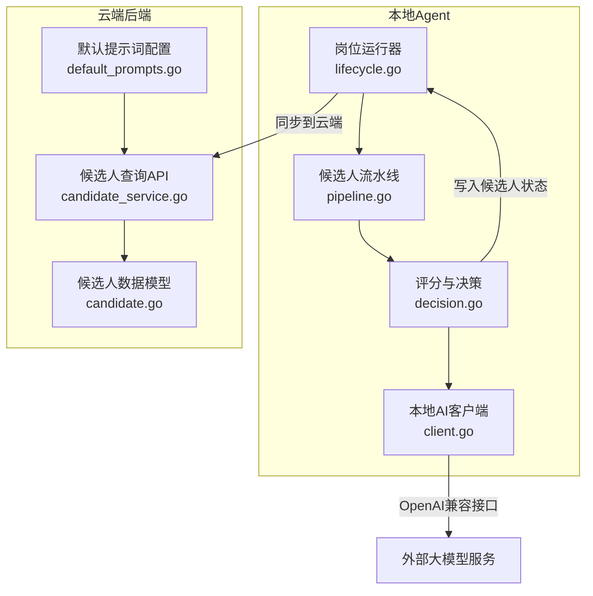
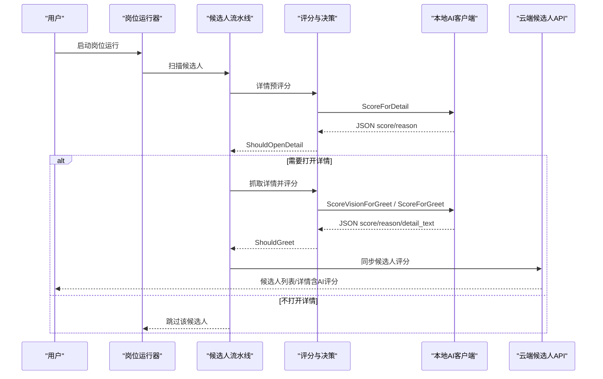
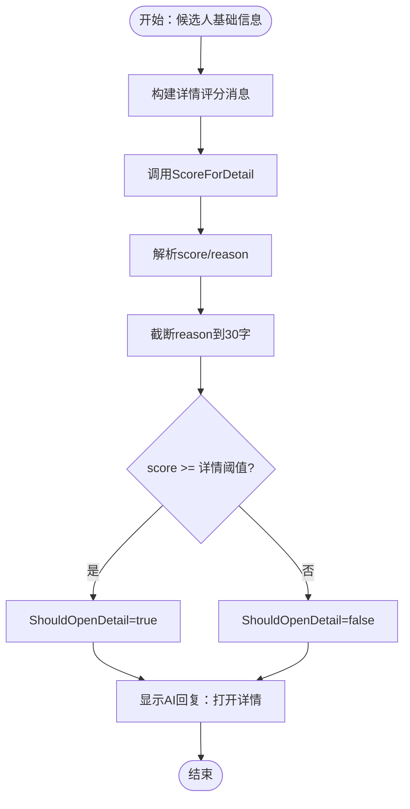
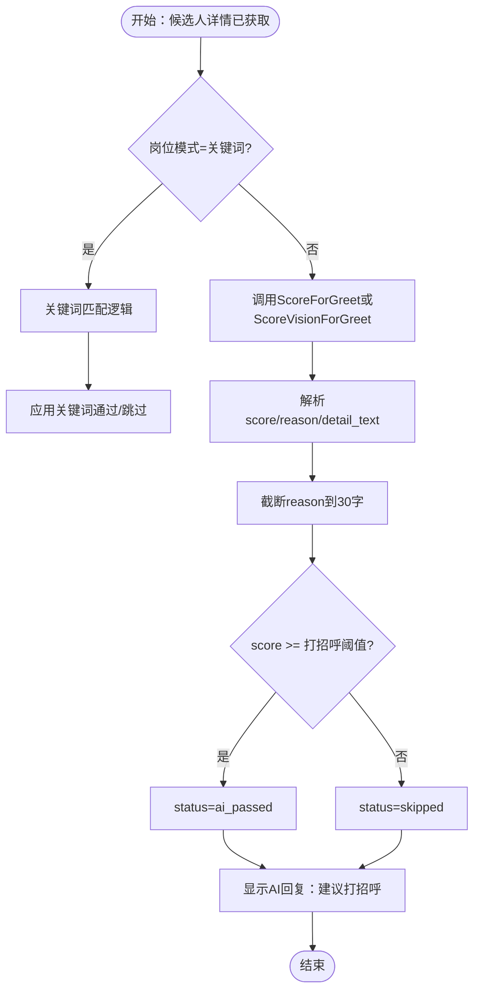
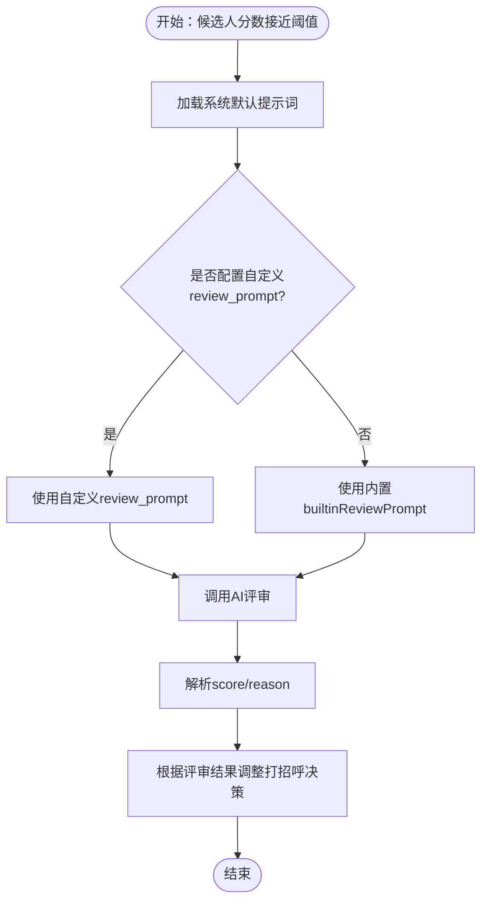
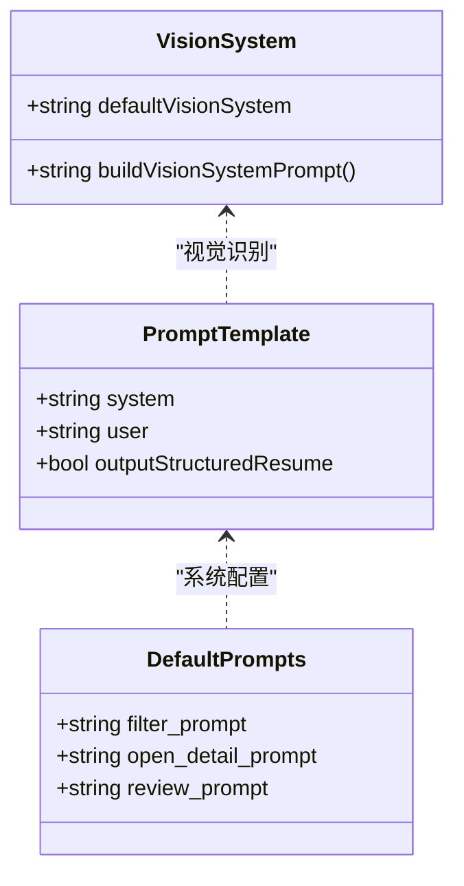
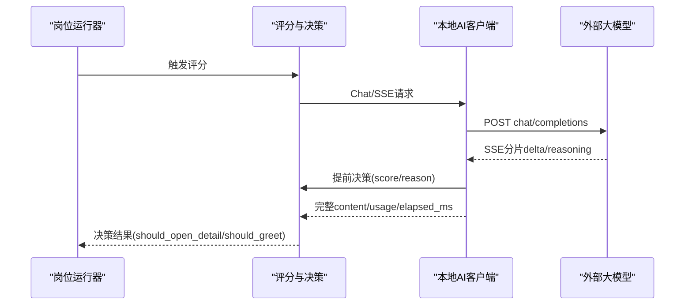
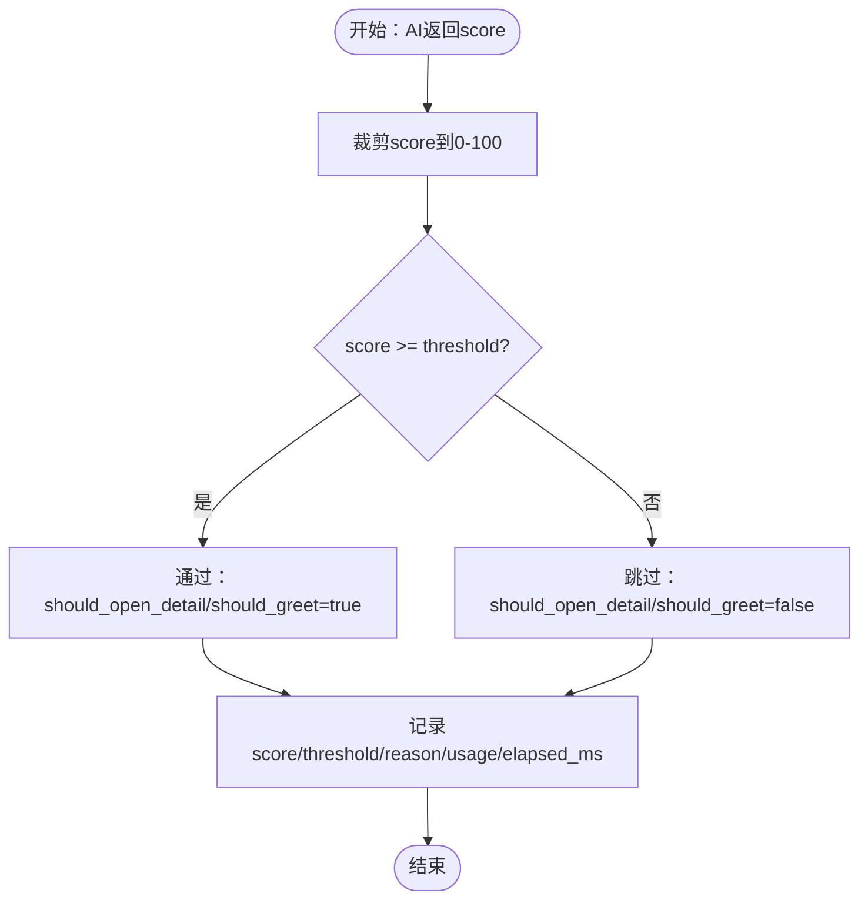
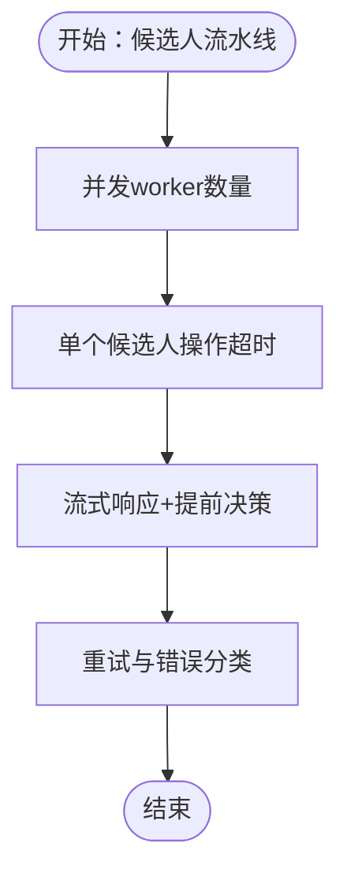

# AI评分算法

<cite>
**本文引用的文件**   
- [decision.go](file://goodhr5/local-agent-go/internal/positionrunner/decision.go)
- [pipeline.go](file://goodhr5/local-agent-go/internal/positionrunner/pipeline.go)
- [lifecycle.go](file://goodhr5/local-agent-go/internal/positionrunner/lifecycle.go)
- [client.go](file://goodhr5/local-agent-go/internal/localai/client.go)
- [candidate.go](file://goodhr5/cloud/backend/internal/httpapi/candidate.go)
- [default_prompts.go](file://goodhr5/cloud/backend/internal/httpapi/default_prompts.go)
- [candidate_service.go](file://goodhr5/cloud/backend/internal/httpapi/candidate_service.go)
</cite>

## 目录
1. [引言](#引言)
2. [项目结构定位](#项目结构定位)
3. [核心组件总览](#核心组件总览)
4. [架构总览](#架构总览)
5. [三阶段评分机制详解](#三阶段评分机制详解)
6. [提示词模板与结构化简历设计](#提示词模板与结构化简历设计)
7. [AI调用流程与结果解析规则](#ai调用流程与结果解析规则)
8. [评分维度、阈值与置信度模型](#评分维度阈值与置信度模型)
9. [权重调整与配置示例](#权重调整与配置示例)
10. [性能与并发调优](#性能与并发调优)
11. [故障排查指南](#故障排查指南)
12. [结论与优化建议](#结论与优化建议)

## 引言
本文面向开发者，系统性说明 GoodHR 本地岗位运行中的 AI 评分算法。重点包括：
- 三阶段评分机制：详情分析、问候评估、面试评审。
- 提示词模板设计、结构化简历输出、评分字段约定。
- AI 调用流程、流式响应处理、提前决策机制。
- 评分阈值、动作判断、日志与可视化展示。
- 云端候选人数据结构、评分回写与查询接口。
- 性能调优、重试策略、错误分类与排障建议。

## 项目结构定位
AI 评分相关代码主要分布在两个子系统：
- 本地 Agent：负责岗位扫描、候选人详情抓取、AI 评分、浏览器浮层展示、关键词过滤、并发流水线。
- 云端后端：负责候选人统一数据模型、默认提示词系统配置、候选人列表与详情 API。

**图表来源**
- [lifecycle.go:17-123](file://goodhr5/local-agent-go/internal/positionrunner/lifecycle.go#L17-L123)
- [pipeline.go:49-131](file://goodhr5/local-agent-go/internal/positionrunner/pipeline.go#L49-L131)
- [decision.go:16-62](file://goodhr5/local-agent-go/internal/positionrunner/decision.go#L16-L62)
- [client.go:33-55](file://goodhr5/local-agent-go/internal/localai/client.go#L33-L55)
- [candidate.go:87-143](file://goodhr5/cloud/backend/internal/httpapi/candidate.go#L87-L143)
- [default_prompts.go:11-34](file://goodhr5/cloud/backend/internal/httpapi/default_prompts.go#L11-L34)
- [candidate_service.go:13-28](file://goodhr5/cloud/backend/internal/httpapi/candidate_service.go#L13-L28)

**章节来源**
- [lifecycle.go:17-123](file://goodhr5/local-agent-go/internal/positionrunner/lifecycle.go#L17-L123)
- [pipeline.go:49-131](file://goodhr5/local-agent-go/internal/positionrunner/pipeline.go#L49-L131)
- [decision.go:16-62](file://goodhr5/local-agent-go/internal/positionrunner/decision.go#L16-L62)
- [client.go:33-55](file://goodhr5/local-agent-go/internal/localai/client.go#L33-L55)
- [candidate.go:87-143](file://goodhr5/cloud/backend/internal/httpapi/candidate.go#L87-L143)
- [default_prompts.go:11-34](file://goodhr5/cloud/backend/internal/httpapi/default_prompts.go#L11-L34)
- [candidate_service.go:13-28](file://goodhr5/cloud/backend/internal/httpapi/candidate_service.go#L13-L28)

## 核心组件总览
- 岗位运行器：启动岗位、协调扫描、打招呼、自动回复、进度与状态管理。
- 候选人流水线：按页面顺序把候选人送入“看详情评分”队列，支持并发 worker。
- 评分与决策：封装详情评分、图片详情识别、打招呼评分、关键词匹配、超时与日志。
- 本地AI客户端：封装 OpenAI 兼容接口、SSE 流式读取、提前决策、JSON 解析、重试与错误分类。
- 云端候选人模型：定义三阶段评分结构、候选人详情、时间戳、运行时信息。
- 默认提示词：提供系统级 filter/open_detail/review 提示词，review 作为边界二次复核。
- 候选人查询API：暴露候选人列表、详情、备注、事件，并返回 detail/greet 评分。

**章节来源**
- [lifecycle.go:17-123](file://goodhr5/local-agent-go/internal/positionrunner/lifecycle.go#L17-L123)
- [pipeline.go:49-131](file://goodhr5/local-agent-go/internal/positionrunner/pipeline.go#L49-L131)
- [decision.go:16-62](file://goodhr5/local-agent-go/internal/positionrunner/decision.go#L16-L62)
- [client.go:33-55](file://goodhr5/local-agent-go/internal/localai/client.go#L33-L55)
- [candidate.go:87-143](file://goodhr5/cloud/backend/internal/httpapi/candidate.go#L87-L143)
- [default_prompts.go:11-34](file://goodhr5/cloud/backend/internal/httpapi/default_prompts.go#L11-L34)
- [candidate_service.go:13-28](file://goodhr5/cloud/backend/internal/httpapi/candidate_service.go#L13-L28)

## 架构总览
整体评分链路如下：
1. 岗位运行启动后，进入扫描流程。
2. 对每个候选人，先进行“是否值得打开详情”的预评分。
3. 若通过，抓取候选人详情（文本或长图），再执行“打招呼评分”。
4. 对于接近阈值的候选人，可使用“面试评审”做二次复核。
5. 最终将评分、原因、阈值、使用量、耗时等写入候选人记录，并通过云端 API 暴露。

**图表来源**
- [lifecycle.go:125-203](file://goodhr5/local-agent-go/internal/positionrunner/lifecycle.go#L125-L203)
- [pipeline.go:49-131](file://goodhr5/local-agent-go/internal/positionrunner/pipeline.go#L49-L131)
- [decision.go:267-302](file://goodhr5/local-agent-go/internal/positionrunner/decision.go#L267-L302)
- [client.go:164-256](file://goodhr5/local-agent-go/internal/localai/client.go#L164-L256)
- [candidate_service.go:245-303](file://goodhr5/cloud/backend/internal/httpapi/candidate_service.go#L245-L303)

**章节来源**
- [lifecycle.go:125-203](file://goodhr5/local-agent-go/internal/positionrunner/lifecycle.go#L125-L203)
- [pipeline.go:49-131](file://goodhr5/local-agent-go/internal/positionrunner/pipeline.go#L49-L131)
- [decision.go:267-302](file://goodhr5/local-agent-go/internal/positionrunner/decision.go#L267-L302)
- [client.go:164-256](file://goodhr5/local-agent-go/internal/localai/client.go#L164-L256)
- [candidate_service.go:245-303](file://goodhr5/cloud/backend/internal/httpapi/candidate_service.go#L245-L303)

## 三阶段评分机制详解

### 第一阶段：详情分析（是否打开详情）
目标：根据候选人基础信息与岗位要求，判断是否值得进一步查看候选人详情。

关键实现：
- 构建“详情评分消息”，包含稳定系统提示词、岗位要求、候选人原始文本。
- 调用 `ScoreForDetail`，解析 JSON 得到 score 与 reason。
- 将 score 与阈值比较，决定 `ShouldOpenDetail`。
- 在浏览器浮层中显示“是否打开详情”的 AI 回复。

**图表来源**
- [client.go:164-189](file://goodhr5/local-agent-go/internal/localai/client.go#L164-L189)
- [client.go:689-712](file://goodhr5/local-agent-go/internal/localai/client.go#L689-L712)
- [decision.go:191-199](file://goodhr5/local-agent-go/internal/positionrunner/decision.go#L191-L199)

**章节来源**
- [client.go:164-189](file://goodhr5/local-agent-go/internal/localai/client.go#L164-L189)
- [client.go:689-712](file://goodhr5/local-agent-go/internal/localai/client.go#L689-L712)
- [decision.go:191-199](file://goodhr5/local-agent-go/internal/positionrunner/decision.go#L191-L199)

### 第二阶段：问候评估（是否打招呼）
目标：在候选人详情已获取后，结合岗位要求与候选人详情（文本或图片），判断是否适合打招呼。

关键实现：
- 若岗位模式为关键词模式，则走关键词匹配逻辑。
- 否则调用 `ScoreForGreet` 或 `ScoreVisionForGreet`。
- 解析 JSON，得到 score、reason、detail_text，并与打招呼阈值比较。
- 设置 `ShouldGreet`，更新候选人状态为 `ai_passed` 或 `skipped`。
- 在浏览器浮层中显示“建议打招呼/不打招呼”的 AI 回复。

**图表来源**
- [decision.go:285-302](file://goodhr5/local-agent-go/internal/positionrunner/decision.go#L285-L302)
- [decision.go:365-401](file://goodhr5/local-agent-go/internal/positionrunner/decision.go#L365-L401)
- [client.go:191-256](file://goodhr5/local-agent-go/internal/localai/client.go#L191-L256)

**章节来源**
- [decision.go:285-302](file://goodhr5/local-agent-go/internal/positionrunner/decision.go#L285-L302)
- [decision.go:365-401](file://goodhr5/local-agent-go/internal/positionrunner/decision.go#L365-L401)
- [client.go:191-256](file://goodhr5/local-agent-go/internal/localai/client.go#L191-L256)

### 第三阶段：面试评审（边界二次复核）
目标：当候选人分数接近岗位阈值时，使用更严格的 HR 专家视角做二次复核，降低误判风险。

关键实现：
- 云端默认提示词中包含 `builtinReviewPrompt`，强调关注风险点与关键硬指标。
- 该提示词可通过系统配置覆盖；若未配置，则使用内置版本。
- 评审结果仍遵循 JSON 格式，返回 score 与 reason。

**图表来源**
- [default_prompts.go:11-27](file://goodhr5/cloud/backend/internal/httpapi/default_prompts.go#L11-L27)
- [default_prompts.go:36-56](file://goodhr5/cloud/backend/internal/httpapi/default_prompts.go#L36-L56)

**章节来源**
- [default_prompts.go:11-27](file://goodhr5/cloud/backend/internal/httpapi/default_prompts.go#L11-L27)
- [default_prompts.go:36-56](file://goodhr5/cloud/backend/internal/httpapi/default_prompts.go#L36-L56)

## 提示词模板与结构化简历设计

### 提示词模板体系
- 稳定规则与动态变量分离：system 消息承载稳定规则，user 消息承载本次岗位描述与候选人信息。
- 详情评分默认提示词：要求只输出 JSON，score 范围 0-100，reason 控制在 30 字以内。
- 打招呼评分默认提示词：同样要求 JSON，focus 于打招呼建议。
- 视觉识别提示词：支持图片输入，要求先识别详情，再结合岗位要求完成分析，并可输出结构化简历。

**图表来源**
- [client.go:23-31](file://goodhr5/local-agent-go/internal/localai/client.go#L23-L31)
- [client.go:705-722](file://goodhr5/local-agent-go/internal/localai/client.go#L705-L722)
- [client.go:807-822](file://goodhr5/local-agent-go/internal/localai/client.go#L807-L822)
- [default_prompts.go:29-34](file://goodhr5/cloud/backend/internal/httpapi/default_prompts.go#L29-L34)

**章节来源**
- [client.go:23-31](file://goodhr5/local-agent-go/internal/localai/client.go#L23-L31)
- [client.go:705-722](file://goodhr5/local-agent-go/internal/localai/client.go#L705-L722)
- [client.go:807-822](file://goodhr5/local-agent-go/internal/localai/client.go#L807-L822)
- [default_prompts.go:29-34](file://goodhr5/cloud/backend/internal/httpapi/default_prompts.go#L29-L34)

### 结构化简历输出
- 当岗位开启 `output_structured_resume` 时，视觉识别可输出标准简历字段，如姓名、电话、邮箱、工作经历、教育经历等。
- 解析器会规范化 resume 数据，仅保留可直接入库的标准字段。
- 该能力用于提升候选人信息抽取质量，便于后续筛选与展示。

**章节来源**
- [client.go:724-804](file://goodhr5/local-agent-go/internal/localai/client.go#L724-L804)
- [client.go:824-829](file://goodhr5/local-agent-go/internal/localai/client.go#L824-L829)
- [client.go:890-929](file://goodhr5/local-agent-go/internal/localai/client.go#L890-L929)

## AI调用流程与结果解析规则

### AI调用流程
- 创建本地AI客户端，支持流式进度回调与提前决策回调。
- 发送请求时默认开启流式输出，支持 `enable_thinking` 控制思考内容显示。
- 支持最多三次重试，依据 HTTP 状态码与响应体判断是否可重试或致命错误。
- 流式响应中实时提取 delta 与 reasoning_content，优先显示思考内容，其次正文。

**图表来源**
- [client.go:258-326](file://goodhr5/local-agent-go/internal/localai/client.go#L258-L326)
- [client.go:470-539](file://goodhr5/local-agent-go/internal/localai/client.go#L470-L539)
- [decision.go:16-62](file://goodhr5/local-agent-go/internal/positionrunner/decision.go#L16-L62)

**章节来源**
- [client.go:258-326](file://goodhr5/local-agent-go/internal/localai/client.go#L258-L326)
- [client.go:470-539](file://goodhr5/local-agent-go/internal/localai/client.go#L470-L539)
- [decision.go:16-62](file://goodhr5/local-agent-go/internal/positionrunner/decision.go#L16-L62)

### 结果解析规则
- 清理 Markdown 包裹，尝试从完整文本或正则匹配的 JSON 片段中解析。
- 优先读取 `analysis.score` 与 `analysis.reason`，兼容顶层 `score`/`reason`。
- 对 score 进行 0-100 裁剪，reason 截断至 30 字。
- 流式解析中，一旦找到完整 JSON 对象且包含 score 与 reason，即触发提前决策。

**章节来源**
- [client.go:854-881](file://goodhr5/local-agent-go/internal/localai/client.go#L854-L881)
- [client.go:541-554](file://goodhr5/local-agent-go/internal/localai/client.go#L541-L554)
- [client.go:1031-1045](file://goodhr5/local-agent-go/internal/localai/client.go#L1031-L1045)

## 评分维度、阈值与置信度模型

### 评分维度
- 详情分析维度：候选人基础信息 vs 岗位要求，决定是否值得打开详情。
- 问候评估维度：候选人详情 vs 岗位要求，决定是否适合打招呼。
- 面试评审维度：针对边界候选人，使用 HR 专家视角关注风险点与关键硬指标。

### 阈值与动作判断
- 详情阈值默认 60，打招呼阈值默认 70。
- 可从岗位 AI 配置中覆盖 `detail_score_threshold`/`open_detail_threshold`/`greet_score_threshold`/`greet_threshold`。
- 动作判断：score >= threshold → 通过；否则跳过。

### 置信度模型
- 当前实现未显式计算置信度，但通过以下机制间接体现：
  - 流式提前决策：尽早拿到 score/reason，减少等待时间。
  - 重试与错误分类：区分可重试与致命错误，提高稳定性。
  - 使用量与耗时：`Usage` 与 `ElapsedMS` 可用于监控模型调用成本与性能。

**图表来源**
- [client.go:139-162](file://goodhr5/local-agent-go/internal/localai/client.go#L139-L162)
- [client.go:164-217](file://goodhr5/local-agent-go/internal/localai/client.go#L164-L217)
- [client.go:1031-1045](file://goodhr5/local-agent-go/internal/localai/client.go#L1031-L1045)

**章节来源**
- [client.go:139-162](file://goodhr5/local-agent-go/internal/localai/client.go#L139-L162)
- [client.go:164-217](file://goodhr5/local-agent-go/internal/localai/client.go#L164-L217)
- [client.go:1031-1045](file://goodhr5/local-agent-go/internal/localai/client.go#L1031-L1045)

## 权重调整与配置示例

### 权重调整建议
- 详情阈值与打招呼阈值可独立调整，以平衡通过率与精准度。
- 若希望更严格，可提高阈值；若希望更宽松，可降低阈值。
- 面试评审可作为兜底机制，对边界候选人进行二次复核。

### 配置示例
- 岗位 AI 配置中可设置：
  - `open_detail_prompt`：自定义详情评分提示词。
  - `greet_prompt`/`filter_prompt`/`click_prompt`：自定义打招呼评分提示词。
  - `vision_prompt`：自定义视觉识别提示词。
  - `temperature`：控制模型输出随机性。
  - `detail_score_threshold`/`greet_score_threshold`：自定义阈值。
  - `output_structured_resume`：是否输出结构化简历。

**章节来源**
- [client.go:689-712](file://goodhr5/local-agent-go/internal/localai/client.go#L689-L712)
- [client.go:807-829](file://goodhr5/local-agent-go/internal/localai/client.go#L807-L829)
- [client.go:972-1003](file://goodhr5/local-agent-go/internal/localai/client.go#L972-L1003)

## 性能与并发调优

### 并发流水线
- 候选人流水线支持并发 worker，默认最大并发数由 `defaultCandidatePipelineConcurrency` 控制。
- 每个候选人的关键操作（如 AI 评分）都有超时保护，避免阻塞整个流程。

### 流式优化
- 流式响应支持提前决策，一旦解析出完整 score/reason，立即回调上层。
- 思考内容与正文分别处理，优先显示思考内容，提升用户体验。

### 重试与错误分类
- 网络错误、限流、服务端错误可重试；认证失败、余额不足、模型不存在等致命错误直接失败。
- 支持 `Retry-After` 头，智能退避。

**图表来源**
- [pipeline.go:49-143](file://goodhr5/local-agent-go/internal/positionrunner/pipeline.go#L49-L143)
- [pipeline.go:14-47](file://goodhr5/local-agent-go/internal/positionrunner/pipeline.go#L14-L47)
- [client.go:310-326](file://goodhr5/local-agent-go/internal/localai/client.go#L310-L326)
- [client.go:378-420](file://goodhr5/local-agent-go/internal/localai/client.go#L378-L420)

**章节来源**
- [pipeline.go:49-143](file://goodhr5/local-agent-go/internal/positionrunner/pipeline.go#L49-L143)
- [pipeline.go:14-47](file://goodhr5/local-agent-go/internal/positionrunner/pipeline.go#L14-L47)
- [client.go:310-326](file://goodhr5/local-agent-go/internal/localai/client.go#L310-L326)
- [client.go:378-420](file://goodhr5/local-agent-go/internal/localai/client.go#L378-L420)

## 故障排查指南

### 常见问题
- AI 客户端未配置：检查本地 AI 接口地址、密钥、模型名称。
- 详情截图路径为空：确认详情页抓取成功，截图文件存在。
- AI 返回不是合法 JSON：检查提示词是否强制 JSON 输出，或模型是否返回非预期格式。
- 流式响应中断：检查网络连接、模型服务稳定性。

### 日志与可视化
- 浏览器浮层显示 AI 思考步骤与最终回复。
- 关键词匹配结果置顶小窗展示。
- 岗位运行日志记录评分开始、完成、失败、超时等信息。

**章节来源**
- [decision.go:16-79](file://goodhr5/local-agent-go/internal/positionrunner/decision.go#L16-L79)
- [decision.go:81-128](file://goodhr5/local-agent-go/internal/positionrunner/decision.go#L81-L128)
- [decision.go:231-265](file://goodhr5/local-agent-go/internal/positionrunner/decision.go#L231-L265)
- [client.go:258-326](file://goodhr5/local-agent-go/internal/localai/client.go#L258-L326)

## 结论与优化建议

### 总结
GoodHR 的 AI 评分算法通过三阶段机制（详情分析、问候评估、面试评审）实现对候选人的智能匹配。核心优势包括：
- 灵活的提示词模板与结构化简历输出。
- 流式响应与提前决策，提升用户体验。
- 完善的重试、错误分类与日志可视化。
- 云端候选人数据结构支持三阶段评分展示。

### 优化建议
- 引入显式置信度计算，结合 score、reason 长度、模型使用量等维度。
- 增加 A/B 测试框架，对比不同阈值与提示词的效果。
- 扩展面试评审维度，支持多维度加权评分。
- 优化流式解析性能，减少内存占用与 CPU 开销。

[无章节来源，因为本节为总结与建议]