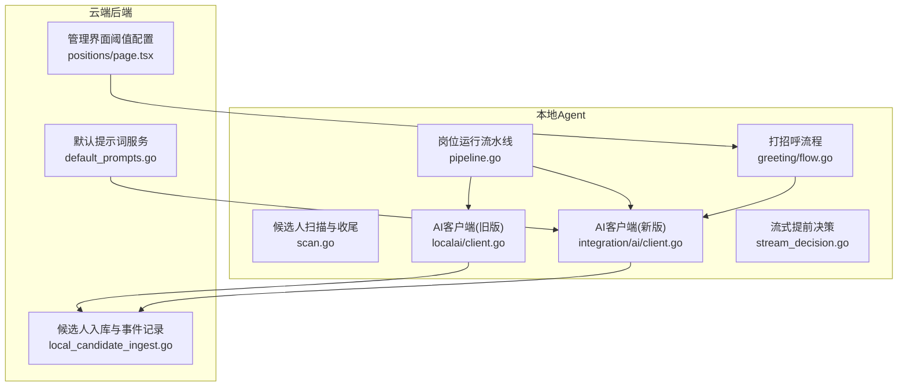
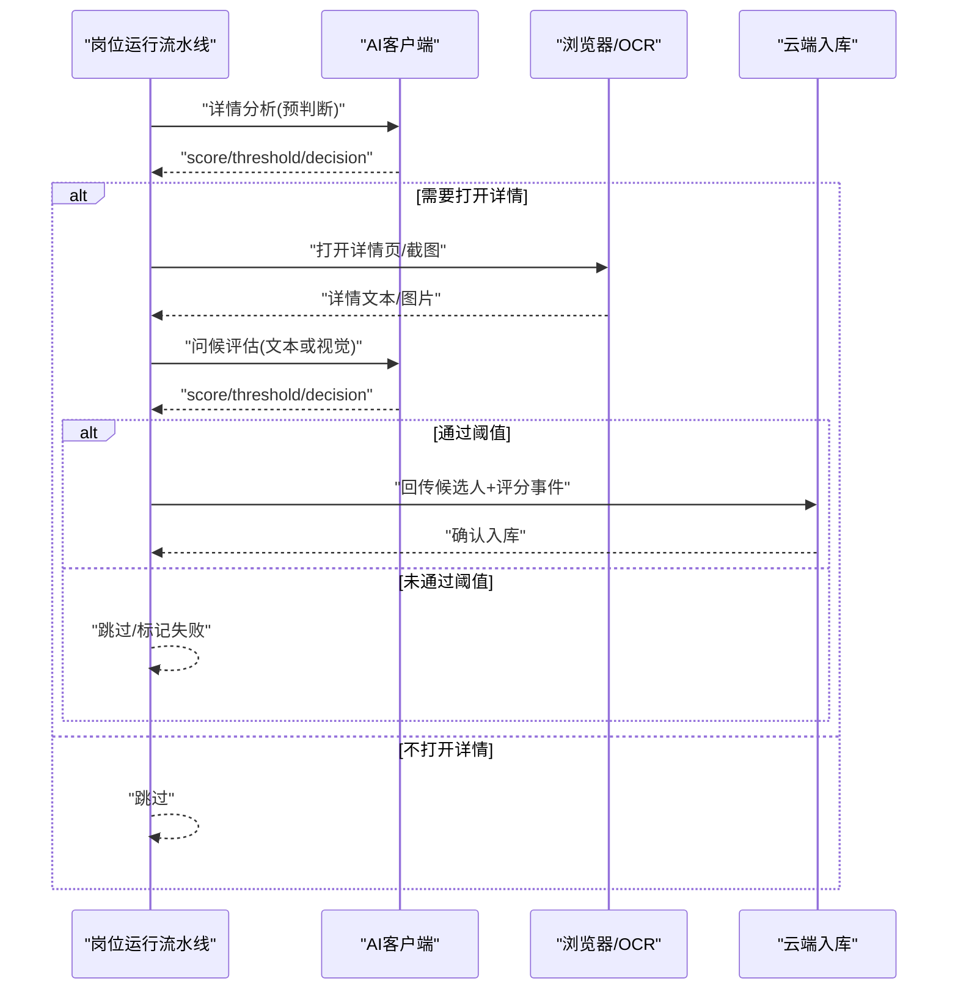
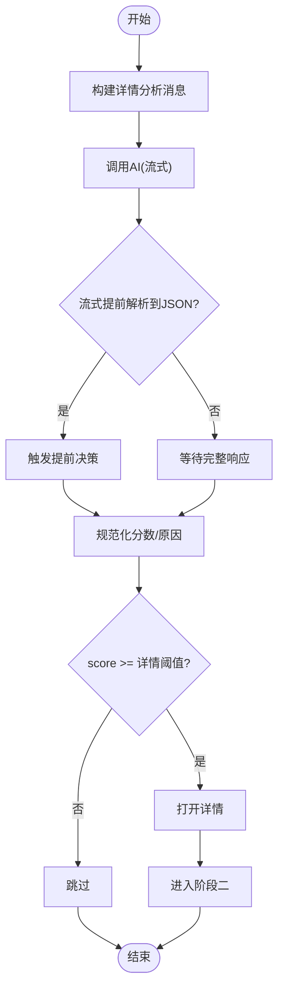
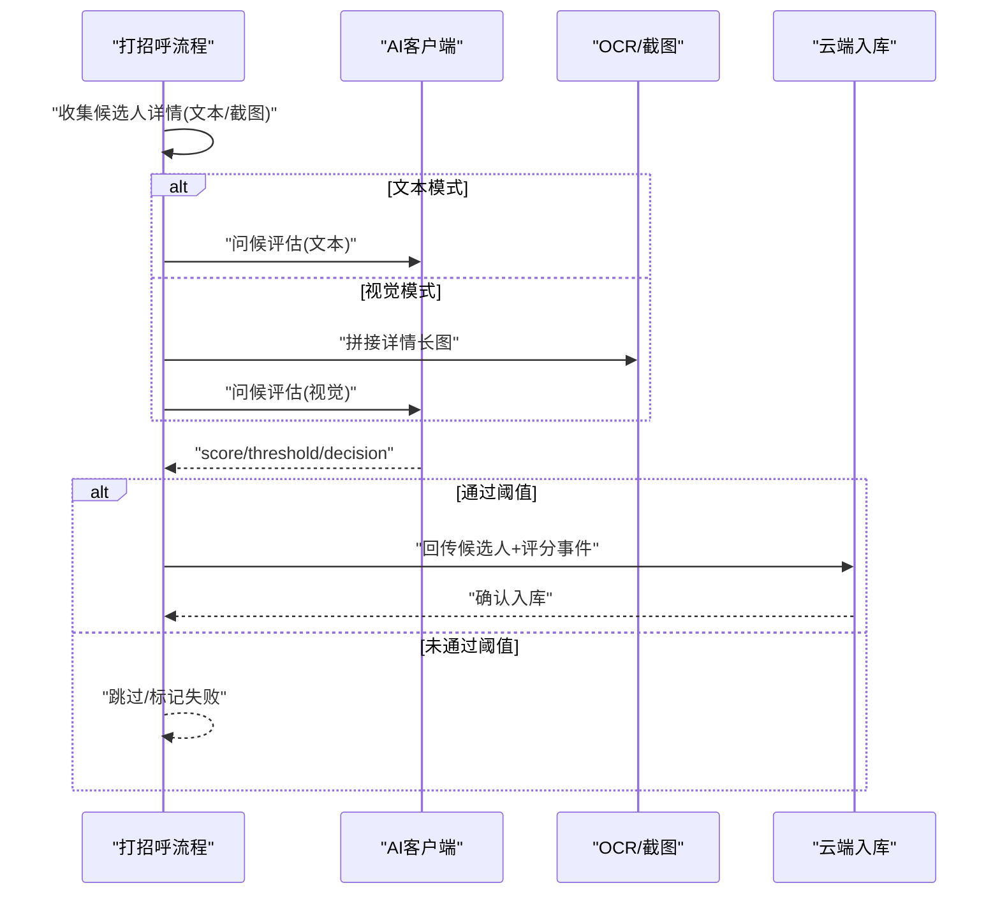
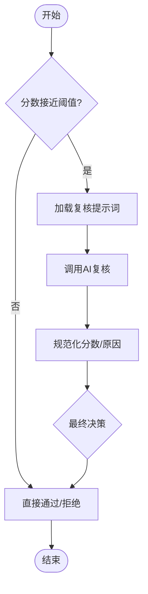
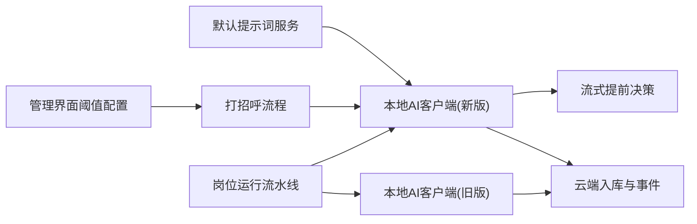

# AI评分算法

<cite>
**本文引用的文件**
- [local-agent-go/internal/localai/client.go](file://goodhr5/local-agent-go/internal/localai/client.go)
- [local-agent-go-new/internal/integration/ai/client.go](file://goodhr5/local-agent-go-new/internal/integration/ai/client.go)
- [local-agent-go-new/internal/integration/ai/stream_decision.go](file://goodhr5/local-agent-go-new/internal/integration/ai/stream_decision.go)
- [local-agent-go/internal/positionrunner/pipeline.go](file://goodhr5/local-agent-go/internal/positionrunner/pipeline.go)
- [local-agent-go/internal/positionrunner/scan.go](file://goodhr5/local-agent-go/internal/positionrunner/scan.go)
- [local-agent-go-new/internal/flow/greeting/flow.go](file://goodhr5/local-agent-go-new/internal/flow/greeting/flow.go)
- [local-agent-go-new/internal/flow/greeting/analysis.go](file://goodhr5/local-agent-go-new/internal/flow/greeting/analysis.go)
- [local-agent-go-new/internal/flow/greeting/policy.go](file://goodhr5/local-agent-go-new/internal/flow/greeting/policy.go)
- [cloud/backend/internal/httpapi/default_prompts.go](file://goodhr5/cloud/backend/internal/httpapi/default_prompts.go)
- [cloud/backend/internal/httpapi/local_candidate_ingest.go](file://goodhr5/cloud/backend/internal/httpapi/local_candidate_ingest.go)
- [cloud/frontend-next/app/admin/positions/page.tsx](file://goodhr5/cloud/frontend-next/app/admin/positions/page.tsx)
</cite>

## 目录
1. [简介](#简介)
2. [项目结构](#项目结构)
3. [核心组件](#核心组件)
4. [架构总览](#架构总览)
5. [详细组件分析](#详细组件分析)
6. [依赖关系分析](#依赖关系分析)
7. [性能与调优](#性能与调优)
8. [故障排查指南](#故障排查指南)
9. [结论](#结论)
10. [附录：配置示例与优化建议](#附录配置示例与优化建议)

## 简介
本文件面向开发者，系统化说明候选人智能匹配中的“AI评分算法”，覆盖三阶段评分机制（详情分析、问候评估、面试评审）的实现原理、提示词模板设计、评分维度与权重、置信度与阈值判定、AI调用流程、结果解析规则、以及可配置的权重与阈值调整。文档同时提供流程图、时序图与类图，帮助快速理解并改进候选人的智能匹配质量。

## 项目结构
本项目包含本地Agent端与云端后端两部分，AI评分主要发生在本地Agent的岗位运行流水线与打招呼流程中，最终结果回传到云端进行持久化与展示。

**图示来源**
- [local-agent-go/internal/positionrunner/pipeline.go:49-131](file://goodhr5/local-agent-go/internal/positionrunner/pipeline.go#L49-L131)
- [local-agent-go/internal/positionrunner/scan.go:351-374](file://goodhr5/local-agent-go/internal/positionrunner/scan.go#L351-L374)
- [local-agent-go-new/internal/flow/greeting/flow.go:49-95](file://goodhr5/local-agent-go-new/internal/flow/greeting/flow.go#L49-L95)
- [local-agent-go/internal/localai/client.go:164-256](file://goodhr5/local-agent-go/internal/localai/client.go#L164-L256)
- [local-agent-go-new/internal/integration/ai/client.go:108-193](file://goodhr5/local-agent-go-new/internal/integration/ai/client.go#L108-L193)
- [local-agent-go-new/internal/integration/ai/stream_decision.go:10-24](file://goodhr5/local-agent-go-new/internal/integration/ai/stream_decision.go#L10-L24)
- [cloud/backend/internal/httpapi/default_prompts.go:11-56](file://goodhr5/cloud/backend/internal/httpapi/default_prompts.go#L11-L56)
- [cloud/backend/internal/httpapi/local_candidate_ingest.go:231-262](file://goodhr5/cloud/backend/internal/httpapi/local_candidate_ingest.go#L231-L262)
- [cloud/frontend-next/app/admin/positions/page.tsx:1519-1545](file://goodhr5/cloud/frontend-next/app/admin/positions/page.tsx#L1519-L1545)

**章节来源**
- [local-agent-go/internal/positionrunner/pipeline.go:49-131](file://goodhr5/local-agent-go/internal/positionrunner/pipeline.go#L49-L131)
- [local-agent-go/internal/positionrunner/scan.go:351-374](file://goodhr5/local-agent-go/internal/positionrunner/scan.go#L351-L374)
- [local-agent-go-new/internal/flow/greeting/flow.go:49-95](file://goodhr5/local-agent-go-new/internal/flow/greeting/flow.go#L49-L95)
- [local-agent-go/internal/localai/client.go:164-256](file://goodhr5/local-agent-go/internal/localai/client.go#L164-L256)
- [local-agent-go-new/internal/integration/ai/client.go:108-193](file://goodhr5/local-agent-go-new/internal/integration/ai/client.go#L108-L193)
- [local-agent-go-new/internal/integration/ai/stream_decision.go:10-24](file://goodhr5/local-agent-go-new/internal/integration/ai/stream_decision.go#L10-L24)
- [cloud/backend/internal/httpapi/default_prompts.go:11-56](file://goodhr5/cloud/backend/internal/httpapi/default_prompts.go#L11-L56)
- [cloud/backend/internal/httpapi/local_candidate_ingest.go:231-262](file://goodhr5/cloud/backend/internal/httpapi/local_candidate_ingest.go#L231-L262)
- [cloud/frontend-next/app/admin/positions/page.tsx:1519-1545](file://goodhr5/cloud/frontend-next/app/admin/positions/page.tsx#L1519-L1545)

## 核心组件
- 本地AI客户端（旧版）：负责构建消息、调用OpenAI兼容接口、SSE流式读取、提前提取评分JSON、规范化分数与原因、计算是否打开详情或打招呼。
- 本地AI客户端（新版）：强类型Decision、支持文本/图片多模态、统一阈值与提前回调、结构化简历输出。
- 流式提前决策：从累计流式文本中提取完整JSON对象，尽早返回初步评分。
- 岗位运行流水线：并发预评分、超时控制、结果保存、二次打分与收尾。
- 打招呼流程：按批次处理候选人，执行预览判断、详情截图识别、最终打招呼决策。
- 云端默认提示词：系统级默认提示词加载与兜底。
- 云端入库与事件：接收本地回传的评分与原因，持久化为候选人事件。
- 管理界面阈值配置：前台可配置打招呼阈值分等参数。

**章节来源**
- [local-agent-go/internal/localai/client.go:164-256](file://goodhr5/local-agent-go/internal/localai/client.go#L164-L256)
- [local-agent-go-new/internal/integration/ai/client.go:108-193](file://goodhr5/local-agent-go-new/internal/integration/ai/client.go#L108-L193)
- [local-agent-go-new/internal/integration/ai/stream_decision.go:10-24](file://goodhr5/local-agent-go-new/internal/integration/ai/stream_decision.go#L10-L24)
- [local-agent-go/internal/positionrunner/pipeline.go:49-131](file://goodhr5/local-agent-go/internal/positionrunner/pipeline.go#L49-L131)
- [local-agent-go-new/internal/flow/greeting/flow.go:49-95](file://goodhr5/local-agent-go-new/internal/flow/greeting/flow.go#L49-L95)
- [cloud/backend/internal/httpapi/default_prompts.go:11-56](file://goodhr5/cloud/backend/internal/httpapi/default_prompts.go#L11-L56)
- [cloud/backend/internal/httpapi/local_candidate_ingest.go:231-262](file://goodhr5/cloud/backend/internal/httpapi/local_candidate_ingest.go#L231-L262)
- [cloud/frontend-next/app/admin/positions/page.tsx:1519-1545](file://goodhr5/cloud/frontend-next/app/admin/positions/page.tsx#L1519-L1545)

## 架构总览
三阶段评分机制在系统中以“预判断—详情识别—最终决策”的方式组织：
- 阶段一：详情分析（预判断）。基于候选人基础信息判断是否值得打开详情，使用“详情阈值”。
- 阶段二：问候评估（打招呼前复核）。结合候选人详情文本或长图，生成打招呼建议分，使用“打招呼阈值”。
- 阶段三：面试评审（可选复核）。对接近阈值的边界候选人进行二次复核，使用“复核提示词”。

**图示来源**
- [local-agent-go/internal/positionrunner/pipeline.go:49-131](file://goodhr5/local-agent-go/internal/positionrunner/pipeline.go#L49-L131)
- [local-agent-go/internal/positionrunner/scan.go:351-374](file://goodhr5/local-agent-go/internal/positionrunner/scan.go#L351-L374)
- [local-agent-go-new/internal/flow/greeting/flow.go:49-95](file://goodhr5/local-agent-go-new/internal/flow/greeting/flow.go#L49-L95)
- [local-agent-go/internal/localai/client.go:164-256](file://goodhr5/local-agent-go/internal/localai/client.go#L164-L256)
- [local-agent-go-new/internal/integration/ai/client.go:108-193](file://goodhr5/local-agent-go-new/internal/integration/ai/client.go#L108-L193)
- [cloud/backend/internal/httpapi/local_candidate_ingest.go:231-262](file://goodhr5/cloud/backend/internal/httpapi/local_candidate_ingest.go#L231-L262)

## 详细组件分析

### 阶段一：详情分析（预判断）
- 目标：仅根据候选人基础信息判断是否值得打开详情。
- 实现要点：
  - 使用“详情阈值”（默认60），来自岗位AI选项或全局配置。
  - 消息构造将稳定规则与动态内容分离，提高缓存友好性。
  - 支持提前回调：流式响应中一旦检测到完整JSON即触发early decision。
  - 结果规范化：分数限制在0-100，原因截断至30字符。
- 关键路径：
  - 旧版客户端ScoreForDetail；新版EvaluateCandidatePreview。
  - 流水线startCandidateDetailWorkers并发预评分。

**图示来源**
- [local-agent-go/internal/localai/client.go:164-189](file://goodhr5/local-agent-go/internal/localai/client.go#L164-L189)
- [local-agent-go-new/internal/integration/ai/client.go:138-148](file://goodhr5/local-agent-go-new/internal/integration/ai/client.go#L138-L148)
- [local-agent-go-new/internal/integration/ai/stream_decision.go:10-24](file://goodhr5/local-agent-go-new/internal/integration/ai/stream_decision.go#L10-L24)
- [local-agent-go/internal/positionrunner/pipeline.go:49-89](file://goodhr5/local-agent-go/internal/positionrunner/pipeline.go#L49-L89)

**章节来源**
- [local-agent-go/internal/localai/client.go:164-189](file://goodhr5/local-agent-go/internal/localai/client.go#L164-L189)
- [local-agent-go-new/internal/integration/ai/client.go:138-148](file://goodhr5/local-agent-go-new/internal/integration/ai/client.go#L138-L148)
- [local-agent-go-new/internal/integration/ai/stream_decision.go:10-24](file://goodhr5/local-agent-go-new/internal/integration/ai/stream_decision.go#L10-L24)
- [local-agent-go/internal/positionrunner/pipeline.go:49-89](file://goodhr5/local-agent-go/internal/positionrunner/pipeline.go#L49-L89)

### 阶段二：问候评估（打招呼前复核）
- 目标：结合候选人详情文本或长图，生成打招呼建议分，决定是否打招呼。
- 实现要点：
  - 支持文本与视觉两种输入：文本走buildGreetMessages；视觉走ScoreVisionForGreet/EvaluateCandidateVision。
  - 使用“打招呼阈值”（默认70），来自岗位AI选项或全局配置。
  - 结构化简历输出：当岗位开启OutputStructuredResume时，AI可返回可入库的结构化字段。
  - 提前回调：流式响应中尽早返回决策，提升交互体验。
- 关键路径：
  - 旧版ScoreForGreet/ScoreVisionForGreet；新版EvaluateCandidate/EvaluateCandidateVision。
  - 打招呼流程processBatches中执行最终决策。

**图示来源**
- [local-agent-go/internal/localai/client.go:191-256](file://goodhr5/local-agent-go/internal/localai/client.go#L191-L256)
- [local-agent-go-new/internal/integration/ai/client.go:108-193](file://goodhr5/local-agent-go-new/internal/integration/ai/client.go#L108-L193)
- [local-agent-go-new/internal/flow/greeting/flow.go:49-95](file://goodhr5/local-agent-go-new/internal/flow/greeting/flow.go#L49-L95)
- [cloud/backend/internal/httpapi/local_candidate_ingest.go:231-262](file://goodhr5/cloud/backend/internal/httpapi/local_candidate_ingest.go#L231-L262)

**章节来源**
- [local-agent-go/internal/localai/client.go:191-256](file://goodhr5/local-agent-go/internal/localai/client.go#L191-L256)
- [local-agent-go-new/internal/integration/ai/client.go:108-193](file://goodhr5/local-agent-go-new/internal/integration/ai/client.go#L108-L193)
- [local-agent-go-new/internal/flow/greeting/flow.go:49-95](file://goodhr5/local-agent-go-new/internal/flow/greeting/flow.go#L49-L95)
- [cloud/backend/internal/httpapi/local_candidate_ingest.go:231-262](file://goodhr5/cloud/backend/internal/httpapi/local_candidate_ingest.go#L231-L262)

### 阶段三：面试评审（边界复核）
- 目标：对接近阈值的候选人进行二次复核，降低误判风险。
- 实现要点：
  - 使用“复核提示词”（系统默认内置），聚焦风险点与关键硬指标。
  - 通常用于score接近阈值的情况，作为最终把关。
- 关键路径：
  - 默认提示词服务提供内置复核提示词。
  - 可在流程中按需调用复核逻辑（例如在打招呼前对边界候选人再次评估）。

**图示来源**
- [cloud/backend/internal/httpapi/default_prompts.go:11-56](file://goodhr5/cloud/backend/internal/httpapi/default_prompts.go#L11-L56)

**章节来源**
- [cloud/backend/internal/httpapi/default_prompts.go:11-56](file://goodhr5/cloud/backend/internal/httpapi/default_prompts.go#L11-L56)

### 提示词模板设计与评分维度
- 模板来源：
  - 系统默认提示词：过滤、打开详情、复核提示词。
  - 岗位级自定义：岗位AI选项中可覆盖默认提示词。
- 评分维度与权重原则：
  - 硬性条件权重最高，普通条件为主要权重。
  - “优先/加分/最好”等加分项只占低权重。
  - 明确冲突的硬性条件必须显著降分；加分项符合只能小幅加分。
  - 角色相关性、行业经验、到岗状态等低权重参考，不能压过用户明确填写的岗位要求。
  - reason优先说明最关键条件的匹配、待核验或明确冲突情况。
- 结构化简历输出：
  - 当岗位开启OutputStructuredResume时，AI可返回可入库的结构化字段，便于后续数据治理。

**章节来源**
- [cloud/backend/internal/httpapi/default_prompts.go:11-56](file://goodhr5/cloud/backend/internal/httpapi/default_prompts.go#L11-L56)
- [local-agent-go-new/internal/integration/ai/client.go:35-46](file://goodhr5/local-agent-go-new/internal/integration/ai/client.go#L35-L46)
- [local-agent-go/internal/localai/client.go:705-722](file://goodhr5/local-agent-go/internal/localai/client.go#L705-L722)

### 置信度计算方法
- 置信度体现为“提前决策”与“规范化后的分数/原因”：
  - 流式提前决策：在SSE流中尽早提取完整JSON，减少等待时间。
  - 规范化：分数限制在0-100，原因截断至30字符，缺失原因填充默认值。
  - 阈值比较：score >= threshold决定动作（打开详情/打招呼/请求信息）。
- 置信度增强：
  - 结构化简历输出提供更丰富的上下文，有助于提高判断准确性。
  - 视觉模式结合长图识别，弥补文本缺失。

**章节来源**
- [local-agent-go-new/internal/integration/ai/stream_decision.go:10-24](file://goodhr5/local-agent-go-new/internal/integration/ai/stream_decision.go#L10-L24)
- [local-agent-go/internal/localai/client.go:541-554](file://goodhr5/local-agent-go/internal/localai/client.go#L541-L554)
- [local-agent-go/internal/localai/client.go:604-651](file://goodhr5/local-agent-go/internal/localai/client.go#L604-L651)

### AI调用流程与结果解析规则
- 调用流程：
  - 构建消息（system/user），设置temperature、stream、enable_thinking等参数。
  - 发送HTTP请求，支持JSON与SSE响应。
  - SSE流式读取，累积文本，尝试提前提取JSON。
  - 非SSE响应则直接解析choices中的content。
- 结果解析：
  - 提取score与reason，规范化范围与长度。
  - 根据threshold计算ShouldGreet/ShouldOpenDetail。
  - 结构化简历输出时，额外解析resume字段。

**章节来源**
- [local-agent-go/internal/localai/client.go:258-376](file://goodhr5/local-agent-go/internal/localai/client.go#L258-L376)
- [local-agent-go-new/internal/integration/ai/client.go:235-352](file://goodhr5/local-agent-go-new/internal/integration/ai/client.go#L235-L352)
- [local-agent-go-new/internal/integration/ai/stream_decision.go:10-24](file://goodhr5/local-agent-go-new/internal/integration/ai/stream_decision.go#L10-L24)

### 评分权重调整与阈值配置
- 阈值来源：
  - 详情阈值：岗位AI选项DetailScoreThreshold或默认60。
  - 打招呼阈值：岗位AI选项GreetScoreThreshold或全局ScoreThreshold或默认70。
  - 索要信息阈值：岗位AI选项RequestScoreThreshold或GreetScoreThreshold或默认70。
- 前端配置：
  - 管理界面提供“打招呼阈值分”输入框，支持同步更新相关阈值。
- 权重调整：
  - 通过提示词模板强调硬性条件权重，避免低权重维度压过用户明确要求。
  - 结构化简历输出提升上下文质量，间接影响权重分配效果。

**章节来源**
- [local-agent-go-new/internal/flow/greeting/analysis.go:131-148](file://goodhr5/local-agent-go-new/internal/flow/greeting/analysis.go#L131-L148)
- [local-agent-go-new/internal/flow/greeting/policy.go:40-54](file://goodhr5/local-agent-go-new/internal/flow/greeting/policy.go#L40-L54)
- [cloud/frontend-next/app/admin/positions/page.tsx:1519-1545](file://goodhr5/cloud/frontend-next/app/admin/positions/page.tsx#L1519-L1545)

## 依赖关系分析

**图示来源**
- [local-agent-go/internal/positionrunner/pipeline.go:49-131](file://goodhr5/local-agent-go/internal/positionrunner/pipeline.go#L49-L131)
- [local-agent-go-new/internal/flow/greeting/flow.go:49-95](file://goodhr5/local-agent-go-new/internal/flow/greeting/flow.go#L49-L95)
- [local-agent-go/internal/localai/client.go:164-256](file://goodhr5/local-agent-go/internal/localai/client.go#L164-L256)
- [local-agent-go-new/internal/integration/ai/client.go:108-193](file://goodhr5/local-agent-go-new/internal/integration/ai/client.go#L108-L193)
- [local-agent-go-new/internal/integration/ai/stream_decision.go:10-24](file://goodhr5/local-agent-go-new/internal/integration/ai/stream_decision.go#L10-L24)
- [cloud/backend/internal/httpapi/default_prompts.go:11-56](file://goodhr5/cloud/backend/internal/httpapi/default_prompts.go#L11-L56)
- [cloud/backend/internal/httpapi/local_candidate_ingest.go:231-262](file://goodhr5/cloud/backend/internal/httpapi/local_candidate_ingest.go#L231-L262)
- [cloud/frontend-next/app/admin/positions/page.tsx:1519-1545](file://goodhr5/cloud/frontend-next/app/admin/positions/page.tsx#L1519-L1545)

**章节来源**
- [local-agent-go/internal/positionrunner/pipeline.go:49-131](file://goodhr5/local-agent-go/internal/positionrunner/pipeline.go#L49-L131)
- [local-agent-go-new/internal/flow/greeting/flow.go:49-95](file://goodhr5/local-agent-go-new/internal/flow/greeting/flow.go#L49-L95)
- [local-agent-go/internal/localai/client.go:164-256](file://goodhr5/local-agent-go/internal/localai/client.go#L164-L256)
- [local-agent-go-new/internal/integration/ai/client.go:108-193](file://goodhr5/local-agent-go-new/internal/integration/ai/client.go#L108-L193)
- [local-agent-go-new/internal/integration/ai/stream_decision.go:10-24](file://goodhr5/local-agent-go-new/internal/integration/ai/stream_decision.go#L10-L24)
- [cloud/backend/internal/httpapi/default_prompts.go:11-56](file://goodhr5/cloud/backend/internal/httpapi/default_prompts.go#L11-L56)
- [cloud/backend/internal/httpapi/local_candidate_ingest.go:231-262](file://goodhr5/cloud/backend/internal/httpapi/local_candidate_ingest.go#L231-L262)
- [cloud/frontend-next/app/admin/positions/page.tsx:1519-1545](file://goodhr5/cloud/frontend-next/app/admin/positions/page.tsx#L1519-L1545)

## 性能与调优
- 并发与超时：
  - 流水线并发预评分，workerCount根据批次数量动态调整。
  - 每个候选人操作设置超时，避免长时间阻塞。
- 流式与提前决策：
  - SSE流式响应，尽早提取JSON，降低端到端延迟。
  - 提前决策回调可用于UI即时反馈。
- 重试与退避：
  - 临时错误最多重试三次，支持Retry-After头。
  - 指数退避策略，避免雪崩。
- 结构化简历输出：
  - 开启OutputStructuredResume可提升上下文质量，但需权衡模型负载。
- 建议：
  - 合理设置温度temperature，平衡稳定性与创造性。
  - 针对高频场景启用缓存友好的消息构造。
  - 监控AI服务状态码与错误类型，及时调整阈值与提示词。

**章节来源**
- [local-agent-go/internal/positionrunner/pipeline.go:133-143](file://goodhr5/local-agent-go/internal/positionrunner/pipeline.go#L133-L143)
- [local-agent-go/internal/localai/client.go:310-326](file://goodhr5/local-agent-go/internal/localai/client.go#L310-L326)
- [local-agent-go-new/internal/integration/ai/client.go:235-268](file://goodhr5/local-agent-go-new/internal/integration/ai/client.go#L235-L268)

## 故障排查指南
- 常见错误：
  - AI服务连接失败：检查BaseURL、APIKey、Model配置。
  - 状态码错误：401/402/403/404通常为致命错误，需立即停止任务。
  - 流式中断：SSE读取异常，需重试或降级为非流式。
- 日志与诊断：
  - 岗位运行日志记录每个操作的耗时与错误。
  - 云端入库日志记录候选人入库与评分事件。
- 处理建议：
  - 根据ServiceError.Retryable/Fatal决定重试或停止。
  - 检查阈值配置是否合理，避免过多误判。
  - 使用默认提示词兜底，确保基本评分能力。

**章节来源**
- [local-agent-go/internal/localai/client.go:378-403](file://goodhr5/local-agent-go/internal/localai/client.go#L378-L403)
- [local-agent-go-new/internal/integration/ai/client.go:354-402](file://goodhr5/local-agent-go-new/internal/integration/ai/client.go#L354-L402)
- [cloud/backend/internal/httpapi/local_candidate_ingest.go:126-132](file://goodhr5/cloud/backend/internal/httpapi/local_candidate_ingest.go#L126-L132)

## 结论
本AI评分算法通过三阶段机制（详情分析、问候评估、面试评审）实现了稳健且灵活的候选人智能匹配。系统支持文本与视觉双模态输入、流式提前决策、结构化简历输出，并提供可配置的阈值与提示词模板。通过并发流水线、超时控制、重试退避等机制，保障了高可用性与性能。开发者可根据业务需求调整阈值与提示词，持续优化匹配质量。

## 附录：配置示例与优化建议
- 阈值配置示例：
  - 详情阈值：60（默认）
  - 打招呼阈值：70（默认）
  - 索要信息阈值：70（默认）
- 提示词模板建议：
  - 强调硬性条件权重，避免低权重维度干扰。
  - 使用结构化简历输出提升上下文质量。
- 优化建议：
  - 根据历史数据校准阈值，平衡召回与精准。
  - 监控AI服务状态，及时切换模型或调整温度。
  - 利用流式提前决策提升用户体验。

**章节来源**
- [cloud/frontend-next/app/admin/positions/page.tsx:1519-1545](file://goodhr5/cloud/frontend-next/app/admin/positions/page.tsx#L1519-L1545)
- [cloud/backend/internal/httpapi/default_prompts.go:11-56](file://goodhr5/cloud/backend/internal/httpapi/default_prompts.go#L11-L56)
- [local-agent-go-new/internal/integration/ai/client.go:35-46](file://goodhr5/local-agent-go-new/internal/integration/ai/client.go#L35-L46)