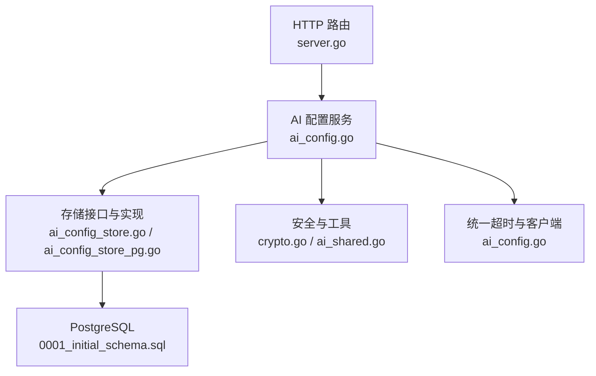
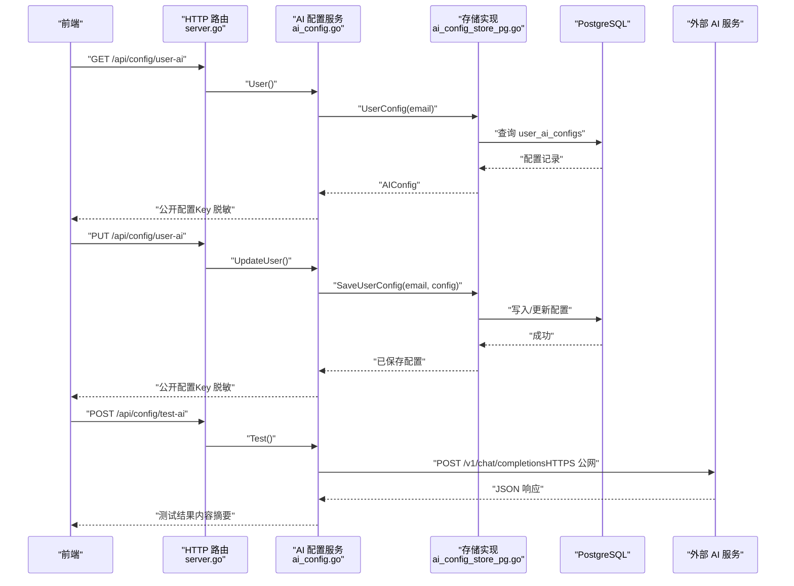
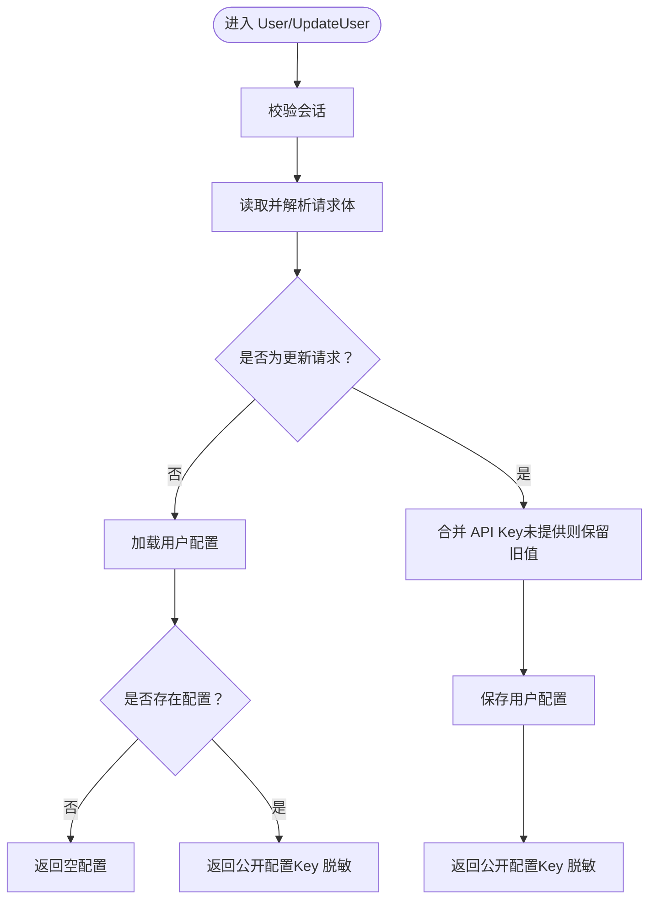
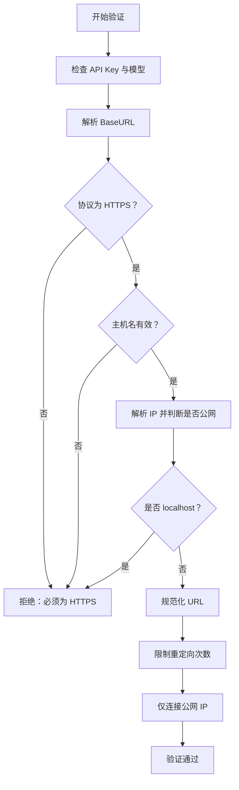
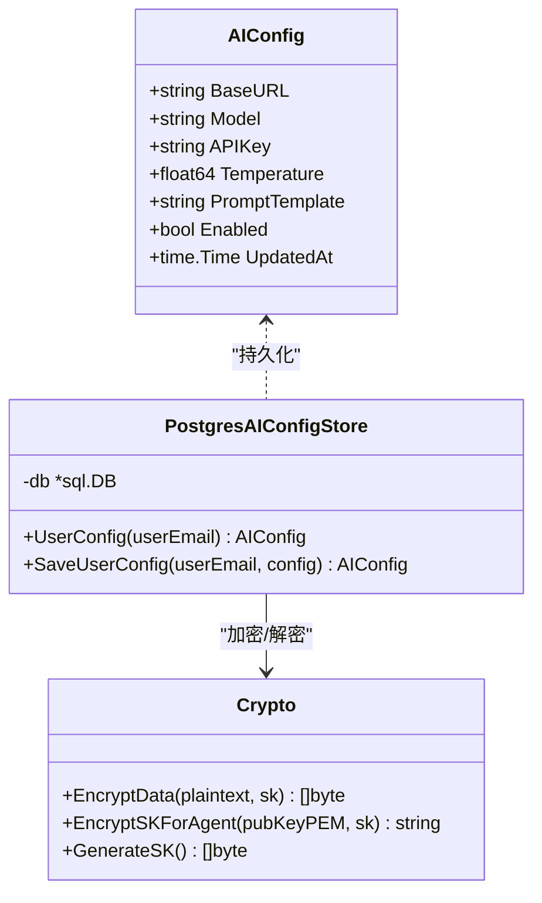
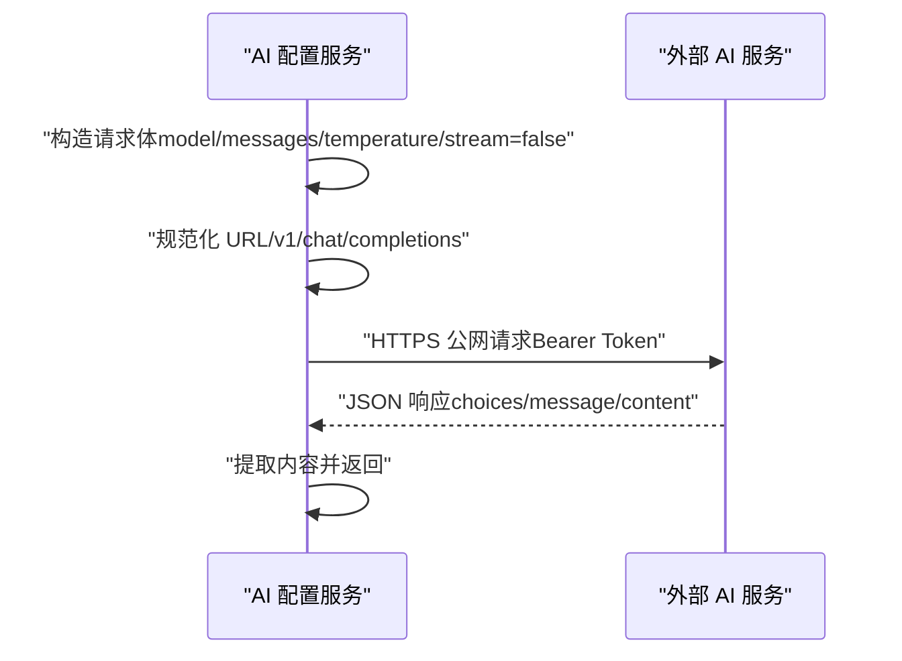
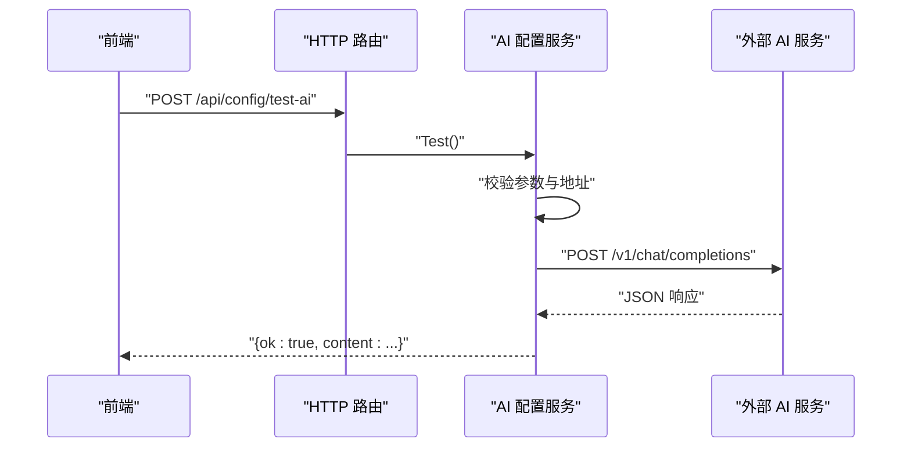
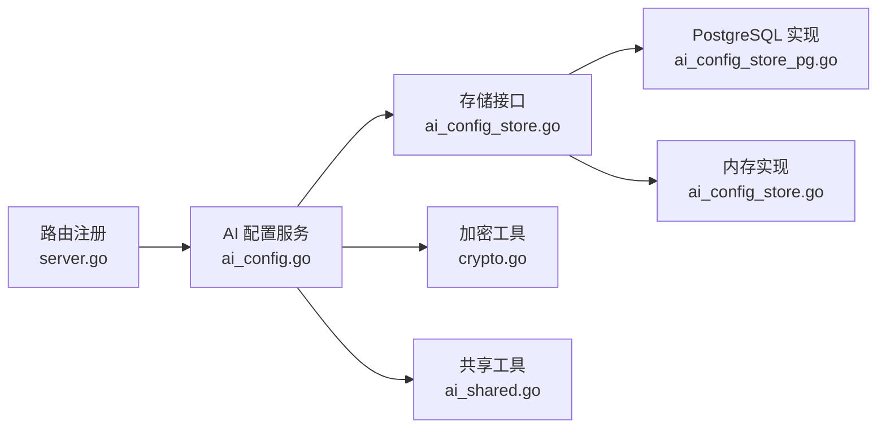

# AI配置管理

<cite>
**本文引用的文件**
- [ai_config.go](file://goodhr5/cloud/backend/internal/httpapi/ai_config.go)
- [ai_config_store.go](file://goodhr5/cloud/backend/internal/httpapi/ai_config_store.go)
- [ai_config_store_pg.go](file://goodhr5/cloud/backend/internal/httpapi/ai_config_store_pg.go)
- [ai_shared.go](file://goodhr5/cloud/backend/internal/httpapi/ai_shared.go)
- [crypto.go](file://goodhr5/cloud/backend/internal/httpapi/crypto.go)
- [config.go](file://goodhr5/cloud/backend/internal/httpapi/config.go)
- [server.go](file://goodhr5/cloud/backend/internal/httpapi/server.go)
- [0001_initial_schema.sql](file://goodhr5/cloud/backend/db/migrations/0001_initial_schema.sql)
- [0055_ai_wallet_and_builtin_ai.sql](file://goodhr5/cloud/backend/db/migrations/0055_ai_wallet_and_builtin_ai.sql)
- [ai_config_test.go](file://goodhr5/cloud/backend/internal/httpapi/ai_config_test.go)
</cite>

## 目录
1. [简介](#简介)
2. [项目结构](#项目结构)
3. [核心组件](#核心组件)
4. [架构总览](#架构总览)
5. [详细组件分析](#详细组件分析)
6. [依赖关系分析](#依赖关系分析)
7. [性能与可用性](#性能与可用性)
8. [故障排查指南](#故障排查指南)
9. [结论](#结论)
10. [附录：配置示例与安全最佳实践](#附录配置示例与安全最佳实践)

## 简介
本系统提供用户自定义 AI 配置的完整管理能力，包括读取、更新、最终生效配置查询以及在线测试能力。系统支持 OpenAI 兼容接口调用，强制 HTTPS 公网访问，并通过内网 IP 白名单机制防止误用或攻击。敏感信息（API Key）在存储层采用加密保存，对外返回时进行脱敏处理；本地程序可通过受控参数获取明文 Key 用于调试。同时，系统内置了统一的超时控制、重定向限制和响应体大小限制，确保稳定性与安全性。

## 项目结构
AI 配置管理位于云端后端 HTTP API 模块中，主要涉及以下职责划分：
- HTTP 服务装配与路由注册：负责将 AI 配置相关接口挂载到统一入口。
- 业务服务：封装用户配置读写、测试请求、安全校验等逻辑。
- 数据模型与存储接口：定义 AI 配置结构与持久化抽象。
- 数据库实现：PostgreSQL 持久化与内存实现（开发环境）。
- 安全与工具：加密、URL 规范化、日志脱敏、公共 IP 判定等。

**图表来源**
- [server.go:132-158](file://goodhr5/cloud/backend/internal/httpapi/server.go#L132-L158)
- [ai_config.go:22-45](file://goodhr5/cloud/backend/internal/httpapi/ai_config.go#L22-L45)
- [ai_config_store.go:9-24](file://goodhr5/cloud/backend/internal/httpapi/ai_config_store.go#L9-L24)
- [ai_config_store_pg.go:11-19](file://goodhr5/cloud/backend/internal/httpapi/ai_config_store_pg.go#L11-L19)
- [0001_initial_schema.sql:70-85](file://goodhr5/cloud/backend/db/migrations/0001_initial_schema.sql#L70-L85)

**章节来源**
- [server.go:132-158](file://goodhr5/cloud/backend/internal/httpapi/server.go#L132-L158)
- [config.go:151-157](file://goodhr5/cloud/backend/internal/httpapi/config.go#L151-L157)

## 核心组件
- AI 配置服务：提供用户配置读取、更新、最终生效配置查询与在线测试。
- 存储抽象与实现：内存存储用于开发，PostgreSQL 存储用于生产。
- 安全与工具：HTTPS 校验、公网 IP 白名单、URL 规范化、日志脱敏、响应提取。
- 加密与密钥封装：使用 AES-GCM 与 ECDH 对敏感数据进行加密与封装。

**章节来源**
- [ai_config.go:22-45](file://goodhr5/cloud/backend/internal/httpapi/ai_config.go#L22-L45)
- [ai_config_store.go:9-24](file://goodhr5/cloud/backend/internal/httpapi/ai_config_store.go#L9-L24)
- [ai_config_store_pg.go:11-19](file://goodhr5/cloud/backend/internal/httpapi/ai_config_store_pg.go#L11-L19)
- [crypto.go:28-51](file://goodhr5/cloud/backend/internal/httpapi/crypto.go#L28-L51)

## 架构总览
AI 配置管理的整体流程如下：
- 前端通过认证后的 HTTP 请求访问 AI 配置接口。
- 服务端校验会话、参数合法性与目标地址安全性。
- 根据场景选择存储实现（内存或 PostgreSQL）。
- 测试功能通过受限的 HTTP 客户端向用户提供的 OpenAI 兼容接口发起请求，并解析响应内容。
- 所有外部 AI 调用统一超时控制，避免资源占用。

**图表来源**
- [server.go:155-158](file://goodhr5/cloud/backend/internal/httpapi/server.go#L155-L158)
- [ai_config.go:47-82](file://goodhr5/cloud/backend/internal/httpapi/ai_config.go#L47-L82)
- [ai_config_store_pg.go:21-52](file://goodhr5/cloud/backend/internal/httpapi/ai_config_store_pg.go#L21-L52)
- [ai_config_store_pg.go:54-114](file://goodhr5/cloud/backend/internal/httpapi/ai_config_store_pg.go#L54-L114)

## 详细组件分析

### 用户自定义 AI 配置的 CRUD
- 读取用户配置：按当前登录用户邮箱查询其自定义配置；未配置时返回空配置。
- 更新用户配置：接收 base_url、model、api_key、temperature、prompt_template、enabled；若请求未包含 api_key，则保留已有值。
- 最终生效配置：仅基于用户配置返回，不再使用系统默认兜底；支持可选参数以决定是否返回明文 Key。
- 公开字段策略：对外返回时隐藏完整 Key，仅提供是否设置标记与脱敏片段；本地程序可通过查询参数获取明文 Key。

**图表来源**
- [ai_config.go:265-340](file://goodhr5/cloud/backend/internal/httpapi/ai_config.go#L265-L340)
- [ai_config_store.go:44-64](file://goodhr5/cloud/backend/internal/httpapi/ai_config_store.go#L44-L64)
- [ai_config_store_pg.go:21-114](file://goodhr5/cloud/backend/internal/httpapi/ai_config_store_pg.go#L21-L114)

**章节来源**
- [ai_config.go:265-340](file://goodhr5/cloud/backend/internal/httpapi/ai_config.go#L265-L340)
- [ai_config.go:375-397](file://goodhr5/cloud/backend/internal/httpapi/ai_config.go#L375-L397)
- [ai_config_store_pg.go:21-114](file://goodhr5/cloud/backend/internal/httpapi/ai_config_store_pg.go#L21-L114)

### 配置验证机制
- 必填项校验：API Key、模型名称为必填。
- 地址校验：必须为有效的公网 HTTPS 地址；禁止内网、回环、链路本地、组播及未指定地址；禁止 localhost。
- URL 规范化：自动补全 OpenAI 兼容路径 /v1/chat/completions。
- 重定向限制：最多允许 3 次重定向，每次重定向均重新校验目标地址。
- 连接限制：仅连接解析后的公网 IP，跳过非公网地址。

**图表来源**
- [ai_config.go:150-169](file://goodhr5/cloud/backend/internal/httpapi/ai_config.go#L150-L169)
- [ai_config.go:126-139](file://goodhr5/cloud/backend/internal/httpapi/ai_config.go#L126-L139)
- [ai_config.go:171-224](file://goodhr5/cloud/backend/internal/httpapi/ai_config.go#L171-L224)

**章节来源**
- [ai_config.go:150-224](file://goodhr5/cloud/backend/internal/httpapi/ai_config.go#L150-L224)

### 安全存储策略
- 存储字段：API Key 以加密形式保存在数据库字段中。
- 加密方式：使用 AES-GCM 对称加密，结合随机 nonce；密钥封装使用 ECDH 派生包装密钥。
- 对外展示：公开接口返回 Key 是否设置标记与脱敏片段；仅在特定受控场景下返回明文 Key。
- 日志脱敏：日志中不包含完整 Key，仅显示协议、域名与路径。

**图表来源**
- [ai_config_store.go:9-18](file://goodhr5/cloud/backend/internal/httpapi/ai_config_store.go#L9-L18)
- [ai_config_store_pg.go:11-19](file://goodhr5/cloud/backend/internal/httpapi/ai_config_store_pg.go#L11-L19)
- [crypto.go:28-51](file://goodhr5/cloud/backend/internal/httpapi/crypto.go#L28-L51)

**章节来源**
- [ai_config_store_pg.go:21-114](file://goodhr5/cloud/backend/internal/httpapi/ai_config_store_pg.go#L21-L114)
- [crypto.go:28-114](file://goodhr5/cloud/backend/internal/httpapi/crypto.go#L28-L114)
- [ai_config.go:436-460](file://goodhr5/cloud/backend/internal/httpapi/ai_config.go#L436-L460)

### OpenAI 兼容接口支持与 HTTPS 安全验证
- 兼容接口：统一发送 POST 至 chat/completions，携带 model、messages、temperature、stream=false。
- HTTPS 强制：仅接受 https 协议；否则拒绝。
- 公网白名单：仅允许连接公网 IP，跳过内网、回环、链路本地、组播等地址。
- 超时控制：统一 180 秒超时，避免长时间阻塞。
- 响应解析：从 choices 中提取 message.content，支持字符串或文本数组。

**图表来源**
- [ai_config.go:84-124](file://goodhr5/cloud/backend/internal/httpapi/ai_config.go#L84-L124)
- [ai_config.go:126-139](file://goodhr5/cloud/backend/internal/httpapi/ai_config.go#L126-L139)
- [ai_config.go:171-224](file://goodhr5/cloud/backend/internal/httpapi/ai_config.go#L171-L224)
- [ai_config.go:226-251](file://goodhr5/cloud/backend/internal/httpapi/ai_config.go#L226-L251)

**章节来源**
- [ai_config.go:84-124](file://goodhr5/cloud/backend/internal/httpapi/ai_config.go#L84-L124)
- [ai_config.go:126-139](file://goodhr5/cloud/backend/internal/httpapi/ai_config.go#L126-L139)
- [ai_config.go:171-224](file://goodhr5/cloud/backend/internal/httpapi/ai_config.go#L171-L224)
- [ai_config.go:226-251](file://goodhr5/cloud/backend/internal/httpapi/ai_config.go#L226-L251)

### 公网 IP 白名单机制
- 解析目标主机为 IP 列表。
- 过滤非公网 IP（内网、回环、链路本地、组播、未指定）。
- 依次尝试连接，首个成功即返回；全部失败则报错。
- 日志记录每个 IP 的连接结果，便于排障。

**章节来源**
- [ai_config.go:190-224](file://goodhr5/cloud/backend/internal/httpapi/ai_config.go#L190-L224)

### 配置测试功能
- 入口：POST /api/config/test-ai，需登录态。
- 行为：构造最小消息“请只返回两个字：成功”，发送至用户配置的 BaseURL。
- 结果：成功返回 content；失败返回错误信息与状态码。
- 安全：严格校验 HTTPS、公网 IP、重定向次数；统一超时。

**图表来源**
- [server.go:155-158](file://goodhr5/cloud/backend/internal/httpapi/server.go#L155-L158)
- [ai_config.go:47-82](file://goodhr5/cloud/backend/internal/httpapi/ai_config.go#L47-L82)
- [ai_config.go:84-124](file://goodhr5/cloud/backend/internal/httpapi/ai_config.go#L84-L124)

**章节来源**
- [ai_config.go:47-82](file://goodhr5/cloud/backend/internal/httpapi/ai_config.go#L47-L82)
- [ai_config.go:84-124](file://goodhr5/cloud/backend/internal/httpapi/ai_config.go#L84-L124)

### API Key 加密存储
- 存储字段：api_key_encrypted。
- 加密算法：AES-GCM，附带随机 nonce。
- 密钥封装：ECDH 派生包装密钥，生成临时公钥与加密后的密钥。
- 对外策略：公开接口不返回明文 Key；本地程序可通过受控参数获取。

**章节来源**
- [ai_config_store_pg.go:21-114](file://goodhr5/cloud/backend/internal/httpapi/ai_config_store_pg.go#L21-L114)
- [crypto.go:28-114](file://goodhr5/cloud/backend/internal/httpapi/crypto.go#L28-L114)
- [ai_config.go:436-460](file://goodhr5/cloud/backend/internal/httpapi/ai_config.go#L436-L460)

### 配置优先级规则
- 最终生效配置仅来自用户配置，不再使用系统默认兜底。
- 读取接口返回公开字段；特殊受控场景可返回明文 Key。
- 更新接口在未提供 API Key 时保留已有值，避免覆盖。

**章节来源**
- [ai_config.go:342-373](file://goodhr5/cloud/backend/internal/httpapi/ai_config.go#L342-L373)
- [ai_config.go:375-397](file://goodhr5/cloud/backend/internal/httpapi/ai_config.go#L375-L397)
- [ai_config.go:303-340](file://goodhr5/cloud/backend/internal/httpapi/ai_config.go#L303-L340)

## 依赖关系分析
- 路由与服务装配：Server 注入 AI 配置服务与存储实现。
- 存储选择：根据是否配置 PostgreSQL 决定使用内存或数据库实现。
- 外部依赖：PostgreSQL、Redis（其他模块）、SMTP（邮件模块）。
- 安全依赖：ECDH、AES-GCM、HKDF。

**图表来源**
- [server.go:100-129](file://goodhr5/cloud/backend/internal/httpapi/server.go#L100-L129)
- [config.go:151-157](file://goodhr5/cloud/backend/internal/httpapi/config.go#L151-L157)
- [ai_config_store.go:9-24](file://goodhr5/cloud/backend/internal/httpapi/ai_config_store.go#L9-L24)
- [ai_config_store_pg.go:11-19](file://goodhr5/cloud/backend/internal/httpapi/ai_config_store_pg.go#L11-L19)
- [crypto.go:28-114](file://goodhr5/cloud/backend/internal/httpapi/crypto.go#L28-L114)
- [ai_shared.go:9-36](file://goodhr5/cloud/backend/internal/httpapi/ai_shared.go#L9-L36)

**章节来源**
- [server.go:100-129](file://goodhr5/cloud/backend/internal/httpapi/server.go#L100-L129)
- [config.go:151-157](file://goodhr5/cloud/backend/internal/httpapi/config.go#L151-L157)

## 性能与可用性
- 统一超时：所有 AI 请求最长等待 180 秒，避免资源长期占用。
- 连接限制：仅连接公网 IP，减少无效连接与安全风险。
- 响应体限制：测试接口限制读取最大响应体大小，防止大响应导致内存压力。
- 数据库超时：存储操作设置 3 秒上下文超时，降低慢查询影响。
- 重定向限制：最多 3 次重定向，防止循环跳转。

**章节来源**
- [ai_config.go:19-20](file://goodhr5/cloud/backend/internal/httpapi/ai_config.go#L19-L20)
- [ai_config.go:102-118](file://goodhr5/cloud/backend/internal/httpapi/ai_config.go#L102-L118)
- [ai_config.go:171-188](file://goodhr5/cloud/backend/internal/httpapi/ai_config.go#L171-L188)
- [ai_config_store_pg.go:21-24](file://goodhr5/cloud/backend/internal/httpapi/ai_config_store_pg.go#L21-L24)
- [ai_config_store_pg.go:54-57](file://goodhr5/cloud/backend/internal/httpapi/ai_config_store_pg.go#L54-L57)

## 故障排查指南
- 无法连接 AI 服务：
  - 检查 BaseURL 是否为 HTTPS 且为公网地址。
  - 确认模型名称正确，响应中包含可用内容。
  - 查看日志中的目标地址与状态码。
- 匿名用户被拒绝：
  - 确保请求携带有效会话令牌。
- 重定向过多：
  - 检查 BaseURL 是否正确，避免不必要的跳转。
- 内网地址被拒绝：
  - 确保 AI 服务暴露公网可达地址。
- 明文 Key 未返回：
  - 普通读取不会返回明文 Key；本地程序需添加 reveal_api_key=1 参数。

**章节来源**
- [ai_config.go:47-82](file://goodhr5/cloud/backend/internal/httpapi/ai_config.go#L47-L82)
- [ai_config.go:150-169](file://goodhr5/cloud/backend/internal/httpapi/ai_config.go#L150-L169)
- [ai_config.go:171-224](file://goodhr5/cloud/backend/internal/httpapi/ai_config.go#L171-L224)
- [ai_config.go:375-397](file://goodhr5/cloud/backend/internal/httpapi/ai_config.go#L375-L397)

## 结论
AI 配置管理系统提供了完善的安全与可用性保障，支持用户自定义 AI 服务的接入与测试，并通过严格的 HTTPS、公网 IP 白名单与加密存储策略保护敏感信息。系统采用清晰的职责分离与可扩展的存储抽象，便于在不同环境中部署与扩展。开发者可基于现有能力快速集成新的 AI 服务，同时保持高安全标准与稳定运行。

## 附录：配置示例与安全最佳实践
- 配置字段说明：
  - base_url：OpenAI 兼容接口的 HTTPS 公网地址。
  - model：要调用的模型名称。
  - api_key：API 密钥（存储加密，公开接口脱敏）。
  - temperature：温度参数，控制输出随机性。
  - prompt_template：提示模板，用于岗位筛选等场景。
  - enabled：是否启用该配置。
- 安全最佳实践：
  - 始终使用 HTTPS 公网地址，避免内网与 localhost。
  - 定期轮换 API Key，并在更新时保留未提供的 Key。
  - 谨慎使用 reveal_api_key 参数，仅限受控本地程序。
  - 监控日志中的目标地址与状态码，及时发现问题。
- 内置钱包与模型（系统配置）：
  - 系统配置中包含内置 AI 钱包与模型列表，可用于平台级统一调用与计费。

**章节来源**
- [ai_config.go:29-36](file://goodhr5/cloud/backend/internal/httpapi/ai_config.go#L29-L36)
- [ai_config.go:436-460](file://goodhr5/cloud/backend/internal/httpapi/ai_config.go#L436-L460)
- [0055_ai_wallet_and_builtin_ai.sql:45-67](file://goodhr5/cloud/backend/db/migrations/0055_ai_wallet_and_builtin_ai.sql#L45-L67)