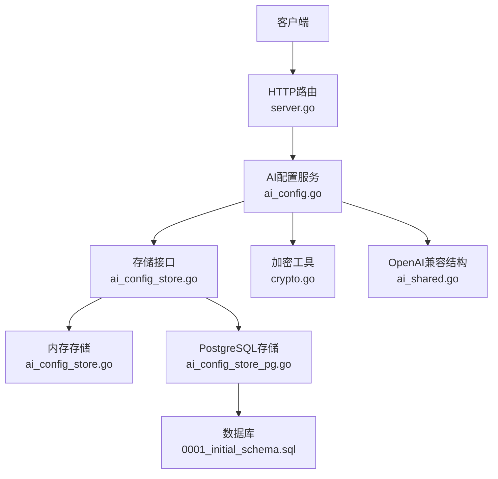
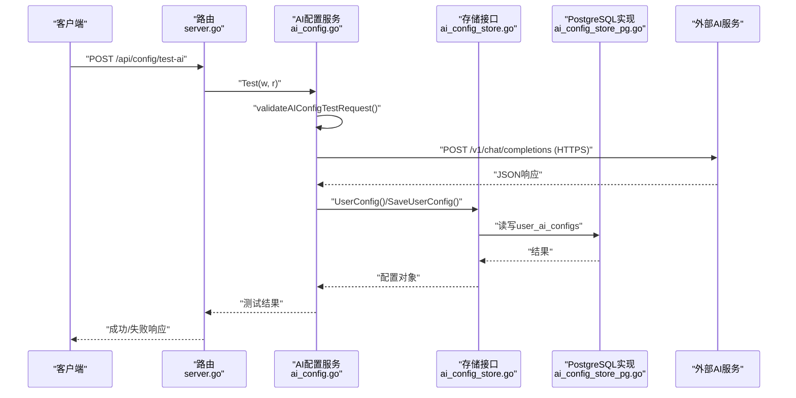
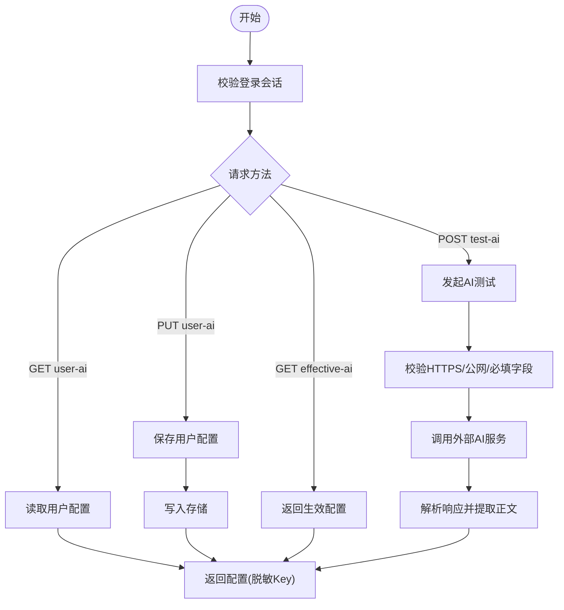
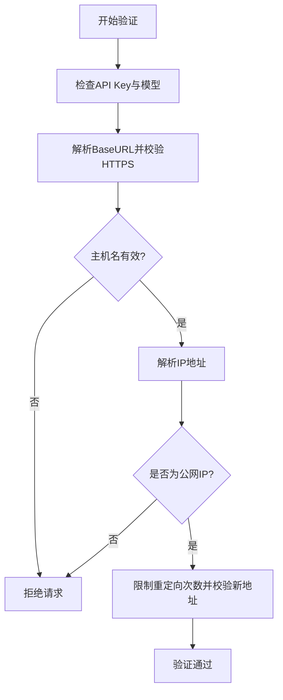
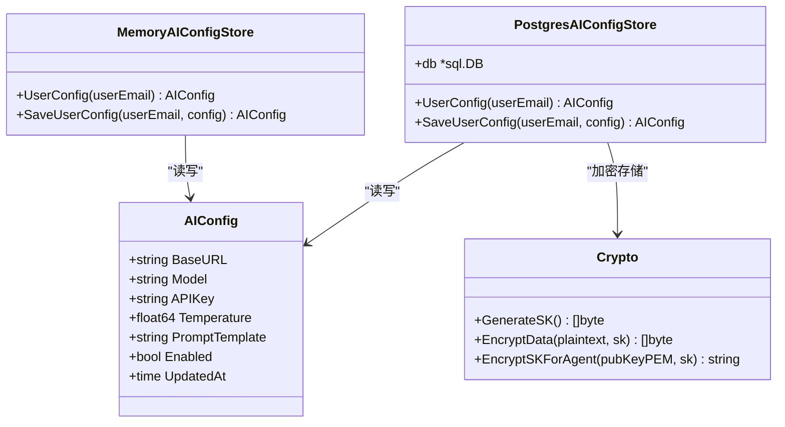
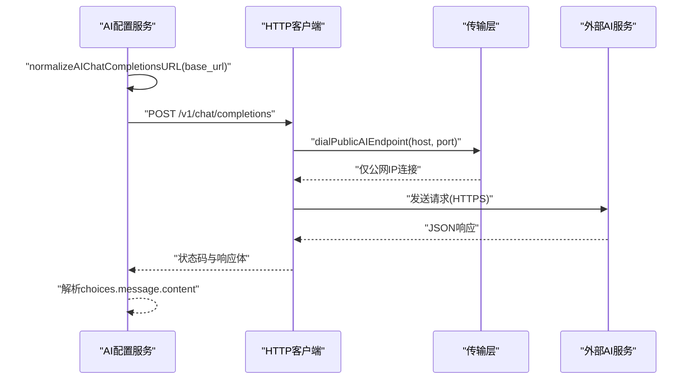
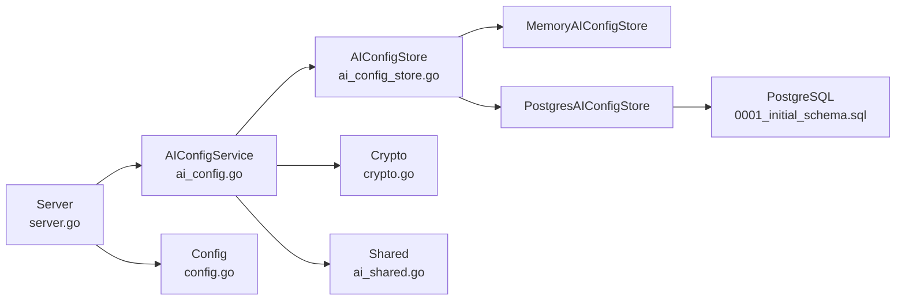

# AI配置管理

<cite>
**本文引用的文件**
- [ai_config.go](file://goodhr5/cloud/backend/internal/httpapi/ai_config.go)
- [ai_config_store.go](file://goodhr5/cloud/backend/internal/httpapi/ai_config_store.go)
- [ai_config_store_pg.go](file://goodhr5/cloud/backend/internal/httpapi/ai_config_store_pg.go)
- [ai_shared.go](file://goodhr5/cloud/backend/internal/httpapi/ai_shared.go)
- [crypto.go](file://goodhr5/cloud/backend/internal/httpapi/crypto.go)
- [server.go](file://goodhr5/cloud/backend/internal/httpapi/server.go)
- [config.go](file://goodhr5/cloud/backend/internal/httpapi/config.go)
- [0001_initial_schema.sql](file://goodhr5/cloud/backend/db/migrations/0001_initial_schema.sql)
- [ai_config_test.go](file://goodhr5/cloud/backend/internal/httpapi/ai_config_test.go)
</cite>

## 目录
1. [简介](#简介)
2. [项目结构](#项目结构)
3. [核心组件](#核心组件)
4. [架构总览](#架构总览)
5. [详细组件分析](#详细组件分析)
6. [依赖关系分析](#依赖关系分析)
7. [性能与可用性](#性能与可用性)
8. [故障排查指南](#故障排查指南)
9. [结论](#结论)
10. [附录：配置示例与安全最佳实践](#附录配置示例与安全最佳实践)

## 简介
本系统提供用户自定义AI配置的完整管理能力，包括读取、更新、最终生效配置查询以及在线测试能力。系统支持OpenAI兼容接口调用，强制HTTPS公网访问，内置内网IP拦截与重定向校验，确保AI服务连接安全可控。API Key在数据库中加密存储，对外返回时默认脱敏；本地程序可通过特定参数获取明文Key用于调试。同时提供统一的超时控制、错误信息裁剪与日志脱敏，便于定位问题并降低敏感信息泄露风险。

## 项目结构
AI配置相关能力集中在后端HTTP API层，围绕以下文件组织：
- HTTP服务路由注册与装配：[server.go](file://goodhr5/cloud/backend/internal/httpapi/server.go)
- 配置加载与存储实现选择：[config.go](file://goodhr5/cloud/backend/internal/httpapi/config.go)
- AI配置服务（CRUD与测试）：[ai_config.go](file://goodhr5/cloud/backend/internal/httpapi/ai_config.go)
- 数据模型与内存存储：[ai_config_store.go](file://goodhr5/cloud/backend/internal/httpapi/ai_config_store.go)
- PostgreSQL持久化实现：[ai_config_store_pg.go](file://goodhr5/cloud/backend/internal/httpapi/ai_config_store_pg.go)
- OpenAI兼容数据结构与文本清洗工具：[ai_shared.go](file://goodhr5/cloud/backend/internal/httpapi/ai_shared.go)
- 加密工具（AES-GCM、ECDH封装等）：[crypto.go](file://goodhr5/cloud/backend/internal/httpapi/crypto.go)
- 数据库表结构定义：[0001_initial_schema.sql](file://goodhr5/cloud/backend/db/migrations/0001_initial_schema.sql)
- 单元测试覆盖关键行为：[ai_config_test.go](file://goodhr5/cloud/backend/internal/httpapi/ai_config_test.go)

**图表来源**
- [server.go:123-144](file://goodhr5/cloud/backend/internal/httpapi/server.go#L123-L144)
- [ai_config.go:22-45](file://goodhr5/cloud/backend/internal/httpapi/ai_config.go#L22-L45)
- [ai_config_store.go:9-24](file://goodhr5/cloud/backend/internal/httpapi/ai_config_store.go#L9-L24)
- [ai_config_store_pg.go:11-19](file://goodhr5/cloud/backend/internal/httpapi/ai_config_store_pg.go#L11-L19)
- [crypto.go:28-51](file://goodhr5/cloud/backend/internal/httpapi/crypto.go#L28-L51)
- [ai_shared.go:9-36](file://goodhr5/cloud/backend/internal/httpapi/ai_shared.go#L9-L36)
- [0001_initial_schema.sql:70-85](file://goodhr5/cloud/backend/db/migrations/0001_initial_schema.sql#L70-L85)

**章节来源**
- [server.go:123-144](file://goodhr5/cloud/backend/internal/httpapi/server.go#L123-L144)
- [config.go:119-125](file://goodhr5/cloud/backend/internal/httpapi/config.go#L119-L125)

## 核心组件
- AI配置服务：提供用户配置读取、保存、最终生效配置查询与在线测试能力，统一超时控制与响应处理。
- 存储抽象：通过接口隔离内存与PostgreSQL实现，便于开发与生产切换。
- 加密工具：使用AES-GCM进行数据加密，结合ECDH封装密钥，保障API Key等敏感数据安全。
- OpenAI兼容结构：定义请求/响应结构与消息格式，便于对接各类兼容服务。
- 路由装配：集中注册AI配置相关API路径，统一接入认证与CORS中间件。

**章节来源**
- [ai_config.go:22-45](file://goodhr5/cloud/backend/internal/httpapi/ai_config.go#L22-L45)
- [ai_config_store.go:9-24](file://goodhr5/cloud/backend/internal/httpapi/ai_config_store.go#L9-L24)
- [crypto.go:28-51](file://goodhr5/cloud/backend/internal/httpapi/crypto.go#L28-L51)
- [ai_shared.go:9-36](file://goodhr5/cloud/backend/internal/httpapi/ai_shared.go#L9-L36)
- [server.go:141-144](file://goodhr5/cloud/backend/internal/httpapi/server.go#L141-L144)

## 架构总览
AI配置管理的整体流程如下：
- 客户端通过HTTP路由访问AI配置服务。
- 服务层解析会话、校验请求、执行业务逻辑（读取/保存/测试）。
- 存储层根据运行环境选择内存或PostgreSQL实现。
- 测试流程对目标AI服务发起HTTPS请求，限制仅公网地址，防止内网探测与重定向攻击。
- 响应内容按OpenAI兼容格式解析，提取正文并返回给前端。

**图表来源**
- [server.go:141-144](file://goodhr5/cloud/backend/internal/httpapi/server.go#L141-L144)
- [ai_config.go:47-82](file://goodhr5/cloud/backend/internal/httpapi/ai_config.go#L47-L82)
- [ai_config_store_pg.go:21-52](file://goodhr5/cloud/backend/internal/httpapi/ai_config_store_pg.go#L21-L52)
- [0001_initial_schema.sql:70-85](file://goodhr5/cloud/backend/db/migrations/0001_initial_schema.sql#L70-L85)

## 详细组件分析

### AI配置服务（CRUD与测试）
- 读取用户配置：GET /api/config/user-ai，返回当前登录用户的AI配置，包含是否设置Key的标记与脱敏Key。
- 更新用户配置：PUT /api/config/user-ai，保存用户配置；若未传Key则保留旧值。
- 最终生效配置：GET /api/config/effective-ai，返回当前用户实际生效的配置；支持可选参数以允许本地程序获取明文Key。
- 在线测试：POST /api/config/test-ai，向用户填写的BaseURL发送最小化聊天请求，验证连通性与响应有效性。

**图表来源**
- [ai_config.go:265-340](file://goodhr5/cloud/backend/internal/httpapi/ai_config.go#L265-L340)
- [ai_config.go:342-383](file://goodhr5/cloud/backend/internal/httpapi/ai_config.go#L342-L383)
- [ai_config.go:47-82](file://goodhr5/cloud/backend/internal/httpapi/ai_config.go#L47-L82)
- [ai_config.go:150-169](file://goodhr5/cloud/backend/internal/httpapi/ai_config.go#L150-L169)

**章节来源**
- [ai_config.go:265-340](file://goodhr5/cloud/backend/internal/httpapi/ai_config.go#L265-L340)
- [ai_config.go:342-383](file://goodhr5/cloud/backend/internal/httpapi/ai_config.go#L342-L383)
- [ai_config.go:47-82](file://goodhr5/cloud/backend/internal/httpapi/ai_config.go#L47-L82)

### 配置验证机制
- 必填字段校验：API Key与模型名称必须非空。
- HTTPS强制：BaseURL必须为HTTPS且主机名有效。
- 公网IP白名单：解析域名后仅允许公网IP，拒绝内网、回环、链路本地、组播与未指定地址。
- 本机地址拒绝：明确禁止localhost。
- 重定向防护：HTTP客户端限制重定向次数并在每次重定向时重新校验目标地址。

**图表来源**
- [ai_config.go:150-169](file://goodhr5/cloud/backend/internal/httpapi/ai_config.go#L150-L169)
- [ai_config.go:171-188](file://goodhr5/cloud/backend/internal/httpapi/ai_config.go#L171-L188)
- [ai_config.go:190-224](file://goodhr5/cloud/backend/internal/httpapi/ai_config.go#L190-L224)

**章节来源**
- [ai_config.go:150-169](file://goodhr5/cloud/backend/internal/httpapi/ai_config.go#L150-L169)
- [ai_config.go:171-188](file://goodhr5/cloud/backend/internal/httpapi/ai_config.go#L171-L188)
- [ai_config.go:190-224](file://goodhr5/cloud/backend/internal/httpapi/ai_config.go#L190-L224)

### 安全存储策略
- 数据库加密存储：API Key以加密形式保存在user_ai_configs表的对应字段中。
- 加密算法：使用AES-GCM生成随机nonce并密封密文，便于单字段存储。
- 密钥封装：通过ECDH与HKDF派生包装密钥，将数据密钥用接收方公钥封装，增强传输与存储安全性。
- 对外脱敏：普通读取接口返回脱敏后的Key，避免完整密钥进入前端。
- 明文暴露控制：仅在本地程序通过特定查询参数时返回明文Key，减少泄露面。

**图表来源**
- [ai_config_store.go:9-65](file://goodhr5/cloud/backend/internal/httpapi/ai_config_store.go#L9-L65)
- [ai_config_store_pg.go:11-115](file://goodhr5/cloud/backend/internal/httpapi/ai_config_store_pg.go#L11-L115)
- [crypto.go:28-114](file://goodhr5/cloud/backend/internal/httpapi/crypto.go#L28-L114)
- [0001_initial_schema.sql:70-85](file://goodhr5/cloud/backend/db/migrations/0001_initial_schema.sql#L70-L85)

**章节来源**
- [ai_config_store_pg.go:21-52](file://goodhr5/cloud/backend/internal/httpapi/ai_config_store_pg.go#L21-L52)
- [ai_config_store_pg.go:54-115](file://goodhr5/cloud/backend/internal/httpapi/ai_config_store_pg.go#L54-L115)
- [crypto.go:28-114](file://goodhr5/cloud/backend/internal/httpapi/crypto.go#L28-L114)
- [ai_config.go:375-397](file://goodhr5/cloud/backend/internal/httpapi/ai_config.go#L375-L397)

### OpenAI兼容接口支持与HTTPS安全验证
- 兼容接口：统一使用chat/completions端点，自动补全BaseURL至标准路径。
- HTTPS强制：仅接受HTTPS协议，拒绝HTTP。
- 公网IP白名单：解析域名后仅连接公网IP，拒绝内网与特殊用途地址。
- 重定向防护：限制重定向次数并逐跳校验目标地址合法性。
- 超时控制：统一180秒超时，避免长时间阻塞。

**图表来源**
- [ai_config.go:126-139](file://goodhr5/cloud/backend/internal/httpapi/ai_config.go#L126-L139)
- [ai_config.go:171-188](file://goodhr5/cloud/backend/internal/httpapi/ai_config.go#L171-L188)
- [ai_config.go:190-224](file://goodhr5/cloud/backend/internal/httpapi/ai_config.go#L190-L224)
- [ai_config.go:226-251](file://goodhr5/cloud/backend/internal/httpapi/ai_config.go#L226-L251)

**章节来源**
- [ai_config.go:126-139](file://goodhr5/cloud/backend/internal/httpapi/ai_config.go#L126-L139)
- [ai_config.go:150-169](file://goodhr5/cloud/backend/internal/httpapi/ai_config.go#L150-L169)
- [ai_config.go:171-188](file://goodhr5/cloud/backend/internal/httpapi/ai_config.go#L171-L188)
- [ai_config.go:190-224](file://goodhr5/cloud/backend/internal/httpapi/ai_config.go#L190-L224)
- [ai_config.go:226-251](file://goodhr5/cloud/backend/internal/httpapi/ai_config.go#L226-L251)

### 配置优先级规则
- 用户配置优先：最终生效配置来源于当前登录用户的个人配置，不再使用系统默认兜底。
- 明文Key控制：普通读取不返回明文Key；本地程序可通过查询参数获取明文Key用于调试。
- 未传Key保留旧值：更新配置时若未传入Key，则保留已有Key，避免误清空。

**章节来源**
- [ai_config.go:342-383](file://goodhr5/cloud/backend/internal/httpapi/ai_config.go#L342-L383)
- [ai_config.go:303-340](file://goodhr5/cloud/backend/internal/httpapi/ai_config.go#L303-L340)
- [ai_config_test.go:40-136](file://goodhr5/cloud/backend/internal/httpapi/ai_config_test.go#L40-L136)

### 配置测试功能
- 最小化请求：发送简短消息以验证连通性与响应有效性。
- 超时控制：统一180秒超时，避免长时间等待。
- 响应解析：从OpenAI兼容响应中提取助手正文，忽略多余字段。
- 错误裁剪：对外返回的错误信息经过裁剪，避免过长内容泄露。

**章节来源**
- [ai_config.go:47-82](file://goodhr5/cloud/backend/internal/httpapi/ai_config.go#L47-L82)
- [ai_config.go:84-124](file://goodhr5/cloud/backend/internal/httpapi/ai_config.go#L84-L124)
- [ai_config.go:253-263](file://goodhr5/cloud/backend/internal/httpapi/ai_config.go#L253-L263)
- [ai_config_test.go:152-189](file://goodhr5/cloud/backend/internal/httpapi/ai_config_test.go#L152-L189)

## 依赖关系分析
- 路由与服务装配：服务器启动时创建各服务实例并注入依赖，AI配置服务依赖认证服务与存储接口。
- 存储实现选择：根据环境变量配置选择内存或PostgreSQL实现。
- 加密工具依赖：存储层使用加密工具对敏感数据进行加密存储。
- 测试覆盖：单元测试验证超时一致性、匿名用户拒绝、BaseURL规范化等行为。

**图表来源**
- [server.go:46-121](file://goodhr5/cloud/backend/internal/httpapi/server.go#L46-L121)
- [config.go:119-125](file://goodhr5/cloud/backend/internal/httpapi/config.go#L119-L125)
- [ai_config_store.go:9-65](file://goodhr5/cloud/backend/internal/httpapi/ai_config_store.go#L9-L65)
- [ai_config_store_pg.go:11-115](file://goodhr5/cloud/backend/internal/httpapi/ai_config_store_pg.go#L11-L115)
- [crypto.go:28-114](file://goodhr5/cloud/backend/internal/httpapi/crypto.go#L28-L114)
- [ai_shared.go:9-92](file://goodhr5/cloud/backend/internal/httpapi/ai_shared.go#L9-L92)

**章节来源**
- [server.go:46-121](file://goodhr5/cloud/backend/internal/httpapi/server.go#L46-L121)
- [config.go:119-125](file://goodhr5/cloud/backend/internal/httpapi/config.go#L119-L125)
- [ai_config_test.go:17-33](file://goodhr5/cloud/backend/internal/httpapi/ai_config_test.go#L17-L33)

## 性能与可用性
- 统一超时：所有AI相关HTTP请求统一180秒超时，避免资源长期占用。
- 连接限制：仅连接公网IP，减少无效连接尝试。
- 响应体限制：读取外部响应时限制最大长度，避免内存溢出。
- 错误信息裁剪：对外错误信息限制长度，降低带宽与日志噪音。
- 数据库超时：存储操作设置合理超时，避免阻塞主流程。

**章节来源**
- [ai_config.go:19-20](file://goodhr5/cloud/backend/internal/httpapi/ai_config.go#L19-L20)
- [ai_config.go:112-118](file://goodhr5/cloud/backend/internal/httpapi/ai_config.go#L112-L118)
- [ai_config.go:253-263](file://goodhr5/cloud/backend/internal/httpapi/ai_config.go#L253-L263)
- [ai_config_store_pg.go:21-24](file://goodhr5/cloud/backend/internal/httpapi/ai_config_store_pg.go#L21-L24)
- [ai_config_store_pg.go:54-57](file://goodhr5/cloud/backend/internal/httpapi/ai_config_store_pg.go#L54-L57)

## 故障排查指南
- 匿名用户访问被拒：确认请求携带有效会话令牌。
- BaseURL非法：确保为HTTPS且主机名有效，避免使用localhost或内网IP。
- 连接失败：检查网络连通性、DNS解析与防火墙策略，确认目标为公网HTTPS服务。
- 响应无内容：检查模型名称是否正确，确认外部服务返回符合OpenAI兼容格式。
- 重定向过多：检查目标服务重定向链，避免循环或跳转至不安全地址。
- 明文Key泄露：确认仅本地程序通过特定参数获取明文Key，其他场景均返回脱敏Key。

**章节来源**
- [ai_config_test.go:138-150](file://goodhr5/cloud/backend/internal/httpapi/ai_config_test.go#L138-L150)
- [ai_config_test.go:215-225](file://goodhr5/cloud/backend/internal/httpapi/ai_config_test.go#L215-L225)
- [ai_config.go:150-169](file://goodhr5/cloud/backend/internal/httpapi/ai_config.go#L150-L169)
- [ai_config.go:171-188](file://goodhr5/cloud/backend/internal/httpapi/ai_config.go#L171-L188)
- [ai_config.go:226-251](file://goodhr5/cloud/backend/internal/httpapi/ai_config.go#L226-L251)

## 结论
AI配置管理系统提供了安全、可控且可扩展的用户自定义AI配置能力。通过严格的HTTPS与公网IP白名单机制、统一的超时与错误处理、以及加密存储与脱敏返回策略，系统在保障安全性的同时兼顾了易用性与可维护性。开发者可基于现有接口快速集成各类OpenAI兼容服务，并通过测试功能快速验证配置有效性。

## 附录：配置示例与安全最佳实践
- 配置字段说明：
  - base_url：OpenAI兼容接口的BaseURL，必须为HTTPS。
  - model：模型名称，需与外部服务一致。
  - api_key：API Key，数据库加密存储，对外脱敏。
  - temperature：温度参数，影响输出随机性。
  - prompt_template：提示词模板，用于岗位运行等场景。
  - enabled：是否启用该配置。
- 安全最佳实践：
  - 始终使用HTTPS与公网地址，避免内网与localhost。
  - 定期轮换API Key，并限制最小权限。
  - 仅本地程序通过特定参数获取明文Key，其他场景一律脱敏。
  - 监控AI服务响应时间与错误率，及时告警异常。
  - 使用最小化请求进行测试，避免过度消耗配额。

**章节来源**
- [ai_config.go:29-36](file://goodhr5/cloud/backend/internal/httpapi/ai_config.go#L29-L36)
- [ai_config.go:375-397](file://goodhr5/cloud/backend/internal/httpapi/ai_config.go#L375-L397)
- [ai_config.go:436-460](file://goodhr5/cloud/backend/internal/httpapi/ai_config.go#L436-L460)
- [0001_initial_schema.sql:70-85](file://goodhr5/cloud/backend/db/migrations/0001_initial_schema.sql#L70-L85)