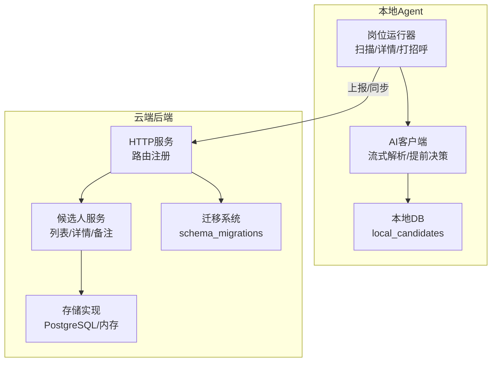
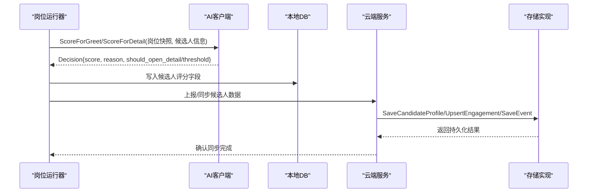
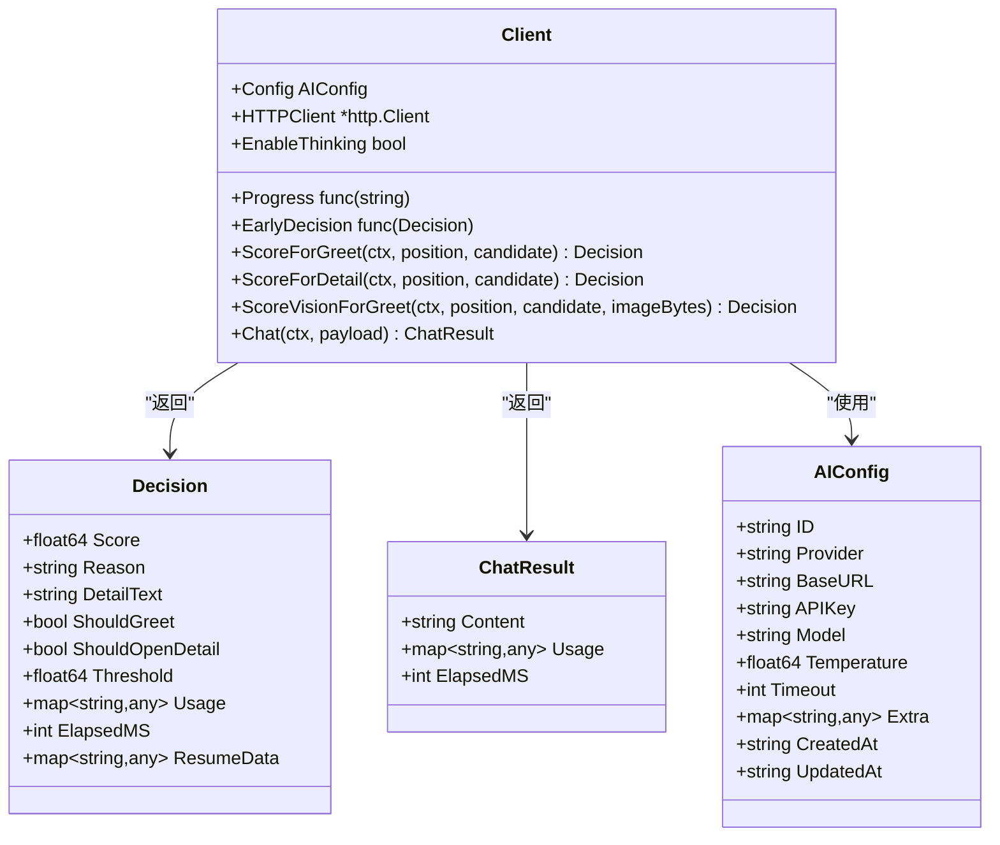
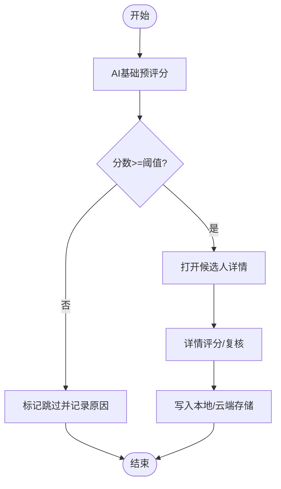
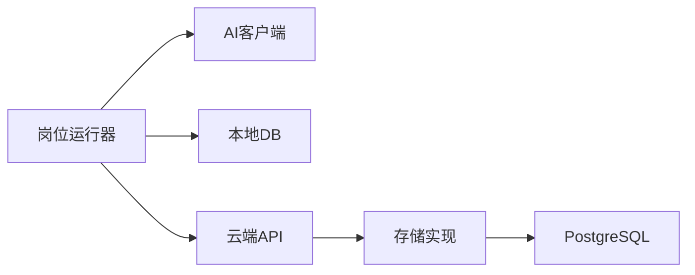

# 评分结果处理

<cite>
**本文引用的文件**
- [client.go](file://goodhr5/local-agent-go/internal/localai/client.go)
- [scan.go](file://goodhr5/local-agent-go/internal/positionrunner/scan.go)
- [pipeline.go](file://goodhr5/local-agent-go/internal/positionrunner/pipeline.go)
- [flow.go](file://goodhr5/local-agent-go/internal/flow/greeting/flow.go)
- [0016_task_candidates.sql](file://goodhr5/cloud/backend/db/migrations/0016_task_candidates.sql)
- [0028_candidate_profile_engagement_events.sql](file://goodhr5/cloud/backend/db/migrations/0028_candidate_profile_engagement_events.sql)
- [candidate_store_pg.go](file://goodhr5/cloud/backend/internal/httpapi/candidate_store_pg.go)
- [candidate_store.go](file://goodhr5/cloud/backend/internal/httpapi/candidate_store.go)
- [candidate.go](file://goodhr5/cloud/backend/internal/httpapi/candidate.go)
- [candidate_service.go](file://goodhr5/cloud/backend/internal/httpapi/candidate_service.go)
- [server.go](file://goodhr5/cloud/backend/internal/httpapi/server.go)
- [auto_migrate.go](file://goodhr5/cloud/backend/internal/httpapi/auto_migrate.go)
- [ai_types.go](file://goodhr5/local-agent-go/internal/localdb/ai_types.go)
</cite>

## 目录
1. [简介](#简介)
2. [项目结构](#项目结构)
3. [核心组件](#核心组件)
4. [架构总览](#架构总览)
5. [详细组件分析](#详细组件分析)
6. [依赖关系分析](#依赖关系分析)
7. [性能考量](#性能考量)
8. [故障排查指南](#故障排查指南)
9. [结论](#结论)
10. [附录](#附录)

## 简介
本文件面向“AI 评分结果处理系统”，聚焦候选人数据模型、评分数据结构、解析与标准化、存储机制、缓存策略、验证规则、错误处理、数据同步逻辑，以及结果展示格式、API 响应结构与数据迁移方案。目标是帮助开发者理解并管理 AI 评分数据的完整生命周期：从本地 Agent 调用 AI 得到评分，到云端持久化、查询与展示。

## 项目结构
系统由两部分组成：
- 本地 Agent（local-agent-go / local-agent-go）：负责抓取候选人信息、调用 AI 进行打分、流式解析评分、将结果写入本地数据库或上报云端。
- 云端后端（cloud/backend）：提供候选人三表模型（主体、触达上下文、事件流水）的持久化与 API 暴露，支持自动迁移与团队隔离的数据访问。

**图表来源**
- [pipeline.go:49-80](file://goodhr5/local-agent-go/internal/positionrunner/pipeline.go#L49-L80)
- [client.go:164-256](file://goodhr5/local-agent-go/internal/localai/client.go#L164-L256)
- [server.go:184-192](file://goodhr5/cloud/backend/internal/httpapi/server.go#L184-L192)
- [candidate_service.go:29-146](file://goodhr5/cloud/backend/internal/httpapi/candidate_service.go#L29-L146)
- [auto_migrate.go:13-55](file://goodhr5/cloud/backend/internal/httpapi/auto_migrate.go#L13-L55)

**章节来源**
- [pipeline.go:49-80](file://goodhr5/local-agent-go/internal/positionrunner/pipeline.go#L49-L80)
- [server.go:184-192](file://goodhr5/cloud/backend/internal/httpapi/server.go#L184-L192)

## 核心组件
- AI 评分客户端：封装 OpenAI 兼容接口调用、SSE 流式读取、提前提取评分 JSON、阈值判定、重试与退避、错误分类。
- 岗位运行器：组织候选人扫描、预评分、打开详情、复核等流程，并将评分结果写入候选对象。
- 云端候选人服务：提供简历库候选人列表与详情 API，基于团队隔离与权限控制。
- 存储层：PostgreSQL 三表模型（候选人主体、触达上下文、事件流水），并提供内存实现用于开发测试。
- 迁移系统：启动时自动执行 SQL 迁移，记录已应用版本，避免重复覆盖。

**章节来源**
- [client.go:23-100](file://goodhr5/local-agent-go/internal/localai/client.go#L23-L100)
- [pipeline.go:49-80](file://goodhr5/local-agent-go/internal/positionrunner/pipeline.go#L49-L80)
- [candidate_service.go:29-146](file://goodhr5/cloud/backend/internal/httpapi/candidate_service.go#L29-L146)
- [candidate_store_pg.go:139-167](file://goodhr5/cloud/backend/internal/httpapi/candidate_store_pg.go#L139-L167)
- [auto_migrate.go:13-55](file://goodhr5/cloud/backend/internal/httpapi/auto_migrate.go#L13-L55)

## 架构总览
评分结果处理的关键路径如下：
- 本地 Agent 在扫描阶段对候选人进行基础预评分；若通过阈值则打开详情进行更精细评估。
- AI 客户端以流式方式接收响应，并在流中尽早提取评分 JSON，触发提前决策回调。
- 评分结果包含分数、原因、是否打招呼/打开详情、阈值、Token 用量、耗时等。
- 云端通过三表模型持久化：候选人主体仅保存简历字段；触达上下文记录一次任务/岗位/账号下的沟通过程；事件流水记录每次 AI 分析与交互。
- API 暴露候选人列表与详情，前端可展示评分结果与时间线。

**图表来源**
- [pipeline.go:49-80](file://goodhr5/local-agent-go/internal/positionrunner/pipeline.go#L49-L80)
- [client.go:164-256](file://goodhr5/local-agent-go/internal/localai/client.go#L164-L256)
- [candidate_store_pg.go:139-167](file://goodhr5/cloud/backend/internal/httpapi/candidate_store_pg.go#L139-L167)

## 详细组件分析

### AI 评分客户端（解析、标准化、缓存友好消息）
- 评分入口：
  - 打招呼评分：ScoreForGreet，根据岗位配置计算阈值，构建消息并调用聊天接口，解析 JSON 得到 score/reason，结合阈值判断是否打招呼。
  - 详情评分：ScoreForDetail，类似流程但用于决定是否打开详情。
  - 视觉评分：ScoreVisionForGreet，支持长图识别与结构化简历输出，解析 resume_data 以便入库。
- 流式解析与提前决策：
  - readChatStream 读取 SSE 分片，累积文本，尝试从中提取完整 JSON 对象，找到 score/reason 后触发 EarlyDecision 回调。
  - withDecisionThreshold 为提前决策补充阈值与动作判断（ShouldGreet/ShouldOpenDetail）。
- 标准化与校验：
  - clampScore 限制分数范围，truncate(reason, 30) 限制原因长度，缺失原因回退默认文案。
- 缓存友好消息：
  - buildGreetMessages/buildDetailMessages 将稳定规则（system prompt）与本次变量（岗位要求、候选人信息）分离，提升提示词稳定性与可缓存性。
- 错误处理与重试：
  - Chat 方法内置最多 3 次重试，依据 ServiceError 的 Retryable/Fatal 标志与 Retry-After 头进行退避等待。
  - newHTTPServiceError 根据状态码与响应体关键词判断是否致命错误（如余额不足、未授权、模型不存在等）。

**图表来源**
- [client.go:33-62](file://goodhr5/local-agent-go/internal/localai/client.go#L33-L62)
- [client.go:164-256](file://goodhr5/local-agent-go/internal/localai/client.go#L164-L256)
- [ai_types.go:4-16](file://goodhr5/local-agent-go/internal/localdb/ai_types.go#L4-L16)

**章节来源**
- [client.go:164-256](file://goodhr5/local-agent-go/internal/localai/client.go#L164-L256)
- [client.go:258-326](file://goodhr5/local-agent-go/internal/localai/client.go#L258-L326)
- [client.go:328-403](file://goodhr5/local-agent-go/internal/localai/client.go#L328-L403)
- [client.go:470-554](file://goodhr5/local-agent-go/internal/localai/client.go#L470-L554)
- [client.go:689-722](file://goodhr5/local-agent-go/internal/localai/client.go#L689-L722)

### 岗位运行器（评分流程、结果落库、阈值决策）
- 预评分与详情打开：
  - startCandidateDetailWorkers 启动并发工作池，对候选人队列进行“AI基础预评分”，根据 decision.ShouldOpenDetail 决定是否进入详情阶段。
  - scan.go 中将预评分结果写入候选人 map（ai_detail_score、ai_detail_reason、ai_detail_threshold、ai_detail_usage、ai_detail_elapsed_ms），若低于阈值直接跳过并记录原因。
- 结果聚合与日志：
  - 每个操作包裹超时与日志记录，便于追踪耗时与失败原因。
- 新流程中的异步收尾：
  - flow.go 中在 defer 中调用 finishCandidateEvaluationAsync，确保评估状态与结果最终落库。

**图表来源**
- [pipeline.go:49-80](file://goodhr5/local-agent-go/internal/positionrunner/pipeline.go#L49-L80)
- [scan.go:285-303](file://goodhr5/local-agent-go/internal/positionrunner/scan.go#L285-L303)
- [flow.go:432-477](file://goodhr5/local-agent-go/internal/flow/greeting/flow.go#L432-L477)

**章节来源**
- [pipeline.go:49-80](file://goodhr5/local-agent-go/internal/positionrunner/pipeline.go#L49-L80)
- [scan.go:285-303](file://goodhr5/local-agent-go/internal/positionrunner/scan.go#L285-L303)
- [flow.go:432-477](file://goodhr5/local-agent-go/internal/flow/greeting/flow.go#L432-L477)

### 云端候选人数据模型与存储
- 历史模型（task_candidates）：
  - 保存候选人结构化信息与 AI 评分结果（detail/greet/review 三阶段分数与原因），用于任务留痕与后续日志/复核。
- 新模型（三表重构）：
  - candidate_profiles：候选人主体，仅保存简历字段，不保存岗位/账号/AI 分析结果。
  - candidate_engagements：触达上下文，表示某任务/岗位/账号下对候选人的一次沟通过程，含状态与关键时间点。
  - candidate_events：事件流水，记录 AI 分析、打招呼、聊天、邀约等历史记录，包含 score/reason/input/output/message/model/token_usage/metadata。
- 存储实现：
  - PostgresCandidateStore：提供 SaveCandidateProfile、UpsertCandidateEngagement、SaveCandidateEvent 等方法，带超时与事务控制。
  - MemoryCandidateStore：内存实现，用于开发与测试。

```mermaid
erDiagram
CANDIDATE_PROFILES {
uuid id PK
uuid tenant_id FK
text source_platform_id
text source_platform_candidate_id
text candidate_name
text birth_ym
text phone
text email
text work_region
text work_years
int expected_salary_min
int expected_salary_max
text personal_description
text work_status
text expected_position
text online_status
text education_level
text basic_info
text raw_text
text filter_text
jsonb work_experiences
jsonb educations
jsonb certificates
jsonb honors
jsonb project_experiences
jsonb colleague_communications
text resume_attachment_url
text resume_attachment_extracted_text
jsonb ext
timestamptz first_seen_at
timestamptz created_at
timestamptz updated_at
}
CANDIDATE_ENGAGEMENTS {
uuid id PK
uuid tenant_id FK
uuid candidate_id FK
uuid task_id FK
uuid position_id FK
uuid platform_account_id FK
text platform_id
text status
timestamptz first_seen_at
timestamptz detail_fetched_at
timestamptz greeted_at
timestamptz last_event_at
timestamptz created_at
timestamptz updated_at
}
CANDIDATE_EVENTS {
uuid id PK
uuid tenant_id FK
uuid candidate_id FK
uuid engagement_id FK
uuid task_id FK
uuid position_id FK
uuid platform_account_id FK
text platform_id
text event_type
numeric score
text reason
text input_text
text output_text
text message_text
text model
int token_usage
jsonb metadata
timestamptz created_at
}
CANDIDATE_PROFILES ||--o{ CANDIDATE_ENGAGEMENTS : "被触达"
CANDIDATE_ENGAGEMENTS ||--o{ CANDIDATE_EVENTS : "产生事件"
```

**图表来源**
- [0028_candidate_profile_engagement_events.sql:6-169](file://goodhr5/cloud/backend/db/migrations/0028_candidate_profile_engagement_events.sql#L6-L169)

**章节来源**
- [0016_task_candidates.sql:1-96](file://goodhr5/cloud/backend/db/migrations/0016_task_candidates.sql#L1-L96)
- [0028_candidate_profile_engagement_events.sql:1-169](file://goodhr5/cloud/backend/db/migrations/0028_candidate_profile_engagement_events.sql#L1-L169)
- [candidate_store_pg.go:139-167](file://goodhr5/cloud/backend/internal/httpapi/candidate_store_pg.go#L139-L167)
- [candidate_store.go:167-274](file://goodhr5/cloud/backend/internal/httpapi/candidate_store.go#L167-L274)

### 结果验证规则与错误处理
- 评分值域与原因长度：
  - 分数通过 clampScore 限制在合理范围；原因截断至 30 字以内，缺失时回退默认文案。
- 阈值判定：
  - 打招呼评分阈值来自岗位 ai_config（greet_score_threshold/greet_threshold），详情评分阈值来自 open_detail_threshold/detail_threshold。
- 错误分类：
  - ServiceError 区分可重试与致命错误，依据 HTTP 状态码与响应体关键词（如余额不足、未授权、模型不存在）决定停止策略。
  - IsPositionStoppingError 用于岗位运行器判断是否需要终止整个流程。
- 重试与退避：
  - Chat 方法最多重试 3 次，sleepAIRequestRetry 根据 attempt 与 Retry-After 头计算退避时间。

**章节来源**
- [client.go:139-162](file://goodhr5/local-agent-go/internal/localai/client.go#L139-L162)
- [client.go:164-256](file://goodhr5/local-agent-go/internal/localai/client.go#L164-L256)
- [client.go:378-403](file://goodhr5/local-agent-go/internal/localai/client.go#L378-L403)
- [client.go:96-100](file://goodhr5/local-agent-go/internal/localai/client.go#L96-L100)

### 数据同步逻辑
- 本地 Agent 在扫描/详情/打招呼流程中生成候选人数据与评分结果，并通过云端 API 上报。
- 云端 CandidateService 提供列表与详情接口，按团队隔离与权限控制返回数据。
- 存储层将候选人主体、触达上下文与事件流水分别持久化，保证数据一致性与可追溯性。

**章节来源**
- [candidate_service.go:29-146](file://goodhr5/cloud/backend/internal/httpapi/candidate_service.go#L29-L146)
- [candidate_store_pg.go:139-167](file://goodhr5/cloud/backend/internal/httpapi/candidate_store_pg.go#L139-L167)

### 结果展示格式与 API 响应结构
- 统一候选人对象 Candidate：
  - 包含基本信息、附件、详情、AI 三阶段评分、运行时信息、时间戳与扩展字段。
- API 路由：
  - GET /api/candidates：列表（支持按 position_id 过滤）。
  - GET /api/candidates/{id}：详情（可选 engagement_id）。
  - GET/POST /api/candidates/{id}/notes：备注列表与新增。
- 响应结构：
  - 列表/详情返回 ok 与 candidate 字段，错误返回标准错误信息。

**章节来源**
- [candidate.go:126-143](file://goodhr5/cloud/backend/internal/httpapi/candidate.go#L126-L143)
- [server.go:184-192](file://goodhr5/cloud/backend/internal/httpapi/server.go#L184-L192)
- [candidate_service.go:29-146](file://goodhr5/cloud/backend/internal/httpapi/candidate_service.go#L29-L146)

### 数据迁移方案
- 自动迁移：
  - RunMigrations 扫描 db/migrations/*.sql（排除 .down.sql），按文件名排序依次执行，记录 schema_migrations 防止重复。
  - 检测已有数据库时标记当前迁移为已应用，避免覆盖系统配置。
- 本地迁移：
  - 新 Agent 的 Store 在事务内执行迁移脚本，记录 version 与 applied_at。

**章节来源**
- [auto_migrate.go:13-55](file://goodhr5/cloud/backend/internal/httpapi/auto_migrate.go#L13-L55)

## 依赖关系分析
- 本地 Agent 依赖 AI 客户端进行评分，依赖本地 DB 存储中间结果，依赖云端 API 上报。
- 云端后端依赖 PostgreSQL 存储实现与迁移系统，提供 REST API 供前端与管理端使用。
- 候选人三表模型解耦了主体、上下文与事件，降低耦合度并增强可追溯性。

**图表来源**
- [pipeline.go:49-80](file://goodhr5/local-agent-go/internal/positionrunner/pipeline.go#L49-L80)
- [candidate_store_pg.go:139-167](file://goodhr5/cloud/backend/internal/httpapi/candidate_store_pg.go#L139-L167)

**章节来源**
- [pipeline.go:49-80](file://goodhr5/local-agent-go/internal/positionrunner/pipeline.go#L49-L80)
- [candidate_store_pg.go:139-167](file://goodhr5/cloud/backend/internal/httpapi/candidate_store_pg.go#L139-L167)

## 性能考量
- 流式解析与提前决策：减少等待时间，尽快反馈评分结果，提升用户体验。
- 并发处理：startCandidateDetailWorkers 使用 workerCount 控制并发，提高吞吐量。
- 重试与退避：应对临时网络或服务波动，避免频繁失败影响整体流程。
- 存储优化：三表模型索引设计（tenant_id、created_at、event_type 等）提升查询效率。

[本节提供一般性指导，无需特定文件分析]

## 故障排查指南
- AI 服务错误：
  - 检查 ServiceError 的 StatusCode、Body、Retryable、Fatal 标志，定位是否为余额不足、未授权或模型不存在等问题。
  - 查看重试次数与退避时间，确认是否因限流导致失败。
- 评分解析失败：
  - 确认 AI 返回是否包含合法 JSON（支持 Markdown 包裹与 analysis 嵌套），检查 parseScoreJSON 与 TryExtractScoreDecisionFromStream 的行为。
- 存储异常：
  - 检查 PostgreSQL 连接与迁移是否成功，确认 schema_migrations 记录。
  - 核对三表模型的约束与索引，确保数据一致性。

**章节来源**
- [client.go:378-403](file://goodhr5/local-agent-go/internal/localai/client.go#L378-L403)
- [client.go:541-554](file://goodhr5/local-agent-go/internal/localai/client.go#L541-L554)
- [auto_migrate.go:13-55](file://goodhr5/cloud/backend/internal/httpapi/auto_migrate.go#L13-L55)

## 结论
本系统通过本地 Agent 与云端后端的协作，实现了 AI 评分结果的解析、标准化、存储与展示。采用三表模型解耦候选人主体、触达上下文与事件流水，提升了数据一致性与可追溯性。流式解析与提前决策优化了用户体验，重试与错误分类增强了鲁棒性。开发者可基于此文档理解评分数据的完整生命周期，并进行扩展与维护。

[本节总结性内容，无需特定文件分析]

## 附录
- 关键数据结构路径参考：
  - 候选人统一对象：[candidate.go:126-143](file://goodhr5/cloud/backend/internal/httpapi/candidate.go#L126-L143)
  - AI 评分决策：[client.go:42-55](file://goodhr5/local-agent-go/internal/localai/client.go#L42-L55)
  - 三表模型定义：[0028_candidate_profile_engagement_events.sql:6-169](file://goodhr5/cloud/backend/db/migrations/0028_candidate_profile_engagement_events.sql#L6-L169)
  - 存储实现接口：[candidate_store_pg.go:139-167](file://goodhr5/cloud/backend/internal/httpapi/candidate_store_pg.go#L139-L167)

[本节为附加参考，无需特定文件分析]