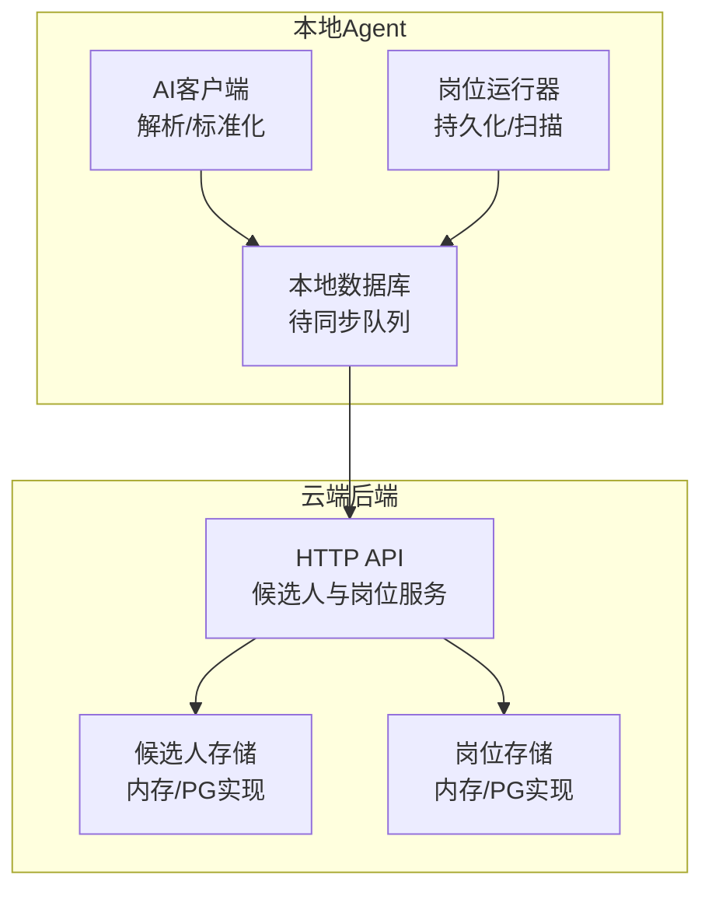
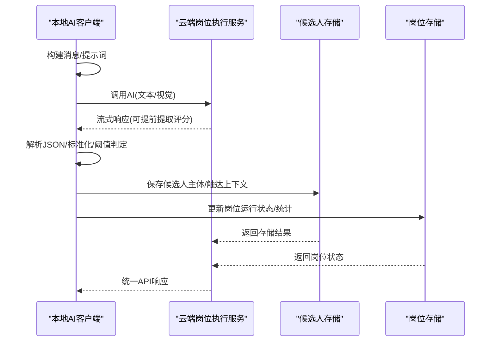
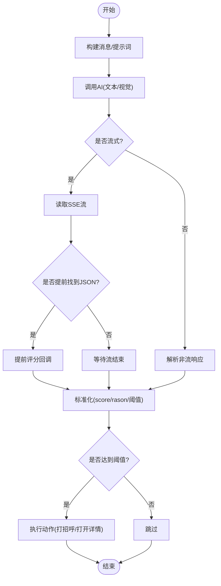
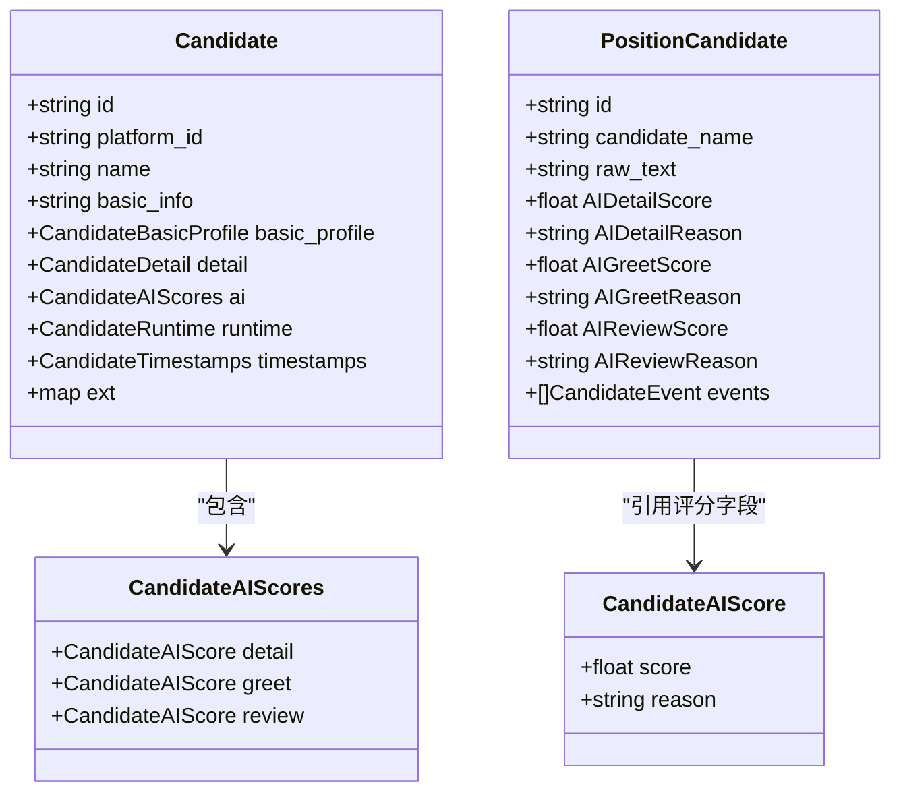
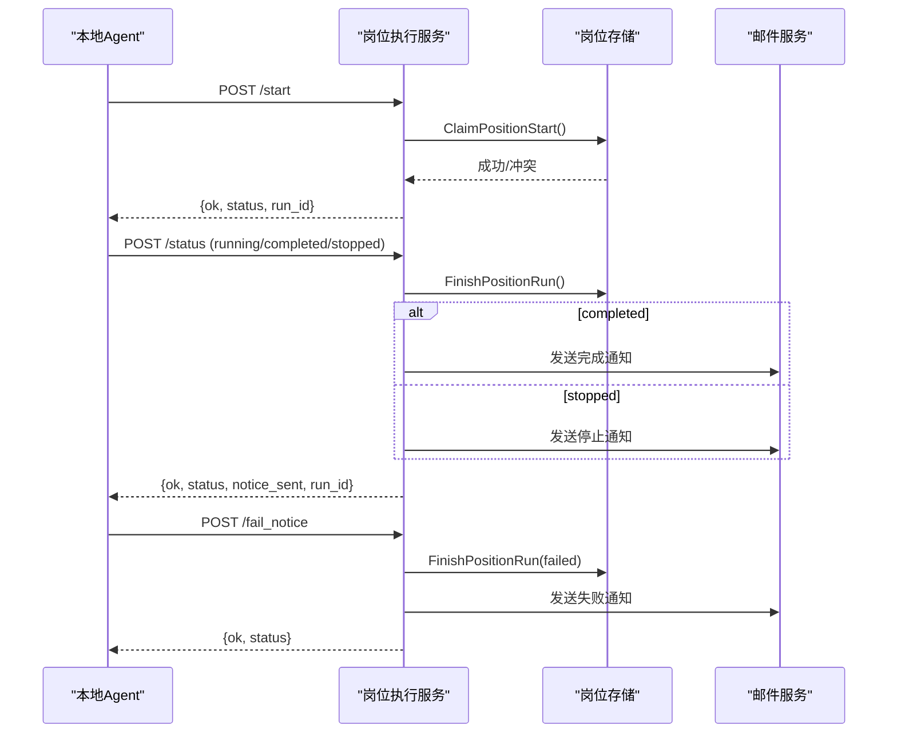
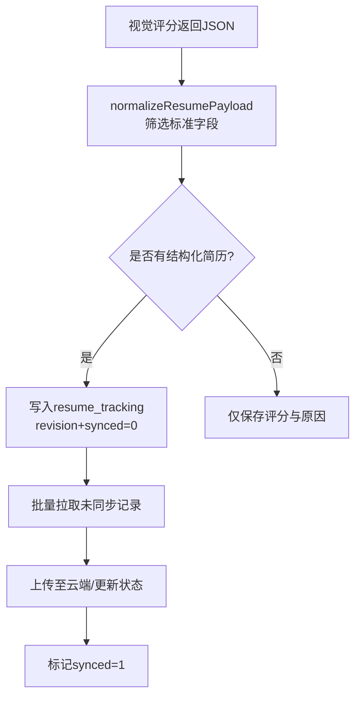
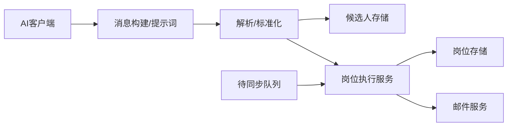

# 评分结果处理

<cite>
**本文引用的文件**
- [client.go](file://goodhr5/local-agent-go/internal/localai/client.go)
- [candidate.go](file://goodhr5/cloud/backend/internal/httpapi/candidate.go)
- [position_execution.go](file://goodhr5/cloud/backend/internal/httpapi/position_execution.go)
- [candidate_store.go](file://goodhr5/cloud/backend/internal/httpapi/candidate_store.go)
- [position_store.go](file://goodhr5/cloud/backend/internal/httpapi/position_store.go)
- [resume_tracking.go](file://goodhr5/local-agent-go/internal/localdb/resume_tracking.go)
- [persistence.go](file://goodhr5/local-agent-go/internal/positionrunner/persistence.go)
- [scan.go](file://goodhr5/local-agent-go/internal/positionrunner/scan.go)
</cite>

## 目录
1. [简介](#简介)
2. [项目结构](#项目结构)
3. [核心组件](#核心组件)
4. [架构总览](#架构总览)
5. [详细组件分析](#详细组件分析)
6. [依赖关系分析](#依赖关系分析)
7. [性能与缓存策略](#性能与缓存策略)
8. [故障排查指南](#故障排查指南)
9. [结论](#结论)
10. [附录：数据模型与迁移要点](#附录数据模型与迁移要点)

## 简介
本文件聚焦“AI 评分结果处理”的完整生命周期：从本地 Agent 调用 AI、解析并标准化评分结果，到云端接收、校验、存储、展示与同步。文档覆盖候选人数据模型、评分数据结构、结果缓存策略、验证规则、错误处理机制、数据同步逻辑，以及结果展示格式、API 响应结构与数据迁移方案，帮助开发者理解和管理 AI 评分数据的端到端流转。

## 项目结构
- 本地 Agent（local-agent-go）负责：
  - 调用 OpenAI 兼容接口进行文本或视觉评分；
  - 流式读取、提前提取评分 JSON；
  - 清洗、归一化评分与结构化简历字段；
  - 将待同步的结构化简历写入本地数据库队列。
- 云端后端（cloud/backend）负责：
  - 接收岗位运行状态、失败通知与候选人数据；
  - 维护候选人主体、触达上下文与事件流水；
  - 管理岗位配置、运行状态与统计；
  - 对外提供统一的数据模型与 API 响应结构。

**图示来源**
- [client.go:164-256](file://goodhr5/local-agent-go/internal/localai/client.go#L164-L256)
- [resume_tracking.go:74-100](file://goodhr5/local-agent-go/internal/localdb/resume_tracking.go#L74-L100)
- [candidate_store.go:155-167](file://goodhr5/cloud/backend/internal/httpapi/candidate_store.go#L155-L167)
- [position_store.go:50-63](file://goodhr5/cloud/backend/internal/httpapi/position_store.go#L50-L63)

**章节来源**
- [client.go:164-256](file://goodhr5/local-agent-go/internal/localai/client.go#L164-L256)
- [candidate_store.go:155-167](file://goodhr5/cloud/backend/internal/httpapi/candidate_store.go#L155-L167)
- [position_store.go:50-63](file://goodhr5/cloud/backend/internal/httpapi/position_store.go#L50-L63)

## 核心组件
- AI 评分客户端
  - 支持文本与视觉两种评分模式；
  - 流式读取并提前提取评分 JSON；
  - 标准化评分范围、原因长度、阈值判定。
- 云端候选人数据模型
  - 统一候选人对象、三阶段评分、详情抓取信息、运行时信息与时间戳；
  - 结构化简历字段集合。
- 云端候选人存储
  - 候选人主体、触达上下文、事件流水的增删改查；
  - 分页查询、关键词检索、按岗位聚合。
- 云端岗位执行服务
  - 启动许可检查、运行状态同步、结束通知、失败通知；
  - 关联用户流程记录与邮件通知。
- 本地待同步队列
  - 结构化简历增量落库与同步标记；
  - 与岗位运行器协作完成批量上报。

**章节来源**
- [client.go:33-72](file://goodhr5/local-agent-go/internal/localai/client.go#L33-L72)
- [candidate.go:87-143](file://goodhr5/cloud/backend/internal/httpapi/candidate.go#L87-L143)
- [candidate_store.go:12-65](file://goodhr5/cloud/backend/internal/httpapi/candidate_store.go#L12-L65)
- [position_execution.go:21-51](file://goodhr5/cloud/backend/internal/httpapi/position_execution.go#L21-L51)
- [resume_tracking.go:74-100](file://goodhr5/local-agent-go/internal/localdb/resume_tracking.go#L74-L100)

## 架构总览
评分结果从本地 Agent 产生，经标准化后进入云端存储，并在前端与管理后台展示。关键路径包括：
- 文本评分：根据岗位要求与候选人基础信息生成打招呼/详情评分；
- 视觉评分：基于长图识别详情并一次性输出评分与结构化简历；
- 流式提前决策：在流式返回中尽早提取评分，用于快速动作判断；
- 云端校验与存储：对候选人数据进行去重、合并、事件追踪；
- 同步与展示：通过统一的 Candidate 模型对外暴露，供前端与管理界面消费。

**图示来源**
- [client.go:164-256](file://goodhr5/local-agent-go/internal/localai/client.go#L164-L256)
- [position_execution.go:169-276](file://goodhr5/cloud/backend/internal/httpapi/position_execution.go#L169-L276)
- [candidate_store.go:155-167](file://goodhr5/cloud/backend/internal/httpapi/candidate_store.go#L155-L167)

## 详细组件分析

### AI 评分客户端（本地）
- 文本评分
  - ScoreForDetail：计算“查看详情”评分，依据岗位配置中的阈值决定是否打开详情；
  - ScoreForGreet：计算“打招呼”评分，依据阈值决定是否发起打招呼。
- 视觉评分
  - ScoreVisionForGreet：一次性识别详情长图，输出评分、原因、详情文本与结构化简历。
- 流式处理
  - readChatStream：读取 SSE 流，累积正文与思考内容；
  - TryExtractScoreDecisionFromStream：从累计文本中提取已闭合的 JSON，提前触发评分回调；
  - completeJSONObjects/findScoreReason：稳健地定位 JSON 片段并抽取 score/reason。
- 标准化与校验
  - parseScoreJSON/parseVisionScoreJSONWithResume：清理 Markdown、提取 JSON、兼容 analysis 顶层字段；
  - clampScore/truncate：限制评分范围与原因长度；
  - withDecisionThreshold：为提前评分补充阈值与动作判断。

**图示来源**
- [client.go:164-256](file://goodhr5/local-agent-go/internal/localai/client.go#L164-L256)
- [client.go:470-554](file://goodhr5/local-agent-go/internal/localai/client.go#L470-L554)
- [client.go:854-929](file://goodhr5/local-agent-go/internal/localai/client.go#L854-L929)

**章节来源**
- [client.go:164-256](file://goodhr5/local-agent-go/internal/localai/client.go#L164-L256)
- [client.go:470-554](file://goodhr5/local-agent-go/internal/localai/client.go#L470-L554)
- [client.go:854-929](file://goodhr5/local-agent-go/internal/localai/client.go#L854-L929)

### 云端候选人数据模型与存储
- 统一候选人对象
  - Candidate：包含平台标识、基本信息、详情抓取、AI 三阶段评分、运行时信息与时间戳；
  - CandidateAIScores/detail/greet/review：分别对应不同阶段的评分与原因。
- 存储能力
  - SaveCandidateProfile/UpsertCandidateEngagement/SaveCandidateEvent：主体、触达上下文、事件流水的持久化；
  - ListPositionCandidates/GetPositionCandidate：分页与条件查询，支持关键词与状态过滤；
  - UpdateCandidateEngagementStatus：更新触达状态与时间戳。
- 事件流水
  - CandidateEvent：记录每次交互的输入/输出、模型、token 用量、元数据等，便于审计与回溯。

**图示来源**
- [candidate.go:87-143](file://goodhr5/cloud/backend/internal/httpapi/candidate.go#L87-L143)
- [candidate_store.go:12-65](file://goodhr5/cloud/backend/internal/httpapi/candidate_store.go#L12-L65)

**章节来源**
- [candidate.go:87-143](file://goodhr5/cloud/backend/internal/httpapi/candidate.go#L87-L143)
- [candidate_store.go:155-167](file://goodhr5/cloud/backend/internal/httpapi/candidate_store.go#L155-L167)

### 云端岗位执行服务（状态与通知）
- 启动许可
  - 校验设备绑定、会员权限、AI 余额、岗位冲突；
  - 创建执行任务记录，记录用户流程。
- 运行状态同步
  - 接收 running/completed/stopped 状态；
  - 幂等更新岗位状态与统计，发送完成/停止通知。
- 失败通知
  - 接收失败消息，更新状态，发送邮件提醒，记录失败原因。

**图示来源**
- [position_execution.go:55-96](file://goodhr5/cloud/backend/internal/httpapi/position_execution.go#L55-L96)
- [position_execution.go:169-276](file://goodhr5/cloud/backend/internal/httpapi/position_execution.go#L169-L276)
- [position_execution.go:374-435](file://goodhr5/cloud/backend/internal/httpapi/position_execution.go#L374-L435)
- [position_store.go:130-199](file://goodhr5/cloud/backend/internal/httpapi/position_store.go#L130-L199)

**章节来源**
- [position_execution.go:55-96](file://goodhr5/cloud/backend/internal/httpapi/position_execution.go#L55-L96)
- [position_execution.go:169-276](file://goodhr5/cloud/backend/internal/httpapi/position_execution.go#L169-L276)
- [position_execution.go:374-435](file://goodhr5/cloud/backend/internal/httpapi/position_execution.go#L374-L435)
- [position_store.go:130-199](file://goodhr5/cloud/backend/internal/httpapi/position_store.go#L130-L199)

### 本地待同步队列与结构化简历
- 结构化简历输出
  - 视觉评分时，若岗位开启输出结构化简历，AI 会返回标准字段集合；
  - normalizeResumePayload 仅保留可直接入库的标准字段。
- 本地落库与同步
  - resume_tracking 表以 scope+position_id+candidiate_id 为唯一键，使用 revision 版本控制；
  - 同步时按 revision 顺序拉取未同步记录，成功后标记 synced=1。

**图示来源**
- [client.go:890-929](file://goodhr5/local-agent-go/internal/localai/client.go#L890-L929)
- [resume_tracking.go:74-100](file://goodhr5/local-agent-go/internal/localdb/resume_tracking.go#L74-L100)

**章节来源**
- [client.go:890-929](file://goodhr5/local-agent-go/internal/localai/client.go#L890-L929)
- [resume_tracking.go:74-100](file://goodhr5/local-agent-go/internal/localdb/resume_tracking.go#L74-L100)

## 依赖关系分析
- 本地 AI 客户端依赖岗位快照与候选人基础信息，构造稳定提示词与动态变量；
- 云端候选人存储依赖统一数据模型，确保事件流水与触达上下文一致；
- 岗位执行服务依赖岗位存储与邮件服务，保证状态变更与通知的可靠性；
- 本地待同步队列与岗位运行器协作，确保结构化简历的有序同步。

**图示来源**
- [client.go:689-722](file://goodhr5/local-agent-go/internal/localai/client.go#L689-L722)
- [candidate_store.go:155-167](file://goodhr5/cloud/backend/internal/httpapi/candidate_store.go#L155-L167)
- [position_execution.go:21-51](file://goodhr5/cloud/backend/internal/httpapi/position_execution.go#L21-L51)

**章节来源**
- [client.go:689-722](file://goodhr5/local-agent-go/internal/localai/client.go#L689-L722)
- [candidate_store.go:155-167](file://goodhr5/cloud/backend/internal/httpapi/candidate_store.go#L155-L167)
- [position_execution.go:21-51](file://goodhr5/cloud/backend/internal/httpapi/position_execution.go#L21-L51)

## 性能与缓存策略
- 流式提前决策
  - 在流式响应中尽早提取评分 JSON，减少等待时间，提升交互体验；
  - 通过 earlyDecision 回调快速触发动作判断。
- 提示词稳定性
  - 将稳定规则与动态变量分离，降低 token 消耗与解析成本；
  - 通过 stablePrompt 替换占位符，避免重复注入大段规则。
- 结构化简历输出开关
  - 默认关闭结构化简历输出以节省 token；
  - 仅在需要时开启，并通过 normalizeResumePayload 严格筛选字段。
- 重试与退避
  - AI 请求失败时自动重试，支持 Retry-After 头；
  - 临时错误采用指数退避，避免雪崩。

**章节来源**
- [client.go:117-162](file://goodhr5/local-agent-go/internal/localai/client.go#L117-L162)
- [client.go:470-554](file://goodhr5/local-agent-go/internal/localai/client.go#L470-L554)
- [client.go:689-722](file://goodhr5/local-agent-go/internal/localai/client.go#L689-L722)
- [client.go:378-420](file://goodhr5/local-agent-go/internal/localai/client.go#L378-L420)

## 故障排查指南
- AI 服务错误分类
  - ServiceError：封装状态码、响应体、底层原因、是否可重试、是否致命；
  - newHTTPServiceError：根据状态码与响应体判断可重试与致命性；
  - IsPositionStoppingError：用于岗位运行器判断是否需要终止整个流程。
- 常见错误场景
  - 401/403/404：认证、权限或资源不存在，通常致命；
  - 429/5xx：限流或服务端错误，可重试；
  - 400/422：参数或额度问题，结合响应体关键词判断致命性。
- 日志与调试
  - 流式分片日志：记录 reasoning_content 与 delta，便于定位问题；
  - 错误预览：截断响应体，避免日志过大。

**章节来源**
- [client.go:64-100](file://goodhr5/local-agent-go/internal/localai/client.go#L64-L100)
- [client.go:378-420](file://goodhr5/local-agent-go/internal/localai/client.go#L378-L420)
- [client.go:497-503](file://goodhr5/local-agent-go/internal/localai/client.go#L497-L503)

## 结论
本系统通过本地 AI 客户端与云端存储服务的协同，实现了 AI 评分结果的解析、标准化、存储与展示全流程。流式提前决策、稳定的提示词设计、严格的字段筛选与健壮的错误处理，共同保障了评分结果的高可用与高性能。建议在生产环境中：
- 合理配置阈值与温度，平衡准确率与速度；
- 开启结构化简历输出时，关注 token 成本；
- 监控 AI 服务错误率与重试次数，及时优化提示词与模型选择；
- 定期审计事件流水，确保数据可追溯。

## 附录：数据模型与迁移要点
- 候选人数据模型
  - Candidate：统一对外接口，包含三阶段评分、详情抓取、运行时信息与时间戳；
  - CandidateAIScores：detail/greet/review 分别表示不同阶段的评分与原因。
- 评分数据结构
  - 文本评分：score、reason、threshold、should_greet/should_open_detail；
  - 视觉评分：额外包含 detail_text 与 resume_data。
- 结果缓存策略
  - 流式提前决策：在流式响应中尽早提取评分，减少等待；
  - 结构化简历：按需输出，严格字段筛选，避免冗余。
- 结果验证规则
  - 评分范围：clampScore 限制在 0-100；
  - 原因长度：truncate 限制在 30 字以内；
  - JSON 合法性：cleanAIText 去除 Markdown，completeJSONObjects 提取闭合 JSON。
- 错误处理机制
  - ServiceError：封装状态码、响应体、底层原因、可重试与致命性；
  - 重试策略：支持 Retry-After 头，指数退避。
- 数据同步逻辑
  - resume_tracking：以 revision 版本控制，按顺序同步，成功后标记 synced=1；
  - 岗位运行器：与待同步队列协作，完成批量上报。
- 结果展示格式与 API 响应结构
  - 统一 Candidate 模型对外暴露，包含 AI 评分、详情抓取、运行时信息与时间戳；
  - 岗位执行服务返回统一的状态与通知标志。
- 数据迁移方案
  - 结构化简历字段：normalizeResumePayload 仅保留标准字段，确保向后兼容；
  - 事件流水：CandidateEvent 记录输入/输出、模型、token 用量、元数据，便于审计与回溯。

**章节来源**
- [candidate.go:87-143](file://goodhr5/cloud/backend/internal/httpapi/candidate.go#L87-L143)
- [client.go:854-929](file://goodhr5/local-agent-go/internal/localai/client.go#L854-L929)
- [resume_tracking.go:74-100](file://goodhr5/local-agent-go/internal/localdb/resume_tracking.go#L74-L100)
- [position_execution.go:169-276](file://goodhr5/cloud/backend/internal/httpapi/position_execution.go#L169-L276)