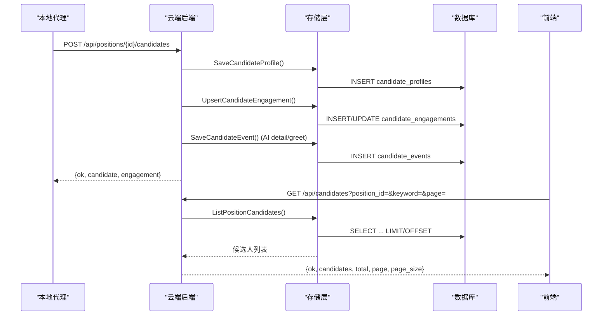
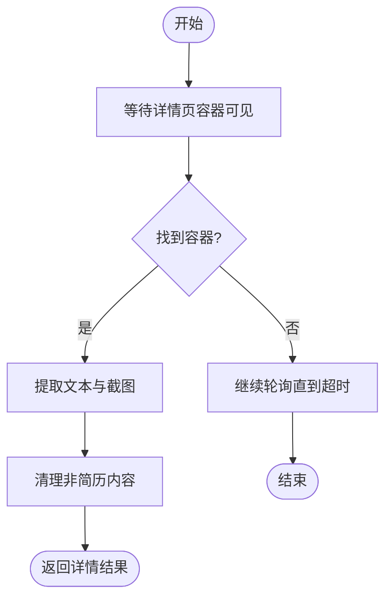
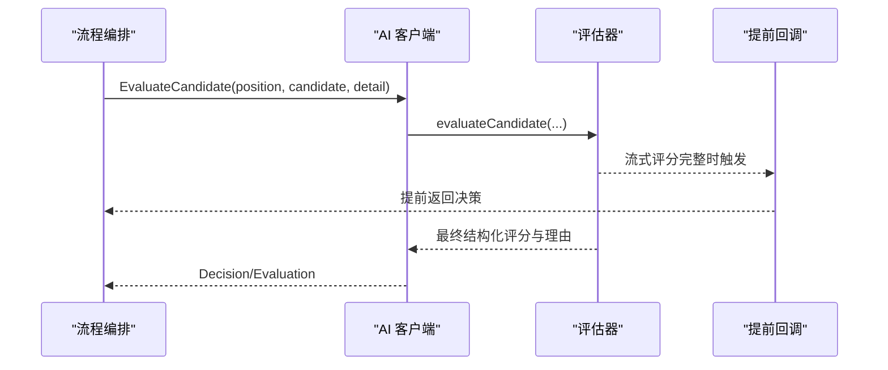
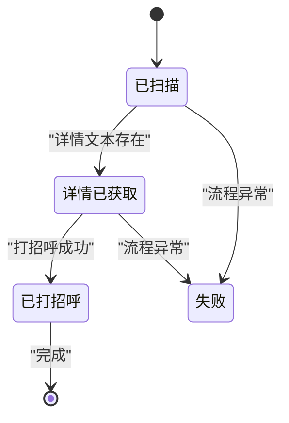
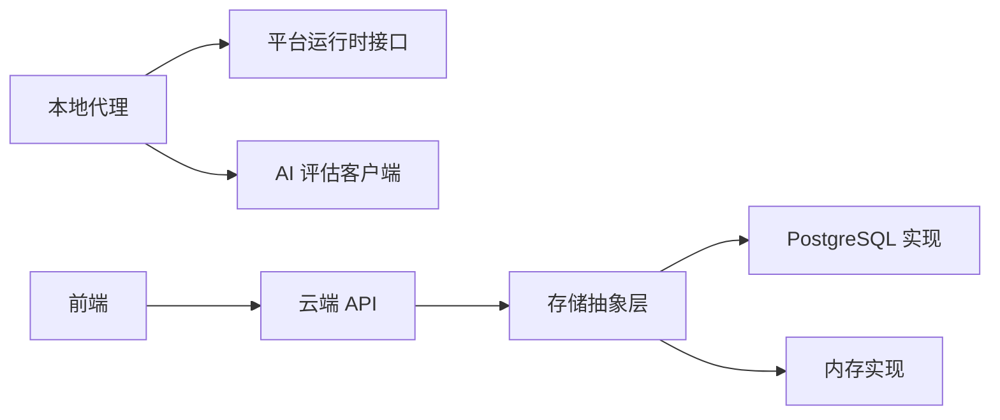

# 候选人处理系统

<cite>
**本文引用的文件**
- [简历模型.json](file://goodhr5/简历模型.json)
- [candidate.go](file://goodhr5/cloud/backend/internal/httpapi/candidate.go)
- [candidate_service.go](file://goodhr5/cloud/backend/internal/httpapi/candidate_service.go)
- [local_candidate_ingest.go](file://goodhr5/cloud/backend/internal/httpapi/local_candidate_ingest.go)
- [candidate_store.go](file://goodhr5/cloud/backend/internal/httpapi/candidate_store.go)
- [candidate_store_pg.go](file://goodhr5/cloud/backend/internal/httpapi/candidate_store_pg.go)
- [candidate-match.js](file://goodhr5/local-agent-go/worker-node/src/candidate-match.js)
- [detail-ready.js](file://goodhr5/local-agent-go/worker-node/src/detail-ready.js)
- [greet-policy.js](file://goodhr5/local-agent-go/worker-node/src/greet-policy.js)
- [runtime.go](file://goodhr5/local-agent-go/internal/platformcore/runtime.go)
- [flow.go](file://goodhr5/local-agent-go/internal/flow/greeting/flow.go)
- [client.go](file://goodhr5/local-agent-go/internal/integration/ai/client.go)
- [evaluation.go](file://goodhr5/local-agent-go/internal/integration/ai/evaluation.go)
</cite>

## 目录
1. [简介](#简介)
2. [项目结构](#项目结构)
3. [核心组件](#核心组件)
4. [架构总览](#架构总览)
5. [详细组件分析](#详细组件分析)
6. [依赖关系分析](#依赖关系分析)
7. [性能与索引优化](#性能与索引优化)
8. [故障恢复与错误处理](#故障恢复与错误处理)
9. [结论](#结论)
10. [附录：API 规范与示例](#附录api-规范与示例)

## 简介
本系统围绕“候选人处理”的全链路展开，涵盖从本地招聘平台抓取、简历解析、候选人数据标准化、AI 匹配评分、云端入库与查询、到前端展示与备注管理。其目标是让开发者快速理解并优化候选人处理流程，包括数据结构设计、索引优化、查询性能调优、批量处理能力、数据同步策略以及错误恢复机制。

## 项目结构
系统由三大部分组成：
- 云端后端（Go）：提供候选人入库、查询、备注等 HTTP API，实现存储接口与 PostgreSQL 持久化。
- 本地代理（Node/Go）：负责浏览器自动化抓取候选人详情、执行 AI 评估、将结果回传云端。
- 前端（Next.js）：展示候选人列表、详情、备注，并提供筛选与分页能力。

```mermaid
graph TB
subgraph "本地代理"
A["浏览器抓取<br/>候选人详情"]
B["AI 评估<br/>文本/视觉"]
C["结果封装与回传"]
end
subgraph "云端后端"
D["HTTP API<br/>入库/查询/备注"]
E["存储抽象层<br/>内存/PostgreSQL"]
F["数据库<br/>候选人/触达/事件"]
end
subgraph "前端"
G["候选人列表/详情/备注"]
end
A --> B --> C --> D --> E --> F
G < --> D
```

图表来源
- [runtime.go:46-74](file://goodhr5/local-agent-go/internal/platformcore/runtime.go#L46-L74)
- [client.go:108-136](file://goodhr5/local-agent-go/internal/integration/ai/client.go#L108-L136)
- [local_candidate_ingest.go:23-124](file://goodhr5/cloud/backend/internal/httpapi/local_candidate_ingest.go#L23-L124)
- [candidate_store_pg.go:24-161](file://goodhr5/cloud/backend/internal/httpapi/candidate_store_pg.go#L24-L161)

章节来源
- [runtime.go:46-74](file://goodhr5/local-agent-go/internal/platformcore/runtime.go#L46-L74)
- [local_candidate_ingest.go:23-124](file://goodhr5/cloud/backend/internal/httpapi/local_candidate_ingest.go#L23-L124)
- [candidate_store_pg.go:24-161](file://goodhr5/cloud/backend/internal/httpapi/candidate_store_pg.go#L24-L161)

## 核心组件
- 候选人统一对象与字段定义：用于云端与本地之间传输的标准化结构，包含基本信息、教育经历、工作经历、证书、荣誉、项目经验、沟通记录、AI 评分、运行态与时间戳等。
- 候选人服务：提供简历库候选人列表、详情、备注等 HTTP API，支持团队隔离、权限控制、分页与关键词搜索。
- 本地候选人入库：接收本地程序回传的候选人 JSON，写入云端简历库，并保存 AI 评分事件、更新岗位统计和用户流程状态。
- 存储层：提供内存与 PostgreSQL 两种实现，支持候选人主体、触达上下文、事件流水的增删改查。
- 本地匹配与等待：在动态变化的候选人列表中稳定定位目标候选人；等待详情页容器就绪。
- AI 评估：基于岗位与候选人详情生成结构化评分与理由，支持文本与视觉模式，支持提前返回完整评分。

章节来源
- [candidate.go:6-143](file://goodhr5/cloud/backend/internal/httpapi/candidate.go#L6-L143)
- [candidate_service.go:12-146](file://goodhr5/cloud/backend/internal/httpapi/candidate_service.go#L12-L146)
- [local_candidate_ingest.go:23-124](file://goodhr5/cloud/backend/internal/httpapi/local_candidate_ingest.go#L23-L124)
- [candidate_store.go:12-156](file://goodhr5/cloud/backend/internal/httpapi/candidate_store.go#L12-L156)
- [candidate-store_pg.go:14-23](file://goodhr5/cloud/backend/internal/httpapi/candidate_store_pg.go#L14-L23)
- [candidate-match.js:1-80](file://goodhr5/local-agent-go/worker-node/src/candidate-match.js#L1-L80)
- [detail-ready.js:1-52](file://goodhr5/local-agent-go/worker-node/src/detail-ready.js#L1-L52)
- [client.go:108-136](file://goodhr5/local-agent-go/internal/integration/ai/client.go#L108-L136)
- [evaluation.go:37-76](file://goodhr5/local-agent-go/internal/integration/ai/evaluation.go#L37-L76)

## 架构总览
候选人处理的核心流程如下：
1. 本地代理通过浏览器抓取候选人列表与详情，提取简历文本与截图。
2. 调用 AI 评估模块，根据岗位需求对候选人进行评分与理由生成。
3. 将标准化后的候选人数据与评分事件回传到云端。
4. 云端后端校验权限与参数，写入候选人主体、触达上下文与事件流水。
5. 前端通过 API 获取候选人列表与详情，支持分页、关键词搜索与备注管理。



图表来源
- [local_candidate_ingest.go:23-124](file://goodhr5/cloud/backend/internal/httpapi/local_candidate_ingest.go#L23-L124)
- [candidate_store_pg.go:24-161](file://goodhr5/cloud/backend/internal/httpapi/candidate_store_pg.go#L24-L161)
- [candidate_store_pg.go:325-357](file://goodhr5/cloud/backend/internal/httpapi/candidate_store_pg.go#L325-L357)
- [candidate_service.go:29-76](file://goodhr5/cloud/backend/internal/httpapi/candidate_service.go#L29-L76)

## 详细组件分析

### 候选人数据模型与标准化
- 统一对象 Candidate 包含基础信息、附件、详情、AI 评分、运行态与时间戳，便于跨端传输与展示。
- 标准化字段覆盖姓名、联系方式、期望薪资、工作地区、工作年限、学历、期望职位、在线状态、个人描述、工作状态、工作经历、教育经历、证书、荣誉、项目经验、沟通记录等。
- 简历模型示例展示了 AI 评分、候选人基本信息、经历与原始文本的结构化表示。


图表来源
- [candidate.go:6-143](file://goodhr5/cloud/backend/internal/httpapi/candidate.go#L6-L143)
- [简历模型.json:1-84](file://goodhr5/简历模型.json#L1-L84)

章节来源
- [candidate.go:6-143](file://goodhr5/cloud/backend/internal/httpapi/candidate.go#L6-L143)
- [简历模型.json:1-84](file://goodhr5/简历模型.json#L1-L84)

### 简历解析与详情读取
- 本地代理通过浏览器自动化抓取候选人详情，支持截图与 OCR 路径，确保复杂页面也能正确解析。
- 详情页等待机制使用轮询查找可见容器，超时与重试策略保证稳定性。
- 平台运行时接口定义了统一的抓取、滚动、关闭详情、打招呼等能力，屏蔽平台差异。



图表来源
- [detail-ready.js:1-52](file://goodhr5/local-agent-go/worker-node/src/detail-ready.js#L1-L52)
- [runtime.go:46-74](file://goodhr5/local-agent-go/internal/platformcore/runtime.go#L46-L74)

章节来源
- [detail-ready.js:1-52](file://goodhr5/local-agent-go/worker-node/src/detail-ready.js#L1-L52)
- [runtime.go:46-74](file://goodhr5/local-agent-go/internal/platformcore/runtime.go#L46-L74)

### AI 匹配评分机制
- 文本模式：根据岗位配置与候选人详情生成结构化评分与理由，支持阈值与输出结构化简历开关。
- 视觉模式：在图片评分字段完整后提前返回决策，后台继续读取完整结构化简历，提升响应速度。
- 流式评分：当流式字段完整时触发提前回调，减少前端等待时间。



图表来源
- [flow.go:471-509](file://goodhr5/local-agent-go/internal/flow/greeting/flow.go#L471-L509)
- [client.go:108-136](file://goodhr5/local-agent-go/internal/integration/ai/client.go#L108-L136)
- [evaluation.go:37-76](file://goodhr5/local-agent-go/internal/integration/ai/evaluation.go#L37-L76)

章节来源
- [flow.go:471-509](file://goodhr5/local-agent-go/internal/flow/greeting/flow.go#L471-L509)
- [client.go:108-136](file://goodhr5/local-agent-go/internal/integration/ai/client.go#L108-L136)
- [evaluation.go:37-76](file://goodhr5/local-agent-go/internal/integration/ai/evaluation.go#L37-L76)

### 候选人生命周期管理
- 状态流转：扫描、详情获取、打招呼成功、失败等状态由本地代理回传，云端更新触达上下文与时间戳。
- 事件流水：每次 AI 评分、手动备注等操作均记录为事件，支持按候选人或触达上下文查询。
- 用户流程：首次简历处理与首次打招呼成功会记录用户流程步骤，便于运营分析。



图表来源
- [local_candidate_ingest.go:23-124](file://goodhr5/cloud/backend/internal/httpapi/local_candidate_ingest.go#L23-L124)
- [candidate_store_pg.go:163-230](file://goodhr5/cloud/backend/internal/httpapi/candidate_store_pg.go#L163-L230)

章节来源
- [local_candidate_ingest.go:23-124](file://goodhr5/cloud/backend/internal/httpapi/local_candidate_ingest.go#L23-L124)
- [candidate_store_pg.go:163-230](file://goodhr5/cloud/backend/internal/httpapi/candidate_store_pg.go#L163-L230)

### 数据同步策略与批量处理
- 增量同步：本地程序回传候选人 JSON，云端按唯一键去重并更新，避免重复入库。
- 批量统计：支持累加已处理简历数量与岗位累计统计（扫描、跳过、失败），便于监控与报表。
- 事件追加：AI 评分事件与手动备注以事件形式追加，不影响主体记录，保持可追溯性。

章节来源
- [local_candidate_ingest.go:134-229](file://goodhr5/cloud/backend/internal/httpapi/local_candidate_ingest.go#L134-L229)
- [candidate_store_pg.go:232-293](file://goodhr5/cloud/backend/internal/httpapi/candidate_store_pg.go#L232-L293)

### 动态列表中的候选人匹配
- 文本相似度：使用双字符集合计算相似度，结合姓名包含判断，提高匹配准确率。
- 最佳匹配：在动态插入、重排的情况下，仍能稳定定位目标候选人卡片。
- 兼容定位器：支持直接 Locator 与扫描结果包装对象，适配不同平台实现。

章节来源
- [candidate-match.js:1-80](file://goodhr5/local-agent-go/worker-node/src/candidate-match.js#L1-L80)

### 打招呼后续策略
- 平台差异化：除特定平台外，打招呼成功后可能需点击继续或确认按钮，策略集中管理。

章节来源
- [greet-policy.js:1-13](file://goodhr5/local-agent-go/worker-node/src/greet-policy.js#L1-L13)

## 依赖关系分析
- 云端后端依赖存储抽象层，支持内存与 PostgreSQL 实现，便于开发与生产切换。
- 本地代理依赖平台运行时接口，屏蔽平台差异，统一抓取与交互逻辑。
- AI 评估模块依赖岗位配置与候选人详情，输出结构化评分与理由。



图表来源
- [runtime.go:46-74](file://goodhr5/local-agent-go/internal/platformcore/runtime.go#L46-L74)
- [candidate_store.go:146-156](file://goodhr5/cloud/backend/internal/httpapi/candidate_store.go#L146-L156)
- [candidate_store_pg.go:14-23](file://goodhr5/cloud/backend/internal/httpapi/candidate_store_pg.go#L14-L23)

章节来源
- [runtime.go:46-74](file://goodhr5/local-agent-go/internal/platformcore/runtime.go#L46-L74)
- [candidate_store.go:146-156](file://goodhr5/cloud/backend/internal/httpapi/candidate_store.go#L146-L156)
- [candidate_store_pg.go:14-23](file://goodhr5/cloud/backend/internal/httpapi/candidate_store_pg.go#L14-L23)

## 性能与索引优化
- 查询优化：候选人列表查询使用 LATERAL JOIN 获取最新触达上下文与最近备注，减少多次查询。
- 关键词搜索：支持多字段 ILIKE 模糊匹配，建议为常用字段建立索引以提升性能。
- 分页限制：默认页大小上限为 100，防止过大分页导致性能下降。
- 事件限制：事件查询限制最多 200 条，避免大结果集影响响应时间。

章节来源
- [candidate_store_pg.go:489-551](file://goodhr5/cloud/backend/internal/httpapi/candidate_store_pg.go#L489-L551)
- [candidate_store_pg.go:624-651](file://goodhr5/cloud/backend/internal/httpapi/candidate_store_pg.go#L624-L651)
- [candidate_store_pg.go:435-487](file://goodhr5/cloud/backend/internal/httpapi/candidate_store_pg.go#L435-L487)
- [candidate_store.go:397-410](file://goodhr5/cloud/backend/internal/httpapi/candidate_store.go#L397-L410)

## 故障恢复与错误处理
- 超时控制：数据库操作设置 3 秒超时，避免长时间阻塞。
- 错误分类：区分未找到、方法不允许、内部错误等，返回明确状态码与消息。
- 日志记录：候选人入库链路写岗位日志，便于问题追踪。
- 进程清理：Windows 下精确清理占用账号 Profile 的残留浏览器进程，避免资源冲突。

章节来源
- [candidate_store_pg.go:24-29](file://goodhr5/cloud/backend/internal/httpapi/candidate_store_pg.go#L24-L29)
- [candidate_service.go:31-76](file://goodhr5/cloud/backend/internal/httpapi/candidate_service.go#L31-L76)
- [local_candidate_ingest.go:126-132](file://goodhr5/cloud/backend/internal/httpapi/local_candidate_ingest.go#L126-L132)
- [profile-process.js:1-66](file://goodhr5/local-agent-go/worker-node/src/profile-process.js#L1-L66)

## 结论
本系统通过标准化的候选人数据模型、稳定的本地抓取与 AI 评估、健壮的云端入库与查询、以及完善的错误恢复机制，实现了高效的候选人处理流程。开发者可基于此文档理解各组件职责与交互方式，进一步优化性能与扩展功能。

## 附录：API 规范与示例

### 候选人入库接口
- 路径：POST /api/positions/{positionID}/candidates
- 请求体：本地程序回传的候选人 JSON，包含基础信息、经历、AI 评分等。
- 响应：{ ok, candidate, engagement }

章节来源
- [local_candidate_ingest.go:23-124](file://goodhr5/cloud/backend/internal/httpapi/local_candidate_ingest.go#L23-L124)

### 候选人列表接口
- 路径：GET /api/candidates
- 查询参数：position_id、keyword/q、page、page_size
- 响应：{ ok, candidates, total, page, page_size }

章节来源
- [candidate_service.go:29-76](file://goodhr5/cloud/backend/internal/httpapi/candidate_service.go#L29-L76)

### 候选人详情接口
- 路径：GET /api/candidates/{id}
- 查询参数：engagement_id（可选）
- 响应：{ ok, candidate }

章节来源
- [candidate_service.go:110-146](file://goodhr5/cloud/backend/internal/httpapi/candidate_service.go#L110-L146)

### 候选人备注接口
- 路径：GET/POST /api/candidates/{id}/notes
- 请求体（POST）：{ content }
- 响应（GET）：{ ok, notes }
- 响应（POST）：{ ok, note }

章节来源
- [candidate_service.go:148-216](file://goodhr5/cloud/backend/internal/httpapi/candidate_service.go#L148-L216)

### 岗位统计同步接口
- 路径：POST /api/positions/{positionID}/counts
- 请求体：{ scanned_count, skipped_count, failed_count }
- 响应：{ ok }

章节来源
- [local_candidate_ingest.go:187-229](file://goodhr5/cloud/backend/internal/httpapi/local_candidate_ingest.go#L187-L229)

### 简历解析示例
- 示例数据展示了 AI 评分、候选人基本信息、经历与原始文本的结构化表示，可用于测试与调试。

章节来源
- [简历模型.json:1-84](file://goodhr5/简历模型.json#L1-L84)