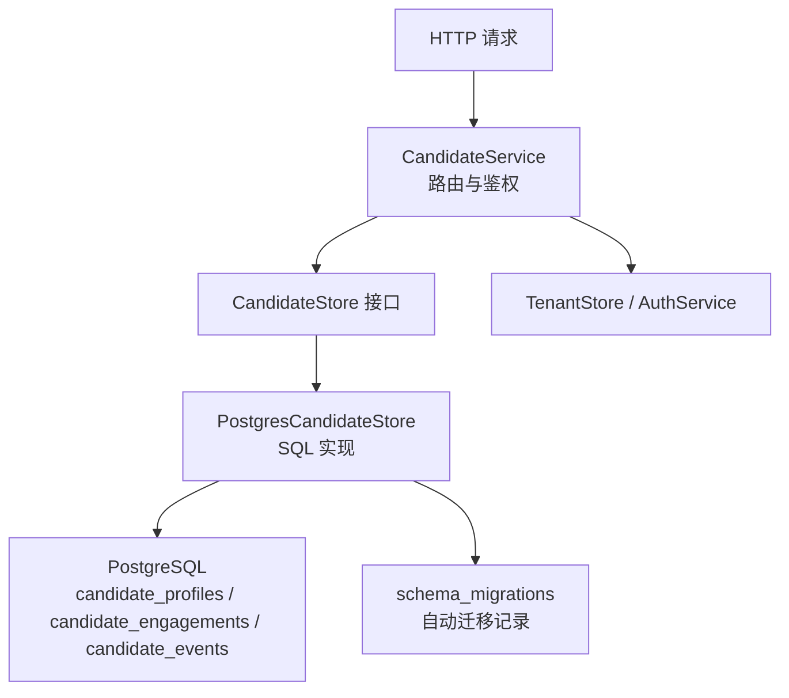
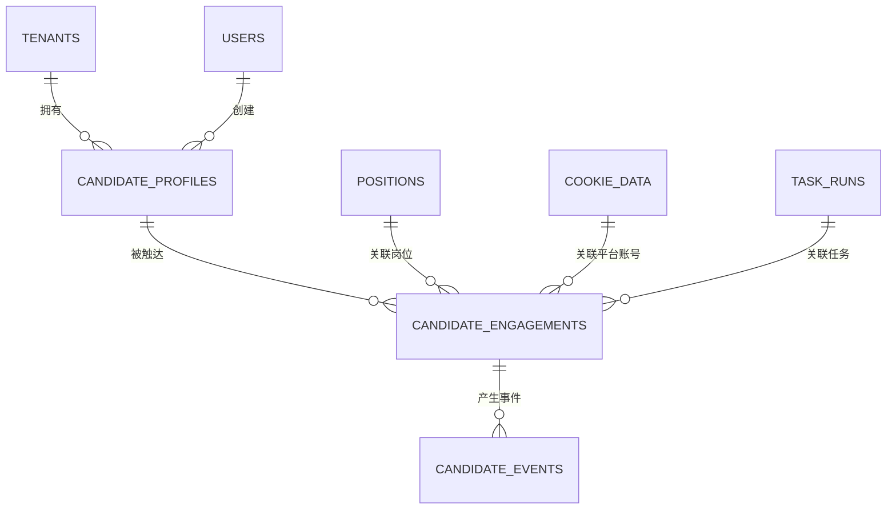
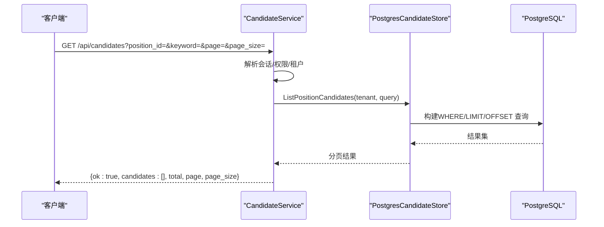
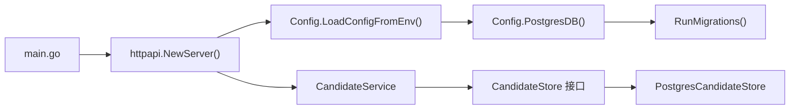

# 候选人数据存储

<cite>
**本文引用的文件**
- [0016_task_candidates.sql](file://goodhr5/cloud/backend/db/migrations/0016_task_candidates.sql)
- [0028_candidate_profile_engagement_events.sql](file://goodhr5/cloud/backend/db/migrations/0028_candidate_profile_engagement_events.sql)
- [candidate_store_pg.go](file://goodhr5/cloud/backend/internal/httpapi/candidate_store_pg.go)
- [candidate_store.go](file://goodhr5/cloud/backend/internal/httpapi/candidate_store.go)
- [candidate_service.go](file://goodhr5/cloud/backend/internal/httpapi/candidate_service.go)
- [config.go](file://goodhr5/cloud/backend/internal/httpapi/config.go)
- [auto_migrate.go](file://goodhr5/cloud/backend/internal/httpapi/auto_migrate.go)
- [filter.go](file://goodhr5/cloud/backend/internal/httpapi/filter.go)
- [main.go](file://goodhr5/cloud/backend/cmd/server/main.go)
</cite>

## 目录
1. [简介](#简介)
2. [项目结构](#项目结构)
3. [核心组件](#核心组件)
4. [架构总览](#架构总览)
5. [详细组件分析](#详细组件分析)
6. [依赖关系分析](#依赖关系分析)
7. [性能与优化](#性能与优化)
8. [故障排查指南](#故障排查指南)
9. [结论](#结论)
10. [附录](#附录)

## 简介
本文件面向开发者与维护者，系统化阐述 GoodHR 云端后端的“候选人数据存储”方案。内容覆盖：
- PostgreSQL 表结构设计（三表模型）与索引策略
- 查询性能调优、事务与并发控制
- 数据持久化、备份恢复与迁移策略
- CRUD 实现路径、API 调用流程与监控方法
目标是帮助团队高效理解并维护候选人数据的高可用存储方案。

## 项目结构
后端服务通过环境变量加载配置，初始化数据库连接并执行自动迁移；候选人的读写由 CandidateStore 接口抽象，PostgreSQL 实现位于 candidate_store_pg.go，HTTP 层在 candidate_service.go 中暴露 REST API。

图表来源
- [candidate_service.go:31-76](file://goodhr5/cloud/backend/internal/httpapi/candidate_service.go#L31-L76)
- [candidate_store_pg.go:24-161](file://goodhr5/cloud/backend/internal/httpapi/candidate_store_pg.go#L24-L161)
- [config.go:47-75](file://goodhr5/cloud/backend/internal/httpapi/config.go#L47-L75)
- [auto_migrate.go:13-55](file://goodhr5/cloud/backend/internal/httpapi/auto_migrate.go#L13-L55)

章节来源
- [main.go:14-30](file://goodhr5/cloud/backend/cmd/server/main.go#L14-L30)
- [config.go:31-75](file://goodhr5/cloud/backend/internal/httpapi/config.go#L31-L75)
- [auto_migrate.go:13-55](file://goodhr5/cloud/backend/internal/httpapi/auto_migrate.go#L13-L55)

## 核心组件
- 数据模型与接口
  - PositionCandidate、CandidateEngagement、CandidateEvent 等数据结构定义于 candidate_store.go
  - CandidateStore 接口统一了保存、更新、查询、删除等操作契约
- 存储实现
  - PostgresCandidateStore：基于 PostgreSQL 的三表模型实现，包含 Upsert、分页列表、详情、事件流水等
  - MemoryCandidateStore：开发期内存实现，便于本地调试
- 服务层
  - CandidateService：处理 HTTP 请求，负责鉴权、参数校验、调用 Store 并返回 JSON 响应
- 配置与迁移
  - Config.PostgresDB：创建 DB 连接池并执行自动迁移
  - auto_migrate.RunMigrations：按序执行 SQL 迁移脚本并记录 schema_migrations

章节来源
- [candidate_store.go:12-156](file://goodhr5/cloud/backend/internal/httpapi/candidate_store.go#L12-L156)
- [candidate_store_pg.go:14-23](file://goodhr5/cloud/backend/internal/httpapi/candidate_store_pg.go#L14-L23)
- [candidate_service.go:12-27](file://goodhr5/cloud/backend/internal/httpapi/candidate_service.go#L12-L27)
- [config.go:47-75](file://goodhr5/cloud/backend/internal/httpapi/config.go#L47-L75)
- [auto_migrate.go:13-55](file://goodhr5/cloud/backend/internal/httpapi/auto_migrate.go#L13-L55)

## 架构总览
系统采用“主体-触达-事件”三表模型：
- candidate_profiles：候选人简历主体（只存简历字段）
- candidate_engagements：一次触达上下文（岗位、账号、任务、状态、时间戳）
- candidate_events：事件流水（AI 分析、打招呼、备注等）

图表来源
- [0028_candidate_profile_engagement_events.sql:6-169](file://goodhr5/cloud/backend/db/migrations/0028_candidate_profile_engagement_events.sql#L6-L169)

## 详细组件分析

### 数据库 Schema 设计
- 历史表 task_candidates（已废弃）
  - 用于早期任务过程留痕与 AI 评分，现已被三表模型替代
  - 保留迁移文件以了解演进历史
- 新三表模型
  - candidate_profiles：候选人主体，含基础信息、JSONB 结构化数组（工作经历、教育、证书、荣誉、项目经验、沟通记录）、附件 URL 与提取文本、扩展字段 ext、首次发现时间等
  - candidate_engagements：触达上下文，唯一键为 (tenant_id, candidate_id, task_id, position_id, platform_account_id)，支持按岗位/账号维度追踪状态与关键时间
  - candidate_events：事件流水，记录事件类型、分数、原因、输入输出、消息、模型、Token 用量、元数据等

章节来源
- [0016_task_candidates.sql:1-96](file://goodhr5/cloud/backend/db/migrations/0016_task_candidates.sql#L1-L96)
- [0028_candidate_profile_engagement_events.sql:1-169](file://goodhr5/cloud/backend/db/migrations/0028_candidate_profile_engagement_events.sql#L1-L169)

### 索引与查询优化
- 常用索引
  - candidate_profiles: tenant_id + created_at DESC、source_platform_id + source_platform_candidate_id（唯一）、tenant_id + candidate_name
  - candidate_engagements: candidate_id + created_at DESC、tenant_id + task_id、tenant_id + position_id
  - candidate_events: engagement_id + created_at DESC、candidate_id + created_at DESC、event_type + created_at DESC
- 查询优化要点
  - 列表查询使用 LATERAL 子查询获取最新触达与最近两条备注，避免多次往返
  - 关键词搜索使用 ILIKE 多列匹配，注意在大表上可考虑生成列或全文检索
  - 分页通过 LIMIT/OFFSET 配合规范化页大小，避免过大 page_size
  - 条件构建 buildCandidateWhere 动态拼接 WHERE 子句，减少不必要扫描

章节来源
- [0028_candidate_profile_engagement_events.sql:76-169](file://goodhr5/cloud/backend/db/migrations/0028_candidate_profile_engagement_events.sql#L76-L169)
- [candidate_store_pg.go:325-357](file://goodhr5/cloud/backend/internal/httpapi/candidate_store_pg.go#L325-L357)
- [candidate_store_pg.go:489-551](file://goodhr5/cloud/backend/internal/httpapi/candidate_store_pg.go#L489-L551)
- [candidate_store_pg.go:624-651](file://goodhr5/cloud/backend/internal/httpapi/candidate_store_pg.go#L624-L651)

### CRUD 操作与事务
- 写入
  - SaveCandidateProfile：INSERT ... ON CONFLICT DO UPDATE，保证同一租户+平台+平台ID的去重更新
  - UpsertCandidateEngagement：根据是否提供 platform_account_id 选择冲突目标，更新状态与时间
  - SaveCandidateEvent：插入事件并回写触达 last_event_at
- 读取
  - ListPositionCandidates：分页列表，带团队隔离、岗位过滤、关键词搜索
  - GetPositionCandidate：按 ID 读取详情，非管理员限制用户范围，附带事件流水
  - ListCandidateNotes：读取备注（manual_note 事件）
- 删除
  - DeleteTeamCandidates：按租户删除候选人主体，事件与触达由外键级联删除
- 事务
  - 当前实现多为单条语句或简单 ExecContext，未显式开启事务块；如需强一致性（如同时更新多个表），应在上层封装事务

章节来源
- [candidate_store_pg.go:24-161](file://goodhr5/cloud/backend/internal/httpapi/candidate_store_pg.go#L24-L161)
- [candidate_store_pg.go:163-230](file://goodhr5/cloud/backend/internal/httpapi/candidate_store_pg.go#L163-L230)
- [candidate_store_pg.go:232-293](file://goodhr5/cloud/backend/internal/httpapi/candidate_store_pg.go#L232-L293)
- [candidate_store_pg.go:325-433](file://goodhr5/cloud/backend/internal/httpapi/candidate_store_pg.go#L325-L433)

### 并发控制
- 连接池
  - MaxOpenConns=10，MaxIdleConns=5，ConnMaxLifetime=30分钟，适合中等并发场景
- 超时控制
  - 所有数据库操作使用 context.WithTimeout(3s)，避免长事务阻塞
- 锁粒度
  - 内存实现使用互斥锁；PG 实现依赖行级锁与唯一约束保证幂等

章节来源
- [config.go:47-75](file://goodhr5/cloud/backend/internal/httpapi/config.go#L47-L75)
- [candidate_store_pg.go:24-29](file://goodhr5/cloud/backend/internal/httpapi/candidate_store_pg.go#L24-L29)
- [candidate_store.go:175-198](file://goodhr5/cloud/backend/internal/httpapi/candidate_store.go#L175-L198)

### API 工作流（序列图）

图表来源
- [candidate_service.go:31-76](file://goodhr5/cloud/backend/internal/httpapi/candidate_service.go#L31-L76)
- [candidate_store_pg.go:325-357](file://goodhr5/cloud/backend/internal/httpapi/candidate_store_pg.go#L325-L357)

### 筛选与关键词匹配
- 关键词筛选器支持排除词、AND/OR 模式、概率点击频率
- 适用于前端快速过滤或自动化流程中的初筛

章节来源
- [filter.go:9-96](file://goodhr5/cloud/backend/internal/httpapi/filter.go#L9-L96)

## 依赖关系分析
- 服务启动
  - main.go 启动 HTTP 服务，NewServer 内部装配依赖
- 配置注入
  - config.go 从环境变量加载配置，创建 DB 连接池并执行迁移
- 存储装配
  - CandidateStore 接口由 Config.CandidateStore 决定 PG 或内存实现
- 迁移机制
  - auto_migrate.go 扫描 db/migrations/*.sql，按顺序执行并记录到 schema_migrations

图表来源
- [main.go:14-30](file://goodhr5/cloud/backend/cmd/server/main.go#L14-L30)
- [config.go:31-75](file://goodhr5/cloud/backend/internal/httpapi/config.go#L31-L75)
- [auto_migrate.go:13-55](file://goodhr5/cloud/backend/internal/httpapi/auto_migrate.go#L13-L55)
- [candidate_service.go:12-27](file://goodhr5/cloud/backend/internal/httpapi/candidate_service.go#L12-L27)

章节来源
- [config.go:270-276](file://goodhr5/cloud/backend/internal/httpapi/config.go#L270-L276)
- [auto_migrate.go:13-55](file://goodhr5/cloud/backend/internal/httpapi/auto_migrate.go#L13-L55)

## 性能与优化
- 索引建议
  - 针对高频查询条件建立复合索引（如 tenant_id + position_id、tenant_id + candidate_name）
  - 对 JSONB 字段可使用 GIN 索引加速 contains/exists 查询（如 work_experiences、ext）
- 查询优化
  - 列表查询尽量使用精确过滤 + 关键词 ILIKE，避免全表扫描
  - 分页 pageSize 上限控制在合理范围（代码中默认最大 100）
  - 使用 LATERAL 子查询减少 N+1 问题
- 连接池与超时
  - 根据负载调整 MaxOpenConns/MaxIdleConns，确保高并发下不耗尽连接
  - 保持短事务与 3s 超时，防止慢查询拖垮服务
- 监控指标
  - 关注慢查询日志、连接池等待、错误率
  - 对 candidate_events 大表进行归档或分区（按时间）

[本节为通用指导，无需具体文件引用]

## 故障排查指南
- 常见问题
  - 连接失败：检查 GOODHR_PG_DSN 与网络连通性
  - 迁移失败：查看 schema_migrations 与迁移脚本错误
  - 权限不足：确认租户管理员权限与用户绑定
  - 数据不一致：核对唯一键冲突与 ON CONFLICT 行为
- 定位步骤
  - 查看后端日志输出位置（GOODHR_CLOUD_LOG_FILE）
  - 使用 EXPLAIN ANALYZE 分析慢查询
  - 检查索引命中情况与统计信息

章节来源
- [config.go:47-75](file://goodhr5/cloud/backend/internal/httpapi/config.go#L47-L75)
- [auto_migrate.go:13-55](file://goodhr5/cloud/backend/internal/httpapi/auto_migrate.go#L13-L55)
- [candidate_service.go:110-146](file://goodhr5/cloud/backend/internal/httpapi/candidate_service.go#L110-L146)

## 结论
GoodHR 的候选人数据存储采用清晰的三表模型与接口抽象，结合自动迁移、连接池与超时控制，提供了稳定高效的持久化能力。通过合理的索引设计与查询优化，可在大规模数据下保持良好性能。建议在后续迭代中引入 JSONB GIN 索引、慢查询监控与数据归档策略，进一步提升可扩展性与可维护性。

[本节为总结，无需具体文件引用]

## 附录

### 备份与恢复建议
- 定期逻辑备份（pg_dump）与物理备份（WAL 归档）
- 恢复演练：验证迁移脚本与数据一致性
- 分库分表或分区：对 candidate_events 等大表按时间分区

[本节为通用指导，无需具体文件引用]

### 数据迁移策略
- 版本化迁移：db/migrations 下的 .sql 文件按序号递增
- 自动执行：启动时检测并执行未应用的迁移
- 回滚：提供 .down.sql 文件用于回滚（谨慎使用）

章节来源
- [auto_migrate.go:13-55](file://goodhr5/cloud/backend/internal/httpapi/auto_migrate.go#L13-L55)
- [0016_task_candidates.sql:1-96](file://goodhr5/cloud/backend/db/migrations/0016_task_candidates.sql#L1-L96)
- [0028_candidate_profile_engagement_events.sql:1-169](file://goodhr5/cloud/backend/db/migrations/0028_candidate_profile_engagement_events.sql#L1-L169)