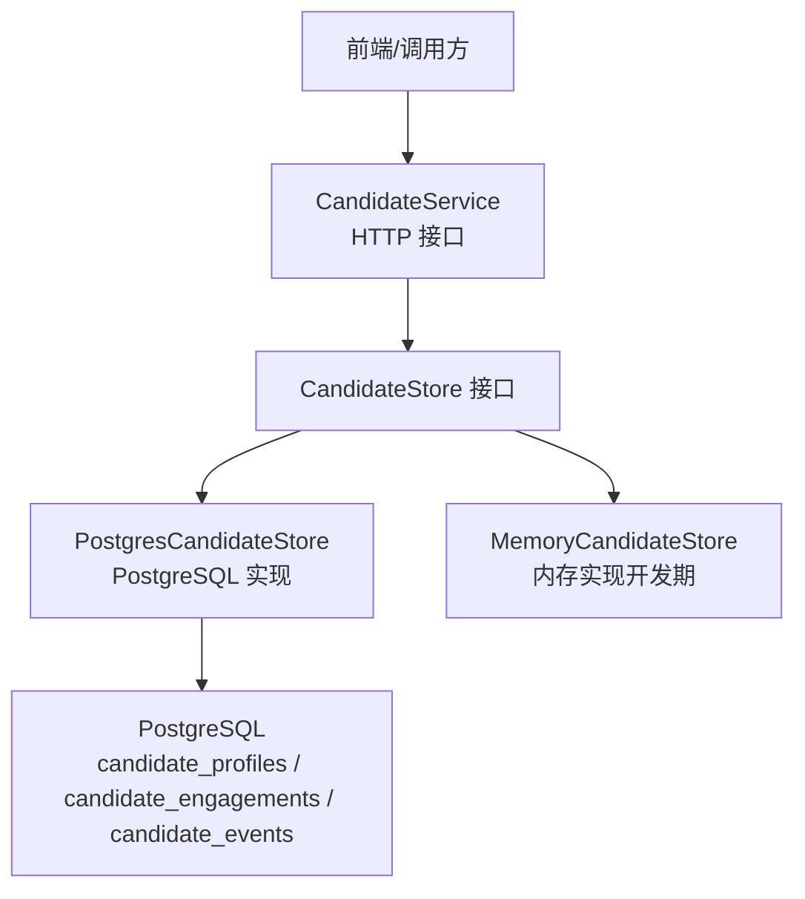
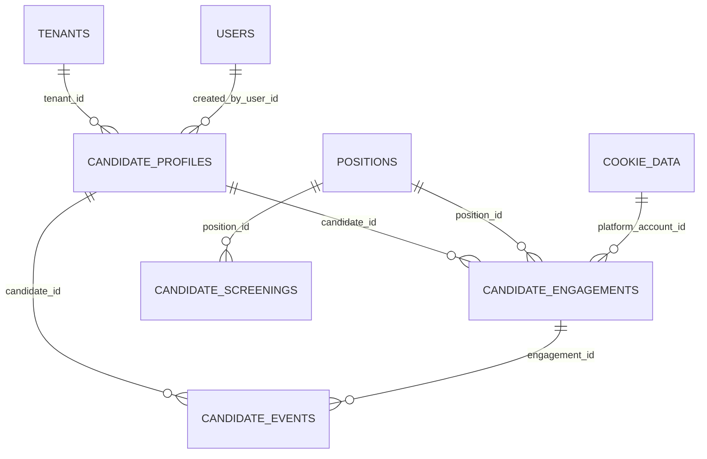
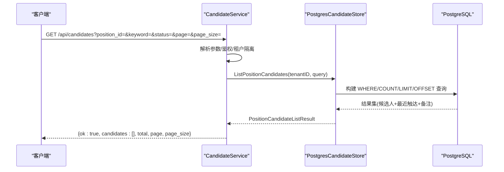
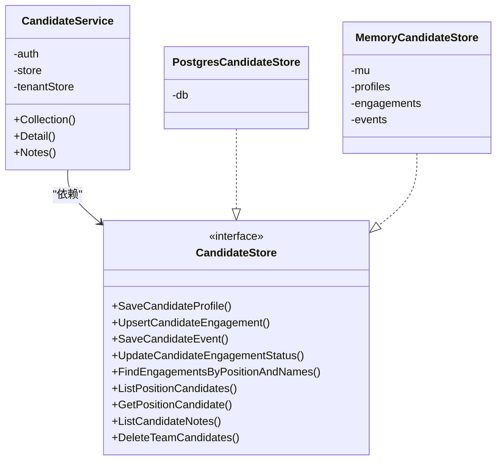
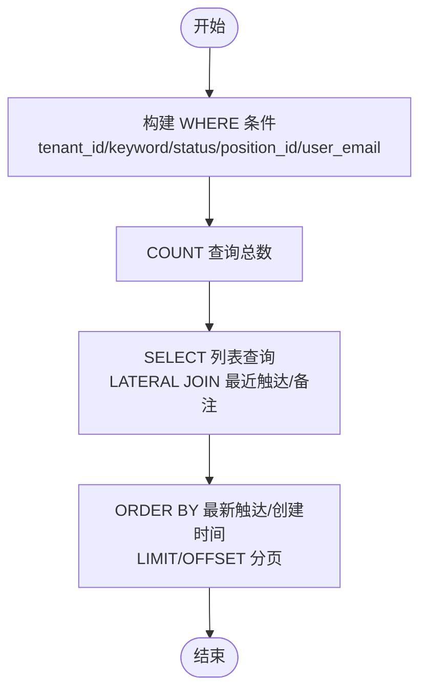

# 候选人数据存储

<cite>
**本文引用的文件**
- [candidate_store_pg.go](file://goodhr5/cloud/backend/internal/httpapi/candidate_store_pg.go)
- [candidate_store.go](file://goodhr5/cloud/backend/internal/httpapi/candidate_store.go)
- [candidate_service.go](file://goodhr5/cloud/backend/internal/httpapi/candidate_service.go)
- [candidate.go](file://goodhr5/cloud/backend/internal/httpapi/candidate.go)
- [0028_candidate_profile_engagement_events.sql](file://goodhr5/cloud/backend/db/migrations/0028_candidate_profile_engagement_events.sql)
- [0050_simplify_candidate_resume_schema.sql](file://goodhr5/cloud/backend/db/migrations/0050_simplify_candidate_resume_schema.sql)
- [0080_candidate_screenings.sql](file://goodhr5/cloud/backend/db/migrations/0080_candidate_screenings.sql)
- [0081_resume_tracking.sql](file://goodhr5/cloud/backend/db/migrations/0081_resume_tracking.sql)
- [config.go](file://goodhr5/cloud/backend/internal/httpapi/config.go)
</cite>

## 目录
1. [简介](#简介)
2. [项目结构](#项目结构)
3. [核心组件](#核心组件)
4. [架构总览](#架构总览)
5. [详细组件分析](#详细组件分析)
6. [依赖关系分析](#依赖关系分析)
7. [性能与索引优化](#性能与索引优化)
8. [事务、并发与一致性](#事务并发与一致性)
9. [数据持久化、备份与迁移](#数据持久化备份与迁移)
10. [查询优化示例](#查询优化示例)
11. [监控与排障](#监控与排障)
12. [结论](#结论)

## 简介
本文件面向候选人数据存储系统，围绕 PostgreSQL 表结构设计、索引策略、查询调优、CRUD 实现、事务与并发控制、备份恢复与数据迁移进行系统化说明。目标是帮助开发者理解并维护高效、可扩展的候选人数据持久化方案。

## 项目结构
候选人数据在云端后端以“接口 + 内存实现 + PostgreSQL 实现”的分层方式组织：
- 存储接口与数据结构定义：位于 httpapi 包中，统一抽象候选人主体、触达上下文、事件流水等能力。
- PostgreSQL 实现：使用原生 sql.DB 执行 SQL，封装 Upsert、分页列表、详情读取、备注写入等逻辑。
- HTTP 服务：CandidateService 暴露简历库列表、详情、备注等 API，负责鉴权、租户隔离与参数校验。
- 数据库迁移：通过 migrations 目录中的 SQL 脚本管理候选人的三表模型演进。

图表来源
- [candidate_service.go:30-79](file://goodhr5/cloud/backend/internal/httpapi/candidate_service.go#L30-L79)
- [candidate_store.go:155-167](file://goodhr5/cloud/backend/internal/httpapi/candidate_store.go#L155-L167)
- [candidate_store_pg.go:14-22](file://goodhr5/cloud/backend/internal/httpapi/candidate_store_pg.go#L14-L22)

章节来源
- [candidate_service.go:30-79](file://goodhr5/cloud/backend/internal/httpapi/candidate_service.go#L30-L79)
- [candidate_store.go:155-167](file://goodhr5/cloud/backend/internal/httpapi/candidate_store.go#L155-L167)
- [candidate_store_pg.go:14-22](file://goodhr5/cloud/backend/internal/httpapi/candidate_store_pg.go#L14-L22)

## 核心组件
- CandidateStore 接口：定义候选人主体、触达上下文、事件流水的增删改查能力，屏蔽底层存储差异。
- PostgresCandidateStore：基于 PostgreSQL 的具体实现，提供 Upsert、分页列表、详情读取、备注写入、团队数据清理等。
- MemoryCandidateStore：内存实现，用于开发与测试，行为与 PG 实现保持一致。
- CandidateService：HTTP 服务层，处理简历库列表、详情、备注等请求，完成鉴权、租户隔离、参数校验与响应组装。
- 数据模型：PositionCandidate、CandidateEngagement、CandidateEvent、CandidateNote 等结构体定义统一的数据形态。

章节来源
- [candidate_store.go:12-167](file://goodhr5/cloud/backend/internal/httpapi/candidate_store.go#L12-L167)
- [candidate_store_pg.go:24-295](file://goodhr5/cloud/backend/internal/httpapi/candidate_store_pg.go#L24-L295)
- [candidate_service.go:13-219](file://goodhr5/cloud/backend/internal/httpapi/candidate_service.go#L13-L219)
- [candidate.go:6-153](file://goodhr5/cloud/backend/internal/httpapi/candidate.go#L6-L153)

## 架构总览
候选人数据采用“三表模型”：
- candidate_profiles：候选人主体信息（扁平字段 + JSONB 数组）。
- candidate_engagements：候选人触达上下文（岗位、账号、平台、状态、时间戳）。
- candidate_events：事件流水（AI 分析、打招呼、沟通、邀约等历史）。

此外还有：
- candidate_screenings：扫描记录（打招呼与自动回复共享的筛选状态）。
- resume tracking：在 candidate_engagements 上扩展 resume_state/resume_error/resume_updated_at。

图表来源
- [0028_candidate_profile_engagement_events.sql:6-169](file://goodhr5/cloud/backend/db/migrations/0028_candidate_profile_engagement_events.sql#L6-L169)
- [0080_candidate_screenings.sql:3-30](file://goodhr5/cloud/backend/db/migrations/0080_candidate_screenings.sql#L3-L30)
- [0081_resume_tracking.sql:2-13](file://goodhr5/cloud/backend/db/migrations/0081_resume_tracking.sql#L2-L13)

## 详细组件分析

### 存储接口与数据模型
- CandidateStore 接口定义了保存候选人主体、Upsert 触达上下文、保存事件、更新触达状态、按条件分页查询、获取详情、读取备注、清空团队数据等能力。
- PositionCandidate 聚合了候选人主体、最近一次触达、备注与事件，便于前端展示。
- CandidateEngagement 表示一次触达上下文，包含状态、关键时间戳与简历进度字段。
- CandidateEvent 记录事件流水，支持 AI 评分、原因、输入输出文本、模型与 Token 消耗等。

章节来源
- [candidate_store.go:12-167](file://goodhr5/cloud/backend/internal/httpapi/candidate_store.go#L12-L167)

### PostgreSQL 存储实现
- SaveCandidateProfile：使用 ON CONFLICT 实现幂等插入/更新，唯一键为 (tenant_id, source_platform_id, source_platform_candidate_id)。JSONB 字段通过自定义 Scanner 读写。
- UpsertCandidateEngagement：根据 platform_account_id 是否为空动态选择冲突目标，避免重复触达；更新时保留已有非空时间戳。
- SaveCandidateEvent：写入事件后回写 engagement.last_event_at，保证最新事件时间可快速检索。
- UpdateCandidateEngagementStatus：选择性更新状态与时间字段，未匹配行返回未找到错误。
- ListPositionCandidates：构建 WHERE 条件与 COUNT，使用 LATERAL JOIN 取最近一次触达与最近两条人工备注，支持关键词模糊搜索、状态过滤、分页排序。
- GetPositionCandidate：按团队与用户权限限制读取详情，可选按 engagement_id 过滤，并加载事件流水。
- ListCandidateNotes：从 candidate_events 中筛选 manual_note 类型事件作为备注。
- DeleteTeamCandidates：删除团队下所有候选人主体，关联事件与触达由外键级联删除。

图表来源
- [candidate_service.go:30-79](file://goodhr5/cloud/backend/internal/httpapi/candidate_service.go#L30-L79)
- [candidate_store_pg.go:374-407](file://goodhr5/cloud/backend/internal/httpapi/candidate_store_pg.go#L374-L407)

章节来源
- [candidate_store_pg.go:24-483](file://goodhr5/cloud/backend/internal/httpapi/candidate_store_pg.go#L24-L483)

### HTTP API 与服务层
- Collection：简历库列表接口，支持 position_id、keyword/q、status、page/page_size 等查询参数，非管理员默认按当前用户邮箱过滤。
- Detail：候选人详情接口，支持可选 engagement_id 过滤，返回候选人、备注与事件。
- Notes：备注列表与新增接口，新增备注以 event_type='manual_note' 写入事件表，并通过 metadata.author_email 记录作者。

章节来源
- [candidate_service.go:30-219](file://goodhr5/cloud/backend/internal/httpapi/candidate_service.go#L30-L219)

## 依赖关系分析
- CandidateService 依赖 AuthService（会话）、TenantStore（租户），以及 CandidateStore（存储抽象）。
- PostgresCandidateStore 依赖 sql.DB，内部通过 ensureUserID/userTenantID/candidateTenantID 辅助函数完成租户与权限校验。
- 数据模型在 candidate.go 中定义，被存储与服务层共同使用。

图表来源
- [candidate_service.go:13-28](file://goodhr5/cloud/backend/internal/httpapi/candidate_service.go#L13-L28)
- [candidate_store.go:155-167](file://goodhr5/cloud/backend/internal/httpapi/candidate_store.go#L155-L167)
- [candidate_store_pg.go:14-22](file://goodhr5/cloud/backend/internal/httpapi/candidate_store_pg.go#L14-L22)

章节来源
- [candidate_service.go:13-28](file://goodhr5/cloud/backend/internal/httpapi/candidate_service.go#L13-L28)
- [candidate_store.go:155-167](file://goodhr5/cloud/backend/internal/httpapi/candidate_store.go#L155-L167)
- [candidate_store_pg.go:14-22](file://goodhr5/cloud/backend/internal/httpapi/candidate_store_pg.go#L14-L22)

## 性能与索引优化
- 主表与索引设计
  - candidate_profiles：按 tenant_id + created_at DESC 建立复合索引，提升团队维度分页与时间排序；source 唯一索引保障去重；name 索引支持姓名筛选。
  - candidate_engagements：按 candidate_id + created_at DESC、tenant_id + task_id、tenant_id + position_id 建立索引，支撑触达上下文查询与统计。
  - candidate_events：按 engagement_id + created_at DESC、candidate_id + created_at DESC、event_type + created_at DESC 建立索引，支撑事件流式读取与类型筛选。
  - candidate_screenings：唯一索引与查找索引保障同一岗位同一平台同一候选人仅一条记录，并支持后台分页查看。
- 查询优化要点
  - 列表查询使用 LATERAL JOIN 获取最近触达与备注，减少多次往返。
  - 关键词搜索使用 ILIKE 多列拼接，注意在大表上的成本，必要时考虑生成列或全文索引。
  - 分页使用 LIMIT/OFFSET，结合 ORDER BY latest_engagement.created_at 或 cp.created_at 确保稳定排序。
  - 事件读取限制数量（如 LIMIT 200）避免大结果集拖慢响应。
- 连接池配置
  - 最大打开连接数、空闲连接数与连接生命周期已设置，可根据 QPS 与数据库资源调整。

章节来源
- [0028_candidate_profile_engagement_events.sql:76-169](file://goodhr5/cloud/backend/db/migrations/0028_candidate_profile_engagement_events.sql#L76-L169)
- [0080_candidate_screenings.sql:19-30](file://goodhr5/cloud/backend/db/migrations/0080_candidate_screenings.sql#L19-L30)
- [candidate_store_pg.go:374-407](file://goodhr5/cloud/backend/internal/httpapi/candidate_store_pg.go#L374-L407)
- [config.go:73-86](file://goodhr5/cloud/backend/internal/httpapi/config.go#L73-L86)

## 事务、并发与一致性
- 幂等写入
  - 候选人主体通过 ON CONFLICT 实现幂等插入/更新，避免重复入库。
  - 触达上下文根据 platform_account_id 是否存在动态选择冲突目标，防止重复触达。
- 并发控制
  - 存储层使用数据库层面的唯一约束与冲突处理保证一致性。
  - 内存实现使用互斥锁保护并发访问。
- 事务边界
  - 当前实现多为单条语句操作；如需跨表原子性更新（例如同时更新 engagement 与 events），应在上层封装事务，确保失败回滚。
- 权限与租户隔离
  - 列表与详情均强制 tenant_id 过滤，非管理员按用户邮箱限制可见范围。

章节来源
- [candidate_store_pg.go:24-295](file://goodhr5/cloud/backend/internal/httpapi/candidate_store_pg.go#L24-L295)
- [candidate_store.go:187-452](file://goodhr5/cloud/backend/internal/httpapi/candidate_store.go#L187-L452)
- [candidate_service.go:30-149](file://goodhr5/cloud/backend/internal/httpapi/candidate_service.go#L30-L149)

## 数据持久化、备份与迁移
- 持久化方案
  - 候选人主体、触达上下文、事件流水分别持久化到 PostgreSQL，JSONB 字段承载结构化数组与扩展信息。
  - 简历进度独立字段保存在 candidate_engagements.resume_state/resume_error/resume_updated_at，便于追踪索要流程。
- 备份恢复机制
  - 建议对 PostgreSQL 进行定期全量与增量备份（如 pg_basebackup + WAL 归档），并结合逻辑备份（pg_dump）导出 schema 与数据。
  - 恢复时需先应用迁移脚本，再导入数据，确保版本一致。
- 数据迁移策略
  - 通过 migrations 目录中的 SQL 脚本逐步演进 Schema，包含创建表、添加列、删除列、重建索引等。
  - 重要变更包括：
    - 将旧任务候选人表重构为三表模型（candidate_profiles、candidate_engagements、candidate_events）。
    - 简化简历模型，移除冗余字段，增加 AI 两次分析分数与原因。
    - 引入 candidate_screenings 表，统一打招呼与自动回复的筛选状态。
    - 为 candidate_engagements 增加简历进度相关字段。

章节来源
- [0028_candidate_profile_engagement_events.sql:1-169](file://goodhr5/cloud/backend/db/migrations/0028_candidate_profile_engagement_events.sql#L1-L169)
- [0050_simplify_candidate_resume_schema.sql:1-39](file://goodhr5/cloud/backend/db/migrations/0050_simplify_candidate_resume_schema.sql#L1-L39)
- [0080_candidate_screenings.sql:1-30](file://goodhr5/cloud/backend/db/migrations/0080_candidate_screenings.sql#L1-L30)
- [0081_resume_tracking.sql:1-13](file://goodhr5/cloud/backend/db/migrations/0081_resume_tracking.sql#L1-L13)

## 查询优化示例
- 列表查询
  - 使用 buildCandidateWhere 动态拼装 WHERE 条件，支持 keyword、status、position_id、user_email 等过滤。
  - 使用 LATERAL JOIN 获取最近触达与备注，减少额外查询。
  - 分页使用 LIMIT/OFFSET，ORDER BY latest_engagement.created_at 或 cp.created_at 保证稳定性。
- 详情查询
  - 按 tenant_id 与 candidate_id 精确匹配，可选 engagement_id 过滤，并加载事件流水。
- 备注查询
  - 从 candidate_events 中筛选 event_type='manual_note'，按 created_at 倒序返回。

图表来源
- [candidate_store_pg.go:374-407](file://goodhr5/cloud/backend/internal/httpapi/candidate_store_pg.go#L374-L407)
- [candidate_store_pg.go:540-606](file://goodhr5/cloud/backend/internal/httpapi/candidate_store_pg.go#L540-L606)
- [candidate_store_pg.go:683-729](file://goodhr5/cloud/backend/internal/httpapi/candidate_store_pg.go#L683-L729)

章节来源
- [candidate_store_pg.go:374-407](file://goodhr5/cloud/backend/internal/httpapi/candidate_store_pg.go#L374-L407)
- [candidate_store_pg.go:540-606](file://goodhr5/cloud/backend/internal/httpapi/candidate_store_pg.go#L540-L606)
- [candidate_store_pg.go:683-729](file://goodhr5/cloud/backend/internal/httpapi/candidate_store_pg.go#L683-L729)

## 监控与排障
- 常见问题
  - 未找到记录：更新触达状态时若影响行数为 0，返回未找到错误，需检查 engagement_id 是否正确。
  - 权限问题：非管理员查询详情或列表会被用户邮箱限制，确认会话与租户归属。
  - 关键词搜索性能：ILIKE 在多列上使用可能较慢，建议评估数据规模与索引策略。
- 监控建议
  - 关注数据库慢查询日志，针对列表与详情查询进行 EXPLAIN 分析。
  - 监控连接池使用情况，必要时调整 MaxOpenConns/MaxIdleConns。
  - 对 candidate_events 大表进行分区或归档，避免事件流水增长影响性能。

章节来源
- [candidate_store_pg.go:297-327](file://goodhr5/cloud/backend/internal/httpapi/candidate_store_pg.go#L297-L327)
- [candidate_service.go:113-149](file://goodhr5/cloud/backend/internal/httpapi/candidate_service.go#L113-L149)
- [config.go:73-86](file://goodhr5/cloud/backend/internal/httpapi/config.go#L73-L86)

## 结论
候选人数据存储系统通过清晰的三表模型、完善的索引设计与幂等写入策略，实现了高效、可扩展的持久化方案。服务层提供统一的 CRUD 接口与权限控制，迁移脚本保障了 Schema 的平滑演进。建议在大数据量场景下持续优化关键词搜索与事件流水查询，并结合监控与备份策略保障系统稳定性与可恢复性。