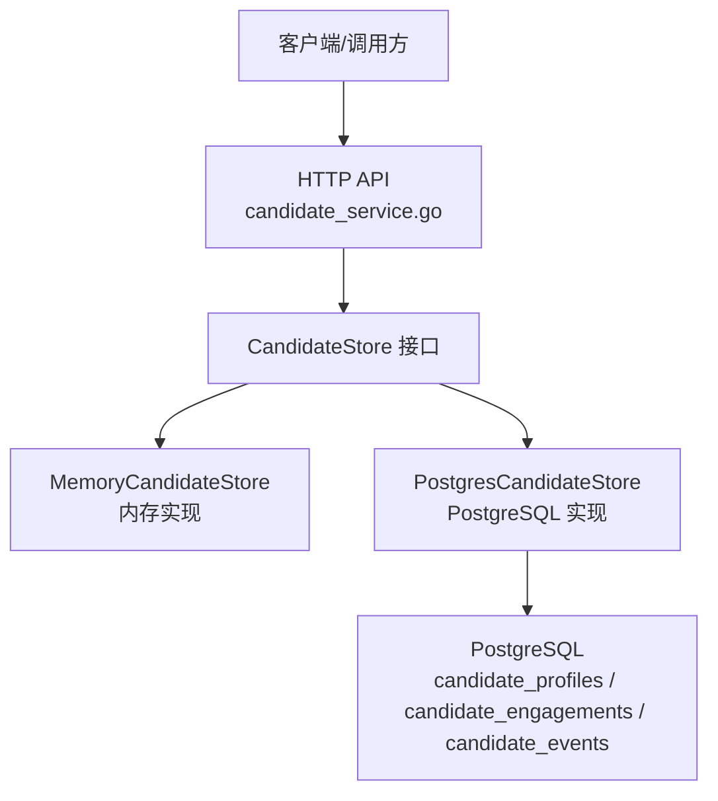
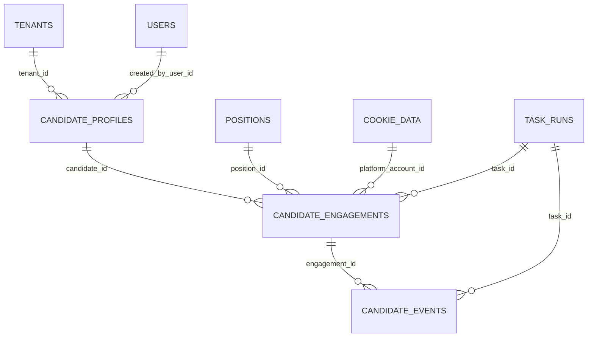
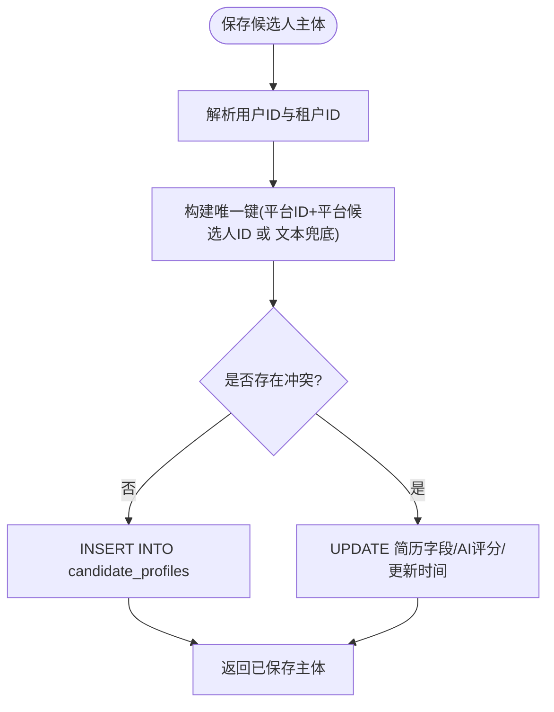
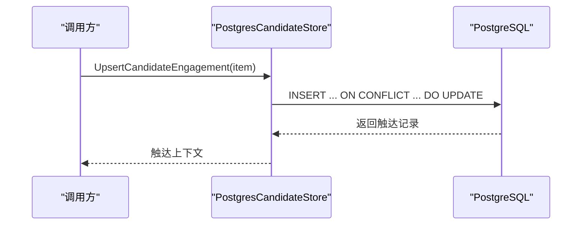
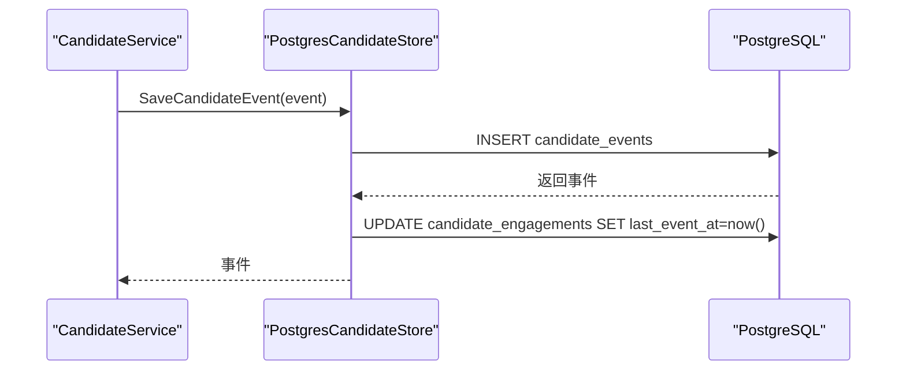
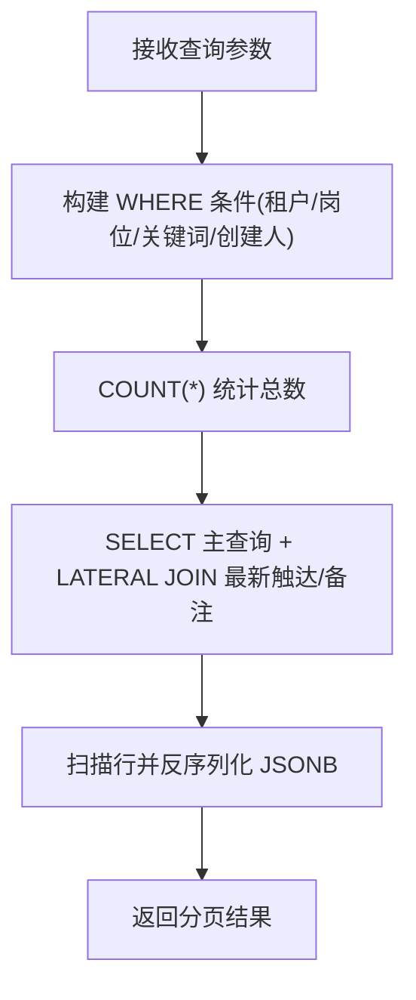
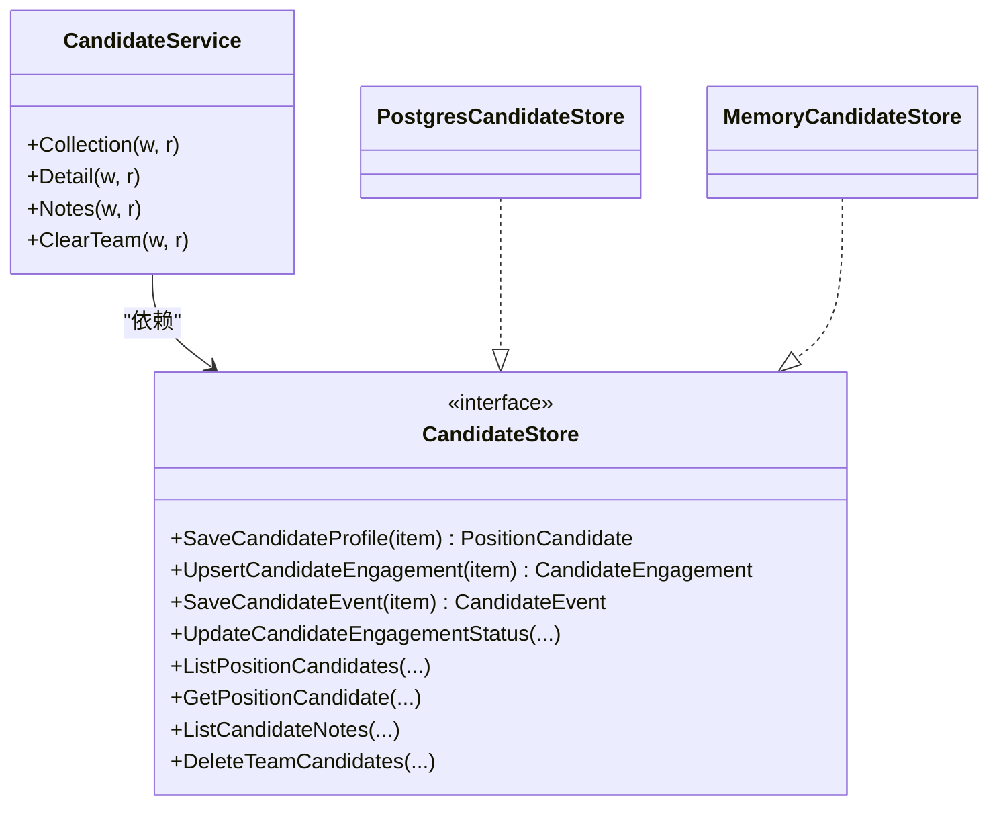

# 候选人数据存储处理

<cite>
**本文引用的文件**
- [candidate_store.go](file://goodhr5/cloud/backend/internal/httpapi/candidate_store.go)
- [candidate_store_pg.go](file://goodhr5/cloud/backend/internal/httpapi/candidate_store_pg.go)
- [candidate_service.go](file://goodhr5/cloud/backend/internal/httpapi/candidate_service.go)
- [candidate.go](file://goodhr5/cloud/backend/internal/httpapi/candidate.go)
- [0028_candidate_profile_engagement_events.sql](file://goodhr5/cloud/backend/db/migrations/0028_candidate_profile_engagement_events.sql)
- [0016_task_candidates.sql](file://goodhr5/cloud/backend/db/migrations/0016_task_candidates.sql)
</cite>

## 目录
1. [简介](#简介)
2. [项目结构](#项目结构)
3. [核心组件](#核心组件)
4. [架构总览](#架构总览)
5. [详细组件分析](#详细组件分析)
6. [依赖关系分析](#依赖关系分析)
7. [性能与并发优化](#性能与并发优化)
8. [故障排查指南](#故障排查指南)
9. [结论](#结论)
10. [附录：数据库操作示例与监控指标](#附录数据库操作示例与监控指标)

## 简介
本文件面向开发者，系统化说明候选人数据的存储处理方案，覆盖以下目标：
- 候选人主体信息存储（简历字段、来源平台标识、首次发现时间等）
- 岗位关联关系管理（触达上下文：候选人-岗位-账号-任务的多维关系）
- AI评分事件记录的数据持久化（AI打分、原因、模型、Token消耗、元数据）
- 数据库表结构设计、索引优化策略、事务与一致性保证
- 批量插入性能优化、并发写入控制、数据一致性保障
- 存储流程图、数据库操作示例、性能监控指标

## 项目结构
后端采用“接口 + 内存实现 + PostgreSQL 实现”的分层设计：
- 接口定义：统一候选人的保存、更新、查询能力
- 内存实现：开发期快速验证
- PostgreSQL 实现：生产级持久化，包含三张核心表与完整索引
- HTTP API 服务：暴露候选人列表、详情、备注等操作

图表来源
- [candidate_service.go:29-76](file://goodhr5/cloud/backend/internal/httpapi/candidate_service.go#L29-L76)
- [candidate_store.go:146-156](file://goodhr5/cloud/backend/internal/httpapi/candidate_store.go#L146-L156)
- [candidate_store_pg.go:14-22](file://goodhr5/cloud/backend/internal/httpapi/candidate_store_pg.go#L14-L22)

章节来源
- [candidate_service.go:29-76](file://goodhr5/cloud/backend/internal/httpapi/candidate_service.go#L29-L76)
- [candidate_store.go:146-156](file://goodhr5/cloud/backend/internal/httpapi/candidate_store.go#L146-L156)
- [candidate_store_pg.go:14-22](file://goodhr5/cloud/backend/internal/httpapi/candidate_store_pg.go#L14-L22)

## 核心组件
- 数据结构与领域模型
  - 候选人主体：姓名、联系方式、期望薪资、教育、经历、AI评分等
  - 触达上下文：一次候选人-岗位-账号的沟通过程，含状态与关键时间戳
  - 事件流水：AI分析、打招呼、聊天、邀约等历史事件，含分数、原因、模型、Token用量、扩展元数据
- 存储接口
  - 保存/更新候选人主体
  - 新增或更新触达上下文
  - 保存事件流水
  - 更新触达状态与关键时间
  - 分页查询候选人列表与详情
  - 读取/新增人工备注
  - 清空团队候选人数据
- 存储实现
  - 内存实现：线程安全、简单高效，适合开发与测试
  - PostgreSQL 实现：使用 ON CONFLICT 去重、JSONB 存储复杂结构、多表关联查询、索引优化

章节来源
- [candidate_store.go:12-156](file://goodhr5/cloud/backend/internal/httpapi/candidate_store.go#L12-L156)
- [candidate_store_pg.go:24-293](file://goodhr5/cloud/backend/internal/httpapi/candidate_store_pg.go#L24-L293)
- [candidate.go:6-143](file://goodhr5/cloud/backend/internal/httpapi/candidate.go#L6-L143)

## 架构总览
候选人数据以“三表模型”组织：
- candidate_profiles：候选人主体（简历字段、来源平台、首次发现时间等）
- candidate_engagements：触达上下文（候选人-岗位-账号-任务的关系与状态）
- candidate_events：事件流水（AI评分、沟通、邀约等）

图表来源
- [0028_candidate_profile_engagement_events.sql:6-169](file://goodhr5/cloud/backend/db/migrations/0028_candidate_profile_engagement_events.sql#L6-L169)

## 详细组件分析

### 候选人主体存储（Upsert 与唯一性）
- 唯一键策略
  - 基于 tenant_id + source_platform_id + source_platform_candidate_id 的唯一索引，确保同一平台下的同一候选人只保留一份主体
  - 若平台未提供稳定 ID，则通过姓名、电话、邮箱、地区、年限、基础信息等拼接生成兜底键
- Upsert 语义
  - 使用 ON CONFLICT DO UPDATE 更新简历字段、AI 评分、首次发现时间等
  - created_by_user_id 在首次创建时记录，后续不覆盖
- JSONB 字段
  - 工作经历、教育、证书、荣誉、项目经验、同事沟通等复杂结构以 JSONB 存储，便于灵活扩展
- 审计字段
  - first_seen_at、created_at、updated_at 用于追踪生命周期

图表来源
- [candidate_store_pg.go:24-161](file://goodhr5/cloud/backend/internal/httpapi/candidate_store_pg.go#L24-L161)
- [0028_candidate_profile_engagement_events.sql:6-82](file://goodhr5/cloud/backend/db/migrations/0028_candidate_profile_engagement_events.sql#L6-L82)

章节来源
- [candidate_store_pg.go:24-161](file://goodhr5/cloud/backend/internal/httpapi/candidate_store_pg.go#L24-L161)
- [candidate_store.go:200-248](file://goodhr5/cloud/backend/internal/httpapi/candidate_store.go#L200-L248)
- [0028_candidate_profile_engagement_events.sql:6-82](file://goodhr5/cloud/backend/db/migrations/0028_candidate_profile_engagement_events.sql#L6-L82)

### 岗位关联关系管理（触达上下文）
- 触达上下文含义
  - 表示某次候选人-岗位-账号的沟通过程，包含状态（如 created/analyzed/greeted/skipped/failed）与关键时间（首次发现、详情抓取、打招呼成功、最近事件）
- 唯一性与幂等
  - 根据是否携带 platform_account_id 选择不同冲突目标，避免重复创建相同触达
  - 使用 COALESCE 保护首次发现时间与关键时间不被空值覆盖
- 查询优化
  - 列表查询通过 LATERAL JOIN 获取最新触达，并聚合最近两条人工备注
  - 支持按岗位、关键词、创建人筛选与分页

图表来源
- [candidate_store_pg.go:163-230](file://goodhr5/cloud/backend/internal/httpapi/candidate_store_pg.go#L163-L230)
- [0028_candidate_profile_engagement_events.sql:83-122](file://goodhr5/cloud/backend/db/migrations/0028_candidate_profile_engagement_events.sql#L83-L122)

章节来源
- [candidate_store_pg.go:163-230](file://goodhr5/cloud/backend/internal/httpapi/candidate_store_pg.go#L163-L230)
- [candidate_store.go:250-262](file://goodhr5/cloud/backend/internal/httpapi/candidate_store.go#L250-L262)
- [0028_candidate_profile_engagement_events.sql:83-122](file://goodhr5/cloud/backend/db/migrations/0028_candidate_profile_engagement_events.sql#L83-L122)

### AI评分事件记录（事件流水）
- 事件内容
  - 类型（detail_analysis/greet_analysis/review_analysis/greet_success 等）、分数、原因、输入输出文本、消息文本、模型名称、Token 用量、扩展元数据
- 写入流程
  - 单条 INSERT 到 candidate_events，随后异步更新对应触达上下文的 last_event_at 与 updated_at
- 查询限制
  - 详情加载时最多读取最近 200 条事件，避免大结果集影响响应时间
- 人工备注
  - 通过 event_type = 'manual_note' 的事件记录备注，支持作者邮箱等元数据

图表来源
- [candidate_store_pg.go:232-293](file://goodhr5/cloud/backend/internal/httpapi/candidate_store_pg.go#L232-L293)
- [candidate_service.go:186-212](file://goodhr5/cloud/backend/internal/httpapi/candidate_service.go#L186-L212)
- [0028_candidate_profile_engagement_events.sql:123-169](file://goodhr5/cloud/backend/db/migrations/0028_candidate_profile_engagement_events.sql#L123-L169)

章节来源
- [candidate_store_pg.go:232-293](file://goodhr5/cloud/backend/internal/httpapi/candidate_store_pg.go#L232-L293)
- [candidate_service.go:186-212](file://goodhr5/cloud/backend/internal/httpapi/candidate_service.go#L186-L212)
- [0028_candidate_profile_engagement_events.sql:123-169](file://goodhr5/cloud/backend/db/migrations/0028_candidate_profile_engagement_events.sql#L123-L169)

### 列表与详情查询
- 列表查询
  - 通过 candidateSelectSQL 组装主查询，LEFT JOIN LATERAL 获取最新触达与最近备注
  - 支持按岗位、关键词、创建人过滤，分页 LIMIT/OFFSET
- 详情查询
  - 按候选人 ID 与可选 engagement_id 精确读取，非管理员需校验创建人权限
  - 单独加载事件列表（最多 200 条）

图表来源
- [candidate_store_pg.go:325-357](file://goodhr5/cloud/backend/internal/httpapi/candidate_store_pg.go#L325-L357)
- [candidate_store_pg.go:489-551](file://goodhr5/cloud/backend/internal/httpapi/candidate_store_pg.go#L489-L551)
- [candidate_store_pg.go:624-651](file://goodhr5/cloud/backend/internal/httpapi/candidate_store_pg.go#L624-L651)

章节来源
- [candidate_store_pg.go:325-357](file://goodhr5/cloud/backend/internal/httpapi/candidate_store_pg.go#L325-L357)
- [candidate_store_pg.go:489-551](file://goodhr5/cloud/backend/internal/httpapi/candidate_store_pg.go#L489-L551)
- [candidate_store_pg.go:624-651](file://goodhr5/cloud/backend/internal/httpapi/candidate_store_pg.go#L624-L651)

## 依赖关系分析
- 组件耦合
  - CandidateService 依赖 AuthService、TenantStore、CandidateStore
  - PostgresCandidateStore 依赖 sql.DB，并通过 ensureUserID/userTenantID/candidateTenantID 进行租户隔离
- 外部依赖
  - PostgreSQL 唯一索引与外键约束保证数据一致性与完整性
  - JSONB 字段提升灵活性，但需注意查询性能与索引策略

图表来源
- [candidate_service.go:12-27](file://goodhr5/cloud/backend/internal/httpapi/candidate_service.go#L12-L27)
- [candidate_store.go:146-156](file://goodhr5/cloud/backend/internal/httpapi/candidate_store.go#L146-L156)
- [candidate_store_pg.go:14-22](file://goodhr5/cloud/backend/internal/httpapi/candidate_store_pg.go#L14-L22)

章节来源
- [candidate_service.go:12-27](file://goodhr5/cloud/backend/internal/httpapi/candidate_service.go#L12-L27)
- [candidate_store.go:146-156](file://goodhr5/cloud/backend/internal/httpapi/candidate_store.go#L146-L156)
- [candidate_store_pg.go:14-22](file://goodhr5/cloud/backend/internal/httpapi/candidate_store_pg.go#L14-L22)

## 性能与并发优化
- 索引优化策略
  - 候选人主体：tenant_id + created_at 加速分页；source_platform_id + source_platform_candidate_id 唯一索引保证幂等；tenant_id + candidate_name 加速模糊搜索
  - 触达上下文：candidate_id + created_at 加速按候选人排序；tenant_id + task_id/position_id 加速按任务/岗位聚合
  - 事件流水：engagement_id + created_at、candidate_id + created_at、event_type + created_at 加速按触达/候选人/类型检索
- 并发写入控制
  - 内存实现使用互斥锁保证线程安全
  - PostgreSQL 实现通过唯一索引与 ON CONFLICT 保证高并发下的幂等写入
- 事务与一致性
  - 当前实现多为单语句事务（QueryRowContext/ExecContext），通过数据库外键与级联删除保证一致性
  - 事件写入后更新触达上下文 last_event_at，保持最近事件时间准确
- 批量插入建议
  - 当前代码为逐条插入，建议在业务侧对高频事件写入进行批量化（例如分批提交、使用 COPY 或批量 INSERT），以降低网络往返与锁竞争
  - 对于大量候选人入库，可考虑先落库主体，再批量写入事件，最后批量更新触达上下文
- 查询性能
  - 列表查询使用 LATERAL JOIN 与 LIMIT 控制结果集大小
  - 详情加载事件限制为 200 条，避免大结果集拖慢响应
  - 关键词搜索使用 ILIKE 匹配多个字段，注意在大表上可能产生全表扫描，建议结合全文索引或搜索引擎优化

章节来源
- [0028_candidate_profile_engagement_events.sql:76-169](file://goodhr5/cloud/backend/db/migrations/0028_candidate_profile_engagement_events.sql#L76-L169)
- [candidate_store_pg.go:325-357](file://goodhr5/cloud/backend/internal/httpapi/candidate_store_pg.go#L325-L357)
- [candidate_store_pg.go:435-487](file://goodhr5/cloud/backend/internal/httpapi/candidate_store_pg.go#L435-L487)
- [candidate_store.go:176-198](file://goodhr5/cloud/backend/internal/httpapi/candidate_store.go#L176-L198)

## 故障排查指南
- 常见错误
  - 未找到：当更新触达状态或删除团队数据时，若影响行为为 0，返回未找到错误
  - 唯一冲突：PostgreSQL 唯一索引冲突码 23505，可用于识别重复写入
- 排查步骤
  - 检查租户与用户绑定是否正确（ensureUserID/userTenantID）
  - 核对候选人唯一键（平台ID+平台候选人ID 或 文本兜底）是否合理
  - 查看事件流水是否按预期写入，last_event_at 是否更新
  - 列表/详情查询时确认 WHERE 条件与索引命中情况

章节来源
- [candidate_store_pg.go:295-323](file://goodhr5/cloud/backend/internal/httpapi/candidate_store_pg.go#L295-L323)
- [candidate_store_pg.go:653-673](file://goodhr5/cloud/backend/internal/httpapi/candidate_store_pg.go#L653-L673)
- [platform_account_store_pg.go:141-148](file://goodhr5/cloud/backend/internal/httpapi/platform_account_store_pg.go#L141-L148)

## 结论
本方案通过“三表模型”清晰分离候选人主体、触达上下文与事件流水，结合唯一索引与 ON CONFLICT 实现幂等写入，利用 JSONB 存储复杂结构并配合 LATERAL JOIN 提升查询效率。在生产环境中，建议进一步引入批量写入与更细粒度的索引优化，以满足高并发与大数据量场景下的性能需求。

## 附录：数据库操作示例与监控指标

### 数据库操作示例（概念性）
- 保存候选人主体
  - 输入：租户ID、用户ID、平台ID、平台候选人ID、简历字段、AI评分、首次发现时间
  - 动作：INSERT ... ON CONFLICT DO UPDATE
  - 输出：已保存的候选人主体
- 新增或更新触达上下文
  - 输入：租户ID、候选人ID、岗位ID、平台账号ID、平台ID、状态、关键时间
  - 动作：INSERT ... ON CONFLICT DO UPDATE（根据是否携带平台账号ID选择冲突目标）
  - 输出：触达上下文
- 保存事件流水
  - 输入：租户ID、候选人ID、触达ID、岗位ID、平台账号ID、平台ID、事件类型、分数、原因、输入输出文本、消息文本、模型、Token用量、元数据
  - 动作：INSERT candidate_events；UPDATE candidate_engagements SET last_event_at=now()
  - 输出：事件记录
- 列表与详情
  - 列表：按租户、岗位、关键词、创建人过滤，LIMIT/OFFSET 分页
  - 详情：按候选人ID与可选 engagement_id 读取，附带最近事件（最多 200 条）

章节来源
- [candidate_store_pg.go:24-161](file://goodhr5/cloud/backend/internal/httpapi/candidate_store_pg.go#L24-L161)
- [candidate_store_pg.go:163-230](file://goodhr5/cloud/backend/internal/httpapi/candidate_store_pg.go#L163-L230)
- [candidate_store_pg.go:232-293](file://goodhr5/cloud/backend/internal/httpapi/candidate_store_pg.go#L232-L293)
- [candidate_store_pg.go:325-357](file://goodhr5/cloud/backend/internal/httpapi/candidate_store_pg.go#L325-L357)
- [candidate_store_pg.go:435-487](file://goodhr5/cloud/backend/internal/httpapi/candidate_store_pg.go#L435-L487)

### 性能监控指标（建议）
- 写入类
  - 候选人主体写入耗时（P95/P99）
  - 触达上下文写入耗时与冲突率（ON CONFLICT 比例）
  - 事件写入吞吐（每秒写入行数）与延迟分布
- 查询类
  - 列表查询耗时（按分页大小与过滤条件分层）
  - 详情查询耗时（事件加载数量与 JSONB 反序列化耗时）
- 资源类
  - 数据库连接池使用率与等待时间
  - CPU/IO 峰值与锁等待（尤其是并发写入时的锁竞争）
- 一致性类
  - 唯一冲突次数与重试成功率
  - 外键约束违反次数（应接近 0）

[本节为通用指导，不直接分析具体文件]