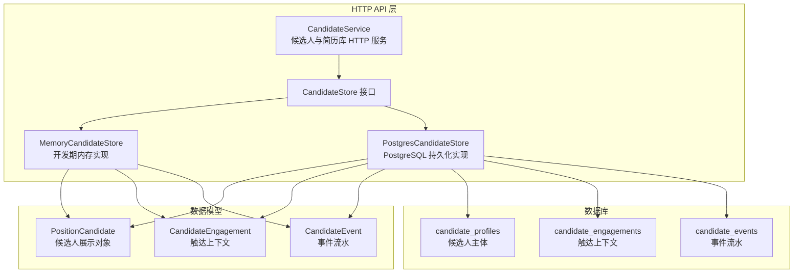
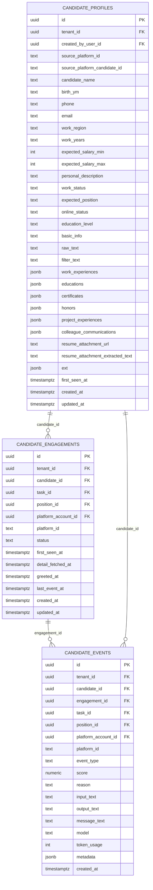
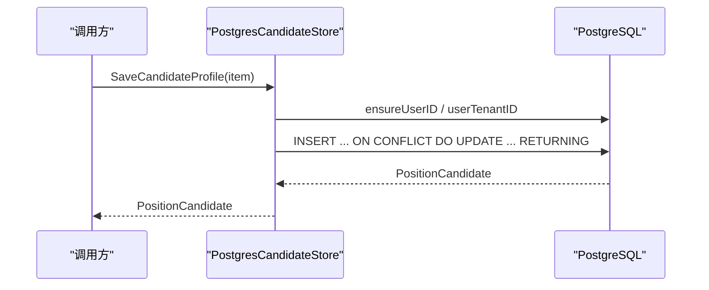
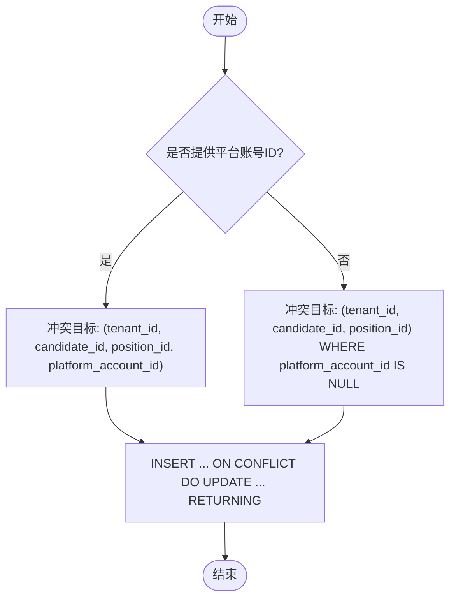
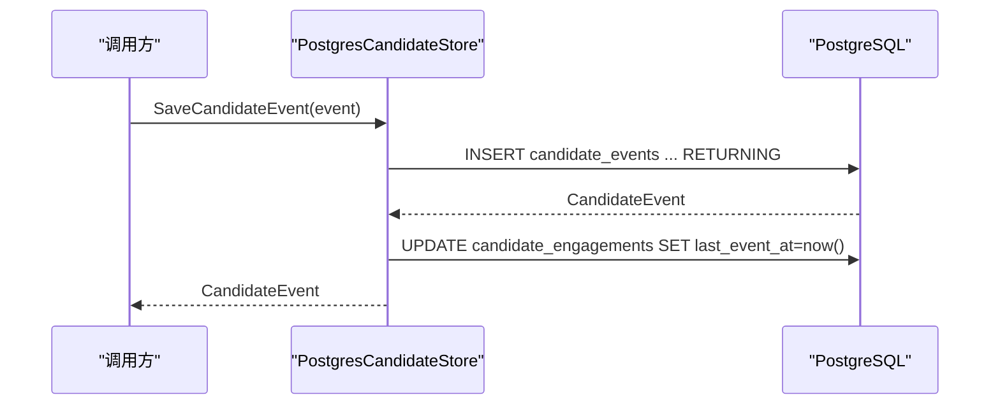
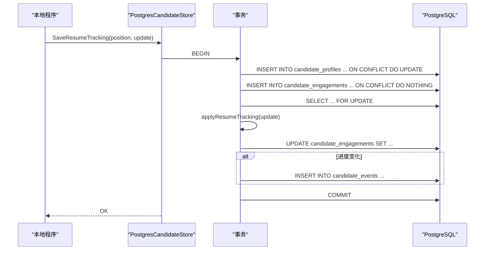
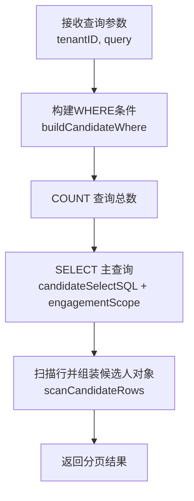
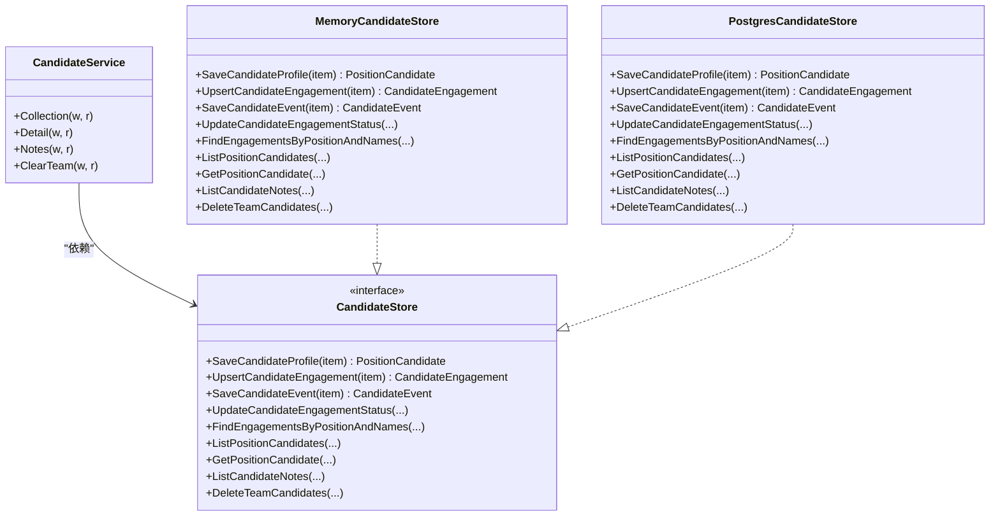

# 候选人数据存储处理

<cite>
**本文引用的文件**   
- [candidate_store_pg.go](file://goodhr5/cloud/backend/internal/httpapi/candidate_store_pg.go)
- [candidate_store.go](file://goodhr5/cloud/backend/internal/httpapi/candidate_store.go)
- [candidate_service.go](file://goodhr5/cloud/backend/internal/httpapi/candidate_service.go)
- [candidate.go](file://goodhr5/cloud/backend/internal/httpapi/candidate.go)
- [resume_tracking_store.go](file://goodhr5/cloud/backend/internal/httpapi/resume_tracking_store.go)
- [0028_candidate_profile_engagement_events.sql](file://goodhr5/cloud/backend/db/migrations/0028_candidate_profile_engagement_events.sql)
</cite>

## 目录
1. [引言](#引言)
2. [项目结构](#项目结构)
3. [核心组件](#核心组件)
4. [架构总览](#架构总览)
5. [详细组件分析](#详细组件分析)
6. [依赖关系分析](#依赖关系分析)
7. [性能与优化](#性能与优化)
8. [故障排查指南](#故障排查指南)
9. [结论](#结论)
10. [附录：数据库操作示例](#附录数据库操作示例)

## 引言
本文件面向开发者，系统化说明 GoodHR 云端后端中“候选人数据存储处理”的设计与实现。重点覆盖以下方面：
- 候选人主体信息存储（简历字段、来源平台标识、AI 评分等）
- 岗位关联关系管理（触达上下文、状态、关键时间戳）
- AI 评分事件记录（事件流水、模型、Token 消耗、扩展元数据）
- 数据库表结构设计、索引策略、事务机制
- 批量插入与并发写入控制、数据一致性保证
- 存储流程图、数据库操作示例、性能监控指标建议

## 项目结构
候选人相关代码位于云端后端 HTTP API 层，采用“接口 + 内存实现 + PostgreSQL 实现”的分层设计；迁移脚本定义数据库三表模型。

图表来源
- [candidate_service.go:13-28](file://goodhr5/cloud/backend/internal/httpapi/candidate_service.go#L13-L28)
- [candidate_store.go:155-167](file://goodhr5/cloud/backend/internal/httpapi/candidate_store.go#L155-L167)
- [candidate_store_pg.go:14-22](file://goodhr5/cloud/backend/internal/httpapi/candidate_store_pg.go#L14-L22)
- [0028_candidate_profile_engagement_events.sql:6-169](file://goodhr5/cloud/backend/db/migrations/0028_candidate_profile_engagement_events.sql#L6-L169)

章节来源
- [candidate_service.go:13-28](file://goodhr5/cloud/backend/internal/httpapi/candidate_service.go#L13-L28)
- [candidate_store.go:155-167](file://goodhr5/cloud/backend/internal/httpapi/candidate_store.go#L155-L167)
- [candidate_store_pg.go:14-22](file://goodhr5/cloud/backend/internal/httpapi/candidate_store_pg.go#L14-L22)
- [0028_candidate_profile_engagement_events.sql:6-169](file://goodhr5/cloud/backend/db/migrations/0028_candidate_profile_engagement_events.sql#L6-L169)

## 核心组件
- CandidateService：对外暴露简历库列表、候选人详情、备注等 HTTP 接口，负责鉴权、租户范围校验、参数解析与结果序列化。
- CandidateStore 接口：统一抽象候选人主体、触达上下文、事件流水的读写能力。
- MemoryCandidateStore：开发期内存实现，使用互斥锁保护并发访问。
- PostgresCandidateStore：生产期 PostgreSQL 实现，封装 SQL 查询、JSONB 读写、分页、过滤、事务与并发控制。
- 数据模型：PositionCandidate、CandidateEngagement、CandidateEvent、CandidateNote 等，贯穿 API 请求、存储与响应。

章节来源
- [candidate_service.go:13-28](file://goodhr5/cloud/backend/internal/httpapi/candidate_service.go#L13-L28)
- [candidate_store.go:12-167](file://goodhr5/cloud/backend/internal/httpapi/candidate_store.go#L12-L167)
- [candidate_store_pg.go:14-22](file://goodhr5/cloud/backend/internal/httpapi/candidate_store_pg.go#L14-L22)

## 架构总览
候选人数据以“三表模型”组织：
- candidate_profiles：候选人主体，仅保存简历字段与基础信息，不耦合岗位、账号与 AI 分析结果。
- candidate_engagements：触达上下文，表示一次任务/岗位/账号下的沟通过程，包含状态与关键时间。
- candidate_events：事件流水，记录 AI 分析、打招呼、聊天、邀约等历史，支持分数、原因、输入输出文本、模型与 Token 用量。

图表来源
- [0028_candidate_profile_engagement_events.sql:6-169](file://goodhr5/cloud/backend/db/migrations/0028_candidate_profile_engagement_events.sql#L6-L169)

## 详细组件分析

### 候选人主体存储（SaveCandidateProfile）
- 功能：新增或更新候选人主体，按“租户+来源平台+来源平台候选人ID”去重；若冲突则更新简历字段与 AI 评分等。
- 关键点：
  - 通过 ensureUserID/userTenantID 获取用户与租户 ID，确保多租户隔离。
  - 使用 ON CONFLICT DO UPDATE 实现幂等写入，避免重复建档。
  - JSONB 字段（工作经历、教育、证书、荣誉、项目经验、沟通记录）统一序列化为 JSONB 存储。
  - 返回完整候选人主体，供上层组装岗位关联与事件。

图表来源
- [candidate_store_pg.go:24-161](file://goodhr5/cloud/backend/internal/httpapi/candidate_store_pg.go#L24-L161)

章节来源
- [candidate_store_pg.go:24-161](file://goodhr5/cloud/backend/internal/httpapi/candidate_store_pg.go#L24-L161)
- [candidate_store.go:12-102](file://goodhr5/cloud/backend/internal/httpapi/candidate_store.go#L12-L102)

### 岗位关联关系管理（UpsertCandidateEngagement）
- 功能：新增或更新触达上下文，表达“候选人-岗位-平台账号”的关系与状态。
- 关键点：
  - 根据是否传入 platform_account_id 动态选择冲突目标，分别维护“有账号触达”和“无账号池化触达”。
  - 使用 COALESCE 保留已有时间戳，避免覆盖更精确的时间。
  - 返回最新触达上下文，便于后续事件追加与状态推进。

图表来源
- [candidate_store_pg.go:163-230](file://goodhr5/cloud/backend/internal/httpapi/candidate_store_pg.go#L163-L230)

章节来源
- [candidate_store_pg.go:163-230](file://goodhr5/cloud/backend/internal/httpapi/candidate_store_pg.go#L163-L230)

### AI 评分事件记录（SaveCandidateEvent）
- 功能：保存候选人事件流水，包括 AI 评分、原因、输入输出文本、模型名称、Token 用量与扩展元数据。
- 关键点：
  - 事件写入后，异步更新触达上下文的 last_event_at，用于快速定位最近活动。
  - 事件表支持按 engagement_id 或 candidate_id 查询，便于详情时间线与审计。

图表来源
- [candidate_store_pg.go:232-295](file://goodhr5/cloud/backend/internal/httpapi/candidate_store_pg.go#L232-L295)

章节来源
- [candidate_store_pg.go:232-295](file://goodhr5/cloud/backend/internal/httpapi/candidate_store_pg.go#L232-L295)

### 简历进度与事务一致性（SaveResumeTracking）
- 功能：原子保存候选人档案、岗位关系与进度事件，避免重复建档、覆盖正文或累加岗位统计。
- 关键点：
  - 使用独立事务 BeginTx，确保多步写操作的原子性。
  - 先 upsert 候选人主体，再 upsert 触达上下文（无账号池化），然后 FOR UPDATE 锁定行并推进进度。
  - 仅在进度发生变化时追加事件，避免冗余事件。
  - 应用层 applyResumeTracking 保证进度不回退、失败原因独立保存。

图表来源
- [resume_tracking_store.go:94-141](file://goodhr5/cloud/backend/internal/httpapi/resume_tracking_store.go#L94-L141)

章节来源
- [resume_tracking_store.go:21-45](file://goodhr5/cloud/backend/internal/httpapi/resume_tracking_store.go#L21-L45)
- [resume_tracking_store.go:94-141](file://goodhr5/cloud/backend/internal/httpapi/resume_tracking_store.go#L94-L141)

### 列表与详情查询（ListPositionCandidates / GetPositionCandidate）
- 列表：
  - 支持按团队、岗位、关键词、状态筛选，分页返回候选人列表。
  - 使用 LATERAL JOIN 获取每个候选人的最新触达上下文与最近备注，减少 N+1 查询。
- 详情：
  - 按候选人 ID 读取当前团队内候选人详情，可选指定 engagement_id。
  - 加载该触达上下文的事件流水（限制数量，避免大对象）。

图表来源
- [candidate_store_pg.go:374-407](file://goodhr5/cloud/backend/internal/httpapi/candidate_store_pg.go#L374-L407)
- [candidate_store_pg.go:540-606](file://goodhr5/cloud/backend/internal/httpapi/candidate_store_pg.go#L540-L606)
- [candidate_store_pg.go:683-729](file://goodhr5/cloud/backend/internal/httpapi/candidate_store_pg.go#L683-L729)

章节来源
- [candidate_store_pg.go:374-407](file://goodhr5/cloud/backend/internal/httpapi/candidate_store_pg.go#L374-L407)
- [candidate_store_pg.go:409-444](file://goodhr5/cloud/backend/internal/httpapi/candidate_store_pg.go#L409-L444)
- [candidate_store_pg.go:540-606](file://goodhr5/cloud/backend/internal/httpapi/candidate_store_pg.go#L540-L606)
- [candidate_store_pg.go:683-729](file://goodhr5/cloud/backend/internal/httpapi/candidate_store_pg.go#L683-L729)

## 依赖关系分析
- CandidateService 依赖 AuthService、TenantStore 与 CandidateStore。
- CandidateStore 接口由 MemoryCandidateStore 与 PostgresCandidateStore 实现。
- PostgresCandidateStore 直接依赖 sql.DB，执行 SQL 与事务。
- 数据模型在 candidate.go 中定义共享结构，供 API 与存储层共用。

图表来源
- [candidate_service.go:13-28](file://goodhr5/cloud/backend/internal/httpapi/candidate_service.go#L13-L28)
- [candidate_store.go:155-167](file://goodhr5/cloud/backend/internal/httpapi/candidate_store.go#L155-L167)
- [candidate_store_pg.go:14-22](file://goodhr5/cloud/backend/internal/httpapi/candidate_store_pg.go#L14-L22)

章节来源
- [candidate_service.go:13-28](file://goodhr5/cloud/backend/internal/httpapi/candidate_service.go#L13-L28)
- [candidate_store.go:155-167](file://goodhr5/cloud/backend/internal/httpapi/candidate_store.go#L155-L167)
- [candidate_store_pg.go:14-22](file://goodhr5/cloud/backend/internal/httpapi/candidate_store_pg.go#L14-L22)

## 性能与优化

### 索引优化策略
- candidate_profiles：
  - 唯一索引：(tenant_id, source_platform_id, source_platform_candidate_id)，保障来源平台候选人唯一性，提升 upsert 性能。
  - 普通索引：(tenant_id, created_at DESC)、(tenant_id, candidate_name)，支持按团队分页与姓名检索。
- candidate_engagements：
  - 唯一约束：(tenant_id, candidate_id, task_id, position_id, platform_account_id)。
  - 普通索引：(candidate_id, created_at DESC)、(tenant_id, task_id)、(tenant_id, position_id)，支持按候选人、任务、岗位查询。
- candidate_events：
  - 普通索引：(engagement_id, created_at DESC)、(candidate_id, created_at DESC)、(event_type, created_at DESC)，支持事件时间线、按候选人/类型检索。

章节来源
- [0028_candidate_profile_engagement_events.sql:76-81](file://goodhr5/cloud/backend/db/migrations/0028_candidate_profile_engagement_events.sql#L76-L81)
- [0028_candidate_profile_engagement_events.sql:116-121](file://goodhr5/cloud/backend/db/migrations/0028_candidate_profile_engagement_events.sql#L116-L121)
- [0028_candidate_profile_engagement_events.sql:163-168](file://goodhr5/cloud/backend/db/migrations/0028_candidate_profile_engagement_events.sql#L163-L168)

### 事务处理机制
- SaveResumeTracking 使用独立事务，确保候选人主体、触达上下文与事件流水的一致性。
- 使用 FOR UPDATE 锁定触达上下文行，防止并发写入导致进度回退或重复事件。
- 其他写入路径（如 SaveCandidateProfile、UpsertCandidateEngagement、SaveCandidateEvent）为单语句操作，依赖数据库级约束与幂等语义保证一致性。

章节来源
- [resume_tracking_store.go:94-141](file://goodhr5/cloud/backend/internal/httpapi/resume_tracking_store.go#L94-L141)
- [candidate_store_pg.go:24-161](file://goodhr5/cloud/backend/internal/httpapi/candidate_store_pg.go#L24-L161)
- [candidate_store_pg.go:163-230](file://goodhr5/cloud/backend/internal/httpapi/candidate_store_pg.go#L163-L230)
- [candidate_store_pg.go:232-295](file://goodhr5/cloud/backend/internal/httpapi/candidate_store_pg.go#L232-L295)

### 批量插入与并发写入控制
- 当前实现未提供显式批量插入 API；主要写入为单条 upsert 与事件追加。
- 并发控制：
  - 内存实现使用互斥锁保护数据结构。
  - PostgreSQL 实现依赖唯一约束、FOR UPDATE 与事务边界控制并发。
- 建议：
  - 对高频事件写入可考虑批处理队列（例如消息队列 + 消费者批量写入），降低单次事务开销。
  - 对热点候选人（高并发事件）可使用 advisory lock 或分区表分片，缓解锁竞争。

章节来源
- [candidate_store.go:187-210](file://goodhr5/cloud/backend/internal/httpapi/candidate_store.go#L187-L210)
- [resume_tracking_store.go:94-141](file://goodhr5/cloud/backend/internal/httpapi/resume_tracking_store.go#L94-L141)

### 数据一致性保证
- 来源平台候选人唯一键避免重复建档。
- 触达上下文唯一约束与 WHERE 子句区分“有账号触达”与“无账号池化触达”。
- 进度推进逻辑（applyResumeRank）禁止回退，失败原因独立保存。
- 事件追加仅在进度变化时发生，避免冗余事件。

章节来源
- [0028_candidate_profile_engagement_events.sql:78-79](file://goodhr5/cloud/backend/db/migrations/0028_candidate_profile_engagement_events.sql#L78-L79)
- [0028_candidate_profile_engagement_events.sql:98-99](file://goodhr5/cloud/backend/db/migrations/0028_candidate_profile_engagement_events.sql#L98-L99)
- [resume_tracking_store.go:21-45](file://goodhr5/cloud/backend/internal/httpapi/resume_tracking_store.go#L21-L45)

### 性能监控指标建议
- 写入延迟：
  - SaveCandidateProfile、UpsertCandidateEngagement、SaveCandidateEvent 的平均/分位延迟。
- 吞吐：
  - 每秒候选人主体写入数、事件写入数。
- 查询性能：
  - ListPositionCandidates 的 COUNT 与 SELECT 耗时。
  - GetPositionCandidate 的事件加载耗时。
- 资源占用：
  - PostgreSQL CPU、I/O、连接池使用率。
  - 长事务比例与锁等待。
- 业务指标：
  - 候选人首次发现到触达完成的中位数时长。
  - AI 评分事件占比与 Token 消耗趋势。

[本节为通用指导，无需具体文件引用]

## 故障排查指南
- 常见问题：
  - 重复建档：检查来源平台候选人唯一键是否正确设置。
  - 进度回退：确认应用层 applyResumeTracking 逻辑未被绕过。
  - 事件丢失：检查 SaveCandidateEvent 是否在事务外被调用。
  - 列表为空：确认 tenant_id 与权限过滤条件是否正确。
- 诊断步骤：
  - 查看 candidate_engagements.last_event_at 是否更新。
  - 检查 candidate_events.event_type 与 metadata 是否包含预期值。
  - 验证索引是否存在且命中（EXPLAIN ANALYZE）。
  - 核对事务提交与回滚路径。

章节来源
- [candidate_store_pg.go:232-295](file://goodhr5/cloud/backend/internal/httpapi/candidate_store_pg.go#L232-L295)
- [resume_tracking_store.go:21-45](file://goodhr5/cloud/backend/internal/httpapi/resume_tracking_store.go#L21-L45)

## 结论
GoodHR 的候选人数据存储采用清晰的三表模型与接口分层设计，兼顾可扩展性与一致性。通过唯一键、索引、事务与行级锁，系统在高并发场景下仍能保持数据正确性。未来可在事件写入与查询层面引入批处理与缓存策略，进一步提升吞吐与响应速度。

[本节为总结，无需具体文件引用]

## 附录：数据库操作示例

### 候选人主体写入（幂等）
- 行为：按租户+来源平台+来源平台候选人ID 去重；冲突则更新简历字段与 AI 评分。
- 参考路径：[candidate_store_pg.go:24-161](file://goodhr5/cloud/backend/internal/httpapi/candidate_store_pg.go#L24-L161)

### 触达上下文写入（按账号/池化）
- 行为：根据是否提供平台账号ID 选择冲突目标；保留已有时间戳。
- 参考路径：[candidate_store_pg.go:163-230](file://goodhr5/cloud/backend/internal/httpapi/candidate_store_pg.go#L163-L230)

### 事件流水写入（追加）
- 行为：写入事件后更新触达上下文的最近事件时间。
- 参考路径：[candidate_store_pg.go:232-295](file://goodhr5/cloud/backend/internal/httpapi/candidate_store_pg.go#L232-L295)

### 简历进度事务（原子）
- 行为：事务内依次 upsert 主体、upsert 触达、FOR UPDATE 锁定、推进进度、追加事件。
- 参考路径：[resume_tracking_store.go:94-141](file://goodhr5/cloud/backend/internal/httpapi/resume_tracking_store.go#L94-L141)